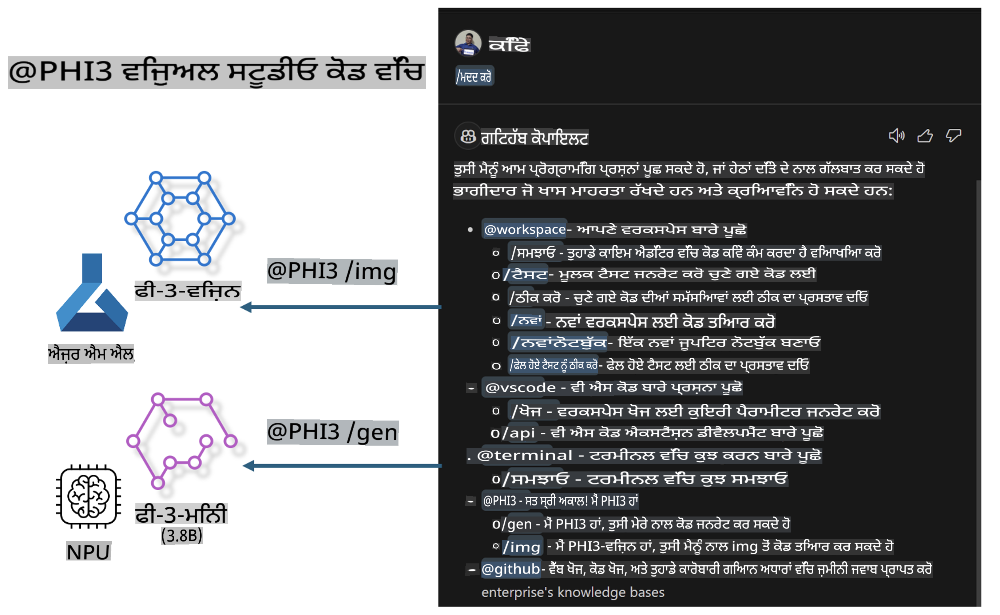

# **ਆਪਣੇ Visual Studio Code GitHub Copilot Chat ਨੂੰ Microsoft Phi-3 Family ਨਾਲ ਬਣਾਓ**

ਕੀ ਤੁਸੀਂ GitHub Copilot Chat ਵਿੱਚ ਵਰਕਸਪੇਸ ਏਜੰਟ ਦੀ ਵਰਤੋਂ ਕੀਤੀ ਹੈ? ਕੀ ਤੁਸੀਂ ਆਪਣੀ ਟੀਮ ਦਾ ਕੋਡ ਏਜੰਟ ਬਣਾਉਣਾ ਚਾਹੁੰਦੇ ਹੋ? ਇਹ ਹੈਂਡਜ਼-ਆਨ ਲੈਬ ਖੁੱਲੇ ਸੋర్స్ ਮਾਡਲ ਨੂੰ ਜੋੜ ਕੇ ਇੱਕ ਐਂਟਰਪ੍ਰਾਈਜ਼-ਪੱਧਰ ਦਾ ਕੋਡ ਬਿਜ਼ਨਸ ਏਜੰਟ ਬਣਾਉਣ ਦੀ ਉਮੀਦ ਕਰਦਾ ਹੈ।

## **ਬੁਨਿਆਦ**

### **Microsoft Phi-3 ਕਿਉਂ ਚੁਣੋ**

Phi-3 ਇੱਕ ਫੈਮਿਲੀ ਸੀਰੀਜ਼ ਹੈ, ਜਿਸ ਵਿੱਚ ਵੱਖ-ਵੱਖ ਟ੍ਰੇਨਿੰਗ ਪੈਰਾਮੀਟਰਾਂ ਦੇ ਆਧਾਰ 'ਤੇ ਟੈਕਸਟ ਜਨਰੇਸ਼ਨ, ਡਾਇਲਾਗ ਕੰਪਲੀਸ਼ਨ, ਅਤੇ ਕੋਡ ਜਨਰੇਸ਼ਨ ਲਈ phi-3-mini, phi-3-small, ਅਤੇ phi-3-medium ਸ਼ਾਮਲ ਹਨ। ਇਸ ਵਿੱਚ Vision ਦੇ ਆਧਾਰ 'ਤੇ phi-3-vision ਵੀ ਸ਼ਾਮਲ ਹੈ। ਇਹ ਐਨਟਰਪ੍ਰਾਈਜ਼ ਜਾਂ ਵੱਖ-ਵੱਖ ਟੀਮਾਂ ਲਈ ਆਫਲਾਈਨ ਜਨਰੇਟਿਵ AI ਹੱਲ ਬਣਾਉਣ ਲਈ ਉਚਿਤ ਹੈ।

ਇਹ ਲਿੰਕ ਪੜ੍ਹਨ ਦੀ ਸਿਫਾਰਸ਼ ਕੀਤੀ ਜਾਂਦੀ ਹੈ [https://github.com/microsoft/PhiCookBook/blob/main/md/01.Introduction/01/01.PhiFamily.md](https://github.com/microsoft/PhiCookBook/blob/main/md/01.Introduction/01/01.PhiFamily.md)

### **Microsoft GitHub Copilot Chat**

GitHub Copilot Chat ਐਕਸਟੈਂਸ਼ਨ ਤੁਹਾਨੂੰ ਇੱਕ ਚੈਟ ਇੰਟਰਫੇਸ ਦਿੰਦਾ ਹੈ ਜਿਸ ਨਾਲ ਤੁਸੀਂ GitHub Copilot ਨਾਲ ਇੰਟਰੈਕਟ ਕਰ ਸਕਦੇ ਹੋ ਅਤੇ ਕੋਡਿੰਗ-ਸੰਬੰਧੀ ਸਵਾਲਾਂ ਦੇ ਜਵਾਬ ਸਿੱਧੇ VS Code ਦੇ ਅੰਦਰ ਹੀ ਪ੍ਰਾਪਤ ਕਰ ਸਕਦੇ ਹੋ, ਬਿਨਾਂ ਦਸਤਾਵੇਜ਼ਾਂ ਨੂੰ ਨੇਵੀਗੇਟ ਕਰਨ ਜਾਂ ਆਨਲਾਈਨ ਫੋਰਮਾਂ ਦੀ ਖੋਜ ਕਰਨ ਦੀ ਲੋੜ ਦੇ।

Copilot Chat ਜਨਰੇਟ ਕੀਤੇ ਜਵਾਬ ਨੂੰ ਸਪੱਸ਼ਟ ਕਰਨ ਲਈ ਸਿੰਟੈਕਸ ਹਾਈਲਾਈਟਿੰਗ, ਇੰਡੈਂਟੇਸ਼ਨ, ਅਤੇ ਹੋਰ ਫਾਰਮੈਟਿੰਗ ਫੀਚਰਾਂ ਦੀ ਵਰਤੋਂ ਕਰ ਸਕਦਾ ਹੈ। ਯੂਜ਼ਰ ਦੇ ਸਵਾਲ ਦੇ ਪ੍ਰਕਾਰ ਦੇ ਆਧਾਰ 'ਤੇ, ਨਤੀਜਾ ਉਸ ਸੰਦਰਭ ਦੇ ਲਿੰਕ ਸ਼ਾਮਲ ਕਰ ਸਕਦਾ ਹੈ ਜੋ Copilot ਨੇ ਜਵਾਬ ਬਣਾਉਣ ਲਈ ਵਰਤੇ ਸਨ, ਜਿਵੇਂ ਕਿ ਸੋਰਸ ਕੋਡ ਫਾਈਲਾਂ ਜਾਂ ਦਸਤਾਵੇਜ਼ਾਂ, ਜਾਂ VS Code ਫੰਕਸ਼ਨਾਲਿਟੀ ਤੱਕ ਪਹੁੰਚ ਕਰਨ ਲਈ ਬਟਨ।

- Copilot Chat ਤੁਹਾਡੇ ਡਿਵੈਲਪਰ ਫਲੋ ਵਿੱਚ ਇੰਟਿਗ੍ਰੇਟ ਹੁੰਦਾ ਹੈ ਅਤੇ ਜਿੱਥੇ ਤੁਹਾਨੂੰ ਲੋੜ ਹੁੰਦੀ ਹੈ ਉੱਥੇ ਮਦਦ ਦਿੰਦਾ ਹੈ:

- ਐਡੀਟਰ ਜਾਂ ਟਰਮੀਨਲ ਤੋਂ ਸਿੱਧੇ ਇੱਕ ਇਨਲਾਈਨ ਚੈਟ ਗੱਲਬਾਤ ਸ਼ੁਰੂ ਕਰੋ ਜਦੋਂ ਤੁਸੀਂ ਕੋਡਿੰਗ ਕਰ ਰਹੇ ਹੋ

- ਚੈਟ ਵਿਊ ਦੀ ਵਰਤੋਂ ਕਰਕੇ AI ਅਸਿਸਟੈਂਟ ਨੂੰ ਸਾਈਡ ਤੇ ਰੱਖੋ ਜੋ ਤੁਹਾਨੂੰ ਕਿਸੇ ਵੀ ਸਮੇਂ ਮਦਦ ਦੇ ਸਕੇ

- ਇੱਕ ਛੋਟਾ ਸਵਾਲ ਪੁੱਛਣ ਲਈ Quick Chat ਲਾਂਚ ਕਰੋ ਅਤੇ ਜੋ ਤੁਸੀਂ ਕਰ ਰਹੇ ਹੋ ਉਸ ਵਿੱਚ ਵਾਪਸ ਲੱਗ ਜਾਓ

ਤੁਸੀਂ GitHub Copilot Chat ਨੂੰ ਵੱਖ-ਵੱਖ ਸਥਿਤੀਆਂ ਵਿੱਚ ਵਰਤ ਸਕਦੇ ਹੋ, ਜਿਵੇਂ:

- ਕਿਸੇ ਸਮੱਸਿਆ ਨੂੰ ਹੱਲ ਕਰਨ ਦੇ ਸਭ ਤੋਂ ਵਧੀਆ ਤਰੀਕੇ ਬਾਰੇ ਕੋਡਿੰਗ ਸਵਾਲਾਂ ਦੇ ਜਵਾਬ ਦੇਣਾ

- ਕਿਸੇ ਹੋਰ ਦੇ ਕੋਡ ਦੀ ਵਿਆਖਿਆ ਕਰਨਾ ਅਤੇ ਸੁਧਾਰ ਸੁਝਾਅ ਦੇਣਾ

- ਕੋਡ ਫਿਕਸ ਪੇਸ਼ ਕਰਨਾ

- ਯੂਨਿਟ ਟੈਸਟ ਕੇਸ ਬਣਾਉਣਾ

- ਕੋਡ ਡੌਕੂਮੈਂਟੇਸ਼ਨ ਬਣਾਉਣਾ

ਇਹ ਲਿੰਕ ਪੜ੍ਹਨ ਦੀ ਸਿਫਾਰਸ਼ ਕੀਤੀ ਜਾਂਦੀ ਹੈ [https://code.visualstudio.com/docs/copilot/copilot-chat](https://code.visualstudio.com/docs/copilot/copilot-chat?WT.mc_id=aiml-137032-kinfeylo)

### **Microsoft GitHub Copilot Chat @workspace**

Copilot Chat ਵਿੱਚ **@workspace** ਦਾ ਹਵਾਲਾ ਲੈ ਕੇ ਤੁਸੀਂ ਆਪਣੇ ਪੂਰੇ ਕੋਡਬੇਸ ਬਾਰੇ ਸਵਾਲ ਪੁੱਛ ਸਕਦੇ ਹੋ। ਸਵਾਲ ਦੇ ਆਧਾਰ 'ਤੇ, Copilot ਸਮਝਦਾਰੀ ਨਾਲ ਸੰਬੰਧਿਤ ਫਾਈਲਾਂ ਅਤੇ ਸਿੰਬਲ ਰਿਕਵਰ ਕਰਦਾ ਹੈ, ਜਿਨ੍ਹਾਂ ਨੂੰ ਇਹ ਆਪਣੇ ਜਵਾਬ ਵਿੱਚ ਲਿੰਕ ਅਤੇ ਕੋਡ ਉਦਾਹਰਣਾਂ ਵਜੋਂ ਹਵਾਲਾ ਦਿੰਦਾ ਹੈ।

ਤੁਹਾਡੇ ਸਵਾਲ ਦਾ ਜਵਾਬ ਦੇਣ ਲਈ, **@workspace** ਉਹੀ ਸਰੋਤ ਖੋਜਦਾ ਹੈ ਜੋ ਇੱਕ ਡਿਵੈਲਪਰ VS Code ਵਿੱਚ ਕੋਡਬੇਸ ਨੂੰ ਨੇਵੀਗੇਟ ਕਰਦੇ ਸਮੇਂ ਵਰਤੇਗਾ:

- ਵਰਕਸਪੇਸ ਵਿੱਚ ਸਾਰੀਆਂ ਫਾਈਲਾਂ, ਬਿਨਾਂ ਉਹਨਾਂ ਫਾਈਲਾਂ ਦੇ ਜੋ .gitignore ਫਾਈਲ ਦੁਆਰਾ ਅਣਡਿੱਠੀ ਕੀਤੀਆਂ ਗਈਆਂ ਹਨ

- ਡਾਇਰੈਕਟਰੀ ਸਟ੍ਰਕਚਰ ਜਿਸ ਵਿੱਚ ਨੈਸਟਡ ਫੋਲਡਰ ਅਤੇ ਫਾਈਲ ਨਾਮ ਸ਼ਾਮਲ ਹਨ

- ਜੇ ਵਰਕਸਪੇਸ ਇੱਕ GitHub ਰਿਪੋਜ਼ਟਰੀ ਹੈ ਅਤੇ ਕੋਡ ਖੋਜ ਦੁਆਰਾ ਇੰਡੈਕਸ ਕੀਤਾ ਗਿਆ ਹੈ ਤਾਂ GitHub ਦਾ ਕੋਡ ਖੋਜ ਇੰਡੈਕਸ

- ਵਰਕਸਪੇਸ ਵਿੱਚ ਸਿੰਬਲ ਅਤੇ ਡੈਫਿਨੀਸ਼ਨ

- ਐਕਟਿਵ ਐਡੀਟਰ ਵਿੱਚ ਚੁਣਿਆ ਗਿਆ ਟੈਕਸਟ ਜਾਂ ਦਿਖਾਈ ਦੇਣ ਵਾਲਾ ਟੈਕਸਟ

ਨੋਟ: ਜੇ ਤੁਸੀਂ ਇੱਕ ਫਾਈਲ ਖੋਲ੍ਹੀ ਹੈ ਜਾਂ ਇੱਕ ਅਣਡਿੱਠੀ ਫਾਈਲ ਵਿੱਚ ਟੈਕਸਟ ਚੁਣਿਆ ਹੈ ਤਾਂ .gitignore ਬਾਈਪਾਸ ਕੀਤਾ ਜਾਂਦਾ ਹੈ।

ਇਹ ਲਿੰਕ ਪੜ੍ਹਨ ਦੀ ਸਿਫਾਰਸ਼ ਕੀਤੀ ਜਾਂਦੀ ਹੈ [[https://code.visualstudio.com/docs/copilot/copilot-chat](https://code.visualstudio.com/docs/copilot/workspace-context?WT.mc_id=aiml-137032-kinfeylo)]

## **ਇਸ ਲੈਬ ਬਾਰੇ ਹੋਰ ਜਾਣੋ**

GitHub Copilot ਨੇ ਐਨਟਰਪ੍ਰਾਈਜ਼ ਦੀ ਕੋਡਿੰਗ ਕੁਸ਼ਲਤਾ ਵਿੱਚ ਬਹੁਤ ਸੁਧਾਰ ਕੀਤਾ ਹੈ, ਅਤੇ ਹਰ ਐਨਟਰਪ੍ਰਾਈਜ਼ GitHub Copilot ਦੇ ਸੰਬੰਧਿਤ ਫੰਕਸ਼ਨਾਂ ਨੂੰ ਕਸਟਮਾਈਜ਼ ਕਰਨ ਦੀ ਉਮੀਦ ਕਰਦਾ ਹੈ। ਬਹੁਤ ਸਾਰੀਆਂ ਕੰਪਨੀਆਂ ਨੇ ਆਪਣੇ ਕਾਰੋਬਾਰੀ ਸਥਿਤੀਆਂ ਅਤੇ ਖੁੱਲੇ ਸੋਰਸ ਮਾਡਲਾਂ ਦੇ ਆਧਾਰ 'ਤੇ GitHub Copilot ਵਰਗੇ ਐਕਸਟੈਂਸ਼ਨਜ਼ ਨੂੰ ਕਸਟਮਾਈਜ਼ ਕੀਤਾ ਹੈ। ਐਨਟਰਪ੍ਰਾਈਜ਼ ਲਈ, ਕਸਟਮਾਈਜ਼ਡ ਐਕਸਟੈਂਸ਼ਨਜ਼ ਨੂੰ ਨਿਯੰਤਰਿਤ ਕਰਨਾ ਆਸਾਨ ਹੁੰਦਾ ਹੈ, ਪਰ ਇਸ ਨਾਲ ਯੂਜ਼ਰ ਅਨੁਭਵ 'ਤੇ ਵੀ ਅਸਰ ਪੈਂਦਾ ਹੈ। ਆਖਰਕਾਰ, ਜਨਰਲ ਸਥਿਤੀਆਂ ਅਤੇ ਪੇਸ਼ੇਵਰਤਾ ਨਾਲ ਨਜਿੱਠਣ ਵਿੱਚ GitHub Copilot ਦੇ ਫੰਕਸ਼ਨ ਮਜ਼ਬੂਤ ਹਨ। ਜੇਕਰ ਅਨੁਭਵ ਸਥਿਰ ਰਹਿ ਸਕੇ, ਤਾਂ ਐਨਟਰਪ੍ਰਾਈਜ਼ ਦੇ ਆਪਣੇ ਐਕਸਟੈਂਸ਼ਨ ਨੂੰ ਕਸਟਮਾਈਜ਼ ਕਰਨਾ ਵਧੀਆ ਹੋਵੇਗਾ। GitHub Copilot Chat ਕੰਪਨੀਆਂ ਨੂੰ ਚੈਟ ਅਨੁਭਵ ਵਿੱਚ ਵਿਸਥਾਰ ਕਰਨ ਲਈ ਸੰਬੰਧਿਤ APIs ਪ੍ਰਦਾਨ ਕਰਦਾ ਹੈ। ਇੱਕ ਸਥਿਰ ਅਨੁਭਵ ਅਤੇ ਕਸਟਮਾਈਜ਼ਡ ਫੰਕਸ਼ਨਾਂ ਦਾ ਹੋਣਾ ਇੱਕ ਵਧੀਆ ਯੂਜ਼ਰ ਅਨੁਭਵ ਹੈ।

ਇਹ ਲੈਬ ਮੁੱਖ ਤੌਰ 'ਤੇ Phi-3 ਮਾਡਲ ਨੂੰ ਸਥਾਨਕ NPU ਅਤੇ Azure ਹਾਈਬ੍ਰਿਡ ਦੇ ਨਾਲ ਜੋੜ ਕੇ GitHub Copilot Chat ਵਿੱਚ ਇੱਕ ਕਸਟਮ ਏਜੰਟ ***@PHI3*** ਬਣਾਉਣ ਲਈ ਵਰਤਦੀ ਹੈ, ਜੋ ਐਨਟਰਪ੍ਰਾਈਜ਼ ਡਿਵੈਲਪਰਾਂ ਨੂੰ ਕੋਡ ਜਨਰੇਸ਼ਨ ***(@PHI3 /gen)*** ਅਤੇ ਚਿੱਤਰਾਂ ਦੇ ਆਧਾਰ 'ਤੇ ਕੋਡ ਜਨਰੇਸ਼ਨ ***(@PHI3 /img)*** ਪੂਰਾ ਕਰਨ ਵਿੱਚ ਸਹਾਇਕ ਹੈ।

### ***ਨੋਟ:*** 

ਇਹ ਲੈਬ ਵਰਤਮਾਨ ਵਿੱਚ Intel CPU ਅਤੇ Apple Silicon ਦੇ AIPC ਵਿੱਚ ਲਾਗੂ ਕੀਤੀ ਗਈ ਹੈ। ਅਸੀਂ Qualcomm ਵਰਜਨ ਦੇ NPU ਨੂੰ ਅਪਡੇਟ ਕਰਦੇ ਰਹਾਂਗੇ।

## **ਲੈਬ**

| ਨਾਮ | ਵੇਰਵਾ | AIPC | Apple |
| ------------ | ----------- | -------- |-------- |
| Lab0 - Installations(✅) | ਸੰਬੰਧਿਤ ਮਾਹੌਲ ਅਤੇ ਇੰਸਟਾਲੇਸ਼ਨ ਟੂਲਜ਼ ਨੂੰ ਸੰਰਚਿਤ ਅਤੇ ਇੰਸਟਾਲ ਕਰੋ | [Go](./HOL/AIPC/01.Installations.md) |[Go](./HOL/Apple/01.Installations.md) |
| Lab1 - Run Prompt flow with Phi-3-mini (✅) | AIPC / Apple Silicon ਦੇ ਨਾਲ ਜੋੜ ਕੇ, ਸਥਾਨਕ NPU ਦੀ ਵਰਤੋਂ ਕਰਕੇ Phi-3-mini ਰਾਹੀਂ ਕੋਡ ਜਨਰੇਸ਼ਨ ਬਣਾਉਣਾ | [Go](./HOL/AIPC/02.PromptflowWithNPU.md) |  [Go](./HOL/Apple/02.PromptflowWithMLX.md) |
| Lab2 - Deploy Phi-3-vision on Azure Machine Learning Service(✅) | Azure Machine Learning Service ਦੇ Model Catalog - Phi-3-vision ਚਿੱਤਰ ਨੂੰ ਡਿਪਲੌਇ ਕਰਕੇ ਕੋਡ ਜਨਰੇਸ਼ਨ ਕਰੋ | [Go](./HOL/AIPC/03.DeployPhi3VisionOnAzure.md) |[Go](./HOL/Apple/03.DeployPhi3VisionOnAzure.md) |
| Lab3 - Create a @phi-3 agent in GitHub Copilot Chat(✅)  | GitHub Copilot Chat ਵਿੱਚ ਇੱਕ ਕਸਟਮ Phi-3 ਏਜੰਟ ਬਣਾਓ ਤਾਂ ਜੋ ਕੋਡ ਜਨਰੇਸ਼ਨ, ਗ੍ਰਾਫ ਜਨਰੇਸ਼ਨ ਕੋਡ, RAG ਆਦਿ ਪੂਰਾ ਕੀਤਾ ਜਾ ਸਕੇ। | [Go](./HOL/AIPC/04.CreatePhi3AgentInVSCode.md) | [Go](./HOL/Apple/04.CreatePhi3AgentInVSCode.md) |
| Sample Code (✅)  | ਸੈਂਪਲ ਕੋਡ ਡਾਊਨਲੋਡ ਕਰੋ | [Go](../../../../../../../code/07.Lab/01/AIPC) | [Go](../../../../../../../code/07.Lab/01/Apple) |

## **ਸਰੋਤ**

1. Phi-3 Cookbook [https://github.com/microsoft/Phi-3CookBook](https://github.com/microsoft/Phi-3CookBook)

2. GitHub Copilot ਬਾਰੇ ਹੋਰ ਸਿੱਖੋ [https://learn.microsoft.com/training/paths/copilot/](https://learn.microsoft.com/training/paths/copilot/?WT.mc_id=aiml-137032-kinfeylo)

3. GitHub Copilot Chat ਬਾਰੇ ਹੋਰ ਸਿੱਖੋ [https://learn.microsoft.com/training/paths/accelerate-app-development-using-github-copilot/](https://learn.microsoft.com/training/paths/accelerate-app-development-using-github-copilot/?WT.mc_id=aiml-137032-kinfeylo)

4. GitHub Copilot Chat API ਬਾਰੇ ਹੋਰ ਸਿੱਖੋ [https://code.visualstudio.com/api/extension-guides/chat](https://code.visualstudio.com/api/extension-guides/chat?WT.mc_id=aiml-137032-kinfeylo)

5. Azure AI Foundry ਬਾਰੇ ਹੋਰ ਸਿੱਖੋ [https://learn.microsoft.com/training/paths/create-custom-copilots-ai-studio/](https://learn.microsoft.com/training/paths/create-custom-copilots-ai-studio/?WT.mc_id=aiml-137032-kinfeylo)

6. Azure AI Foundry ਦੇ Model Catalog ਬਾਰੇ ਹੋਰ ਸਿੱਖੋ [https://learn.microsoft.com/azure/ai-studio/how-to/model-catalog-overview](https://learn.microsoft.com/azure/ai-studio/how-to/model-catalog-overview)

**ਅਸਵੀਕਾਰੋਟ**:  
ਇਹ ਦਸਤਾਵੇਜ਼ ਮਸ਼ੀਨ-ਅਧਾਰਿਤ AI ਅਨੁਵਾਦ ਸੇਵਾਵਾਂ ਦੀ ਵਰਤੋਂ ਕਰਕੇ ਅਨੁਵਾਦਿਤ ਕੀਤਾ ਗਿਆ ਹੈ। ਜਦੋਂ ਕਿ ਅਸੀਂ ਸਹੀ ਹੋਣ ਦੀ ਕੋਸ਼ਿਸ਼ ਕਰਦੇ ਹਾਂ, ਕਿਰਪਾ ਕਰਕੇ ਧਿਆਨ ਦਿਓ ਕਿ ਸਵੈਚਾਲਿਤ ਅਨੁਵਾਦਾਂ ਵਿੱਚ ਗਲਤੀਆਂ ਜਾਂ ਅਸੁਚੱਜੇਪਣ ਹੋ ਸਕਦੇ ਹਨ। ਇਸਦੀ ਮੂਲ ਭਾਸ਼ਾ ਵਿੱਚ ਮੌਜੂਦ ਮੂਲ ਦਸਤਾਵੇਜ਼ ਨੂੰ ਅਧਿਕਾਰਕ ਸਰੋਤ ਮੰਨਿਆ ਜਾਣਾ ਚਾਹੀਦਾ ਹੈ। ਮਹੱਤਵਪੂਰਨ ਜਾਣਕਾਰੀ ਲਈ, ਪੇਸ਼ੇਵਰ ਮਨੁੱਖੀ ਅਨੁਵਾਦ ਦੀ ਸਿਫਾਰਿਸ਼ ਕੀਤੀ ਜਾਂਦੀ ਹੈ। ਅਸੀਂ ਇਸ ਅਨੁਵਾਦ ਦੇ ਉਪਯੋਗ ਤੋਂ ਪੈਦਾ ਹੋਣ ਵਾਲੇ ਕਿਸੇ ਵੀ ਗਲਤਫਹਿਮੀ ਜਾਂ ਗਲਤ ਵਿਆਖਿਆ ਲਈ ਜ਼ਿੰਮੇਵਾਰ ਨਹੀਂ ਹਾਂ।