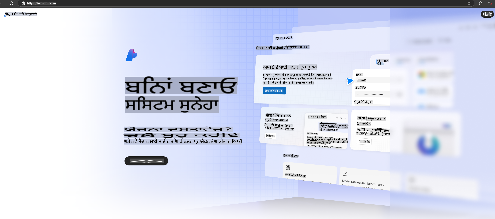

# **Azure AI Foundry ਵਿੱਚ Phi-3 ਦੀ ਵਰਤੋਂ**

ਜਨਰੇਟਿਵ AI ਦੇ ਵਿਕਾਸ ਨਾਲ, ਅਸੀਂ ਉਮੀਦ ਕਰਦੇ ਹਾਂ ਕਿ ਇੱਕ ਇਕਰੂਪ ਪਲੇਟਫਾਰਮ ਦੀ ਵਰਤੋਂ ਕਰਕੇ ਵੱਖ-ਵੱਖ LLM ਅਤੇ SLM, ਐਨਟਰਪ੍ਰਾਈਜ਼ ਡੇਟਾ ਇੰਟੀਗ੍ਰੇਸ਼ਨ, ਫਾਈਨ-ਟਿਊਨਿੰਗ/RAG ਆਪਰੇਸ਼ਨ, ਅਤੇ LLM ਅਤੇ SLM ਦੇ ਇੰਟੀਗ੍ਰੇਸ਼ਨ ਤੋਂ ਬਾਅਦ ਵੱਖ-ਵੱਖ ਕਾਰੋਬਾਰਾਂ ਦੀ ਮੁਲਾਂਕਣਾ ਆਦਿ ਨੂੰ ਪ੍ਰਬੰਧਿਤ ਕੀਤਾ ਜਾ ਸਕੇ, ਤਾਂ ਜੋ ਜਨਰੇਟਿਵ AI ਨੂੰ ਹੋਰ ਸਮਾਰਟ ਐਪਲੀਕੇਸ਼ਨ ਲਈ ਬਿਹਤਰ ਤਰੀਕੇ ਨਾਲ ਲਾਗੂ ਕੀਤਾ ਜਾ ਸਕੇ। [Azure AI Foundry](https://ai.azure.com) ਇੱਕ ਐਨਟਰਪ੍ਰਾਈਜ਼ ਪੱਧਰੀ ਜਨਰੇਟਿਵ AI ਐਪਲੀਕੇਸ਼ਨ ਪਲੇਟਫਾਰਮ ਹੈ।

Azure AI Foundry ਦੀ ਮਦਦ ਨਾਲ, ਤੁਸੀਂ ਵੱਡੇ ਭਾਸ਼ਾ ਮਾਡਲ (LLM) ਦੇ ਜਵਾਬਾਂ ਦਾ ਮੁਲਾਂਕਣ ਕਰ ਸਕਦੇ ਹੋ ਅਤੇ ਪ੍ਰੋਮਪਟ ਫਲੋ ਨਾਲ ਪ੍ਰੋਮਪਟ ਐਪਲੀਕੇਸ਼ਨ ਕੰਪੋਨੈਂਟਸ ਨੂੰ ਆਰਕਸਟਰੇਟ ਕਰਕੇ ਪ੍ਰਦਰਸ਼ਨ ਵਿੱਚ ਸੁਧਾਰ ਕਰ ਸਕਦੇ ਹੋ। ਇਹ ਪਲੇਟਫਾਰਮ ਪ੍ਰੂਫ਼-ਆਫ-ਕਾਂਸੈਪਟ ਨੂੰ ਪੂਰੀ ਤਰ੍ਹਾਂ ਉਤਪਾਦਨ ਵਿੱਚ ਬਦਲਣ ਲਈ ਸਕੇਲਬਿਲਟੀ ਆਸਾਨੀ ਨਾਲ ਪ੍ਰਦਾਨ ਕਰਦਾ ਹੈ। ਲਗਾਤਾਰ ਨਿਗਰਾਨੀ ਅਤੇ ਸੁਧਾਰ ਲੰਬੇ ਸਮੇਂ ਦੀ ਸਫਲਤਾ ਨੂੰ ਸਮਰਥਨ ਦਿੰਦੇ ਹਨ।

ਅਸੀਂ ਸਧਾਰਨ ਕਦਮਾਂ ਰਾਹੀਂ Azure AI Foundry 'ਤੇ Phi-3 ਮਾਡਲ ਨੂੰ ਤੇਜ਼ੀ ਨਾਲ ਡਿਪਲੋਇ ਕਰ ਸਕਦੇ ਹਾਂ, ਅਤੇ ਫਿਰ Azure AI Foundry ਦੀ ਮਦਦ ਨਾਲ Phi-3 ਸੰਬੰਧਤ Playground/Chat, Fine-tuning, ਮੁਲਾਂਕਣਾ ਅਤੇ ਹੋਰ ਕੰਮ ਪੂਰੇ ਕਰ ਸਕਦੇ ਹਾਂ।

## **1. ਤਿਆਰੀ**

ਜੇਕਰ ਤੁਹਾਡੇ ਕੰਪਿਊਟਰ 'ਤੇ ਪਹਿਲਾਂ ਹੀ [Azure Developer CLI](https://learn.microsoft.com/azure/developer/azure-developer-cli/overview?WT.mc_id=aiml-138114-kinfeylo) ਇੰਸਟਾਲ ਹੈ, ਤਾਂ ਇਸ ਟੈਂਪਲੇਟ ਦੀ ਵਰਤੋਂ ਕਰਨਾ ਇੱਕ ਨਵੀਂ ਡਾਇਰੈਕਟਰੀ ਵਿੱਚ ਇਸ ਕਮਾਂਡ ਨੂੰ ਚਲਾਉਣ ਜਿੰਨਾ ਸੌਖਾ ਹੈ।

## ਮੈਨੂਅਲ ਤਰੀਕੇ ਨਾਲ ਬਣਾਉਣਾ

Microsoft Azure AI Foundry ਪ੍ਰਾਜੈਕਟ ਅਤੇ ਹੱਬ ਬਣਾਉਣਾ ਤੁਹਾਡੇ AI ਕੰਮ ਨੂੰ ਆਰਗਨਾਈਜ਼ ਅਤੇ ਪ੍ਰਬੰਧਿਤ ਕਰਨ ਦਾ ਇੱਕ ਵਧੀਆ ਤਰੀਕਾ ਹੈ। ਇੱਥੇ ਇੱਕ ਸਟੈਪ-ਬਾਈ-ਸਟੈਪ ਗਾਈਡ ਹੈ ਜੋ ਤੁਹਾਨੂੰ ਸ਼ੁਰੂ ਕਰਨ ਵਿੱਚ ਮਦਦ ਕਰੇਗੀ:

### Azure AI Foundry ਵਿੱਚ ਪ੍ਰਾਜੈਕਟ ਬਣਾਉਣਾ

1. **Azure AI Foundry 'ਤੇ ਜਾਓ**: Azure AI Foundry ਪੋਰਟਲ ਵਿੱਚ ਸਾਇਨ ਇਨ ਕਰੋ।
2. **ਪ੍ਰਾਜੈਕਟ ਬਣਾਓ**:
   - ਜੇਕਰ ਤੁਸੀਂ ਪਹਿਲਾਂ ਹੀ ਕਿਸੇ ਪ੍ਰਾਜੈਕਟ ਵਿੱਚ ਹੋ, ਤਾਂ ਸਫੇ ਦੇ ਉੱਪਰ ਖੱਬੇ ਕੋਨੇ ਵਿੱਚ "Azure AI Foundry" ਚੁਣੋ ਤਾਂ ਜੋ ਹੋਮ ਪੇਜ 'ਤੇ ਜਾ ਸਕੋ।
   - "+ Create project" ਚੁਣੋ।
   - ਪ੍ਰਾਜੈਕਟ ਲਈ ਇੱਕ ਨਾਮ ਦਿਓ।
   - ਜੇਕਰ ਤੁਹਾਡੇ ਕੋਲ ਹੱਬ ਹੈ, ਤਾਂ ਉਹ ਡਿਫਾਲਟ ਰੂਪ ਵਿੱਚ ਚੁਣਿਆ ਜਾਵੇਗਾ। ਜੇਕਰ ਤੁਹਾਡੇ ਕੋਲ ਇਕ ਤੋਂ ਵੱਧ ਹੱਬ ਤੱਕ ਪਹੁੰਚ ਹੈ, ਤਾਂ ਤੁਸੀਂ ਡ੍ਰੌਪਡਾਊਨ ਤੋਂ ਵੱਖਰਾ ਹੱਬ ਚੁਣ ਸਕਦੇ ਹੋ। ਜੇਕਰ ਤੁਸੀਂ ਨਵਾਂ ਹੱਬ ਬਣਾਉਣਾ ਚਾਹੁੰਦੇ ਹੋ, ਤਾਂ "Create new hub" ਚੁਣੋ ਅਤੇ ਇੱਕ ਨਾਮ ਪ੍ਰਦਾਨ ਕਰੋ।
   - "Create" ਚੁਣੋ।

### Azure AI Foundry ਵਿੱਚ ਹੱਬ ਬਣਾਉਣਾ

1. **Azure AI Foundry 'ਤੇ ਜਾਓ**: ਆਪਣੇ Azure ਖਾਤੇ ਨਾਲ ਸਾਇਨ ਇਨ ਕਰੋ।
2. **ਹੱਬ ਬਣਾਓ**:
   - ਖੱਬੇ ਮੈਨੂ ਤੋਂ ਮੈਨੇਜਮੈਂਟ ਸੈਂਟਰ ਚੁਣੋ।
   - "All resources" ਚੁਣੋ, ਫਿਰ "+ New project" ਦੇ ਨਾਲ ਤੀਰ ਚਿੰਨ੍ਹ 'ਤੇ ਕਲਿਕ ਕਰੋ ਅਤੇ "+ New hub" ਚੁਣੋ।
   - "Create a new hub" ਡਾਇਲਾਗ ਵਿੱਚ, ਆਪਣੇ ਹੱਬ ਲਈ ਇੱਕ ਨਾਮ ਦਿਓ (ਉਦਾਹਰਨ ਲਈ, contoso-hub) ਅਤੇ ਹੋਰ ਖੇਤਰਾਂ ਨੂੰ ਆਪਣੀ ਪਸੰਦ ਅਨੁਸਾਰ ਸੋਧੋ।
   - "Next" ਚੁਣੋ, ਜਾਣਕਾਰੀ ਦੀ ਸਮੀਖਿਆ ਕਰੋ, ਅਤੇ ਫਿਰ "Create" ਚੁਣੋ।

ਵਧੇਰੇ ਵਿਸਥਾਰਿਤ ਹਦਾਇਤਾਂ ਲਈ, ਤੁਸੀਂ ਅਧਿਕਾਰਿਕ [Microsoft ਡਾਕੂਮੈਂਟੇਸ਼ਨ](https://learn.microsoft.com/azure/ai-studio/how-to/create-projects) ਨੂੰ ਵੇਖ ਸਕਦੇ ਹੋ।

ਸਫਲਤਾਪੂਰਵਕ ਬਣਾਉਣ ਤੋਂ ਬਾਅਦ, ਤੁਸੀਂ ਆਪਣੇ ਬਣਾਏ ਗਏ ਸਟੂਡੀਓ ਤੱਕ ਪਹੁੰਚ ਸਕਦੇ ਹੋ [ai.azure.com](https://ai.azure.com/) ਰਾਹੀਂ।

ਇੱਕ AI Foundry 'ਤੇ ਕਈ ਪ੍ਰਾਜੈਕਟ ਹੋ ਸਕਦੇ ਹਨ। AI Foundry ਵਿੱਚ ਇੱਕ ਪ੍ਰਾਜੈਕਟ ਬਣਾਓ ਤਿਆਰੀ ਲਈ।

Azure AI Foundry [QuickStarts](https://learn.microsoft.com/azure/ai-studio/quickstarts/get-started-code) ਬਣਾਓ।

## **2. Azure AI Foundry ਵਿੱਚ Phi ਮਾਡਲ ਡਿਪਲੋਇ ਕਰੋ**

ਪ੍ਰਾਜੈਕਟ ਦੇ Explore ਵਿਕਲਪ 'ਤੇ ਕਲਿਕ ਕਰੋ, Model Catalog ਵਿੱਚ ਜਾਓ ਅਤੇ Phi-3 ਚੁਣੋ।

Phi-3-mini-4k-instruct ਚੁਣੋ।

'Deploy' ਬਟਨ 'ਤੇ ਕਲਿਕ ਕਰੋ ਤਾਂ ਜੋ Phi-3-mini-4k-instruct ਮਾਡਲ ਡਿਪਲੋਇ ਕੀਤਾ ਜਾ ਸਕੇ।

> [!NOTE]
>
> ਡਿਪਲੋਇ ਕਰਨ ਵੇਲੇ ਤੁਸੀਂ ਕੰਪਿਊਟਿੰਗ ਪਾਵਰ ਚੁਣ ਸਕਦੇ ਹੋ।

## **3. Azure AI Foundry ਵਿੱਚ Playground Chat Phi**

ਡਿਪਲੋਇਮੈਂਟ ਪੇਜ 'ਤੇ ਜਾਓ, Playground ਚੁਣੋ, ਅਤੇ Azure AI Foundry ਦੇ Phi-3 ਨਾਲ ਗੱਲਬਾਤ ਕਰੋ।

## **4. Azure AI Foundry ਤੋਂ ਮਾਡਲ ਡਿਪਲੋਇ ਕਰਨਾ**

Azure Model Catalog ਤੋਂ ਮਾਡਲ ਡਿਪਲੋਇ ਕਰਨ ਲਈ, ਤੁਸੀਂ ਇਹ ਕਦਮ ਅਪਣਾਉ ਸਕਦੇ ਹੋ:

- Azure AI Foundry ਵਿੱਚ ਸਾਇਨ ਇਨ ਕਰੋ।
- Azure AI Foundry ਮਾਡਲ ਕੈਟਾਲੌਗ ਵਿੱਚੋਂ ਆਪਣਾ ਮਾਡਲ ਚੁਣੋ।
- ਮਾਡਲ ਦੇ Details ਪੇਜ 'ਤੇ, Deploy ਚੁਣੋ ਅਤੇ ਫਿਰ Serverless API with Azure AI Content Safety ਚੁਣੋ।
- ਉਸ ਪ੍ਰਾਜੈਕਟ ਨੂੰ ਚੁਣੋ ਜਿਸ ਵਿੱਚ ਤੁਸੀਂ ਆਪਣੇ ਮਾਡਲ ਡਿਪਲੋਇ ਕਰਨਾ ਚਾਹੁੰਦੇ ਹੋ। Serverless API ਚੋਣ ਦੀ ਵਰਤੋਂ ਕਰਨ ਲਈ, ਤੁਹਾਡਾ ਵਰਕਸਪੇਸ East US 2 ਜਾਂ Sweden Central ਖੇਤਰ ਵਿੱਚ ਹੋਣਾ ਚਾਹੀਦਾ ਹੈ। ਤੁਸੀਂ Deployment name ਨੂੰ ਕਸਟਮਾਈਜ਼ ਕਰ ਸਕਦੇ ਹੋ।
- Deployment wizard 'ਤੇ, Pricing and terms ਨੂੰ ਚੁਣੋ ਤਾਂ ਜੋ ਮੁੱਲ ਅਤੇ ਵਰਤੋਂ ਦੀਆਂ ਸ਼ਰਤਾਂ ਬਾਰੇ ਜਾਣਕਾਰੀ ਮਿਲ ਸਕੇ।
- Deploy ਚੁਣੋ। ਡਿਪਲੋਇਮੈਂਟ ਤਿਆਰ ਹੋਣ ਤੱਕ ਇੰਤਜ਼ਾਰ ਕਰੋ ਅਤੇ ਤੁਹਾਨੂੰ Deployments ਪੇਜ 'ਤੇ ਰੀਡਾਇਰੈਕਟ ਕੀਤਾ ਜਾਵੇਗਾ।
- Open in playground ਚੁਣੋ ਤਾਂ ਜੋ ਮਾਡਲ ਨਾਲ ਇੰਟਰੈਕਟ ਕੀਤਾ ਜਾ ਸਕੇ।
- ਤੁਸੀਂ ਹਮੇਸ਼ਾ Deployments ਪੇਜ 'ਤੇ ਵਾਪਸ ਜਾ ਸਕਦੇ ਹੋ, ਡਿਪਲੋਇਮੈਂਟ ਚੁਣ ਸਕਦੇ ਹੋ, ਅਤੇ ਐਂਡਪੌਇੰਟ ਦਾ Target URL ਅਤੇ Secret Key ਨੋਟ ਕਰ ਸਕਦੇ ਹੋ, ਜਿਸ ਨਾਲ ਤੁਸੀਂ ਡਿਪਲੋਇਮੈਂਟ ਨੂੰ ਕਾਲ ਕਰਕੇ ਕਮਪਲੀਸ਼ਨ ਜਨਰੇਟ ਕਰ ਸਕਦੇ ਹੋ।
- Build ਟੈਬ 'ਤੇ ਜਾਓ ਅਤੇ Components ਸੈਕਸ਼ਨ ਵਿੱਚ Deployments ਚੁਣ ਕੇ ਹਮੇਸ਼ਾ ਐਂਡਪੌਇੰਟ ਦੇ ਵੇਰਵੇ, URL, ਅਤੇ ਐਕਸੈਸ ਕੀਜ਼ ਨੂੰ ਲੱਭ ਸਕਦੇ ਹੋ।

> [!NOTE]
> ਕਿਰਪਾ ਕਰਕੇ ਨੋਟ ਕਰੋ ਕਿ ਇਹ ਕਦਮ ਕਰਨ ਲਈ ਤੁਹਾਡੇ ਖਾਤੇ ਕੋਲ Resource Group 'ਤੇ Azure AI Developer ਰੋਲ ਦੀਆਂ ਇਜਾਜ਼ਤਾਂ ਹੋਣੀਆਂ ਚਾਹੀਦੀਆਂ ਹਨ।

## **5. Azure AI Foundry ਵਿੱਚ Phi API ਦੀ ਵਰਤੋਂ**

ਤੁਸੀਂ Postman ਵਿੱਚ GET ਰਾਹੀਂ https://{Your project name}.region.inference.ml.azure.com/swagger.json ਤੱਕ ਪਹੁੰਚ ਕਰ ਸਕਦੇ ਹੋ ਅਤੇ Key ਨਾਲ ਮਿਲਾ ਕੇ ਪ੍ਰਦਾਨ ਕੀਤੇ ਗਏ ਇੰਟਰਫੇਸ ਬਾਰੇ ਸਿੱਖ ਸਕਦੇ ਹੋ।

ਤੁਸੀਂ ਬਹੁਤ ਹੀ ਸੌਖਾਈ ਨਾਲ ਰਿਕਵੈਸਟ ਪੈਰਾਮੀਟਰ ਅਤੇ ਰਿਸਪਾਂਸ ਪੈਰਾਮੀਟਰ ਪ੍ਰਾਪਤ ਕਰ ਸਕਦੇ ਹੋ।

**ਅਸਵੀਕਤੀ**:  
ਇਹ ਦਸਤਾਵੇਜ਼ ਮਸ਼ੀਨ-ਆਧਾਰਿਤ AI ਅਨੁਵਾਦ ਸੇਵਾਵਾਂ ਦੀ ਵਰਤੋਂ ਕਰਕੇ ਅਨੁਵਾਦ ਕੀਤਾ ਗਿਆ ਹੈ। ਅਸੀਂ ਸਹੀ ਹੋਣ ਲਈ ਕੋਸ਼ਿਸ਼ ਕਰਦੇ ਹਾਂ, ਪਰ ਕਿਰਪਾ ਕਰਕੇ ਧਿਆਨ ਰੱਖੋ ਕਿ ਸਵੈਚਾਲਿਤ ਅਨੁਵਾਦਾਂ ਵਿੱਚ ਗਲਤੀਆਂ ਜਾਂ ਅਸੁਨਿਸ਼ਚਿਤਤਾਵਾਂ ਹੋ ਸਕਦੀਆਂ ਹਨ। ਮੂਲ ਦਸਤਾਵੇਜ਼ ਨੂੰ ਇਸ ਦੀ ਮੂਲ ਭਾਸ਼ਾ ਵਿੱਚ ਪ੍ਰਮਾਣਿਕ ਸਰੋਤ ਮੰਨਿਆ ਜਾਣਾ ਚਾਹੀਦਾ ਹੈ। ਜਰੂਰੀ ਜਾਣਕਾਰੀ ਲਈ, ਪੇਸ਼ੇਵਰ ਮਨੁੱਖੀ ਅਨੁਵਾਦ ਦੀ ਸਿਫਾਰਿਸ਼ ਕੀਤੀ ਜਾਂਦੀ ਹੈ। ਇਸ ਅਨੁਵਾਦ ਦੇ ਪ੍ਰਯੋਗ ਤੋਂ ਉਪਜੀ ਕਿਸੇ ਵੀ ਗਲਤਫਹਿਮੀ ਜਾਂ ਗਲਤ ਵਿਆਖਿਆ ਲਈ ਅਸੀਂ ਜ਼ਿੰਮੇਵਾਰ ਨਹੀਂ ਹਾਂ।