# Azure AI Foundry ਨਾਲ Phi-3 ਨੂੰ ਫਾਈਨ-ਟਿਊਨ ਕਰਨਾ

ਚਲੋ ਦਿਖੀਏ ਕਿ ਕਿਵੇਂ Azure AI Foundry ਦੀ ਵਰਤੋਂ ਕਰਕੇ Microsoft ਦੇ Phi-3 Mini ਭਾਸ਼ਾ ਮਾਡਲ ਨੂੰ ਫਾਈਨ-ਟਿਊਨ ਕੀਤਾ ਜਾ ਸਕਦਾ ਹੈ। ਫਾਈਨ-ਟਿਊਨਿੰਗ ਤੁਹਾਨੂੰ Phi-3 Mini ਨੂੰ ਖਾਸ ਟਾਸਕਾਂ ਲਈ ਅਨੁਕੂਲ ਬਣਾਉਣ ਦੀ ਇਜਾਜ਼ਤ ਦਿੰਦੀ ਹੈ, ਜਿਸ ਨਾਲ ਇਹ ਹੋਰ ਵੀ ਸ਼ਕਤੀਸ਼ਾਲੀ ਅਤੇ ਸੰਦਰਭ-ਸਮਝਦਾਰ ਬਣਦਾ ਹੈ।

## ਵਿਚਾਰਵਟਾਂ

- **ਸਮਰੱਥਾਵਾਂ:** ਕਿਹੜੇ ਮਾਡਲ ਫਾਈਨ-ਟਿਊਨ ਹੋ ਸਕਦੇ ਹਨ? ਬੇਸ ਮਾਡਲ ਨੂੰ ਕਿਹੜੀਆਂ ਚੀਜ਼ਾਂ ਲਈ ਫਾਈਨ-ਟਿਊਨ ਕੀਤਾ ਜਾ ਸਕਦਾ ਹੈ?  
- **ਲਾਗਤ:** ਫਾਈਨ-ਟਿਊਨਿੰਗ ਲਈ ਕੀ ਮੁੱਲ ਮਾਡਲ ਹੈ?  
**ਕਸਟਮਾਈਜ਼ਬਿਲਟੀ:** ਮੈਂ ਬੇਸ ਮਾਡਲ ਨੂੰ ਕਿੰਨਾ ਬਦਲ ਸਕਦਾ ਹਾਂ – ਅਤੇ ਕਿਹੜੇ ਤਰੀਕਿਆਂ ਨਾਲ?  
- **ਸਹੂਲਤ:** ਫਾਈਨ-ਟਿਊਨਿੰਗ ਅਸਲ ਵਿੱਚ ਕਿਵੇਂ ਹੁੰਦੀ ਹੈ – ਕੀ ਮੈਨੂੰ ਕਸਟਮ ਕੋਡ ਲਿਖਣ ਦੀ ਲੋੜ ਹੈ? ਕੀ ਮੈਨੂੰ ਆਪਣਾ ਕੰਪਿਊਟ ਲਿਆਉਣ ਦੀ ਲੋੜ ਹੈ?  
- **ਸੁਰੱਖਿਆ:** ਫਾਈਨ-ਟਿਊਨ ਕੀਤੇ ਮਾਡਲਾਂ ਨੂੰ ਸੁਰੱਖਿਆ ਸੰਬੰਧੀ ਖਤਰੇ ਹੁੰਦੇ ਹਨ – ਕੀ ਅਣਜਾਣੇ ਨੁਕਸਾਨ ਤੋਂ ਬਚਾਉਣ ਲਈ ਕੋਈ ਪ੍ਰਬੰਧ ਹਨ?  

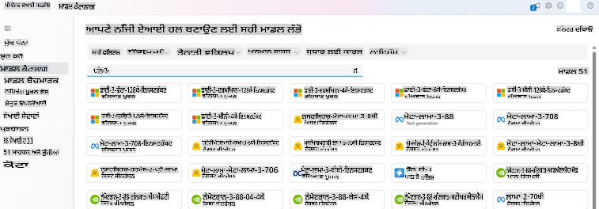

## ਫਾਈਨ-ਟਿਊਨਿੰਗ ਲਈ ਤਿਆਰੀ

### ਜ਼ਰੂਰੀ ਸ਼ਰਤਾਂ

> [!NOTE]  
> Phi-3 ਪਰਿਵਾਰ ਦੇ ਮਾਡਲਾਂ ਲਈ, ਪੇ-ਅਜ਼-ਯੂ-ਗੋ ਮਾਡਲ ਫਾਈਨ-ਟਿਊਨ ਕਰਨ ਦੀ ਸੇਵਾ ਸਿਰਫ਼ **East US 2** ਖੇਤਰਾਂ ਵਿੱਚ ਬਣਾਏ ਗਏ ਹੱਬਾਂ ਲਈ ਉਪਲਬਧ ਹੈ।  

- ਇੱਕ Azure ਸਬਸਕ੍ਰਿਪਸ਼ਨ। ਜੇਕਰ ਤੁਹਾਡੇ ਕੋਲ Azure ਸਬਸਕ੍ਰਿਪਸ਼ਨ ਨਹੀਂ ਹੈ, ਤਾਂ ਸ਼ੁਰੂ ਕਰਨ ਲਈ ਇੱਕ [ਪੇਡ Azure ਖਾਤਾ ਬਣਾਓ](https://azure.microsoft.com/pricing/purchase-options/pay-as-you-go)।  

- ਇੱਕ [AI Foundry ਪ੍ਰੋਜੈਕਟ](https://ai.azure.com?WT.mc_id=aiml-138114-kinfeylo)।  
- Azure ਰੋਲ-ਅਧਾਰਤ ਪਹੁੰਚ ਨਿਯੰਤਰਣ (Azure RBAC) ਦਾ ਇਸਤੇਮਾਲ Azure AI Foundry ਵਿੱਚ ਕਾਰਵਾਈਆਂ ਦੀ ਪਹੁੰਚ ਦੇਣ ਲਈ ਕੀਤਾ ਜਾਂਦਾ ਹੈ। ਇਸ ਲੇਖ ਵਿੱਚ ਕਦਮ ਕਰਨ ਲਈ, ਤੁਹਾਡੇ ਉਪਭੋਗਤਾ ਖਾਤੇ ਨੂੰ __Azure AI Developer ਰੋਲ__ ਨਾਲ ਰਿਸੋਰਸ ਗਰੁੱਪ 'ਤੇ ਨਿਰਧਾਰਿਤ ਕੀਤਾ ਜਾਣਾ ਚਾਹੀਦਾ ਹੈ।  

### ਸਬਸਕ੍ਰਿਪਸ਼ਨ ਪ੍ਰੋਵਾਈਡਰ ਰਜਿਸਟ੍ਰੇਸ਼ਨ

ਪੱਕਾ ਕਰੋ ਕਿ ਸਬਸਕ੍ਰਿਪਸ਼ਨ `Microsoft.Network` ਰਿਸੋਰਸ ਪ੍ਰੋਵਾਈਡਰ ਨਾਲ ਰਜਿਸਟਰ ਹੈ।  

1. [Azure ਪੋਰਟਲ](https://portal.azure.com) ਵਿੱਚ ਸਾਈਨ ਇਨ ਕਰੋ।  
1. ਖੱਬੇ ਮੀਨੂ ਤੋਂ **Subscriptions** ਚੁਣੋ।  
1. ਉਹ ਸਬਸਕ੍ਰਿਪਸ਼ਨ ਚੁਣੋ ਜੋ ਤੁਸੀਂ ਵਰਤਣਾ ਚਾਹੁੰਦੇ ਹੋ।  
1. ਖੱਬੇ ਮੀਨੂ ਤੋਂ **AI project settings** > **Resource providers** ਚੁਣੋ।  
1. ਪੱਕਾ ਕਰੋ ਕਿ **Microsoft.Network** ਰਿਸੋਰਸ ਪ੍ਰੋਵਾਈਡਰਾਂ ਦੀ ਸੂਚੀ ਵਿੱਚ ਹੈ। ਨਹੀਂ ਤਾਂ ਇਸਨੂੰ ਸ਼ਾਮਲ ਕਰੋ।  

### ਡਾਟਾ ਤਿਆਰੀ

ਆਪਣੇ ਮਾਡਲ ਨੂੰ ਫਾਈਨ-ਟਿਊਨ ਕਰਨ ਲਈ ਆਪਣੇ ਟ੍ਰੇਨਿੰਗ ਅਤੇ ਵੈਲੀਡੇਸ਼ਨ ਡਾਟਾ ਨੂੰ ਤਿਆਰ ਕਰੋ। ਤੁਹਾਡੇ ਟ੍ਰੇਨਿੰਗ ਡਾਟਾ ਅਤੇ ਵੈਲੀਡੇਸ਼ਨ ਡਾਟਾਸੈਟ ਵਿੱਚ ਇਨਪੁਟ ਅਤੇ ਆਉਟਪੁਟ ਉਦਾਹਰਣ ਸ਼ਾਮਲ ਹਨ ਕਿ ਤੁਸੀਂ ਮਾਡਲ ਨੂੰ ਕਿਵੇਂ ਕੰਮ ਕਰਵਾਉਣਾ ਚਾਹੁੰਦੇ ਹੋ।  

ਪੱਕਾ ਕਰੋ ਕਿ ਤੁਹਾਡੇ ਸਾਰੇ ਟ੍ਰੇਨਿੰਗ ਉਦਾਹਰਣ ਅਨੁਮਾਨ ਲਈ ਉਮੀਦਵਾਰ ਫਾਰਮੈਟ ਦੀ ਪਾਲਣਾ ਕਰਦੇ ਹਨ। ਮਾਡਲਾਂ ਨੂੰ ਪ੍ਰਭਾਵਸ਼ਾਲੀ ਤਰੀਕੇ ਨਾਲ ਫਾਈਨ-ਟਿਊਨ ਕਰਨ ਲਈ, ਇੱਕ ਸੰਤੁਲਿਤ ਅਤੇ ਵਿਭਿੰਨ ਡਾਟਾਸੈਟ ਨੂੰ ਯਕੀਨੀ ਬਣਾਓ।  

ਇਸ ਵਿੱਚ ਡਾਟਾ ਸੰਤੁਲਨ ਨੂੰ ਬਰਕਰਾਰ ਰੱਖਣਾ, ਵੱਖ-ਵੱਖ ਸਥਿਤੀਆਂ ਨੂੰ ਸ਼ਾਮਲ ਕਰਨਾ, ਅਤੇ ਡਾਟਾ ਨੂੰ ਹਕੀਕਤ-ਵਾਦੀ ਉਮੀਦਾਂ ਦੇ ਅਨੁਕੂਲ ਕਰਨ ਲਈ ਸਮੇਂ-ਸਮੇਂ 'ਤੇ ਸੁਧਾਰਨਾ ਸ਼ਾਮਲ ਹੈ, ਜੋ ਅੰਤ ਵਿੱਚ ਹੋਰ ਸਹੀ ਅਤੇ ਸੰਤੁਲਿਤ ਮਾਡਲ ਜਵਾਬਾਂ ਦੀ ਅਗਵਾਈ ਕਰਦਾ ਹੈ।  

ਵੱਖ-ਵੱਖ ਮਾਡਲ ਪ੍ਰਕਾਰਾਂ ਨੂੰ ਟ੍ਰੇਨਿੰਗ ਡਾਟਾ ਦੇ ਵੱਖ-ਵੱਖ ਫਾਰਮੈਟ ਦੀ ਲੋੜ ਹੁੰਦੀ ਹੈ।  

### ਚੈਟ ਕੰਪਲੀਸ਼ਨ

ਤੁਹਾਡੇ ਦੁਆਰਾ ਵਰਤੀ ਗਈ ਟ੍ਰੇਨਿੰਗ ਅਤੇ ਵੈਲੀਡੇਸ਼ਨ ਡਾਟਾ **ਲਾਜ਼ਮੀ ਹੈ** ਕਿ JSON Lines (JSONL) ਦਸਤਾਵੇਜ਼ ਦੇ ਰੂਪ ਵਿੱਚ ਫਾਰਮੈਟ ਕੀਤੀ ਜਾਵੇ। `Phi-3-mini-128k-instruct` ਲਈ, ਫਾਈਨ-ਟਿਊਨਿੰਗ ਡਾਟਾਸੈਟ ਨੂੰ ਚੈਟ ਕਮਪਲੀਸ਼ਨ API ਦੁਆਰਾ ਵਰਤੇ ਗਏ ਗੱਲਬਾਤ ਦੇ ਫਾਰਮੈਟ ਵਿੱਚ ਫਾਰਮੈਟ ਕੀਤਾ ਜਾਣਾ ਚਾਹੀਦਾ ਹੈ।  

### ਉਦਾਹਰਣ ਫਾਈਲ ਫਾਰਮੈਟ

```json
    {"messages": [{"role": "system", "content": "You are an Xbox customer support agent whose primary goal is to help users with issues they are experiencing with their Xbox devices. You are friendly and concise. You only provide factual answers to queries, and do not provide answers that are not related to Xbox."}, {"role": "user", "content": "Is Xbox better than PlayStation?"}, {"role": "assistant", "content": "I apologize, but I cannot provide personal opinions. My primary job is to assist you with any issues related to your Xbox device. Do you have any Xbox-related issues that need addressing?"}]}
    {"messages": [{"role": "system", "content": "You are an Xbox customer support agent whose primary goal is to help users with issues they are experiencing with their Xbox devices. You are friendly and concise. You only provide factual answers to queries, and do not provide answers that are not related to Xbox."}, {"role": "user", "content": "Can I play PC games on my Xbox?"}, {"role": "assistant", "content": "While Xbox consoles don't natively support PC games, they can play an array of Xbox games, many of which are also available on PC. Can I assist you with finding games compatible with your Xbox device?"}]}
    {"messages": [{"role": "system", "content": "You are an Xbox customer support agent whose primary goal is to help users with issues they are experiencing with their Xbox devices. You are friendly and concise. You only provide factual answers to queries, and do not provide answers that are not related to Xbox."}, {"role": "user", "content": "I'm having trouble connecting my Xbox to the Wi-Fi."}, {"role": "assistant", "content": "No worries, let's go through the network settings on your Xbox. Can you please tell me what happens when you try to connect it to the Wi-Fi?"}]}
```

ਸਮਰਥਿਤ ਫਾਈਲ ਪ੍ਰਕਾਰ JSON Lines ਹੈ। ਫਾਈਲਾਂ ਨੂੰ ਡਿਫੌਲਟ ਡੇਟਾਸਟੋਰ ਵਿੱਚ ਅਪਲੋਡ ਕੀਤਾ ਜਾਂਦਾ ਹੈ ਅਤੇ ਤੁਹਾਡੇ ਪ੍ਰੋਜੈਕਟ ਵਿੱਚ ਉਪਲਬਧ ਕੀਤਾ ਜਾਂਦਾ ਹੈ।  

## Azure AI Foundry ਨਾਲ Phi-3 ਨੂੰ ਫਾਈਨ-ਟਿਊਨ ਕਰਨਾ

Azure AI Foundry ਤੁਹਾਨੂੰ ਵੱਡੇ ਭਾਸ਼ਾ ਮਾਡਲਾਂ ਨੂੰ ਆਪਣੇ ਨਿੱਜੀ ਡਾਟਾਸੈਟਾਂ ਲਈ ਫਾਈਨ-ਟਿਊਨ ਕਰਨ ਦੀ ਸਹੂਲਤ ਦਿੰਦਾ ਹੈ। ਫਾਈਨ-ਟਿਊਨਿੰਗ ਵਿਸ਼ੇਸ਼ ਟਾਸਕਾਂ ਅਤੇ ਐਪਲੀਕੇਸ਼ਨਾਂ ਲਈ ਅਨੁਕੂਲਣ ਅਤੇ ਅਨੁਕੂਲਤਾ ਨੂੰ ਯਕੀਨੀ ਬਣਾਉਂਦੀ ਹੈ। ਇਸ ਨਾਲ ਪ੍ਰਦਰਸ਼ਨ ਵਿੱਚ ਸੁਧਾਰ, ਲਾਗਤ ਦੀ ਦੱਖਲ, ਘੱਟ ਲੈਟੇਂਸੀ, ਅਤੇ ਅਨੁਕੂਲ ਨਤੀਜੇ ਪ੍ਰਾਪਤ ਹੁੰਦੇ ਹਨ।  

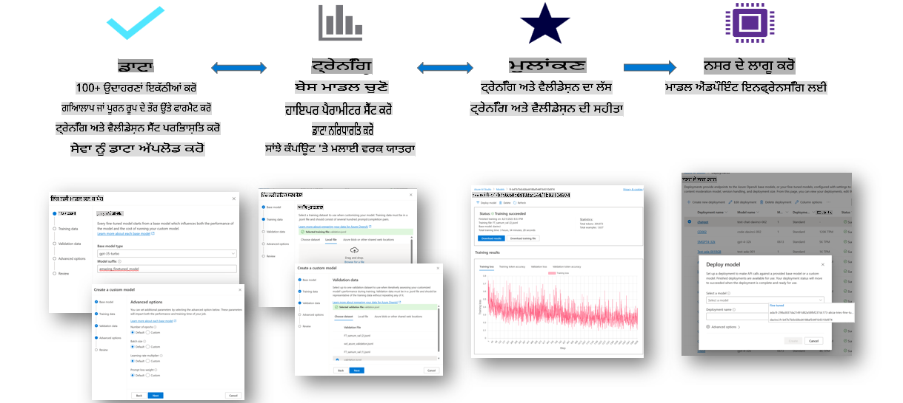

### ਨਵਾਂ ਪ੍ਰੋਜੈਕਟ ਬਣਾਓ

1. [Azure AI Foundry](https://ai.azure.com) ਵਿੱਚ ਸਾਈਨ ਇਨ ਕਰੋ।  

1. ਨਵਾਂ ਪ੍ਰੋਜੈਕਟ ਬਣਾਉਣ ਲਈ **+New project** ਚੁਣੋ।  

    

1. ਹੇਠਾਂ ਦਿੱਤੇ ਕੰਮ ਕਰੋ:  

    - ਪ੍ਰੋਜੈਕਟ **Hub name**। ਇਹ ਇੱਕ ਵਿਲੱਖਣ ਮੁੱਲ ਹੋਣਾ ਚਾਹੀਦਾ ਹੈ।  
    - ਵਰਤਣ ਲਈ **Hub** ਚੁਣੋ (ਲੋੜ ਪਏ ਤਾਂ ਨਵਾਂ ਬਣਾਓ)।  

    

1. ਨਵਾਂ ਹੱਬ ਬਣਾਉਣ ਲਈ ਹੇਠਾਂ ਦਿੱਤੇ ਕੰਮ ਕਰੋ:  

    - **Hub name** ਦਰਜ ਕਰੋ। ਇਹ ਇੱਕ ਵਿਲੱਖਣ ਮੁੱਲ ਹੋਣਾ ਚਾਹੀਦਾ ਹੈ।  
    - ਆਪਣੀ Azure **Subscription** ਚੁਣੋ।  
    - ਵਰਤਣ ਲਈ **Resource group** ਚੁਣੋ (ਲੋੜ ਪਏ ਤਾਂ ਨਵਾਂ ਬਣਾਓ)।  
    - ਵਰਤਣ ਲਈ **Location** ਚੁਣੋ।  
    - ਵਰਤਣ ਲਈ **Connect Azure AI Services** ਚੁਣੋ (ਲੋੜ ਪਏ ਤਾਂ ਨਵਾਂ ਬਣਾਓ)।  
    - **Connect Azure AI Search** ਨੂੰ **Skip connecting** ਚੁਣੋ।  

    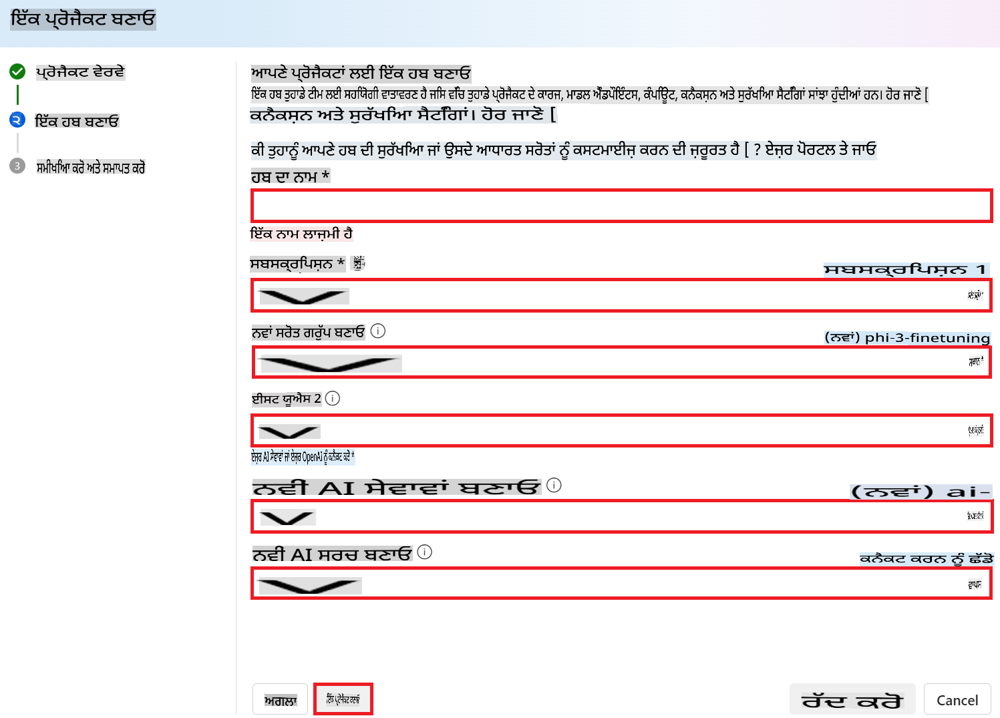

1. **Next** ਚੁਣੋ।  
1. **Create a project** ਚੁਣੋ।  

### ਡਾਟਾ ਤਿਆਰੀ

ਫਾਈਨ-ਟਿਊਨਿੰਗ ਤੋਂ ਪਹਿਲਾਂ, ਆਪਣੇ ਟਾਸਕ ਨਾਲ ਸਬੰਧਤ ਡਾਟਾਸੈਟ ਇਕੱਠਾ ਕਰੋ ਜਾਂ ਬਣਾਓ, ਜਿਵੇਂ ਕਿ ਗੱਲਬਾਤ ਹਦਾਇਤਾਂ, ਪ੍ਰਸ਼ਨ-ਉੱਤਰ ਜੋੜੇ, ਜਾਂ ਹੋਰ ਲਾਗੂ ਪਾਠ ਡਾਟਾ। ਇਸ ਡਾਟੇ ਨੂੰ ਸਾਫ਼ ਕਰੋ ਅਤੇ ਪ੍ਰੀਪ੍ਰੋਸੈਸ ਕਰੋ, ਸ਼ੋਰ ਹਟਾਓ, ਗੁੰਮ ਹੋਏ ਮੁੱਲਾਂ ਨੂੰ ਹਲ ਕਰੋ, ਅਤੇ ਪਾਠ ਨੂੰ ਟੋਕਨਾਈਜ਼ ਕਰੋ।  

### Azure AI Foundry ਵਿੱਚ Phi-3 ਮਾਡਲਾਂ ਨੂੰ ਫਾਈਨ-ਟਿਊਨ ਕਰੋ

> [!NOTE]  
> Phi-3 ਮਾਡਲਾਂ ਦੀ ਫਾਈਨ-ਟਿਊਨਿੰਗ ਇਸ ਸਮੇਂ ਸਿਰਫ਼ East US 2 ਵਿੱਚ ਸਥਿਤ ਪ੍ਰੋਜੈਕਟਾਂ ਲਈ ਸਮਰਥਿਤ ਹੈ।  

1. ਖੱਬੇ ਪਾਸੇ ਟੈਬ ਵਿੱਚੋਂ **Model catalog** ਚੁਣੋ।  

1. **Search bar** ਵਿੱਚ *phi-3* ਟਾਈਪ ਕਰੋ ਅਤੇ ਉਹ Phi-3 ਮਾਡਲ ਚੁਣੋ ਜੋ ਤੁਸੀਂ ਵਰਤਣਾ ਚਾਹੁੰਦੇ ਹੋ।  

    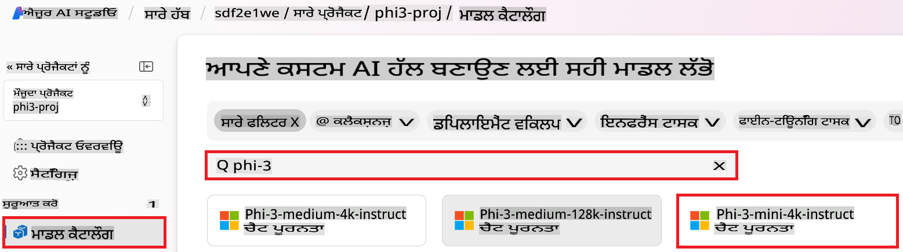

1. **Fine-tune** ਚੁਣੋ।  

    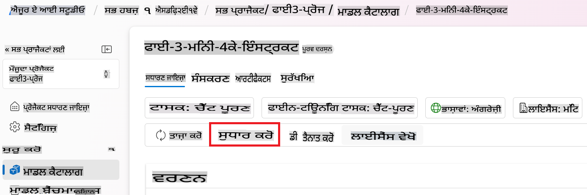

1. **Fine-tuned model name** ਦਰਜ ਕਰੋ।  

    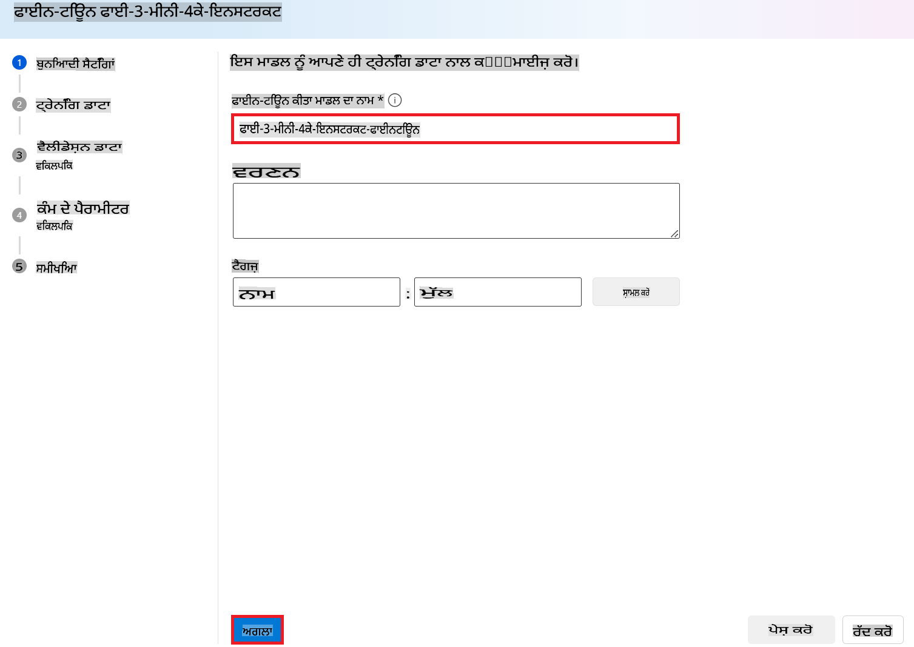

1. **Next** ਚੁਣੋ।  

1. ਹੇਠਾਂ ਦਿੱਤੇ ਕੰਮ ਕਰੋ:  

    - **Task type** ਨੂੰ **Chat completion** ਚੁਣੋ।  
    - ਵਰਤਣ ਲਈ **Training data** ਚੁਣੋ। ਤੁਸੀਂ ਇਸਨੂੰ Azure AI Foundry ਦੇ ਡਾਟਾ ਜਾਂ ਆਪਣੇ ਸਥਾਨਕ ਵਾਤਾਵਰਣ ਤੋਂ ਅਪਲੋਡ ਕਰ ਸਕਦੇ ਹੋ।  

    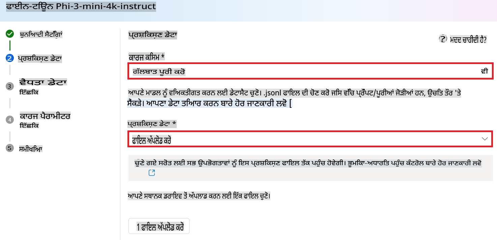

1. **Next** ਚੁਣੋ।  

1. ਵਰਤਣ ਲਈ **Validation data** ਅਪਲੋਡ ਕਰੋ ਜਾਂ ਤੁਸੀਂ **Automatic split of training data** ਚੁਣ ਸਕਦੇ ਹੋ।  

    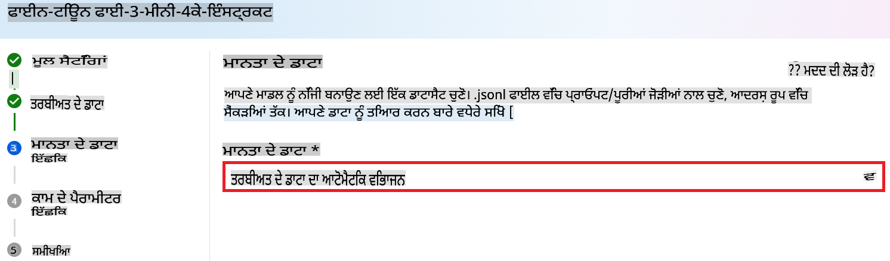

1. **Next** ਚੁਣੋ।  

1. ਹੇਠਾਂ ਦਿੱਤੇ ਕੰਮ ਕਰੋ:  

    - ਵਰਤਣ ਲਈ **Batch size multiplier** ਚੁਣੋ।  
    - ਵਰਤਣ ਲਈ **Learning rate** ਚੁਣੋ।  
    - ਵਰਤਣ ਲਈ **Epochs** ਚੁਣੋ।  

    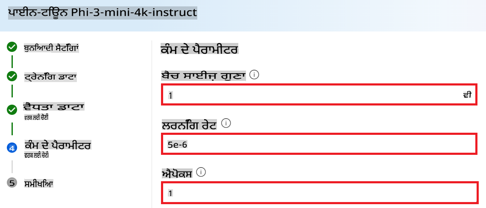

1. ਫਾਈਨ-ਟਿਊਨਿੰਗ ਪ੍ਰਕਿਰਿਆ ਸ਼ੁਰੂ ਕਰਨ ਲਈ **Submit** ਚੁਣੋ।  

    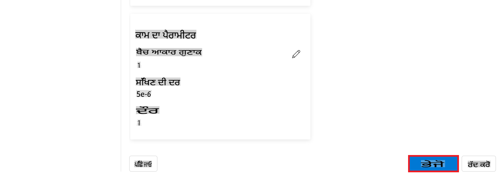

1. ਜਦੋਂ ਤੁਹਾਡਾ ਮਾਡਲ ਫਾਈਨ-ਟਿਊਨ ਹੋ ਜਾਂਦਾ ਹੈ, ਸਥਿਤੀ **Completed** ਵਜੋਂ ਦਰਸਾਈ ਜਾਂਦੀ ਹੈ। ਹੁਣ ਤੁਸੀਂ ਮਾਡਲ ਨੂੰ ਡਿਪਲੌਇ ਕਰ ਸਕਦੇ ਹੋ ਅਤੇ ਇਸਨੂੰ ਆਪਣੇ ਐਪਲੀਕੇਸ਼ਨ ਵਿੱਚ, ਪਲੇਗ੍ਰਾਊਂਡ ਵਿੱਚ, ਜਾਂ ਪ੍ਰਾਂਪਟ ਫਲੋ ਵਿੱਚ ਵਰਤ ਸਕਦੇ ਹੋ। ਹੋਰ ਜਾਣਕਾਰੀ ਲਈ, ਦੇਖੋ [How to deploy Phi-3 family of small language models with Azure AI Foundry](https://learn.microsoft.com/azure/ai-studio/how-to/deploy-models-phi-3?tabs=phi-3-5&pivots=programming-language-python)।  

    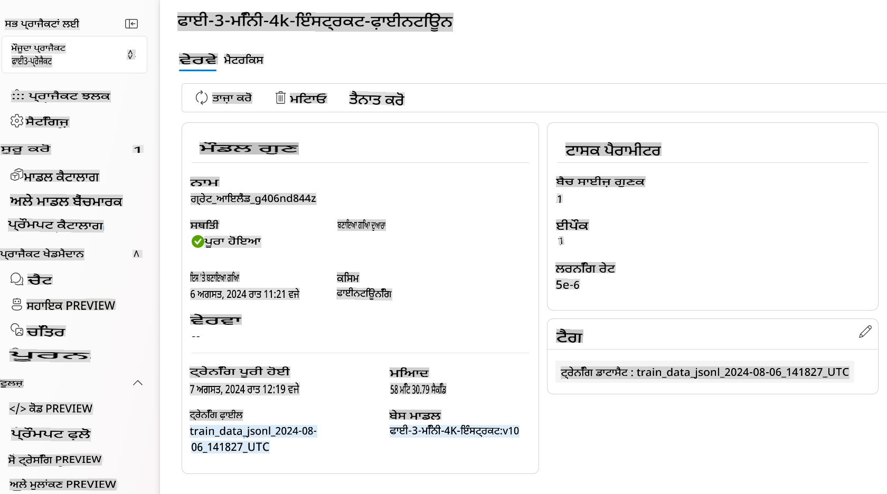

> [!NOTE]  
> Phi-3 ਨੂੰ ਫਾਈਨ-ਟਿਊਨ ਕਰਨ ਬਾਰੇ ਹੋਰ ਵਿਸਥਾਰ ਵਿੱਚ ਜਾਣਕਾਰੀ ਲਈ, ਕਿਰਪਾ ਕਰਕੇ ਵੇਖੋ [Fine-tune Phi-3 models in Azure AI Foundry](https://learn.microsoft.com/azure/ai-studio/how-to/fine-tune-phi-3?tabs=phi-3-mini)।  

## ਆਪਣੇ ਫਾਈਨ-ਟਿਊਨ ਕੀਤੇ ਮਾਡਲਾਂ ਨੂੰ ਸਾਫ਼ ਕਰਨਾ

ਤੁਸੀਂ ਫਾਈਨ-ਟਿਊਨਿੰਗ ਮਾਡਲ ਸੂਚੀ ਵਿੱਚੋਂ ਜਾਂ ਮਾਡਲ ਡਿਟੇਲ ਪੇਜ ਤੋਂ [Azure AI Foundry](https://ai.azure.com) ਵਿੱਚੋਂ ਇੱਕ ਫਾਈਨ-ਟਿਊਨ ਕੀਤੇ ਮਾਡਲ ਨੂੰ ਮਿਟਾ ਸਕਦੇ ਹੋ। ਫਾਈਨ-ਟਿਊਨਿੰਗ ਪੇਜ ਤੋਂ ਮਿਟਾਉਣ ਲਈ ਫਾਈਨ-ਟਿਊਨ ਕੀਤੇ ਮਾਡਲ ਨੂੰ ਚੁਣੋ, ਅਤੇ ਫਿਰ ਮਿਟਾਉਣ ਲਈ **Delete** ਬਟਨ ਚੁਣੋ।  

> [!NOTE]  
> ਜੇਕਰ ਕਿਸੇ ਕਸਟਮ ਮਾਡਲ ਦੀ ਮੌਜੂਦਾ ਡਿਪਲੌਇਮੈਂਟ ਹੈ, ਤਾਂ ਤੁਸੀਂ ਇਸਨੂੰ ਮਿਟਾ ਨਹੀਂ ਸਕਦੇ। ਤੁਹਾਨੂੰ ਪਹਿਲਾਂ ਆਪਣੇ ਮਾਡਲ ਡਿਪਲੌਇਮੈਂਟ ਨੂੰ ਮਿਟਾਉਣਾ ਪਵੇਗਾ।  

## ਲਾਗਤ ਅਤੇ ਕੋਟੇ

### ਸੇਵਾ ਵਜੋਂ ਫਾਈਨ-ਟਿਊਨ ਕੀਤੇ Phi-3 ਮਾਡਲਾਂ ਲਈ ਲਾਗਤ ਅਤੇ ਕੋਟੇ ਦੇ ਮਾਪਦੰਡ

Phi ਮਾਡਲਾਂ ਨੂੰ ਸੇਵਾ ਵਜੋਂ ਫਾਈਨ-ਟਿਊਨ Microsoft ਦੁਆਰਾ ਪੇਸ਼ ਕੀਤੇ ਜਾਂਦੇ ਹਨ ਅਤੇ ਵਰਤਣ ਲਈ Azure AI Foundry ਨਾਲ ਇਕੱਠੇ ਕੀਤੇ ਜਾਂਦੇ ਹਨ। ਤੁਸੀਂ ਮਾਡਲਾਂ ਨੂੰ [ਡਿਪਲੌਇ](https://learn.microsoft.com/azure/ai-studio/how-to/deploy-models-phi-3?tabs=phi-3-5&pivots=programming-language-python) ਜਾਂ ਫਾਈਨ-ਟਿਊਨ ਕਰਦੇ ਸਮੇਂ ਪ੍ਰਾਈਸਿੰਗ ਨੂੰ ਡਿਪਲੌਇਮੈਂਟ ਵਿਜ਼ਾਰਡ ਦੇ **Pricing and terms** ਟੈਬ ਦੇ ਹੇਠਾਂ ਵੇਖ ਸਕਦੇ ਹੋ।  

## ਸਮੱਗਰੀ ਫਿਲਟਰਿੰਗ

ਪੇ-ਅਜ਼-ਯੂ-ਗੋ ਦੇ ਨਾਲ ਸੇਵਾ ਵਜੋਂ ਡਿਪਲੌਇ ਕੀਤੇ ਮਾਡਲਾਂ ਨੂੰ Azure AI Content Safety ਨਾਲ ਸੁਰੱਖਿਅਤ ਕੀਤਾ ਜਾਂਦਾ ਹੈ। ਜਦੋਂ ਰੀਅਲ-ਟਾਈਮ ਐਂਡਪੋਇੰਟਸ ਲਈ ਡਿਪਲੌਇ ਕੀਤਾ ਜਾਂਦਾ ਹੈ, ਤਾਂ ਤੁਸੀਂ ਇਸ ਸਮਰੱਥਾ ਤੋਂ ਬਾਹਰ ਹੋਣ ਦੀ ਚੋਣ ਕਰ ਸਕਦੇ ਹੋ। Azure AI ਸਮੱਗਰੀ ਸੁਰੱਖਿਆ ਚਾਲੂ ਹੋਣ ਦੇ ਨਾਲ, ਦੋਵੇਂ ਪ੍ਰਾਂਪਟ ਅਤੇ ਕਮਪਲੀਸ਼ਨ ਇੱਕ ਵਰਗੀਕਰਨ ਮਾਡਲਾਂ ਦੇ ਗਰੁੱਪ ਵਿੱਚੋਂ ਲੰਘਦੇ ਹਨ ਜੋ ਨੁਕਸਾਨਦਾਇਕ ਸਮੱਗਰੀ ਦੇ ਨਿਕਾਸ ਨੂੰ ਪਛਾਣਣ ਅਤੇ ਰੋਕਣ ਲਈ ਉਦੇਸ਼ਿਤ ਹੁੰਦੇ ਹਨ। ਸਮੱਗਰੀ ਫਿਲਟਰਿੰਗ ਸਿਸਟਮ ਇਨਪੁਟ ਪ੍ਰਾਂਪਟਾਂ ਅਤੇ ਆਉਟਪੁਟ ਕਮਪਲੀਸ਼ਨਾਂ ਦੋਵਾਂ ਵਿੱਚ ਸੰਭਾਵਿਤ ਨੁਕਸਾਨਦਾਇਕ ਸਮੱਗਰੀ ਦੇ ਖਾਸ ਸ਼੍ਰੇਣੀਆਂ ਦੀ ਪਛਾਣ ਅਤੇ ਕਾਰਵਾਈ ਕਰਦਾ ਹੈ। ਹੋਰ ਜਾਣਕਾਰੀ ਲਈ ਵੇਖੋ [Azure AI Content Safety](https://learn.microsoft.com/azure/ai-studio/concepts/content-filtering)।  

**ਫਾਈਨ-ਟਿਊਨਿੰਗ ਕਨਫਿਗਰੇਸ਼ਨ**

ਹਾਈਪਰਪੈਰਾਮੀਟਰਸ: ਲਰਨਿੰਗ ਰੇਟ, ਬੈਚ ਸਾਈਜ਼, ਅਤੇ ਟ੍ਰੇਨਿੰਗ ਐਪੋਕਸ ਦੀ ਗਿਣਤੀ ਵਰਗੇ ਹਾਈਪਰਪੈਰਾਮੀਟਰਸ ਨੂੰ ਪਰਿਭਾਸ਼ਤ ਕਰੋ।  

**ਲਾਸ ਫੰਕਸ਼ਨ**

ਆਪਣੇ ਟਾਸਕ ਲਈ ਇੱਕ ਉਚਿਤ ਲਾਸ ਫੰਕਸ਼ਨ ਚੁਣੋ (ਜਿਵੇਂ ਕਿ, ਕ੍ਰਾਸ-ਐਂਟਰੋਪੀ)।  

**ਆਪਟੀਮਾਈਜ਼ਰ**

ਟ੍ਰੇਨਿੰਗ ਦੌਰਾਨ ਗ੍ਰੇਡੀਅੰਟ ਅਪਡੇਟਸ ਲਈ ਇੱਕ ਆਪਟੀਮਾਈਜ਼ਰ (ਜਿਵੇਂ ਕਿ, Adam) ਚੁਣੋ।  

**ਫਾਈਨ-ਟਿਊਨਿੰਗ ਪ੍ਰਕਿਰਿਆ**

- ਪ੍ਰੀ-ਟ੍ਰੇਨ ਕੀਤੇ ਮਾਡਲ ਨੂੰ ਲੋਡ ਕਰੋ: Phi-3 Mini ਚੈਕਪੌਇੰਟ ਨੂੰ ਲੋਡ ਕਰੋ।  
- ਕਸਟਮ ਲੇਅਰ ਸ਼ਾਮਲ ਕਰੋ: ਟਾਸਕ-ਵਿਸ਼ੇਸ਼ ਲੇਅਰ ਸ਼ਾਮਲ ਕਰੋ (ਜਿਵੇਂ

**ਅਸਵੀਕਤੀ**:  
ਇਹ ਦਸਤਾਵੇਜ਼ ਮਸ਼ੀਨ ਅਧਾਰਿਤ AI ਅਨੁਵਾਦ ਸੇਵਾਵਾਂ ਦੀ ਵਰਤੋਂ ਕਰਕੇ ਅਨੁਵਾਦਿਤ ਕੀਤਾ ਗਿਆ ਹੈ। ਜਦੋਂ ਕਿ ਅਸੀਂ ਸਹੀ ਹੋਣ ਦੀ ਕੋਸ਼ਿਸ਼ ਕਰਦੇ ਹਾਂ, ਕਿਰਪਾ ਕਰਕੇ ਧਿਆਨ ਦਿਓ ਕਿ ਸਵੈਚਾਲਿਤ ਅਨੁਵਾਦਾਂ ਵਿੱਚ ਗਲਤੀਆਂ ਜਾਂ ਅਸੁਨਸ਼ੀਤਤਾਵਾਂ ਹੋ ਸਕਦੀਆਂ ਹਨ। ਇਸ ਦੀ ਮੂਲ ਭਾਸ਼ਾ ਵਿੱਚ ਮੌਜੂਦ ਮੂਲ ਦਸਤਾਵੇਜ਼ ਨੂੰ ਅਧਿਕਾਰਕ ਸਰੋਤ ਮੰਨਿਆ ਜਾਣਾ ਚਾਹੀਦਾ ਹੈ। ਮਹੱਤਵਪੂਰਨ ਜਾਣਕਾਰੀ ਲਈ, ਪੇਸ਼ੇਵਰ ਮਾਨਵ ਅਨੁਵਾਦ ਦੀ ਸਿਫਾਰਿਸ਼ ਕੀਤੀ ਜਾਂਦੀ ਹੈ। ਅਸੀਂ ਇਸ ਅਨੁਵਾਦ ਦੀ ਵਰਤੋਂ ਤੋਂ ਪੈਦਾ ਹੋਣ ਵਾਲੀਆਂ ਕਿਸੇ ਵੀ ਗਲਤ ਫਹਿਮੀਆਂ ਜਾਂ ਗਲਤ ਵਿਆਖਿਆਵਾਂ ਲਈ ਜ਼ਿੰਮੇਵਾਰ ਨਹੀਂ ਹਾਂ।