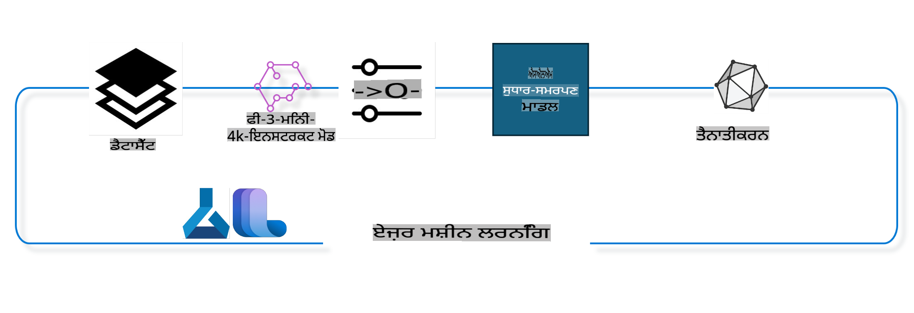

## Azure ML ਸਿਸਟਮ ਰਜਿਸਟਰੀ ਤੋਂ ਚੈਟ-ਕੰਪਲੀਸ਼ਨ ਕੰਪੋਨੈਂਟਾਂ ਦੀ ਵਰਤੋਂ ਕਰਕੇ ਮਾਡਲ ਨੂੰ ਫਾਈਨ ਟਿਊਨ ਕਰਨਾ

ਇਸ ਉਦਾਹਰਨ ਵਿੱਚ ਅਸੀਂ Phi-3-mini-4k-instruct ਮਾਡਲ ਨੂੰ ਚਰਚਾ ਪੂਰੀ ਕਰਨ ਲਈ ਫਾਈਨ ਟਿਊਨ ਕਰਾਂਗੇ, ਜਿਸ ਵਿੱਚ 2 ਲੋਕ ultrachat_200k ਡਾਟਾਸੈੱਟ ਦੀ ਵਰਤੋਂ ਕਰਕੇ ਗੱਲਬਾਤ ਕਰਦੇ ਹਨ।



ਉਦਾਹਰਨ ਤੁਹਾਨੂੰ ਦਿਖਾਵੇਗੀ ਕਿ Azure ML SDK ਅਤੇ Python ਦੀ ਵਰਤੋਂ ਕਰਕੇ ਫਾਈਨ ਟਿਊਨਿੰਗ ਕਿਵੇਂ ਕੀਤੀ ਜਾ ਸਕਦੀ ਹੈ ਅਤੇ ਫਿਰ ਰੀਅਲ ਟਾਈਮ ਇਨਫਰੈਂਸ ਲਈ ਫਾਈਨ ਟਿਊਨ ਕੀਤੇ ਮਾਡਲ ਨੂੰ ਆਨਲਾਈਨ ਐਂਡਪੌਇੰਟ 'ਤੇ ਡਿਪਲੋਇ ਕਰਨਾ।

### ਟ੍ਰੇਨਿੰਗ ਡਾਟਾ

ਅਸੀਂ ultrachat_200k ਡਾਟਾਸੈੱਟ ਦੀ ਵਰਤੋਂ ਕਰਾਂਗੇ। ਇਹ UltraChat ਡਾਟਾਸੈੱਟ ਦਾ ਕਾਫੀ ਫਿਲਟਰ ਕੀਤਾ ਸੰਸਕਰਣ ਹੈ ਅਤੇ ਇਸਨੂੰ Zephyr-7B-β, ਇੱਕ ਅਧੁਨਿਕ 7B ਚੈਟ ਮਾਡਲ ਨੂੰ ਟ੍ਰੇਨ ਕਰਨ ਲਈ ਵਰਤਿਆ ਗਿਆ ਸੀ।

### ਮਾਡਲ

ਅਸੀਂ Phi-3-mini-4k-instruct ਮਾਡਲ ਦੀ ਵਰਤੋਂ ਕਰਾਂਗੇ ਇਹ ਦਿਖਾਉਣ ਲਈ ਕਿ ਚੈਟ-ਕੰਪਲੀਸ਼ਨ ਟਾਸਕ ਲਈ ਮਾਡਲ ਨੂੰ ਕਿਵੇਂ ਫਾਈਨ ਟਿਊਨ ਕੀਤਾ ਜਾ ਸਕਦਾ ਹੈ। ਜੇਕਰ ਤੁਸੀਂ ਇਹ ਨੋਟਬੁੱਕ ਕਿਸੇ ਖਾਸ ਮਾਡਲ ਕਾਰਡ ਤੋਂ ਖੋਲ੍ਹੀ ਹੈ, ਤਾਂ ਖਾਸ ਮਾਡਲ ਦੇ ਨਾਮ ਨੂੰ ਬਦਲਣਾ ਯਾਦ ਰੱਖੋ।

### ਟਾਸਕਸ

- ਫਾਈਨ ਟਿਊਨ ਕਰਨ ਲਈ ਮਾਡਲ ਚੁਣੋ।
- ਟ੍ਰੇਨਿੰਗ ਡਾਟਾ ਚੁਣੋ ਅਤੇ ਖੋਜ ਕਰੋ।
- ਫਾਈਨ ਟਿਊਨਿੰਗ ਜੌਬ ਨੂੰ ਕਨਫਿਗਰ ਕਰੋ।
- ਫਾਈਨ ਟਿਊਨਿੰਗ ਜੌਬ ਚਲਾਓ।
- ਟ੍ਰੇਨਿੰਗ ਅਤੇ ਇਵੈਲੂਏਸ਼ਨ ਮੈਟ੍ਰਿਕਸ ਦੀ ਸਮੀਖਿਆ ਕਰੋ।
- ਫਾਈਨ ਟਿਊਨ ਕੀਤੇ ਮਾਡਲ ਨੂੰ ਰਜਿਸਟਰ ਕਰੋ।
- ਰੀਅਲ ਟਾਈਮ ਇਨਫਰੈਂਸ ਲਈ ਫਾਈਨ ਟਿਊਨ ਕੀਤੇ ਮਾਡਲ ਨੂੰ ਡਿਪਲੋਇ ਕਰੋ।
- ਸਰੋਤਾਂ ਨੂੰ ਸਾਫ਼ ਕਰੋ।

## 1. ਪ੍ਰੀ-ਰਿਕਵਾਇਰਮੈਂਟਸ ਸੈਟਅੱਪ ਕਰੋ

- Dependencies ਇੰਸਟਾਲ ਕਰੋ।
- AzureML ਵਰਕਸਪੇਸ ਨਾਲ ਕਨੈਕਟ ਕਰੋ। SDK ਪ੍ਰਮਾਣਿਕਤਾ ਸੈਟਅੱਪ ਬਾਰੇ ਹੋਰ ਜਾਣਕਾਰੀ ਪ੍ਰਾਪਤ ਕਰੋ। ਹੇਠਾਂ <WORKSPACE_NAME>, <RESOURCE_GROUP>, ਅਤੇ <SUBSCRIPTION_ID> ਨੂੰ ਬਦਲੋ।
- AzureML ਸਿਸਟਮ ਰਜਿਸਟਰੀ ਨਾਲ ਕਨੈਕਟ ਕਰੋ।
- ਇਕ ਵਿਕਲਪਿਕ ਐਕਸਪੇਰੀਮੈਂਟ ਨਾਮ ਸੈਟ ਕਰੋ।
- ਕੰਪਿਊਟ ਦੀ ਜਾਂਚ ਕਰੋ ਜਾਂ ਬਣਾਓ।

> [!NOTE]
> ਇੱਕ GPU ਨੋਡ ਵਿੱਚ ਕਈ GPU ਕਾਰਡ ਹੋ ਸਕਦੇ ਹਨ। ਉਦਾਹਰਨ ਲਈ, Standard_NC24rs_v3 ਦੇ ਇੱਕ ਨੋਡ ਵਿੱਚ 4 NVIDIA V100 GPUs ਹਨ, ਜਦਕਿ Standard_NC12s_v3 ਵਿੱਚ 2 NVIDIA V100 GPUs ਹਨ। ਇਸ ਜਾਣਕਾਰੀ ਲਈ ਡੌਕਸ ਨੂੰ ਵੇਖੋ। ਹੇਠਾਂ gpus_per_node ਪੈਰਾਮੀਟਰ ਵਿੱਚ ਨੋਡ ਪ੍ਰਤੀ GPU ਕਾਰਡ ਦੀ ਗਿਣਤੀ ਸੈਟ ਕੀਤੀ ਜਾਂਦੀ ਹੈ। ਇਸ ਮੁੱਲ ਨੂੰ ਸਹੀ ਤਰੀਕੇ ਨਾਲ ਸੈਟ ਕਰਨ ਨਾਲ ਨੋਡ ਵਿੱਚ ਸਾਰੇ GPUs ਦੀ ਵਰਤੋਂ ਯਕੀਨੀ ਬਣਾਵੀ ਜਾ ਸਕਦੀ ਹੈ। ਸਿਫਾਰਸ਼ੀ GPU ਕੰਪਿਊਟ SKUs ਇੱਥੇ ਅਤੇ ਇੱਥੇ ਪਾਈਆਂ ਜਾ ਸਕਦੀਆਂ ਹਨ।

### Python ਲਾਇਬ੍ਰੇਰੀਆਂ

Dependencies ਨੂੰ ਹੇਠਾਂ ਦਿੱਤੇ ਕੋਡ ਰਨ ਕਰਕੇ ਇੰਸਟਾਲ ਕਰੋ। ਜੇਕਰ ਨਵੇਂ environment ਵਿੱਚ ਚਲਾ ਰਹੇ ਹੋ ਤਾਂ ਇਹ ਕਦਮ ਲਾਜ਼ਮੀ ਹੈ।

```bash
pip install azure-ai-ml
pip install azure-identity
pip install datasets==2.9.0
pip install mlflow
pip install azureml-mlflow
```

### Azure ML ਨਾਲ ਇੰਟਰੈਕਟ ਕਰਨਾ

1. ਇਹ Python ਸਕ੍ਰਿਪਟ Azure Machine Learning (Azure ML) ਸੇਵਾ ਨਾਲ ਇੰਟਰੈਕਟ ਕਰਨ ਲਈ ਵਰਤੀ ਜਾਂਦੀ ਹੈ। ਇੱਥੇ ਇਹ ਕੀ ਕਰਦੀ ਹੈ:

    - ਇਹ azure.ai.ml, azure.identity, ਅਤੇ azure.ai.ml.entities ਪੈਕੇਜਾਂ ਤੋਂ ਲੋੜੀਂਦੇ ਮੋਡੀਊਲਾਂ ਨੂੰ ਇਮਪੋਰਟ ਕਰਦੀ ਹੈ। ਇਹ time ਮੋਡੀਊਲ ਨੂੰ ਵੀ ਇਮਪੋਰਟ ਕਰਦੀ ਹੈ।

    - ਇਹ DefaultAzureCredential() ਦੀ ਵਰਤੋਂ ਕਰਕੇ ਪ੍ਰਮਾਣਿਕ ਹੋਣ ਦੀ ਕੋਸ਼ਿਸ਼ ਕਰਦੀ ਹੈ, ਜੋ ਕਿ Azure ਕਲਾਉਡ ਵਿੱਚ ਚੱਲ ਰਹੇ ਐਪਲੀਕੇਸ਼ਨਜ਼ ਨੂੰ ਤੇਜ਼ੀ ਨਾਲ ਵਿਕਸਿਤ ਕਰਨ ਲਈ ਇਕ ਸਧਾਰਣ ਪ੍ਰਮਾਣਿਕਤਾ ਅਨੁਭਵ ਪ੍ਰਦਾਨ ਕਰਦੀ ਹੈ। ਜੇਕਰ ਇਹ ਅਸਫਲ ਰਹਿੰਦੀ ਹੈ, ਤਾਂ ਇਹ InteractiveBrowserCredential() ਦੀ ਵਰਤੋਂ ਕਰਦੀ ਹੈ, ਜੋ ਕਿ ਇਕ ਇੰਟਰਐਕਟਿਵ ਲੌਗਿਨ ਪ੍ਰੌਂਪਟ ਪ੍ਰਦਾਨ ਕਰਦੀ ਹੈ।

    - ਫਿਰ ਇਹ from_config ਵਿਧੀ ਦੀ ਵਰਤੋਂ ਕਰਕੇ MLClient ਇੰਸਟੈਂਸ ਬਣਾਉਣ ਦੀ ਕੋਸ਼ਿਸ਼ ਕਰਦੀ ਹੈ, ਜੋ ਡਿਫੌਲਟ config ਫਾਈਲ (config.json) ਤੋਂ ਕਨਫਿਗਰੇਸ਼ਨ ਨੂੰ ਪੜ੍ਹਦੀ ਹੈ। ਜੇਕਰ ਇਹ ਅਸਫਲ ਰਹਿੰਦੀ ਹੈ, ਤਾਂ ਇਹ ਸਬਸਕ੍ਰਿਪਸ਼ਨ_ਆਈਡੀ, resource_group_name, ਅਤੇ workspace_name ਨੂੰ ਹੱਥੋਂ ਹੱਥ ਪ੍ਰਦਾਨ ਕਰਕੇ MLClient ਇੰਸਟੈਂਸ ਬਣਾਉਂਦੀ ਹੈ।

    - ਇਹ MLClient ਇੰਸਟੈਂਸ ਨੂੰ "azureml" ਨਾਮਕ Azure ML ਰਜਿਸਟਰੀ ਲਈ ਬਣਾਉਂਦੀ ਹੈ। ਇਹ ਰਜਿਸਟਰੀ ਉਹ ਜਗ੍ਹਾ ਹੈ ਜਿੱਥੇ ਮਾਡਲ, ਫਾਈਨ-ਟਿਊਨਿੰਗ ਪਾਈਪਲਾਈਨ, ਅਤੇ environment ਸਟੋਰ ਕੀਤੇ ਜਾਂਦੇ ਹਨ।

    - ਇਹ experiment_name ਨੂੰ "chat_completion_Phi-3-mini-4k-instruct" 'ਤੇ ਸੈਟ ਕਰਦੀ ਹੈ।

    - ਇਹ ਇੱਕ ਯੂਨੀਕ ਟਾਈਮਸਟੈਂਪ ਜਨਰੇਟ ਕਰਦੀ ਹੈ ਜਿਸਨੂੰ ਵਰਤ ਕੇ ਵਿਲੱਖਣ ਨਾਮ ਅਤੇ ਵਰਜਨ ਬਣਾਏ ਜਾ ਸਕਦੇ ਹਨ।

    ```python
    # Import necessary modules from Azure ML and Azure Identity
    from azure.ai.ml import MLClient
    from azure.identity import (
        DefaultAzureCredential,
        InteractiveBrowserCredential,
    )
    from azure.ai.ml.entities import AmlCompute
    import time  # Import time module
    
    # Try to authenticate using DefaultAzureCredential
    try:
        credential = DefaultAzureCredential()
        credential.get_token("https://management.azure.com/.default")
    except Exception as ex:  # If DefaultAzureCredential fails, use InteractiveBrowserCredential
        credential = InteractiveBrowserCredential()
    
    # Try to create an MLClient instance using the default config file
    try:
        workspace_ml_client = MLClient.from_config(credential=credential)
    except:  # If that fails, create an MLClient instance by manually providing the details
        workspace_ml_client = MLClient(
            credential,
            subscription_id="<SUBSCRIPTION_ID>",
            resource_group_name="<RESOURCE_GROUP>",
            workspace_name="<WORKSPACE_NAME>",
        )
    
    # Create another MLClient instance for the Azure ML registry named "azureml"
    # This registry is where models, fine-tuning pipelines, and environments are stored
    registry_ml_client = MLClient(credential, registry_name="azureml")
    
    # Set the experiment name
    experiment_name = "chat_completion_Phi-3-mini-4k-instruct"
    
    # Generate a unique timestamp that can be used for names and versions that need to be unique
    timestamp = str(int(time.time()))
    ```

## 2. ਫਾਈਨ ਟਿਊਨ ਕਰਨ ਲਈ ਇੱਕ ਬੁਨਿਆਦੀ ਮਾਡਲ ਚੁਣੋ

1. Phi-3-mini-4k-instruct ਇੱਕ 3.8B ਪੈਰਾਮੀਟਰਾਂ ਵਾਲਾ ਹਲਕਾ, ਅਧੁਨਿਕ ਖੁੱਲ੍ਹਾ ਮਾਡਲ ਹੈ ਜੋ Phi-2 ਲਈ ਵਰਤੇ ਗਏ ਡਾਟਾਸੈੱਟਾਂ 'ਤੇ ਅਧਾਰਿਤ ਹੈ। ਮਾਡਲ Phi-3 ਮਾਡਲ ਪਰਿਵਾਰ ਨਾਲ ਸਬੰਧਤ ਹੈ, ਅਤੇ Mini ਸੰਸਕਰਣ 4K ਅਤੇ 128K ਦੇ ਦੋ ਰੂਪਾਂ ਵਿੱਚ ਆਉਂਦਾ ਹੈ, ਜੋ ਕਿ ਇਹ ਸਹਾਇਕ ਟੋਕਨਾਂ ਦੀ ਸੰਦਰਭ ਲੰਬਾਈ ਹੈ। ਸਾਡੇ ਖਾਸ ਉਦੇਸ਼ ਲਈ ਮਾਡਲ ਨੂੰ ਵਰਤਣ ਲਈ ਅਸੀਂ ਇਸਨੂੰ ਫਾਈਨ-ਟਿਊਨ ਕਰਨ ਦੀ ਲੋੜ ਹੈ। ਤੁਸੀਂ AzureML Studio ਵਿੱਚ Model Catalog ਵਿੱਚ ਚੈਟ-ਕੰਪਲੀਸ਼ਨ ਟਾਸਕ ਫਿਲਟਰ ਕਰਕੇ ਇਹ ਮਾਡਲ ਬ੍ਰਾਊਜ਼ ਕਰ ਸਕਦੇ ਹੋ। ਇਸ ਉਦਾਹਰਨ ਵਿੱਚ, ਅਸੀਂ Phi-3-mini-4k-instruct ਮਾਡਲ ਦੀ ਵਰਤੋਂ ਕਰਦੇ ਹਾਂ। ਜੇਕਰ ਤੁਸੀਂ ਇਹ ਨੋਟਬੁੱਕ ਕਿਸੇ ਹੋਰ ਮਾਡਲ ਲਈ ਖੋਲ੍ਹੀ ਹੈ, ਤਾਂ ਮਾਡਲ ਦੇ ਨਾਮ ਅਤੇ ਵਰਜਨ ਨੂੰ ਮਾਨਕ ਰੂਪ ਵਿੱਚ ਬਦਲੋ।

    > [!NOTE]
    > ਮਾਡਲ ਦੀ id ਪ੍ਰਾਪਰਟੀ। ਇਹ ਫਾਈਨ ਟਿਊਨਿੰਗ ਜੌਬ ਲਈ ਇਨਪੁਟ ਵਜੋਂ ਪਾਸ ਕੀਤੀ ਜਾਵੇਗੀ। ਇਹ AzureML Studio Model Catalog ਵਿੱਚ ਮਾਡਲ ਵੇਰਵਿਆਂ ਦੇ ਪੰਨੇ ਵਿੱਚ Asset ID ਖੇਤਰ ਵਜੋਂ ਵੀ ਉਪਲਬਧ ਹੈ।

2. ਇਹ Python ਸਕ੍ਰਿਪਟ Azure Machine Learning (Azure ML) ਸੇਵਾ ਨਾਲ ਇੰਟਰੈਕਟ ਕਰ ਰਿਹਾ ਹੈ। ਇੱਥੇ ਇਹ ਕੀ ਕਰਦਾ ਹੈ:

    - ਇਹ model_name ਨੂੰ "Phi-3-mini-4k-instruct" 'ਤੇ ਸੈਟ ਕਰਦਾ ਹੈ।

    - ਇਹ registry_ml_client ਵਸਤੂ ਦੇ models ਪ੍ਰਾਪਰਟੀ ਦੇ get ਵਿਧੀ ਦੀ ਵਰਤੋਂ ਕਰਦਾ ਹੈ ਤਾਂ ਕਿ ਮਾਡਲ ਦੇ ਨਵੇਂ ਸੰਸਕਰਣ ਨੂੰ Azure ML ਰਜਿਸਟਰੀ ਤੋਂ ਪ੍ਰਾਪਤ ਕੀਤਾ ਜਾ ਸਕੇ। get ਵਿਧੀ ਨੂੰ ਦੋ ਤਰਕ ਦਿੱਤੇ ਜਾਂਦੇ ਹਨ: ਮਾਡਲ ਦਾ ਨਾਮ ਅਤੇ ਲੇਬਲ ਜੋ ਨਵੇਂ ਸੰਸਕਰਣ ਨੂੰ ਪ੍ਰਾਪਤ ਕਰਨ ਲਈ ਦਰਸਾਉਂਦਾ ਹੈ।

    - ਇਹ console ਵਿੱਚ ਇੱਕ ਸੁਨੇਹਾ ਪ੍ਰਿੰਟ ਕਰਦਾ ਹੈ ਜੋ ਮਾਡਲ ਦੇ ਨਾਮ, ਸੰਸਕਰਣ, ਅਤੇ id ਨੂੰ ਦਰਸਾਉਂਦਾ ਹੈ ਜੋ ਕਿ ਫਾਈਨ-ਟਿਊਨਿੰਗ ਲਈ ਵਰਤਿਆ ਜਾਵੇਗਾ। format ਵਿਧੀ ਸੁਨੇਹੇ ਵਿੱਚ ਮਾਡਲ ਦੇ ਨਾਮ, ਸੰਸਕਰਣ, ਅਤੇ id ਨੂੰ ਸ਼ਾਮਲ ਕਰਨ ਲਈ ਵਰਤੀ ਜਾਂਦੀ ਹੈ। ਮਾਡਲ ਦੇ ਨਾਮ, ਸੰਸਕਰਣ, ਅਤੇ id ਨੂੰ foundation_model ਵਸਤੂ ਦੀਆਂ ਪ੍ਰਾਪਰਟੀਆਂ ਵਜੋਂ ਪ੍ਰਾਪਤ ਕੀਤਾ ਜਾਂਦਾ ਹੈ।

    ```python
    # Set the model name
    model_name = "Phi-3-mini-4k-instruct"
    
    # Get the latest version of the model from the Azure ML registry
    foundation_model = registry_ml_client.models.get(model_name, label="latest")
    
    # Print the model name, version, and id
    # This information is useful for tracking and debugging
    print(
        "\n\nUsing model name: {0}, version: {1}, id: {2} for fine tuning".format(
            foundation_model.name, foundation_model.version, foundation_model.id
        )
    )
    ```

## 3. ਜੌਬ ਲਈ ਵਰਤੀ ਜਾਣ ਵਾਲੀ ਕੰਪਿਊਟ ਬਣਾਓ

ਫਾਈਨ ਟਿਊਨ ਜੌਬ ਸਿਰਫ GPU ਕੰਪਿਊਟ ਨਾਲ ਕੰਮ ਕਰਦਾ ਹੈ। ਕੰਪਿਊਟ ਦਾ ਆਕਾਰ ਮਾਡਲ ਦੇ ਆਕਾਰ 'ਤੇ ਨਿਰਭਰ ਕਰਦਾ ਹੈ ਅਤੇ ਜ਼ਿਆਦਾਤਰ ਮਾਮਲਿਆਂ ਵਿੱਚ ਜੌਬ ਲਈ ਸਹੀ ਕੰਪਿਊਟ ਦੀ ਪਛਾਣ ਕਰਨਾ ਮੁਸ਼ਕਲ ਹੁੰਦਾ ਹੈ। ਇਸ ਸੈੱਲ ਵਿੱਚ, ਅਸੀਂ ਯੂਜ਼ਰ ਨੂੰ ਜੌਬ ਲਈ ਸਹੀ ਕੰਪਿਊਟ ਚੁਣਨ ਲਈ ਗਾਈਡ ਕਰਦੇ ਹਾਂ।

> [!NOTE]
> ਹੇਠਾਂ ਦਿੱਤੇ ਕੰਪਿਊਟ ਸਭ ਤੋਂ ਵਧੀਆ ਸੰਰਚਨਾ ਨਾਲ ਕੰਮ ਕਰਦੇ ਹਨ। ਸੰਰਚਨਾ ਵਿੱਚ ਕੋਈ ਵੀ ਬਦਲਾਅ Cuda Out Of Memory ਗਲਤੀ ਦਾ ਕਾਰਨ ਬਣ ਸਕਦਾ ਹੈ। ਅਜਿਹੇ ਮਾਮਲਿਆਂ ਵਿੱਚ, ਕ੍ਰਿਪਾ ਕਰਕੇ ਕੰਪਿਊਟ ਨੂੰ ਵੱਡੇ ਆਕਾਰ ਵਿੱਚ ਅਪਗ੍ਰੇਡ ਕਰਨ ਦੀ ਕੋਸ਼ਿਸ਼ ਕਰੋ।

> [!NOTE]
> ਹੇਠਾਂ ਦਿੱਤੇ compute_cluster_size ਨੂੰ ਚੁਣਦੇ ਸਮੇਂ ਯਕੀਨੀ ਬਣਾਓ ਕਿ ਤੁਹਾਡੀ resource group ਵਿੱਚ ਕੰਪਿਊਟ ਉਪਲਬਧ ਹੈ। ਜੇਕਰ ਕੋਈ ਖਾਸ ਕੰਪਿਊਟ ਉਪਲਬਧ ਨਹੀਂ ਹੈ, ਤਾਂ ਤੁਸੀਂ ਕੰਪਿਊਟ ਸਰੋਤਾਂ ਤੱਕ ਪਹੁੰਚ ਪ੍ਰਾਪਤ ਕਰਨ ਲਈ ਬੇਨਤੀ ਕਰ ਸਕਦੇ ਹੋ।

### ਫਾਈਨ ਟਿਊਨਿੰਗ ਸਹਾਇਤਾ ਲਈ ਮਾਡਲ ਦੀ ਜਾਂਚ

1. ਇਹ Python ਸਕ੍ਰਿਪਟ ਇੱਕ Azure Machine Learning (Azure ML) ਮਾਡਲ ਨਾਲ ਇੰਟਰੈਕਟ ਕਰ ਰਿਹਾ ਹੈ। ਇੱਥੇ ਇਹ ਕੀ ਕਰਦਾ ਹੈ:

    - ਇਹ ast ਮੋਡੀਊਲ ਨੂੰ ਇਮਪੋਰਟ ਕਰਦਾ ਹੈ, ਜੋ Python abstract syntax grammar ਦੇ ਰੁੱਖਾਂ ਨੂੰ ਪ੍ਰਕਿਰਿਆ ਵਿੱਚ ਲਿਆਉਣ ਲਈ ਫੰਕਸ਼ਨ ਪ੍ਰਦਾਨ ਕਰਦਾ ਹੈ।

    - ਇਹ ਜਾਂਚਦਾ ਹੈ ਕਿ foundation_model ਵਸਤੂ (ਜੋ Azure ML ਵਿੱਚ ਇੱਕ ਮਾਡਲ ਦਾ ਪ੍ਰਤੀਨਿਧੀ ਹੈ) ਵਿੱਚ finetune_compute_allow_list ਨਾਮਕ ਟੈਗ ਹੈ ਜਾਂ ਨਹੀਂ। Azure ML ਵਿੱਚ ਟੈਗਜ਼ ਕੁੰਜੀ-ਮੁੱਲ ਜੋੜੇ ਹੁੰਦੇ ਹਨ ਜੋ ਤੁਸੀਂ ਮਾਡਲਾਂ ਨੂੰ ਫਿਲਟਰ ਕਰਨ ਅਤੇ ਤਰਤੀਬਬੱਧ ਕਰਨ ਲਈ ਬਣਾਉਣ ਅਤੇ ਵਰਤਣ ਲਈ ਬਣਾ ਸਕਦੇ ਹੋ।

    - ਜੇ finetune_compute_allow_list ਟੈਗ ਮੌਜੂਦ ਹੈ, ਤਾਂ ਇਹ ast.literal_eval ਫੰਕਸ਼ਨ ਦੀ ਵਰਤੋਂ ਕਰਦਾ ਹੈ ਤਾਂ ਕਿ ਟੈਗ ਦੇ ਮੁੱਲ (ਇੱਕ ਸਟਰਿੰਗ) ਨੂੰ ਸੁਰੱਖਿਅਤ ਢੰਗ ਨਾਲ ਇੱਕ Python ਸੂਚੀ ਵਿੱਚ ਪਾਰਸ ਕੀਤਾ ਜਾ ਸਕੇ। ਇਹ ਸੂਚੀ ਫਿਰ computes_allow_list ਵੈਰੀਏਬਲ ਨੂੰ ਸੌਂਪੀ ਜਾਂਦੀ ਹੈ। ਇਹ ਫਿਰ ਇੱਕ ਸੁਨੇਹਾ ਪ੍ਰਿੰਟ ਕਰਦਾ ਹੈ ਜਿਸ ਵਿੱਚ ਦਰਸਾਇਆ ਗਿਆ ਹੈ ਕਿ ਸੂਚੀ ਵਿੱਚੋਂ ਇੱਕ ਕੰਪਿਊਟ ਬਣਾਇਆ ਜਾਣਾ ਚਾਹੀਦਾ ਹੈ।

    - ਜੇ finetune_compute_allow_list ਟੈਗ ਮੌਜੂਦ ਨਹੀਂ ਹੈ, ਤਾਂ ਇਹ computes_allow_list ਨੂੰ None 'ਤੇ ਸੈਟ ਕਰਦਾ ਹੈ ਅਤੇ ਇੱਕ ਸੁਨੇਹਾ ਪ੍ਰਿੰਟ ਕਰਦਾ ਹੈ ਜਿਸ ਵਿੱਚ ਦਰਸਾਇਆ ਗਿਆ ਹੈ ਕਿ finetune_compute_allow_list ਟੈਗ ਮਾਡਲ ਦੇ ਟੈਗਜ਼ ਦਾ ਹਿੱਸਾ ਨਹੀਂ ਹੈ।

    - ਸਮੁੱਚੇ ਰੂਪ ਵਿੱਚ, ਇਹ ਸਕ੍ਰਿਪਟ ਮਾਡਲ ਦੇ ਮੈਟਾਡੇਟਾ ਵਿੱਚ ਇੱਕ ਵਿਸ਼ੇਸ਼ ਟੈਗ ਲਈ ਜਾਂਚ ਕਰ ਰਿਹਾ ਹੈ, ਜੇਕਰ ਇਹ ਮੌਜੂਦ ਹੈ ਤਾਂ ਟੈਗ ਦੇ ਮੁੱਲ ਨੂੰ ਸੂਚੀ ਵਿੱਚ ਬਦਲ ਰਿਹਾ ਹੈ, ਅਤੇ ਇਸ ਅਨੁਸਾਰ ਯੂਜ਼ਰ ਨੂੰ ਫੀਡਬੈਕ ਦੇ ਰਿਹਾ ਹੈ।

    ```python
    # Import the ast module, which provides functions to process trees of the Python abstract syntax grammar
    import ast
    
    # Check if the 'finetune_compute_allow_list' tag is present in the model's tags
    if "finetune_compute_allow_list" in foundation_model.tags:
        # If the tag is present, use ast.literal_eval to safely parse the tag's value (a string) into a Python list
        computes_allow_list = ast.literal_eval(
            foundation_model.tags["finetune_compute_allow_list"]
        )  # convert string to python list
        # Print a message indicating that a compute should be created from the list
        print(f"Please create a compute from the above list - {computes_allow_list}")
    else:
        # If the tag is not present, set computes_allow_list to None
        computes_allow_list = None
        # Print a message indicating that the 'finetune_compute_allow_list' tag is not part of the model's tags
        print("`finetune_compute_allow_list` is not part of model tags")
    ```

### ਕੰਪਿਊਟ ਇੰਸਟੈਂਸ ਦੀ ਜਾਂਚ

1. ਇਹ Python ਸਕ੍ਰਿਪਟ Azure Machine Learning (Azure ML) ਸੇਵਾ ਨਾਲ ਇੰਟਰੈਕਟ ਕਰ ਰਿਹਾ ਹੈ ਅਤੇ ਇੱਕ ਕੰਪਿਊਟ ਇੰਸਟੈਂਸ 'ਤੇ ਕਈ ਚੈਕ ਕਰ ਰਿਹਾ ਹੈ। ਇੱਥੇ ਇਹ ਕੀ ਕਰਦਾ ਹੈ:

    - ਇਹ Azure ML ਵਰਕਸਪੇਸ ਤੋਂ compute_cluster ਵਿੱਚ ਸਟੋਰ ਕੀਤੇ ਨਾਮ ਨਾਲ ਕੰਪਿਊਟ ਇੰਸਟੈਂਸ ਪ੍ਰਾਪਤ ਕਰਨ ਦੀ ਕੋਸ਼ਿਸ਼ ਕਰਦਾ ਹੈ। ਜੇਕਰ ਕੰਪਿਊਟ ਇੰਸਟੈਂਸ ਦੀ provisioning state "failed" ਹੈ, ਤਾਂ ਇਹ ਇੱਕ ValueError ਉਤਪੰਨ ਕਰਦਾ ਹੈ।

    - ਇਹ ਜਾਂਚਦਾ ਹੈ ਕਿ computes_allow_list None ਨਹੀਂ ਹੈ। ਜੇਕਰ ਇਹ ਨਹੀਂ ਹੈ, ਤਾਂ ਇਹ ਸੂਚੀ ਵਿੱਚ ਸਾਰੇ ਕੰਪਿਊਟ ਆਕਾਰਾਂ ਨੂੰ ਲੋਅਰਕੇਸ ਵਿੱਚ ਬਦਲ ਦਿੰਦਾ ਹੈ ਅਤੇ ਜਾਂਚਦਾ ਹੈ ਕਿ ਮੌਜੂਦਾ compute instance ਦਾ ਆਕਾਰ ਸੂਚੀ ਵਿੱਚ ਹੈ ਜਾਂ ਨਹੀਂ। ਜੇਕਰ ਇਹ ਨਹੀਂ ਹੈ, ਤਾਂ ਇਹ ਇੱਕ ValueError ਉਤਪੰਨ ਕਰਦਾ ਹੈ।

    - ਜੇਕਰ computes_allow_list None ਹੈ, ਤਾਂ ਇਹ ਜਾਂਚਦਾ ਹੈ ਕਿ ਕੰਪਿਊਟ ਇੰਸਟੈਂਸ ਦਾ ਆਕਾਰ unsupported GPU VM sizes ਦੀ ਸੂਚੀ ਵਿੱਚ ਹੈ ਜਾਂ ਨਹੀਂ। ਜੇਕਰ ਇਹ ਹੈ, ਤਾਂ ਇਹ ਇੱਕ ValueError ਉਤਪੰਨ ਕਰਦਾ ਹੈ।

    - ਇਹ ਵਰਕਸਪੇਸ ਵਿੱਚ ਉਪਲਬਧ ਸਾਰੇ ਕੰਪਿਊਟ ਆਕਾਰਾਂ ਦੀ ਸੂਚੀ ਪ੍ਰਾਪਤ ਕਰਦਾ ਹੈ। ਫਿਰ ਇਹ ਇਸ ਸੂਚੀ ਵਿੱਚ ਦਾਖਲ ਹੋ ਜਾਂਦਾ ਹੈ, ਅਤੇ ਹਰ ਕੰਪਿਊਟ ਆਕਾਰ ਲਈ, ਇਹ ਜਾਂਚਦਾ ਹੈ ਕਿ ਇਸਦਾ ਨਾਮ ਮੌਜੂਦਾ ਕੰਪਿਊਟ ਇੰਸਟੈਂਸ ਦੇ ਆਕਾਰ ਨਾਲ ਮਿਲਦਾ ਹੈ ਜਾਂ ਨਹੀਂ। ਜੇਕਰ ਇਹ ਹੈ, ਤਾਂ ਇਹ ਉਸ ਕੰਪਿਊਟ ਆਕਾਰ ਲਈ GPUs ਦੀ ਗਿਣਤੀ ਪ੍ਰਾਪਤ ਕਰਦਾ ਹੈ ਅਤੇ gpu_count_found ਨੂੰ True 'ਤੇ ਸੈਟ ਕਰਦਾ ਹੈ।

    - ਜੇਕਰ gpu_count_found True ਹੈ, ਤਾਂ ਇਹ ਕੰਪਿਊਟ ਇੰਸਟੈਂਸ ਵਿੱਚ GPUs ਦੀ ਗਿਣਤੀ ਪ੍ਰਿੰਟ ਕਰਦਾ ਹੈ। ਜੇਕਰ gpu_count_found False ਹੈ, ਤਾਂ ਇਹ ਇੱਕ ValueError ਉਤਪੰਨ ਕਰਦਾ ਹੈ।

    - ਸਮੁੱਚੇ ਰੂਪ ਵਿੱਚ, ਇਹ ਸਕ੍ਰਿਪਟ Azure ML ਵਰਕਸਪੇਸ ਵਿੱਚ ਇੱਕ ਕੰਪਿਊਟ ਇੰਸਟੈਂਸ 'ਤੇ ਕਈ ਚੈਕ ਕਰ ਰਿਹਾ ਹੈ, ਜਿਸ ਵਿੱਚ ਇਸਦੀ provisioning state, ਇਸਦਾ ਆਕਾਰ ਇੱਕ allow list ਜਾਂ deny list ਦੇ ਵਿਰੁੱਧ, ਅਤੇ ਇਸਦੇ ਕੋਲ GPUs ਦੀ ਗਿਣਤੀ ਸ਼ਾਮਲ ਹੈ।

    ```python
    # Print the exception message
    print(e)
    # Raise a ValueError if the compute size is not available in the workspace
    raise ValueError(
        f"WARNING! Compute size {compute_cluster_size} not available in workspace"
    )
    
    # Retrieve the compute instance from the Azure ML workspace
    compute = workspace_ml_client.compute.get(compute_cluster)
    # Check if the provisioning state of the compute instance is "failed"
    if compute.provisioning_state.lower() == "failed":
        # Raise a ValueError if the provisioning state is "failed"
        raise ValueError(
            f"Provisioning failed, Compute '{compute_cluster}' is in failed state. "
            f"please try creating a different compute"
        )
    
    # Check if computes_allow_list is not None
    if computes_allow_list is not None:
        # Convert all compute sizes in computes_allow_list to lowercase
        computes_allow_list_lower_case = [x.lower() for x in computes_allow_list]
        # Check if the size of the compute instance is in computes_allow_list_lower_case
        if compute.size.lower() not in computes_allow_list_lower_case:
            # Raise a ValueError if the size of the compute instance is not in computes_allow_list_lower_case
            raise ValueError(
                f"VM size {compute.size} is not in the allow-listed computes for finetuning"
            )
    else:
        # Define a list of unsupported GPU VM sizes
        unsupported_gpu_vm_list = [
            "standard_nc6",
            "standard_nc12",
            "standard_nc24",
            "standard_nc24r",
        ]
        # Check if the size of the compute instance is in unsupported_gpu_vm_list
        if compute.size.lower() in unsupported_gpu_vm_list:
            # Raise a ValueError if the size of the compute instance is in unsupported_gpu_vm_list
            raise ValueError(
                f"VM size {compute.size} is currently not supported for finetuning"
            )
    
    # Initialize a flag to check if the number of GPUs in the compute instance has been found
    gpu_count_found = False
    # Retrieve a list of all available compute sizes in the workspace
    workspace_compute_sku_list = workspace_ml_client.compute.list_sizes()
    available_sku_sizes = []
    # Iterate over the list of available compute sizes
    for compute_sku in workspace_compute_sku_list:
        available_sku_sizes.append(compute_sku.name)
        # Check if the name of the compute size matches the size of the compute instance
        if compute_sku.name.lower() == compute.size.lower():
            # If it does, retrieve the number of GPUs for that compute size and set gpu_count_found to True
            gpus_per_node = compute_sku.gpus
            gpu_count_found = True
    # If gpu_count_found is True, print the number of GPUs in the compute instance
    if gpu_count_found:
        print(f"Number of GPU's in compute {compute.size}: {gpus_per_node}")
    else:
        # If gpu_count_found is False, raise a ValueError
        raise ValueError(
            f"Number of GPU's in compute {compute.size} not found. Available skus are: {available_sku_sizes}."
            f"This should not happen. Please check the selected compute cluster: {compute_cluster} and try again."
        )
    ```

## 4. ਮਾਡਲ ਨੂੰ ਫਾਈਨ-ਟਿਊਨ ਕਰਨ ਲਈ ਡਾਟਾਸੈੱਟ ਚੁਣੋ

1. ਅਸੀਂ ultrachat_200k ਡਾਟਾਸੈੱਟ ਦੀ ਵਰਤੋਂ ਕਰਦੇ ਹਾਂ। ਡਾਟਾਸੈੱਟ ਵਿੱਚ ਚਾਰ ਸਪਲਿਟ ਹਨ, ਜੋ Supervised fine-tuning (sft) ਲਈ ਉਚਿਤ ਹਨ।
Generation ranking (gen)। ਸਪਲਿਟ ਪ੍ਰਤੀ ਉਦਾਹਰਣਾਂ ਦੀ ਗਿਣਤੀ ਹੇਠਾਂ ਦਿੱਤੀ ਗਈ ਹੈ:

    ```bash
    train_sft test_sft  train_gen  test_gen
    207865  23110  256032  28304
    ```

1. ਅਗਲੇ ਕੁਝ ਸੈੱਲ ਫਾਈਨ ਟਿਊਨਿੰਗ ਲਈ ਬੁਨਿਆਦੀ ਡਾਟਾ ਤਿਆਰੀ ਦਿਖਾਉਂਦੇ ਹਨ:

### ਕੁਝ ਡਾਟਾ ਰੋਜ਼ ਵੇਖੋ

ਅਸੀਂ ਚਾਹੁੰਦੇ ਹਾਂ ਕਿ ਇਹ ਸੈਂਪਲ ਤੇਜ਼ੀ ਨਾਲ ਚੱਲੇ, ਇਸ ਲਈ train_sft, test_sft ਫਾਈਲਾਂ ਨੂੰ ਸੰਭਾਲੋ ਜੋ ਪਹਿਲਾਂ ਹੀ ਛਾਂਟੀ ਕੀਤੀਆਂ ਗਈਆਂ ਰੋਜ਼ਾਂ ਦਾ 5% ਸ਼ਾਮਲ ਕਰਦੀਆਂ ਹਨ। ਇਸਦਾ ਮਤਲਬ
### ਪਾਈਪਲਾਈਨ ਨੂੰ ਕਨਫਿਗਰ ਕਰਨਾ

ਇਹ ਪਾਇਥਨ ਸਕ੍ਰਿਪਟ Azure Machine Learning SDK ਦੀ ਵਰਤੋਂ ਕਰਕੇ ਇੱਕ ਮਸ਼ੀਨ ਲਰਨਿੰਗ ਪਾਈਪਲਾਈਨ ਨੂੰ ਪਰਿਭਾਸ਼ਿਤ ਅਤੇ ਕਨਫਿਗਰ ਕਰ ਰਹੀ ਹੈ। ਇੱਥੇ ਇਸਦਾ ਵਿਸਥਾਰ ਦਿੱਤਾ ਗਿਆ ਹੈ:

1. ਇਹ Azure AI ML SDK ਤੋਂ ਲੋੜੀਂਦੇ ਮੋਡੀਊਲ ਨੂੰ ਇਮਪੋਰਟ ਕਰਦੀ ਹੈ।
2. ਇਹ ਰਜਿਸਟਰੀ ਤੋਂ "chat_completion_pipeline" ਨਾਮਕ ਪਾਈਪਲਾਈਨ ਕੰਪੋਨੈਂਟ ਨੂੰ ਪ੍ਰਾਪਤ ਕਰਦੀ ਹੈ।
3. ਇਹ `@pipeline` decorator and the function `create_pipeline`. The name of the pipeline is set to `pipeline_display_name`.

1. Inside the `create_pipeline` function, it initializes the fetched pipeline component with various parameters, including the model path, compute clusters for different stages, dataset splits for training and testing, the number of GPUs to use for fine-tuning, and other fine-tuning parameters.

1. It maps the output of the fine-tuning job to the output of the pipeline job. This is done so that the fine-tuned model can be easily registered, which is required to deploy the model to an online or batch endpoint.

1. It creates an instance of the pipeline by calling the `create_pipeline` function.

1. It sets the `force_rerun` setting of the pipeline to `True`, meaning that cached results from previous jobs will not be used.

1. It sets the `continue_on_step_failure` setting of the pipeline to `False` ਦੀ ਵਰਤੋਂ ਕਰਕੇ ਇੱਕ ਪਾਈਪਲਾਈਨ ਜੌਬ ਨੂੰ ਪਰਿਭਾਸ਼ਿਤ ਕਰਦੀ ਹੈ। ਇਹ ਮਤਲਬ ਹੈ ਕਿ ਜੇਕਰ ਕੋਈ ਵੀ ਕਦਮ ਅਸਫਲ ਹੋਵੇ, ਤਾਂ ਪਾਈਪਲਾਈਨ ਰੁਕ ਜਾਵੇਗੀ।
4. ਸੰਖੇਪ ਵਿੱਚ, ਇਹ ਸਕ੍ਰਿਪਟ Azure Machine Learning SDK ਦੀ ਵਰਤੋਂ ਕਰਕੇ ਇੱਕ ਚੈਟ ਕੰਪਲੀਸ਼ਨ ਟਾਸਕ ਲਈ ਮਸ਼ੀਨ ਲਰਨਿੰਗ ਪਾਈਪਲਾਈਨ ਨੂੰ ਪਰਿਭਾਸ਼ਿਤ ਅਤੇ ਕਨਫਿਗਰ ਕਰ ਰਹੀ ਹੈ।

```python
    # Import necessary modules from the Azure AI ML SDK
    from azure.ai.ml.dsl import pipeline
    from azure.ai.ml import Input
    
    # Fetch the pipeline component named "chat_completion_pipeline" from the registry
    pipeline_component_func = registry_ml_client.components.get(
        name="chat_completion_pipeline", label="latest"
    )
    
    # Define the pipeline job using the @pipeline decorator and the function create_pipeline
    # The name of the pipeline is set to pipeline_display_name
    @pipeline(name=pipeline_display_name)
    def create_pipeline():
        # Initialize the fetched pipeline component with various parameters
        # These include the model path, compute clusters for different stages, dataset splits for training and testing, the number of GPUs to use for fine-tuning, and other fine-tuning parameters
        chat_completion_pipeline = pipeline_component_func(
            mlflow_model_path=foundation_model.id,
            compute_model_import=compute_cluster,
            compute_preprocess=compute_cluster,
            compute_finetune=compute_cluster,
            compute_model_evaluation=compute_cluster,
            # Map the dataset splits to parameters
            train_file_path=Input(
                type="uri_file", path="./ultrachat_200k_dataset/train_sft.jsonl"
            ),
            test_file_path=Input(
                type="uri_file", path="./ultrachat_200k_dataset/test_sft.jsonl"
            ),
            # Training settings
            number_of_gpu_to_use_finetuning=gpus_per_node,  # Set to the number of GPUs available in the compute
            **finetune_parameters
        )
        return {
            # Map the output of the fine tuning job to the output of pipeline job
            # This is done so that we can easily register the fine tuned model
            # Registering the model is required to deploy the model to an online or batch endpoint
            "trained_model": chat_completion_pipeline.outputs.mlflow_model_folder
        }
    
    # Create an instance of the pipeline by calling the create_pipeline function
    pipeline_object = create_pipeline()
    
    # Don't use cached results from previous jobs
    pipeline_object.settings.force_rerun = True
    
    # Set continue on step failure to False
    # This means that the pipeline will stop if any step fails
    pipeline_object.settings.continue_on_step_failure = False
    ```

### ਨੌਕਰੀ ਸਬਮਿਟ ਕਰੋ

1. ਇਹ ਪਾਇਥਨ ਸਕ੍ਰਿਪਟ ਇੱਕ ਮਸ਼ੀਨ ਲਰਨਿੰਗ ਪਾਈਪਲਾਈਨ ਜੌਬ ਨੂੰ Azure Machine Learning ਵਰਕਸਪੇਸ ਵਿੱਚ ਸਬਮਿਟ ਕਰ ਰਹੀ ਹੈ ਅਤੇ ਫਿਰ ਜੌਬ ਦੇ ਪੂਰਾ ਹੋਣ ਦੀ ਉਡੀਕ ਕਰ ਰਹੀ ਹੈ। ਇਸਦਾ ਵਿਸਥਾਰ ਹੇਠਾਂ ਦਿੱਤਾ ਗਿਆ ਹੈ:

   - ਇਹ `workspace_ml_client` ਦੇ `jobs` ਆਬਜੈਕਟ ਦੀ `create_or_update` ਵਿਧੀ ਨੂੰ ਕਾਲ ਕਰਦੀ ਹੈ ਤਾਂ ਜੋ ਪਾਈਪਲਾਈਨ ਜੌਬ ਸਬਮਿਟ ਕੀਤਾ ਜਾ ਸਕੇ। ਚਲਾਉਣ ਲਈ ਪਾਈਪਲਾਈਨ `pipeline_object` ਦੁਆਰਾ ਨਿਰਧਾਰਿਤ ਹੈ, ਅਤੇ ਜਿੱਥੇ ਜੌਬ ਚਲਾਇਆ ਗਿਆ ਹੈ ਉਹ ਤਜਰਬਾ `experiment_name` ਦੁਆਰਾ ਨਿਰਧਾਰਿਤ ਹੈ।
   - ਫਿਰ ਇਹ `jobs` ਆਬਜੈਕਟ ਦੀ `stream` ਵਿਧੀ ਨੂੰ ਕਾਲ ਕਰਦੀ ਹੈ ਤਾਂ ਜੋ ਪਾਈਪਲਾਈਨ ਜੌਬ ਦੇ ਪੂਰਾ ਹੋਣ ਦੀ ਉਡੀਕ ਕੀਤੀ ਜਾ ਸਕੇ। ਜਿਸ ਜੌਬ ਦੀ ਉਡੀਕ ਕੀਤੀ ਜਾ ਰਹੀ ਹੈ, ਉਹ `pipeline_job` ਆਬਜੈਕਟ ਦੇ `name` ਗੁਣ ਦੁਆਰਾ ਨਿਰਧਾਰਿਤ ਹੈ।
   - ਸੰਖੇਪ ਵਿੱਚ, ਇਹ ਸਕ੍ਰਿਪਟ ਇੱਕ ਮਸ਼ੀਨ ਲਰਨਿੰਗ ਪਾਈਪਲਾਈਨ ਜੌਬ ਨੂੰ Azure Machine Learning ਵਰਕਸਪੇਸ ਵਿੱਚ ਸਬਮਿਟ ਕਰ ਰਹੀ ਹੈ ਅਤੇ ਫਿਰ ਉਸਦੇ ਪੂਰਾ ਹੋਣ ਦੀ ਉਡੀਕ ਕਰ ਰਹੀ ਹੈ।

```python
    # Submit the pipeline job to the Azure Machine Learning workspace
    # The pipeline to be run is specified by pipeline_object
    # The experiment under which the job is run is specified by experiment_name
    pipeline_job = workspace_ml_client.jobs.create_or_update(
        pipeline_object, experiment_name=experiment_name
    )
    
    # Wait for the pipeline job to complete
    # The job to wait for is specified by the name attribute of the pipeline_job object
    workspace_ml_client.jobs.stream(pipeline_job.name)
    ```

## 6. ਵਰਕਸਪੇਸ ਨਾਲ ਫਾਈਨ-ਟਿਊਨ ਮਾਡਲ ਨੂੰ ਰਜਿਸਟਰ ਕਰੋ

ਅਸੀਂ ਫਾਈਨ-ਟਿਊਨਿੰਗ ਜੌਬ ਦੇ ਆਉਟਪੁੱਟ ਤੋਂ ਮਾਡਲ ਨੂੰ ਰਜਿਸਟਰ ਕਰਾਂਗੇ। ਇਸ ਨਾਲ ਫਾਈਨ-ਟਿਊਨ ਮਾਡਲ ਅਤੇ ਫਾਈਨ-ਟਿਊਨਿੰਗ ਜੌਬ ਦੇ ਵਿਚਕਾਰ ਲੀਨੇਅਜ ਨੂੰ ਟਰੈਕ ਕੀਤਾ ਜਾਵੇਗਾ। ਫਾਈਨ-ਟਿਊਨਿੰਗ ਜੌਬ ਅਗਲੇ ਪੱਧਰ ਤੇ ਫਾਉਂਡੇਸ਼ਨ ਮਾਡਲ, ਡਾਟਾ ਅਤੇ ਟ੍ਰੇਨਿੰਗ ਕੋਡ ਨਾਲ ਲੀਨੇਅਜ ਨੂੰ ਟਰੈਕ ਕਰਦੀ ਹੈ।

### ML ਮਾਡਲ ਰਜਿਸਟਰ ਕਰਨਾ

1. ਇਹ ਪਾਇਥਨ ਸਕ੍ਰਿਪਟ ਇੱਕ ਮਸ਼ੀਨ ਲਰਨਿੰਗ ਮਾਡਲ ਨੂੰ ਰਜਿਸਟਰ ਕਰ ਰਹੀ ਹੈ ਜੋ ਕਿ ਇੱਕ Azure Machine Learning ਪਾਈਪਲਾਈਨ ਵਿੱਚ ਟ੍ਰੇਨ ਕੀਤਾ ਗਿਆ ਸੀ। ਇਸਦਾ ਵਿਸਥਾਰ ਹੇਠਾਂ ਦਿੱਤਾ ਗਿਆ ਹੈ:

   - ਇਹ Azure AI ML SDK ਤੋਂ ਲੋੜੀਂਦੇ ਮੋਡੀਊਲ ਨੂੰ ਇਮਪੋਰਟ ਕਰਦੀ ਹੈ।
   - ਇਹ ਪਾਈਪਲਾਈਨ ਜੌਬ ਤੋਂ `trained_model` ਆਉਟਪੁੱਟ ਉਪਲਬਧ ਹੈ ਜਾਂ ਨਹੀਂ, ਇਹ ਜਾਂਚਦੀ ਹੈ। ਇਹ `workspace_ml_client` ਦੇ `jobs` ਆਬਜੈਕਟ ਦੀ `get` ਵਿਧੀ ਨੂੰ ਕਾਲ ਕਰਦੀ ਹੈ ਅਤੇ ਉਸਦੀ `outputs` ਪ੍ਰਾਪਰਟੀ ਨੂੰ ਐਕਸੈਸ ਕਰਦੀ ਹੈ।
   - ਇਹ ਮਾਡਲ ਦੇ ਰਾਹ ਨੂੰ ਬਣਾਉਂਦੀ ਹੈ ਜੋ ਕਿ ਪਾਈਪਲਾਈਨ ਜੌਬ ਦੇ ਨਾਮ ਅਤੇ ਆਉਟਪੁੱਟ ਦੇ ਨਾਮ ("trained_model") ਨਾਲ ਫਾਰਮੈਟ ਕੀਤਾ ਜਾਂਦਾ ਹੈ।
   - ਇਹ ਫਾਈਨ-ਟਿਊਨ ਮਾਡਲ ਲਈ ਇੱਕ ਨਾਮ ਪਰਿਭਾਸ਼ਿਤ ਕਰਦੀ ਹੈ ਜੋ ਕਿ ਮੂਲ ਮਾਡਲ ਦੇ ਨਾਮ ਦੇ ਨਾਲ "-ultrachat-200k" ਜੋੜਦੀ ਹੈ ਅਤੇ ਕਿਸੇ ਵੀ ਸਲੇਸ਼ ਨੂੰ ਹਾਈਫਨ ਨਾਲ ਬਦਲਦੀ ਹੈ।
   - ਇਹ ਮਾਡਲ ਨੂੰ ਰਜਿਸਟਰ ਕਰਨ ਲਈ Model ਆਬਜੈਕਟ ਤਿਆਰ ਕਰਦੀ ਹੈ ਜਿਸ ਵਿੱਚ ਕਈ ਪੈਰਾਮੀਟਰ ਸ਼ਾਮਲ ਹੁੰਦੇ ਹਨ, ਜਿਵੇਂ ਕਿ ਮਾਡਲ ਦਾ ਰਾਹ, ਮਾਡਲ ਦੀ ਕਿਸਮ (MLflow ਮਾਡਲ), ਮਾਡਲ ਦਾ ਨਾਮ ਅਤੇ ਵਰਜਨ, ਅਤੇ ਮਾਡਲ ਦਾ ਵੇਰਵਾ।
   - ਇਹ ਮਾਡਲ ਨੂੰ ਰਜਿਸਟਰ ਕਰਦੀ ਹੈ `workspace_ml_client` ਦੇ `models` ਆਬਜੈਕਟ ਦੀ `create_or_update` ਵਿਧੀ ਨੂੰ ਕਾਲ ਕਰਕੇ, ਜਿਸ ਵਿੱਚ Model ਆਬਜੈਕਟ ਪਾਸ ਕੀਤਾ ਜਾਂਦਾ ਹੈ।
   - ਇਹ ਰਜਿਸਟਰ ਕੀਤੇ ਗਏ ਮਾਡਲ ਨੂੰ ਪ੍ਰਿੰਟ ਕਰਦੀ ਹੈ।

   - ਸੰਖੇਪ ਵਿੱਚ, ਇਹ ਸਕ੍ਰਿਪਟ ਇੱਕ ਮਸ਼ੀਨ ਲਰਨਿੰਗ ਮਾਡਲ ਨੂੰ ਰਜਿਸਟਰ ਕਰ ਰਹੀ ਹੈ ਜੋ ਕਿ ਇੱਕ Azure Machine Learning ਪਾਈਪਲਾਈਨ ਵਿੱਚ ਟ੍ਰੇਨ ਕੀਤਾ ਗਿਆ ਸੀ।

```python
    # Import necessary modules from the Azure AI ML SDK
    from azure.ai.ml.entities import Model
    from azure.ai.ml.constants import AssetTypes
    
    # Check if the `trained_model` output is available from the pipeline job
    print("pipeline job outputs: ", workspace_ml_client.jobs.get(pipeline_job.name).outputs)
    
    # Construct a path to the trained model by formatting a string with the name of the pipeline job and the name of the output ("trained_model")
    model_path_from_job = "azureml://jobs/{0}/outputs/{1}".format(
        pipeline_job.name, "trained_model"
    )
    
    # Define a name for the fine-tuned model by appending "-ultrachat-200k" to the original model name and replacing any slashes with hyphens
    finetuned_model_name = model_name + "-ultrachat-200k"
    finetuned_model_name = finetuned_model_name.replace("/", "-")
    
    print("path to register model: ", model_path_from_job)
    
    # Prepare to register the model by creating a Model object with various parameters
    # These include the path to the model, the type of the model (MLflow model), the name and version of the model, and a description of the model
    prepare_to_register_model = Model(
        path=model_path_from_job,
        type=AssetTypes.MLFLOW_MODEL,
        name=finetuned_model_name,
        version=timestamp,  # Use timestamp as version to avoid version conflict
        description=model_name + " fine tuned model for ultrachat 200k chat-completion",
    )
    
    print("prepare to register model: \n", prepare_to_register_model)
    
    # Register the model by calling the create_or_update method of the models object in the workspace_ml_client with the Model object as the argument
    registered_model = workspace_ml_client.models.create_or_update(
        prepare_to_register_model
    )
    
    # Print the registered model
    print("registered model: \n", registered_model)
    ```

## 7. ਫਾਈਨ-ਟਿਊਨ ਮਾਡਲ ਨੂੰ ਆਨਲਾਈਨ ਐਂਡਪੋਇੰਟ 'ਤੇ ਡਿਪਲੋਇ ਕਰਨਾ

ਆਨਲਾਈਨ ਐਂਡਪੋਇੰਟ ਇੱਕ ਟਿਕਾਊ REST API ਦਿੰਦੇ ਹਨ, ਜੋ ਐਪਲੀਕੇਸ਼ਨਾਂ ਨਾਲ ਇੰਟੀਗ੍ਰੇਟ ਕਰਨ ਲਈ ਵਰਤੇ ਜਾ ਸਕਦੇ ਹਨ, ਜਿਨ੍ਹਾਂ ਨੂੰ ਮਾਡਲ ਦੀ ਲੋੜ ਹੈ।

### ਐਂਡਪੋਇੰਟ ਦਾ ਪ੍ਰਬੰਧਨ

1. ਇਹ ਪਾਇਥਨ ਸਕ੍ਰਿਪਟ Azure Machine Learning ਵਿੱਚ ਇੱਕ ਰਜਿਸਟਰਡ ਮਾਡਲ ਲਈ ਇੱਕ ਮੈਨੇਜਡ ਆਨਲਾਈਨ ਐਂਡਪੋਇੰਟ ਤਿਆਰ ਕਰ ਰਹੀ ਹੈ। ਇਸਦਾ ਵਿਸਥਾਰ ਹੇਠਾਂ ਦਿੱਤਾ ਗਿਆ ਹੈ:

   - ਇਹ Azure AI ML SDK ਤੋਂ ਲੋੜੀਂਦੇ ਮੋਡੀਊਲ ਨੂੰ ਇਮਪੋਰਟ ਕਰਦੀ ਹੈ।
   - ਇਹ ਆਨਲਾਈਨ ਐਂਡਪੋਇੰਟ ਲਈ ਇੱਕ ਵਿਲੱਖਣ ਨਾਮ ਪਰਿਭਾਸ਼ਿਤ ਕਰਦੀ ਹੈ ਜੋ "ultrachat-completion-" ਸਤਰ ਦੇ ਨਾਲ ਟਾਈਮਸਟੈਂਪ ਜੋੜਦੀ ਹੈ।
   - ਇਹ ਆਨਲਾਈਨ ਐਂਡਪੋਇੰਟ ਤਿਆਰ ਕਰਨ ਲਈ ManagedOnlineEndpoint ਆਬਜੈਕਟ ਬਣਾਉਣ ਦੀ ਤਿਆਰੀ ਕਰਦੀ ਹੈ। ਇਸ ਵਿੱਚ ਕਈ ਪੈਰਾਮੀਟਰ ਸ਼ਾਮਲ ਹੁੰਦੇ ਹਨ, ਜਿਵੇਂ ਕਿ ਐਂਡਪੋਇੰਟ ਦਾ ਨਾਮ, ਐਂਡਪੋਇੰਟ ਦਾ ਵੇਰਵਾ, ਅਤੇ ਪ੍ਰਮਾਣਿਕਤਾ ਮੋਡ ("key")।
   - ਇਹ `workspace_ml_client` ਦੀ `begin_create_or_update` ਵਿਧੀ ਨੂੰ ਕਾਲ ਕਰਦੀ ਹੈ ਅਤੇ ManagedOnlineEndpoint ਆਬਜੈਕਟ ਨੂੰ ਪਾਸ ਕਰਦੀ ਹੈ। ਫਿਰ ਇਹ wait ਵਿਧੀ ਨੂੰ ਕਾਲ ਕਰਕੇ ਕ੍ਰਿਏਸ਼ਨ ਓਪਰੇਸ਼ਨ ਦੇ ਪੂਰਾ ਹੋਣ ਦੀ ਉਡੀਕ ਕਰਦੀ ਹੈ।

   - ਸੰਖੇਪ ਵਿੱਚ, ਇਹ ਸਕ੍ਰਿਪਟ Azure Machine Learning ਵਿੱਚ ਇੱਕ ਰਜਿਸਟਰਡ ਮਾਡਲ ਲਈ ਇੱਕ ਮੈਨੇਜਡ ਆਨਲਾਈਨ ਐਂਡਪੋਇੰਟ ਤਿਆਰ ਕਰ ਰਹੀ ਹੈ।

```python
    # Import necessary modules from the Azure AI ML SDK
    from azure.ai.ml.entities import (
        ManagedOnlineEndpoint,
        ManagedOnlineDeployment,
        ProbeSettings,
        OnlineRequestSettings,
    )
    
    # Define a unique name for the online endpoint by appending a timestamp to the string "ultrachat-completion-"
    online_endpoint_name = "ultrachat-completion-" + timestamp
    
    # Prepare to create the online endpoint by creating a ManagedOnlineEndpoint object with various parameters
    # These include the name of the endpoint, a description of the endpoint, and the authentication mode ("key")
    endpoint = ManagedOnlineEndpoint(
        name=online_endpoint_name,
        description="Online endpoint for "
        + registered_model.name
        + ", fine tuned model for ultrachat-200k-chat-completion",
        auth_mode="key",
    )
    
    # Create the online endpoint by calling the begin_create_or_update method of the workspace_ml_client with the ManagedOnlineEndpoint object as the argument
    # Then wait for the creation operation to complete by calling the wait method
    workspace_ml_client.begin_create_or_update(endpoint).wait()
    ```

> [!NOTE]  
> ਤੁਸੀਂ ਇੱਥੇ ਡਿਪਲੋਇਮੈਂਟ ਲਈ ਸਮਰਥਿਤ SKU ਦੀ ਸੂਚੀ ਵੇਖ ਸਕਦੇ ਹੋ - [Managed online endpoints SKU list](https://learn.microsoft.com/azure/machine-learning/reference-managed-online-endpoints-vm-sku-list)

### ML ਮਾਡਲ ਡਿਪਲੋਇ ਕਰਨਾ

1. ਇਹ ਪਾਇਥਨ ਸਕ੍ਰਿਪਟ ਇੱਕ ਰਜਿਸਟਰਡ ਮਸ਼ੀਨ ਲਰਨਿੰਗ ਮਾਡਲ ਨੂੰ Azure Machine Learning ਵਿੱਚ ਇੱਕ ਮੈਨੇਜਡ ਆਨਲਾਈਨ ਐਂਡਪੋਇੰਟ 'ਤੇ ਡਿਪਲੋਇ ਕਰ ਰਹੀ ਹੈ।

**ਅਸਵੀਕਤੀ**:  
ਇਹ ਦਸਤਾਵੇਜ਼ ਮਸ਼ੀਨ-ਅਧਾਰਿਤ AI ਅਨੁਵਾਦ ਸੇਵਾਵਾਂ ਦੀ ਵਰਤੋਂ ਕਰਕੇ ਅਨੁਵਾਦ ਕੀਤਾ ਗਿਆ ਹੈ। ਜਦੋਂ ਕਿ ਅਸੀਂ ਸਹੀ ਹੋਣ ਦਾ ਯਤਨ ਕਰਦੇ ਹਾਂ, ਕਿਰਪਾ ਕਰਕੇ ਧਿਆਨ ਦਿਓ ਕਿ ਆਟੋਮੈਟਿਕ ਅਨੁਵਾਦਾਂ ਵਿੱਚ ਗਲਤੀਆਂ ਜਾਂ ਅਸੁਣਨਤਾ ਹੋ ਸਕਦੀ ਹੈ। ਮੂਲ ਦਸਤਾਵੇਜ਼ ਨੂੰ ਇਸਦੀ ਮੂਲ ਭਾਸ਼ਾ ਵਿੱਚ ਅਧਿਕਾਰਕ ਸਰੋਤ ਮੰਨਿਆ ਜਾਣਾ ਚਾਹੀਦਾ ਹੈ। ਮਹੱਤਵਪੂਰਨ ਜਾਣਕਾਰੀ ਲਈ, ਪੇਸ਼ੇਵਰ ਮਨੁੱਖੀ ਅਨੁਵਾਦ ਦੀ ਸਿਫਾਰਿਸ਼ ਕੀਤੀ ਜਾਂਦੀ ਹੈ। ਇਸ ਅਨੁਵਾਦ ਦੇ ਉਪਯੋਗ ਤੋਂ ਪੈਦਾ ਹੋਣ ਵਾਲੇ ਕਿਸੇ ਵੀ ਗਲਤਫਹਿਮੀ ਜਾਂ ਗਲਤ ਵਿਆਖਿਆ ਲਈ ਅਸੀਂ ਜ਼ਿੰਮੇਵਾਰ ਨਹੀਂ ਹਾਂ।