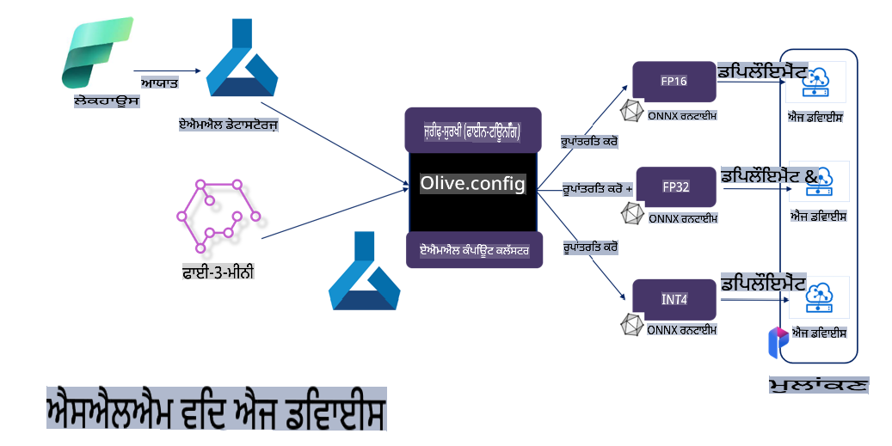

# **ਮਾਈਕਰੋਸਾਫਟ ਓਲਿਵ ਨਾਲ ਫਾਈਨ-ਟਿਊਨਿੰਗ Phi-3**

[Olive](https://github.com/microsoft/OLive?WT.mc_id=aiml-138114-kinfeylo) ਇੱਕ ਸੌਖਾ ਅਤੇ ਹਾਰਡਵੇਅਰ-ਅਵੇਅਰ ਮਾਡਲ ਅਪਟਿਮਾਈਜ਼ੇਸ਼ਨ ਟੂਲ ਹੈ, ਜੋ ਮਾਡਲ ਕੰਪ੍ਰੈਸ਼ਨ, ਅਪਟਿਮਾਈਜ਼ੇਸ਼ਨ, ਅਤੇ ਕੰਪਾਈਲੇਸ਼ਨ ਵਿੱਚ ਇੰਡਸਟਰੀ ਦੇ ਸਿਖਰਲੇ ਤਕਨੀਕੀ ਹੱਲ ਇਕੱਠੇ ਕਰਦਾ ਹੈ।

ਇਹ ਮਸ਼ੀਨ ਲਰਨਿੰਗ ਮਾਡਲਾਂ ਨੂੰ ਅਪਟਿਮਾਈਜ਼ ਕਰਨ ਦੇ ਪ੍ਰਕਿਰਿਆ ਨੂੰ ਆਸਾਨ ਬਣਾਉਣ ਲਈ ਡਿਜ਼ਾਇਨ ਕੀਤਾ ਗਿਆ ਹੈ, ਇਹ ਯਕੀਨੀ ਬਣਾਉਂਦਾ ਹੈ ਕਿ ਮਾਡਲ ਖਾਸ ਹਾਰਡਵੇਅਰ ਆਰਕੀਟੈਕਚਰ ਦਾ ਸਭ ਤੋਂ ਕੁਸ਼ਲਤਾਪੂਰਵਕ ਇਸਤੇਮਾਲ ਕਰਦੇ ਹਨ।

ਚਾਹੇ ਤੁਸੀਂ ਕਲਾਉਡ-ਅਧਾਰਿਤ ਐਪਲੀਕੇਸ਼ਨਾਂ 'ਤੇ ਕੰਮ ਕਰ ਰਹੇ ਹੋਵੋ ਜਾਂ ਐਜ ਡਿਵਾਈਸਾਂ 'ਤੇ, Olive ਤੁਹਾਨੂੰ ਮਾਡਲਾਂ ਨੂੰ ਬਿਨਾਂ ਕਿਸੇ ਮੁਸ਼ਕਲ ਦੇ ਅਤੇ ਪ੍ਰਭਾਵਸ਼ਾਲੀ ਤਰੀਕੇ ਨਾਲ ਅਪਟਿਮਾਈਜ਼ ਕਰਨ ਦੀ ਸਮਰੱਥਾ ਦਿੰਦਾ ਹੈ।

## ਮੁੱਖ ਵਿਸ਼ੇਸ਼ਤਾਵਾਂ:
- Olive ਵੱਖ-ਵੱਖ ਹਾਰਡਵੇਅਰ ਟਾਰਗੇਟਾਂ ਲਈ ਅਪਟਿਮਾਈਜ਼ੇਸ਼ਨ ਤਕਨੀਕਾਂ ਨੂੰ ਇਕੱਠਾ ਅਤੇ ਆਟੋਮੇਟ ਕਰਦਾ ਹੈ।
- ਕੋਈ ਵੀ ਇੱਕ ਤਕਨੀਕ ਸਾਰੇ ਸਥਿਤੀਆਂ ਲਈ ਫਿੱਟ ਨਹੀਂ ਹੁੰਦੀ, ਇਸ ਲਈ Olive ਇੰਡਸਟਰੀ ਦੇ ਮਾਹਰਾਂ ਨੂੰ ਆਪਣੀਆਂ ਨਵੀਂ ਤਕਨੀਕਾਂ ਸ਼ਾਮਲ ਕਰਨ ਦੀ ਸਹੂਲਤ ਦਿੰਦਾ ਹੈ।

## ਇੰਜੀਨੀਅਰਿੰਗ ਸ਼੍ਰਮ ਨੂੰ ਘਟਾਓ:
- ਡਿਵੈਲਪਰਾਂ ਨੂੰ ਆਮ ਤੌਰ 'ਤੇ ਮਾਡਲਾਂ ਨੂੰ ਡਿਪਲੋਇਮੈਂਟ ਲਈ ਤਿਆਰ ਕਰਨ ਲਈ ਵੱਖ-ਵੱਖ ਹਾਰਡਵੇਅਰ ਵੇਂਡਰ-ਵਿਸ਼ੇਸ਼ ਟੂਲਚੇਨ ਸਿੱਖਣ ਦੀ ਲੋੜ ਹੁੰਦੀ ਹੈ।
- Olive ਇਸ ਪ੍ਰਕਿਰਿਆ ਨੂੰ ਆਟੋਮੇਟ ਕਰ ਕੇ ਇਸ ਅਨੁਭਵ ਨੂੰ ਆਸਾਨ ਬਣਾਉਂਦਾ ਹੈ।

## ਤਿਆਰ-ਤੋਂ-ਵਰਤੋਂ ਲਈ ਪੂਰੀ ਅਪਟਿਮਾਈਜ਼ੇਸ਼ਨ ਹੱਲ:

ਇੱਕੀਕ੍ਰਿਤ ਤਕਨੀਕਾਂ ਨੂੰ ਜੋੜ ਕੇ ਅਤੇ ਟਿਊਨ ਕਰ ਕੇ, Olive ਇੱਕ ਪੂਰਾ ਹੱਲ ਪ੍ਰਦਾਨ ਕਰਦਾ ਹੈ। 
ਇਹ ਮਾਡਲਾਂ ਨੂੰ ਅਪਟਿਮਾਈਜ਼ ਕਰਦੇ ਸਮੇਂ ਯਥਾਰਥਤਾ ਅਤੇ ਲੈਟੈਂਸੀ ਵਰਗੀਆਂ ਪਾਬੰਦੀਆਂ ਦਾ ਧਿਆਨ ਰੱਖਦਾ ਹੈ।

## ਮਾਈਕਰੋਸਾਫਟ ਓਲਿਵ ਵਰਤ ਕੇ ਫਾਈਨ-ਟਿਊਨਿੰਗ

Microsoft Olive ਇੱਕ ਬਹੁਤ ਹੀ ਆਸਾਨ-ਵਰਤੋਂ ਯੋਗ ਖੁੱਲ੍ਹਾ ਸਰੋਤ ਮਾਡਲ ਅਪਟਿਮਾਈਜ਼ੇਸ਼ਨ ਟੂਲ ਹੈ ਜੋ ਜਨਰੇਟਿਵ ਆਰਟੀਫੀਸ਼ਲ ਇੰਟੈਲੀਜੈਂਸ ਦੇ ਖੇਤਰ ਵਿੱਚ ਫਾਈਨ-ਟਿਊਨਿੰਗ ਅਤੇ ਰਿਫਰੈਂਸ ਦੋਵੇਂ ਨੂੰ ਕਵਰ ਕਰ ਸਕਦਾ ਹੈ। ਇਸਨੂੰ ਸਿਰਫ ਸਧਾਰਨ ਸੰਰਚਨਾ ਦੀ ਲੋੜ ਹੁੰਦੀ ਹੈ, ਅਤੇ ਖੁੱਲ੍ਹੇ ਸਰੋਤ ਦੇ ਛੋਟੇ ਭਾਸ਼ਾ ਮਾਡਲਾਂ ਅਤੇ ਸੰਬੰਧਤ ਰਨਟਾਈਮ ਵਾਤਾਵਰਣਾਂ (AzureML / ਸਥਾਨਕ GPU, CPU, DirectML) ਦੇ ਵਰਤੋਂ ਨਾਲ, ਤੁਸੀਂ ਆਟੋਮੈਟਿਕ ਅਪਟਿਮਾਈਜ਼ੇਸ਼ਨ ਰਾਹੀਂ ਮਾਡਲ ਦੀ ਫਾਈਨ-ਟਿਊਨਿੰਗ ਜਾਂ ਰਿਫਰੈਂਸ ਪੂਰੀ ਕਰ ਸਕਦੇ ਹੋ, ਅਤੇ ਸਭ ਤੋਂ ਵਧੀਆ ਮਾਡਲ ਨੂੰ ਕਲਾਉਡ ਜਾਂ ਐਜ ਡਿਵਾਈਸਾਂ 'ਤੇ ਡਿਪਲੋਇ ਕਰਨ ਲਈ ਲੱਭ ਸਕਦੇ ਹੋ। ਇਹ ਕਾਰਪੋਰੇਸ਼ਨਾਂ ਨੂੰ ਆਪਣੇ ਉਦਯੋਗ-ਵਿਸ਼ੇਸ਼ ਮਾਡਲ ਸਥਾਨਕ ਅਤੇ ਕਲਾਉਡ 'ਤੇ ਬਣਾਉਣ ਦੀ ਆਗਿਆ ਦਿੰਦਾ ਹੈ।


## Phi-3 ਮਾਈਕਰੋਸਾਫਟ ਓਲਿਵ ਨਾਲ ਫਾਈਨ-ਟਿਊਨਿੰਗ



## Phi-3 Olive ਉਦਾਹਰਣ ਕੋਡ ਅਤੇ ਉਦਾਹਰਣ
ਇਸ ਉਦਾਹਰਣ ਵਿੱਚ ਤੁਸੀਂ Olive ਨੂੰ ਵਰਤੋਂਗੇ:

- LoRA ਅਡੈਪਟਰ ਨੂੰ ਫਾਈਨ-ਟਿਊਨ ਕਰਨ ਲਈ ਜੋ ਵਾਕਾਂਸ਼ਾਂ ਨੂੰ ਦukh, ਖੁਸ਼ੀ, ਡਰ, ਹੈਰਾਨੀ ਵਿੱਚ ਵੰਡੇ।
- ਅਡੈਪਟਰ ਵਜ਼ਨ ਨੂੰ ਬੇਸ ਮਾਡਲ ਵਿੱਚ ਮਰਜ ਕਰੋ।
- ਮਾਡਲ ਨੂੰ Optimize ਅਤੇ Quantize ਕਰਕੇ int4 ਵਿੱਚ ਬਦਲੋ।

[ਉਦਾਹਰਣ ਕੋਡ](../../code/03.Finetuning/olive-ort-example/README.md)

### ਮਾਈਕਰੋਸਾਫਟ ਓਲਿਵ ਸੈਟਅਪ ਕਰੋ

ਮਾਈਕਰੋਸਾਫਟ ਓਲਿਵ ਦੀ ਇੰਸਟਾਲੇਸ਼ਨ ਬਹੁਤ ਹੀ ਸੌਖੀ ਹੈ ਅਤੇ ਇਸਨੂੰ CPU, GPU, DirectML, ਅਤੇ Azure ML ਲਈ ਵੀ ਇੰਸਟਾਲ ਕੀਤਾ ਜਾ ਸਕਦਾ ਹੈ।

```bash
pip install olive-ai
```

ਜੇ ਤੁਸੀਂ CPU ਨਾਲ ONNX ਮਾਡਲ ਚਲਾਉਣਾ ਚਾਹੁੰਦੇ ਹੋ, ਤਾਂ ਤੁਸੀਂ ਇਹ ਵਰਤ ਸਕਦੇ ਹੋ:

```bash
pip install olive-ai[cpu]
```

ਜੇ ਤੁਸੀਂ GPU ਨਾਲ ONNX ਮਾਡਲ ਚਲਾਉਣਾ ਚਾਹੁੰਦੇ ਹੋ, ਤਾਂ ਤੁਸੀਂ ਇਹ ਵਰਤ ਸਕਦੇ ਹੋ:

```python
pip install olive-ai[gpu]
```

ਜੇ ਤੁਸੀਂ Azure ML ਵਰਤਣਾ ਚਾਹੁੰਦੇ ਹੋ, ਤਾਂ ਇਸ ਤਰੀਕੇ ਨਾਲ ਕਰੋ:

```python
pip install git+https://github.com/microsoft/Olive#egg=olive-ai[azureml]
```

**ਨੋਟਿਸ**
OS ਲੋੜ: Ubuntu 20.04 / 22.04

### **ਮਾਈਕਰੋਸਾਫਟ ਓਲਿਵ ਦਾ Config.json**

ਇੰਸਟਾਲੇਸ਼ਨ ਤੋਂ ਬਾਅਦ, ਤੁਸੀਂ Config ਫਾਇਲ ਰਾਹੀਂ ਵੱਖ-ਵੱਖ ਮਾਡਲ-ਵਿਸ਼ੇਸ਼ ਸੈਟਿੰਗਾਂ ਨੂੰ ਸੰਰਚਿਤ ਕਰ ਸਕਦੇ ਹੋ, ਜਿਸ ਵਿੱਚ ਡਾਟਾ, ਕੰਪਿਊਟਿੰਗ, ਟ੍ਰੇਨਿੰਗ, ਡਿਪਲੋਇਮੈਂਟ, ਅਤੇ ਮਾਡਲ ਜਨਰੇਸ਼ਨ ਸ਼ਾਮਲ ਹਨ।

**1. ਡਾਟਾ**

Microsoft Olive 'ਤੇ ਸਥਾਨਕ ਡਾਟਾ ਅਤੇ ਕਲਾਉਡ ਡਾਟਾ 'ਤੇ ਟ੍ਰੇਨਿੰਗ ਨੂੰ ਸਹਾਇਕ ਬਣਾਇਆ ਜਾ ਸਕਦਾ ਹੈ ਅਤੇ ਇਹ ਸੈਟਿੰਗਾਂ ਵਿੱਚ ਸੰਰਚਿਤ ਕੀਤਾ ਜਾ ਸਕਦਾ ਹੈ।

*ਸਥਾਨਕ ਡਾਟਾ ਸੈਟਿੰਗਾਂ*

ਤੁਸੀਂ ਸਿਰਫ਼ ਉਸ ਡਾਟਾ ਸੈੱਟ ਨੂੰ ਸੈਟ ਕਰ ਸਕਦੇ ਹੋ ਜਿਸਦੀ ਫਾਈਨ-ਟਿਊਨਿੰਗ ਲਈ ਲੋੜ ਹੈ। ਇਹ ਆਮ ਤੌਰ 'ਤੇ json ਫਾਰਮੈਟ ਵਿੱਚ ਹੁੰਦਾ ਹੈ ਅਤੇ ਡਾਟਾ ਟੈਂਪਲੇਟ ਦੇ ਨਾਲ ਅਨੁਕੂਲਿਤ ਕੀਤਾ ਜਾਂਦਾ ਹੈ। ਇਹ ਮਾਡਲ ਦੀਆਂ ਲੋੜਾਂ ਦੇ ਅਨੁਸਾਰ ਢਾਲਣ ਦੀ ਲੋੜ ਹੁੰਦੀ ਹੈ (ਜਿਵੇਂ ਕਿ Microsoft Phi-3-mini ਲਈ ਲੋੜੀਂਦੇ ਫਾਰਮੈਟ ਨੂੰ ਅਨੁਕੂਲਿਤ ਕਰੋ। ਜੇ ਤੁਹਾਡੇ ਕੋਲ ਹੋਰ ਮਾਡਲ ਹਨ, ਤਾਂ ਕਿਰਪਾ ਕਰਕੇ ਹੋਰ ਮਾਡਲਾਂ ਦੇ ਲੋੜੀਂਦੇ ਫਾਈਨ-ਟਿਊਨਿੰਗ ਫਾਰਮੈਟਾਂ ਦਾ ਹਵਾਲਾ ਲਓ।)

```json

    "data_configs": [
        {
            "name": "dataset_default_train",
            "type": "HuggingfaceContainer",
            "load_dataset_config": {
                "params": {
                    "data_name": "json", 
                    "data_files":"dataset/dataset-classification.json",
                    "split": "train"
                }
            },
            "pre_process_data_config": {
                "params": {
                    "dataset_type": "corpus",
                    "text_cols": [
                            "phrase",
                            "tone"
                    ],
                    "text_template": "### Text: {phrase}\n### The tone is:\n{tone}",
                    "corpus_strategy": "join",
                    "source_max_len": 2048,
                    "pad_to_max_len": false,
                    "use_attention_mask": false
                }
            }
        }
    ],
```

**ਕਲਾਉਡ ਡਾਟਾ ਸਰੋਤ ਸੈਟਿੰਗਾਂ**

Azure AI Studio/Azure Machine Learning Service ਦੇ ਡਾਟਾਸਟੋਰ ਨਾਲ ਲਿੰਕ ਕਰਕੇ ਕਲਾਉਡ ਵਿੱਚ ਡਾਟਾ ਨੂੰ ਜੋੜਿਆ ਜਾ ਸਕਦਾ ਹੈ। ਤੁਸੀਂ Microsoft Fabric ਅਤੇ Azure Data ਰਾਹੀਂ ਵੱਖ-ਵੱਖ ਡਾਟਾ ਸਰੋਤਾਂ ਨੂੰ Azure AI Studio/Azure Machine Learning Service ਵਿੱਚ ਸ਼ਾਮਲ ਕਰ ਸਕਦੇ ਹੋ ਤਾਂ ਜੋ ਡਾਟਾ ਦੀ ਫਾਈਨ-ਟਿਊਨਿੰਗ ਵਿੱਚ ਸਹਾਇਤਾ ਮਿਲੇ।

```json

    "data_configs": [
        {
            "name": "dataset_default_train",
            "type": "HuggingfaceContainer",
            "load_dataset_config": {
                "params": {
                    "data_name": "json", 
                    "data_files": {
                        "type": "azureml_datastore",
                        "config": {
                            "azureml_client": {
                                "subscription_id": "Your Azure Subscrition ID",
                                "resource_group": "Your Azure Resource Group",
                                "workspace_name": "Your Azure ML Workspaces name"
                            },
                            "datastore_name": "workspaceblobstore",
                            "relative_path": "Your train_data.json Azure ML Location"
                        }
                    },
                    "split": "train"
                }
            },
            "pre_process_data_config": {
                "params": {
                    "dataset_type": "corpus",
                    "text_cols": [
                            "Question",
                            "Best Answer"
                    ],
                    "text_template": "<|user|>\n{Question}<|end|>\n<|assistant|>\n{Best Answer}\n<|end|>",
                    "corpus_strategy": "join",
                    "source_max_len": 2048,
                    "pad_to_max_len": false,
                    "use_attention_mask": false
                }
            }
        }
    ],
    
```

**2. ਕੰਪਿਊਟਿੰਗ ਕਨਫਿਗਰੇਸ਼ਨ**

ਜੇ ਤੁਹਾਨੂੰ ਸਥਾਨਕ ਵਰਤੋਂ ਦੀ ਲੋੜ ਹੈ, ਤਾਂ ਤੁਸੀਂ ਸਿੱਧੇ ਸਥਾਨਕ ਡਾਟਾ ਸਰੋਤਾਂ ਨੂੰ ਵਰਤ ਸਕਦੇ ਹੋ। ਜੇ ਤੁਹਾਨੂੰ Azure AI Studio / Azure Machine Learning Service ਦੇ ਸਰੋਤਾਂ ਦੀ ਲੋੜ ਹੈ, ਤਾਂ ਤੁਸੀਂ ਸੰਬੰਧਿਤ Azure ਪੈਰਾਮੀਟਰਾਂ, ਕੰਪਿਊਟਿੰਗ ਪਾਵਰ ਨਾਮ ਆਦਿ ਨੂੰ ਸੰਰਚਿਤ ਕਰਨਾ ਹੋਵੇਗਾ।

```json

    "systems": {
        "aml": {
            "type": "AzureML",
            "config": {
                "accelerators": ["gpu"],
                "hf_token": true,
                "aml_compute": "Your Azure AI Studio / Azure Machine Learning Service Compute Name",
                "aml_docker_config": {
                    "base_image": "Your Azure AI Studio / Azure Machine Learning Service docker",
                    "conda_file_path": "conda.yaml"
                }
            }
        },
        "azure_arc": {
            "type": "AzureML",
            "config": {
                "accelerators": ["gpu"],
                "aml_compute": "Your Azure AI Studio / Azure Machine Learning Service Compute Name",
                "aml_docker_config": {
                    "base_image": "Your Azure AI Studio / Azure Machine Learning Service docker",
                    "conda_file_path": "conda.yaml"
                }
            }
        }
    },
```

***ਨੋਟਿਸ***

ਕਿਉਂਕਿ ਇਹ Azure AI Studio/Azure Machine Learning Service 'ਤੇ ਕੰਟੇਨਰ ਰਾਹੀਂ ਚਲਾਇਆ ਜਾਂਦਾ ਹੈ, ਇਸ ਲਈ ਲੋੜੀਂਦੇ ਵਾਤਾਵਰਣ ਨੂੰ ਸੰਰਚਿਤ ਕਰਨ ਦੀ ਲੋੜ ਹੁੰਦੀ ਹੈ। ਇਹ conda.yaml ਵਾਤਾਵਰਣ ਵਿੱਚ ਸੰਰਚਿਤ ਕੀਤਾ ਜਾਂਦਾ ਹੈ।

```yaml

name: project_environment
channels:
  - defaults
dependencies:
  - python=3.8.13
  - pip=22.3.1
  - pip:
      - einops
      - accelerate
      - azure-keyvault-secrets
      - azure-identity
      - bitsandbytes
      - datasets
      - huggingface_hub
      - peft
      - scipy
      - sentencepiece
      - torch>=2.2.0
      - transformers
      - git+https://github.com/microsoft/Olive@jiapli/mlflow_loading_fix#egg=olive-ai[gpu]
      - --extra-index-url https://aiinfra.pkgs.visualstudio.com/PublicPackages/_packaging/ORT-Nightly/pypi/simple/ 
      - ort-nightly-gpu==1.18.0.dev20240307004
      - --extra-index-url https://aiinfra.pkgs.visualstudio.com/PublicPackages/_packaging/onnxruntime-genai/pypi/simple/
      - onnxruntime-genai-cuda

    

```

**3. ਆਪਣਾ SLM ਚੁਣੋ**

ਤੁਸੀਂ ਮਾਡਲ ਨੂੰ ਸਿੱਧੇ Hugging Face ਤੋਂ ਵਰਤ ਸਕਦੇ ਹੋ, ਜਾਂ ਇਸਨੂੰ Azure AI Studio / Azure Machine Learning ਦੇ Model Catalog ਨਾਲ ਜੋੜ ਸਕਦੇ ਹੋ। ਹੇਠਾਂ ਦਿੱਤੇ ਕੋਡ ਉਦਾਹਰਣ ਵਿੱਚ ਅਸੀਂ Microsoft Phi-3-mini ਨੂੰ ਉਦਾਹਰਣ ਵਜੋਂ ਲਵਾਂਗੇ।

ਜੇ ਤੁਹਾਡੇ ਕੋਲ ਮਾਡਲ ਸਥਾਨਕ ਹੈ, ਤਾਂ ਤੁਸੀਂ ਇਹ ਤਰੀਕਾ ਵਰਤ ਸਕਦੇ ਹੋ:

```json

    "input_model":{
        "type": "PyTorchModel",
        "config": {
            "hf_config": {
                "model_name": "model-cache/microsoft/phi-3-mini",
                "task": "text-generation",
                "model_loading_args": {
                    "trust_remote_code": true
                }
            }
        }
    },
```

ਜੇ ਤੁਸੀਂ Azure AI Studio / Azure Machine Learning Service ਤੋਂ ਮਾਡਲ ਵਰਤਣਾ ਚਾਹੁੰਦੇ ਹੋ, ਤਾਂ ਤੁਸੀਂ ਇਹ ਤਰੀਕਾ ਵਰਤ ਸਕਦੇ ਹੋ:

```json

    "input_model":{
        "type": "PyTorchModel",
        "config": {
            "model_path": {
                "type": "azureml_registry_model",
                "config": {
                    "name": "microsoft/Phi-3-mini-4k-instruct",
                    "registry_name": "azureml-msr",
                    "version": "11"
                }
            },
             "model_file_format": "PyTorch.MLflow",
             "hf_config": {
                "model_name": "microsoft/Phi-3-mini-4k-instruct",
                "task": "text-generation",
                "from_pretrained_args": {
                    "trust_remote_code": true
                }
            }
        }
    },
```

**ਨੋਟਿਸ:**
ਸਾਨੂੰ Azure AI Studio / Azure Machine Learning Service ਨਾਲ ਇੰਟੀਗ੍ਰੇਟ ਕਰਨ ਦੀ ਲੋੜ ਹੈ, ਇਸ ਲਈ ਮਾਡਲ ਸੈਟਅਪ ਕਰਦੇ ਸਮੇਂ, ਕਿਰਪਾ ਕਰਕੇ ਵਰਜਨ ਨੰਬਰ ਅਤੇ ਸੰਬੰਧਤ ਨਾਂਵਾਂ ਦਾ ਹਵਾਲਾ ਦਿਓ।

Azure 'ਤੇ ਸਾਰੇ ਮਾਡਲਾਂ ਨੂੰ PyTorch.MLflow 'ਤੇ ਸੈਟ ਕੀਤਾ ਜਾਣਾ ਚਾਹੀਦਾ ਹੈ।

ਤੁਹਾਡੇ ਕੋਲ Hugging Face ਅਕਾਊਂਟ ਹੋਣਾ ਚਾਹੀਦਾ ਹੈ ਅਤੇ ਇਸਨੂੰ Azure AI Studio / Azure Machine Learning ਦੀ Key value ਨਾਲ ਜੋੜਨਾ ਚਾਹੀਦਾ ਹੈ।

**4. ਐਲਗੋਰਿਦਮ**

Microsoft Olive ਨੇ Lora ਅਤੇ QLora ਫਾਈਨ-ਟਿਊਨਿੰਗ ਐਲਗੋਰਿਦਮਾਂ ਨੂੰ ਬਹੁਤ ਹੀ ਵਧੀਆ ਤਰੀਕੇ ਨਾਲ ਐਨਕੈਪਸੂਲੇਟ ਕੀਤਾ ਹੈ। ਤੁਹਾਨੂੰ ਸਿਰਫ ਕੁਝ ਸੰਬੰਧਿਤ ਪੈਰਾਮੀਟਰਾਂ ਨੂੰ ਸੰਰਚਿਤ ਕਰਨ ਦੀ ਲੋੜ ਹੈ। ਇੱਥੇ ਮੈਂ QLora ਨੂੰ ਉਦਾਹਰਣ ਵਜੋਂ ਲੈਂਦਾ ਹਾਂ।

```json
        "lora": {
            "type": "LoRA",
            "config": {
                "target_modules": [
                    "o_proj",
                    "qkv_proj"
                ],
                "double_quant": true,
                "lora_r": 64,
                "lora_alpha": 64,
                "lora_dropout": 0.1,
                "train_data_config": "dataset_default_train",
                "eval_dataset_size": 0.3,
                "training_args": {
                    "seed": 0,
                    "data_seed": 42,
                    "per_device_train_batch_size": 1,
                    "per_device_eval_batch_size": 1,
                    "gradient_accumulation_steps": 4,
                    "gradient_checkpointing": false,
                    "learning_rate": 0.0001,
                    "num_train_epochs": 3,
                    "max_steps": 10,
                    "logging_steps": 10,
                    "evaluation_strategy": "steps",
                    "eval_steps": 187,
                    "group_by_length": true,
                    "adam_beta2": 0.999,
                    "max_grad_norm": 0.3
                }
            }
        },
```

ਜੇ ਤੁਸੀਂ ਕੁਵਾਂਟੀਜ਼ੇਸ਼ਨ ਕਨਵਰਜਨ ਕਰਨਾ ਚਾਹੁੰਦੇ ਹੋ, ਤਾਂ Microsoft Olive ਦੀ ਮੁੱਖ ਸ਼ਾਖਾ ਪਹਿਲਾਂ ਹੀ onnxruntime-genai ਤਰੀਕੇ ਨੂੰ ਸਹਾਇਕ ਕਰਦੀ ਹੈ। ਤੁਸੀਂ ਇਸਨੂੰ ਆਪਣੀਆਂ ਲੋੜਾਂ ਦੇ ਅਨੁਸਾਰ ਸੈਟ ਕਰ ਸਕਦੇ ਹੋ:

1. ਅਡੈਪਟਰ ਵਜ਼ਨਾਂ ਨੂੰ ਬੇਸ ਮਾਡਲ ਵਿੱਚ ਮਰਜ ਕਰੋ।
2. ਮਾਡਲ ਨੂੰ ModelBuilder ਰਾਹੀਂ ਲੋੜੀਂਦੇ ਪ੍ਰਿਸੀਜ਼ਨ ਨਾਲ onnx ਮਾਡਲ ਵਿੱਚ ਬਦਲੋ।

ਉਦਾਹਰਨ ਵਜੋਂ INT4 ਵਿੱਚ ਕੁਵਾਂਟੀਜ਼ ਕਰੋ:

```json

        "merge_adapter_weights": {
            "type": "MergeAdapterWeights"
        },
        "builder": {
            "type": "ModelBuilder",
            "config": {
                "precision": "int4"
            }
        }
```

**ਨੋਟਿਸ**  
- ਜੇ ਤੁਸੀਂ QLoRA ਵਰਤਦੇ ਹੋ, ਤਾਂ ONNXRuntime-genai ਦੀ ਕੁਵਾਂਟੀਜ਼ੇਸ਼ਨ ਕਨਵਰਜਨ ਇਸ ਵੇਲੇ ਸਹਾਇਕ ਨਹੀਂ ਹੈ।

- ਇੱਥੇ ਇਹ ਦਰਸਾਇਆ ਜਾਣਾ ਚਾਹੀਦਾ ਹੈ ਕਿ ਤੁਸੀਂ ਉਪਰੋਕਤ ਕਦਮਾਂ ਨੂੰ ਆਪਣੀਆਂ ਲੋੜਾਂ ਦੇ ਅਨੁਸਾਰ ਸੈਟ ਕਰ ਸਕਦੇ ਹੋ। ਇਹ ਲਾਜ਼ਮੀ ਨਹੀਂ ਹੈ ਕਿ ਉਪਰੋਕਤ ਸਾਰੇ ਕਦਮਾਂ ਨੂੰ ਪੂਰੀ ਤਰ੍ਹਾਂ ਸੰਰਚਿਤ ਕੀਤਾ ਜਾਵੇ। ਆਪਣੀਆਂ ਲੋੜਾਂ ਦੇ ਅਨੁਸਾਰ, ਤੁਸੀਂ ਸਿੱਧੇ ਐਲਗੋਰਿਦਮ ਦੇ ਕਦਮਾਂ ਨੂੰ ਬਿਨਾਂ ਫਾਈਨ-ਟਿਊਨਿੰਗ ਦੇ ਵਰਤ ਸਕਦੇ ਹੋ। ਅੰਤ ਵਿੱਚ ਤੁਹਾਨੂੰ ਸੰਬੰਧਿਤ ਇੰਜਨਾਂ ਨੂੰ ਸੰਰਚਿਤ ਕਰਨ ਦੀ ਲੋੜ ਹੈ।

```json

    "engine": {
        "log_severity_level": 0,
        "host": "aml",
        "target": "aml",
        "search_strategy": false,
        "execution_providers": ["CUDAExecutionProvider"],
        "cache_dir": "../model-cache/models/phi3-finetuned/cache",
        "output_dir" : "../model-cache/models/phi3-finetuned"
    }
```

**5. ਫਾਈਨ-ਟਿਊਨਿੰਗ ਪੂਰੀ ਹੋਈ**

ਕਮਾਂਡ ਲਾਈਨ 'ਤੇ, olive-config.json ਦੀ ਡਾਇਰੈਕਟਰੀ ਵਿੱਚ ਇਹ ਚਲਾਓ:

```bash
olive run --config olive-config.json  
```

**ਅਸਵੀਕਤੀ**:  
ਇਹ ਦਸਤਾਵੇਜ਼ ਮਸ਼ੀਨ-ਅਧਾਰਿਤ AI ਅਨੁਵਾਦ ਸੇਵਾਵਾਂ ਦੀ ਵਰਤੋਂ ਕਰਕੇ ਅਨੁਵਾਦਿਤ ਕੀਤਾ ਗਿਆ ਹੈ। ਜਦੋਂ ਕਿ ਅਸੀਂ ਸਹੀ ਹੋਣ ਦਾ ਯਤਨ ਕਰਦੇ ਹਾਂ, ਕਿਰਪਾ ਕਰਕੇ ਧਿਆਨ ਦਿਓ ਕਿ ਸਵੈਚਾਲਿਤ ਅਨੁਵਾਦਾਂ ਵਿੱਚ ਗਲਤੀਆਂ ਜਾਂ ਅਸੁਣਛੀਆਂ ਹੋ ਸਕਦੀਆਂ ਹਨ। ਇਸ ਦੀ ਮੂਲ ਭਾਸ਼ਾ ਵਿੱਚ ਮੌਜੂਦ ਅਸਲੀ ਦਸਤਾਵੇਜ਼ ਨੂੰ ਅਧਿਕਾਰਕ ਸਰੋਤ ਮੰਨਿਆ ਜਾਣਾ ਚਾਹੀਦਾ ਹੈ। ਮਹੱਤਵਪੂਰਨ ਜਾਣਕਾਰੀ ਲਈ, ਪੇਸ਼ੇਵਰ ਮਨੁੱਖੀ ਅਨੁਵਾਦ ਦੀ ਸਿਫਾਰਿਸ਼ ਕੀਤੀ ਜਾਂਦੀ ਹੈ। ਇਸ ਅਨੁਵਾਦ ਦੇ ਉਪਯੋਗ ਤੋਂ ਪੈਦਾ ਹੋਣ ਵਾਲੀਆਂ ਕਿਸੇ ਵੀ ਗਲਤਫਹਿਮੀਆਂ ਜਾਂ ਗਲਤ ਵਿਆਖਿਆਵਾਂ ਲਈ ਅਸੀਂ ਜ਼ਿੰਮੇਵਾਰ ਨਹੀਂ ਹਾਂ।