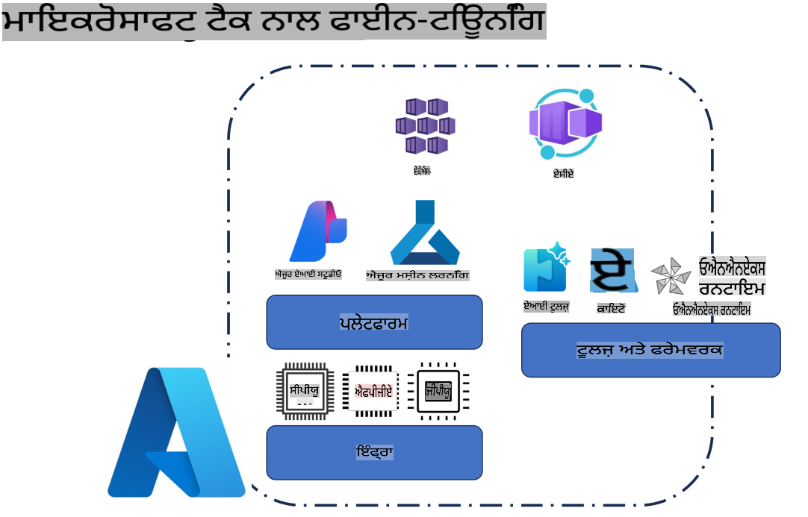
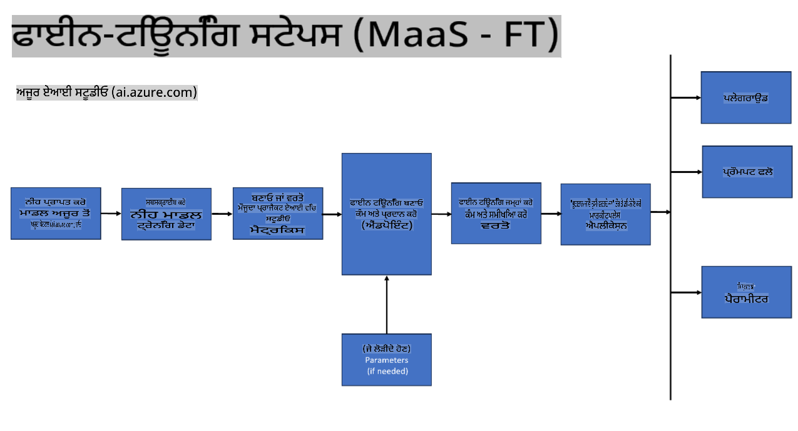
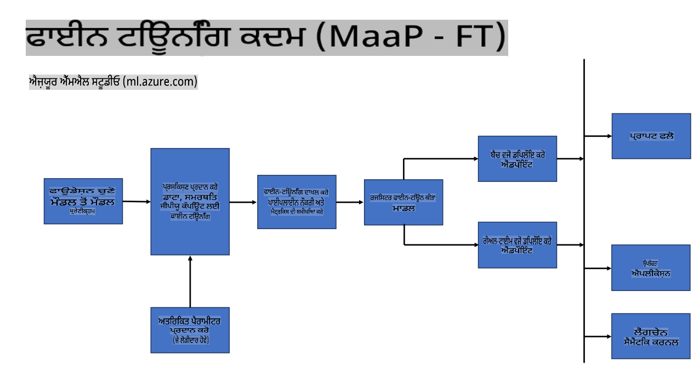
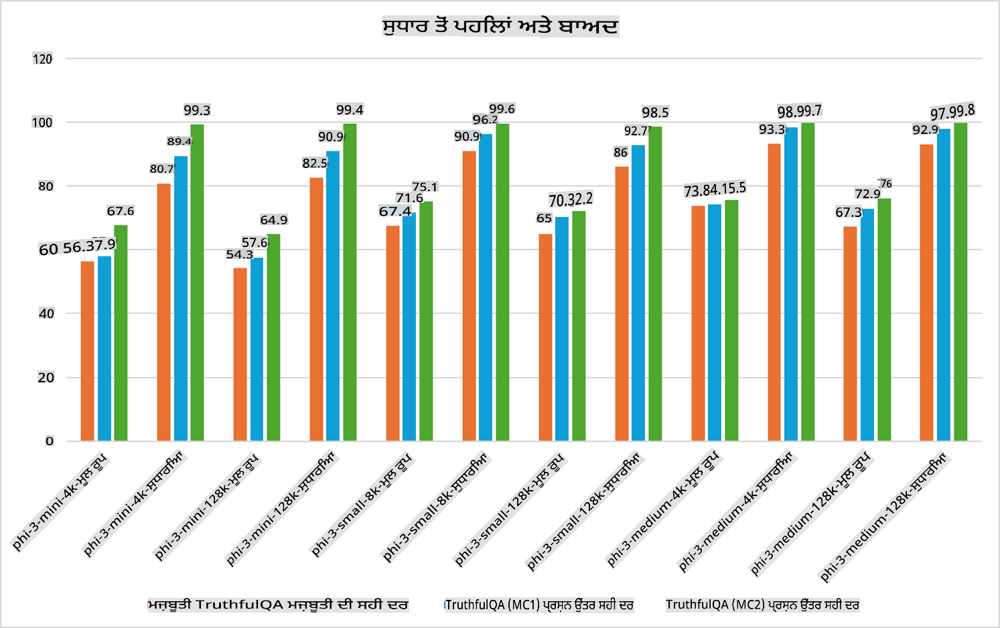

## ਫਾਈਨ ਟਿਊਨਿੰਗ ਸੇਨੇਰੀਓਜ਼

**ਪਲੇਟਫਾਰਮ** ਇਸ ਵਿੱਚ Azure AI Foundry, Azure Machine Learning, AI Tools, Kaito, ਅਤੇ ONNX Runtime ਵਰਗੀਆਂ ਵੱਖ-ਵੱਖ ਤਕਨਾਲੋਜੀਆਂ ਸ਼ਾਮਲ ਹਨ। 

**ਇੰਫ੍ਰਾਸਟਰੱਕਚਰ** ਇਸ ਵਿੱਚ CPU ਅਤੇ FPGA ਸ਼ਾਮਲ ਹਨ, ਜੋ ਕਿ ਫਾਈਨ-ਟਿਊਨਿੰਗ ਪ੍ਰਕਿਰਿਆ ਲਈ ਬਹੁਤ ਮਹੱਤਵਪੂਰਣ ਹਨ। ਮੈਨੂੰ ਤੁਹਾਨੂੰ ਹਰ ਇੱਕ ਤਕਨਾਲੋਜੀ ਲਈ ਆਈਕਾਨ ਦਿਖਾਉਣ ਦਿਓ।

**ਟੂਲਜ਼ ਅਤੇ ਫਰੇਮਵਰਕ** ਇਸ ਵਿੱਚ ONNX Runtime ਅਤੇ ONNX Runtime ਸ਼ਾਮਲ ਹਨ। ਮੈਨੂੰ ਤੁਹਾਨੂੰ ਹਰ ਇੱਕ ਤਕਨਾਲੋਜੀ ਲਈ ਆਈਕਾਨ ਦਿਖਾਉਣ ਦਿਓ।  
[ONNX Runtime ਅਤੇ ONNX Runtime ਲਈ ਆਈਕਾਨ ਸ਼ਾਮਲ ਕਰੋ]

Microsoft ਤਕਨਾਲੋਜੀਆਂ ਨਾਲ ਫਾਈਨ-ਟਿਊਨਿੰਗ ਪ੍ਰਕਿਰਿਆ ਵਿੱਚ ਵੱਖ-ਵੱਖ ਘਟਕਿਆਂ ਅਤੇ ਟੂਲਜ਼ ਦੀ ਵਰਤੋਂ ਹੁੰਦੀ ਹੈ। ਇਹ ਤਕਨਾਲੋਜੀਆਂ ਸਮਝ ਕੇ ਅਤੇ ਵਰਤ ਕੇ, ਅਸੀਂ ਆਪਣੇ ਐਪਲੀਕੇਸ਼ਨਾਂ ਨੂੰ ਪ੍ਰਭਾਵਸ਼ਾਲੀ ਢੰਗ ਨਾਲ ਫਾਈਨ-ਟਿਊਨ ਕਰ ਸਕਦੇ ਹਾਂ ਅਤੇ ਵਧੀਆ ਹੱਲ ਬਣਾਉਣ ਲਈ ਕੰਮ ਕਰ ਸਕਦੇ ਹਾਂ।  

## ਮਾਡਲ ਐਜ਼ ਸੇਵਾ

ਹੋਸਟ ਕੀਤੀ ਗਈ ਫਾਈਨ-ਟਿਊਨਿੰਗ ਦੀ ਵਰਤੋਂ ਕਰਕੇ ਮਾਡਲ ਨੂੰ ਫਾਈਨ-ਟਿਊਨ ਕਰੋ, ਬਿਨਾਂ ਕੰਪਿਊਟ ਦਾ ਪ੍ਰਬੰਧ ਕਰਨ ਦੀ ਲੋੜ।

ਸਰਵਰਲੈੱਸ ਫਾਈਨ-ਟਿਊਨਿੰਗ Phi-3-mini ਅਤੇ Phi-3-medium ਮਾਡਲਾਂ ਲਈ ਉਪਲਬਧ ਹੈ, ਜਿਸ ਨਾਲ ਡਿਵੈਲਪਰ ਕਲਾਉਡ ਅਤੇ ਐਜ ਸੇਨੇਰੀਓਜ਼ ਲਈ ਮਾਡਲਾਂ ਨੂੰ ਜਲਦੀ ਅਤੇ ਆਸਾਨੀ ਨਾਲ ਅਨੁਕੂਲਿਤ ਕਰ ਸਕਦੇ ਹਨ ਬਿਨਾਂ ਕੰਪਿਊਟ ਦੀ ਚਿੰਤਾ ਕੀਤੇ। ਅਸੀਂ ਇਹ ਵੀ ਐਲਾਨ ਕੀਤਾ ਹੈ ਕਿ Phi-3-small ਹੁਣ ਸਾਡੇ Models-as-a-Service ਆਫਰਿੰਗ ਰਾਹੀਂ ਉਪਲਬਧ ਹੈ, ਜਿਸ ਨਾਲ ਡਿਵੈਲਪਰ ਬਿਨਾਂ ਬੁਨਿਆਦੀ ਇੰਫ੍ਰਾਸਟਰੱਕਚਰ ਨੂੰ ਪ੍ਰਬੰਧਿਤ ਕੀਤੇ ਆਸਾਨੀ ਨਾਲ AI ਡਿਵੈਲਪਮੈਂਟ ਸ਼ੁਰੂ ਕਰ ਸਕਦੇ ਹਨ।  

## ਮਾਡਲ ਐਜ਼ ਪਲੇਟਫਾਰਮ

ਉਪਭੋਗਤਾ ਆਪਣੇ ਕੰਪਿਊਟ ਦਾ ਪ੍ਰਬੰਧ ਕਰਦੇ ਹਨ ਤਾਂ ਜੋ ਆਪਣੇ ਮਾਡਲਾਂ ਨੂੰ ਫਾਈਨ-ਟਿਊਨ ਕਰ ਸਕਣ।

[ਫਾਈਨ ਟਿਊਨਿੰਗ ਉਦਾਹਰਣ](https://github.com/Azure/azureml-examples/blob/main/sdk/python/foundation-models/system/finetune/chat-completion/chat-completion.ipynb)

## ਫਾਈਨ ਟਿਊਨਿੰਗ ਸੇਨੇਰੀਓਜ਼

| | | | | | | |
|-|-|-|-|-|-|-|
|ਸੇਨੇਰੀਓ|LoRA|QLoRA|PEFT|DeepSpeed|ZeRO|DORA|
|ਪ੍ਰੀ-ਟ੍ਰੇਨਡ LLMs ਨੂੰ ਖਾਸ ਕੰਮਾਂ ਜਾਂ ਡੋਮੇਨ ਲਈ ਅਨੁਕੂਲਿਤ ਕਰਨਾ|ਹਾਂ|ਹਾਂ|ਹਾਂ|ਹਾਂ|ਹਾਂ|ਹਾਂ|
|ਟੈਕਸਟ ਕਲਾਸੀਫਿਕੇਸ਼ਨ, ਨਾਂਮਿਤ ਐਂਟਿਟੀ ਰਿਕਗਨਿਸ਼ਨ ਅਤੇ ਮਸ਼ੀਨ ਟ੍ਰਾਂਸਲੇਸ਼ਨ ਵਰਗੇ NLP ਕੰਮਾਂ ਲਈ ਫਾਈਨ-ਟਿਊਨਿੰਗ|ਹਾਂ|ਹਾਂ|ਹਾਂ|ਹਾਂ|ਹਾਂ|ਹਾਂ|
|QA ਕੰਮਾਂ ਲਈ ਫਾਈਨ-ਟਿਊਨਿੰਗ|ਹਾਂ|ਹਾਂ|ਹਾਂ|ਹਾਂ|ਹਾਂ|ਹਾਂ|
|ਚੈਟਬੌਟਸ ਵਿੱਚ ਮਨੁੱਖ-ਵਰਗੇ ਜਵਾਬ ਪੈਦਾ ਕਰਨ ਲਈ ਫਾਈਨ-ਟਿਊਨਿੰਗ|ਹਾਂ|ਹਾਂ|ਹਾਂ|ਹਾਂ|ਹਾਂ|ਹਾਂ|
|ਸੰਗੀਤ, ਕਲਾ ਜਾਂ ਹੋਰ ਰਚਨਾਤਮਕ ਰੂਪ ਪੈਦਾ ਕਰਨ ਲਈ ਫਾਈਨ-ਟਿਊਨਿੰਗ|ਹਾਂ|ਹਾਂ|ਹਾਂ|ਹਾਂ|ਹਾਂ|ਹਾਂ|
|ਗਣਨਾਤਮਕ ਅਤੇ ਵਿੱਤੀ ਖਰਚੇ ਘਟਾਉਣਾ|ਹਾਂ|ਹਾਂ|ਨਹੀਂ|ਹਾਂ|ਹਾਂ|ਨਹੀਂ|
|ਮੈਮੋਰੀ ਦੀ ਵਰਤੋਂ ਘਟਾਉਣਾ|ਨਹੀਂ|ਹਾਂ|ਨਹੀਂ|ਹਾਂ|ਹਾਂ|ਹਾਂ|
|ਕੁਸ਼ਲ ਫਾਈਨ-ਟਿਊਨਿੰਗ ਲਈ ਘੱਟ ਪੈਰਾਮੀਟਰ ਵਰਤਣਾ|ਨਹੀਂ|ਹਾਂ|ਹਾਂ|ਨਹੀਂ|ਨਹੀਂ|ਹਾਂ|
|ਡਾਟਾ ਪੈਰਲੈਲਿਜ਼ਮ ਦਾ ਮੈਮੋਰੀ-ਕੁਸ਼ਲ ਰੂਪ ਜੋ ਸਾਰੇ GPU ਡਿਵਾਈਸਾਂ ਦੀ ਮਿਲੀ-ਜੁਲੀ GPU ਮੈਮੋਰੀ ਦੀ ਪਹੁੰਚ ਦਿੰਦਾ ਹੈ|ਨਹੀਂ|ਨਹੀਂ|ਨਹੀਂ|ਹਾਂ|ਹਾਂ|ਹਾਂ|

## ਫਾਈਨ ਟਿਊਨਿੰਗ ਪ੍ਰਦਰਸ਼ਨ ਦੇ ਉਦਾਹਰਣ

**ਅਸਵੀਕਤੀ**:  
ਇਹ ਦਸਤਾਵੇਜ਼ ਮਸ਼ੀਨ-ਅਧਾਰਿਤ AI ਅਨੁਵਾਦ ਸੇਵਾਵਾਂ ਦੀ ਵਰਤੋਂ ਕਰਕੇ ਅਨੁਵਾਦ ਕੀਤਾ ਗਿਆ ਹੈ। ਅਸੀਂ ਸਹੀ ਹੋਣ ਦੀ ਪੂਰੀ ਕੋਸ਼ਿਸ਼ ਕਰਦੇ ਹਾਂ, ਪਰ ਕਿਰਪਾ ਕਰਕੇ ਧਿਆਨ ਦਿਓ ਕਿ ਆਟੋਮੇਟਿਕ ਅਨੁਵਾਦਾਂ ਵਿੱਚ ਗਲਤੀਆਂ ਜਾਂ ਅਸੁੱਚਤਤਾਵਾਂ ਹੋ ਸਕਦੀਆਂ ਹਨ। ਮੂਲ ਦਸਤਾਵੇਜ਼ ਨੂੰ ਇਸਦੀ ਮੂਲ ਭਾਸ਼ਾ ਵਿੱਚ ਅਧਿਕਾਰਤ ਸਰੋਤ ਮੰਨਿਆ ਜਾਣਾ ਚਾਹੀਦਾ ਹੈ। ਮਹੱਤਵਪੂਰਨ ਜਾਣਕਾਰੀ ਲਈ, ਪੇਸ਼ੇਵਰ ਮਨੁੱਖੀ ਅਨੁਵਾਦ ਦੀ ਸਿਫਾਰਸ਼ ਕੀਤੀ ਜਾਂਦੀ ਹੈ। ਇਸ ਅਨੁਵਾਦ ਦੇ ਪ੍ਰਯੋਗ ਤੋਂ ਪੈਦਾ ਹੋਈ ਕਿਸੇ ਵੀ ਗਲਤ ਫਹਿਮੀ ਜਾਂ ਗਲਤ ਵਿਆਖਿਆ ਲਈ ਅਸੀਂ ਜ਼ਿੰਮੇਵਾਰ ਨਹੀਂ ਹਾਂ।