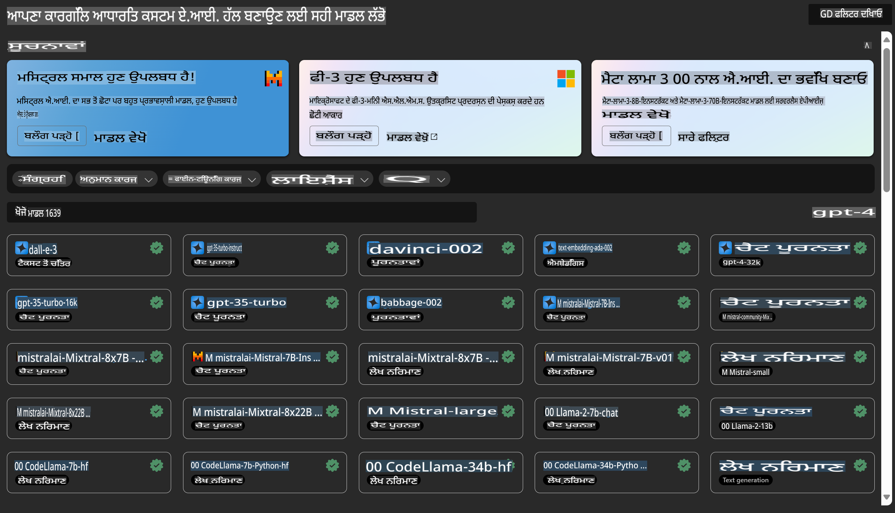

# **Azure Machine Learning ਸੇਵਾ ਨਾਲ ਜਾਣ ਪਛਾਣ ਕਰੋ**

[Azure Machine Learning](https://ml.azure.com?WT.mc_id=aiml-138114-kinfeylo) ਇੱਕ ਕਲਾਉਡ ਸੇਵਾ ਹੈ ਜੋ ਮਸ਼ੀਨ ਲਰਨਿੰਗ (ML) ਪ੍ਰੋਜੈਕਟ ਲਾਈਫਸਾਈਕਲ ਨੂੰ ਤੇਜ਼ ਅਤੇ ਪ੍ਰਬੰਧਿਤ ਕਰਨ ਲਈ ਹੈ।

ML ਪ੍ਰੋਫੈਸ਼ਨਲ, ਡਾਟਾ ਸਾਇੰਟਿਸਟਸ, ਅਤੇ ਇੰਜੀਨੀਅਰ ਇਸਨੂੰ ਆਪਣੀਆਂ ਰੋਜ਼ਾਨਾ ਵਰਕਫਲੋਜ਼ ਵਿੱਚ ਵਰਤ ਸਕਦੇ ਹਨ:

- ਮਾਡਲ ਟ੍ਰੇਨ ਅਤੇ ਡਿਪਲੋਇ ਕਰੋ।  
ਮਸ਼ੀਨ ਲਰਨਿੰਗ ਆਪਰੇਸ਼ਨਜ਼ (MLOps) ਦਾ ਪ੍ਰਬੰਧਨ ਕਰੋ।  
- ਤੁਸੀਂ Azure Machine Learning ਵਿੱਚ ਮਾਡਲ ਬਣਾਉਣ ਜਾਂ PyTorch, TensorFlow, ਜਾਂ scikit-learn ਵਰਗੇ ਓਪਨ-ਸੋਰਸ ਪਲੇਟਫਾਰਮ ਤੋਂ ਬਣੇ ਮਾਡਲ ਨੂੰ ਵਰਤ ਸਕਦੇ ਹੋ।  
- MLOps ਟੂਲਜ਼ ਤੁਹਾਨੂੰ ਮਾਡਲਜ਼ ਦੀ ਨਿਗਰਾਨੀ, ਰੀਟ੍ਰੇਨ, ਅਤੇ ਰੀਡਿਪਲੋਇ ਕਰਨ ਵਿੱਚ ਮਦਦ ਕਰਦੇ ਹਨ।  

## Azure Machine Learning ਕਿਸ ਲਈ ਹੈ?

**ਡਾਟਾ ਸਾਇੰਟਿਸਟਸ ਅਤੇ ML ਇੰਜੀਨੀਅਰ**

ਉਹ ਆਪਣੇ ਦਿਨ-ਚੋ-ਦਿਨ ਦੇ ਕੰਮਾਂ ਨੂੰ ਤੇਜ਼ ਅਤੇ ਆਟੋਮੈਟ ਕਰਨ ਲਈ ਟੂਲਜ਼ ਵਰਤ ਸਕਦੇ ਹਨ।  
Azure ML ਨਿਰਪੱਖਤਾ, ਵਿਆਖਿਆਸ਼ੀਲਤਾ, ਟ੍ਰੈਕਿੰਗ, ਅਤੇ ਆਡਿਟਬਿਲਟੀ ਲਈ ਫੀਚਰ ਪ੍ਰਦਾਨ ਕਰਦਾ ਹੈ।  

**ਐਪਲੀਕੇਸ਼ਨ ਡਿਵੈਲਪਰ**

ਉਹ ਮਾਡਲ ਨੂੰ ਆਸਾਨੀ ਨਾਲ ਐਪਲੀਕੇਸ਼ਨ ਜਾਂ ਸੇਵਾਵਾਂ ਵਿੱਚ ਇੰਟੀਗ੍ਰੇਟ ਕਰ ਸਕਦੇ ਹਨ।  

**ਪਲੇਟਫਾਰਮ ਡਿਵੈਲਪਰ**

ਉਹਨਾਂ ਕੋਲ ਇੱਕ ਮਜ਼ਬੂਤ ਟੂਲਸ ਸੈੱਟ ਤੱਕ ਪਹੁੰਚ ਹੈ ਜੋ ਮਜ਼ਬੂਤ Azure Resource Manager APIs ਦੁਆਰਾ ਸਮਰਥਿਤ ਹੈ।  
ਇਹ ਟੂਲਜ਼ ਉੱਨਤ ML ਟੂਲਿੰਗ ਬਣਾਉਣ ਦੀ ਆਗਿਆ ਦਿੰਦੇ ਹਨ।  

**ਇੰਟਰਪ੍ਰਾਈਜ਼**

Microsoft Azure ਕਲਾਉਡ ਵਿੱਚ ਕੰਮ ਕਰਦਿਆਂ, ਇੰਟਰਪ੍ਰਾਈਜ਼ ਜਾਣ-ਪਛਾਣ ਵਾਲੀ ਸੁਰੱਖਿਆ ਅਤੇ ਰੋਲ-ਬੇਸਡ ਐਕਸੈਸ ਕੰਟਰੋਲ ਦਾ ਲਾਭ ਲੈਂਦੇ ਹਨ।  
ਸੁਰੱਖਿਅਤ ਡਾਟਾ ਅਤੇ ਖਾਸ ਔਪਰੇਸ਼ਨਜ਼ ਤੱਕ ਪਹੁੰਚ ਕੰਟਰੋਲ ਕਰਨ ਲਈ ਪ੍ਰੋਜੈਕਟ ਸੈਟ ਕਰੋ।  

## ਟੀਮ ਦੇ ਹਰ ਮੈਂਬਰ ਲਈ ਉਤਪਾਦਕਤਾ  
ML ਪ੍ਰੋਜੈਕਟ ਅਕਸਰ ਇੱਕ ਵੱਖ-ਵੱਖ ਕੌਸ਼ਲ ਸੈੱਟ ਵਾਲੀ ਟੀਮ ਦੀ ਲੋੜ ਹੁੰਦੀ ਹੈ ਜੋ ਉਸਨੂੰ ਬਣਾਉਣ ਅਤੇ ਰੱਖਣ ਵਿੱਚ ਯੋਗ ਹੋਵੇ।  

Azure ML ਉਹ ਟੂਲ ਪ੍ਰਦਾਨ ਕਰਦਾ ਹੈ ਜੋ ਤੁਹਾਨੂੰ ਸਮਰਥ ਬਣਾਉਂਦਾ ਹੈ:  
- ਸਾਂਝੇ ਨੋਟਬੁੱਕਸ, ਕੰਪਿਊਟ ਰਿਸੋਰਸ, ਸਰਵਰਲੇਸ ਕੰਪਿਊਟ, ਡਾਟਾ, ਅਤੇ ਵਾਤਾਵਰਣਾਂ ਦੁਆਰਾ ਆਪਣੀ ਟੀਮ ਨਾਲ ਸਹਿਯੋਗ ਕਰੋ।  
- ਮਾਡਲ ਨੂੰ ਨਿਰਪੱਖਤਾ, ਵਿਆਖਿਆਸ਼ੀਲਤਾ, ਟ੍ਰੈਕਿੰਗ, ਅਤੇ ਆਡਿਟਬਿਲਟੀ ਦੇ ਨਾਲ ਵਿਕਸਿਤ ਕਰੋ ਤਾਂ ਜੋ ਲਾਈਨਏਜ ਅਤੇ ਆਡਿਟ ਕਮਪਲਾਇੰਸ ਦੀਆਂ ਲੋੜਾਂ ਪੂਰੀਆਂ ਕੀਤੀਆਂ ਜਾ ਸਕਣ।  
- ML ਮਾਡਲਜ਼ ਨੂੰ ਤੇਜ਼ੀ ਅਤੇ ਆਸਾਨੀ ਨਾਲ ਵਿਆਪਕ ਪੱਧਰ 'ਤੇ ਡਿਪਲੋਇ ਕਰੋ ਅਤੇ MLOps ਨਾਲ ਉਨ੍ਹਾਂ ਨੂੰ ਕੁਸ਼ਲਤਾਪੂਰਵਕ ਪ੍ਰਬੰਧਿਤ ਅਤੇ ਸ਼ਾਸਿਤ ਕਰੋ।  
- ਬਿਲਟ-ਇਨ ਗਵਰਨੈਂਸ, ਸੁਰੱਖਿਆ, ਅਤੇ ਕਮਪਲਾਇੰਸ ਦੇ ਨਾਲ ਕਿਤੇ ਵੀ ਮਸ਼ੀਨ ਲਰਨਿੰਗ ਵਰਕਲੋਡ ਚਲਾਓ।  

## ਕ੍ਰਾਸ-ਕੰਪੈਟਬਲ ਪਲੇਟਫਾਰਮ ਟੂਲਜ਼  

ML ਟੀਮ ਦਾ ਕੋਈ ਵੀ ਮੈਂਬਰ ਆਪਣਾ ਪਸੰਦੀਦਾ ਟੂਲ ਵਰਤ ਕੇ ਕੰਮ ਮੁਕੰਮਲ ਕਰ ਸਕਦਾ ਹੈ।  
ਤੁਸੀਂ ਤੇਜ਼ ਤਜਰਬੇ ਚਲਾਉਣ, ਹਾਈਪਰਪੈਰਾਮੀਟਰ ਟਿਊਨਿੰਗ, ਪਾਈਪਲਾਈਨ ਬਣਾਉਣ ਜਾਂ ਇੰਫਰੰਸ ਮੈਨੇਜ ਕਰਨ ਲਈ ਜਾਣ-ਪਛਾਣ ਵਾਲੇ ਇੰਟਰਫੇਸ ਵਰਤ ਸਕਦੇ ਹੋ, ਜਿਵੇਂ ਕਿ:  
- Azure Machine Learning Studio  
- Python SDK (v2)  
- Azure CLI (v2)  
- Azure Resource Manager REST APIs  

ਜਿਵੇਂ ਤੁਸੀਂ ਮਾਡਲਜ਼ ਨੂੰ ਸੁਧਾਰਦੇ ਹੋ ਅਤੇ ਵਿਕਾਸ ਚੱਕਰ ਦੌਰਾਨ ਸਹਿਯੋਗ ਕਰਦੇ ਹੋ, ਤੁਸੀਂ Azure Machine Learning studio UI ਵਿੱਚ ਐਸੈਟਸ, ਰਿਸੋਰਸ, ਅਤੇ ਮੈਟ੍ਰਿਕਸ ਸਾਂਝੇ ਅਤੇ ਖੋਜ ਸਕਦੇ ਹੋ।  

## **Azure ML ਵਿੱਚ LLM/SLM**

Azure ML ਨੇ ਕਈ LLM/SLM-ਸੰਬੰਧੀ ਫੰਕਸ਼ਨ ਸ਼ਾਮਲ ਕੀਤੇ ਹਨ, ਜੋ LLMOps ਅਤੇ SLMOps ਨੂੰ ਜੋੜ ਕੇ ਇੰਟਰਪ੍ਰਾਈਜ਼ ਪੱਧਰ ਦੀ ਜਨਰੇਟਿਵ ਆਰਟੀਫੀਸ਼ਲ ਇੰਟੈਲੀਜੈਂਸ ਟੈਕਨੋਲੋਜੀ ਪਲੇਟਫਾਰਮ ਬਣਾਉਂਦੇ ਹਨ।  

### **ਮਾਡਲ ਕੈਟਾਲਾਗ**  

ਇੰਟਰਪ੍ਰਾਈਜ਼ ਯੂਜ਼ਰ ਵੱਖ-ਵੱਖ ਕਾਰੋਬਾਰੀ ਸਥਿਤੀਆਂ ਅਨੁਸਾਰ ਵੱਖ-ਵੱਖ ਮਾਡਲ ਤੈਨਾਤ ਕਰ ਸਕਦੇ ਹਨ ਮਾਡਲ ਕੈਟਾਲਾਗ ਰਾਹੀਂ ਅਤੇ ਮਾਡਲ ਐਜ਼ ਸੇਵਾ ਦੇ ਤੌਰ 'ਤੇ ਸੇਵਾਵਾਂ ਪ੍ਰਦਾਨ ਕਰ ਸਕਦੇ ਹਨ, ਜਿਹਨਾਂ ਨੂੰ ਇੰਟਰਪ੍ਰਾਈਜ਼ ਡਿਵੈਲਪਰ ਜਾਂ ਯੂਜ਼ਰ ਐਕਸੈਸ ਕਰ ਸਕਦੇ ਹਨ।  

  

Azure Machine Learning studio ਵਿੱਚ ਮਾਡਲ ਕੈਟਾਲਾਗ ਉਹ ਕੇਂਦਰ ਹੈ ਜਿੱਥੇ ਤੁਸੀਂ ਵੱਖ-ਵੱਖ ਮਾਡਲ ਖੋਜ ਅਤੇ ਵਰਤ ਸਕਦੇ ਹੋ ਜੋ ਤੁਹਾਨੂੰ ਜਨਰੇਟਿਵ AI ਐਪਲੀਕੇਸ਼ਨ ਬਣਾਉਣ ਦੇ ਯੋਗ ਬਣਾਉਂਦੇ ਹਨ। ਮਾਡਲ ਕੈਟਾਲਾਗ ਵਿੱਚ ਸੈਂਕੜੇ ਮਾਡਲ ਸ਼ਾਮਲ ਹਨ ਜੋ ਮਾਡਲ ਪ੍ਰਦਾਤਾਵਾਂ ਤੋਂ ਪ੍ਰਾਪਤ ਹਨ ਜਿਵੇਂ ਕਿ Azure OpenAI ਸੇਵਾ, Mistral, Meta, Cohere, Nvidia, Hugging Face, ਅਤੇ Microsoft ਦੁਆਰਾ ਟ੍ਰੇਨ ਕੀਤੇ ਮਾਡਲ। Microsoft ਤੋਂ ਇਲਾਵਾ ਦੂਜੇ ਪ੍ਰਦਾਤਾਵਾਂ ਦੇ ਮਾਡਲ Microsoft ਦੀਆਂ ਉਤਪਾਦ ਸ਼ਰਤਾਂ ਵਿੱਚ ਪਰਿਭਾਸ਼ਿਤ Non-Microsoft Products ਹਨ ਅਤੇ ਮਾਡਲ ਨਾਲ ਪ੍ਰਦਾਨ ਕੀਤੀਆਂ ਸ਼ਰਤਾਂ ਦੇ ਅਧੀਨ ਹਨ।  

### **ਜੌਬ ਪਾਈਪਲਾਈਨ**  

ਮਸ਼ੀਨ ਲਰਨਿੰਗ ਪਾਈਪਲਾਈਨ ਦਾ ਮੁੱਖ ਕੇਂਦਰ ਇੱਕ ਪੂਰੇ ਮਸ਼ੀਨ ਲਰਨਿੰਗ ਕੰਮ ਨੂੰ ਬਹੁ-ਕਦਮ ਵਰਕਫਲੋ ਵਿੱਚ ਵੰਡਣਾ ਹੈ। ਹਰ ਕਦਮ ਇੱਕ ਪ੍ਰਬੰਧਣਯੋਗ ਹਿੱਸਾ ਹੁੰਦਾ ਹੈ ਜਿਸਨੂੰ ਅਲੱਗ-ਅਲੱਗ ਵਿਕਸਿਤ, ਅਪਟਮਾਈਜ਼, ਕਨਫਿਗਰ, ਅਤੇ ਆਟੋਮੇਟ ਕੀਤਾ ਜਾ ਸਕਦਾ ਹੈ। ਕਦਮਾਂ ਨੂੰ ਚੰਗੀ ਤਰ੍ਹਾਂ-ਪਰਿਭਾਸ਼ਿਤ ਇੰਟਰਫੇਸਾਂ ਰਾਹੀਂ ਜੁੜਿਆ ਜਾਂਦਾ ਹੈ। Azure Machine Learning ਪਾਈਪਲਾਈਨ ਸੇਵਾ ਪਾਈਪਲਾਈਨ ਕਦਮਾਂ ਦੇ ਸਾਰੇ ਡਿਪੈਂਡੇੰਸੀਜ਼ ਨੂੰ ਆਪਣੇ ਆਪ ਆਰਕੇਸਟਰੇਟ ਕਰਦੀ ਹੈ।  

SLM / LLM ਨੂੰ ਫਾਈਨ-ਟਿਊਨ ਕਰਦੇ ਹੋਏ, ਅਸੀਂ ਪਾਈਪਲਾਈਨ ਰਾਹੀਂ ਆਪਣੇ ਡਾਟਾ, ਟ੍ਰੇਨਿੰਗ, ਅਤੇ ਜਨਰੇਸ਼ਨ ਪ੍ਰਕਿਰਿਆਵਾਂ ਦਾ ਪ੍ਰਬੰਧਨ ਕਰ ਸਕਦੇ ਹਾਂ।  

  

### **ਪ੍ਰਾਂਪਟ ਫਲੋ**  

Azure Machine Learning ਪ੍ਰਾਂਪਟ ਫਲੋ ਵਰਤਣ ਦੇ ਫਾਇਦੇ  
Azure Machine Learning ਪ੍ਰਾਂਪਟ ਫਲੋ ਉਪਭੋਗਤਾਵਾਂ ਨੂੰ ਵਿਚਾਰ ਤੋਂ ਤਜਰਬੇ ਅਤੇ ਅਖੀਰ ਵਿੱਚ ਉਤਪਾਦਨ-ਤਿਆਰ LLM-ਅਧਾਰਿਤ ਐਪਲੀਕੇਸ਼ਨਾਂ ਤੱਕ ਲਿਜਾਣ ਵਿੱਚ ਮਦਦ ਕਰਨ ਲਈ ਕਈ ਫਾਇਦੇ ਪ੍ਰਦਾਨ ਕਰਦਾ ਹੈ:  

**ਪ੍ਰਾਂਪਟ ਇੰਜੀਨੀਅਰਿੰਗ ਫੁਰਤੀ**  

ਇੰਟਰੈਕਟਿਵ ਆਥਰਿੰਗ ਅਨੁਭਵ: Azure Machine Learning ਪ੍ਰਾਂਪਟ ਫਲੋ ਫਲੋ ਦੀ ਸੰਰਚਨਾ ਦਾ ਦ੍ਰਿਸ਼ਟੀਗੋਚਿਤ ਪ੍ਰਤੀਨਿਧਿਤਾ ਪ੍ਰਦਾਨ ਕਰਦਾ ਹੈ, ਜੋ ਉਪਭੋਗਤਾਵਾਂ ਨੂੰ ਆਪਣੇ ਪ੍ਰੋਜੈਕਟਾਂ ਨੂੰ ਆਸਾਨੀ ਨਾਲ ਸਮਝਣ ਅਤੇ ਨੈਵੀਗੇਟ ਕਰਨ ਦੇ ਯੋਗ ਬਣਾਉਂਦਾ ਹੈ। ਇਹ ਇੱਕ ਨੋਟਬੁੱਕ-ਜਿਵੇਂ ਕੋਡਿੰਗ ਅਨੁਭਵ ਵੀ ਦਿੰਦਾ ਹੈ ਜੋ ਫਲੋ ਵਿਕਾਸ ਅਤੇ ਡਿਬੱਗਿੰਗ ਲਈ ਕੁਸ਼ਲ ਹੈ।  
ਪ੍ਰਾਂਪਟ ਟਿਊਨਿੰਗ ਲਈ ਵੈਰੀਐਂਟਸ: ਉਪਭੋਗਤਾ ਕਈ ਪ੍ਰਾਂਪਟ ਵੈਰੀਐਂਟਸ ਬਣਾਉਣ ਅਤੇ ਤੁਲਨਾ ਕਰ ਸਕਦੇ ਹਨ, ਜੋ ਇੱਕ ਦੌਰਾਈ ਸੂਧਾਰ ਪ੍ਰਕਿਰਿਆ ਨੂੰ ਸਹਿਯੋਗ ਦਿੰਦਾ ਹੈ।  

ਮੂਲਾਂਕਨ: ਬਿਲਟ-ਇਨ ਮੂਲਾਂਕਨ ਫਲੋਜ਼ ਉਪਭੋਗਤਾਵਾਂ ਨੂੰ ਆਪਣੇ ਪ੍ਰਾਂਪਟ ਅਤੇ ਫਲੋਜ਼ ਦੀ ਗੁਣਵੱਤਾ ਅਤੇ ਪ੍ਰਭਾਵਸ਼ੀਲਤਾ ਦਾ ਅੰਕਲਨ ਕਰਨ ਦੇ ਯੋਗ ਬਣਾਉਂਦੇ ਹਨ।  

ਵਿਆਪਕ ਸਰੋਤ: Azure Machine Learning ਪ੍ਰਾਂਪਟ ਫਲੋ ਵਿੱਚ ਬਿਲਟ-ਇਨ ਟੂਲਜ਼, ਨਮੂਨੇ, ਅਤੇ ਟੈਂਪਲੇਟਾਂ ਦੀ ਇੱਕ ਲਾਇਬ੍ਰੇਰੀ ਸ਼ਾਮਲ ਹੈ ਜੋ ਵਿਕਾਸ ਲਈ ਸ਼ੁਰੂਆਤੀ ਬਿੰਦੂ ਦੇ ਤੌਰ 'ਤੇ ਕੰਮ ਕਰਦੀ ਹੈ, ਸਿਰਜਣਸ਼ੀਲਤਾ ਨੂੰ ਪ੍ਰੇਰਿਤ ਕਰਦੀ ਹੈ ਅਤੇ ਪ੍ਰਕਿਰਿਆ ਨੂੰ ਤੇਜ਼ ਕਰਦੀ ਹੈ।  

**LLM-ਅਧਾਰਿਤ ਐਪਲੀਕੇਸ਼ਨਾਂ ਲਈ ਇੰਟਰਪ੍ਰਾਈਜ਼ ਤਿਆਰੀ**  

ਸਹਿਯੋਗ: Azure Machine Learning ਪ੍ਰਾਂਪਟ ਫਲੋ ਟੀਮ ਸਹਿਯੋਗ ਦਾ ਸਮਰਥਨ ਕਰਦਾ ਹੈ, ਜੋ ਕਈ ਉਪਭੋਗਤਾਵਾਂ ਨੂੰ ਪ੍ਰਾਂਪਟ ਇੰਜੀਨੀਅਰਿੰਗ ਪ੍ਰੋਜੈਕਟਾਂ 'ਤੇ ਇਕੱਠੇ ਕੰਮ ਕਰਨ, ਗਿਆਨ ਸਾਂਝਾ ਕਰਨ, ਅਤੇ ਵਰਜਨ ਕੰਟਰੋਲ ਰੱਖਣ ਦੇ ਯੋਗ ਬਣਾਉਂਦਾ ਹੈ।  

ਸਭ ਕੁਝ ਇੱਕ ਹੀ ਪਲੇਟਫਾਰਮ 'ਤੇ: Azure Machine Learning ਪ੍ਰਾਂਪਟ ਫਲੋ ਪੂਰੇ ਪ੍ਰਾਂਪਟ ਇੰਜੀਨੀਅਰਿੰਗ ਪ੍ਰਕਿਰਿਆ ਨੂੰ ਸਧਾਰਨ ਕਰਦਾ ਹੈ, ਵਿਕਾਸ ਅਤੇ ਮੂਲਾਂਕਨ ਤੋਂ ਲੈ ਕੇ ਡਿਪਲੋਇਮੈਂਟ ਅਤੇ ਨਿਗਰਾਨੀ ਤੱਕ। ਉਪਭੋਗਤਾ ਆਪਣੀਆਂ ਫਲੋਜ਼ ਨੂੰ Azure Machine Learning ਐਂਡਪੋਇੰਟਸ ਵਜੋਂ ਆਸਾਨੀ ਨਾਲ ਡਿਪਲੋਇ ਕਰ ਸਕਦੇ ਹਨ ਅਤੇ ਉਨ੍ਹਾਂ ਦੇ ਪ੍ਰਦਰਸ਼ਨ ਦੀ ਅਸਲੀ ਸਮੇਂ ਵਿੱਚ ਨਿਗਰਾਨੀ ਕਰ ਸਕਦੇ ਹਨ, ਜੋ ਸੁਚਾਰੂ ਕਾਰਵਾਈ ਅਤੇ ਨਿਰੰਤਰ ਸੁਧਾਰ ਨੂੰ ਯਕੀਨੀ ਬਣਾਉਂਦਾ ਹੈ।  

Azure Machine Learning ਇੰਟਰਪ੍ਰਾਈਜ਼ ਤਿਆਰੀ ਹੱਲ: ਪ੍ਰਾਂਪਟ ਫਲੋ Azure Machine Learning ਦੇ ਮਜ਼ਬੂਤ ​​ਇੰਟਰਪ੍ਰਾਈਜ਼ ਤਿਆਰੀ ਹੱਲਾਂ ਦਾ ਲਾਭ ਲੈਂਦਾ ਹੈ, ਜੋ ਫਲੋਜ਼ ਦੇ ਵਿਕਾਸ, ਤਜਰਬੇ, ਅਤੇ ਡਿਪਲੋਇਮੈਂਟ ਲਈ ਇੱਕ ਸੁਰੱਖਿਅਤ, ਸਕੇਲਬਲ, ਅਤੇ ਭਰੋਸੇਮੰਦ ਅਧਾਰ ਪ੍ਰਦਾਨ ਕਰਦਾ ਹੈ।  

Azure Machine Learning ਪ੍ਰਾਂਪਟ ਫਲੋ ਨਾਲ, ਉਪਭੋਗਤਾ ਆਪਣੀ ਪ੍ਰਾਂਪਟ ਇੰਜੀਨੀਅਰਿੰਗ ਫੁਰਤੀ ਨੂੰ ਅਨਲੌਕ ਕਰ ਸਕਦੇ ਹਨ, ਕੁਸ਼ਲਤਾਪੂਰਵਕ ਸਹਿਯੋਗ ਕਰ ਸਕਦੇ ਹਨ, ਅਤੇ ਸਫਲ LLM-ਅਧਾਰਿਤ ਐਪਲੀਕੇਸ਼ਨ ਵਿਕਾਸ ਅਤੇ ਡਿਪਲੋਇਮੈਂਟ ਲਈ ਇੰਟਰਪ੍ਰਾਈਜ਼-ਗ੍ਰੇਡ ਹੱਲਾਂ ਦਾ ਲਾਭ ਲੈ ਸਕਦੇ ਹਨ।  

Azure ML ਦੀ ਗਣਨਾ ਸ਼ਕਤੀ, ਡਾਟਾ, ਅਤੇ ਵੱਖ-ਵੱਖ ਘਟਕਿਆਂ ਨੂੰ ਜੋੜ ਕੇ, ਇੰਟਰਪ੍ਰਾਈਜ਼ ਡਿਵੈਲਪਰ ਆਪਣੇ ਖੁਦ ਦੇ ਕ੍ਰਿਤਰਿਮ ਬੁੱਧੀ ਐਪਲੀਕੇਸ਼ਨ ਆਸਾਨੀ ਨਾਲ ਬਣਾਉਣ ਦੇ ਯੋਗ ਹਨ।  

**ਅਸਵੀਕਰਨ**:  
ਇਹ ਦਸਤਾਵੇਜ਼ ਮਸ਼ੀਨ-ਅਧਾਰਿਤ AI ਅਨੁਵਾਦ ਸੇਵਾਵਾਂ ਦੀ ਵਰਤੋਂ ਕਰਕੇ ਅਨੁਵਾਦ ਕੀਤਾ ਗਿਆ ਹੈ। ਅਸੀਂ ਸਹੀਪਨ ਲਈ ਕੋਸ਼ਿਸ਼ ਕਰਦੇ ਹਾਂ, ਪਰ ਕਿਰਪਾ ਕਰਕੇ ਧਿਆਨ ਵਿੱਚ ਰੱਖੋ ਕਿ ਸਵੈਚਾਲਿਤ ਅਨੁਵਾਦਾਂ ਵਿੱਚ ਗਲਤੀਆਂ ਜਾਂ ਅਸੁਚੱਜੇਪਨ ਹੋ ਸਕਦੇ ਹਨ। ਇਸ ਦੀ ਮੂਲ ਭਾਸ਼ਾ ਵਿੱਚ ਮੌਜੂਦ ਮੂਲ ਦਸਤਾਵੇਜ਼ ਨੂੰ ਪ੍ਰਮਾਣਿਕ ਸਰੋਤ ਮੰਨਿਆ ਜਾਣਾ ਚਾਹੀਦਾ ਹੈ। ਮਹੱਤਵਪੂਰਨ ਜਾਣਕਾਰੀ ਲਈ, ਪੇਸ਼ੇਵਰ ਮਨੁੱਖੀ ਅਨੁਵਾਦ ਦੀ ਸਿਫਾਰਸ਼ ਕੀਤੀ ਜਾਂਦੀ ਹੈ। ਇਸ ਅਨੁਵਾਦ ਦੇ ਉਪਯੋਗ ਤੋਂ ਪੈਦਾ ਹੋਣ ਵਾਲੇ ਕਿਸੇ ਵੀ ਗਲਤਫਹਿਮੀ ਜਾਂ ਗਲਤ ਵਿਆਖਿਆ ਲਈ ਅਸੀਂ ਜ਼ਿੰਮੇਵਾਰ ਨਹੀਂ ਹਾਂ।