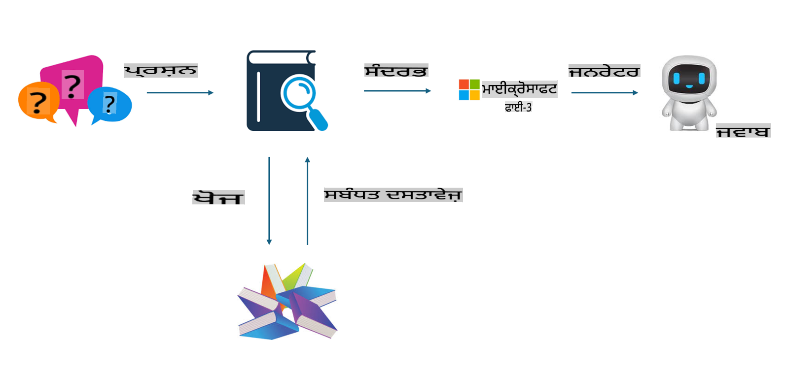
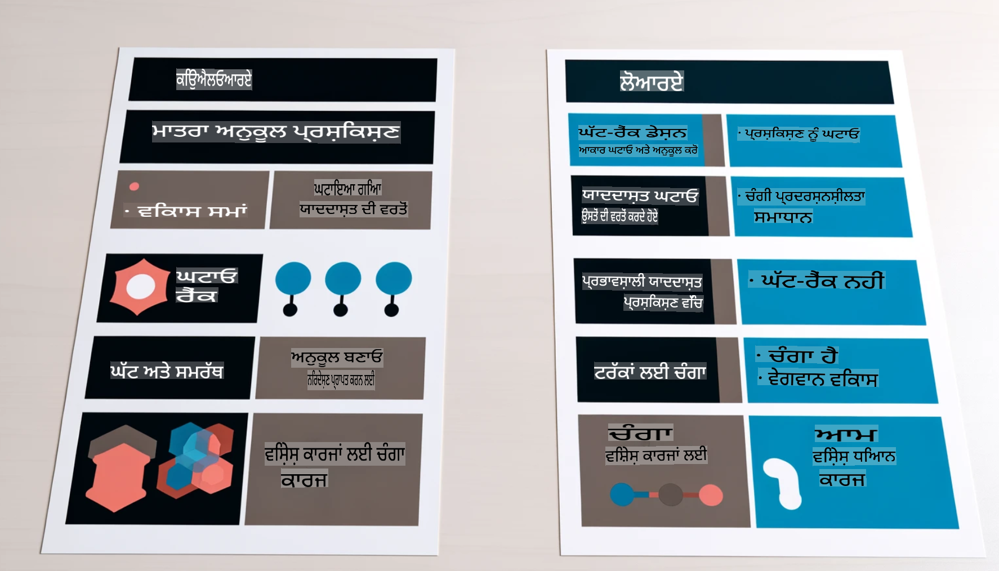

# **Phi-3 ਨੂੰ ਇੱਕ ਉਦਯੋਗ ਵਿਸ਼ੇਸ਼ਜਾਗ ਬਣਾਓ**

Phi-3 ਮਾਡਲ ਨੂੰ ਕਿਸੇ ਉਦਯੋਗ ਵਿੱਚ ਲਾਗੂ ਕਰਨ ਲਈ, ਤੁਹਾਨੂੰ Phi-3 ਮਾਡਲ ਵਿੱਚ ਉਦਯੋਗ ਦੇ ਕਾਰੋਬਾਰੀ ਡਾਟਾ ਨੂੰ ਸ਼ਾਮਲ ਕਰਨ ਦੀ ਲੋੜ ਹੈ। ਇਸਦੇ ਲਈ ਸਾਨੂੰ ਦੋ ਵਿਕਲਪ ਮਿਲਦੇ ਹਨ, ਪਹਿਲਾ RAG (Retrieval Augmented Generation) ਅਤੇ ਦੂਜਾ Fine Tuning।

## **RAG ਅਤੇ Fine-Tuning ਦਾ ਮੁਕਾਬਲਾ**

### **Retrieval Augmented Generation**

RAG ਡਾਟਾ ਰੀਟਰੀਵਲ + ਟੈਕਸਟ ਜਨਰੇਸ਼ਨ ਹੈ। ਉਦਯੋਗ ਦੇ ਸੰਗਠਿਤ ਅਤੇ ਅਸੰਗਠਿਤ ਡਾਟਾ ਨੂੰ ਵੇਕਟਰ ਡਾਟਾਬੇਸ ਵਿੱਚ ਸਟੋਰ ਕੀਤਾ ਜਾਂਦਾ ਹੈ। ਜਦੋਂ ਸੰਬੰਧਿਤ ਸਮੱਗਰੀ ਦੀ ਖੋਜ ਕੀਤੀ ਜਾਂਦੀ ਹੈ, ਤਾਂ ਸੰਬੰਧਿਤ ਸਾਰ ਅਤੇ ਸਮੱਗਰੀ ਨੂੰ ਖੋਜ ਕੇ ਇੱਕ ਸੰਦਰਭ ਬਣਾਇਆ ਜਾਂਦਾ ਹੈ, ਅਤੇ LLM/SLM ਦੀ ਟੈਕਸਟ ਪੂਰਨ ਕਰਨ ਦੀ ਸਮਰੱਥਾ ਨਾਲ ਜੋੜ ਕੇ ਸਮੱਗਰੀ ਤਿਆਰ ਕੀਤੀ ਜਾਂਦੀ ਹੈ।  

### **Fine-tuning**

Fine-tuning ਕਿਸੇ ਮਾਡਲ ਵਿੱਚ ਸੁਧਾਰ ਕਰਨ ਦੀ ਪ੍ਰਕਿਰਿਆ ਹੈ। ਇਸ ਵਿੱਚ ਮਾਡਲ ਅਲਗੋਰਿਦਮ ਤੋਂ ਸ਼ੁਰੂਆਤ ਕਰਨ ਦੀ ਲੋੜ ਨਹੀਂ ਹੁੰਦੀ, ਪਰ ਡਾਟਾ ਨੂੰ ਲਗਾਤਾਰ ਇਕੱਠਾ ਕਰਨ ਦੀ ਲੋੜ ਹੁੰਦੀ ਹੈ। ਜੇ ਤੁਹਾਨੂੰ ਉਦਯੋਗਿਕ ਐਪਲੀਕੇਸ਼ਨਾਂ ਵਿੱਚ ਜ਼ਿਆਦਾ ਸਹੀ ਟਰਮੀਨੋਲੋਜੀ ਅਤੇ ਭਾਸ਼ਾ ਪ੍ਰਗਟਾਵੇ ਦੀ ਲੋੜ ਹੈ, ਤਾਂ Fine-tuning ਤੁਹਾਡਾ ਬਿਹਤਰ ਚੋਣ ਹੋਵੇਗੀ। ਪਰ ਜੇ ਤੁਹਾਡਾ ਡਾਟਾ ਵਾਰੰ ਵਾਰ ਬਦਲਦਾ ਹੈ, ਤਾਂ Fine-tuning ਜਟਿਲ ਹੋ ਸਕਦੀ ਹੈ।

### **ਕਿਵੇਂ ਚੁਣਨਾ ਹੈ**

1. ਜੇ ਸਾਡੇ ਜਵਾਬ ਲਈ ਬਾਹਰੀ ਡਾਟਾ ਦੀ ਲੋੜ ਹੈ, ਤਾਂ RAG ਸਭ ਤੋਂ ਵਧੀਆ ਚੋਣ ਹੈ।

2. ਜੇ ਤੁਹਾਨੂੰ ਸਥਿਰ ਅਤੇ ਸਹੀ ਉਦਯੋਗਿਕ ਗਿਆਨ ਦੀ ਲੋੜ ਹੈ, ਤਾਂ Fine-tuning ਇੱਕ ਚੰਗੀ ਚੋਣ ਹੋਵੇਗੀ। RAG ਮੁੱਖ ਤੌਰ 'ਤੇ ਸੰਬੰਧਿਤ ਸਮੱਗਰੀ ਖਿੱਚਣ ਨੂੰ ਤਰਜੀਹ ਦਿੰਦਾ ਹੈ, ਪਰ ਹਰ ਵਾਰ ਵਿਸ਼ੇਸ਼ ਨੁਅੰਸ ਪੂਰੇ ਨਹੀਂ ਕਰ ਸਕਦਾ।

3. Fine-tuning ਲਈ ਉੱਚ ਗੁਣਵੱਤਾ ਵਾਲੇ ਡਾਟਾ ਸੈੱਟ ਦੀ ਲੋੜ ਹੁੰਦੀ ਹੈ, ਅਤੇ ਜੇ ਇਹ ਸਿਰਫ਼ ਛੋਟੇ ਪੱਧਰ ਦੇ ਡਾਟਾ ਲਈ ਹੈ, ਤਾਂ ਇਹ ਵੱਡਾ ਫਰਕ ਨਹੀਂ ਪੈਦਾ। RAG ਜ਼ਿਆਦਾ ਲਚਕੀਲਾ ਹੈ।

4. Fine-tuning ਇੱਕ ਬਲੈਕ ਬਾਕਸ ਹੈ, ਇੱਕ ਮੈਟਾਫਿਜ਼ਿਕਸ, ਅਤੇ ਇਸਦੀ ਅੰਦਰੂਨੀ ਪ੍ਰਕਿਰਿਆ ਨੂੰ ਸਮਝਣਾ ਮੁਸ਼ਕਲ ਹੈ। ਪਰ RAG ਡਾਟਾ ਦੇ ਸਰੋਤ ਨੂੰ ਆਸਾਨੀ ਨਾਲ ਖੋਜਣ ਵਿੱਚ ਸਹਾਇਕ ਹੈ, ਇਸ ਤਰ੍ਹਾਂ ਹਾਲੂਸੀਨੇਸ਼ਨ ਜਾਂ ਸਮੱਗਰੀ ਦੀਆਂ ਗਲਤੀਆਂ ਨੂੰ ਸੁਧਾਰਨ ਅਤੇ ਵੱਧ ਪਾਰਦਰਸ਼ੀਤਾ ਪ੍ਰਦਾਨ ਕਰਨ ਵਿੱਚ ਮਦਦ ਕਰਦਾ ਹੈ।  

### **ਪ੍ਰਸੰਗ**

1. ਖੜੇ ਉਦਯੋਗਾਂ ਨੂੰ ਵਿਸ਼ੇਸ਼ ਪੇਸ਼ੇਵਰ ਸ਼ਬਦਾਵਲੀ ਅਤੇ ਪ੍ਰਗਟਾਵੇ ਦੀ ਲੋੜ ਹੁੰਦੀ ਹੈ, ***Fine-tuning*** ਸਭ ਤੋਂ ਵਧੀਆ ਚੋਣ ਹੋਵੇਗੀ।

2. ਪ੍ਰਸ਼ਨ-ਉੱਤਰ ਪ੍ਰਣਾਲੀ, ਜੋ ਵੱਖ-ਵੱਖ ਗਿਆਨ ਦੇ ਬਿੰਦੂਆਂ ਦੇ ਸਮਨ੍ਵਯ ਨਾਲ ਸੰਬੰਧਿਤ ਹੈ, ***RAG*** ਸਭ ਤੋਂ ਵਧੀਆ ਚੋਣ ਹੋਵੇਗੀ।

3. ਆਟੋਮੇਟਿਕ ਬਿਜ਼ਨਸ ਫਲੋ ਦੇ ਸਮੀਕਰਨ ਲਈ ***RAG + Fine-tuning*** ਸਭ ਤੋਂ ਵਧੀਆ ਚੋਣ ਹੈ।  

## **RAG ਕਿਵੇਂ ਵਰਤਣਾ ਹੈ**

ਇੱਕ ਵੇਕਟਰ ਡਾਟਾਬੇਸ ਗਣਿਤੀ ਰੂਪ ਵਿੱਚ ਸਟੋਰ ਕੀਤੇ ਡਾਟਾ ਦਾ ਇੱਕ ਸੰਗ੍ਰਹਿ ਹੈ। ਵੇਕਟਰ ਡਾਟਾਬੇਸ ਮਸ਼ੀਨ ਲਰਨਿੰਗ ਮਾਡਲਾਂ ਲਈ ਪਿਛਲੇ ਇਨਪੁਟ ਨੂੰ ਯਾਦ ਰੱਖਣਾ ਆਸਾਨ ਬਣਾਉਂਦਾ ਹੈ, ਜਿਸ ਨਾਲ ਖੋਜ, ਸਿਫਾਰਸ਼ਾਂ, ਅਤੇ ਟੈਕਸਟ ਜਨਰੇਸ਼ਨ ਵਰਗੀਆਂ ਵਰਤੋਂ ਦੇ ਕੇਸਾਂ ਨੂੰ ਸਮਰਥਨ ਪ੍ਰਦਾਨ ਕਰਨ ਲਈ ਮਸ਼ੀਨ ਲਰਨਿੰਗ ਦੀ ਵਰਤੋਂ ਕੀਤੀ ਜਾ ਸਕਦੀ ਹੈ। ਡਾਟਾ ਨੂੰ ਸਮਾਨਤਾ ਮਾਪਦੰਡਾਂ ਦੇ ਅਧਾਰ 'ਤੇ ਪਛਾਣਿਆ ਜਾ ਸਕਦਾ ਹੈ, ਸਹੀ ਮੇਲਾਂ ਦੇ ਬਜਾਏ, ਜਿਸ ਨਾਲ ਕੰਪਿਊਟਰ ਮਾਡਲਾਂ ਨੂੰ ਡਾਟਾ ਦੇ ਸੰਦਰਭ ਨੂੰ ਸਮਝਣ ਵਿੱਚ ਸਹਾਇਕਤਾ ਮਿਲਦੀ ਹੈ।

ਵੇਕਟਰ ਡਾਟਾਬੇਸ RAG ਨੂੰ ਸਾਕਾਰ ਕਰਨ ਦੀ ਕੁੰਜੀ ਹੈ। ਅਸੀਂ ਡਾਟਾ ਨੂੰ ਵੇਕਟਰ ਸਟੋਰੇਜ ਵਿੱਚ ਟੈਕਸਟ-embedding-3, jina-ai-embedding ਵਰਗੇ ਵੇਕਟਰ ਮਾਡਲਾਂ ਰਾਹੀਂ ਰੂਪਾਂਤਰਿਤ ਕਰ ਸਕਦੇ ਹਾਂ।

RAG ਐਪਲੀਕੇਸ਼ਨ ਬਣਾਉਣ ਬਾਰੇ ਹੋਰ ਜਾਣਕਾਰੀ ਲਈ ਪੜ੍ਹੋ [https://github.com/microsoft/Phi-3CookBook](https://github.com/microsoft/Phi-3CookBook?WT.mc_id=aiml-138114-kinfeylo)

## **Fine-tuning ਕਿਵੇਂ ਵਰਤਣਾ ਹੈ**

Fine-tuning ਵਿੱਚ ਵਰਤੇ ਜਾਣ ਵਾਲੇ ਆਮ ਅਲਗੋਰਿਦਮ Lora ਅਤੇ QLora ਹਨ। ਕਿਹੜਾ ਚੁਣਨਾ ਹੈ?
- [ਇਸ ਸੈਂਪਲ ਨੋਟਬੁੱਕ ਨਾਲ ਹੋਰ ਸਿੱਖੋ](../../../../code/04.Finetuning/Phi_3_Inference_Finetuning.ipynb)
- [Python FineTuning ਸੈਂਪਲ ਦਾ ਉਦਾਹਰਣ](../../../../code/04.Finetuning/FineTrainingScript.py)

### **Lora ਅਤੇ QLora**

LoRA (Low-Rank Adaptation) ਅਤੇ QLoRA (Quantized Low-Rank Adaptation) ਦੋਵੇਂ ਤਕਨੀਕਾਂ ਵੱਡੇ ਭਾਸ਼ਾਈ ਮਾਡਲਾਂ (LLMs) ਨੂੰ Parameter Efficient Fine Tuning (PEFT) ਦੀ ਵਰਤੋਂ ਕਰਕੇ ਸੁਧਾਰਨ ਲਈ ਵਰਤੀ ਜਾਂਦੀਆਂ ਹਨ। PEFT ਤਕਨਾਲੋਜੀਆਂ ਪਰੰਪਰਾਗਤ ਤਰੀਕਿਆਂ ਨਾਲੋਂ ਮਾਡਲਾਂ ਨੂੰ ਜ਼ਿਆਦਾ ਕੁਸ਼ਲਤਾ ਨਾਲ ਟ੍ਰੇਨ ਕਰਨ ਲਈ ਡਿਜ਼ਾਈਨ ਕੀਤੀਆਂ ਗਈਆਂ ਹਨ।  
LoRA ਇੱਕ ਸਵਤੰਤਰ ਫਾਈਨਟਿਊਨਿੰਗ ਤਕਨਾਲੋਜੀ ਹੈ ਜੋ ਵਜ਼ਨ ਅੱਪਡੇਟ ਮੈਟ੍ਰਿਕਸ 'ਤੇ ਲੋ-ਰੈਂਕ ਅਪ੍ਰੋਕਸੀਮੇਸ਼ਨ ਲਾਗੂ ਕਰਕੇ ਮੈਮੋਰੀ ਦੀ ਵਰਤੋਂ ਘਟਾਉਂਦੀ ਹੈ। ਇਹ ਤੇਜ਼ ਟ੍ਰੇਨਿੰਗ ਸਮਾਂ ਦਿੰਦੀ ਹੈ ਅਤੇ ਪ੍ਰਦਰਸ਼ਨ ਨੂੰ ਰਵਾਇਤੀ ਫਾਈਨਟਿਊਨਿੰਗ ਤਰੀਕਿਆਂ ਦੇ ਨੇੜੇ ਰੱਖਦੀ ਹੈ।  

QLoRA LoRA ਦਾ ਇੱਕ ਵਧਿਆ ਰੂਪ ਹੈ ਜੋ ਮੈਮੋਰੀ ਦੀ ਵਰਤੋਂ ਹੋਰ ਘਟਾਉਣ ਲਈ ਕੁਆਂਟਾਈਜ਼ੇਸ਼ਨ ਤਕਨਾਲੋਜੀਆਂ ਨੂੰ ਸ਼ਾਮਲ ਕਰਦਾ ਹੈ। QLoRA ਪ੍ਰੀ-ਟ੍ਰੇਨਡ LLM ਵਿੱਚ ਵਜ਼ਨ ਪੈਰਾਮੀਟਰਾਂ ਦੀ ਪ੍ਰਿਸ਼ਨਤਾ ਨੂੰ 4-ਬਿੱਟ ਪ੍ਰਿਸ਼ਨਤਾ ਵਿੱਚ ਕੁਆਂਟਾਈਜ਼ ਕਰਦਾ ਹੈ, ਜੋ LoRA ਨਾਲੋਂ ਜ਼ਿਆਦਾ ਮੈਮੋਰੀ ਕੁਸ਼ਲ ਹੈ। ਹਾਲਾਂਕਿ, QLoRA ਟ੍ਰੇਨਿੰਗ LoRA ਟ੍ਰੇਨਿੰਗ ਨਾਲੋਂ ਲਗਭਗ 30% ਹੌਲੀ ਹੈ, ਕਿਉਂਕਿ ਇਸ ਵਿੱਚ ਕੁਆਂਟਾਈਜ਼ੇਸ਼ਨ ਅਤੇ ਡੀਕੁਆਂਟਾਈਜ਼ੇਸ਼ਨ ਦੇ ਵਾਧੂ ਕਦਮ ਸ਼ਾਮਲ ਹਨ।  

QLoRA ਕੁਆਂਟਾਈਜ਼ੇਸ਼ਨ ਦੌਰਾਨ ਆਈ ਗਲਤੀਆਂ ਨੂੰ ਠੀਕ ਕਰਨ ਲਈ LoRA ਨੂੰ ਇੱਕ ਸਹਾਇਕ ਤੌਰ 'ਤੇ ਵਰਤਦਾ ਹੈ। QLoRA ਛੋਟੇ, ਆਸਾਨੀ ਨਾਲ ਉਪਲਬਧ GPUs 'ਤੇ ਅਰਬਾਂ ਪੈਰਾਮੀਟਰਾਂ ਵਾਲੇ ਵੱਡੇ ਮਾਡਲਾਂ ਨੂੰ ਫਾਈਨਟਿਊਨ ਕਰਨ ਦੀ ਆਗਿਆ ਦਿੰਦਾ ਹੈ। ਉਦਾਹਰਣ ਲਈ, QLoRA 70B ਪੈਰਾਮੀਟਰ ਮਾਡਲ ਨੂੰ, ਜਿਸਨੂੰ 36 GPUs ਦੀ ਲੋੜ ਹੈ, ਸਿਰਫ 2 GPUs ਨਾਲ ਫਾਈਨਟਿਊਨ ਕਰ ਸਕਦਾ ਹੈ।

**ਅਸਵੀਕਾਰਣ**:  
ਇਹ ਦਸਤਾਵੇਜ਼ ਮਸ਼ੀਨ-ਆਧਾਰਿਤ AI ਅਨੁਵਾਦ ਸੇਵਾਵਾਂ ਦੀ ਵਰਤੋਂ ਕਰਕੇ ਅਨੁਵਾਦ ਕੀਤਾ ਗਿਆ ਹੈ। ਜਦੋਂ ਕਿ ਅਸੀਂ ਸਹੀ ਹੋਣ ਦਾ ਯਤਨ ਕਰਦੇ ਹਾਂ, ਕਿਰਪਾ ਕਰਕੇ ਜ਼ਰੂਰ ਧਿਆਨ ਦਿਓ ਕਿ ਸਵੈਚਾਲਿਤ ਅਨੁਵਾਦਾਂ ਵਿੱਚ ਗਲਤੀਆਂ ਜਾਂ ਅਸੁਣੀਆਂ ਹੋ ਸਕਦੀਆਂ ਹਨ। ਮੂਲ ਦਸਤਾਵੇਜ਼ ਨੂੰ ਇਸਦੀ ਮੂਲ ਭਾਸ਼ਾ ਵਿੱਚ ਅਧਿਕਾਰਕ ਸਰੋਤ ਮੰਨਿਆ ਜਾਣਾ ਚਾਹੀਦਾ ਹੈ। ਮਹੱਤਵਪੂਰਨ ਜਾਣਕਾਰੀ ਲਈ, ਪੇਸ਼ੇਵਰ ਮਨੁੱਖੀ ਅਨੁਵਾਦ ਦੀ ਸਿਫਾਰਸ਼ ਕੀਤੀ ਜਾਂਦੀ ਹੈ। ਇਸ ਅਨੁਵਾਦ ਦੇ ਪ੍ਰਯੋਗ ਤੋਂ ਪੈਦਾ ਹੋਣ ਵਾਲੇ ਕਿਸੇ ਵੀ ਗਲਤਫਹਿਮੀ ਜਾਂ ਗਲਤ ਵਿਆਖਿਆ ਲਈ ਅਸੀਂ ਜ਼ਿੰਮੇਵਾਰ ਨਹੀਂ ਹਾਂ।