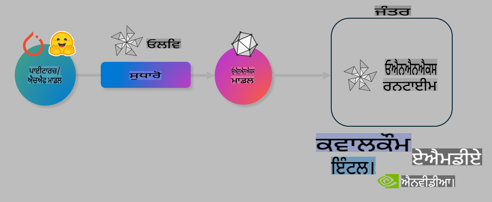

# ਲੈਬ। ਡਿਵਾਈਸ 'ਤੇ ਇਨਫਰੈਂਸ ਲਈ AI ਮਾਡਲਾਂ ਨੂੰ ਅਪਟਿਮਾਈਜ਼ ਕਰੋ

## ਪਰਚੇ

> [!IMPORTANT]
> ਇਸ ਲੈਬ ਲਈ **Nvidia A10 ਜਾਂ A100 GPU** ਦੀ ਲੋੜ ਹੈ ਜਿਸ ਨਾਲ ਜੁੜੇ ਡਰਾਈਵਰ ਅਤੇ CUDA ਟੂਲਕਿਟ (ਵਰਜਨ 12+) ਇੰਸਟਾਲ ਹੋਣੇ ਚਾਹੀਦੇ ਹਨ।

> [!NOTE]
> ਇਹ ਇੱਕ **35 ਮਿੰਟਾਂ ਦੀ** ਲੈਬ ਹੈ ਜੋ ਤੁਹਾਨੂੰ OLIVE ਦੀ ਵਰਤੋਂ ਕਰਕੇ ਡਿਵਾਈਸ 'ਤੇ ਇਨਫਰੈਂਸ ਲਈ ਮਾਡਲਾਂ ਨੂੰ ਅਪਟਿਮਾਈਜ਼ ਕਰਨ ਦੇ ਮੁੱਖ ਧਾਰਾਵਾਂ ਬਾਰੇ ਹੱਥ-ਓਨ ਜਾਣਕਾਰੀ ਦੇਵੇਗੀ।

## ਸਿੱਖਣ ਦੇ ਲਕਸ਼

ਇਸ ਲੈਬ ਦੇ ਅੰਤ ਤੱਕ, ਤੁਸੀਂ OLIVE ਦੀ ਵਰਤੋਂ ਕਰਕੇ ਇਹ ਕਰ ਸਕੋਗੇ:

- AWQ ਕਵਾਂਟਾਈਜ਼ੇਸ਼ਨ ਵਿਧੀ ਦੀ ਵਰਤੋਂ ਕਰਕੇ AI ਮਾਡਲ ਨੂੰ ਕਵਾਂਟਾਈਜ਼ ਕਰੋ।
- ਕਿਸੇ ਖਾਸ ਕੰਮ ਲਈ AI ਮਾਡਲ ਨੂੰ ਫਾਈਨ-ਟਿਊਨ ਕਰੋ।
- ONNX Runtime 'ਤੇ ਪ੍ਰਭਾਵਸ਼ਾਲੀ ਡਿਵਾਈਸ ਇਨਫਰੈਂਸ ਲਈ LoRA ਐਡਾਪਟਰ (ਫਾਈਨ-ਟਿਊਨ ਮਾਡਲ) ਤਿਆਰ ਕਰੋ।

### Olive ਕੀ ਹੈ

Olive (*O*NNX *live*) ਇੱਕ ਮਾਡਲ ਅਪਟਿਮਾਈਜ਼ੇਸ਼ਨ ਟੂਲਕਿਟ ਹੈ ਜਿਸ ਵਿੱਚ CLI ਵੀ ਸ਼ਾਮਲ ਹੈ ਜੋ ਤੁਹਾਨੂੰ ONNX runtime +++https://onnxruntime.ai+++ ਲਈ ਮਾਡਲਾਂ ਨੂੰ ਸ਼ਿਪ ਕਰਨ ਦੇ ਯੋਗ ਬਣਾਉਂਦਾ ਹੈ।



Olive ਵਿੱਚ ਇਨਪੁਟ ਆਮ ਤੌਰ 'ਤੇ ਇੱਕ PyTorch ਜਾਂ Hugging Face ਮਾਡਲ ਹੁੰਦਾ ਹੈ, ਅਤੇ ਆਉਟਪੁੱਟ ਇੱਕ ਅਪਟਿਮਾਈਜ਼ ONNX ਮਾਡਲ ਹੁੰਦਾ ਹੈ ਜੋ ONNX runtime ਚਲਾਉਣ ਵਾਲੇ ਡਿਵਾਈਸ (ਡਿਪਲੌਇਮੈਂਟ ਟਾਰਗੇਟ) 'ਤੇ ਐਗਜ਼ਿਕਿਊਟ ਹੁੰਦਾ ਹੈ। Olive ਮਾਡਲ ਨੂੰ ਡਿਪਲੌਇਮੈਂਟ ਟਾਰਗੇਟ ਦੇ AI ਐਕਸਲੇਰੇਟਰ (NPU, GPU, CPU) ਲਈ ਅਪਟਿਮਾਈਜ਼ ਕਰਦਾ ਹੈ ਜੋ ਕਿ Qualcomm, AMD, Nvidia ਜਾਂ Intel ਵਰਗੇ ਹਾਰਡਵੇਅਰ ਵੇਂਡਰ ਦੁਆਰਾ ਪ੍ਰਦਾਨ ਕੀਤਾ ਜਾਂਦਾ ਹੈ।

Olive ਇੱਕ *ਵਰਕਫਲੋ* ਚਲਾਉਂਦਾ ਹੈ, ਜੋ ਕਿ ਵਿਅਕਤੀਗਤ ਮਾਡਲ ਅਪਟਿਮਾਈਜ਼ੇਸ਼ਨ ਟਾਸਕਾਂ ਦੇ ਇੱਕ ਕ੍ਰਮਬੱਧ ਸਿੱਖਰ ਜਾਂਦਾ ਹੈ, ਜਿਨ੍ਹਾਂ ਨੂੰ *ਪਾਸ* ਕਿਹਾ ਜਾਂਦਾ ਹੈ। ਉਦਾਹਰਣ ਲਈ: ਮਾਡਲ ਕੰਪ੍ਰੈਸ਼ਨ, ਗ੍ਰਾਫ ਕੈਪਚਰ, ਕਵਾਂਟਾਈਜ਼ੇਸ਼ਨ, ਗ੍ਰਾਫ ਅਪਟਿਮਾਈਜ਼ੇਸ਼ਨ। ਹਰ ਪਾਸ ਵਿੱਚ ਕੁਝ ਪੈਰਾਮੀਟਰ ਹੁੰਦੇ ਹਨ ਜੋ ਸਹੀ ਮਾਪਦੰਡ ਪ੍ਰਾਪਤ ਕਰਨ ਲਈ ਟਿਊਨ ਕੀਤੇ ਜਾ ਸਕਦੇ ਹਨ, ਜਿਵੇਂ ਕਿ ਸਹੀਤਾ ਅਤੇ ਡਿਲੇ। Olive ਇੱਕ ਖੋਜ ਰਣਨੀਤੀ ਦੀ ਵਰਤੋਂ ਕਰਦਾ ਹੈ ਜੋ ਖੋਜ ਐਲਗੋਰਿਦਮ ਦੀ ਵਰਤੋਂ ਕਰਕੇ ਹਰ ਪਾਸ ਜਾਂ ਪਾਸਾਂ ਦੇ ਸੈੱਟ ਨੂੰ ਸਵੈ-ਟਿਊਨ ਕਰਦਾ ਹੈ।

#### Olive ਦੇ ਫਾਇਦੇ

- ਗ੍ਰਾਫ ਅਪਟਿਮਾਈਜ਼ੇਸ਼ਨ, ਕੰਪ੍ਰੈਸ਼ਨ ਅਤੇ ਕਵਾਂਟਾਈਜ਼ੇਸ਼ਨ ਲਈ ਵੱਖ-ਵੱਖ ਤਕਨੀਕਾਂ ਨਾਲ ਟ੍ਰਾਇਲ-ਐਂਡ-ਏਰਰ ਦੀ ਮੈਨੂਅਲ ਪ੍ਰਕਿਰਿਆ ਵਿੱਚੋਂ **ਨਿਰਾਸ਼ਾ ਅਤੇ ਸਮਾਂ ਬਚਾਓ**। ਆਪਣੇ ਗੁਣਵੱਤਾ ਅਤੇ ਪ੍ਰਦਰਸ਼ਨ ਦੀਆਂ ਸੀਮਾਵਾਂ ਨੂੰ ਪਰਿਭਾਸ਼ਿਤ ਕਰੋ ਅਤੇ Olive ਨੂੰ ਤੁਹਾਡੇ ਲਈ ਸਭ ਤੋਂ ਵਧੀਆ ਮਾਡਲ ਲੱਭਣ ਦਿਓ।
- **40+ ਬਣਾਏ-ਗਏ ਮਾਡਲ ਅਪਟਿਮਾਈਜ਼ੇਸ਼ਨ ਕੌਮਪੋਨੈਂਟਸ** ਜੋ ਕਿ ਕਵਾਂਟਾਈਜ਼ੇਸ਼ਨ, ਕੰਪ੍ਰੈਸ਼ਨ, ਗ੍ਰਾਫ ਅਪਟਿਮਾਈਜ਼ੇਸ਼ਨ ਅਤੇ ਫਾਈਨਟਿਊਨਿੰਗ ਵਿੱਚ ਕੱਟੇਧਾਰ ਤਕਨੀਕਾਂ ਨੂੰ ਕਵਰ ਕਰਦੇ ਹਨ।
- ਆਮ ਮਾਡਲ ਅਪਟਿਮਾਈਜ਼ੇਸ਼ਨ ਟਾਸਕਾਂ ਲਈ **ਇਸਤੇਮਾਲ ਕਰਨ ਵਿੱਚ ਆਸਾਨ CLI**। ਉਦਾਹਰਣ ਲਈ, olive quantize, olive auto-opt, olive finetune।
- ਮਾਡਲ ਪੈਕੇਜਿੰਗ ਅਤੇ ਡਿਪਲੌਇਮੈਂਟ ਵਿਚਾਰਸ਼ੀਲ।
- **ਮਲਟੀ LoRA ਸਰਵਿੰਗ** ਲਈ ਮਾਡਲ ਤਿਆਰ ਕਰਨ ਦੀ ਸਮਰਥਾ।
- YAML/JSON ਦੀ ਵਰਤੋਂ ਕਰਕੇ ਵਰਕਫਲੋ ਬਣਾਓ ਜੋ ਮਾਡਲ ਅਪਟਿਮਾਈਜ਼ੇਸ਼ਨ ਅਤੇ ਡਿਪਲੌਇਮੈਂਟ ਟਾਸਕਾਂ ਨੂੰ ਆਰਗਨਾਈਜ਼ ਕਰਦਾ ਹੈ।
- **Hugging Face** ਅਤੇ **Azure AI** ਇੰਟੀਗ੍ਰੇਸ਼ਨ।
- **ਕੈਸ਼ਿੰਗ** ਪ੍ਰਣਾਲੀ ਨਾਲ **ਖਰਚੇ ਬਚਾਓ।**

## ਲੈਬ ਨਿਰਦੇਸ਼

> [!NOTE]
> ਕਿਰਪਾ ਕਰਕੇ ਯਕੀਨੀ ਬਣਾਓ ਕਿ ਤੁਸੀਂ ਆਪਣੇ Azure AI Hub ਅਤੇ ਪ੍ਰੋਜੈਕਟ ਨੂੰ ਪ੍ਰੋਵੀਜ਼ਨ ਕੀਤਾ ਹੈ ਅਤੇ ਆਪਣਾ A100 ਕੰਪਿਊਟ ਲੈਬ 1 ਦੇ ਅਨੁਸਾਰ ਸੈਟਅੱਪ ਕੀਤਾ ਹੈ।

### ਕਦਮ 0: ਆਪਣੇ Azure AI ਕੰਪਿਊਟ ਨਾਲ ਕਨੈਕਟ ਕਰੋ

ਤੁਸੀਂ **VS Code** ਵਿੱਚ ਰਿਮੋਟ ਫੀਚਰ ਦੀ ਵਰਤੋਂ ਕਰਕੇ Azure AI ਕੰਪਿਊਟ ਨਾਲ ਕਨੈਕਟ ਕਰੋਗੇ।

1. ਆਪਣਾ **VS Code** ਡੈਸਕਟਾਪ ਐਪਲੀਕੇਸ਼ਨ ਖੋਲ੍ਹੋ:
1. **Shift+Ctrl+P** ਵਰਤ ਕੇ **ਕਮਾਂਡ ਪੈਲਟ** ਖੋਲ੍ਹੋ।
1. ਕਮਾਂਡ ਪੈਲਟ ਵਿੱਚ **AzureML - remote: Connect to compute instance in New Window** ਲਈ ਖੋਜ ਕਰੋ।
1. ਕੰਪਿਊਟ ਨਾਲ ਕਨੈਕਟ ਕਰਨ ਲਈ ਸਕਰੀਨ 'ਤੇ ਦਿੱਤੇ ਦਿਸ਼ਾ-ਨਿਰਦੇਸ਼ਾਂ ਦੀ ਪਾਲਣਾ ਕਰੋ। ਇਹ ਤੁਹਾਡੇ Azure Subscription, Resource Group, Project ਅਤੇ Compute name ਨੂੰ ਚੁਣਨ ਵਿੱਚ ਸ਼ਾਮਲ ਹੋਵੇਗਾ ਜੋ ਤੁਸੀਂ ਲੈਬ 1 ਵਿੱਚ ਸੈਟਅੱਪ ਕੀਤਾ ਹੈ।
1. ਜਦੋਂ ਤੁਸੀਂ ਆਪਣੇ Azure ML Compute ਨੋਡ ਨਾਲ ਕਨੈਕਟ ਹੋ ਜਾਓਗੇ, ਤਾਂ ਇਹ **Visual Code ਦੇ ਤਲ ਖੱਬੇ ਕੋਨੇ ਵਿੱਚ** ਦਰਸਾਇਆ ਜਾਵੇਗਾ `><Azure ML: Compute Name`

### ਕਦਮ 1: ਇਸ ਰਿਪੋ ਨੂੰ ਕਲੋਨ ਕਰੋ

VS Code ਵਿੱਚ, ਤੁਸੀਂ **Ctrl+J** ਨਾਲ ਇੱਕ ਨਵਾਂ ਟਰਮੀਨਲ ਖੋਲ੍ਹ ਸਕਦੇ ਹੋ ਅਤੇ ਇਸ ਰਿਪੋ ਨੂੰ ਕਲੋਨ ਕਰੋ:

ਟਰਮੀਨਲ ਵਿੱਚ ਤੁਹਾਨੂੰ ਪ੍ਰਾਂਪਟ ਦਿਖਾਈ ਦੇਵੇਗਾ

```
azureuser@computername:~/cloudfiles/code$ 
```
ਸੋਲੂਸ਼ਨ ਕਲੋਨ ਕਰੋ

```bash
cd ~/localfiles
git clone https://github.com/microsoft/phi-3cookbook.git
```

### ਕਦਮ 2: ਫੋਲਡਰ ਨੂੰ VS Code ਵਿੱਚ ਖੋਲ੍ਹੋ

ਸੰਬੰਧਿਤ ਫੋਲਡਰ ਵਿੱਚ VS Code ਖੋਲ੍ਹਣ ਲਈ ਟਰਮੀਨਲ ਵਿੱਚ ਹੇਠ ਲਿਖਿਆ ਕਮਾਂਡ ਚਲਾਓ, ਜੋ ਇੱਕ ਨਵੀਂ ਵਿੰਡੋ ਖੋਲ੍ਹੇਗਾ:

```bash
code phi-3cookbook/code/04.Finetuning/Olive-lab
```

ਵਿਕਲਪਕ ਤੌਰ 'ਤੇ, ਤੁਸੀਂ **File** > **Open Folder** ਨੂੰ ਚੁਣ ਕੇ ਫੋਲਡਰ ਖੋਲ੍ਹ ਸਕਦੇ ਹੋ।

### ਕਦਮ 3: ਡਿਪੈਂਡੈਂਸੀਜ਼

ਆਪਣੇ Azure AI Compute Instance ਵਿੱਚ VS Code ਵਿੱਚ ਇੱਕ ਟਰਮੀਨਲ ਵਿੰਡੋ ਖੋਲ੍ਹੋ (ਸੁਝਾਅ: **Ctrl+J**) ਅਤੇ ਡਿਪੈਂਡੈਂਸੀਜ਼ ਨੂੰ ਇੰਸਟਾਲ ਕਰਨ ਲਈ ਹੇਠ ਲਿਖੇ ਕਮਾਂਡ ਚਲਾਓ:

```bash
conda create -n olive-ai python=3.11 -y
conda activate olive-ai
pip install -r requirements.txt
az extension remove -n azure-cli-ml
az extension add -n ml
```

> [!NOTE]
> ਸਾਰੀਆਂ ਡਿਪੈਂਡੈਂਸੀਜ਼ ਨੂੰ ਇੰਸਟਾਲ ਕਰਨ ਵਿੱਚ ~5 ਮਿੰਟ ਲੱਗਣਗੇ।

ਇਸ ਲੈਬ ਵਿੱਚ ਤੁਸੀਂ ਮਾਡਲਾਂ ਨੂੰ Azure AI Model ਕੈਟਾਲੌਗ ਵਿੱਚ ਡਾਊਨਲੋਡ ਅਤੇ ਅਪਲੋਡ ਕਰੋਗੇ। ਤਾਂ ਜੋ ਤੁਸੀਂ ਮਾਡਲ ਕੈਟਾਲੌਗ ਤੱਕ ਪਹੁੰਚ ਸਕੋ, ਤੁਹਾਨੂੰ ਹੇਠ ਲਿਖੇ ਕਮਾਂਡ ਦੀ ਵਰਤੋਂ ਕਰਕੇ Azure ਵਿੱਚ ਲੌਗਇਨ ਕਰਨ ਦੀ ਲੋੜ ਹੈ:

```bash
az login
```

> [!NOTE]
> ਲੌਗਇਨ ਸਮੇਂ ਤੁਹਾਨੂੰ ਆਪਣੀ ਸਬਸਕ੍ਰਿਪਸ਼ਨ ਚੁਣਨ ਲਈ ਕਿਹਾ ਜਾਵੇਗਾ। ਯਕੀਨੀ ਬਣਾਓ ਕਿ ਤੁਸੀਂ ਇਸ ਲੈਬ ਲਈ ਪ੍ਰਦਾਨ ਕੀਤੀ ਗਈ ਸਬਸਕ੍ਰਿਪਸ਼ਨ ਸੈਟ ਕਰੋ।

### ਕਦਮ 4: Olive ਕਮਾਂਡ ਚਲਾਓ

ਆਪਣੇ Azure AI Compute Instance ਵਿੱਚ VS Code ਵਿੱਚ ਇੱਕ ਟਰਮੀਨਲ ਵਿੰਡੋ ਖੋਲ੍ਹੋ (ਸੁਝਾਅ: **Ctrl+J**) ਅਤੇ ਯਕੀਨੀ ਬਣਾਓ ਕਿ `olive-ai` ਕੋਂਡਾ ਐਨਵਾਇਰਨਮੈਂਟ ਐਕਟੀਵੇਟ ਹੈ:

```bash
conda activate olive-ai
```

ਅਗਲਾ, ਹੇਠ ਲਿਖੀਆਂ Olive ਕਮਾਂਡ ਕਮਾਂਡ ਲਾਈਨ ਵਿੱਚ ਚਲਾਓ।

1. **ਡਾਟਾ ਦੀ ਜਾਂਚ ਕਰੋ:** ਇਸ ਉਦਾਹਰਣ ਵਿੱਚ, ਤੁਸੀਂ Phi-3.5-Mini ਮਾਡਲ ਨੂੰ ਇਸ ਤਰ੍ਹਾਂ ਫਾਈਨ-ਟਿਊਨ ਕਰ ਰਹੇ ਹੋ ਕਿ ਇਹ ਯਾਤਰਾ ਸੰਬੰਧੀ ਸਵਾਲਾਂ ਦੇ ਜਵਾਬ ਦੇਣ ਵਿੱਚ ਨਿਪੁੰਨ ਹੋ ਜਾਵੇ। ਹੇਠ ਲਿਖੀ ਕੋਡ ਡਾਟਾਸੇਟ ਦੇ ਪਹਿਲੇ ਕੁਝ ਰਿਕਾਰਡ ਦਿਖਾਉਂਦਾ ਹੈ, ਜੋ JSON ਲਾਈਨਾਂ ਫਾਰਮੈਟ ਵਿੱਚ ਹਨ:

    ```bash
    head data/data_sample_travel.jsonl
    ```
1. **ਮਾਡਲ ਕਵਾਂਟਾਈਜ਼ ਕਰੋ:** ਮਾਡਲ ਨੂੰ ਟ੍ਰੇਨ ਕਰਨ ਤੋਂ ਪਹਿਲਾਂ, ਤੁਸੀਂ ਹੇਠ ਲਿਖੀ ਕਮਾਂਡ ਨਾਲ ਕਵਾਂਟਾਈਜ਼ ਕਰੋ ਜੋ Active Aware Quantization (AWQ) +++https://arxiv.org/abs/2306.00978+++ ਨਾਂਕ ਵਿਧੀ ਦੀ ਵਰਤੋਂ ਕਰਦਾ ਹੈ। AWQ ਮਾਡਲ ਦੇ ਵਜ਼ਨਾਂ ਨੂੰ ਕਵਾਂਟਾਈਜ਼ ਕਰਦਾ ਹੈ ਜੋ ਇਨਫਰੈਂਸ ਦੌਰਾਨ ਉਤਪੰਨ ਹੋਣ ਵਾਲੀਆਂ ਐਕਟੀਵੇਸ਼ਨਾਂ ਨੂੰ ਧਿਆਨ ਵਿੱਚ ਰੱਖਦਾ ਹੈ। ਇਸ ਦਾ ਮਤਲਬ ਹੈ ਕਿ ਕਵਾਂਟਾਈਜ਼ੇਸ਼ਨ ਪ੍ਰਕਿਰਿਆ ਐਕਟੀਵੇਸ਼ਨਾਂ ਵਿੱਚ ਅਸਲ ਡਾਟਾ ਵੰਡ ਨੂੰ ਧਿਆਨ ਵਿੱਚ ਰੱਖਦੀ ਹੈ, ਜੋ ਕਿ ਰਵਾਇਤੀ ਕਵਾਂਟਾਈਜ਼ੇਸ਼ਨ ਵਿਧੀਆਂ ਦੇ ਮੁਕਾਬਲੇ ਮਾਡਲ ਦੀ ਸਹੀਤਾ ਨੂੰ ਬਿਹਤਰ ਰੂਪ ਵਿੱਚ ਸੰਭਾਲਣ ਵਿੱਚ ਸਹਾਇਕ ਹੈ।

    ```bash
    olive quantize \
       --model_name_or_path microsoft/Phi-3.5-mini-instruct \
       --trust_remote_code \
       --algorithm awq \
       --output_path models/phi/awq \
       --log_level 1
    ```
    
    AWQ ਕਵਾਂਟਾਈਜ਼ੇਸ਼ਨ ਨੂੰ ਪੂਰਾ ਕਰਨ ਵਿੱਚ **~8 ਮਿੰਟ** ਲੱਗਦੇ ਹਨ, ਜੋ **ਮਾਡਲ ਦੇ ਆਕਾਰ ਨੂੰ ~7.5GB ਤੋਂ ~2.5GB ਤੱਕ ਘਟਾ ਦੇਵੇਗਾ।**
   
   ਇਸ ਲੈਬ ਵਿੱਚ, ਅਸੀਂ ਤੁਹਾਨੂੰ Hugging Face ਤੋਂ ਮਾਡਲ ਇਨਪੁਟ ਕਰਨ ਦਾ ਤਰੀਕਾ ਦਿਖਾ ਰਹੇ ਹਾਂ (ਉਦਾਹਰਣ ਲਈ: `microsoft/Phi-3.5-mini-instruct`). However, Olive also allows you to input models from the Azure AI catalog by updating the `model_name_or_path` argument to an Azure AI asset ID (for example:  `azureml://registries/azureml/models/Phi-3.5-mini-instruct/versions/4`). 

1. **Train the model:** Next, the `olive finetune` ਕਮਾਂਡ ਕਵਾਂਟਾਈਜ਼ ਮਾਡਲ ਨੂੰ ਫਾਈਨ-ਟਿਊਨ ਕਰਦਾ ਹੈ। ਕਵਾਂਟਾਈਜ਼ੇਸ਼ਨ ਦੇ ਬਾਅਦ ਫਾਈਨ-ਟਿਊਨ ਕਰਨ ਦੀ ਬਜਾਏ ਫਾਈਨ-ਟਿਊਨ ਕਰਨ ਤੋਂ ਪਹਿਲਾਂ ਕਵਾਂਟਾਈਜ਼ ਕਰਨਾ ਵਧੀਆ ਸਹੀਤਾ ਦਿੰਦਾ ਹੈ ਕਿਉਂਕਿ ਫਾਈਨ-ਟਿਊਨ ਪ੍ਰਕਿਰਿਆ ਕੁਝ ਕਵਾਂਟਾਈਜ਼ੇਸ਼ਨ ਦੇ ਨੁਕਸਾਨ ਨੂੰ ਰੀਕਵਰ ਕਰਦੀ ਹੈ।

    ```bash
    olive finetune \
        --method lora \
        --model_name_or_path models/phi/awq \
        --data_files "data/data_sample_travel.jsonl" \
        --data_name "json" \
        --text_template "<|user|>\n{prompt}<|end|>\n<|assistant|>\n{response}<|end|>" \
        --max_steps 100 \
        --output_path ./models/phi/ft \
        --log_level 1
    ```
    
    ਫਾਈਨ-ਟਿਊਨਿੰਗ ਨੂੰ ਪੂਰਾ ਕਰਨ ਵਿੱਚ **~6 ਮਿੰਟ** ਲੱਗਦੇ ਹਨ (100 ਸਟੈਪਾਂ ਨਾਲ)।

1. **ਅਪਟਿਮਾਈਜ਼ ਕਰੋ:** ਮਾਡਲ ਨੂੰ ਟ੍ਰੇਨ ਕਰਨ ਤੋਂ ਬਾਅਦ, ਹੁਣ ਤੁਸੀਂ Olive ਦੇ `auto-opt` command, which will capture the ONNX graph and automatically perform a number of optimizations to improve the model performance for CPU by compressing the model and doing fusions. It should be noted, that you can also optimize for other devices such as NPU or GPU by just updating the `--device` and `--provider` ਆਰਗਯੂਮੈਂਟਸ ਦੀ ਵਰਤੋਂ ਕਰਕੇ ਮਾਡਲ ਨੂੰ ਅਪਟਿਮਾਈਜ਼ ਕਰੋ - ਪਰ ਇਸ ਲੈਬ ਦੇ ਉਦੇਸ਼ਾਂ ਲਈ ਅਸੀਂ CPU ਦੀ ਵਰਤੋਂ ਕਰਾਂਗੇ।

    ```bash
    olive auto-opt \
       --model_name_or_path models/phi/ft/model \
       --adapter_path models/phi/ft/adapter \
       --device cpu \
       --provider CPUExecutionProvider \
       --use_ort_genai \
       --output_path models/phi/onnx-ao \
       --log_level 1
    ```
    
    ਅਪਟਿਮਾਈਜ਼ੇਸ਼ਨ ਨੂੰ ਪੂਰਾ ਕਰਨ ਵਿੱਚ **~5 ਮਿੰਟ** ਲੱਗਦੇ ਹਨ।

### ਕਦਮ 5: ਮਾਡਲ ਇਨਫਰੈਂਸ ਦੀ ਤੇਜ਼ ਟੈਸਟਿੰਗ

ਮਾਡਲ ਦੇ ਇਨਫਰੈਂਸ ਦੀ ਜਾਂਚ ਕਰਨ ਲਈ, ਆਪਣੇ ਫੋਲਡਰ ਵਿੱਚ **app.py** ਨਾਮ ਦਾ ਇੱਕ ਪਾਇਥਨ ਫਾਈਲ ਬਣਾਓ ਅਤੇ ਹੇਠ ਲਿਖਿਆ ਕੋਡ ਕਾਪੀ-ਪੇਸਟ ਕਰੋ:

```python
import onnxruntime_genai as og
import numpy as np

print("loading model and adapters...", end="", flush=True)
model = og.Model("models/phi/onnx-ao/model")
adapters = og.Adapters(model)
adapters.load("models/phi/onnx-ao/model/adapter_weights.onnx_adapter", "travel")
print("DONE!")

tokenizer = og.Tokenizer(model)
tokenizer_stream = tokenizer.create_stream()

params = og.GeneratorParams(model)
params.set_search_options(max_length=100, past_present_share_buffer=False)
user_input = "what is the best thing to see in chicago"
params.input_ids = tokenizer.encode(f"<|user|>\n{user_input}<|end|>\n<|assistant|>\n")

generator = og.Generator(model, params)

generator.set_active_adapter(adapters, "travel")

print(f"{user_input}")

while not generator.is_done():
    generator.compute_logits()
    generator.generate_next_token()

    new_token = generator.get_next_tokens()[0]
    print(tokenizer_stream.decode(new_token), end='', flush=True)

print("\n")
```

ਕੋਡ ਚਲਾਉਣ ਲਈ ਹੇਠ ਲਿਖੀ ਕਮਾਂਡ ਚਲਾਓ:

```bash
python app.py
```

### ਕਦਮ 6: ਮਾਡਲ ਨੂੰ Azure AI 'ਤੇ ਅਪਲੋਡ ਕਰੋ

ਮਾਡਲ ਨੂੰ Azure AI ਮਾਡਲ ਰਿਪੋਜ਼ਟਰੀ ਵਿੱਚ ਅਪਲੋਡ ਕਰਨ ਨਾਲ ਮਾਡਲ ਨੂੰ ਤੁਹਾਡੀ ਵਿਕਾਸ ਟੀਮ ਦੇ ਹੋਰ ਮੈਂਬਰਾਂ ਨਾਲ ਸਾਂਝਾ ਕੀਤਾ ਜਾ ਸਕਦਾ ਹੈ ਅਤੇ ਮਾਡਲ ਦੇ ਵਰਜਨ ਕੰਟਰੋਲ ਨੂੰ ਸੰਭਾਲਿਆ ਜਾ ਸਕਦਾ ਹੈ। ਮਾਡਲ ਨੂੰ ਅਪਲੋਡ ਕਰਨ ਲਈ ਹੇਠ ਲਿਖੀ ਕਮਾਂਡ ਚਲਾਓ:

> [!NOTE]
> `{}` placeholders with the name of your resource group and Azure AI Project Name. 

To find your resource group `"resourceGroup" ਅਤੇ Azure AI Project name ਨੂੰ ਅਪਡੇਟ ਕਰੋ ਅਤੇ ਹੇਠ ਲਿਖੀ ਕਮਾਂਡ ਚਲਾਓ 

```
az ml workspace show
```

ਜਾਂ +++ai.azure.com+++ 'ਤੇ ਜਾ ਕੇ **management center** **project** **overview** ਚੁਣੋ।

`{}` ਪਲੇਸਹੋਲਡਰ ਨੂੰ ਆਪਣੇ ਰਿਸੋਰਸ ਗਰੁੱਪ ਅਤੇ Azure AI ਪ੍ਰੋਜੈਕਟ ਨਾਂ ਨਾਲ ਅਪਡੇਟ ਕਰੋ।

```bash
az ml model create \
    --name ft-for-travel \
    --version 1 \
    --path ./models/phi/onnx-ao \
    --resource-group {RESOURCE_GROUP_NAME} \
    --workspace-name {PROJECT_NAME}
```
ਫਿਰ ਤੁਸੀਂ ਆਪਣੇ ਅਪਲੋਡ ਕੀਤੇ ਮਾਡਲ ਨੂੰ ਦੇਖ ਸਕਦੇ ਹੋ ਅਤੇ ਆਪਣੇ ਮਾਡਲ ਨੂੰ +++https://ml.azure.com/model/list+++ 'ਤੇ ਡਿਪਲੌਇ ਕਰ ਸਕਦੇ ਹੋ।

**ਅਸਵੀਕਰਤੀ**:  
ਇਹ ਦਸਤਾਵੇਜ਼ ਮਸ਼ੀਨ ਅਧਾਰਿਤ AI ਅਨੁਵਾਦ ਸੇਵਾਵਾਂ ਦੀ ਵਰਤੋਂ ਕਰਕੇ ਅਨੁਵਾਦਿਤ ਕੀਤਾ ਗਿਆ ਹੈ। ਜਦੋਂ ਕਿ ਅਸੀਂ ਸਹੀ ਹੋਣ ਦਾ ਯਤਨ ਕਰਦੇ ਹਾਂ, ਕਿਰਪਾ ਕਰਕੇ ਧਿਆਨ ਵਿੱਚ ਰੱਖੋ ਕਿ ਸਵੈਚਾਲਿਤ ਅਨੁਵਾਦਾਂ ਵਿੱਚ ਗਲਤੀਆਂ ਜਾਂ ਅਸੁਚਜੀਤਤਾਵਾਂ ਹੋ ਸਕਦੀਆਂ ਹਨ। ਮੂਲ ਦਸਤਾਵੇਜ਼, ਜੋ ਇਸਦੀ ਮੂਲ ਭਾਸ਼ਾ ਵਿੱਚ ਹੈ, ਨੂੰ ਅਧਿਕਾਰਕ ਸਰੋਤ ਮੰਨਿਆ ਜਾਣਾ ਚਾਹੀਦਾ ਹੈ। ਮਹੱਤਵਪੂਰਨ ਜਾਣਕਾਰੀ ਲਈ, ਪੇਸ਼ੇਵਰ ਮਨੁੱਖੀ ਅਨੁਵਾਦ ਦੀ ਸਿਫਾਰਸ਼ ਕੀਤੀ ਜਾਂਦੀ ਹੈ। ਇਸ ਅਨੁਵਾਦ ਦੇ ਉਪਯੋਗ ਤੋਂ ਪੈਦਾ ਹੋਣ ਵਾਲੀਆਂ ਕੋਈ ਵੀ ਗਲਤ ਫਹਿਮੀਆਂ ਜਾਂ ਗਲਤ ਵਿਆਖਿਆਵਾਂ ਲਈ ਅਸੀਂ ਜ਼ਿੰਮੇਵਾਰ ਨਹੀਂ ਹਾਂ।