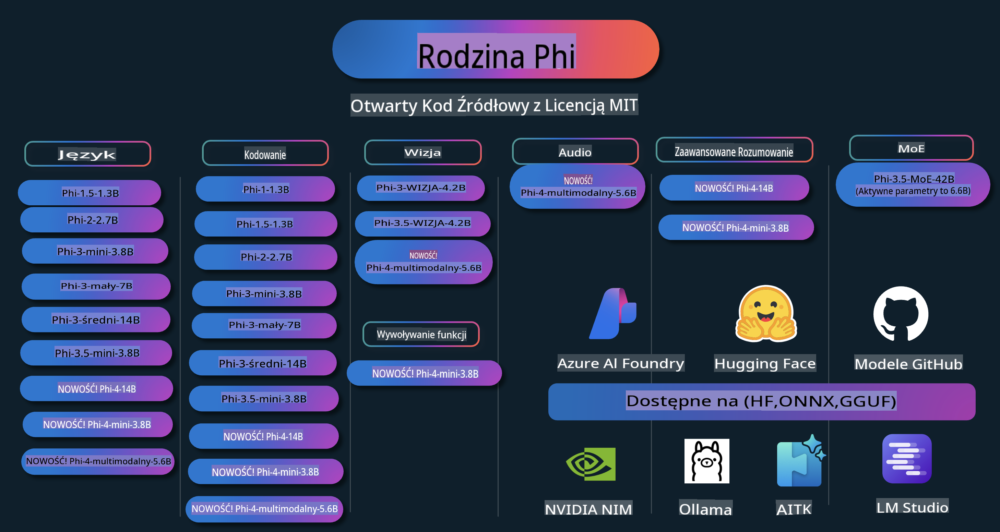

# Phi Cookbook: Praktyczne przykłady z modelami Phi od Microsoftu

  

  
  
  

  
  

Phi to seria otwartoźródłowych modeli AI opracowanych przez Microsoft.

Phi to obecnie najpotężniejszy i najbardziej opłacalny mały model językowy (SLM), osiągający bardzo dobre wyniki w wielojęzyczności, rozumowaniu, generowaniu tekstu/rozmów, kodowaniu, obrazach, dźwiękach i innych scenariuszach.

Możesz wdrożyć Phi w chmurze lub na urządzeniach brzegowych, a także łatwo tworzyć aplikacje generatywnej sztucznej inteligencji przy ograniczonej mocy obliczeniowej.

Postępuj zgodnie z poniższymi krokami, aby zacząć korzystać z tych zasobów:  
1. **Forkuj repozytorium**: Kliknij   
2. **Sklonuj repozytorium**:   `git clone https://github.com/microsoft/PhiCookBook.git`  
3. [**Dołącz do społeczności Microsoft AI Discord i poznaj ekspertów oraz innych programistów**](https://discord.com/invite/ByRwuEEgH4?WT.mc_id=aiml-137032-kinfeylo)

## Spis treści

- Wprowadzenie  
  - [Witaj w rodzinie Phi](./md/01.Introduction/01/01.PhiFamily.md)  
  - [Konfiguracja środowiska](./md/01.Introduction/01/01.EnvironmentSetup.md)  
  - [Zrozumienie kluczowych technologii](./md/01.Introduction/01/01.Understandingtech.md)  
  - [Bezpieczeństwo AI w modelach Phi](./md/01.Introduction/01/01.AISafety.md)  
  - [Wsparcie sprzętowe dla Phi](./md/01.Introduction/01/01.Hardwaresupport.md)  
  - [Modele Phi i ich dostępność na różnych platformach](./md/01.Introduction/01/01.Edgeandcloud.md)  
  - [Korzystanie z Guidance-ai i Phi](./md/01.Introduction/01/01.Guidance.md)  
  - [Modele na GitHub Marketplace](https://github.com/marketplace/models)  
  - [Katalog modeli Azure AI](https://ai.azure.com)  

- Inference Phi w różnych środowiskach  
    - [Hugging Face](./md/01.Introduction/02/01.HF.md)  
    - [Modele GitHub](./md/01.Introduction/02/02.GitHubModel.md)  
    - [Katalog modeli Azure AI Foundry](./md/01.Introduction/02/03.AzureAIFoundry.md)  
    - [Ollama](./md/01.Introduction/02/04.Ollama.md)  
    - [AI Toolkit VSCode (AITK)](./md/01.Introduction/02/05.AITK.md)  
    - [NVIDIA NIM](./md/01.Introduction/02/06.NVIDIA.md)  

- Inference rodziny Phi  
    - [Inference Phi na iOS](./md/01.Introduction/03/iOS_Inference.md)  
    - [Inference Phi na Androidzie](./md/01.Introduction/03/Android_Inference.md)  
- [Wnioskowanie Phi na Jetson](./md/01.Introduction/03/Jetson_Inference.md)  
    - [Wnioskowanie Phi na komputerze AI PC](./md/01.Introduction/03/AIPC_Inference.md)  
    - [Wnioskowanie Phi z wykorzystaniem Apple MLX Framework](./md/01.Introduction/03/MLX_Inference.md)  
    - [Wnioskowanie Phi na lokalnym serwerze](./md/01.Introduction/03/Local_Server_Inference.md)  
    - [Wnioskowanie Phi na zdalnym serwerze przy użyciu AI Toolkit](./md/01.Introduction/03/Remote_Interence.md)  
    - [Wnioskowanie Phi z wykorzystaniem Rust](./md/01.Introduction/03/Rust_Inference.md)  
    - [Wnioskowanie Phi--Vision lokalnie](./md/01.Introduction/03/Vision_Inference.md)  
    - [Wnioskowanie Phi z Kaito AKS, Azure Containers (oficjalne wsparcie)](./md/01.Introduction/03/Kaito_Inference.md)  

- [Kwantyfikacja rodziny Phi](./md/01.Introduction/04/QuantifyingPhi.md)  
    - [Kwantyzacja Phi-3.5 / 4 z wykorzystaniem llama.cpp](./md/01.Introduction/04/UsingLlamacppQuantifyingPhi.md)  
    - [Kwantyzacja Phi-3.5 / 4 z wykorzystaniem rozszerzeń Generative AI dla onnxruntime](./md/01.Introduction/04/UsingORTGenAIQuantifyingPhi.md)  
    - [Kwantyzacja Phi-3.5 / 4 z wykorzystaniem Intel OpenVINO](./md/01.Introduction/04/UsingIntelOpenVINOQuantifyingPhi.md)  
    - [Kwantyzacja Phi-3.5 / 4 z wykorzystaniem Apple MLX Framework](./md/01.Introduction/04/UsingAppleMLXQuantifyingPhi.md)  

- Ocena Phi  
    - [Odpowiedzialna AI](./md/01.Introduction/05/ResponsibleAI.md)  
    - [Azure AI Foundry do oceny](./md/01.Introduction/05/AIFoundry.md)  
    - [Wykorzystanie Promptflow do oceny](./md/01.Introduction/05/Promptflow.md)  

- RAG z Azure AI Search  
    - [Jak używać Phi-4-mini i Phi-4-multimodal (RAG) z Azure AI Search](https://github.com/microsoft/PhiCookBook/blob/main/code/06.E2E/E2E_Phi-4-RAG-Azure-AI-Search.ipynb)  

- Przykłady rozwoju aplikacji Phi  
  - Aplikacje tekstowe i czatowe  
    - Przykłady Phi-4 🆕  
      - [📓] [Czat z modelem Phi-4-mini ONNX](./md/02.Application/01.TextAndChat/Phi4/ChatWithPhi4ONNX/README.md)  
      - [Czat z lokalnym modelem Phi-4 ONNX w .NET](../../md/04.HOL/dotnet/src/LabsPhi4-Chat-01OnnxRuntime)  
      - [Konsolowa aplikacja .NET do czatu z modelem Phi-4 ONNX przy użyciu Semantic Kernel](../../md/04.HOL/dotnet/src/LabsPhi4-Chat-02SK)  
    - Przykłady Phi-3 / 3.5  
      - [Lokalny chatbot w przeglądarce z wykorzystaniem Phi3, ONNX Runtime Web i WebGPU](https://github.com/microsoft/onnxruntime-inference-examples/tree/main/js/chat)  
      - [Czat OpenVino](./md/02.Application/01.TextAndChat/Phi3/E2E_OpenVino_Chat.md)  
      - [Model wielomodelowy - interaktywny Phi-3-mini i OpenAI Whisper](./md/02.Application/01.TextAndChat/Phi3/E2E_Phi-3-mini_with_whisper.md)  
      - [MLFlow - Tworzenie wrappera i używanie Phi-3 z MLFlow](./md//02.Application/01.TextAndChat/Phi3/E2E_Phi-3-MLflow.md)  
      - [Optymalizacja modelu - Jak zoptymalizować model Phi-3-mini dla ONNX Runtime Web przy użyciu Olive](https://github.com/microsoft/Olive/tree/main/examples/phi3)  
      - [Aplikacja WinUI3 z modelem Phi-3 mini-4k-instruct-onnx](https://github.com/microsoft/Phi3-Chat-WinUI3-Sample/)  
      - [Przykładowa aplikacja notatek AI z wieloma modelami w WinUI3](https://github.com/microsoft/ai-powered-notes-winui3-sample)  
      - [Dostosowanie i integracja niestandardowych modeli Phi-3 z Prompt flow](./md/02.Application/01.TextAndChat/Phi3/E2E_Phi-3-FineTuning_PromptFlow_Integration.md)  
      - [Dostosowanie i integracja niestandardowych modeli Phi-3 z Prompt flow w Azure AI Foundry](./md/02.Application/01.TextAndChat/Phi3/E2E_Phi-3-FineTuning_PromptFlow_Integration_AIFoundry.md)  
      - [Ocena dostosowanego modelu Phi-3 / Phi-3.5 w Azure AI Foundry z uwzględnieniem zasad Odpowiedzialnej AI Microsoftu](./md/02.Application/01.TextAndChat/Phi3/E2E_Phi-3-Evaluation_AIFoundry.md)  
- [📓] [Phi-3.5-mini-instruct przykład przewidywania języka (chiński/angielski)](../../md/02.Application/01.TextAndChat/Phi3/phi3-instruct-demo.ipynb)
      - [Phi-3.5-Instruct WebGPU RAG Chatbot](./md/02.Application/01.TextAndChat/Phi3/WebGPUWithPhi35Readme.md)
      - [Korzystanie z GPU w systemie Windows do tworzenia rozwiązania Prompt Flow z Phi-3.5-Instruct ONNX](./md/02.Application/01.TextAndChat/Phi3/UsingPromptFlowWithONNX.md)
      - [Tworzenie aplikacji na Androida za pomocą Microsoft Phi-3.5 tflite](./md/02.Application/01.TextAndChat/Phi3/UsingPhi35TFLiteCreateAndroidApp.md)
      - [Przykład Q&A .NET z lokalnym modelem ONNX Phi-3 przy użyciu Microsoft.ML.OnnxRuntime](../../md/04.HOL/dotnet/src/LabsPhi301)
      - [Konsolowa aplikacja czatu .NET z Semantic Kernel i Phi-3](../../md/04.HOL/dotnet/src/LabsPhi302)

  - Próbki kodu SDK Azure AI Inference
    - Próbki Phi-4 🆕
      - [📓] [Generowanie kodu projektu za pomocą Phi-4-multimodal](./md/02.Application/02.Code/Phi4/GenProjectCode/README.md)
    - Próbki Phi-3 / 3.5
      - [Stwórz własny czat GitHub Copilot w Visual Studio Code z rodziną Microsoft Phi-3](./md/02.Application/02.Code/Phi3/VSCodeExt/README.md)
      - [Tworzenie własnego agenta czatu Copilot w Visual Studio Code z Phi-3.5 za pomocą modeli GitHub](/md/02.Application/02.Code/Phi3/CreateVSCodeChatAgentWithGitHubModels.md)

  - Zaawansowane przykłady rozumowania
    - Próbki Phi-4 🆕
      - [📓] [Phi-4-mini przykłady rozumowania](./md/02.Application/03.AdvancedReasoning/Phi4/AdvancedResoningPhi4mini/README.md)
  
  - Dema
      - [Dema Phi-4-mini hostowane na Hugging Face Spaces](https://huggingface.co/spaces/microsoft/phi-4-mini?WT.mc_id=aiml-137032-kinfeylo)
      - [Dema Phi-4-multimodal hostowane na Hugging Face Spaces](https://huggingface.co/spaces/microsoft/phi-4-multimodal?WT.mc_id=aiml-137032-kinfeylo)
  - Przykłady wizji komputerowej
    - Próbki Phi-4 🆕
      - [📓] [Korzystanie z Phi-4-multimodal do odczytu obrazów i generowania kodu](./md/02.Application/04.Vision/Phi4/CreateFrontend/README.md) 
    - Próbki Phi-3 / 3.5
      -  [📓][Phi-3-vision-Image tekst na tekst](../../md/02.Application/04.Vision/Phi3/E2E_Phi-3-vision-image-text-to-text-online-endpoint.ipynb)
      - [Phi-3-vision-ONNX](https://onnxruntime.ai/docs/genai/tutorials/phi3-v.html)
      - [📓][Phi-3-vision osadzanie CLIP](../../md/02.Application/04.Vision/Phi3/E2E_Phi-3-vision-image-text-to-text-online-endpoint.ipynb)
      - [DEMO: Phi-3 Recycling](https://github.com/jennifermarsman/PhiRecycling/)
      - [Phi-3-vision - Wizualny asystent językowy - z Phi3-Vision i OpenVINO](https://docs.openvino.ai/nightly/notebooks/phi-3-vision-with-output.html)
      - [Phi-3 Vision Nvidia NIM](./md/02.Application/04.Vision/Phi3/E2E_Nvidia_NIM_Vision.md)
      - [Phi-3 Vision OpenVino](./md/02.Application/04.Vision/Phi3/E2E_OpenVino_Phi3Vision.md)
      - [📓][Phi-3.5 Vision przykład wieloklatkowy lub wieloobrazowy](../../md/02.Application/04.Vision/Phi3/phi3-vision-demo.ipynb)
      - [Phi-3 Vision lokalny model ONNX przy użyciu Microsoft.ML.OnnxRuntime .NET](../../md/04.HOL/dotnet/src/LabsPhi303)
      - [Model ONNX Phi-3 Vision lokalny z menu przy użyciu Microsoft.ML.OnnxRuntime .NET](../../md/04.HOL/dotnet/src/LabsPhi304)

  - Przykłady audio
    - Próbki Phi-4 🆕
      - [📓] [Ekstrakcja transkryptów audio za pomocą Phi-4-multimodal](./md/02.Application/05.Audio/Phi4/Transciption/README.md)
      - [📓] [Phi-4-multimodal przykład audio](../../md/02.Application/05.Audio/Phi4/Siri/demo.ipynb)
      - [📓] [Phi-4-multimodal przykład tłumaczenia mowy](../../md/02.Application/05.Audio/Phi4/Translate/demo.ipynb)
      - [Konsolowa aplikacja .NET wykorzystująca Phi-4-multimodal Audio do analizy pliku audio i generowania transkryptu](../../md/04.HOL/dotnet/src/LabsPhi4-MultiModal-02Audio)

  - Przykłady MOE
    - Próbki Phi-3 / 3.5
      - [📓] [Phi-3.5 Modele Mixture of Experts (MoEs) przykład z mediami społecznościowymi](../../md/02.Application/06.MoE/Phi3/phi3_moe_demo.ipynb)
      - [📓] [Budowanie pipeline'u Retrieval-Augmented Generation (RAG) z NVIDIA NIM Phi-3 MOE, Azure AI Search i LlamaIndex](../../md/02.Application/06.MoE/Phi3/azure-ai-search-nvidia-rag.ipynb)
  - Przykłady wywoływania funkcji
    - Próbki Phi-4 🆕
      -  [📓] [Korzystanie z wywoływania funkcji z Phi-4-mini](./md/02.Application/07.FunctionCalling/Phi4/FunctionCallingBasic/README.md)
  - Przykłady mieszania multimodalnego
    - Próbki Phi-4 🆕
-  [📓] [Korzystanie z Phi-4-multimodal jako dziennikarz technologiczny](../../md/02.Application/08.Multimodel/Phi4/TechJournalist/phi_4_mm_audio_text_publish_news.ipynb)  
      - [.NET aplikacja konsolowa wykorzystująca Phi-4-multimodal do analizy obrazów](../../md/04.HOL/dotnet/src/LabsPhi4-MultiModal-01Images)

- Dostosowywanie próbek Phi  
  - [Scenariusze dostosowywania](./md/03.FineTuning/FineTuning_Scenarios.md)  
  - [Dostosowywanie a RAG](./md/03.FineTuning/FineTuning_vs_RAG.md)  
  - [Dostosowywanie: Pozwól Phi-3 stać się ekspertem branżowym](./md/03.FineTuning/LetPhi3gotoIndustriy.md)  
  - [Dostosowywanie Phi-3 z AI Toolkit dla VS Code](./md/03.FineTuning/Finetuning_VSCodeaitoolkit.md)  
  - [Dostosowywanie Phi-3 z Azure Machine Learning Service](./md/03.FineTuning/Introduce_AzureML.md)  
  - [Dostosowywanie Phi-3 z Lora](./md/03.FineTuning/FineTuning_Lora.md)  
  - [Dostosowywanie Phi-3 z QLora](./md/03.FineTuning/FineTuning_Qlora.md)  
  - [Dostosowywanie Phi-3 z Azure AI Foundry](./md/03.FineTuning/FineTuning_AIFoundry.md)  
  - [Dostosowywanie Phi-3 z Azure ML CLI/SDK](./md/03.FineTuning/FineTuning_MLSDK.md)  
  - [Dostosowywanie z Microsoft Olive](./md/03.FineTuning/FineTuning_MicrosoftOlive.md)  
  - [Dostosowywanie z Microsoft Olive Hands-On Lab](./md/03.FineTuning/olive-lab/readme.md)  
  - [Dostosowywanie Phi-3-vision z Weights and Bias](./md/03.FineTuning/FineTuning_Phi-3-visionWandB.md)  
  - [Dostosowywanie Phi-3 z Apple MLX Framework](./md/03.FineTuning/FineTuning_MLX.md)  
  - [Dostosowywanie Phi-3-vision (oficjalne wsparcie)](./md/03.FineTuning/FineTuning_Vision.md)  
  - [Dostosowywanie Phi-3 z Kaito AKS, Azure Containers (oficjalne wsparcie)](./md/03.FineTuning/FineTuning_Kaito.md)  
  - [Dostosowywanie Phi-3 i 3.5 Vision](https://github.com/2U1/Phi3-Vision-Finetune)  

- Laboratorium praktyczne  
  - [Eksplorowanie najnowszych modeli: LLM, SLM, rozwój lokalny i więcej](https://github.com/microsoft/aitour-exploring-cutting-edge-models)  
  - [Odkrywanie potencjału NLP: Dostosowywanie z Microsoft Olive](https://github.com/azure/Ignite_FineTuning_workshop)  

- Artykuły badawcze i publikacje akademickie  
  - [Textbooks Are All You Need II: raport techniczny phi-1.5](https://arxiv.org/abs/2309.05463)  
  - [Raport techniczny Phi-3: Wysokowydajny model językowy lokalnie na Twoim telefonie](https://arxiv.org/abs/2404.14219)  
  - [Raport techniczny Phi-4](https://arxiv.org/abs/2412.08905)  
  - [Optymalizacja małych modeli językowych do wywoływania funkcji w pojazdach](https://arxiv.org/abs/2501.02342)  
  - [(WhyPHI) Dostosowywanie PHI-3 do odpowiedzi na pytania wielokrotnego wyboru: Metodologia, wyniki i wyzwania](https://arxiv.org/abs/2501.01588)  

## Korzystanie z modeli Phi  

### Phi na Azure AI Foundry  

Możesz nauczyć się, jak korzystać z Microsoft Phi i jak budować kompleksowe rozwiązania na różnych urządzeniach sprzętowych. Aby samodzielnie wypróbować Phi, zacznij od testowania modeli i dostosowywania Phi do swoich scenariuszy za pomocą [Azure AI Foundry Azure AI Model Catalog](https://aka.ms/phi3-azure-ai). Więcej informacji znajdziesz w sekcji Rozpoczęcie pracy z [Azure AI Foundry](/md/02.QuickStart/AzureAIFoundry_QuickStart.md).  

**Playground**  
Każdy model ma dedykowane środowisko testowe [Azure AI Playground](https://aka.ms/try-phi3).  

### Phi na GitHub Models  

Możesz nauczyć się, jak korzystać z Microsoft Phi i jak budować kompleksowe rozwiązania na różnych urządzeniach sprzętowych. Aby samodzielnie wypróbować Phi, zacznij od testowania modelu i dostosowywania Phi do swoich scenariuszy za pomocą [GitHub Model Catalog](https://github.com/marketplace/models?WT.mc_id=aiml-137032-kinfeylo). Więcej informacji znajdziesz w sekcji Rozpoczęcie pracy z [GitHub Model Catalog](/md/02.QuickStart/GitHubModel_QuickStart.md).  

**Playground**  
Każdy model ma dedykowane [środowisko testowe do sprawdzania modelu](/md/02.QuickStart/GitHubModel_QuickStart.md).

### Phi na Hugging Face

Model można również znaleźć na [Hugging Face](https://huggingface.co/microsoft)

**Środowisko testowe**  
[Hugging Chat playground](https://huggingface.co/chat/models/microsoft/Phi-3-mini-4k-instruct)

## Odpowiedzialna sztuczna inteligencja

Microsoft zobowiązuje się do wspierania swoich klientów w odpowiedzialnym korzystaniu z produktów AI, dzielenia się zdobytymi doświadczeniami oraz budowania partnerskich relacji opartych na zaufaniu za pomocą narzędzi takich jak Transparency Notes i Impact Assessments. Wiele z tych zasobów można znaleźć na stronie [https://aka.ms/RAI](https://aka.ms/RAI).  
Podejście Microsoftu do odpowiedzialnej AI opiera się na naszych zasadach dotyczących AI: sprawiedliwości, niezawodności i bezpieczeństwa, prywatności i ochrony, inkluzywności, przejrzystości oraz odpowiedzialności.

Modele przetwarzania języka naturalnego, obrazu i mowy na dużą skalę - takie jak te używane w tym przykładzie - mogą potencjalnie działać w sposób niesprawiedliwy, zawodny lub obraźliwy, co może powodować szkody. Prosimy o zapoznanie się z [notą przejrzystości usługi Azure OpenAI](https://learn.microsoft.com/legal/cognitive-services/openai/transparency-note?tabs=text), aby być świadomym ryzyk i ograniczeń.

Zalecanym podejściem do minimalizowania tych ryzyk jest uwzględnienie systemu bezpieczeństwa w swojej architekturze, który może wykrywać i zapobiegać szkodliwym zachowaniom. [Azure AI Content Safety](https://learn.microsoft.com/azure/ai-services/content-safety/overview) zapewnia niezależną warstwę ochrony, zdolną do wykrywania szkodliwych treści generowanych przez użytkowników lub AI w aplikacjach i usługach. Azure AI Content Safety obejmuje API tekstowe i obrazowe, które pozwalają na wykrywanie szkodliwych materiałów. W ramach Azure AI Foundry usługa Content Safety umożliwia przeglądanie, eksplorowanie i testowanie przykładowego kodu do wykrywania szkodliwych treści w różnych modalnościach. Następująca [dokumentacja wprowadzająca](https://learn.microsoft.com/azure/ai-services/content-safety/quickstart-text?tabs=visual-studio%2Clinux&pivots=programming-language-rest) prowadzi przez proces składania zapytań do tej usługi.

Innym aspektem, który należy wziąć pod uwagę, jest ogólna wydajność aplikacji. W przypadku aplikacji wielomodalnych i wielomodelowych wydajność oznacza, że system działa zgodnie z oczekiwaniami Twoimi i użytkowników, w tym nie generuje szkodliwych wyników. Ważne jest, aby ocenić wydajność swojej aplikacji przy użyciu [ocen wydajności, jakości oraz ryzyka i bezpieczeństwa](https://learn.microsoft.com/azure/ai-studio/concepts/evaluation-metrics-built-in). Możesz również tworzyć i oceniać aplikacje za pomocą [niestandardowych ocen](https://learn.microsoft.com/azure/ai-studio/how-to/develop/evaluate-sdk#custom-evaluators).

Możesz oceniać swoją aplikację AI w środowisku deweloperskim, korzystając z [Azure AI Evaluation SDK](https://microsoft.github.io/promptflow/index.html). Na podstawie zestawu testowego lub celu generacje Twojej aplikacji AI są ilościowo mierzone za pomocą wbudowanych lub niestandardowych ocen, które wybierzesz. Aby rozpocząć korzystanie z Azure AI Evaluation SDK do oceny swojego systemu, możesz postępować zgodnie z [przewodnikiem wprowadzającym](https://learn.microsoft.com/azure/ai-studio/how-to/develop/flow-evaluate-sdk). Po wykonaniu oceny możesz [wizualizować wyniki w Azure AI Foundry](https://learn.microsoft.com/azure/ai-studio/how-to/evaluate-flow-results).

## Znaki towarowe

Ten projekt może zawierać znaki towarowe lub logotypy dotyczące projektów, produktów lub usług. Autoryzowane korzystanie ze znaków towarowych lub logotypów Microsoftu podlega i musi być zgodne z [wytycznymi dotyczącymi znaków towarowych i marki Microsoftu](https://www.microsoft.com/legal/intellectualproperty/trademarks/usage/general).  
Użycie znaków towarowych lub logotypów Microsoftu w zmodyfikowanych wersjach tego projektu nie może powodować nieporozumień ani sugerować sponsorowania przez Microsoft. Wszelkie użycie znaków towarowych lub logotypów stron trzecich podlega zasadom tych stron trzecich.

**Zastrzeżenie**:  
Ten dokument został przetłumaczony za pomocą usług tłumaczeniowych opartych na sztucznej inteligencji. Chociaż staramy się zapewnić dokładność, prosimy pamiętać, że automatyczne tłumaczenia mogą zawierać błędy lub nieścisłości. Oryginalny dokument w jego rodzimym języku powinien być uznawany za wiarygodne źródło. W przypadku informacji krytycznych zaleca się skorzystanie z profesjonalnego tłumaczenia przez człowieka. Nie ponosimy odpowiedzialności za jakiekolwiek nieporozumienia lub błędne interpretacje wynikające z użycia tego tłumaczenia.