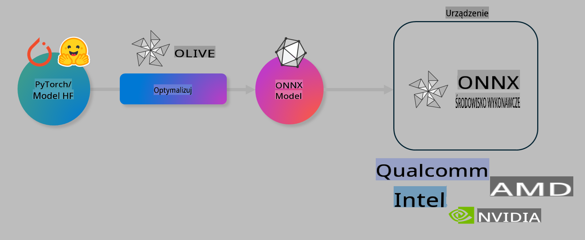

# Laboratorium: Optymalizacja modeli AI dla inferencji na urządzeniach

## Wprowadzenie

> [!IMPORTANT]
> To laboratorium wymaga **GPU Nvidia A10 lub A100** z zainstalowanymi odpowiednimi sterownikami oraz zestawem narzędzi CUDA (wersja 12+).

> [!NOTE]
> Jest to laboratorium na **35 minut**, które zapewni praktyczne wprowadzenie do podstawowych koncepcji optymalizacji modeli dla inferencji na urządzeniach przy użyciu OLIVE.

## Cele nauki

Po ukończeniu tego laboratorium będziesz w stanie używać OLIVE do:

- Kwantyzacji modelu AI za pomocą metody kwantyzacji AWQ.
- Dostosowania modelu AI do konkretnego zadania.
- Generowania adapterów LoRA (dostosowanego modelu) dla wydajnej inferencji na urządzeniach z wykorzystaniem ONNX Runtime.

### Czym jest Olive

Olive (*O*NNX *live*) to zestaw narzędzi do optymalizacji modeli z interfejsem CLI, który umożliwia wdrażanie modeli dla ONNX Runtime +++https://onnxruntime.ai+++ z zachowaniem jakości i wydajności.



Wejściem dla Olive jest zazwyczaj model PyTorch lub Hugging Face, a wyjściem zoptymalizowany model ONNX, który jest wykonywany na urządzeniu (docelowym środowisku wdrożenia) z uruchomionym ONNX Runtime. Olive optymalizuje model dla akceleratora AI docelowego środowiska wdrożenia (NPU, GPU, CPU) dostarczanego przez dostawcę sprzętu, takiego jak Qualcomm, AMD, Nvidia czy Intel.

Olive wykonuje *workflow*, czyli uporządkowaną sekwencję zadań optymalizacji modeli, nazywanych *passami*. Przykłady passów obejmują: kompresję modelu, przechwytywanie grafu, kwantyzację, optymalizację grafu. Każdy pass posiada zestaw parametrów, które można dostosować, aby osiągnąć najlepsze metryki, takie jak dokładność i opóźnienie, oceniane przez odpowiednie narzędzie oceniające. Olive stosuje strategię wyszukiwania, która wykorzystuje algorytm wyszukiwania do automatycznego dostrajania każdego passa indywidualnie lub zestawu passów razem.

#### Korzyści z Olive

- **Redukcja frustracji i czasu** spędzanego na eksperymentach metodą prób i błędów z różnymi technikami optymalizacji grafu, kompresji i kwantyzacji. Zdefiniuj swoje ograniczenia dotyczące jakości i wydajności, a Olive automatycznie znajdzie najlepszy model dla Ciebie.
- **Ponad 40 wbudowanych komponentów optymalizacji modeli**, obejmujących najnowsze techniki w zakresie kwantyzacji, kompresji, optymalizacji grafu i dostrajania.
- **Łatwy w użyciu interfejs CLI** do typowych zadań optymalizacji modeli. Na przykład: olive quantize, olive auto-opt, olive finetune.
- Wbudowane pakowanie i wdrażanie modeli.
- Obsługa generowania modeli dla **Multi LoRA serving**.
- Tworzenie workflowów za pomocą YAML/JSON do orkiestracji zadań optymalizacji i wdrażania modeli.
- Integracja z **Hugging Face** i **Azure AI**.
- Wbudowany mechanizm **cache'owania**, aby **oszczędzać koszty**.

## Instrukcje do laboratorium

> [!NOTE]
> Upewnij się, że skonfigurowałeś swój Azure AI Hub, Projekt oraz A100 Compute zgodnie z Lab 1.

### Krok 0: Połącz się z Azure AI Compute

Połączysz się z Azure AI Compute przy użyciu funkcji zdalnej w **VS Code.**

1. Otwórz aplikację desktopową **VS Code**:
1. Otwórz **paletę poleceń** za pomocą **Shift+Ctrl+P**.
1. W palecie poleceń wyszukaj **AzureML - remote: Connect to compute instance in New Window**.
1. Postępuj zgodnie z instrukcjami wyświetlanymi na ekranie, aby połączyć się z Compute. Będzie to obejmowało wybór subskrypcji Azure, grupy zasobów, projektu i nazwy Compute skonfigurowanych w Lab 1.
1. Po połączeniu z węzłem Azure ML Compute, status zostanie wyświetlony w **lewej dolnej części Visual Code** `><Azure ML: Compute Name`.

### Krok 1: Sklonuj to repozytorium

W VS Code możesz otworzyć nowy terminal za pomocą **Ctrl+J** i sklonować to repozytorium:

W terminalu powinien pojawić się prompt:

```
azureuser@computername:~/cloudfiles/code$ 
```
Sklonuj rozwiązanie:

```bash
cd ~/localfiles
git clone https://github.com/microsoft/phi-3cookbook.git
```

### Krok 2: Otwórz folder w VS Code

Aby otworzyć VS Code w odpowiednim folderze, wykonaj następujące polecenie w terminalu, co otworzy nowe okno:

```bash
code phi-3cookbook/code/04.Finetuning/Olive-lab
```

Alternatywnie możesz otworzyć folder, wybierając **File** > **Open Folder**.

### Krok 3: Zależności

Otwórz okno terminala w VS Code na swoim Azure AI Compute Instance (podpowiedź: **Ctrl+J**) i wykonaj następujące polecenia, aby zainstalować zależności:

```bash
conda create -n olive-ai python=3.11 -y
conda activate olive-ai
pip install -r requirements.txt
az extension remove -n azure-cli-ml
az extension add -n ml
```

> [!NOTE]
> Instalacja wszystkich zależności zajmie około **5 minut**.

W tym laboratorium będziesz pobierać i przesyłać modele do katalogu modeli Azure AI. Aby uzyskać dostęp do katalogu modeli, musisz zalogować się do Azure, używając:

```bash
az login
```

> [!NOTE]
> Podczas logowania zostaniesz poproszony o wybranie subskrypcji. Upewnij się, że ustawisz subskrypcję na tę dostarczoną do tego laboratorium.

### Krok 4: Wykonaj polecenia Olive

Otwórz okno terminala w VS Code na swoim Azure AI Compute Instance (podpowiedź: **Ctrl+J**) i upewnij się, że środowisko `olive-ai` conda jest aktywowane:

```bash
conda activate olive-ai
```

Następnie wykonaj następujące polecenia Olive w wierszu poleceń.

1. **Przeanalizuj dane:** W tym przykładzie dostroisz model Phi-3.5-Mini, aby specjalizował się w odpowiadaniu na pytania związane z podróżami. Kod poniżej wyświetla pierwsze kilka rekordów zestawu danych w formacie JSON lines:

    ```bash
    head data/data_sample_travel.jsonl
    ```
1. **Kwantyzacja modelu:** Przed trenowaniem modelu najpierw przeprowadź jego kwantyzację za pomocą następującego polecenia, które wykorzystuje technikę o nazwie Active Aware Quantization (AWQ) +++https://arxiv.org/abs/2306.00978+++. AWQ kwantyzuje wagi modelu, biorąc pod uwagę aktywacje generowane podczas inferencji. Oznacza to, że proces kwantyzacji uwzględnia rzeczywisty rozkład danych w aktywacjach, co prowadzi do lepszego zachowania dokładności modelu w porównaniu z tradycyjnymi metodami kwantyzacji wag.

    ```bash
    olive quantize \
       --model_name_or_path microsoft/Phi-3.5-mini-instruct \
       --trust_remote_code \
       --algorithm awq \
       --output_path models/phi/awq \
       --log_level 1
    ```
    
    Proces kwantyzacji AWQ trwa około **8 minut** i **zmniejszy rozmiar modelu z ~7,5GB do ~2,5GB**.
   
    W tym laboratorium pokażemy, jak wprowadzać modele z Hugging Face (na przykład: `microsoft/Phi-3.5-mini-instruct`). However, Olive also allows you to input models from the Azure AI catalog by updating the `model_name_or_path` argument to an Azure AI asset ID (for example:  `azureml://registries/azureml/models/Phi-3.5-mini-instruct/versions/4`). 

1. **Train the model:** Next, the `olive finetune`). Kwantyzacja modelu *przed* dostrojeniem, zamiast po nim, daje lepszą dokładność, ponieważ proces dostrajania odzyskuje część strat wynikających z kwantyzacji.

    ```bash
    olive finetune \
        --method lora \
        --model_name_or_path models/phi/awq \
        --data_files "data/data_sample_travel.jsonl" \
        --data_name "json" \
        --text_template "<|user|>\n{prompt}<|end|>\n<|assistant|>\n{response}<|end|>" \
        --max_steps 100 \
        --output_path ./models/phi/ft \
        --log_level 1
    ```
    
    Proces dostrajania (100 kroków) trwa około **6 minut**.

1. **Optymalizacja:** Po dostrojeniu modelu, zoptymalizuj go za pomocą polecenia Olive `auto-opt` command, which will capture the ONNX graph and automatically perform a number of optimizations to improve the model performance for CPU by compressing the model and doing fusions. It should be noted, that you can also optimize for other devices such as NPU or GPU by just updating the `--device` and `--provider` - ale na potrzeby tego laboratorium użyjemy CPU.

    ```bash
    olive auto-opt \
       --model_name_or_path models/phi/ft/model \
       --adapter_path models/phi/ft/adapter \
       --device cpu \
       --provider CPUExecutionProvider \
       --use_ort_genai \
       --output_path models/phi/onnx-ao \
       --log_level 1
    ```
    
    Optymalizacja trwa około **5 minut**.

### Krok 5: Szybki test inferencji modelu

Aby przetestować inferencję modelu, utwórz plik Python w swoim folderze o nazwie **app.py** i skopiuj oraz wklej następujący kod:

```python
import onnxruntime_genai as og
import numpy as np

print("loading model and adapters...", end="", flush=True)
model = og.Model("models/phi/onnx-ao/model")
adapters = og.Adapters(model)
adapters.load("models/phi/onnx-ao/model/adapter_weights.onnx_adapter", "travel")
print("DONE!")

tokenizer = og.Tokenizer(model)
tokenizer_stream = tokenizer.create_stream()

params = og.GeneratorParams(model)
params.set_search_options(max_length=100, past_present_share_buffer=False)
user_input = "what is the best thing to see in chicago"
params.input_ids = tokenizer.encode(f"<|user|>\n{user_input}<|end|>\n<|assistant|>\n")

generator = og.Generator(model, params)

generator.set_active_adapter(adapters, "travel")

print(f"{user_input}")

while not generator.is_done():
    generator.compute_logits()
    generator.generate_next_token()

    new_token = generator.get_next_tokens()[0]
    print(tokenizer_stream.decode(new_token), end='', flush=True)

print("\n")
```

Wykonaj kod za pomocą:

```bash
python app.py
```

### Krok 6: Prześlij model do Azure AI

Przesłanie modelu do repozytorium modeli Azure AI umożliwia udostępnienie modelu innym członkom zespołu deweloperskiego oraz obsługę wersjonowania modelu. Aby przesłać model, uruchom następujące polecenie:

> [!NOTE]
> Zaktualizuj `{}` placeholders with the name of your resource group and Azure AI Project Name. 

To find your resource group `"resourceGroup" i nazwę projektu Azure AI, a następnie uruchom następujące polecenie:

```
az ml workspace show
```

Lub przejdź do +++ai.azure.com+++ i wybierz **management center** > **project** > **overview**.

Zaktualizuj `{}` o nazwę swojej grupy zasobów oraz nazwę projektu Azure AI.

```bash
az ml model create \
    --name ft-for-travel \
    --version 1 \
    --path ./models/phi/onnx-ao \
    --resource-group {RESOURCE_GROUP_NAME} \
    --workspace-name {PROJECT_NAME}
```
Następnie możesz zobaczyć swój przesłany model i wdrożyć go pod adresem https://ml.azure.com/model/list

**Zastrzeżenie**:  
Niniejszy dokument został przetłumaczony za pomocą automatycznych usług tłumaczenia AI. Chociaż staramy się zapewnić dokładność, prosimy mieć na uwadze, że tłumaczenia automatyczne mogą zawierać błędy lub nieścisłości. Oryginalny dokument w jego rodzimym języku powinien być uznawany za wiarygodne źródło. W przypadku informacji krytycznych zaleca się skorzystanie z profesjonalnego tłumaczenia wykonanego przez człowieka. Nie ponosimy odpowiedzialności za jakiekolwiek nieporozumienia lub błędne interpretacje wynikające z korzystania z tego tłumaczenia.