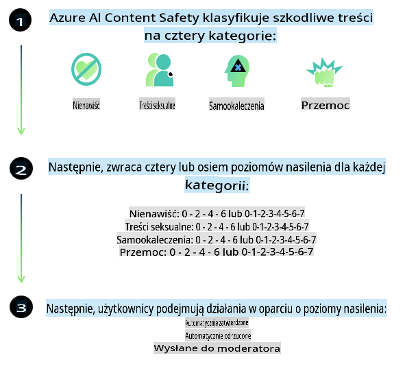
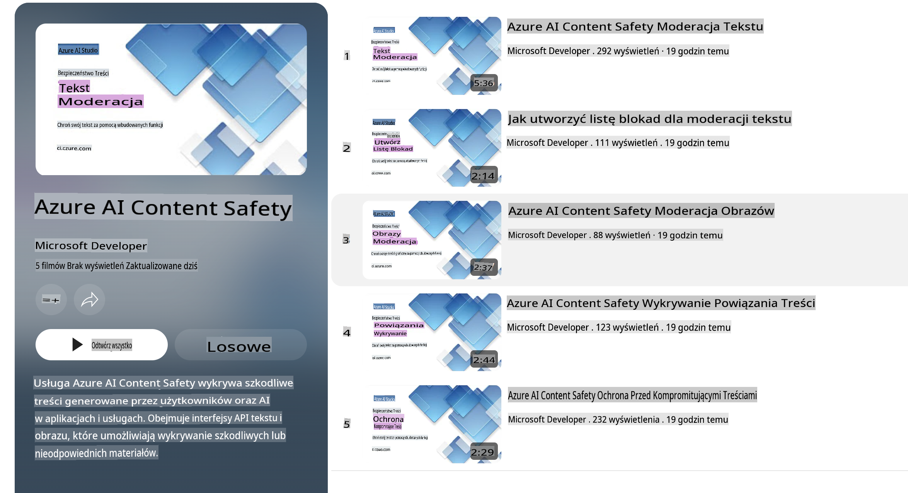

# Bezpieczeństwo AI dla modeli Phi

Rodzina modeli Phi została opracowana zgodnie z [Microsoft Responsible AI Standard](https://query.prod.cms.rt.microsoft.com/cms/api/am/binary/RE5cmFl), który jest zestawem wymagań obowiązujących w całej firmie, opartych na sześciu zasadach: odpowiedzialności, przejrzystości, uczciwości, niezawodności i bezpieczeństwie, prywatności i ochronie danych oraz inkluzywności, które tworzą [zasady Odpowiedzialnej AI Microsoft](https://www.microsoft.com/ai/responsible-ai).

Podobnie jak w przypadku wcześniejszych modeli Phi, zastosowano wieloaspektową ocenę bezpieczeństwa oraz podejście do post-treningowego szkolenia w zakresie bezpieczeństwa, wprowadzając dodatkowe środki uwzględniające wielojęzyczne możliwości tej wersji. Nasze podejście do szkolenia i oceny bezpieczeństwa, w tym testy w wielu językach i kategoriach ryzyka, opisano w [Phi Safety Post-Training Paper](https://arxiv.org/abs/2407.13833). Chociaż modele Phi korzystają z tego podejścia, programiści powinni stosować najlepsze praktyki odpowiedzialnego AI, w tym identyfikowanie, mierzenie i minimalizowanie ryzyk związanych z konkretnymi przypadkami użycia oraz kontekstem kulturowym i językowym.

## Najlepsze praktyki

Podobnie jak inne modele, rodzina modeli Phi może potencjalnie zachowywać się w sposób nieuczciwy, zawodny lub obraźliwy.

Niektóre ograniczenia modeli SLM i LLM, na które należy zwrócić uwagę, obejmują:

- **Jakość usługi:** Modele Phi są głównie trenowane na tekstach w języku angielskim. Języki inne niż angielski mogą charakteryzować się gorszą wydajnością. Odmiany języka angielskiego mniej reprezentowane w danych treningowych mogą mieć gorszą wydajność w porównaniu do standardowego amerykańskiego angielskiego.
- **Reprezentacja szkód i utrwalanie stereotypów:** Modele te mogą nadmiernie lub niedostatecznie reprezentować grupy ludzi, wykluczać reprezentację niektórych grup lub wzmacniać poniżające bądź negatywne stereotypy. Pomimo post-treningowego szkolenia w zakresie bezpieczeństwa, ograniczenia te mogą nadal występować z powodu różnic w reprezentacji różnych grup lub występowania przykładów negatywnych stereotypów w danych treningowych, które odzwierciedlają rzeczywiste wzorce i uprzedzenia społeczne.
- **Nieodpowiednie lub obraźliwe treści:** Modele te mogą generować inne rodzaje nieodpowiednich lub obraźliwych treści, co może sprawić, że ich wdrożenie w wrażliwych kontekstach będzie nieodpowiednie bez dodatkowych środków zaradczych specyficznych dla danego przypadku użycia.
- **Niezawodność informacji:** Modele językowe mogą generować nielogiczne treści lub fabrykować informacje, które brzmią wiarygodnie, ale są nieprawdziwe lub nieaktualne.
- **Ograniczony zakres kodu:** Większość danych treningowych Phi-3 opiera się na Pythonie i wykorzystuje popularne pakiety, takie jak "typing, math, random, collections, datetime, itertools". Jeśli model generuje skrypty w Pythonie, które korzystają z innych pakietów, lub skrypty w innych językach, zdecydowanie zalecamy ręczną weryfikację wszystkich użyć API.

Programiści powinni stosować najlepsze praktyki odpowiedzialnego AI i są odpowiedzialni za zapewnienie, że konkretny przypadek użycia jest zgodny z obowiązującymi przepisami i regulacjami (np. dotyczącymi prywatności, handlu itp.).

## Rozważania dotyczące odpowiedzialnego AI

Podobnie jak inne modele językowe, modele z serii Phi mogą potencjalnie zachowywać się w sposób nieuczciwy, zawodny lub obraźliwy. Niektóre ograniczenia, na które należy zwrócić uwagę, obejmują:

**Jakość usługi:** Modele Phi są głównie trenowane na tekstach w języku angielskim. Języki inne niż angielski mogą charakteryzować się gorszą wydajnością. Odmiany języka angielskiego mniej reprezentowane w danych treningowych mogą mieć gorszą wydajność w porównaniu do standardowego amerykańskiego angielskiego.

**Reprezentacja szkód i utrwalanie stereotypów:** Modele te mogą nadmiernie lub niedostatecznie reprezentować grupy ludzi, wykluczać reprezentację niektórych grup lub wzmacniać poniżające bądź negatywne stereotypy. Pomimo post-treningowego szkolenia w zakresie bezpieczeństwa, ograniczenia te mogą nadal występować z powodu różnic w reprezentacji różnych grup lub występowania przykładów negatywnych stereotypów w danych treningowych, które odzwierciedlają rzeczywiste wzorce i uprzedzenia społeczne.

**Nieodpowiednie lub obraźliwe treści:** Modele te mogą generować inne rodzaje nieodpowiednich lub obraźliwych treści, co może sprawić, że ich wdrożenie w wrażliwych kontekstach będzie nieodpowiednie bez dodatkowych środków zaradczych specyficznych dla danego przypadku użycia.

**Niezawodność informacji:** Modele językowe mogą generować nielogiczne treści lub fabrykować informacje, które brzmią wiarygodnie, ale są nieprawdziwe lub nieaktualne.

**Ograniczony zakres kodu:** Większość danych treningowych Phi-3 opiera się na Pythonie i wykorzystuje popularne pakiety, takie jak "typing, math, random, collections, datetime, itertools". Jeśli model generuje skrypty w Pythonie, które korzystają z innych pakietów, lub skrypty w innych językach, zdecydowanie zalecamy ręczną weryfikację wszystkich użyć API.

Programiści powinni stosować najlepsze praktyki odpowiedzialnego AI i są odpowiedzialni za zapewnienie, że konkretny przypadek użycia jest zgodny z obowiązującymi przepisami i regulacjami (np. dotyczącymi prywatności, handlu itp.). Ważne obszary do rozważenia obejmują:

**Alokacja:** Modele mogą nie być odpowiednie dla scenariuszy, które mogą mieć istotny wpływ na status prawny lub alokację zasobów bądź możliwości życiowych (np. mieszkalnictwo, zatrudnienie, kredyty itp.) bez dodatkowych ocen i technik redukcji uprzedzeń.

**Scenariusze wysokiego ryzyka:** Programiści powinni ocenić przydatność modeli w scenariuszach wysokiego ryzyka, w których niesprawiedliwe, zawodne lub obraźliwe wyniki mogą być bardzo kosztowne lub prowadzić do szkód. Dotyczy to udzielania porad w wrażliwych lub eksperckich dziedzinach, gdzie dokładność i niezawodność są kluczowe (np. porady prawne lub zdrowotne). Na poziomie aplikacji należy wdrożyć dodatkowe zabezpieczenia w zależności od kontekstu wdrożenia.

**Dezinformacja:** Modele mogą generować nieprawdziwe informacje. Programiści powinni stosować najlepsze praktyki w zakresie przejrzystości i informować użytkowników końcowych, że mają do czynienia z systemem AI. Na poziomie aplikacji programiści mogą budować mechanizmy opinii zwrotnej i procesy integrujące odpowiedzi z kontekstowymi informacjami specyficznymi dla przypadku użycia, techniką znaną jako Retrieval Augmented Generation (RAG).

**Generowanie szkodliwych treści:** Programiści powinni oceniać wyniki w kontekście i korzystać z dostępnych klasyfikatorów bezpieczeństwa lub niestandardowych rozwiązań odpowiednich dla swojego przypadku użycia.

**Nadużycia:** Inne formy nadużyć, takie jak oszustwa, spam czy tworzenie złośliwego oprogramowania, mogą być możliwe, dlatego programiści powinni upewnić się, że ich aplikacje nie naruszają obowiązujących przepisów i regulacji.

### Fine-tuning i bezpieczeństwo treści AI

Po dostrojeniu modelu zdecydowanie zalecamy korzystanie z [Azure AI Content Safety](https://learn.microsoft.com/azure/ai-services/content-safety/overview) w celu monitorowania treści generowanych przez modele, identyfikacji i blokowania potencjalnych zagrożeń, ryzyk oraz problemów z jakością.

[Azure AI Content Safety](https://learn.microsoft.com/azure/ai-services/content-safety/overview) obsługuje zarówno treści tekstowe, jak i graficzne. Może być wdrażane w chmurze, w kontenerach odłączonych od sieci oraz na urządzeniach brzegowych/wbudowanych.

## Przegląd Azure AI Content Safety

Azure AI Content Safety nie jest rozwiązaniem uniwersalnym; można je dostosować do specyficznych polityk danej firmy. Dodatkowo, jego modele wielojęzyczne umożliwiają rozumienie wielu języków jednocześnie.

- **Azure AI Content Safety**
- **Microsoft Developer**
- **5 filmów**

Usługa Azure AI Content Safety wykrywa szkodliwe treści generowane przez użytkowników i AI w aplikacjach i usługach. Obejmuje API tekstowe i graficzne, które pozwalają wykrywać szkodliwe lub nieodpowiednie materiały.

[AI Content Safety Playlist](https://www.youtube.com/playlist?list=PLlrxD0HtieHjaQ9bJjyp1T7FeCbmVcPkQ)

**Zastrzeżenie**:  
Niniejszy dokument został przetłumaczony przy użyciu usług tłumaczenia maszynowego opartego na sztucznej inteligencji. Chociaż dokładamy wszelkich starań, aby tłumaczenie było precyzyjne, prosimy pamiętać, że automatyczne tłumaczenia mogą zawierać błędy lub nieścisłości. Oryginalny dokument w jego rodzimym języku powinien być uznawany za wiarygodne źródło. W przypadku informacji o krytycznym znaczeniu zaleca się skorzystanie z profesjonalnego tłumaczenia przez człowieka. Nie ponosimy odpowiedzialności za jakiekolwiek nieporozumienia lub błędne interpretacje wynikające z użycia tego tłumaczenia.