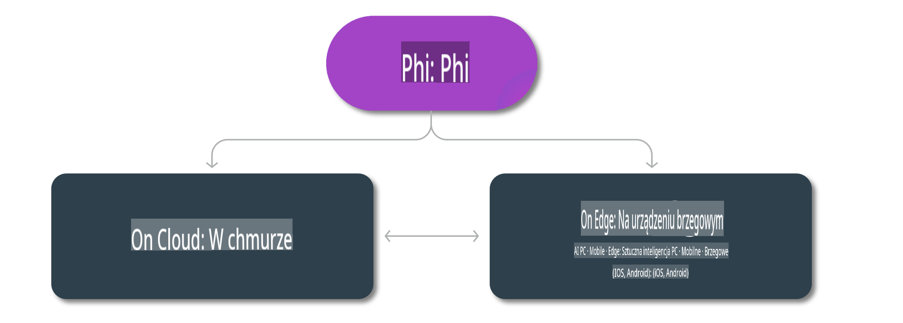

# Modele Phi i dostępność na różnych platformach

## Scenariusze Edge i Cloud

## Dostępność modeli i zasoby

| | | | | | | | | |
|-|-|-|-|-|-|-|-|-|
|Model|Dane wejściowe|Długość treści|Azure AI (MaaS)|Azure ML (MaaP)|ONNX|Hugging Face|Ollama|Nvidia NIM|
|Phi-3-vision-128k-instruct|Tekst+Obraz|128k|[Playground i Wdrożenie](https://ai.azure.com/explore/models/Phi-3-vision-128k-instruct/version/2/registry/azureml)|[Playground, Wdrożenie i Dostosowanie](https://ml.azure.com/registries/azureml/models/Phi-3-vision-128k-instruct/version/2)|[CUDA](https://huggingface.co/microsoft/Phi-3-vision-128k-instruct-onnx-cuda/tree/main),[CPU](https://huggingface.co/microsoft/Phi-3-vision-128k-instruct-onnx-cpu/tree/main), [DirectML](https://huggingface.co/microsoft/Phi-3-vision-128k-instruct-onnx-directml/tree/main)|[Pobierz](https://huggingface.co/microsoft/Phi-3-vision-128k-instruct)|-NA-|[NIM API](https://build.nvidia.com/microsoft/phi-3-vision-128k-instruct)|
|Phi-3-mini-4k-instruct|Tekst|4k|[Playground i Wdrożenie](https://aka.ms/phi3-mini-4k-azure-ml)|[Playground, Wdrożenie](https://aka.ms/phi3-mini-4k-azure-ml) i Dostosowanie|[CUDA](https://huggingface.co/microsoft/Phi-3-mini-4k-instruct-onnx), [Web](https://huggingface.co/microsoft/Phi-3-mini-4k-instruct-onnx)|[Playground i Pobierz](https://huggingface.co/chat/models/microsoft/Phi-3-mini-4k-instruct)|[GGUF](https://huggingface.co/microsoft/Phi-3-mini-4k-instruct-gguf)|[NIM API](https://build.nvidia.com/microsoft/phi-3-mini-4k)|
|Phi-3-mini-128k-instruct|Tekst|128k|[Playground i Wdrożenie](https://ai.azure.com/explore/models/Phi-3-mini-128k-instruct/version/9/registry/azureml)|[Playground, Wdrożenie](https://ai.azure.com/explore/models/Phi-3-mini-128k-instruct/version/9/registry/azureml) i Dostosowanie|[CUDA](https://huggingface.co/microsoft/Phi-3-mini-128k-instruct-onnx)|[Pobierz](https://huggingface.co/microsoft/Phi-3-mini-128k-instruct-onnx)|-NA-|[NIM API](https://build.nvidia.com/microsoft/phi-3-mini)|
|Phi-3-small-8k-instruct|Tekst|8k|[Playground i Wdrożenie](https://ml.azure.com/registries/azureml/models/Phi-3-small-8k-instruct/version/2)|[Playground, Wdrożenie](https://ai.azure.com/explore/models/Phi-3-small-8k-instruct/version/2/registry/azureml) i Dostosowanie|[CUDA](https://huggingface.co/microsoft/Phi-3-small-8k-instruct-onnx-cuda)|[Pobierz](https://huggingface.co/microsoft/Phi-3-small-8k-instruct-onnx-cuda)|-NA-|[NIM API](https://build.nvidia.com/microsoft/phi-3-small-8k-instruct?docker=false)|
|Phi-3-small-128k-instruct|Tekst|128k|[Playground i Wdrożenie](https://ai.azure.com/explore/models/Phi-3-small-128k-instruct/version/2/registry/azureml)|[Playground, Wdrożenie](https://ml.azure.com/registries/azureml/models/Phi-3-small-128k-instruct/version/2) i Dostosowanie|[CUDA](https://huggingface.co/microsoft/Phi-3-medium-128k-instruct-onnx-cuda)|[Pobierz](https://huggingface.co/microsoft/Phi-3-small-128k-instruct)|-NA-|[NIM API](https://build.nvidia.com/microsoft/phi-3-small-128k-instruct?docker=false)|
|Phi-3-medium-4k-instruct|Tekst|4k|[Playground i Wdrożenie](https://huggingface.co/microsoft/Phi-3-medium-4k-instruct)|[Playground, Wdrożenie](https://ml.azure.com/registries/azureml/models/Phi-3-medium-4k-instruct/version/2) i Dostosowywanie|[CUDA](https://huggingface.co/microsoft/Phi-3-medium-4k-instruct-onnx-cuda/tree/main), [CPU](https://huggingface.co/microsoft/Phi-3-medium-4k-instruct-onnx-cpu/tree/main), [DirectML](https://huggingface.co/microsoft/Phi-3-medium-4k-instruct-onnx-directml/tree/main)|[Pobierz](https://huggingface.co/microsoft/Phi-3-medium-4k-instruct)|-BRAK-|[NIM APIs](https://build.nvidia.com/microsoft/phi-3-medium-4k-instruct?docker=false)|
|Phi-3-medium-128k-instruct|Tekst|128k|[Playground i Wdrożenie](https://ai.azure.com/explore/models/Phi-3-medium-128k-instruct/version/2)|[Playground, Wdrożenie](https://ml.azure.com/registries/azureml/models/Phi-3-medium-128k-instruct/version/2) i Dostosowywanie|[CUDA](https://huggingface.co/microsoft/Phi-3-medium-128k-instruct-onnx-cuda/tree/main), [CPU](https://huggingface.co/microsoft/Phi-3-medium-128k-instruct-onnx-cpu/tree/main), [DirectML](https://huggingface.co/microsoft/Phi-3-medium-128k-instruct-onnx-directml/tree/main)|[Pobierz](https://huggingface.co/microsoft/Phi-3-medium-128k-instruct)|-BRAK-|-BRAK-|

**Zastrzeżenie**:  
Niniejszy dokument został przetłumaczony za pomocą automatycznych usług tłumaczenia AI. Chociaż staramy się zapewnić dokładność, prosimy mieć na uwadze, że tłumaczenia automatyczne mogą zawierać błędy lub nieścisłości. Oryginalny dokument w jego rodzimym języku powinien być uznawany za wiążące źródło. W przypadku informacji krytycznych zaleca się skorzystanie z profesjonalnego tłumaczenia przez człowieka. Nie ponosimy odpowiedzialności za jakiekolwiek nieporozumienia lub błędne interpretacje wynikające z użycia tego tłumaczenia.