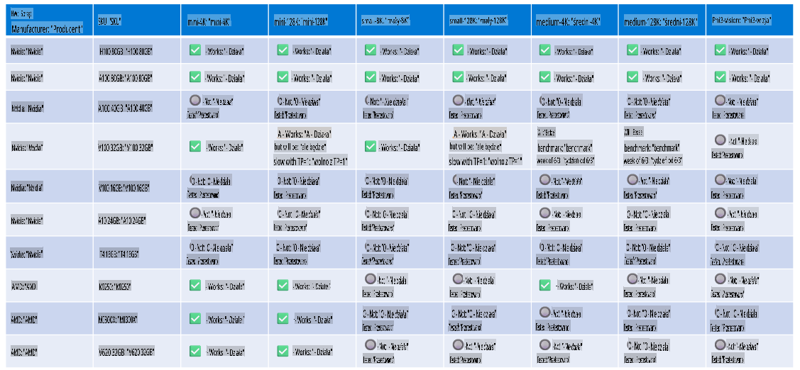

# Obsługa sprzętu Phi

Microsoft Phi został zoptymalizowany dla ONNX Runtime i obsługuje Windows DirectML. Działa dobrze na różnych typach sprzętu, w tym na GPU, CPU, a nawet urządzeniach mobilnych.

## Sprzęt urządzenia 
Obsługiwany sprzęt obejmuje:

- GPU SKU: RTX 4090 (DirectML)
- GPU SKU: 1 A100 80GB (CUDA)
- CPU SKU: Standard F64s v2 (64 vCPU, 128 GiB pamięci)

## Mobile SKU

- Android - Samsung Galaxy S21
- Apple iPhone 14 lub wyższy z procesorem A16/A17

## Specyfikacja sprzętu Phi

- Minimalna wymagana konfiguracja.
- Windows: GPU kompatybilne z DirectX 12 i minimum 4GB łącznej pamięci RAM

CUDA: NVIDIA GPU z Compute Capability >= 7.02



## Uruchamianie onnxruntime na wielu GPU

Obecnie dostępne modele Phi ONNX są przeznaczone tylko dla 1 GPU. Istnieje możliwość obsługi wielu GPU dla modelu Phi, ale ORT z 2 GPU nie gwarantuje większej przepustowości w porównaniu do 2 instancji ORT. Proszę zapoznać się z [ONNX Runtime](https://onnxruntime.ai/) w celu uzyskania najnowszych informacji.

Podczas [Build 2024 zespół GenAI ONNX](https://youtu.be/WLW4SE8M9i8?si=EtG04UwDvcjunyfC) ogłosił, że włączyli obsługę wielu instancji zamiast wielu GPU dla modeli Phi.

Obecnie umożliwia to uruchamianie jednej instancji onnxruntime lub onnxruntime-genai z użyciem zmiennej środowiskowej CUDA_VISIBLE_DEVICES w taki sposób:

```Python
CUDA_VISIBLE_DEVICES=0 python infer.py
CUDA_VISIBLE_DEVICES=1 python infer.py
```

Zachęcamy do dalszego zgłębiania Phi w [Azure AI Foundry](https://ai.azure.com)

**Zastrzeżenie**:  
Ten dokument został przetłumaczony za pomocą usług tłumaczenia maszynowego opartego na sztucznej inteligencji. Chociaż staramy się zapewnić dokładność, prosimy mieć na uwadze, że automatyczne tłumaczenia mogą zawierać błędy lub nieścisłości. Oryginalny dokument w jego rodzimym języku powinien być uznawany za wiążące źródło. W przypadku informacji krytycznych zalecane jest skorzystanie z profesjonalnego tłumaczenia przez człowieka. Nie ponosimy odpowiedzialności za jakiekolwiek nieporozumienia lub błędne interpretacje wynikające z korzystania z tego tłumaczenia.