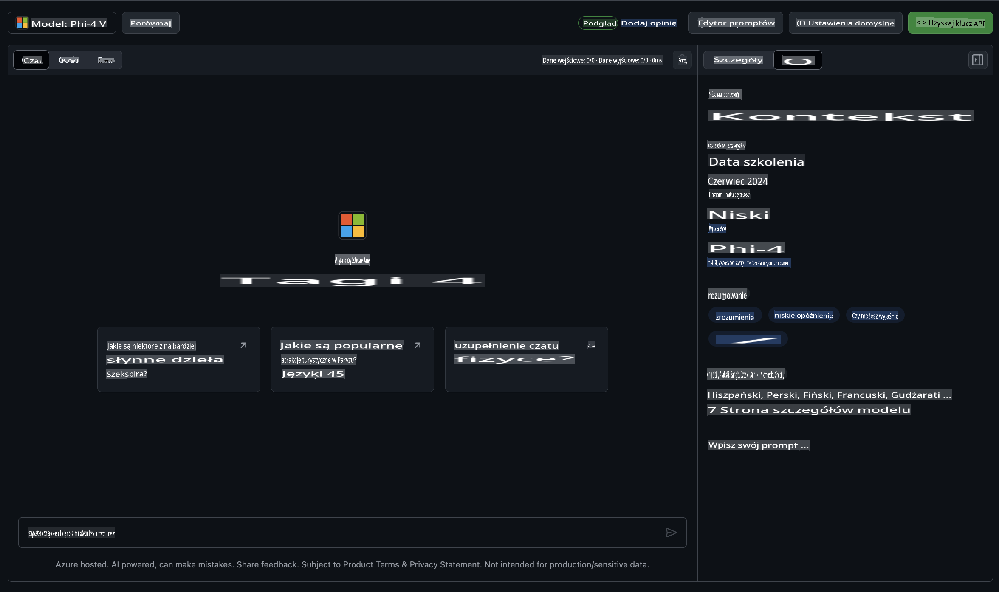

## Rodzina Phi w GitHub Models

Witamy w [GitHub Models](https://github.com/marketplace/models)! Wszystko jest gotowe, abyś mógł odkrywać modele AI hostowane na Azure AI.


Aby uzyskać więcej informacji o modelach dostępnych w GitHub Models, zajrzyj na [GitHub Model Marketplace](https://github.com/marketplace/models).

## Dostępne modele

Każdy model ma dedykowane środowisko testowe i przykładowy kod.



### Rodzina Phi w GitHub Model Catalog

- [Phi-4](https://github.com/marketplace/models/azureml/Phi-4)

- [Phi-3.5-MoE instruct (128k)](https://github.com/marketplace/models/azureml/Phi-3-5-MoE-instruct)

- [Phi-3.5-vision instruct (128k)](https://github.com/marketplace/models/azureml/Phi-3-5-vision-instruct)

- [Phi-3.5-mini instruct (128k)](https://github.com/marketplace/models/azureml/Phi-3-5-mini-instruct)

- [Phi-3-Medium-128k-Instruct](https://github.com/marketplace/models/azureml/Phi-3-medium-128k-instruct)

- [Phi-3-medium-4k-instruct](https://github.com/marketplace/models/azureml/Phi-3-medium-4k-instruct)

- [Phi-3-mini-128k-instruct](https://github.com/marketplace/models/azureml/Phi-3-mini-128k-instruct)

- [Phi-3-mini-4k-instruct](https://github.com/marketplace/models/azureml/Phi-3-mini-4k-instruct)

- [Phi-3-small-128k-instruct](https://github.com/marketplace/models/azureml/Phi-3-small-128k-instruct)

- [Phi-3-small-8k-instruct](https://github.com/marketplace/models/azureml/Phi-3-small-8k-instruct)

## Pierwsze kroki

Przygotowaliśmy kilka podstawowych przykładów, które możesz od razu uruchomić. Znajdziesz je w katalogu z przykładami. Jeśli chcesz od razu zacząć w swoim ulubionym języku, przykłady są dostępne w następujących językach:

- Python
- JavaScript
- C#
- Java
- cURL

Dostępne jest także dedykowane środowisko Codespaces do uruchamiania przykładów i modeli.


## Przykładowy kod

Poniżej znajdują się przykładowe fragmenty kodu dla kilku przypadków użycia. Aby uzyskać więcej informacji o Azure AI Inference SDK, zapoznaj się z pełną dokumentacją i przykładami.

## Konfiguracja

1. Utwórz token dostępu osobistego  
Nie musisz nadawać żadnych uprawnień tokenowi. Pamiętaj, że token zostanie wysłany do usługi Microsoft.

Aby użyć poniższych fragmentów kodu, utwórz zmienną środowiskową, aby ustawić token jako klucz dla kodu klienta.

Jeśli używasz bash:  
```
export GITHUB_TOKEN="<your-github-token-goes-here>"
```  
Jeśli używasz PowerShell:  
```
$Env:GITHUB_TOKEN="<your-github-token-goes-here>"
```  

Jeśli używasz wiersza poleceń Windows:  
```
set GITHUB_TOKEN=<your-github-token-goes-here>
```  

## Przykład w Pythonie

### Instalacja zależności  
Zainstaluj Azure AI Inference SDK za pomocą pip (wymagania: Python >=3.8):  

```
pip install azure-ai-inference
```  

### Uruchomienie podstawowego przykładu kodu  

Ten przykład demonstruje podstawowe wywołanie API do generowania odpowiedzi w czacie. Wykorzystuje on punkt końcowy inferencji modelu GitHub AI oraz Twój token GitHub. Wywołanie jest synchroniczne.  

```python
import os
from azure.ai.inference import ChatCompletionsClient
from azure.ai.inference.models import SystemMessage, UserMessage
from azure.core.credentials import AzureKeyCredential

endpoint = "https://models.inference.ai.azure.com"
model_name = "Phi-4"
token = os.environ["GITHUB_TOKEN"]

client = ChatCompletionsClient(
    endpoint=endpoint,
    credential=AzureKeyCredential(token),
)

response = client.complete(
    messages=[
        UserMessage(content="I have $20,000 in my savings account, where I receive a 4% profit per year and payments twice a year. Can you please tell me how long it will take for me to become a millionaire? Also, can you please explain the math step by step as if you were explaining it to an uneducated person?"),
    ],
    temperature=0.4,
    top_p=1.0,
    max_tokens=2048,
    model=model_name
)

print(response.choices[0].message.content)
```  

### Prowadzenie wieloetapowej rozmowy  

Ten przykład pokazuje, jak przeprowadzić wieloetapową rozmowę z użyciem API do generowania odpowiedzi w czacie. W przypadku użycia modelu w aplikacji czatu, będziesz musiał zarządzać historią rozmowy i wysyłać najnowsze wiadomości do modelu.  

```
import os
from azure.ai.inference import ChatCompletionsClient
from azure.ai.inference.models import AssistantMessage, SystemMessage, UserMessage
from azure.core.credentials import AzureKeyCredential

token = os.environ["GITHUB_TOKEN"]
endpoint = "https://models.inference.ai.azure.com"
# Replace Model_Name
model_name = "Phi-4"

client = ChatCompletionsClient(
    endpoint=endpoint,
    credential=AzureKeyCredential(token),
)

messages = [
    SystemMessage(content="You are a helpful assistant."),
    UserMessage(content="What is the capital of France?"),
    AssistantMessage(content="The capital of France is Paris."),
    UserMessage(content="What about Spain?"),
]

response = client.complete(messages=messages, model=model_name)

print(response.choices[0].message.content)
```  

### Strumieniowanie odpowiedzi  

Aby poprawić doświadczenie użytkownika, warto strumieniować odpowiedź modelu, aby pierwszy token pojawił się jak najszybciej i uniknąć długiego oczekiwania na odpowiedzi.  

```
import os
from azure.ai.inference import ChatCompletionsClient
from azure.ai.inference.models import SystemMessage, UserMessage
from azure.core.credentials import AzureKeyCredential

token = os.environ["GITHUB_TOKEN"]
endpoint = "https://models.inference.ai.azure.com"
# Replace Model_Name
model_name = "Phi-4"

client = ChatCompletionsClient(
    endpoint=endpoint,
    credential=AzureKeyCredential(token),
)

response = client.complete(
    stream=True,
    messages=[
        SystemMessage(content="You are a helpful assistant."),
        UserMessage(content="Give me 5 good reasons why I should exercise every day."),
    ],
    model=model_name,
)

for update in response:
    if update.choices:
        print(update.choices[0].delta.content or "", end="")

client.close()
```  

## BEZPŁATNE użycie i limity w GitHub Models  


[Limity użycia środowiska testowego i bezpłatnego API](https://docs.github.com/en/github-models/prototyping-with-ai-models#rate-limits) zostały zaprojektowane, aby pomóc Ci w eksperymentowaniu z modelami i prototypowaniu aplikacji AI. Aby korzystać z nich poza tymi limitami i skalować swoją aplikację, musisz zapewnić zasoby z konta Azure i uwierzytelnić się z jego poziomu zamiast używać osobistego tokenu GitHub. Nie musisz zmieniać niczego innego w swoim kodzie. Skorzystaj z tego linku, aby dowiedzieć się, jak przekroczyć limity darmowego poziomu w Azure AI.

### Informacje dodatkowe

Pamiętaj, że wchodząc w interakcję z modelem, eksperymentujesz z AI, więc możliwe są błędy w treści.

Funkcja podlega różnym limitom (w tym liczbie żądań na minutę, żądań na dzień, tokenów na żądanie oraz równoczesnych żądań) i nie jest przeznaczona do zastosowań produkcyjnych.

GitHub Models korzysta z Azure AI Content Safety. Te filtry nie mogą zostać wyłączone w ramach doświadczenia GitHub Models. Jeśli zdecydujesz się na korzystanie z modeli w ramach płatnej usługi, skonfiguruj filtry treści zgodnie z Twoimi wymaganiami.

Ta usługa podlega warunkom wstępnym GitHub.

**Zastrzeżenie**:  
Ten dokument został przetłumaczony za pomocą usług tłumaczenia maszynowego opartego na sztucznej inteligencji. Chociaż staramy się zapewnić dokładność, prosimy pamiętać, że automatyczne tłumaczenia mogą zawierać błędy lub nieścisłości. Oryginalny dokument w jego języku źródłowym powinien być uznawany za wiążące źródło. W przypadku informacji o kluczowym znaczeniu zaleca się skorzystanie z profesjonalnego tłumaczenia przez człowieka. Nie ponosimy odpowiedzialności za wszelkie nieporozumienia lub błędne interpretacje wynikające z korzystania z tego tłumaczenia.