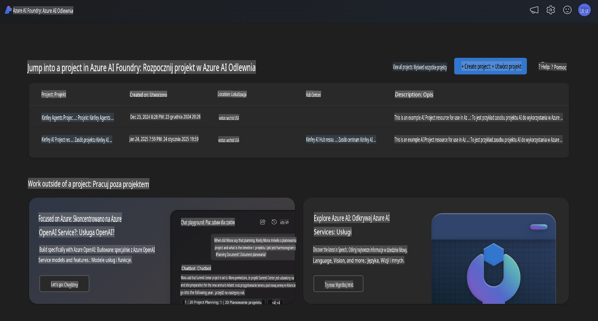
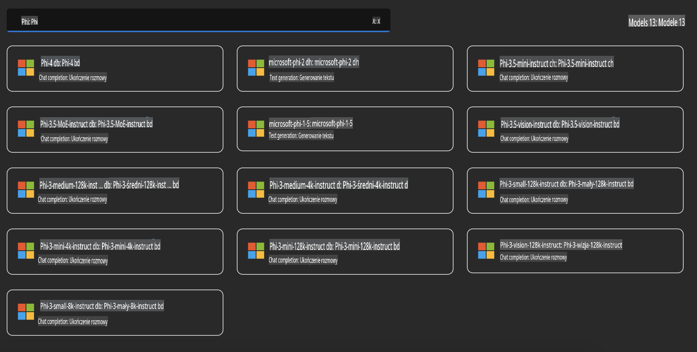
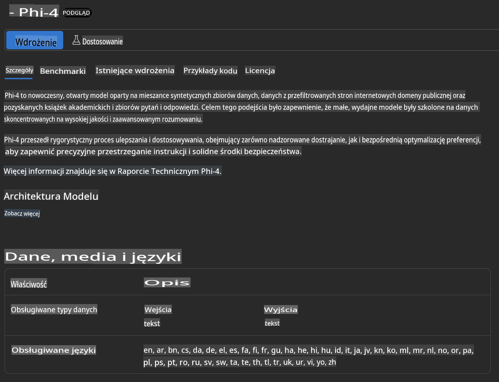
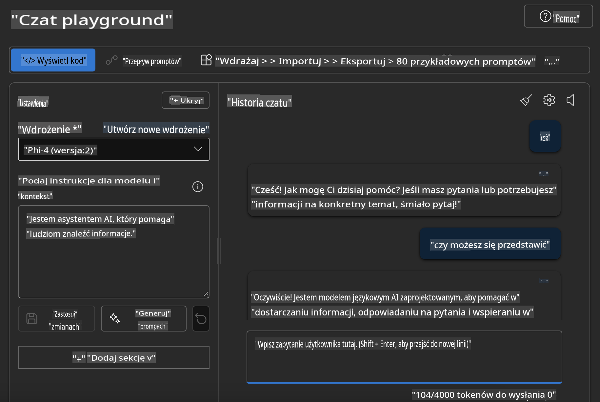

## Rodzina Phi w Azure AI Foundry

[Azure AI Foundry](https://ai.azure.com) to zaufana platforma, która umożliwia programistom napędzanie innowacji i kształtowanie przyszłości dzięki AI w sposób bezpieczny, zabezpieczony i odpowiedzialny.

[Azure AI Foundry](https://ai.azure.com) została zaprojektowana dla programistów, aby:

- Tworzyć aplikacje generatywnej AI na platformie klasy korporacyjnej.
- Eksplorować, budować, testować i wdrażać za pomocą najnowocześniejszych narzędzi AI i modeli ML, opartych na odpowiedzialnych praktykach AI.
- Współpracować z zespołem na każdym etapie cyklu życia tworzenia aplikacji.

Dzięki Azure AI Foundry możesz eksplorować szeroką gamę modeli, usług i możliwości, aby budować aplikacje AI najlepiej dostosowane do Twoich celów. Platforma Azure AI Foundry umożliwia skalowalność, która pozwala łatwo przekształcać dowody koncepcji w pełnoprawne aplikacje produkcyjne. Ciągłe monitorowanie i doskonalenie wspierają długoterminowy sukces.



Oprócz korzystania z Azure AOAI Service w Azure AI Foundry, możesz również używać modeli zewnętrznych w Azure AI Foundry Model Catalog. To dobre rozwiązanie, jeśli chcesz używać Azure AI Foundry jako platformy dla swojego rozwiązania AI.

Modele z rodziny Phi można szybko wdrożyć za pośrednictwem Model Catalog w Azure AI Foundry.



### **Wdrożenie Phi-4 w Azure AI Foundry**



### **Testowanie Phi-4 w Azure AI Foundry Playground**



### **Uruchamianie kodu w Pythonie do wywołania Azure AI Foundry Phi-4**

```python

import os  
import base64
from openai import AzureOpenAI  
from azure.identity import DefaultAzureCredential, get_bearer_token_provider  
        
endpoint = os.getenv("ENDPOINT_URL", "Your Azure AOAI Service Endpoint")  
deployment = os.getenv("DEPLOYMENT_NAME", "Phi-4")  
      
token_provider = get_bearer_token_provider(  
    DefaultAzureCredential(),  
    "https://cognitiveservices.azure.com/.default"  
)  
  
client = AzureOpenAI(  
    azure_endpoint=endpoint,  
    azure_ad_token_provider=token_provider,  
    api_version="2024-05-01-preview",  
)  
  

chat_prompt = [
    {
        "role": "system",
        "content": "You are an AI assistant that helps people find information."
    },
    {
        "role": "user",
        "content": "can you introduce yourself"
    }
] 
    
# Include speech result if speech is enabled  
messages = chat_prompt 

completion = client.chat.completions.create(  
    model=deployment,  
    messages=messages,
    max_tokens=800,  
    temperature=0.7,  
    top_p=0.95,  
    frequency_penalty=0,  
    presence_penalty=0,
    stop=None,  
    stream=False  
)  
  
print(completion.to_json())  

```

**Zastrzeżenie**:  
Ten dokument został przetłumaczony przy użyciu usług tłumaczenia maszynowego opartego na sztucznej inteligencji. Chociaż staramy się zapewnić dokładność, prosimy pamiętać, że automatyczne tłumaczenia mogą zawierać błędy lub nieścisłości. Oryginalny dokument w jego rodzimym języku powinien być uważany za wiarygodne źródło. W przypadku informacji krytycznych zaleca się skorzystanie z profesjonalnego tłumaczenia przez człowieka. Nie ponosimy odpowiedzialności za wszelkie nieporozumienia lub błędne interpretacje wynikające z korzystania z tego tłumaczenia.