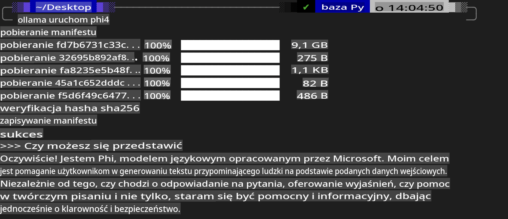
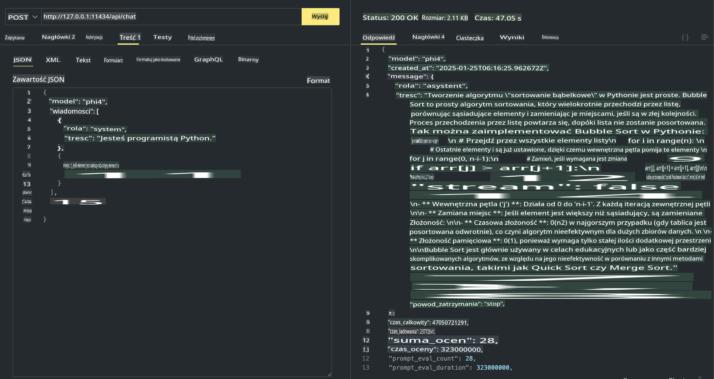

## Phi Family w Ollama

[Ollama](https://ollama.com) umożliwia większej liczbie osób bezpośrednie wdrażanie otwartoźródłowych LLM lub SLM za pomocą prostych skryptów, a także budowanie API wspierających lokalne scenariusze aplikacji Copilot.

## **1. Instalacja**

Ollama działa na Windows, macOS i Linux. Możesz zainstalować Ollama, korzystając z tego linku: ([https://ollama.com/download](https://ollama.com/download)). Po pomyślnej instalacji możesz używać skryptów Ollama do wywoływania Phi-3 bezpośrednio z poziomu terminala. Wszystkie [dostępne biblioteki w Ollama](https://ollama.com/library) znajdziesz na ich stronie. Jeśli otworzysz to repozytorium w Codespace, Ollama będzie już zainstalowana.

```bash

ollama run phi4

```

> [!NOTE]
> Model zostanie pobrany przy pierwszym uruchomieniu. Oczywiście możesz również wskazać wcześniej pobrany model Phi-4. Jako przykład użyjemy WSL do uruchomienia polecenia. Po pomyślnym pobraniu modelu możesz od razu rozpocząć interakcję w terminalu.



## **2. Wywoływanie API phi-4 z Ollama**

Jeśli chcesz wywołać API Phi-4 wygenerowane przez Ollama, możesz użyć tego polecenia w terminalu, aby uruchomić serwer Ollama.

```bash

ollama serve

```

> [!NOTE]
> Jeśli używasz macOS lub Linux, możesz napotkać następujący błąd: **"Error: listen tcp 127.0.0.1:11434: bind: address already in use"**. Ten błąd zwykle oznacza, że serwer już działa, więc możesz go zignorować lub zatrzymać i ponownie uruchomić Ollama:

**macOS**

```bash

brew services restart ollama

```

**Linux**

```bash

sudo systemctl stop ollama

```

Ollama obsługuje dwa API: generate i chat. Możesz wywoływać API modelu zgodnie ze swoimi potrzebami, wysyłając żądania do lokalnego serwera działającego na porcie 11434.

**Chat**

```bash

curl http://127.0.0.1:11434/api/chat -d '{
  "model": "phi3",
  "messages": [
    {
      "role": "system",
      "content": "Your are a python developer."
    },
    {
      "role": "user",
      "content": "Help me generate a bubble algorithm"
    }
  ],
  "stream": false
  
}'

This is the result in Postman



## Additional Resources

Check the list of available models in Ollama in [their library](https://ollama.com/library).

Pull your model from the Ollama server using this command

```bash
ollama pull phi4
```

Run the model using this command

```bash
ollama run phi4
```

***Note:*** Visit this link [https://github.com/ollama/ollama/blob/main/docs/api.md](https://github.com/ollama/ollama/blob/main/docs/api.md) to learn more

## Calling Ollama from Python

You can use `requests` or `urllib3` to make requests to the local server endpoints used above. However, a popular way to use Ollama in Python is via the [openai](https://pypi.org/project/openai/) SDK, since Ollama provides OpenAI-compatible server endpoints as well.

Here is an example for phi3-mini:

```python
import openai

client = openai.OpenAI(
    base_url="http://localhost:11434/v1",
    api_key="nokeyneeded",
)

response = client.chat.completions.create(
    model="phi4",
    temperature=0.7,
    n=1,
    messages=[
        {"role": "system", "content": "You are a helpful assistant."},
        {"role": "user", "content": "Write a haiku about a hungry cat"},
    ],
)

print("Response:")
print(response.choices[0].message.content)
```

## Calling Ollama from JavaScript 

```javascript
// Przykład podsumowania pliku za pomocą Phi-4
script({
    model: "ollama:phi4",
    title: "Podsumowanie z Phi-4",
    system: ["system"],
})

// Przykład podsumowania
const file = def("FILE", env.files)
$`Podsumuj ${file} w jednym akapicie.`
```

## Calling Ollama from C#

Create a new C# Console application and add the following NuGet package:

```bash
dotnet add package Microsoft.SemanticKernel --version 1.34.0
```

Then replace this code in the `Program.cs` file

```csharp
using Microsoft.SemanticKernel;
using Microsoft.SemanticKernel.ChatCompletion;

// dodanie usługi chat completion korzystającej z lokalnego serwera Ollama
#pragma warning disable SKEXP0001, SKEXP0003, SKEXP0010, SKEXP0011, SKEXP0050, SKEXP0052
builder.AddOpenAIChatCompletion(
    modelId: "phi4",
    endpoint: new Uri("http://localhost:11434/"),
    apiKey: "non required");

// wywołanie prostego prompta w usłudze chat
string prompt = "Napisz dowcip o kociakach";
var response = await kernel.InvokePromptAsync(prompt);
Console.WriteLine(response.GetValue<string>());
```

Run the app with the command:

```bash
dotnet run

**Zastrzeżenie**:  
Ten dokument został przetłumaczony przy użyciu usług tłumaczenia maszynowego opartego na sztucznej inteligencji. Chociaż staramy się zapewnić dokładność, prosimy mieć na uwadze, że automatyczne tłumaczenia mogą zawierać błędy lub nieścisłości. Oryginalny dokument w jego rodzimym języku powinien być uznawany za wiarygodne źródło. W przypadku informacji krytycznych zaleca się skorzystanie z profesjonalnego tłumaczenia wykonanego przez człowieka. Nie ponosimy odpowiedzialności za jakiekolwiek nieporozumienia lub błędne interpretacje wynikające z korzystania z tego tłumaczenia.