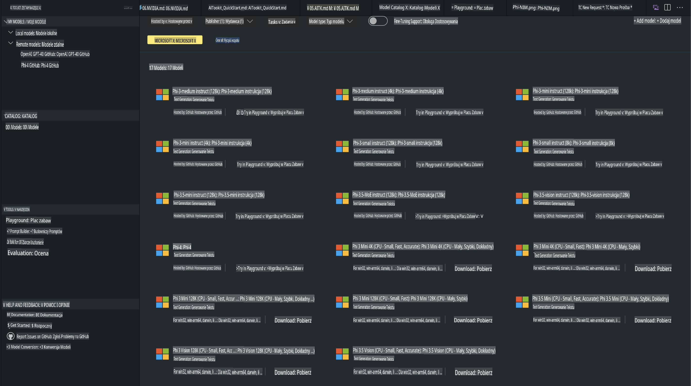
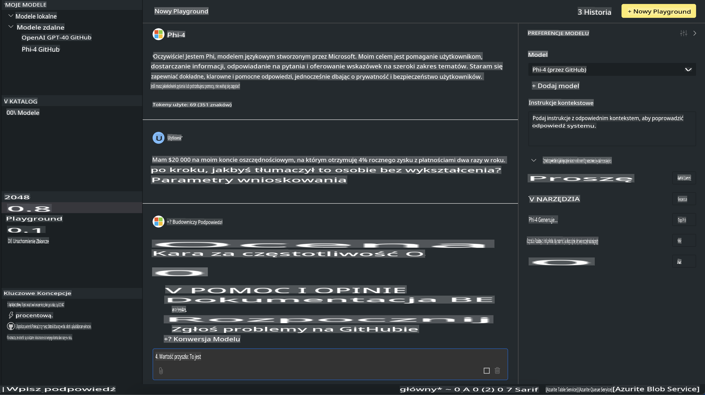

# Rodzina Phi w AITK

[AI Toolkit for VS Code](https://marketplace.visualstudio.com/items?itemName=ms-windows-ai-studio.windows-ai-studio) upraszcza tworzenie aplikacji z generatywną AI, łącząc zaawansowane narzędzia do rozwoju AI i modele z katalogu Azure AI Foundry oraz innych katalogów, takich jak Hugging Face. Możesz przeglądać katalog modeli AI zasilany przez GitHub Models i Azure AI Foundry Model Catalogs, pobierać je lokalnie lub zdalnie, dostosowywać, testować i wykorzystywać w swoich aplikacjach.

AI Toolkit Preview działa lokalnie. W przypadku lokalnych wnioskowań lub dostosowywania, w zależności od wybranego modelu, może być konieczne posiadanie GPU, takiego jak NVIDIA CUDA GPU. Możesz również uruchamiać modele GitHub bezpośrednio za pomocą AITK.

## Pierwsze kroki

[Dowiedz się więcej o instalacji systemu Windows Subsystem for Linux](https://learn.microsoft.com/windows/wsl/install?WT.mc_id=aiml-137032-kinfeylo)

oraz [zmianie domyślnej dystrybucji](https://learn.microsoft.com/windows/wsl/install#change-the-default-linux-distribution-installed).

[Repozytorium GitHub AI Toolkit](https://github.com/microsoft/vscode-ai-toolkit/)

- Windows, Linux, macOS
  
- Aby dostosowywać modele zarówno na Windows, jak i Linux, potrzebujesz GPU Nvidia. Dodatkowo, **Windows** wymaga subsystemu dla Linux z dystrybucją Ubuntu w wersji 18.4 lub nowszej. [Dowiedz się więcej o instalacji subsystemu dla Linux](https://learn.microsoft.com/windows/wsl/install) oraz [zmianie domyślnej dystrybucji](https://learn.microsoft.com/windows/wsl/install#change-the-default-linux-distribution-installed).

### Instalacja AI Toolkit

AI Toolkit jest dostarczany jako [rozszerzenie Visual Studio Code](https://code.visualstudio.com/docs/setup/additional-components#_vs-code-extensions), więc najpierw musisz zainstalować [VS Code](https://code.visualstudio.com/docs/setup/windows?WT.mc_id=aiml-137032-kinfeylo) i pobrać AI Toolkit z [VS Marketplace](https://marketplace.visualstudio.com/items?itemName=ms-windows-ai-studio.windows-ai-studio).
[AI Toolkit jest dostępny w Visual Studio Marketplace](https://marketplace.visualstudio.com/items?itemName=ms-windows-ai-studio.windows-ai-studio) i można go zainstalować jak każde inne rozszerzenie VS Code. 

Jeśli nie wiesz, jak instalować rozszerzenia w VS Code, wykonaj następujące kroki:

### Logowanie

1. W pasku aktywności w VS Code wybierz **Extensions**.
2. W polu wyszukiwania rozszerzeń wpisz "AI Toolkit".
3. Wybierz "AI Toolkit for Visual Studio Code".
4. Kliknij **Install**.

Teraz jesteś gotowy do korzystania z rozszerzenia!

Zostaniesz poproszony o zalogowanie się do GitHub. Kliknij "Allow", aby kontynuować. Zostaniesz przekierowany na stronę logowania GitHub.

Zaloguj się i postępuj zgodnie z krokami procesu. Po pomyślnym zakończeniu zostaniesz przekierowany z powrotem do VS Code.

Po zainstalowaniu rozszerzenia zobaczysz ikonę AI Toolkit w pasku aktywności.

Przejdźmy do eksploracji dostępnych działań!

### Dostępne działania

Główna strona boczna AI Toolkit jest zorganizowana w sekcje:

- **Models**
- **Resources**
- **Playground**  
- **Fine-tuning**
- **Evaluation**

Są dostępne w sekcji Resources. Aby rozpocząć, wybierz **Model Catalog**.

### Pobieranie modelu z katalogu

Po uruchomieniu AI Toolkit z paska bocznego VS Code możesz wybrać następujące opcje:



- Znajdź obsługiwany model w **Model Catalog** i pobierz lokalnie.
- Przetestuj wnioskowanie modelu w **Model Playground**.
- Dostosuj model lokalnie lub zdalnie w **Model Fine-tuning**.
- Wdróż dostosowane modele w chmurze za pomocą palety poleceń AI Toolkit.
- Oceń modele.

> [!NOTE]
>
> **GPU vs CPU**
>
> Zauważysz, że karty modeli pokazują rozmiar modelu, platformę i typ akceleratora (CPU, GPU). Dla zoptymalizowanej wydajności na **urządzeniach z Windows, które mają co najmniej jeden GPU**, wybierz wersje modeli, które są skierowane wyłącznie na Windows.
>
> To zapewnia, że masz model zoptymalizowany dla akceleratora DirectML.
>
> Nazwy modeli są w formacie:
>
> - `{model_name}-{accelerator}-{quantization}-{format}`.
>
>Aby sprawdzić, czy masz GPU na swoim urządzeniu z Windows, otwórz **Task Manager**, a następnie wybierz kartę **Performance**. Jeśli masz GPU, będą one wymienione pod nazwami takimi jak "GPU 0" lub "GPU 1".

### Uruchamianie modelu w playground

Po ustawieniu wszystkich parametrów kliknij **Generate Project**.

Gdy Twój model zostanie pobrany, wybierz **Load in Playground** na karcie modelu w katalogu:

- Rozpocznij pobieranie modelu.
- Zainstaluj wszystkie wymagania wstępne i zależności.
- Utwórz obszar roboczy VS Code.



### Korzystanie z REST API w aplikacji

AI Toolkit zawiera lokalny serwer REST API **na porcie 5272**, który korzysta z [formatu OpenAI chat completions](https://platform.openai.com/docs/api-reference/chat/create). 

To pozwala testować aplikację lokalnie bez konieczności polegania na chmurowej usłudze modelu AI. Na przykład, poniższy plik JSON pokazuje, jak skonfigurować ciało żądania:

```json
{
    "model": "Phi-4",
    "messages": [
        {
            "role": "user",
            "content": "what is the golden ratio?"
        }
    ],
    "temperature": 0.7,
    "top_p": 1,
    "top_k": 10,
    "max_tokens": 100,
    "stream": true
}
```

Możesz przetestować REST API używając (na przykład) [Postman](https://www.postman.com/) lub narzędzia CURL (Client URL):

```bash
curl -vX POST http://127.0.0.1:5272/v1/chat/completions -H 'Content-Type: application/json' -d @body.json
```

### Korzystanie z biblioteki klienta OpenAI dla Pythona

```python
from openai import OpenAI

client = OpenAI(
    base_url="http://127.0.0.1:5272/v1/", 
    api_key="x" # required for the API but not used
)

chat_completion = client.chat.completions.create(
    messages=[
        {
            "role": "user",
            "content": "what is the golden ratio?",
        }
    ],
    model="Phi-4",
)

print(chat_completion.choices[0].message.content)
```

### Korzystanie z biblioteki klienta Azure OpenAI dla .NET

Dodaj [bibliotekę klienta Azure OpenAI dla .NET](https://www.nuget.org/packages/Azure.AI.OpenAI/) do swojego projektu za pomocą NuGet:

```bash
dotnet add {project_name} package Azure.AI.OpenAI --version 1.0.0-beta.17
```

Dodaj plik C# o nazwie **OverridePolicy.cs** do swojego projektu i wklej następujący kod:

```csharp
// OverridePolicy.cs
using Azure.Core.Pipeline;
using Azure.Core;

internal partial class OverrideRequestUriPolicy(Uri overrideUri)
    : HttpPipelineSynchronousPolicy
{
    private readonly Uri _overrideUri = overrideUri;

    public override void OnSendingRequest(HttpMessage message)
    {
        message.Request.Uri.Reset(_overrideUri);
    }
}
```

Następnie wklej poniższy kod do swojego pliku **Program.cs**:

```csharp
// Program.cs
using Azure.AI.OpenAI;

Uri localhostUri = new("http://localhost:5272/v1/chat/completions");

OpenAIClientOptions clientOptions = new();
clientOptions.AddPolicy(
    new OverrideRequestUriPolicy(localhostUri),
    Azure.Core.HttpPipelinePosition.BeforeTransport);
OpenAIClient client = new(openAIApiKey: "unused", clientOptions);

ChatCompletionsOptions options = new()
{
    DeploymentName = "Phi-4",
    Messages =
    {
        new ChatRequestSystemMessage("You are a helpful assistant. Be brief and succinct."),
        new ChatRequestUserMessage("What is the golden ratio?"),
    }
};

StreamingResponse<StreamingChatCompletionsUpdate> streamingChatResponse
    = await client.GetChatCompletionsStreamingAsync(options);

await foreach (StreamingChatCompletionsUpdate chatChunk in streamingChatResponse)
{
    Console.Write(chatChunk.ContentUpdate);
}
```


## Dostosowywanie z AI Toolkit

- Zacznij od odkrywania modeli i playground.
- Dostosowywanie modeli i wnioskowanie przy użyciu lokalnych zasobów obliczeniowych.
- Zdalne dostosowywanie i wnioskowanie przy użyciu zasobów Azure.

[Dostosowywanie z AI Toolkit](../../03.FineTuning/Finetuning_VSCodeaitoolkit.md)

## Zasoby Q&A dla AI Toolkit

Zapoznaj się z naszą [stroną Q&A](https://github.com/microsoft/vscode-ai-toolkit/blob/main/archive/QA.md) dotyczącą najczęstszych problemów i ich rozwiązań.

**Zastrzeżenie**:  
Ten dokument został przetłumaczony przy użyciu usług tłumaczenia maszynowego opartego na sztucznej inteligencji. Chociaż staramy się zapewnić dokładność, prosimy pamiętać, że automatyczne tłumaczenia mogą zawierać błędy lub nieścisłości. Oryginalny dokument w jego rodzimym języku powinien być uważany za wiarygodne źródło. W przypadku informacji krytycznych zaleca się skorzystanie z profesjonalnego tłumaczenia wykonanego przez człowieka. Nie ponosimy odpowiedzialności za wszelkie nieporozumienia lub błędne interpretacje wynikające z użycia tego tłumaczenia.