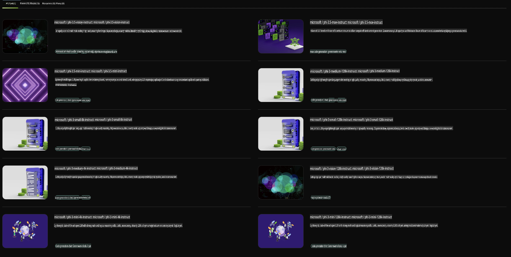

## Rodzina Phi w NVIDIA NIM

NVIDIA NIM to zestaw łatwych w użyciu mikrousług, zaprojektowanych do przyspieszenia wdrażania generatywnych modeli AI w chmurze, centrach danych i na stacjach roboczych. NIMy są kategoryzowane według rodziny modeli oraz na podstawie pojedynczych modeli. Na przykład NVIDIA NIM dla dużych modeli językowych (LLMs) dostarcza zaawansowane możliwości przetwarzania i rozumienia języka naturalnego do zastosowań biznesowych.

NIM ułatwia zespołom IT i DevOps samodzielne hostowanie dużych modeli językowych (LLMs) w ich zarządzanych środowiskach, jednocześnie zapewniając programistom standardowe API branżowe. Dzięki temu mogą oni tworzyć potężne copiloty, chatboty i asystentów AI, które mogą zrewolucjonizować ich biznes. Wykorzystując najnowsze technologie przyspieszenia GPU od NVIDIA oraz skalowalność wdrożeń, NIM oferuje najszybszą ścieżkę do wnioskowania z niezrównaną wydajnością.

Możesz użyć NVIDIA NIM do wnioskowania z modeli rodziny Phi.



### **Przykłady - Phi-3-Vision w NVIDIA NIM**

Wyobraź sobie, że masz obraz (`demo.png`) i chcesz wygenerować kod w Pythonie, który przetworzy ten obraz i zapisze jego nową wersję (`phi-3-vision.jpg`).

Powyższy kod automatyzuje ten proces poprzez:

1. Przygotowanie środowiska i niezbędnych konfiguracji.
2. Stworzenie promptu, który instruuje model do wygenerowania wymaganego kodu w Pythonie.
3. Wysłanie promptu do modelu i zebranie wygenerowanego kodu.
4. Wyodrębnienie i uruchomienie wygenerowanego kodu.
5. Wyświetlenie oryginalnego i przetworzonego obrazu.

To podejście wykorzystuje moc AI do automatyzacji zadań przetwarzania obrazów, ułatwiając i przyspieszając osiągnięcie celów.

[Przykładowe rozwiązanie kodu](../../../../../code/06.E2E/E2E_Nvidia_NIM_Phi3_Vision.ipynb)

Rozłóżmy cały kod krok po kroku:

1. **Zainstaluj wymagany pakiet**:
    ```python
    !pip install langchain_nvidia_ai_endpoints -U
    ```  
    To polecenie instaluje pakiet `langchain_nvidia_ai_endpoints`, zapewniając, że jest to najnowsza wersja.

2. **Importuj wymagane moduły**:
    ```python
    from langchain_nvidia_ai_endpoints import ChatNVIDIA
    import getpass
    import os
    import base64
    ```  
    Te importy wprowadzają niezbędne moduły do interakcji z endpointami NVIDIA AI, bezpiecznego zarządzania hasłami, interakcji z systemem operacyjnym oraz kodowania/dekodowania danych w formacie base64.

3. **Ustaw klucz API**:
    ```python
    if not os.getenv("NVIDIA_API_KEY"):
        os.environ["NVIDIA_API_KEY"] = getpass.getpass("Enter your NVIDIA API key: ")
    ```  
    Ten kod sprawdza, czy zmienna środowiskowa `NVIDIA_API_KEY` jest ustawiona. Jeśli nie, użytkownik jest proszony o bezpieczne wprowadzenie swojego klucza API.

4. **Zdefiniuj model i ścieżkę do obrazu**:
    ```python
    model = 'microsoft/phi-3-vision-128k-instruct'
    chat = ChatNVIDIA(model=model)
    img_path = './imgs/demo.png'
    ```  
    Ustawia model, który ma być użyty, tworzy instancję `ChatNVIDIA` z określonym modelem i definiuje ścieżkę do pliku obrazu.

5. **Stwórz tekstowy prompt**:
    ```python
    text = "Please create Python code for image, and use plt to save the new picture under imgs/ and name it phi-3-vision.jpg."
    ```  
    Definiuje tekstowy prompt, który instruuje model do wygenerowania kodu w Pythonie do przetwarzania obrazu.

6. **Zakoduj obraz w base64**:
    ```python
    with open(img_path, "rb") as f:
        image_b64 = base64.b64encode(f.read()).decode()
    image = f''
    ```  
    Ten kod odczytuje plik obrazu, koduje go w base64 i tworzy tag HTML obrazu z zakodowanymi danymi.

7. **Połącz tekst i obraz w prompt**:
    ```python
    prompt = f"{text} {image}"
    ```  
    Łączy tekstowy prompt i tag HTML obrazu w jeden ciąg.

8. **Wygeneruj kod za pomocą ChatNVIDIA**:
    ```python
    code = ""
    for chunk in chat.stream(prompt):
        print(chunk.content, end="")
        code += chunk.content
    ```  
    Ten kod wysyła prompt do `ChatNVIDIA` model and collects the generated code in chunks, printing and appending each chunk to the `code` string.

9. **Wyodrębnij kod Pythona z wygenerowanej zawartości**:
    ```python
    begin = code.index('```python') + 9  
    code = code[begin:]  
    end = code.index('```')
    code = code[:end]
    ```  
    Wyodrębnia rzeczywisty kod w Pythonie z wygenerowanej zawartości, usuwając formatowanie markdown.

10. **Uruchom wygenerowany kod**:
    ```python
    import subprocess
    result = subprocess.run(["python", "-c", code], capture_output=True)
    ```  
    Uruchamia wyodrębniony kod Pythona jako podproces i przechwytuje jego wynik.

11. **Wyświetl obrazy**:
    ```python
    from IPython.display import Image, display
    display(Image(filename='./imgs/phi-3-vision.jpg'))
    display(Image(filename='./imgs/demo.png'))
    ```  
    Te linie wyświetlają obrazy za pomocą modułu `IPython.display`.

**Zastrzeżenie**:  
Ten dokument został przetłumaczony za pomocą usług tłumaczeniowych opartych na sztucznej inteligencji. Chociaż dokładamy wszelkich starań, aby tłumaczenie było dokładne, prosimy pamiętać, że automatyczne tłumaczenia mogą zawierać błędy lub nieścisłości. Oryginalny dokument w jego rodzimym języku powinien być uznawany za wiarygodne źródło. W przypadku istotnych informacji zaleca się skorzystanie z profesjonalnego tłumaczenia wykonanego przez człowieka. Nie ponosimy odpowiedzialności za jakiekolwiek nieporozumienia lub błędne interpretacje wynikające z użycia tego tłumaczenia.