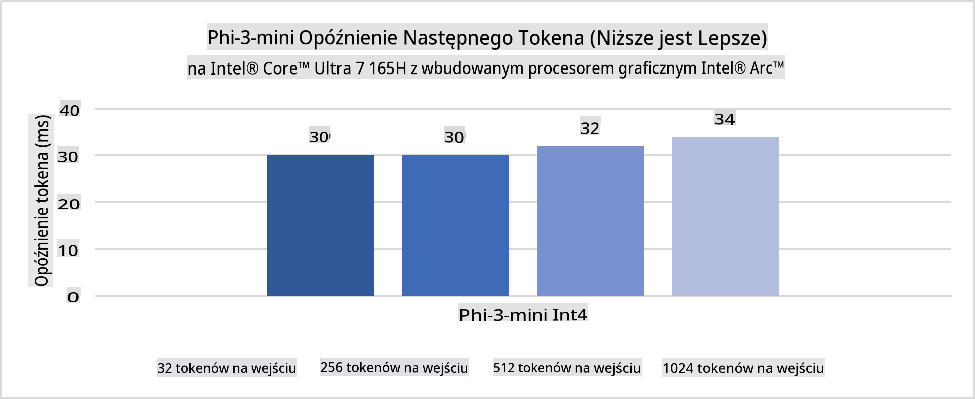
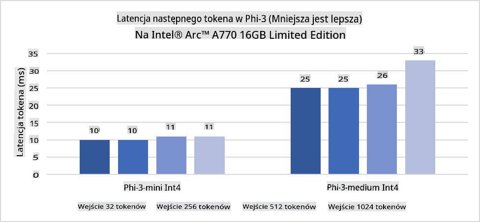
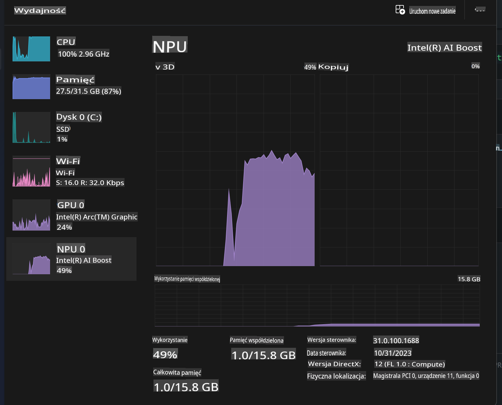
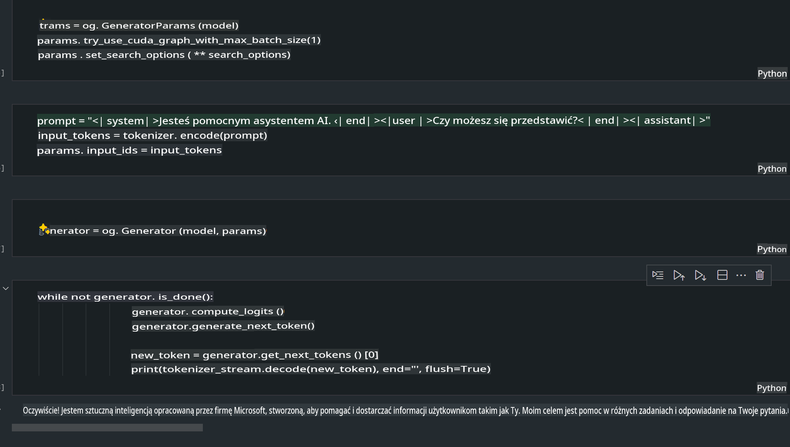
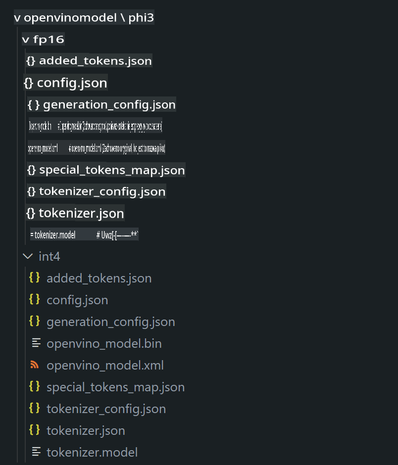
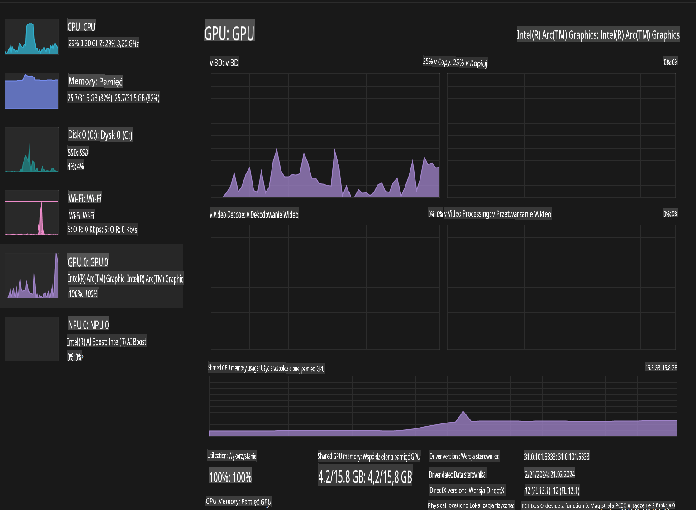

# **Inference Phi-3 w AI PC**

Wraz z postępem w generatywnej AI oraz poprawą możliwości sprzętowych urządzeń brzegowych, coraz więcej modeli generatywnej AI można teraz integrować z urządzeniami użytkowników w ramach Bring Your Own Device (BYOD). AI PC to jedno z takich rozwiązań. Od 2024 roku Intel, AMD i Qualcomm współpracują z producentami komputerów, aby wprowadzać AI PC, które umożliwiają wdrażanie lokalnych modeli generatywnej AI dzięki modyfikacjom sprzętowym. W tej dyskusji skupimy się na AI PC Intela i omówimy, jak wdrożyć Phi-3 na AI PC Intela.

### Czym jest NPU?

NPU (Neural Processing Unit) to dedykowany procesor lub jednostka przetwarzająca w większym układzie SoC, zaprojektowana specjalnie do przyspieszania operacji na sieciach neuronowych i zadań związanych z AI. W przeciwieństwie do uniwersalnych CPU i GPU, NPU są zoptymalizowane do równoległego przetwarzania danych, co czyni je niezwykle wydajnymi w obsłudze ogromnych ilości danych multimedialnych, takich jak wideo czy obrazy, a także w przetwarzaniu danych dla sieci neuronowych. Są szczególnie skuteczne w zadaniach związanych z AI, takich jak rozpoznawanie mowy, rozmywanie tła podczas rozmów wideo czy edycja zdjęć i wideo, np. wykrywanie obiektów.

## NPU vs GPU

Chociaż wiele obciążeń związanych z AI i uczeniem maszynowym działa na GPU, istnieje istotna różnica między GPU a NPU.  
GPU są znane ze swoich możliwości przetwarzania równoległego, ale nie wszystkie GPU są równie wydajne poza grafiką. NPU, z kolei, są zaprojektowane specjalnie do skomplikowanych obliczeń związanych z operacjami na sieciach neuronowych, dzięki czemu są niezwykle efektywne w zadaniach związanych z AI.

Podsumowując, NPU to matematyczne geniusze, które przyspieszają obliczenia AI i odgrywają kluczową rolę w nadchodzącej erze AI PC!

***Przykład oparty jest na najnowszym procesorze Intel Core Ultra.***

## **1. Użycie NPU do uruchomienia modelu Phi-3**

Urządzenie Intel® NPU to akcelerator inferencji AI zintegrowany z procesorami klienckimi Intela, począwszy od generacji Intel® Core™ Ultra (wcześniej znanej jako Meteor Lake). Umożliwia ono energooszczędne wykonywanie zadań sztucznych sieci neuronowych.





**Biblioteka Intel NPU Acceleration Library**

Biblioteka Intel NPU Acceleration Library [https://github.com/intel/intel-npu-acceleration-library](https://github.com/intel/intel-npu-acceleration-library) to biblioteka w Pythonie zaprojektowana w celu zwiększenia efektywności aplikacji poprzez wykorzystanie mocy Intel Neural Processing Unit (NPU) do wykonywania szybkich obliczeń na kompatybilnym sprzęcie.

Przykład Phi-3-mini na AI PC zasilanym procesorami Intel® Core™ Ultra.


Instalacja biblioteki Python za pomocą pip

```bash

   pip install intel-npu-acceleration-library

```

***Uwaga*** Projekt jest nadal w fazie rozwoju, ale model referencyjny jest już bardzo kompletny.

### **Uruchamianie Phi-3 z Intel NPU Acceleration Library**

Korzystając z akceleracji Intel NPU, biblioteka ta nie wpływa na tradycyjny proces kodowania. Wystarczy użyć tej biblioteki do kwantyzacji oryginalnego modelu Phi-3, np. FP16, INT8, INT4, takich jak:

```python
from transformers import AutoTokenizer, pipeline,TextStreamer
from intel_npu_acceleration_library import NPUModelForCausalLM, int4
from intel_npu_acceleration_library.compiler import CompilerConfig
import warnings

model_id = "microsoft/Phi-3-mini-4k-instruct"

compiler_conf = CompilerConfig(dtype=int4)
model = NPUModelForCausalLM.from_pretrained(
    model_id, use_cache=True, config=compiler_conf, attn_implementation="sdpa"
).eval()

tokenizer = AutoTokenizer.from_pretrained(model_id)

text_streamer = TextStreamer(tokenizer, skip_prompt=True)
```

Po pomyślnej kwantyzacji kontynuuj wykonanie, aby wywołać NPU do uruchomienia modelu Phi-3.

```python
generation_args = {
   "max_new_tokens": 1024,
   "return_full_text": False,
   "temperature": 0.3,
   "do_sample": False,
   "streamer": text_streamer,
}

pipe = pipeline(
   "text-generation",
   model=model,
   tokenizer=tokenizer,
)

query = "<|system|>You are a helpful AI assistant.<|end|><|user|>Can you introduce yourself?<|end|><|assistant|>"

with warnings.catch_warnings():
    warnings.simplefilter("ignore")
    pipe(query, **generation_args)
```

Podczas wykonywania kodu możemy sprawdzić stan działania NPU za pomocą Menedżera zadań.



***Przykłady***: [AIPC_NPU_DEMO.ipynb](../../../../../code/03.Inference/AIPC/AIPC_NPU_DEMO.ipynb)

## **2. Użycie DirectML + ONNX Runtime do uruchomienia modelu Phi-3**

### **Czym jest DirectML**

[DirectML](https://github.com/microsoft/DirectML) to biblioteka DirectX 12 o wysokiej wydajności, przyspieszająca zadania uczenia maszynowego. DirectML zapewnia akcelerację GPU dla typowych zadań uczenia maszynowego na szerokiej gamie obsługiwanego sprzętu i sterowników, w tym wszystkich GPU kompatybilnych z DirectX 12 od takich producentów jak AMD, Intel, NVIDIA i Qualcomm.

Używana samodzielnie, API DirectML to niskopoziomowa biblioteka DirectX 12, odpowiednia dla aplikacji o wysokiej wydajności i niskim opóźnieniu, takich jak frameworki, gry i inne aplikacje w czasie rzeczywistym. Bezproblemowa współpraca DirectML z Direct3D 12, a także jej niskie opóźnienia i zgodność na różnych urządzeniach sprzętowych, czynią DirectML idealnym do przyspieszania uczenia maszynowego tam, gdzie pożądana jest wysoka wydajność, a niezawodność i przewidywalność wyników są kluczowe.

***Uwaga***: Najnowsza wersja DirectML już obsługuje NPU (https://devblogs.microsoft.com/directx/introducing-neural-processor-unit-npu-support-in-directml-developer-preview/)

### DirectML i CUDA w kontekście ich możliwości i wydajności:

**DirectML** to biblioteka uczenia maszynowego opracowana przez Microsoft. Została zaprojektowana do przyspieszania zadań uczenia maszynowego na urządzeniach z systemem Windows, takich jak komputery stacjonarne, laptopy i urządzenia brzegowe.  
- Oparty na DX12: DirectML działa na bazie DirectX 12 (DX12), co zapewnia szerokie wsparcie sprzętowe na GPU, w tym NVIDIA i AMD.  
- Szersze wsparcie: Dzięki DX12, DirectML może działać na dowolnym GPU obsługującym DX12, nawet na zintegrowanych GPU.  
- Przetwarzanie obrazów: DirectML przetwarza obrazy i inne dane przy użyciu sieci neuronowych, co czyni go odpowiednim do takich zadań jak rozpoznawanie obrazów, wykrywanie obiektów i inne.  
- Łatwość konfiguracji: Konfiguracja DirectML jest prosta i nie wymaga specyficznych SDK ani bibliotek od producentów GPU.  
- Wydajność: W niektórych przypadkach DirectML działa dobrze i może być szybszy niż CUDA, szczególnie dla określonych obciążeń.  
- Ograniczenia: Istnieją jednak przypadki, w których DirectML może być wolniejszy, zwłaszcza dla dużych partii danych float16.  

**CUDA** to platforma obliczeń równoległych i model programowania opracowany przez NVIDIA. Pozwala deweloperom wykorzystać moc GPU NVIDIA do obliczeń ogólnego przeznaczenia, w tym uczenia maszynowego i symulacji naukowych.  
- Specyficzne dla NVIDIA: CUDA jest ściśle zintegrowana z GPU NVIDIA i zaprojektowana specjalnie dla nich.  
- Wysoce zoptymalizowana: Zapewnia doskonałą wydajność dla zadań przyspieszanych przez GPU, szczególnie na GPU NVIDIA.  
- Powszechnie stosowana: Wiele frameworków i bibliotek uczenia maszynowego (takich jak TensorFlow i PyTorch) obsługuje CUDA.  
- Personalizacja: Programiści mogą dostosowywać ustawienia CUDA do konkretnych zadań, co pozwala na osiągnięcie optymalnej wydajności.  
- Ograniczenia: Jednak zależność CUDA od sprzętu NVIDIA może być ograniczeniem, jeśli potrzebujesz szerszej kompatybilności z różnymi GPU.  

### Wybór między DirectML a CUDA

Wybór między DirectML a CUDA zależy od konkretnego przypadku użycia, dostępności sprzętu i preferencji.  
Jeśli zależy Ci na szerszej kompatybilności i łatwości konfiguracji, DirectML może być dobrym wyborem. Jeśli jednak masz GPU NVIDIA i potrzebujesz wysoce zoptymalizowanej wydajności, CUDA pozostaje silnym kandydatem. Podsumowując, oba rozwiązania mają swoje mocne i słabe strony, dlatego przy wyborze warto wziąć pod uwagę swoje wymagania i dostępny sprzęt.

### **Generatywna AI z ONNX Runtime**

W erze AI przenośność modeli AI jest niezwykle istotna. ONNX Runtime umożliwia łatwe wdrażanie wytrenowanych modeli na różnych urządzeniach. Programiści nie muszą skupiać się na frameworku inferencji, wystarczy jednolite API do wykonania inferencji modelu. W erze generatywnej AI, ONNX Runtime przeszedł również optymalizację kodu (https://onnxruntime.ai/docs/genai/). Dzięki zoptymalizowanemu ONNX Runtime, skwantyzowany model generatywnej AI może być wykonywany na różnych urządzeniach. W Generatywnej AI z ONNX Runtime, można wykonywać inferencję modelu AI za pomocą API w Pythonie, C#, C/C++. Oczywiście, wdrożenie na iPhone może wykorzystać API Generative AI z ONNX Runtime w C++.

[Przykładowy kod](https://github.com/Azure-Samples/Phi-3MiniSamples/tree/main/onnx)

***Kompilacja generatywnej AI z biblioteką ONNX Runtime***

```bash

winget install --id=Kitware.CMake  -e

git clone https://github.com/microsoft/onnxruntime.git

cd .\onnxruntime\

./build.bat --build_shared_lib --skip_tests --parallel --use_dml --config Release

cd ../

git clone https://github.com/microsoft/onnxruntime-genai.git

cd .\onnxruntime-genai\

mkdir ort

cd ort

mkdir include

mkdir lib

copy ..\onnxruntime\include\onnxruntime\core\providers\dml\dml_provider_factory.h ort\include

copy ..\onnxruntime\include\onnxruntime\core\session\onnxruntime_c_api.h ort\include

copy ..\onnxruntime\build\Windows\Release\Release\*.dll ort\lib

copy ..\onnxruntime\build\Windows\Release\Release\onnxruntime.lib ort\lib

python build.py --use_dml


```

**Instalacja biblioteki**

```bash

pip install .\onnxruntime_genai_directml-0.3.0.dev0-cp310-cp310-win_amd64.whl

```

To wynik działania.



***Przykłady***: [AIPC_DirectML_DEMO.ipynb](../../../../../code/03.Inference/AIPC/AIPC_DirectML_DEMO.ipynb)

## **3. Użycie Intel OpenVino do uruchomienia modelu Phi-3**

### **Czym jest OpenVINO**

[OpenVINO](https://github.com/openvinotoolkit/openvino) to otwartoźródłowy zestaw narzędzi do optymalizacji i wdrażania modeli głębokiego uczenia. Zapewnia zwiększoną wydajność głębokiego uczenia dla modeli wizji, audio i języka z popularnych frameworków, takich jak TensorFlow, PyTorch i inne. Rozpocznij pracę z OpenVINO. OpenVINO może być również używany w połączeniu z CPU i GPU do uruchamiania modelu Phi-3.

***Uwaga***: Obecnie OpenVINO nie obsługuje NPU.

### **Instalacja biblioteki OpenVINO**

```bash

 pip install git+https://github.com/huggingface/optimum-intel.git

 pip install git+https://github.com/openvinotoolkit/nncf.git

 pip install openvino-nightly

```

### **Uruchamianie Phi-3 z OpenVINO**

Podobnie jak w przypadku NPU, OpenVINO realizuje wywołanie modeli generatywnej AI poprzez uruchamianie modeli skwantyzowanych. Najpierw należy skwantyzować model Phi-3 i wykonać kwantyzację modelu w wierszu poleceń za pomocą optimum-cli.

**INT4**

```bash

optimum-cli export openvino --model "microsoft/Phi-3-mini-4k-instruct" --task text-generation-with-past --weight-format int4 --group-size 128 --ratio 0.6  --sym  --trust-remote-code ./openvinomodel/phi3/int4

```

**FP16**

```bash

optimum-cli export openvino --model "microsoft/Phi-3-mini-4k-instruct" --task text-generation-with-past --weight-format fp16 --trust-remote-code ./openvinomodel/phi3/fp16

```

Przekonwertowany format wygląda tak:



Załaduj ścieżki modeli (model_dir), powiązane konfiguracje (ov_config = {"PERFORMANCE_HINT": "LATENCY", "NUM_STREAMS": "1", "CACHE_DIR": ""}) oraz urządzenia przyspieszone sprzętowo (GPU.0) przez OVModelForCausalLM.

```python

ov_model = OVModelForCausalLM.from_pretrained(
     model_dir,
     device='GPU.0',
     ov_config=ov_config,
     config=AutoConfig.from_pretrained(model_dir, trust_remote_code=True),
     trust_remote_code=True,
)

```

Podczas wykonywania kodu możemy sprawdzić stan działania GPU za pomocą Menedżera zadań.



***Przykłady***: [AIPC_OpenVino_Demo.ipynb](../../../../../code/03.Inference/AIPC/AIPC_OpenVino_Demo.ipynb)

### ***Uwaga***: Powyższe trzy metody mają swoje własne zalety, ale zaleca się użycie akceleracji NPU do inferencji AI PC.

**Zastrzeżenie**:  
Ten dokument został przetłumaczony za pomocą usług tłumaczenia maszynowego opartego na sztucznej inteligencji. Chociaż dokładamy wszelkich starań, aby tłumaczenie było precyzyjne, prosimy mieć na uwadze, że tłumaczenia automatyczne mogą zawierać błędy lub nieścisłości. Oryginalny dokument w jego rodzimym języku powinien być uznawany za wiarygodne źródło. W przypadku informacji krytycznych zaleca się skorzystanie z profesjonalnego tłumaczenia przez człowieka. Nie ponosimy odpowiedzialności za jakiekolwiek nieporozumienia lub błędne interpretacje wynikające z korzystania z tego tłumaczenia.