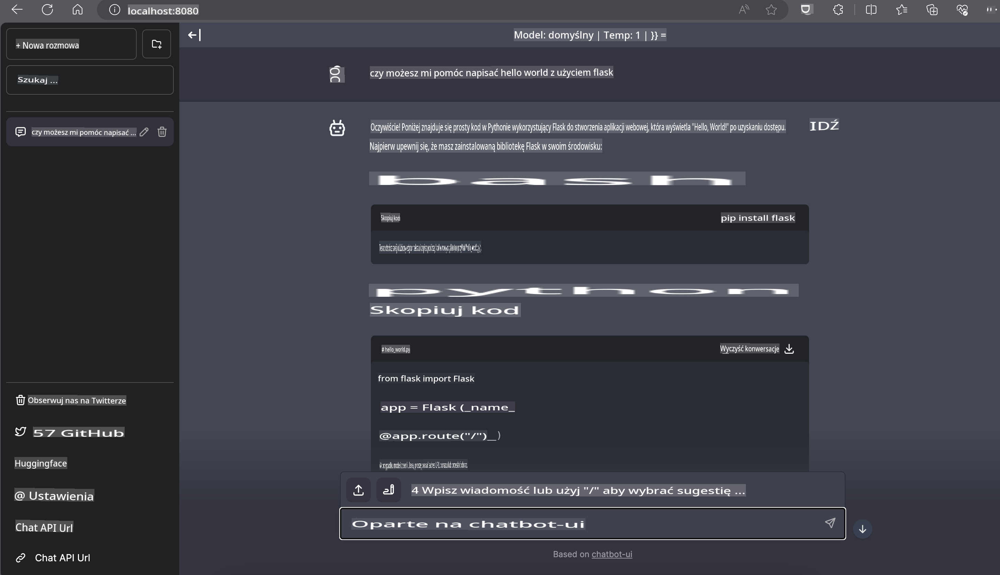

# **Wnioskowanie Phi-3 na Nvidia Jetson**

Nvidia Jetson to seria wbudowanych płyt komputerowych od Nvidia. Modele Jetson TK1, TX1 i TX2 wyposażone są w procesor Tegra (lub SoC) od Nvidia, który integruje jednostkę centralną (CPU) opartą na architekturze ARM. Jetson to system o niskim poborze mocy, zaprojektowany do przyspieszania aplikacji związanych z uczeniem maszynowym. Nvidia Jetson jest wykorzystywany przez profesjonalnych programistów do tworzenia przełomowych produktów AI w różnych branżach oraz przez studentów i entuzjastów do nauki AI w praktyce i realizacji niesamowitych projektów. SLM jest wdrażany w urządzeniach brzegowych, takich jak Jetson, co umożliwia lepsze zastosowanie przemysłowych scenariuszy generatywnej AI.

## Wdrożenie na NVIDIA Jetson:
Programiści pracujący nad autonomiczną robotyką i urządzeniami wbudowanymi mogą wykorzystać Phi-3 Mini. Relatywnie niewielki rozmiar Phi-3 sprawia, że idealnie nadaje się do wdrożeń brzegowych. Parametry zostały starannie dostrojone podczas treningu, co zapewnia wysoką dokładność odpowiedzi.

### Optymalizacja TensorRT-LLM:
Biblioteka [TensorRT-LLM firmy NVIDIA](https://github.com/NVIDIA/TensorRT-LLM?WT.mc_id=aiml-138114-kinfeylo) optymalizuje wnioskowanie dużych modeli językowych. Wspiera długie okno kontekstowe Phi-3 Mini, poprawiając zarówno przepustowość, jak i opóźnienia. Optymalizacje obejmują techniki takie jak LongRoPE, FP8 i batching w locie.

### Dostępność i wdrożenie:
Programiści mogą zapoznać się z Phi-3 Mini z 128K oknem kontekstowym na stronie [NVIDIA's AI](https://www.nvidia.com/en-us/ai-data-science/generative-ai/). Jest dostępny w postaci NVIDIA NIM, mikrousługi z ustandaryzowanym API, którą można wdrożyć wszędzie. Dodatkowo, [implementacje TensorRT-LLM na GitHub](https://github.com/NVIDIA/TensorRT-LLM).

## **1. Przygotowanie**

a. Jetson Orin NX / Jetson NX

b. JetPack 5.1.2+
   
c. Cuda 11.8
   
d. Python 3.8+

## **2. Uruchamianie Phi-3 na Jetson**

Możemy wybrać [Ollama](https://ollama.com) lub [LlamaEdge](https://llamaedge.com)

Jeśli chcesz używać gguf zarówno w chmurze, jak i na urządzeniach brzegowych, LlamaEdge można zrozumieć jako WasmEdge (WasmEdge to lekki, wydajny i skalowalny runtime WebAssembly, odpowiedni dla aplikacji chmurowych, brzegowych i zdecentralizowanych. Obsługuje aplikacje serverless, funkcje wbudowane, mikrousługi, smart kontrakty i urządzenia IoT). Możesz wdrożyć ilościowy model gguf na urządzeniach brzegowych i w chmurze za pomocą LlamaEdge.


Oto kroki do użycia:

1. Zainstaluj i pobierz odpowiednie biblioteki oraz pliki

```bash

curl -sSf https://raw.githubusercontent.com/WasmEdge/WasmEdge/master/utils/install.sh | bash -s -- --plugin wasi_nn-ggml

curl -LO https://github.com/LlamaEdge/LlamaEdge/releases/latest/download/llama-api-server.wasm

curl -LO https://github.com/LlamaEdge/chatbot-ui/releases/latest/download/chatbot-ui.tar.gz

tar xzf chatbot-ui.tar.gz

```

**Uwaga**: pliki llama-api-server.wasm i chatbot-ui muszą znajdować się w tym samym katalogu.

2. Uruchom skrypty w terminalu

```bash

wasmedge --dir .:. --nn-preload default:GGML:AUTO:{Your gguf path} llama-api-server.wasm -p phi-3-chat

```

Oto wynik działania:



***Przykładowy kod*** [Phi-3 mini WASM Notebook Sample](https://github.com/Azure-Samples/Phi-3MiniSamples/tree/main/wasm)

Podsumowując, Phi-3 Mini stanowi znaczący krok naprzód w modelowaniu językowym, łącząc wydajność, świadomość kontekstową oraz zaawansowaną optymalizację NVIDIA. Niezależnie od tego, czy budujesz roboty, czy aplikacje brzegowe, Phi-3 Mini to potężne narzędzie, które warto znać.

**Zastrzeżenie**:  
Niniejszy dokument został przetłumaczony za pomocą usług tłumaczenia opartego na sztucznej inteligencji. Chociaż staramy się zapewnić dokładność, prosimy pamiętać, że automatyczne tłumaczenia mogą zawierać błędy lub nieścisłości. Oryginalny dokument w jego rodzimym języku powinien być uważany za wiarygodne źródło. W przypadku informacji krytycznych zalecane jest skorzystanie z profesjonalnego tłumaczenia wykonanego przez człowieka. Nie ponosimy odpowiedzialności za jakiekolwiek nieporozumienia lub błędne interpretacje wynikające z użycia tego tłumaczenia.