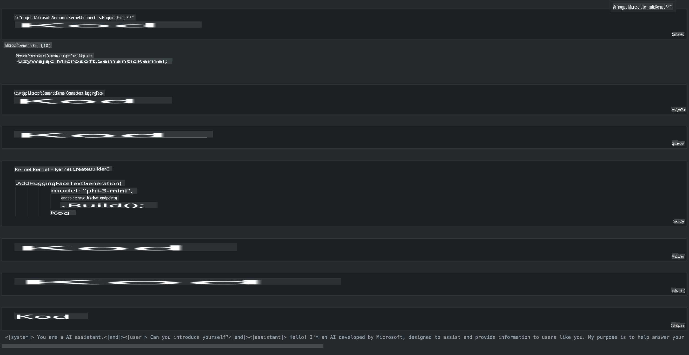

# **Uruchamianie Phi-3 na Lokalnym Serwerze**

Możemy wdrożyć Phi-3 na lokalnym serwerze. Użytkownicy mogą wybrać rozwiązania [Ollama](https://ollama.com) lub [LM Studio](https://llamaedge.com), albo napisać własny kod. Usługi lokalne Phi-3 można połączyć za pomocą [Semantic Kernel](https://github.com/microsoft/semantic-kernel?WT.mc_id=aiml-138114-kinfeylo) lub [Langchain](https://www.langchain.com/), aby tworzyć aplikacje Copilot.

## **Korzystanie z Semantic Kernel do uzyskania dostępu do Phi-3-mini**

W aplikacjach Copilot tworzymy aplikacje za pomocą Semantic Kernel / LangChain. Tego typu framework aplikacji jest zazwyczaj kompatybilny z Azure OpenAI Service / modelami OpenAI, a także może obsługiwać modele open source na Hugging Face oraz modele lokalne. Co zrobić, jeśli chcemy użyć Semantic Kernel, aby uzyskać dostęp do Phi-3-mini? Na przykładzie .NET możemy połączyć go z Hugging Face Connector w Semantic Kernel. Domyślnie odpowiada on identyfikatorowi modelu na Hugging Face (przy pierwszym użyciu model zostanie pobrany z Hugging Face, co może zająć dużo czasu). Można również połączyć się z uruchomioną lokalną usługą. W porównaniu z tymi dwoma opcjami zalecamy użycie tej drugiej, ponieważ zapewnia większą autonomię, szczególnie w aplikacjach korporacyjnych.

Na powyższym obrazku widać, że dostęp do usług lokalnych za pośrednictwem Semantic Kernel pozwala łatwo połączyć się z własnym serwerem modelu Phi-3-mini. Oto wynik działania:

***Przykładowy Kod*** https://github.com/kinfey/Phi3MiniSamples/tree/main/semantickernel

**Zastrzeżenie**:  
Ten dokument został przetłumaczony przy użyciu usług automatycznego tłumaczenia AI. Chociaż staramy się zapewnić dokładność, prosimy pamiętać, że automatyczne tłumaczenia mogą zawierać błędy lub nieścisłości. Oryginalny dokument w jego oryginalnym języku powinien być uznawany za wiążące źródło. W przypadku informacji krytycznych zaleca się skorzystanie z profesjonalnego tłumaczenia wykonanego przez człowieka. Nie ponosimy odpowiedzialności za jakiekolwiek nieporozumienia lub błędne interpretacje wynikające z korzystania z tego tłumaczenia.