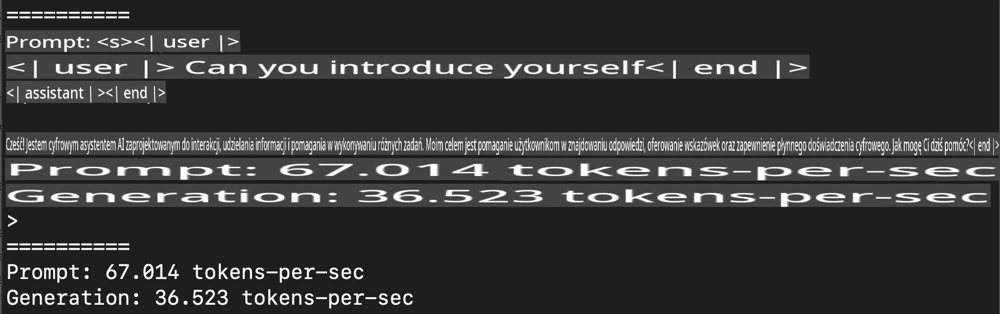
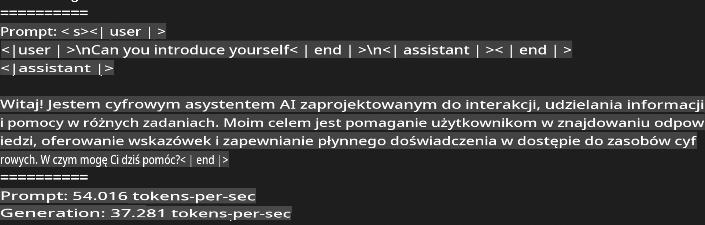
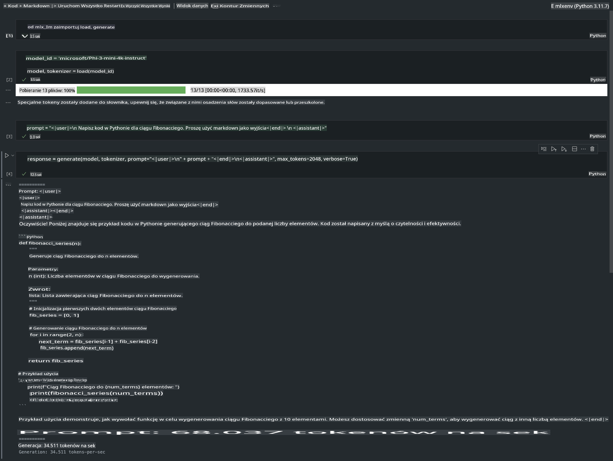

# **Inference Phi-3 z użyciem Apple MLX Framework**

## **Czym jest MLX Framework**

MLX to framework tablicowy do badań nad uczeniem maszynowym na układach Apple Silicon, stworzony przez zespół badań nad uczeniem maszynowym Apple.

MLX został zaprojektowany przez badaczy uczenia maszynowego dla badaczy uczenia maszynowego. Framework ma być przyjazny dla użytkownika, a jednocześnie wydajny w trenowaniu i wdrażaniu modeli. Sama konstrukcja frameworka jest również koncepcyjnie prosta. Naszym celem jest ułatwienie badaczom rozszerzania i ulepszania MLX, aby szybko eksplorować nowe pomysły.

LLM mogą być przyspieszane na urządzeniach Apple Silicon dzięki MLX, a modele można uruchamiać lokalnie w bardzo wygodny sposób.

## **Używanie MLX do inferencji Phi-3-mini**

### **1. Przygotowanie środowiska MLX**

1. Python 3.11.x  
2. Instalacja biblioteki MLX  

```bash

pip install mlx-lm

```

### **2. Uruchamianie Phi-3-mini w terminalu za pomocą MLX**

```bash

python -m mlx_lm.generate --model microsoft/Phi-3-mini-4k-instruct --max-token 2048 --prompt  "<|user|>\nCan you introduce yourself<|end|>\n<|assistant|>"

```

Wynik (moje środowisko to Apple M1 Max, 64 GB RAM) wygląda następująco:



### **3. Kwantyzacja Phi-3-mini za pomocą MLX w terminalu**

```bash

python -m mlx_lm.convert --hf-path microsoft/Phi-3-mini-4k-instruct

```

***Uwaga:*** Model może zostać skwantyzowany za pomocą mlx_lm.convert, a domyślną kwantyzacją jest INT4. W tym przykładzie Phi-3-mini jest kwantyzowany do INT4.

Model może zostać skwantyzowany za pomocą mlx_lm.convert, a domyślną kwantyzacją jest INT4. W tym przykładzie Phi-3-mini jest kwantyzowany do INT4. Po kwantyzacji model zostanie zapisany w domyślnym katalogu ./mlx_model.

Możemy przetestować model skwantyzowany za pomocą MLX z terminala:

```bash

python -m mlx_lm.generate --model ./mlx_model/ --max-token 2048 --prompt  "<|user|>\nCan you introduce yourself<|end|>\n<|assistant|>"

```

Wynik wygląda następująco:



### **4. Uruchamianie Phi-3-mini za pomocą MLX w Jupyter Notebook**



***Uwaga:*** Proszę zapoznać się z tym przykładem [klikając ten link](../../../../../code/03.Inference/MLX/MLX_DEMO.ipynb)

## **Zasoby**

1. Dowiedz się więcej o Apple MLX Framework [https://ml-explore.github.io](https://ml-explore.github.io/mlx/build/html/index.html)

2. Repozytorium Apple MLX na GitHubie [https://github.com/ml-explore](https://github.com/ml-explore)

**Zastrzeżenie**:  
Ten dokument został przetłumaczony przy użyciu usług tłumaczenia maszynowego opartego na sztucznej inteligencji. Chociaż staramy się zapewnić dokładność, prosimy pamiętać, że automatyczne tłumaczenia mogą zawierać błędy lub nieścisłości. Oryginalny dokument w jego rodzimym języku powinien być uznawany za wiarygodne źródło. W przypadku informacji krytycznych zaleca się skorzystanie z profesjonalnego tłumaczenia wykonanego przez człowieka. Nie ponosimy odpowiedzialności za jakiekolwiek nieporozumienia lub błędne interpretacje wynikające z korzystania z tego tłumaczenia.