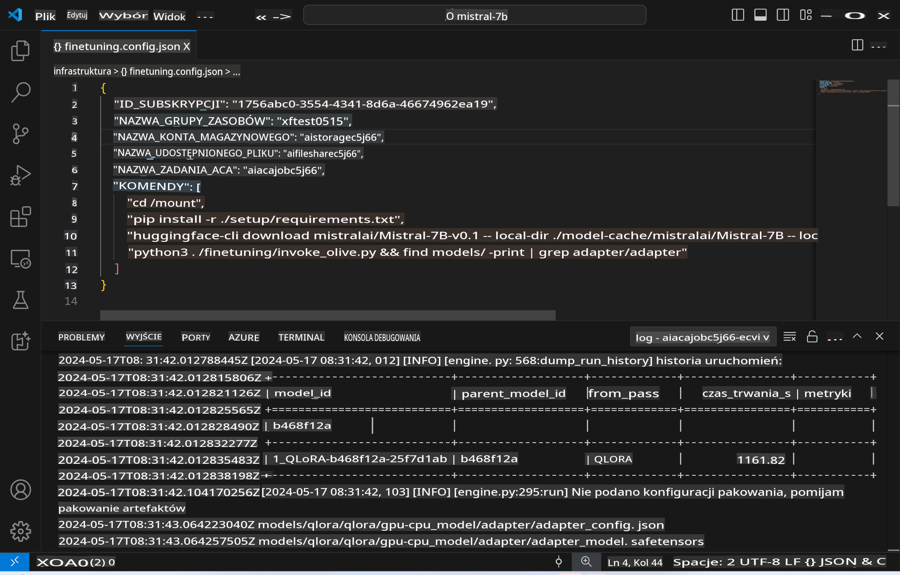
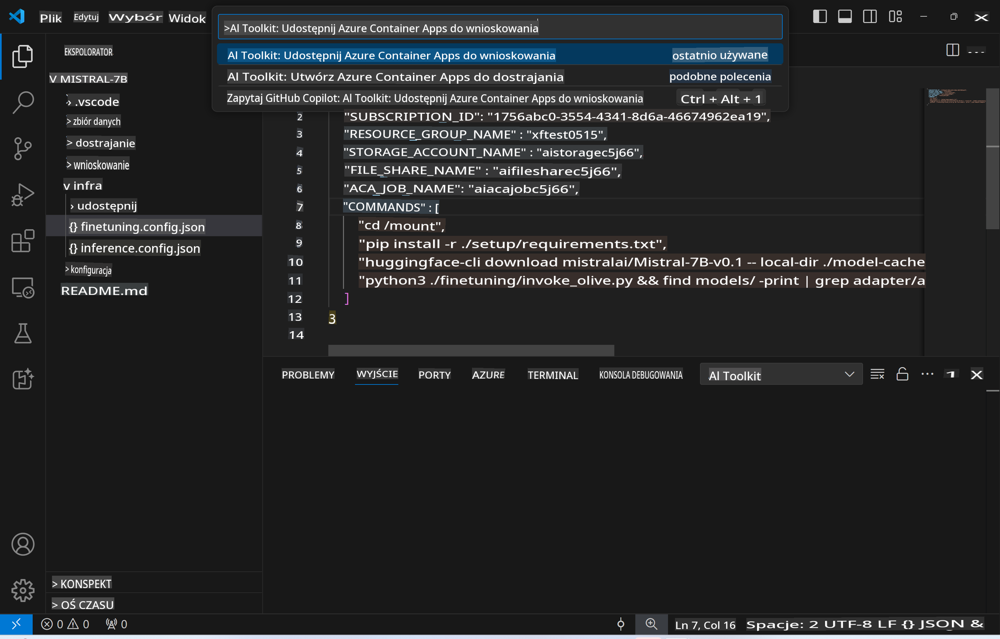
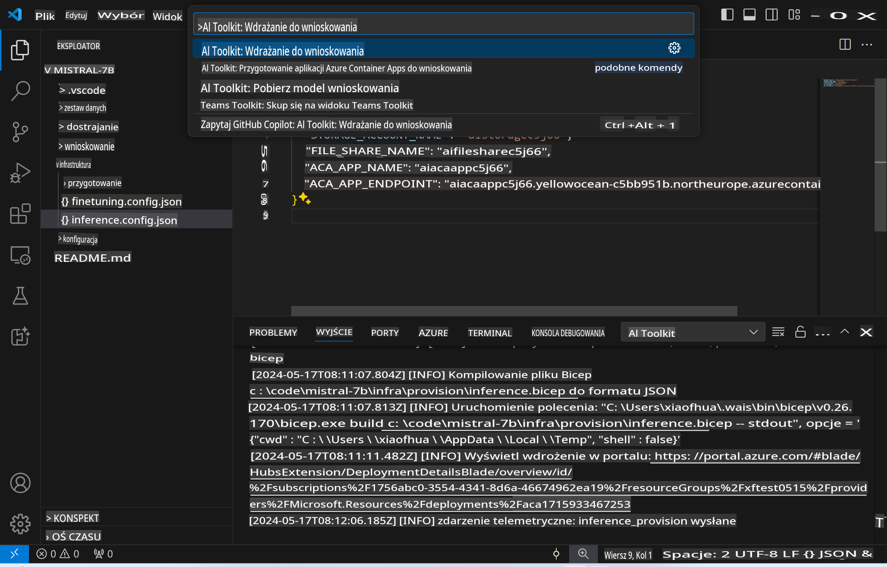
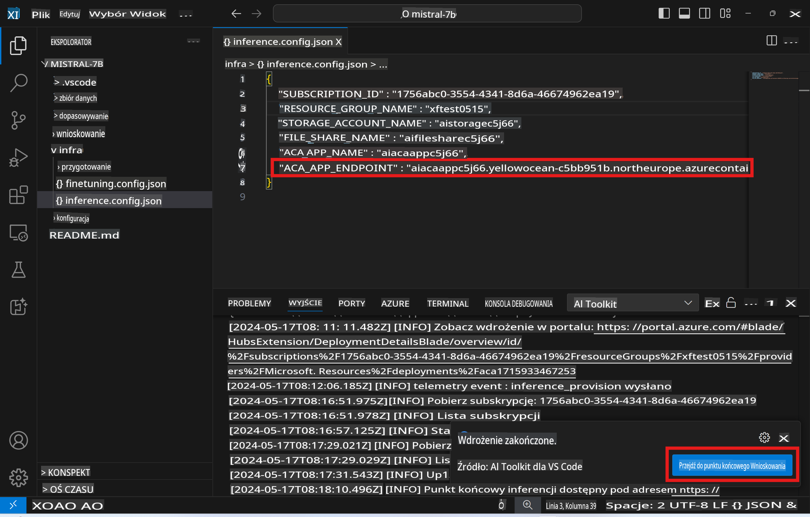

# Zdalne wnioskowanie z dostosowanym modelem

Po przeszkoleniu adapterów w środowisku zdalnym, możesz użyć prostej aplikacji Gradio, aby wchodzić w interakcję z modelem.



### Przygotowanie zasobów Azure
Musisz skonfigurować zasoby Azure do zdalnego wnioskowania, wykonując `AI Toolkit: Provision Azure Container Apps for inference` z palety poleceń. Podczas tej konfiguracji zostaniesz poproszony o wybranie swojej subskrypcji Azure oraz grupy zasobów.  


Domyślnie subskrypcja i grupa zasobów dla wnioskowania powinny być takie same, jak te użyte do dostrajania. Wnioskowanie będzie korzystać z tego samego środowiska Azure Container App oraz uzyskiwać dostęp do modelu i adaptera modelu przechowywanego w Azure Files, które zostały wygenerowane podczas etapu dostrajania.

## Korzystanie z AI Toolkit

### Wdrożenie do wnioskowania
Jeśli chcesz zmodyfikować kod wnioskowania lub ponownie załadować model wnioskowania, wykonaj polecenie `AI Toolkit: Deploy for inference`. Spowoduje to zsynchronizowanie najnowszego kodu z ACA i ponowne uruchomienie repliki.



Po pomyślnym zakończeniu wdrożenia model jest gotowy do oceny przy użyciu tego punktu końcowego.

### Dostęp do API wnioskowania

Możesz uzyskać dostęp do API wnioskowania, klikając przycisk "*Go to Inference Endpoint*" wyświetlany w powiadomieniu VSCode. Alternatywnie, punkt końcowy API sieciowego można znaleźć pod `ACA_APP_ENDPOINT` w `./infra/inference.config.json` oraz w panelu wyjściowym.



> **Uwaga:** Punkt końcowy wnioskowania może potrzebować kilku minut, aby stać się w pełni operacyjny.

## Komponenty wnioskowania zawarte w szablonie

| Folder | Zawartość |
| ------ |--------- |
| `infra` | Zawiera wszystkie niezbędne konfiguracje do operacji zdalnych. |
| `infra/provision/inference.parameters.json` | Zawiera parametry dla szablonów bicep, używanych do tworzenia zasobów Azure na potrzeby wnioskowania. |
| `infra/provision/inference.bicep` | Zawiera szablony do tworzenia zasobów Azure na potrzeby wnioskowania. |
| `infra/inference.config.json` | Plik konfiguracyjny, generowany przez polecenie `AI Toolkit: Provision Azure Container Apps for inference`. Jest używany jako dane wejściowe dla innych zdalnych palet poleceń. |

### Korzystanie z AI Toolkit do konfiguracji tworzenia zasobów Azure
Skonfiguruj [AI Toolkit](https://marketplace.visualstudio.com/items?itemName=ms-windows-ai-studio.windows-ai-studio)

Przygotuj Azure Container Apps dla wnioskowania` command.

You can find configuration parameters in `./infra/provision/inference.parameters.json` file. Here are the details:
| Parameter | Description |
| --------- |------------ |
| `defaultCommands` | This is the commands to initiate a web API. |
| `maximumInstanceCount` | This parameter sets the maximum capacity of GPU instances. |
| `location` | This is the location where Azure resources are provisioned. The default value is the same as the chosen resource group's location. |
| `storageAccountName`, `fileShareName` `acaEnvironmentName`, `acaEnvironmentStorageName`, `acaAppName`,  `acaLogAnalyticsName` | These parameters are used to name the Azure resources for provision. By default, they will be same to the fine-tuning resource name. You can input a new, unused resource name to create your own custom-named resources, or you can input the name of an already existing Azure resource if you'd prefer to use that. For details, refer to the section [Using existing Azure Resources](../../../../../md/01.Introduction/03). |

### Using Existing Azure Resources

By default, the inference provision use the same Azure Container App Environment, Storage Account, Azure File Share, and Azure Log Analytics that were used for fine-tuning. A separate Azure Container App is created solely for the inference API. 

If you have customized the Azure resources during the fine-tuning step or want to use your own existing Azure resources for inference, specify their names in the `./infra/inference.parameters.json` file. Następnie uruchom polecenie `AI Toolkit: Provision Azure Container Apps for inference` z palety poleceń. To zaktualizuje określone zasoby i utworzy te, które są brakujące.

Na przykład, jeśli masz istniejące środowisko kontenerowe Azure, Twój plik `./infra/finetuning.parameters.json` powinien wyglądać tak:

```json
{
    "$schema": "https://schema.management.azure.com/schemas/2019-04-01/deploymentParameters.json#",
    "contentVersion": "1.0.0.0",
    "parameters": {
      ...
      "acaEnvironmentName": {
        "value": "<your-aca-env-name>"
      },
      "acaEnvironmentStorageName": {
        "value": null
      },
      ...
    }
  }
```

### Ręczne przygotowanie
Jeśli wolisz ręcznie skonfigurować zasoby Azure, możesz skorzystać z dostarczonych plików bicep w katalogu `./infra/provision` folders. If you have already set up and configured all the Azure resources without using the AI Toolkit command palette, you can simply enter the resource names in the `inference.config.json`.

Na przykład:

```json
{
  "SUBSCRIPTION_ID": "<your-subscription-id>",
  "RESOURCE_GROUP_NAME": "<your-resource-group-name>",
  "STORAGE_ACCOUNT_NAME": "<your-storage-account-name>",
  "FILE_SHARE_NAME": "<your-file-share-name>",
  "ACA_APP_NAME": "<your-aca-name>",
  "ACA_APP_ENDPOINT": "<your-aca-endpoint>"
}
```

**Zastrzeżenie**:  
Ten dokument został przetłumaczony za pomocą usług tłumaczenia opartego na sztucznej inteligencji. Chociaż staramy się zapewnić dokładność, prosimy pamiętać, że automatyczne tłumaczenia mogą zawierać błędy lub nieścisłości. Oryginalny dokument w jego rodzimym języku powinien być uznawany za wiarygodne źródło. W przypadku informacji krytycznych zaleca się skorzystanie z profesjonalnego tłumaczenia przez człowieka. Nie ponosimy odpowiedzialności za jakiekolwiek nieporozumienia lub błędne interpretacje wynikające z użycia tego tłumaczenia.