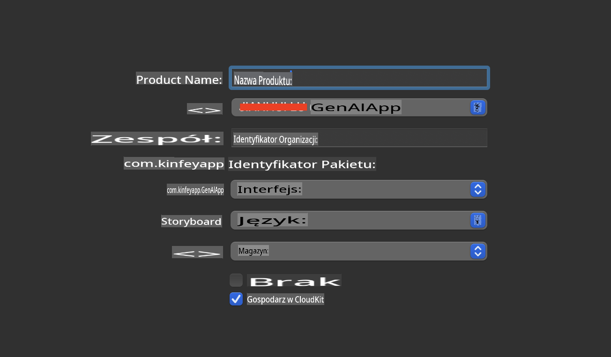
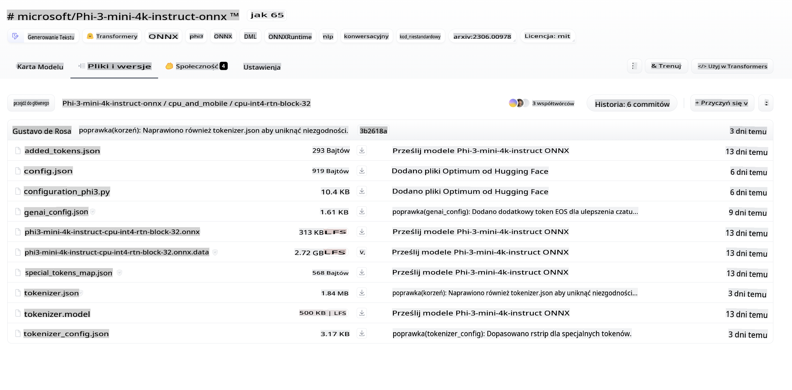
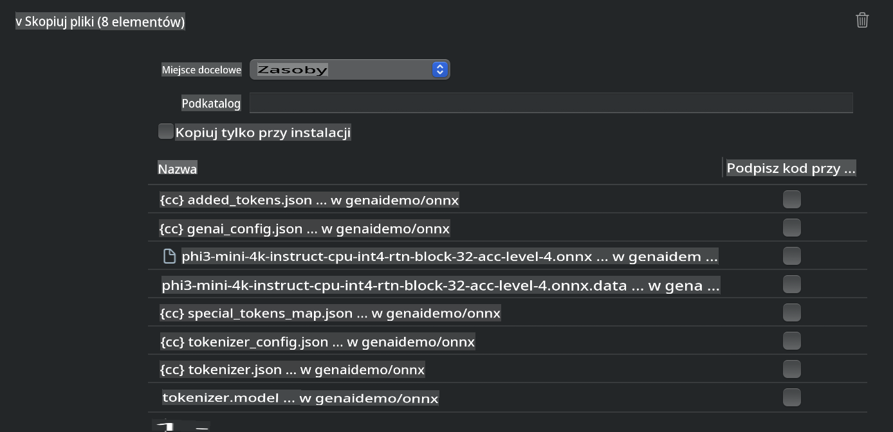
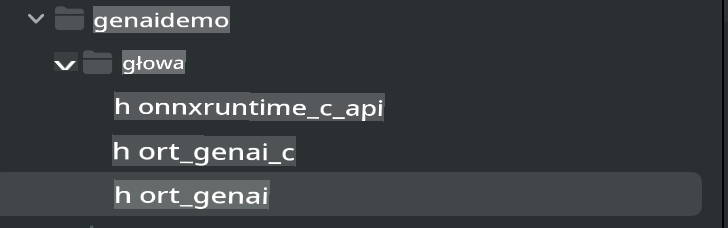
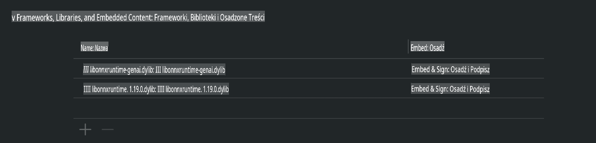
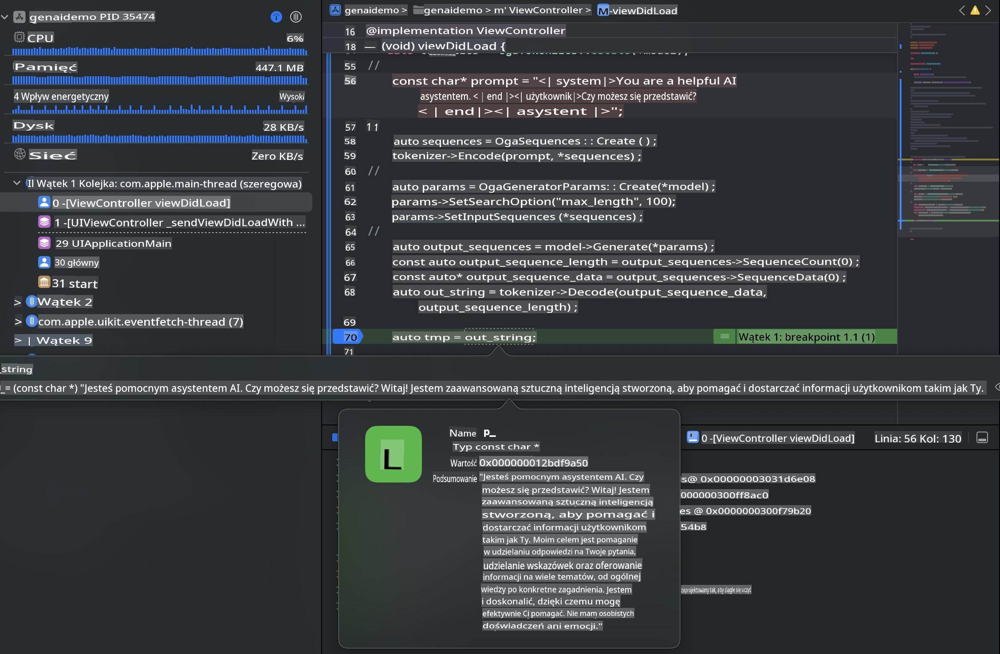

# **Wnioskowanie Phi-3 na iOS**

Phi-3-mini to nowa seria modeli od Microsoft, umożliwiająca wdrażanie dużych modeli językowych (LLM) na urządzeniach brzegowych i IoT. Phi-3-mini jest dostępny na iOS, Androida oraz urządzenia brzegowe, co pozwala wdrażać generatywną sztuczną inteligencję w środowiskach BYOD. Poniższy przykład pokazuje, jak wdrożyć Phi-3-mini na iOS.

## **1. Przygotowanie**

- **a.** macOS 14+
- **b.** Xcode 15+
- **c.** iOS SDK 17.x (iPhone 14 A16 lub nowszy)
- **d.** Zainstaluj Python 3.10+ (zalecane Conda)
- **e.** Zainstaluj bibliotekę Python: `python-flatbuffers`
- **f.** Zainstaluj CMake

### Semantic Kernel i wnioskowanie

Semantic Kernel to framework aplikacyjny, który pozwala tworzyć aplikacje kompatybilne z Azure OpenAI Service, modelami OpenAI, a nawet modelami lokalnymi. Dostęp do usług lokalnych przez Semantic Kernel umożliwia łatwą integrację z własnym serwerem modelu Phi-3-mini.

### Wywoływanie modeli skwantowanych za pomocą Ollama lub LlamaEdge

Wielu użytkowników preferuje używanie modeli skwantowanych do uruchamiania ich lokalnie. [Ollama](https://ollama.com) i [LlamaEdge](https://llamaedge.com) pozwalają na wywoływanie różnych modeli skwantowanych:

#### **Ollama**

Możesz uruchomić `ollama run phi3` bezpośrednio lub skonfigurować go offline. Stwórz plik Modelfile z ścieżką do swojego pliku `gguf`. Przykładowy kod uruchamiania skwantowanego modelu Phi-3-mini:

```gguf
FROM {Add your gguf file path}
TEMPLATE \"\"\"<|user|> .Prompt<|end|> <|assistant|>\"\"\"
PARAMETER stop <|end|>
PARAMETER num_ctx 4096
```

#### **LlamaEdge**

Jeśli chcesz używać `gguf` zarówno w chmurze, jak i na urządzeniach brzegowych jednocześnie, LlamaEdge jest doskonałą opcją.

## **2. Kompilacja ONNX Runtime dla iOS**

```bash

git clone https://github.com/microsoft/onnxruntime.git

cd onnxruntime

./build.sh --build_shared_lib --ios --skip_tests --parallel --build_dir ./build_ios --ios --apple_sysroot iphoneos --osx_arch arm64 --apple_deploy_target 17.5 --cmake_generator Xcode --config Release

cd ../

```

### **Uwaga**

- **a.** Przed kompilacją upewnij się, że Xcode jest poprawnie skonfigurowany i ustaw go jako aktywny katalog programisty w terminalu:

    ```bash
    sudo xcode-select -switch /Applications/Xcode.app/Contents/Developer
    ```

- **b.** ONNX Runtime musi być skompilowany dla różnych platform. Dla iOS możesz kompilować dla `arm64` or `x86_64`.

- **c.** Zaleca się użycie najnowszego SDK iOS do kompilacji. Możesz jednak użyć starszej wersji, jeśli potrzebujesz kompatybilności z wcześniejszymi SDK.

## **3. Kompilacja Generative AI z ONNX Runtime dla iOS**

> **Uwaga:** Ponieważ Generative AI z ONNX Runtime jest w wersji zapoznawczej, pamiętaj o możliwości wprowadzania zmian.

```bash

git clone https://github.com/microsoft/onnxruntime-genai
 
cd onnxruntime-genai
 
mkdir ort
 
cd ort
 
mkdir include
 
mkdir lib
 
cd ../
 
cp ../onnxruntime/include/onnxruntime/core/session/onnxruntime_c_api.h ort/include
 
cp ../onnxruntime/build_ios/Release/Release-iphoneos/libonnxruntime*.dylib* ort/lib
 
export OPENCV_SKIP_XCODEBUILD_FORCE_TRYCOMPILE_DEBUG=1
 
python3 build.py --parallel --build_dir ./build_ios --ios --ios_sysroot iphoneos --ios_arch arm64 --ios_deployment_target 17.5 --cmake_generator Xcode --cmake_extra_defines CMAKE_XCODE_ATTRIBUTE_CODE_SIGNING_ALLOWED=NO

```

## **4. Tworzenie aplikacji App w Xcode**

Wybrałem Objective-C jako metodę tworzenia aplikacji, ponieważ używając Generative AI z ONNX Runtime C++ API, Objective-C lepiej współpracuje. Oczywiście, można także realizować odpowiednie wywołania poprzez mostkowanie do Swift.



## **5. Skopiowanie skwantowanego modelu INT4 ONNX do projektu aplikacji App**

Musimy zaimportować model w formacie ONNX z kwantyzacją INT4, który należy najpierw pobrać.



Po pobraniu należy dodać go do katalogu Resources projektu w Xcode.



## **6. Dodanie API C++ w ViewControllers**

> **Uwaga:**

- **a.** Dodaj odpowiednie pliki nagłówkowe C++ do projektu.

  

- **b.** Uwzględnij `onnxruntime-genai` dynamic library in Xcode.

  

- **c.** Use the C Samples code for testing. You can also add additional features like ChatUI for more functionality.

- **d.** Since you need to use C++ in your project, rename `ViewController.m` to `ViewController.mm`, aby umożliwić obsługę Objective-C++.

```objc

    NSString *llmPath = [[NSBundle mainBundle] resourcePath];
    char const *modelPath = llmPath.cString;

    auto model =  OgaModel::Create(modelPath);

    auto tokenizer = OgaTokenizer::Create(*model);

    const char* prompt = "<|system|>You are a helpful AI assistant.<|end|><|user|>Can you introduce yourself?<|end|><|assistant|>";

    auto sequences = OgaSequences::Create();
    tokenizer->Encode(prompt, *sequences);

    auto params = OgaGeneratorParams::Create(*model);
    params->SetSearchOption("max_length", 100);
    params->SetInputSequences(*sequences);

    auto output_sequences = model->Generate(*params);
    const auto output_sequence_length = output_sequences->SequenceCount(0);
    const auto* output_sequence_data = output_sequences->SequenceData(0);
    auto out_string = tokenizer->Decode(output_sequence_data, output_sequence_length);
    
    auto tmp = out_string;

```

## **7. Uruchamianie aplikacji**

Po zakończeniu konfiguracji możesz uruchomić aplikację, aby zobaczyć wyniki wnioskowania modelu Phi-3-mini.



Więcej przykładowego kodu i szczegółowych instrukcji znajdziesz w [Phi-3 Mini Samples repository](https://github.com/Azure-Samples/Phi-3MiniSamples/tree/main/ios).

**Zastrzeżenie**:  
Niniejszy dokument został przetłumaczony przy użyciu usług tłumaczenia maszynowego opartego na sztucznej inteligencji. Chociaż staramy się zapewnić dokładność, prosimy pamiętać, że automatyczne tłumaczenia mogą zawierać błędy lub nieścisłości. Oryginalny dokument w jego rodzimym języku powinien być uznawany za wiarygodne źródło. W przypadku informacji krytycznych zalecane jest skorzystanie z profesjonalnego tłumaczenia ludzkiego. Nie ponosimy odpowiedzialności za jakiekolwiek nieporozumienia lub błędne interpretacje wynikające z użycia tego tłumaczenia.