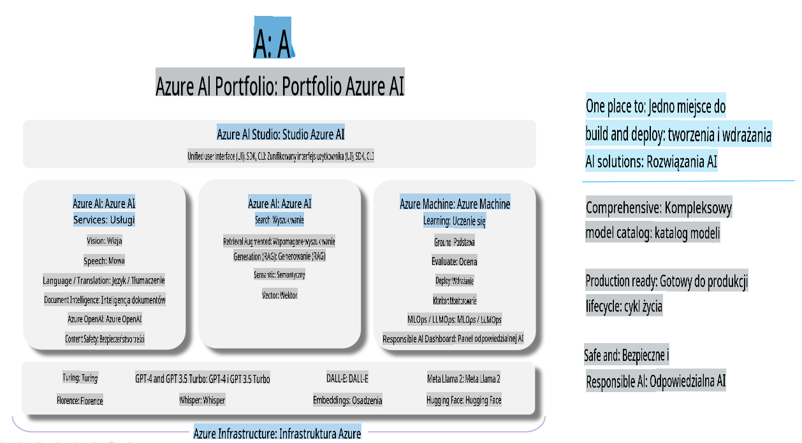

# **Korzystanie z Azure AI Foundry do oceny**

Jak ocenić swoją aplikację generatywnej AI za pomocą [Azure AI Foundry](https://ai.azure.com?WT.mc_id=aiml-138114-kinfeylo). Niezależnie od tego, czy oceniasz pojedyncze interakcje, czy wieloetapowe rozmowy, Azure AI Foundry oferuje narzędzia do analizy wydajności i bezpieczeństwa modeli.

## Jak oceniać aplikacje generatywnej AI z Azure AI Foundry
Szczegółowe instrukcje znajdziesz w [dokumentacji Azure AI Foundry](https://learn.microsoft.com/azure/ai-studio/how-to/evaluate-generative-ai-app?WT.mc_id=aiml-138114-kinfeylo).

Oto kroki, aby rozpocząć:

## Ocena modeli generatywnej AI w Azure AI Foundry

**Wymagania wstępne**

- Zestaw danych testowych w formacie CSV lub JSON.
- Wdrożony model generatywnej AI (np. Phi-3, GPT 3.5, GPT 4 lub modele Davinci).
- Środowisko wykonawcze z instancją obliczeniową do przeprowadzenia oceny.

## Wbudowane metryki oceny

Azure AI Foundry umożliwia ocenę zarówno pojedynczych interakcji, jak i złożonych, wieloetapowych rozmów.  
W scenariuszach Retrieval Augmented Generation (RAG), gdzie model opiera się na konkretnych danych, możesz ocenić wydajność za pomocą wbudowanych metryk oceny.  
Dodatkowo, możesz oceniać ogólne scenariusze odpowiadania na pytania w pojedynczych interakcjach (non-RAG).

## Tworzenie przebiegu oceny

W interfejsie użytkownika Azure AI Foundry przejdź do strony Evaluate lub Prompt Flow.  
Skorzystaj z kreatora konfiguracji, aby utworzyć przebieg oceny. Opcjonalnie nadaj nazwę swojej ocenie.  
Wybierz scenariusz zgodny z celami Twojej aplikacji.  
Wskaż jedną lub więcej metryk oceny, aby przeanalizować wyniki modelu.

## Niestandardowy przebieg oceny (opcjonalne)

Dla większej elastyczności możesz stworzyć niestandardowy przebieg oceny. Dostosuj proces oceny do swoich specyficznych potrzeb.

## Przeglądanie wyników

Po przeprowadzeniu oceny zaloguj się, aby wyświetlić i przeanalizować szczegółowe metryki w Azure AI Foundry. Uzyskaj wgląd w możliwości i ograniczenia swojej aplikacji.

**Uwaga** Azure AI Foundry jest obecnie w fazie publicznego podglądu, więc używaj go do celów eksperymentalnych i rozwojowych. W przypadku środowisk produkcyjnych rozważ inne opcje. Szczegółowe informacje i instrukcje krok po kroku znajdziesz w oficjalnej [dokumentacji AI Foundry](https://learn.microsoft.com/azure/ai-studio/?WT.mc_id=aiml-138114-kinfeylo).

**Zastrzeżenie**:  
Ten dokument został przetłumaczony za pomocą usług tłumaczenia opartego na sztucznej inteligencji. Chociaż staramy się zapewnić dokładność, prosimy pamiętać, że automatyczne tłumaczenia mogą zawierać błędy lub nieścisłości. Oryginalny dokument w jego rodzimym języku powinien być uznawany za wiarygodne źródło. W przypadku istotnych informacji zaleca się skorzystanie z profesjonalnego tłumaczenia wykonanego przez człowieka. Nie ponosimy odpowiedzialności za jakiekolwiek nieporozumienia lub błędne interpretacje wynikające z korzystania z tego tłumaczenia.