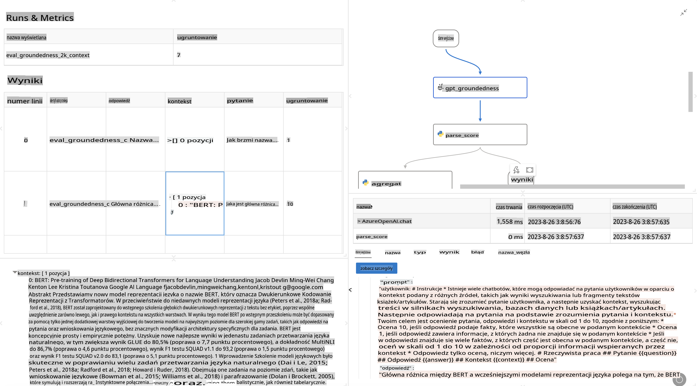

# **Wprowadzenie do Promptflow**

[Microsoft Prompt Flow](https://microsoft.github.io/promptflow/index.html?WT.mc_id=aiml-138114-kinfeylo) to narzędzie do wizualnej automatyzacji przepływów pracy, które pozwala użytkownikom tworzyć zautomatyzowane procesy za pomocą gotowych szablonów i niestandardowych konektorów. Jest zaprojektowane z myślą o programistach i analitykach biznesowych, umożliwiając im szybkie budowanie zautomatyzowanych procesów dla takich zadań jak zarządzanie danymi, współpraca czy optymalizacja procesów. Dzięki Prompt Flow użytkownicy mogą łatwo łączyć różne usługi, aplikacje i systemy oraz automatyzować złożone procesy biznesowe.

Microsoft Prompt Flow został stworzony, aby usprawnić cały cykl tworzenia aplikacji AI opartych na dużych modelach językowych (LLM). Niezależnie od tego, czy jesteś na etapie pomysłów, prototypowania, testowania, oceny czy wdrażania aplikacji opartych na LLM, Prompt Flow upraszcza proces i umożliwia tworzenie aplikacji LLM o jakości produkcyjnej.

## Kluczowe funkcje i korzyści z korzystania z Microsoft Prompt Flow:

**Interaktywne doświadczenie tworzenia**

Prompt Flow oferuje wizualną reprezentację struktury przepływu, co ułatwia zrozumienie i poruszanie się po projektach.
Zapewnia środowisko kodowania przypominające notatnik, które sprzyja efektywnemu tworzeniu i debugowaniu przepływów.

**Warianty promptów i ich optymalizacja**

Twórz i porównuj różne warianty promptów, aby wspierać iteracyjny proces doskonalenia. Oceniaj wydajność różnych promptów i wybieraj te najbardziej efektywne.

**Wbudowane przepływy oceny**

Oceniaj jakość i skuteczność swoich promptów i przepływów za pomocą wbudowanych narzędzi oceny.
Zrozum, jak dobrze działają Twoje aplikacje oparte na LLM.

**Wszechstronne zasoby**

Prompt Flow zawiera bibliotekę wbudowanych narzędzi, przykładów i szablonów. Te zasoby stanowią punkt wyjścia do tworzenia, inspirują kreatywność i przyspieszają proces.

**Współpraca i gotowość na poziomie przedsiębiorstwa**

Wspieraj współpracę zespołową, umożliwiając wielu użytkownikom wspólną pracę nad projektami inżynierii promptów.
Zarządzaj wersjami i efektywnie dziel się wiedzą. Usprawnij cały proces inżynierii promptów, od tworzenia i oceny po wdrażanie i monitorowanie.

## Ocena w Prompt Flow 

W Microsoft Prompt Flow ocena odgrywa kluczową rolę w analizie, jak dobrze działają Twoje modele AI. Przyjrzyjmy się, jak dostosować przepływy i metryki oceny w Prompt Flow:

**Zrozumienie oceny w Prompt Flow**

W Prompt Flow przepływ reprezentuje sekwencję węzłów, które przetwarzają dane wejściowe i generują dane wyjściowe. Przepływy oceny to specjalne typy przepływów zaprojektowane do analizy wydajności działania na podstawie określonych kryteriów i celów.

**Kluczowe cechy przepływów oceny**

Zazwyczaj uruchamiane są po przepływie, który jest testowany, wykorzystując jego dane wyjściowe. Obliczają wyniki lub metryki mierzące wydajność testowanego przepływu. Metryki mogą obejmować dokładność, wyniki istotności lub inne istotne miary.

### Dostosowywanie przepływów oceny

**Definiowanie danych wejściowych**

Przepływy oceny muszą przyjmować dane wyjściowe z testowanego przepływu. Definiuj dane wejściowe podobnie jak w standardowych przepływach.
Na przykład, jeśli oceniasz przepływ QnA, nazwij dane wejściowe jako "odpowiedź." Jeśli oceniasz przepływ klasyfikacji, nazwij dane wejściowe jako "kategoria." Mogą być również potrzebne dane wejściowe stanowiące prawdziwe wartości (np. rzeczywiste etykiety).

**Dane wyjściowe i metryki**

Przepływy oceny generują wyniki mierzące wydajność testowanego przepływu. Metryki można obliczać za pomocą Pythona lub LLM (Large Language Models). Użyj funkcji log_metric(), aby rejestrować odpowiednie metryki.

**Korzystanie z dostosowanych przepływów oceny**

Opracuj własny przepływ oceny dostosowany do swoich konkretnych zadań i celów. Dostosuj metryki do swoich celów oceny.
Zastosuj ten dostosowany przepływ oceny do wsadowych uruchomień w celu testowania na dużą skalę.

## Wbudowane metody oceny

Prompt Flow oferuje również wbudowane metody oceny.
Możesz przesyłać wsadowe uruchomienia i korzystać z tych metod, aby ocenić, jak dobrze Twój przepływ działa z dużymi zestawami danych.
Przeglądaj wyniki oceny, porównuj metryki i wprowadzaj iteracje w razie potrzeby.
Pamiętaj, że ocena jest kluczowa dla zapewnienia, że Twoje modele AI spełniają pożądane kryteria i cele. Zapoznaj się z oficjalną dokumentacją, aby uzyskać szczegółowe instrukcje dotyczące tworzenia i korzystania z przepływów oceny w Microsoft Prompt Flow.

Podsumowując, Microsoft Prompt Flow umożliwia programistom tworzenie wysokiej jakości aplikacji LLM, upraszczając inżynierię promptów i oferując solidne środowisko rozwoju. Jeśli pracujesz z LLM, Prompt Flow to wartościowe narzędzie, które warto poznać. Zapoznaj się z [Dokumentacją oceny Prompt Flow](https://learn.microsoft.com/azure/machine-learning/prompt-flow/how-to-develop-an-evaluation-flow?view=azureml-api-2?WT.mc_id=aiml-138114-kinfeylo), aby uzyskać szczegółowe instrukcje dotyczące tworzenia i korzystania z przepływów oceny w Microsoft Prompt Flow.

**Zastrzeżenie**:  
Niniejszy dokument został przetłumaczony za pomocą usług automatycznego tłumaczenia opartego na sztucznej inteligencji. Chociaż dokładamy wszelkich starań, aby tłumaczenie było precyzyjne, należy pamiętać, że automatyczne tłumaczenia mogą zawierać błędy lub nieścisłości. Oryginalny dokument w jego rodzimym języku powinien być uznawany za wiarygodne źródło. W przypadku informacji krytycznych zaleca się skorzystanie z profesjonalnego tłumaczenia wykonanego przez człowieka. Nie ponosimy odpowiedzialności za jakiekolwiek nieporozumienia lub błędne interpretacje wynikające z użycia tego tłumaczenia.