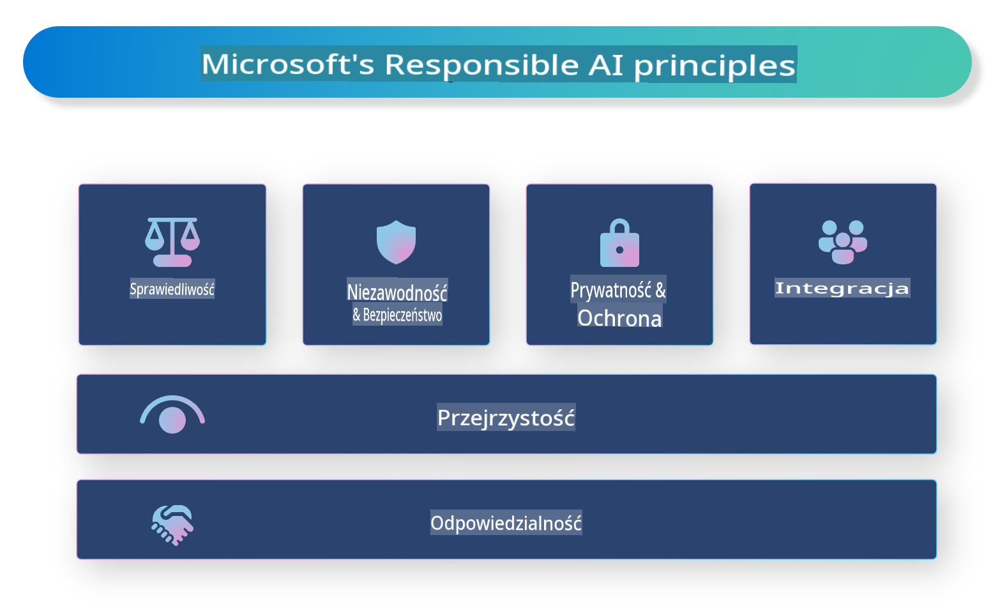

# **Wprowadzenie do Odpowiedzialnej Sztucznej Inteligencji**

[Microsoft Responsible AI](https://www.microsoft.com/ai/responsible-ai?WT.mc_id=aiml-138114-kinfeylo) to inicjatywa mająca na celu wsparcie deweloperów i organizacji w tworzeniu systemów AI, które są przejrzyste, godne zaufania i odpowiedzialne. Inicjatywa ta dostarcza wskazówek i zasobów umożliwiających rozwój rozwiązań AI zgodnych z zasadami etyki, takimi jak prywatność, sprawiedliwość i przejrzystość. Przyjrzymy się również wyzwaniom i najlepszym praktykom związanym z budową odpowiedzialnych systemów AI.

## Przegląd Microsoft Responsible AI

**Zasady etyczne**

Microsoft Responsible AI kieruje się zestawem zasad etycznych, takich jak prywatność, sprawiedliwość, przejrzystość, odpowiedzialność i bezpieczeństwo. Zasady te mają na celu zapewnienie, że systemy AI są tworzone w sposób etyczny i odpowiedzialny.

**Przejrzysta AI**

Microsoft Responsible AI podkreśla znaczenie przejrzystości w systemach AI. Obejmuje to dostarczanie jasnych wyjaśnień dotyczących działania modeli AI oraz zapewnienie, że źródła danych i algorytmy są publicznie dostępne.

**Odpowiedzialna AI**

[Microsoft Responsible AI](https://www.microsoft.com/ai/responsible-ai?WT.mc_id=aiml-138114-kinfeylo) promuje rozwój odpowiedzialnych systemów AI, które dostarczają wglądu w sposób podejmowania decyzji przez modele AI. Dzięki temu użytkownicy mogą lepiej zrozumieć i zaufać wynikom generowanym przez te systemy.

**Inkluzywność**

Systemy AI powinny być projektowane tak, aby przynosiły korzyści wszystkim. Microsoft dąży do tworzenia inkluzywnej AI, która uwzględnia różnorodne perspektywy i unika uprzedzeń czy dyskryminacji.

**Niezawodność i bezpieczeństwo**

Zapewnienie niezawodności i bezpieczeństwa systemów AI jest kluczowe. Microsoft skupia się na budowie solidnych modeli, które działają konsekwentnie i unikają szkodliwych skutków.

**Sprawiedliwość w AI**

Microsoft Responsible AI uznaje, że systemy AI mogą utrwalać uprzedzenia, jeśli są trenowane na stronniczych danych lub algorytmach. Inicjatywa dostarcza wskazówek dotyczących tworzenia sprawiedliwych systemów AI, które nie dyskryminują ze względu na takie czynniki jak rasa, płeć czy wiek.

**Prywatność i bezpieczeństwo**

Microsoft Responsible AI kładzie nacisk na ochronę prywatności użytkowników i bezpieczeństwo danych w systemach AI. Obejmuje to stosowanie silnego szyfrowania danych i kontroli dostępu, a także regularne audyty systemów AI w celu wykrywania luk w zabezpieczeniach.

**Odpowiedzialność i świadomość**

Microsoft Responsible AI promuje odpowiedzialność i świadomość w rozwoju i wdrażaniu AI. Obejmuje to upewnienie się, że deweloperzy i organizacje są świadomi potencjalnych ryzyk związanych z systemami AI i podejmują kroki w celu ich ograniczenia.

## Najlepsze praktyki budowy odpowiedzialnych systemów AI

**Twórz modele AI z wykorzystaniem zróżnicowanych zbiorów danych**

Aby uniknąć uprzedzeń w systemach AI, ważne jest korzystanie z różnorodnych zbiorów danych, które reprezentują szeroki zakres perspektyw i doświadczeń.

**Stosuj techniki wyjaśnialnej AI**

Techniki wyjaśnialnej AI mogą pomóc użytkownikom zrozumieć, w jaki sposób modele AI podejmują decyzje, co zwiększa zaufanie do systemu.

**Regularnie przeprowadzaj audyty systemów AI w celu wykrycia luk**

Regularne audyty systemów AI mogą pomóc w identyfikacji potencjalnych zagrożeń i luk, które wymagają rozwiązania.

**Wdrażaj silne szyfrowanie danych i kontrolę dostępu**

Szyfrowanie danych i kontrola dostępu mogą pomóc w ochronie prywatności i bezpieczeństwa użytkowników w systemach AI.

**Przestrzegaj zasad etycznych podczas rozwoju AI**

Przestrzeganie zasad etycznych, takich jak sprawiedliwość, przejrzystość i odpowiedzialność, może pomóc w budowaniu zaufania do systemów AI i zapewnić, że są one tworzone w odpowiedzialny sposób.

## Wykorzystanie AI Foundry do odpowiedzialnej AI

[Azure AI Foundry](https://ai.azure.com?WT.mc_id=aiml-138114-kinfeylo) to potężna platforma, która umożliwia deweloperom i organizacjom szybkie tworzenie inteligentnych, nowoczesnych, gotowych na rynek i odpowiedzialnych aplikacji. Oto kluczowe funkcje i możliwości Azure AI Foundry:

**Gotowe API i modele**

Azure AI Foundry oferuje wstępnie przygotowane i dostosowywalne API oraz modele. Obejmują one szeroki zakres zadań AI, w tym generatywną AI, przetwarzanie języka naturalnego dla konwersacji, wyszukiwanie, monitorowanie, tłumaczenie, mowę, wizję i podejmowanie decyzji.

**Prompt Flow**

Funkcja prompt flow w Azure AI Foundry umożliwia tworzenie doświadczeń opartych na konwersacjach AI. Pozwala projektować i zarządzać przepływami konwersacyjnymi, co ułatwia budowanie chatbotów, wirtualnych asystentów i innych interaktywnych aplikacji.

**Retrieval Augmented Generation (RAG)**

RAG to technika łącząca podejście oparte na wyszukiwaniu z generatywnym. Poprawia jakość generowanych odpowiedzi, wykorzystując zarówno istniejącą wiedzę (wyszukiwanie), jak i kreatywne generowanie (generacja).

**Metryki oceny i monitorowania dla generatywnej AI**

Azure AI Foundry dostarcza narzędzi do oceny i monitorowania modeli generatywnej AI. Możesz oceniać ich wydajność, sprawiedliwość i inne kluczowe metryki, aby zapewnić odpowiedzialne wdrożenie. Dodatkowo, jeśli stworzyłeś dashboard, możesz użyć interfejsu no-code w Azure Machine Learning Studio do dostosowania i wygenerowania Responsible AI Dashboard oraz powiązanej karty wyników na podstawie bibliotek Python [Responsible AI Toolbox](https://responsibleaitoolbox.ai/?WT.mc_id=aiml-138114-kinfeylo). Karta wyników pomaga dzielić się kluczowymi spostrzeżeniami dotyczącymi sprawiedliwości, znaczenia cech i innych aspektów odpowiedzialnego wdrożenia z interesariuszami technicznymi i nietechnicznymi.

Aby korzystać z AI Foundry w kontekście odpowiedzialnej AI, możesz postępować według następujących najlepszych praktyk:

**Zdefiniuj problem i cele swojego systemu AI**

Przed rozpoczęciem procesu tworzenia ważne jest jasne zdefiniowanie problemu lub celu, który system AI ma rozwiązać. Pomoże to określić dane, algorytmy i zasoby potrzebne do zbudowania efektywnego modelu.

**Zbierz i przetwórz odpowiednie dane**

Jakość i ilość danych używanych do trenowania systemu AI mają znaczący wpływ na jego wydajność. Dlatego ważne jest zebranie odpowiednich danych, ich oczyszczenie, przetworzenie i upewnienie się, że są reprezentatywne dla populacji lub problemu, który chcesz rozwiązać.

**Wybierz odpowiednią metodę oceny**

Istnieje wiele algorytmów oceny. Ważne jest, aby wybrać najbardziej odpowiedni algorytm w zależności od danych i problemu.

**Oceń i interpretuj model**

Po zbudowaniu modelu AI ważne jest ocenienie jego wydajności za pomocą odpowiednich metryk i przejrzyste interpretowanie wyników. Pomoże to zidentyfikować uprzedzenia lub ograniczenia modelu i wprowadzić niezbędne ulepszenia.

**Zapewnij przejrzystość i wyjaśnialność**

Systemy AI powinny być przejrzyste i wyjaśnialne, aby użytkownicy mogli zrozumieć, jak działają i jak podejmowane są decyzje. Jest to szczególnie ważne w aplikacjach, które mają znaczący wpływ na życie ludzi, takich jak opieka zdrowotna, finanse czy systemy prawne.

**Monitoruj i aktualizuj model**

Systemy AI powinny być stale monitorowane i aktualizowane, aby zapewnić, że pozostają dokładne i efektywne w czasie. Wymaga to ciągłej konserwacji, testowania i ponownego trenowania modelu.

Podsumowując, Microsoft Responsible AI to inicjatywa mająca na celu wsparcie deweloperów i organizacji w tworzeniu systemów AI, które są przejrzyste, godne zaufania i odpowiedzialne. Pamiętaj, że wdrożenie odpowiedzialnej AI jest kluczowe, a Azure AI Foundry ma na celu uczynienie tego procesu praktycznym dla organizacji. Przestrzegając zasad etycznych i najlepszych praktyk, możemy zapewnić, że systemy AI są tworzone i wdrażane w sposób odpowiedzialny, przynosząc korzyści całemu społeczeństwu.

**Zastrzeżenie**:  
Ten dokument został przetłumaczony za pomocą usług tłumaczeniowych opartych na sztucznej inteligencji. Chociaż staramy się zapewnić dokładność, należy pamiętać, że automatyczne tłumaczenia mogą zawierać błędy lub nieścisłości. Oryginalny dokument w jego rodzimym języku powinien być uznawany za wiarygodne źródło. W przypadku informacji krytycznych zaleca się skorzystanie z profesjonalnego tłumaczenia wykonanego przez człowieka. Nie ponosimy odpowiedzialności za jakiekolwiek nieporozumienia lub błędne interpretacje wynikające z korzystania z tego tłumaczenia.