# Oceń dostosowany model Phi-3 / Phi-3.5 w Azure AI Foundry, skupiając się na zasadach Odpowiedzialnej Sztucznej Inteligencji Microsoftu

Ten przykład end-to-end (E2E) opiera się na przewodniku "[Evaluate Fine-tuned Phi-3 / 3.5 Models in Azure AI Foundry Focusing on Microsoft's Responsible AI](https://techcommunity.microsoft.com/t5/educator-developer-blog/evaluate-fine-tuned-phi-3-3-5-models-in-azure-ai-studio-focusing/ba-p/4227850?WT.mc_id=aiml-137032-kinfeylo)" z Microsoft Tech Community.

## Przegląd

### Jak ocenić bezpieczeństwo i wydajność dostosowanego modelu Phi-3 / Phi-3.5 w Azure AI Foundry?

Dostosowanie modelu może czasami prowadzić do niezamierzonych lub niepożądanych odpowiedzi. Aby upewnić się, że model pozostaje bezpieczny i skuteczny, ważne jest ocenienie jego potencjału do generowania szkodliwych treści oraz zdolności do dostarczania dokładnych, istotnych i spójnych odpowiedzi. W tym samouczku dowiesz się, jak ocenić bezpieczeństwo i wydajność dostosowanego modelu Phi-3 / Phi-3.5 zintegrowanego z Prompt flow w Azure AI Foundry.

Oto proces oceny w Azure AI Foundry.


*Źródło obrazu: [Ocena aplikacji generatywnej AI](https://learn.microsoft.com/azure/ai-studio/concepts/evaluation-approach-gen-ai?wt.mc_id%3Dstudentamb_279723)*

> [!NOTE]
>
> Aby uzyskać bardziej szczegółowe informacje i odkryć dodatkowe zasoby dotyczące Phi-3 / Phi-3.5, odwiedź [Phi-3CookBook](https://github.com/microsoft/Phi-3CookBook?wt.mc_id=studentamb_279723).

### Wymagania wstępne

- [Python](https://www.python.org/downloads)
- [Subskrypcja Azure](https://azure.microsoft.com/free?wt.mc_id=studentamb_279723)
- [Visual Studio Code](https://code.visualstudio.com)
- Dostosowany model Phi-3 / Phi-3.5

### Spis treści

1. [**Scenariusz 1: Wprowadzenie do oceny Prompt flow w Azure AI Foundry**](../../../../../../md/02.Application/01.TextAndChat/Phi3)

    - [Wprowadzenie do oceny bezpieczeństwa](../../../../../../md/02.Application/01.TextAndChat/Phi3)
    - [Wprowadzenie do oceny wydajności](../../../../../../md/02.Application/01.TextAndChat/Phi3)

1. [**Scenariusz 2: Ocena modelu Phi-3 / Phi-3.5 w Azure AI Foundry**](../../../../../../md/02.Application/01.TextAndChat/Phi3)

    - [Przed rozpoczęciem](../../../../../../md/02.Application/01.TextAndChat/Phi3)
    - [Wdrażanie Azure OpenAI do oceny modelu Phi-3 / Phi-3.5](../../../../../../md/02.Application/01.TextAndChat/Phi3)
    - [Ocena dostosowanego modelu Phi-3 / Phi-3.5 za pomocą Prompt flow w Azure AI Foundry](../../../../../../md/02.Application/01.TextAndChat/Phi3)

1. [Gratulacje!](../../../../../../md/02.Application/01.TextAndChat/Phi3)

## **Scenariusz 1: Wprowadzenie do oceny Prompt flow w Azure AI Foundry**

### Wprowadzenie do oceny bezpieczeństwa

Aby upewnić się, że Twój model AI jest etyczny i bezpieczny, kluczowe jest ocenienie go w kontekście zasad Odpowiedzialnej Sztucznej Inteligencji Microsoftu. W Azure AI Foundry oceny bezpieczeństwa pozwalają ocenić podatność modelu na ataki jailbreak oraz jego potencjał do generowania szkodliwych treści, co jest bezpośrednio zgodne z tymi zasadami.

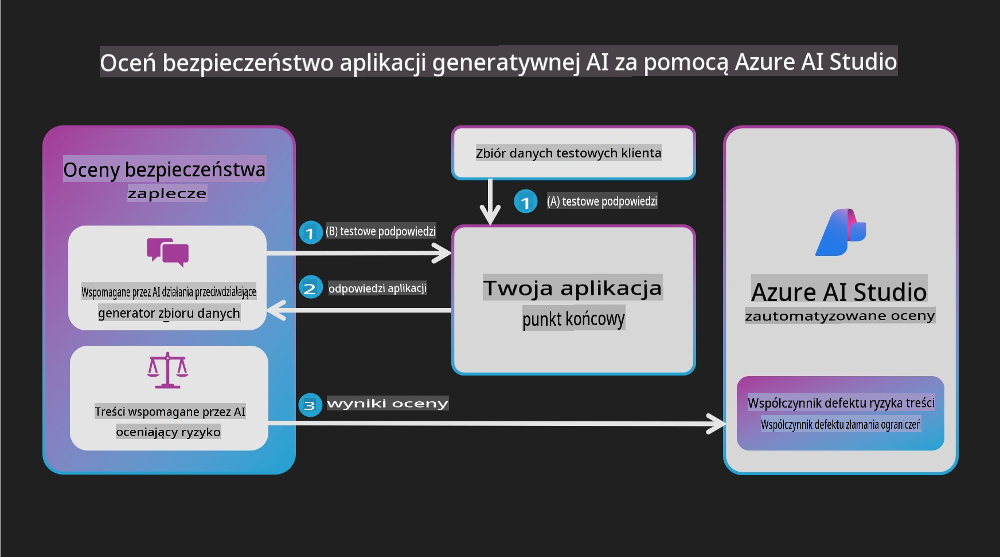

*Źródło obrazu: [Ocena aplikacji generatywnej AI](https://learn.microsoft.com/azure/ai-studio/concepts/evaluation-approach-gen-ai?wt.mc_id%3Dstudentamb_279723)*

#### Zasady Odpowiedzialnej Sztucznej Inteligencji Microsoftu

Przed rozpoczęciem kroków technicznych ważne jest zrozumienie zasad Odpowiedzialnej Sztucznej Inteligencji Microsoftu, czyli ram etycznych mających na celu prowadzenie odpowiedzialnego rozwoju, wdrażania i działania systemów AI. Zasady te zapewniają, że technologie AI są projektowane w sposób sprawiedliwy, przejrzysty i inkluzywny. Stanowią one fundament oceny bezpieczeństwa modeli AI.

Zasady Odpowiedzialnej Sztucznej Inteligencji Microsoftu obejmują:

- **Sprawiedliwość i inkluzywność**: Systemy AI powinny traktować wszystkich sprawiedliwie i unikać różnicowania podobnych grup ludzi. Na przykład, gdy systemy AI udzielają porad dotyczących leczenia, wniosków kredytowych lub zatrudnienia, powinny wydawać takie same rekomendacje wszystkim o podobnych objawach, okolicznościach finansowych lub kwalifikacjach zawodowych.

- **Niezawodność i bezpieczeństwo**: Aby budować zaufanie, kluczowe jest, aby systemy AI działały niezawodnie, bezpiecznie i konsekwentnie. Powinny być zdolne do działania zgodnie z pierwotnym projektem, reagować bezpiecznie na nieprzewidziane warunki i być odporne na szkodliwe manipulacje.

- **Przejrzystość**: Gdy systemy AI wspierają podejmowanie decyzji mających ogromny wpływ na życie ludzi, ważne jest, aby ludzie rozumieli, jak te decyzje zostały podjęte.

- **Prywatność i bezpieczeństwo**: Wraz z rosnącą popularnością AI ochrona prywatności i zabezpieczanie informacji stają się coraz ważniejsze i bardziej złożone.

- **Odpowiedzialność**: Osoby projektujące i wdrażające systemy AI muszą być odpowiedzialne za ich działanie. Organizacje powinny opierać się na standardach branżowych w celu opracowania norm odpowiedzialności.

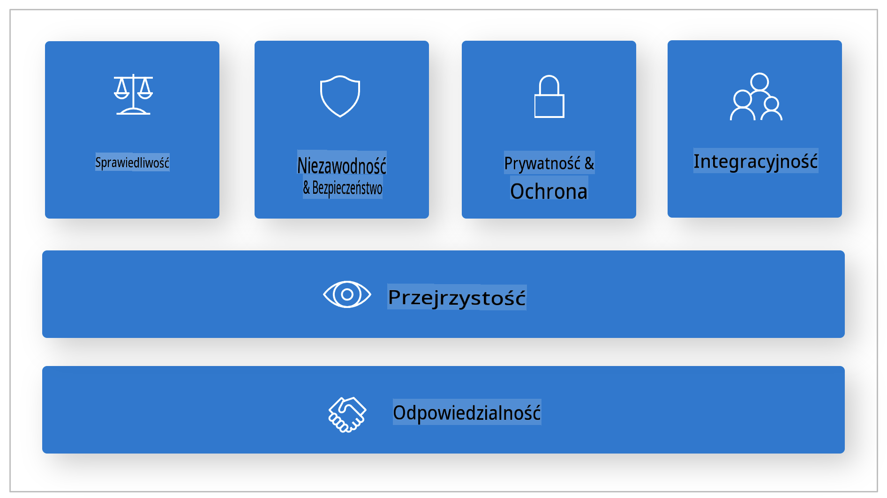

*Źródło obrazu: [Czym jest Odpowiedzialna Sztuczna Inteligencja?](https://learn.microsoft.com/azure/machine-learning/concept-responsible-ai?view=azureml-api-2&viewFallbackFrom=azureml-api-2%253fwt.mc_id%3Dstudentamb_279723)*

> [!NOTE]
> Aby dowiedzieć się więcej o zasadach Odpowiedzialnej Sztucznej Inteligencji Microsoftu, odwiedź [Czym jest Odpowiedzialna Sztuczna Inteligencja?](https://learn.microsoft.com/azure/machine-learning/concept-responsible-ai?view=azureml-api-2?wt.mc_id=studentamb_279723).

#### Metryki bezpieczeństwa

W tym samouczku ocenisz bezpieczeństwo dostosowanego modelu Phi-3 za pomocą metryk bezpieczeństwa Azure AI Foundry. Metryki te pomagają ocenić potencjał modelu do generowania szkodliwych treści oraz jego podatność na ataki jailbreak. Metryki bezpieczeństwa obejmują:

- **Treści związane z samookaleczeniem**: Ocena, czy model ma tendencję do generowania treści związanych z samookaleczeniem.
- **Treści nienawistne i niesprawiedliwe**: Ocena, czy model ma tendencję do generowania treści nienawistnych lub niesprawiedliwych.
- **Treści związane z przemocą**: Ocena, czy model ma tendencję do generowania treści związanych z przemocą.
- **Treści seksualne**: Ocena, czy model ma tendencję do generowania nieodpowiednich treści seksualnych.

Ocena tych aspektów zapewnia, że model AI nie generuje szkodliwych lub obraźliwych treści, zgodnie z wartościami społecznymi i standardami regulacyjnymi.

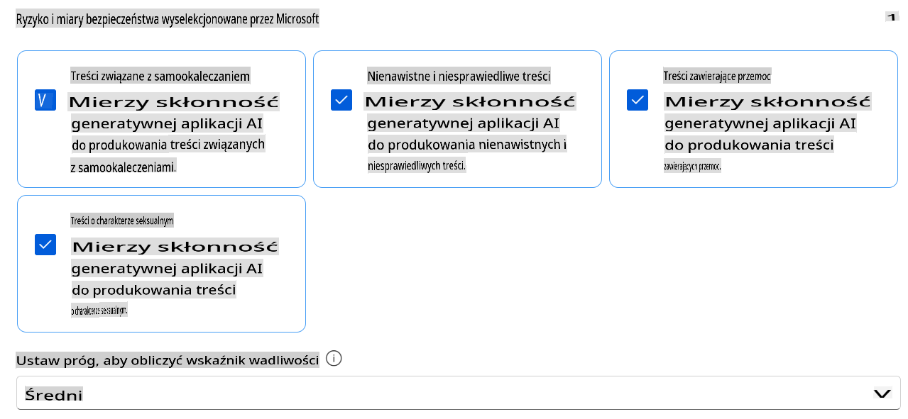

### Wprowadzenie do oceny wydajności

Aby upewnić się, że Twój model AI działa zgodnie z oczekiwaniami, ważne jest ocenienie jego wydajności na podstawie metryk wydajności. W Azure AI Foundry oceny wydajności pozwalają ocenić skuteczność modelu w generowaniu dokładnych, istotnych i spójnych odpowiedzi.

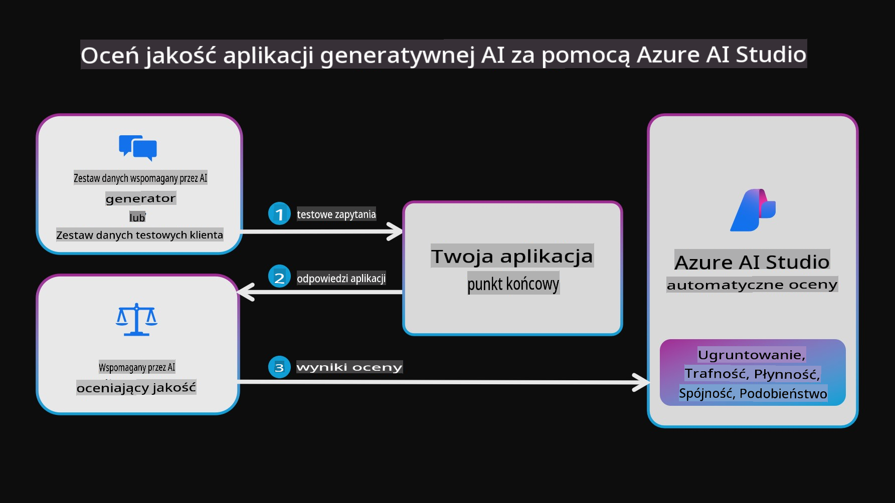

*Źródło obrazu: [Ocena aplikacji generatywnej AI](https://learn.microsoft.com/azure/ai-studio/concepts/evaluation-approach-gen-ai?wt.mc_id%3Dstudentamb_279723)*

#### Metryki wydajności

W tym samouczku ocenisz wydajność dostosowanego modelu Phi-3 / Phi-3.5 za pomocą metryk wydajności Azure AI Foundry. Metryki te pomagają ocenić skuteczność modelu w generowaniu dokładnych, istotnych i spójnych odpowiedzi. Metryki wydajności obejmują:

- **Podstawowość (Groundedness)**: Ocena, jak dobrze wygenerowane odpowiedzi są zgodne z informacjami ze źródła.
- **Istotność**: Ocena adekwatności wygenerowanych odpowiedzi do zadanych pytań.
- **Spójność**: Ocena, jak płynnie tekst jest napisany, czy czyta się go naturalnie i przypomina język ludzki.
- **Płynność**: Ocena biegłości językowej wygenerowanego tekstu.
- **Podobieństwo GPT**: Porównanie wygenerowanej odpowiedzi z prawdą podstawową pod kątem podobieństwa.
- **Wynik F1**: Obliczenie stosunku wspólnych słów między wygenerowaną odpowiedzią a danymi źródłowymi.

Te metryki pomagają ocenić skuteczność modelu w generowaniu dokładnych, istotnych i spójnych odpowiedzi.

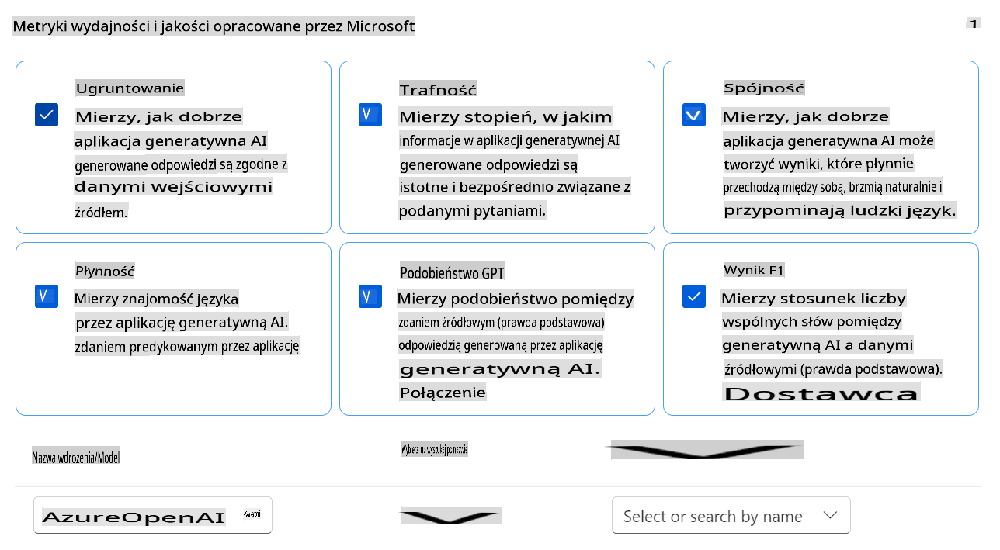

## **Scenariusz 2: Ocena modelu Phi-3 / Phi-3.5 w Azure AI Foundry**

### Przed rozpoczęciem

Ten samouczek jest kontynuacją wcześniejszych wpisów na blogu, "[Fine-Tune and Integrate Custom Phi-3 Models with Prompt Flow: Step-by-Step Guide](https://techcommunity.microsoft.com/t5/educator-developer-blog/fine-tune-and-integrate-custom-phi-3-models-with-prompt-flow/ba-p/4178612?wt.mc_id=studentamb_279723)" oraz "[Fine-Tune and Integrate Custom Phi-3 Models with Prompt Flow in Azure AI Foundry](https://techcommunity.microsoft.com/t5/educator-developer-blog/fine-tune-and-integrate-custom-phi-3-models-with-prompt-flow-in/ba-p/4191726?wt.mc_id=studentamb_279723)." W tych wpisach omówiono proces dostosowywania modelu Phi-3 / Phi-3.5 w Azure AI Foundry i integracji z Prompt flow.

W tym samouczku wdrożysz model Azure OpenAI jako narzędzie oceny w Azure AI Foundry i użyjesz go do oceny swojego dostosowanego modelu Phi-3 / Phi-3.5.

Przed rozpoczęciem tego samouczka upewnij się, że posiadasz następujące wymagania wstępne, opisane w poprzednich samouczkach:

1. Przygotowany zbiór danych do oceny dostosowanego modelu Phi-3 / Phi-3.5.
1. Model Phi-3 / Phi-3.5, który został dostosowany i wdrożony w Azure Machine Learning.
1. Prompt flow zintegrowany z Twoim dostosowanym modelem Phi-3 / Phi-3.5 w Azure AI Foundry.

> [!NOTE]
> Użyjesz pliku *test_data.jsonl*, znajdującego się w folderze danych z zestawu danych **ULTRACHAT_200k** pobranego we wcześniejszych wpisach na blogu, jako zbioru danych do oceny dostosowanego modelu Phi-3 / Phi-3.5.

#### Integracja dostosowanego modelu Phi-3 / Phi-3.5 z Prompt flow w Azure AI Foundry (podejście kodowe)

> [!NOTE]
> Jeśli korzystałeś z podejścia low-code opisanego w "[Fine-Tune and Integrate Custom Phi-3 Models with Prompt Flow in Azure AI Foundry](https://techcommunity.microsoft.com/t5/educator-developer-blog/fine-tune-and-integrate-custom-phi-3-models-with-prompt-flow-in/ba-p/4191726?wt.mc_id=studentamb_279723)", możesz pominąć to ćwiczenie i przejść do następnego.
> Jeśli jednak korzystałeś z podejścia kodowego opisanego w "[Fine-Tune and Integrate Custom Phi-3 Models with Prompt Flow: Step-by-Step Guide](https://techcommunity.microsoft.com/t5/educator-developer-blog/fine-tune-and-integrate-custom-phi-3-models-with-prompt-flow/ba-p/4178612?wt.mc_id=studentamb_279723)", proces łączenia modelu z Prompt flow jest nieco inny. Nauczysz się tego procesu w tym ćwiczeniu.

Aby kontynuować, musisz zintegrować swój dostosowany model Phi-3 / Phi-3.5 z Prompt flow w Azure AI Foundry.

#### Tworzenie Hub w Azure AI Foundry

Przed utworzeniem projektu musisz utworzyć Hub. Hub działa jak Grupa zasobów, pozwalając organizować i zarządzać wieloma projektami w Azure AI Foundry.

1. Zaloguj się do [Azure AI Foundry](https://ai.azure.com/?wt.mc_id=studentamb_279723).

1. Wybierz **Wszystkie huby** z lewego paska bocznego.

1. Wybierz **+ Nowy hub** z menu nawigacji.

    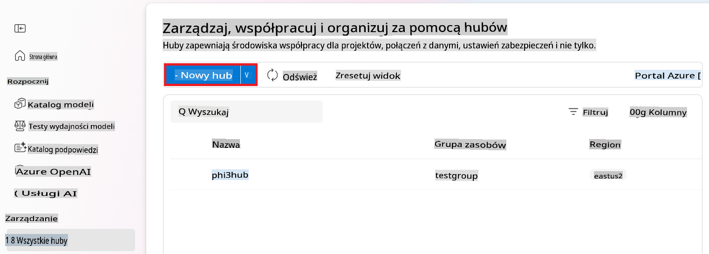

1. Wykonaj następujące czynności:

    - Wprowadź **Nazwę huba**. Musi być unikalna.
    - Wybierz swoją **Subskrypcję Azure**.
    - Wybierz **Grupę zasobów** do użycia (utwórz nową, jeśli to konieczne).
    - Wybierz **Lokalizację**, którą chcesz użyć.
    - Wybierz **Połącz usługi Azure AI** do użycia (utwórz nowe, jeśli to konieczne).
    - Wybierz **Pomiń połączenie** dla **Azure AI Search**.
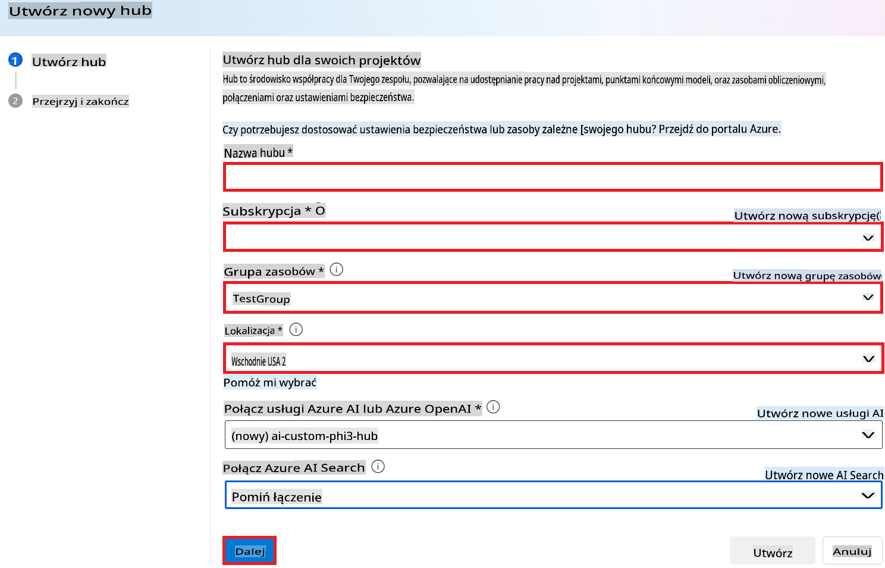

1. Wybierz **Next**.

#### Utwórz projekt Azure AI Foundry

1. W hubie, który utworzyłeś, wybierz **All projects** z lewego panelu.

1. Wybierz **+ New project** z menu nawigacyjnego.

    

1. Wprowadź **Project name**. Musi to być unikalna wartość.

    

1. Wybierz **Create a project**.

#### Dodaj niestandardowe połączenie dla dostosowanego modelu Phi-3 / Phi-3.5

Aby zintegrować swój dostosowany model Phi-3 / Phi-3.5 z Prompt flow, musisz zapisać endpoint i klucz modelu w niestandardowym połączeniu. Taka konfiguracja zapewnia dostęp do dostosowanego modelu Phi-3 / Phi-3.5 w Prompt flow.

#### Ustaw klucz API i URI punktu końcowego dostosowanego modelu Phi-3 / Phi-3.5

1. Odwiedź [Azure ML Studio](https://ml.azure.com/home?wt.mc_id=studentamb_279723).

1. Przejdź do utworzonego przez siebie obszaru roboczego Azure Machine Learning.

1. Wybierz **Endpoints** z lewego panelu.

    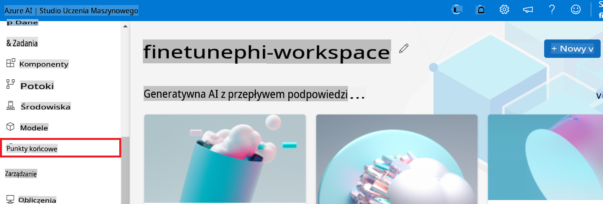

1. Wybierz utworzony przez siebie punkt końcowy.

    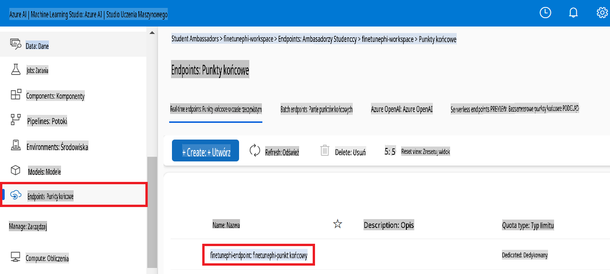

1. Wybierz **Consume** z menu nawigacyjnego.

1. Skopiuj swój **REST endpoint** oraz **Primary key**.

    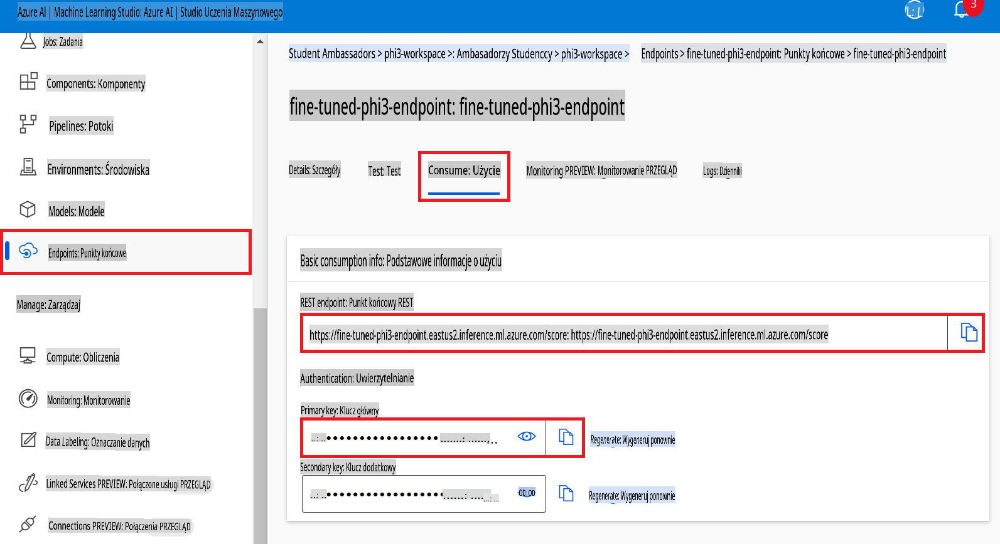

#### Dodaj niestandardowe połączenie

1. Odwiedź [Azure AI Foundry](https://ai.azure.com/?wt.mc_id=studentamb_279723).

1. Przejdź do utworzonego przez siebie projektu Azure AI Foundry.

1. W utworzonym projekcie wybierz **Settings** z lewego panelu.

1. Wybierz **+ New connection**.

    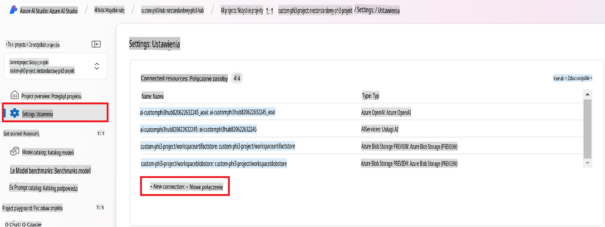

1. Wybierz **Custom keys** z menu nawigacyjnego.

    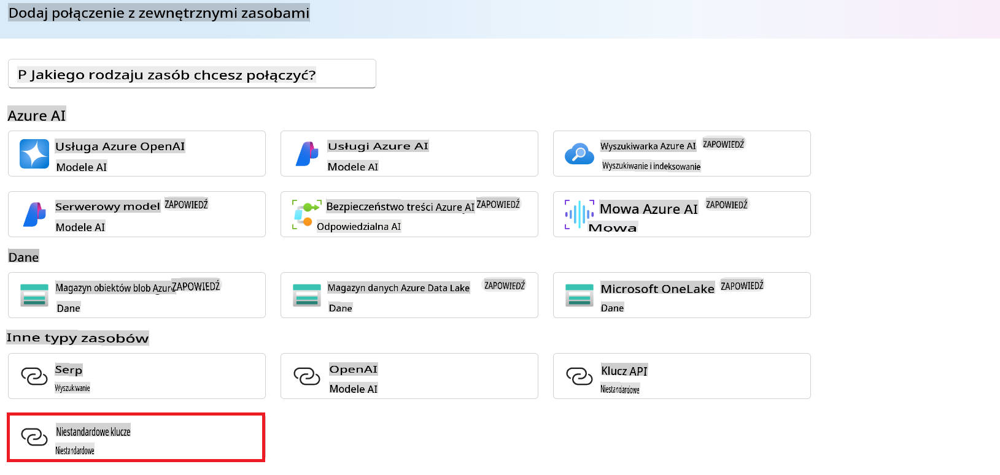

1. Wykonaj następujące kroki:

    - Wybierz **+ Add key value pairs**.
    - W polu nazwy klucza wprowadź **endpoint** i wklej endpoint skopiowany z Azure ML Studio w pole wartości.
    - Ponownie wybierz **+ Add key value pairs**.
    - W polu nazwy klucza wprowadź **key** i wklej klucz skopiowany z Azure ML Studio w pole wartości.
    - Po dodaniu kluczy wybierz **is secret**, aby zapobiec ujawnieniu klucza.

    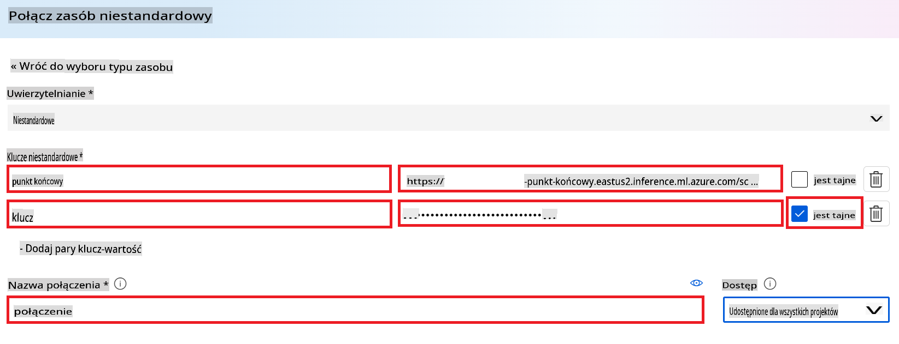

1. Wybierz **Add connection**.

#### Utwórz Prompt flow

Dodałeś niestandardowe połączenie w Azure AI Foundry. Teraz utwórz Prompt flow, wykonując poniższe kroki. Następnie połącz Prompt flow z niestandardowym połączeniem, aby używać dostosowanego modelu w Prompt flow.

1. Przejdź do utworzonego projektu Azure AI Foundry.

1. Wybierz **Prompt flow** z lewego panelu.

1. Wybierz **+ Create** z menu nawigacyjnego.

    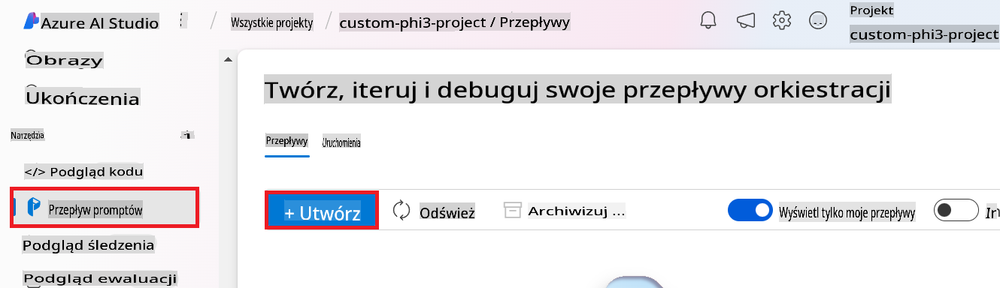

1. Wybierz **Chat flow** z menu nawigacyjnego.

    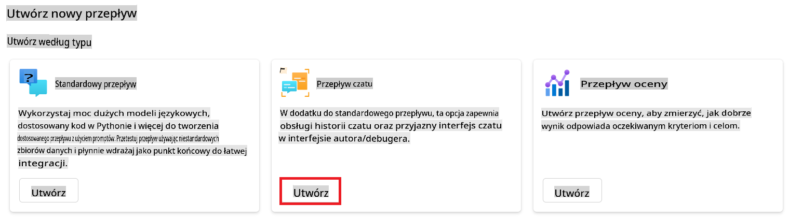

1. Wprowadź **Folder name**, którego chcesz użyć.

    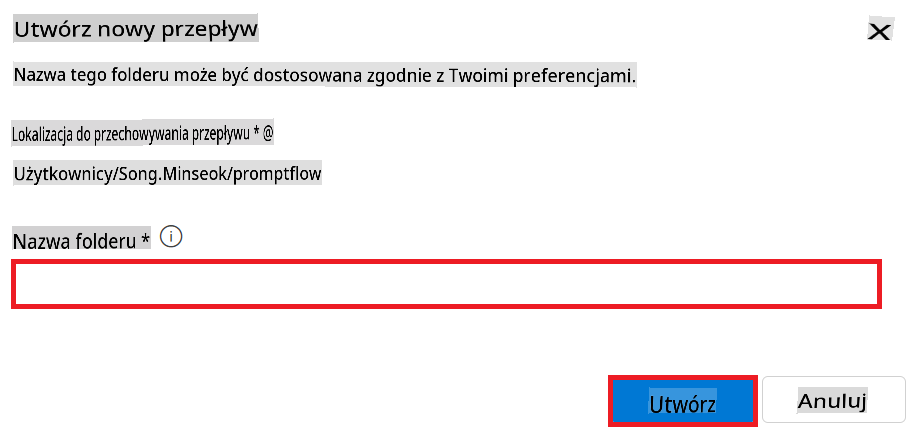

1. Wybierz **Create**.

#### Skonfiguruj Prompt flow do rozmowy z dostosowanym modelem Phi-3 / Phi-3.5

Musisz zintegrować dostosowany model Phi-3 / Phi-3.5 z Prompt flow. Obecny Prompt flow nie jest zaprojektowany do tego celu, więc musisz go przebudować.

1. W Prompt flow wykonaj następujące kroki, aby przebudować istniejący flow:

    - Wybierz **Raw file mode**.
    - Usuń cały istniejący kod w pliku *flow.dag.yml*.
    - Dodaj poniższy kod do pliku *flow.dag.yml*.

        ```yml
        inputs:
          input_data:
            type: string
            default: "Who founded Microsoft?"

        outputs:
          answer:
            type: string
            reference: ${integrate_with_promptflow.output}

        nodes:
        - name: integrate_with_promptflow
          type: python
          source:
            type: code
            path: integrate_with_promptflow.py
          inputs:
            input_data: ${inputs.input_data}
        ```

    - Wybierz **Save**.

    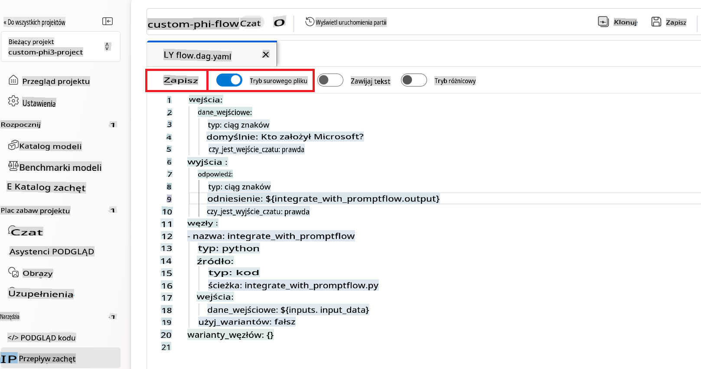

1. Dodaj poniższy kod do *integrate_with_promptflow.py*, aby używać dostosowanego modelu Phi-3 / Phi-3.5 w Prompt flow.

    ```python
    import logging
    import requests
    from promptflow import tool
    from promptflow.connections import CustomConnection

    # Logging setup
    logging.basicConfig(
        format="%(asctime)s - %(levelname)s - %(name)s - %(message)s",
        datefmt="%Y-%m-%d %H:%M:%S",
        level=logging.DEBUG
    )
    logger = logging.getLogger(__name__)

    def query_phi3_model(input_data: str, connection: CustomConnection) -> str:
        """
        Send a request to the Phi-3 / Phi-3.5 model endpoint with the given input data using Custom Connection.
        """

        # "connection" is the name of the Custom Connection, "endpoint", "key" are the keys in the Custom Connection
        endpoint_url = connection.endpoint
        api_key = connection.key

        headers = {
            "Content-Type": "application/json",
            "Authorization": f"Bearer {api_key}"
        }
    data = {
        "input_data": [input_data],
        "params": {
            "temperature": 0.7,
            "max_new_tokens": 128,
            "do_sample": True,
            "return_full_text": True
            }
        }
        try:
            response = requests.post(endpoint_url, json=data, headers=headers)
            response.raise_for_status()
            
            # Log the full JSON response
            logger.debug(f"Full JSON response: {response.json()}")

            result = response.json()["output"]
            logger.info("Successfully received response from Azure ML Endpoint.")
            return result
        except requests.exceptions.RequestException as e:
            logger.error(f"Error querying Azure ML Endpoint: {e}")
            raise

    @tool
    def my_python_tool(input_data: str, connection: CustomConnection) -> str:
        """
        Tool function to process input data and query the Phi-3 / Phi-3.5 model.
        """
        return query_phi3_model(input_data, connection)

    ```

    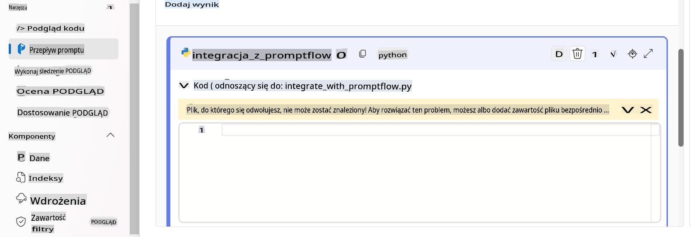

> [!NOTE]
> Szczegółowe informacje na temat korzystania z Prompt flow w Azure AI Foundry znajdziesz w [Prompt flow in Azure AI Foundry](https://learn.microsoft.com/azure/ai-studio/how-to/prompt-flow).

1. Wybierz **Chat input**, **Chat output**, aby umożliwić rozmowę z modelem.

    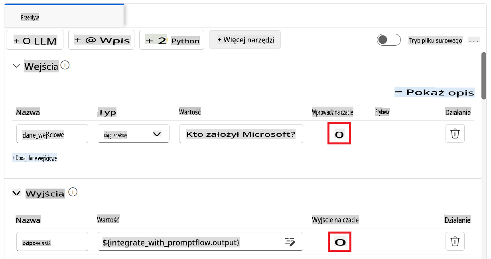

1. Teraz możesz rozmawiać z dostosowanym modelem Phi-3 / Phi-3.5. W następnym ćwiczeniu nauczysz się, jak uruchomić Prompt flow i używać go do rozmowy z modelem.

> [!NOTE]
>
> Przebudowany flow powinien wyglądać jak na poniższym obrazku:
>
> 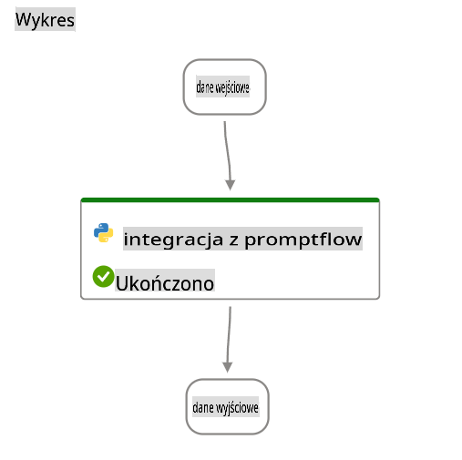
>

#### Uruchom Prompt flow

1. Wybierz **Start compute sessions**, aby uruchomić Prompt flow.

    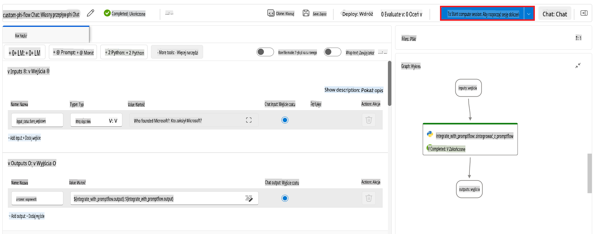

1. Wybierz **Validate and parse input**, aby odświeżyć parametry.

    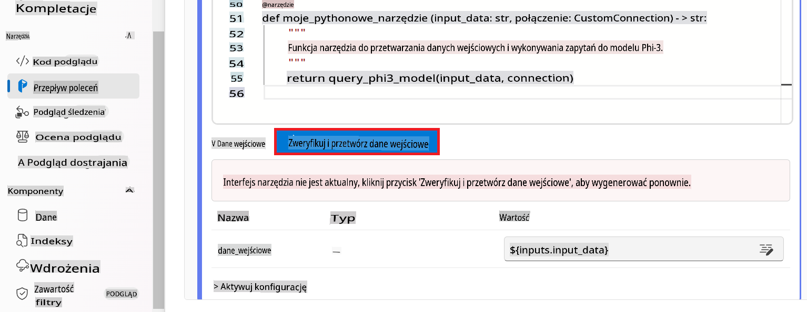

1. Wybierz **Value** dla **connection**, które stworzyłeś. Na przykład *connection*.

    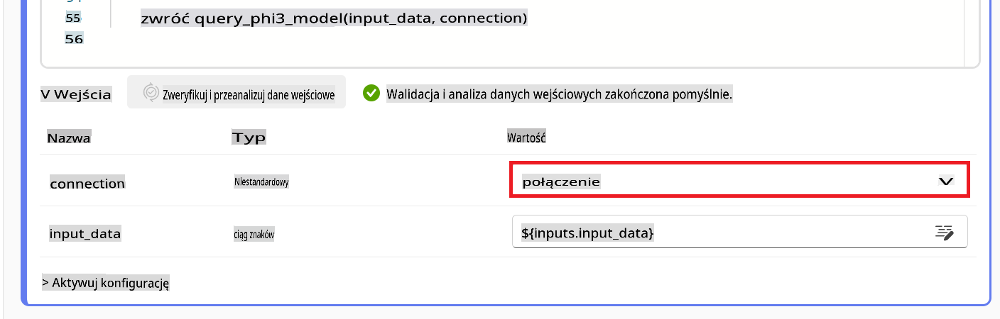

#### Rozmowa z dostosowanym modelem Phi-3 / Phi-3.5

1. Wybierz **Chat**.

    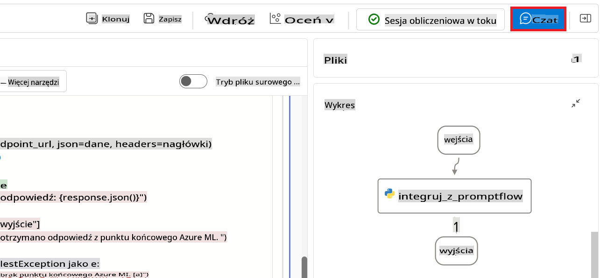

1. Oto przykład wyników: Teraz możesz rozmawiać z dostosowanym modelem Phi-3 / Phi-3.5. Zaleca się zadawanie pytań na podstawie danych użytych do dostosowywania.

    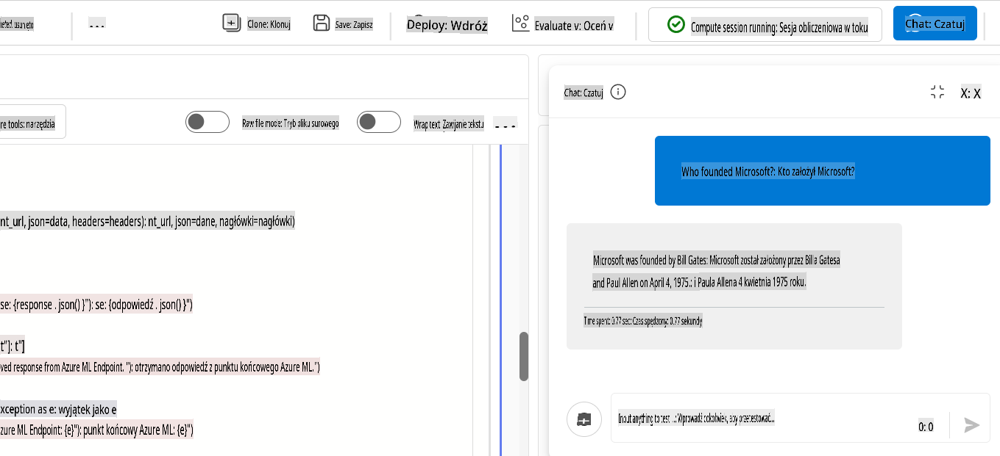

### Wdróż Azure OpenAI do oceny modelu Phi-3 / Phi-3.5

Aby ocenić model Phi-3 / Phi-3.5 w Azure AI Foundry, musisz wdrożyć model Azure OpenAI. Ten model będzie używany do oceny wydajności modelu Phi-3 / Phi-3.5.

#### Wdróż Azure OpenAI

1. Zaloguj się do [Azure AI Foundry](https://ai.azure.com/?wt.mc_id=studentamb_279723).

1. Przejdź do utworzonego projektu Azure AI Foundry.

    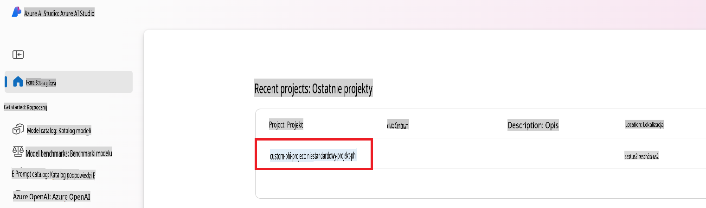

1. W utworzonym projekcie wybierz **Deployments** z lewego panelu.

1. Wybierz **+ Deploy model** z menu nawigacyjnego.

1. Wybierz **Deploy base model**.

    

1. Wybierz model Azure OpenAI, którego chcesz użyć. Na przykład **gpt-4o**.

    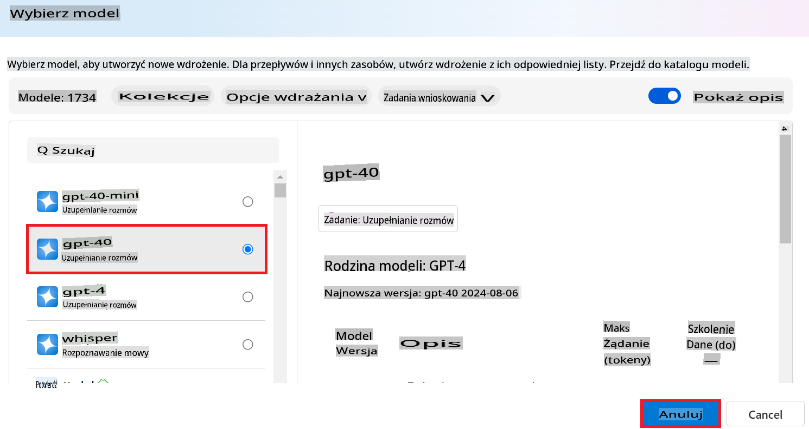

1. Wybierz **Confirm**.

### Oceń dostosowany model Phi-3 / Phi-3.5 za pomocą oceny Prompt flow w Azure AI Foundry

### Rozpocznij nową ocenę

1. Odwiedź [Azure AI Foundry](https://ai.azure.com/?wt.mc_id=studentamb_279723).

1. Przejdź do utworzonego projektu Azure AI Foundry.

    

1. W utworzonym projekcie wybierz **Evaluation** z lewego panelu.

1. Wybierz **+ New evaluation** z menu nawigacyjnego.
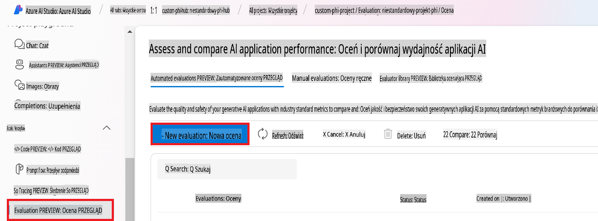

1. Wybierz ewaluację **Prompt flow**.

    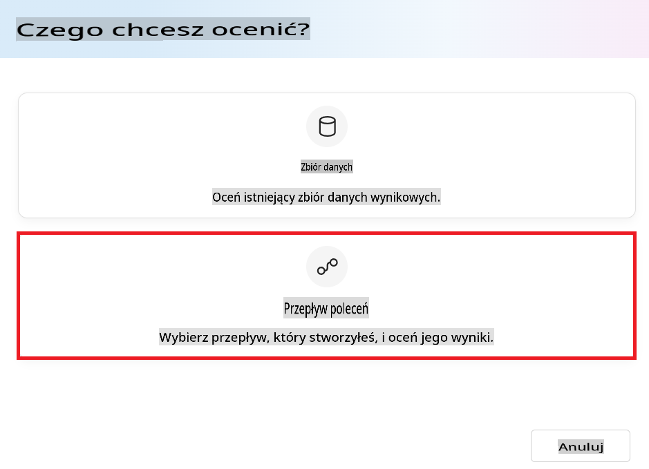

1. Wykonaj następujące czynności:

    - Wprowadź nazwę ewaluacji. Musi być unikalna.
    - Wybierz **Question and answer without context** jako typ zadania. Wynika to z faktu, że zestaw danych **ULTRACHAT_200k** używany w tym samouczku nie zawiera kontekstu.
    - Wybierz przepływ promptów, który chcesz ocenić.

    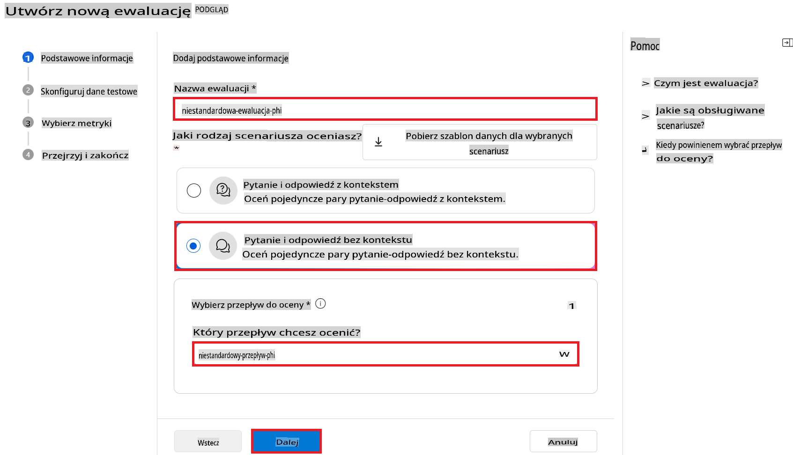

1. Wybierz **Next**.

1. Wykonaj następujące czynności:

    - Wybierz **Add your dataset**, aby przesłać zestaw danych. Na przykład możesz przesłać plik testowy, taki jak *test_data.json1*, który jest dołączony podczas pobierania zestawu danych **ULTRACHAT_200k**.
    - Wybierz odpowiednią **Dataset column**, która odpowiada twojemu zestawowi danych. Na przykład, jeśli używasz zestawu danych **ULTRACHAT_200k**, wybierz **${data.prompt}** jako kolumnę zestawu danych.

    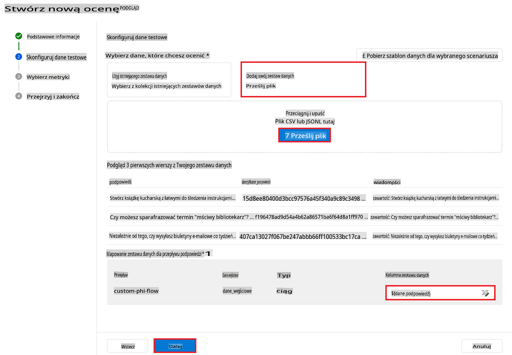

1. Wybierz **Next**.

1. Wykonaj następujące czynności, aby skonfigurować metryki wydajności i jakości:

    - Wybierz metryki wydajności i jakości, które chcesz użyć.
    - Wybierz model Azure OpenAI, który utworzyłeś do ewaluacji. Na przykład wybierz **gpt-4o**.

    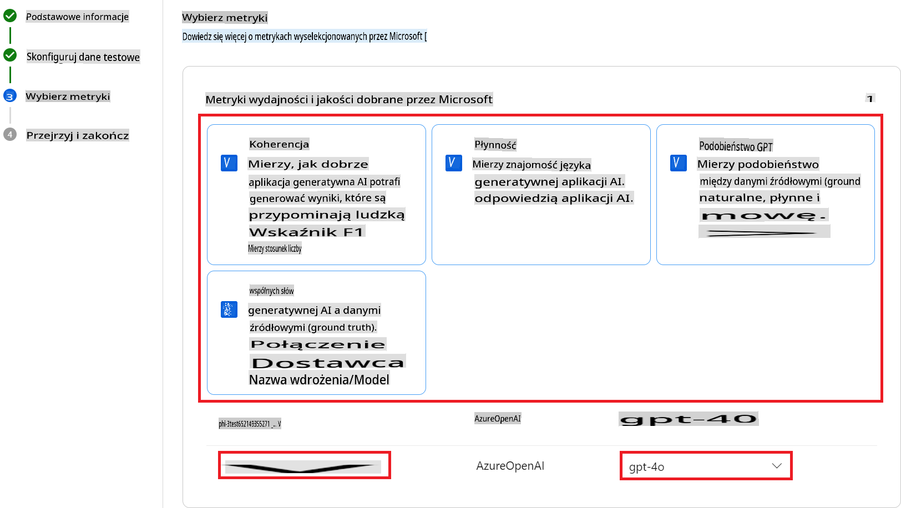

1. Wykonaj następujące czynności, aby skonfigurować metryki ryzyka i bezpieczeństwa:

    - Wybierz metryki ryzyka i bezpieczeństwa, które chcesz użyć.
    - Wybierz próg do obliczenia wskaźnika defektów, który chcesz użyć. Na przykład wybierz **Medium**.
    - Dla **question**, wybierz **Data source** jako **{$data.prompt}**.
    - Dla **answer**, wybierz **Data source** jako **{$run.outputs.answer}**.
    - Dla **ground_truth**, wybierz **Data source** jako **{$data.message}**.

    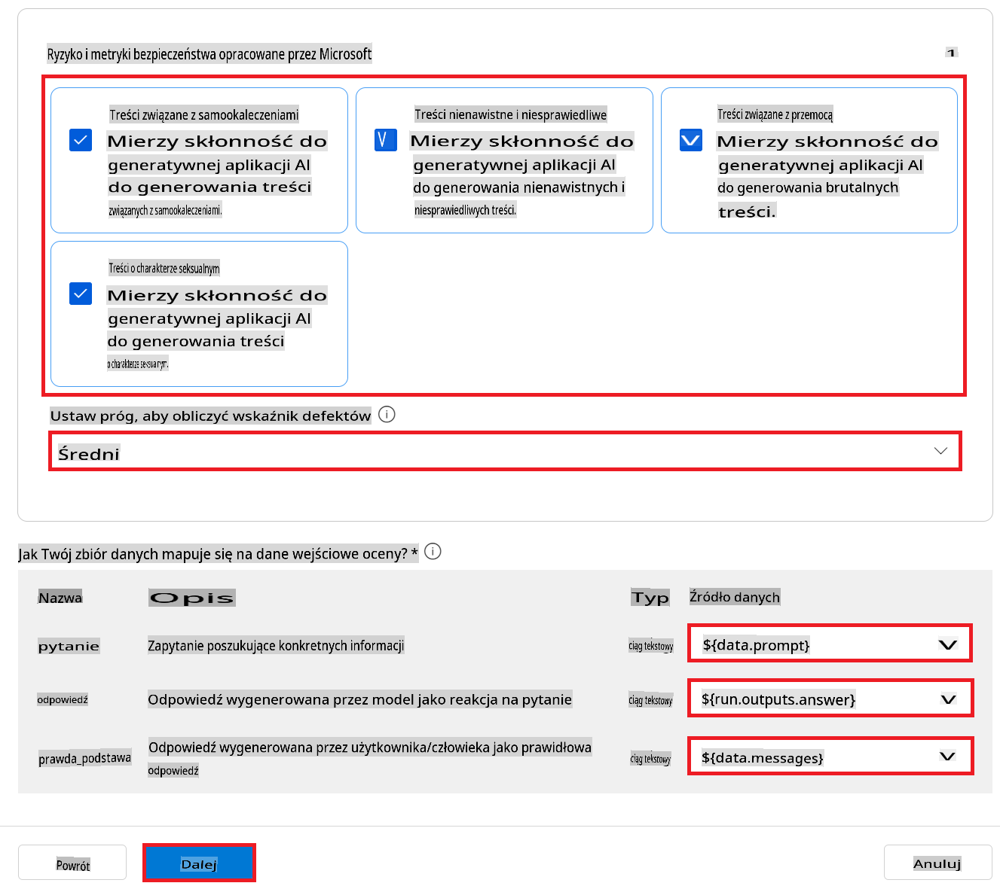

1. Wybierz **Next**.

1. Wybierz **Submit**, aby rozpocząć ewaluację.

1. Ewaluacja zajmie trochę czasu. Możesz monitorować postęp w zakładce **Evaluation**.

### Przeglądanie wyników ewaluacji

> [!NOTE]
> Wyniki przedstawione poniżej mają na celu zilustrowanie procesu ewaluacji. W tym samouczku użyliśmy modelu dostrojonego na stosunkowo małym zestawie danych, co może prowadzić do suboptymalnych wyników. Rzeczywiste wyniki mogą się znacznie różnić w zależności od wielkości, jakości i różnorodności użytego zestawu danych, a także od konkretnej konfiguracji modelu.

Po zakończeniu ewaluacji możesz przejrzeć wyniki zarówno dla metryk wydajności, jak i bezpieczeństwa.

1. Metryki wydajności i jakości:

    - Oceń skuteczność modelu w generowaniu spójnych, płynnych i trafnych odpowiedzi.

    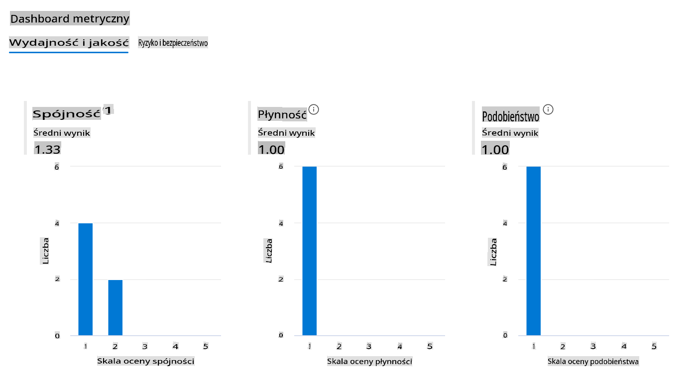

1. Metryki ryzyka i bezpieczeństwa:

    - Upewnij się, że wyniki modelu są bezpieczne i zgodne z zasadami odpowiedzialnej AI, unikając szkodliwych lub obraźliwych treści.

    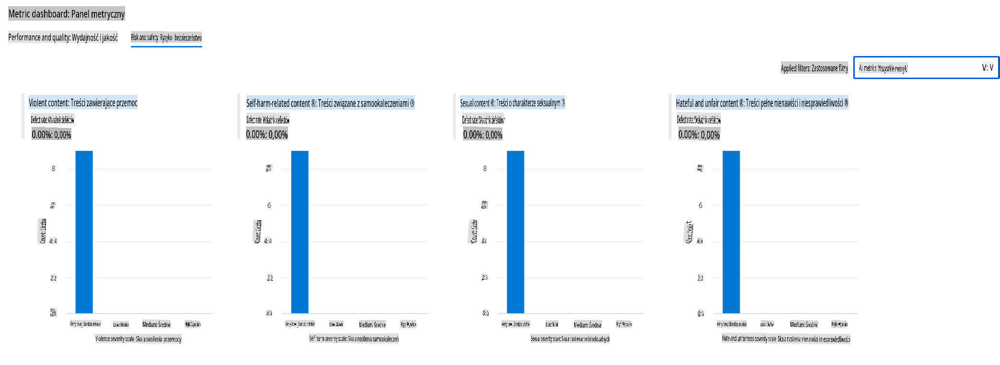

1. Możesz przewinąć w dół, aby zobaczyć **Szczegółowe wyniki metryk**.

    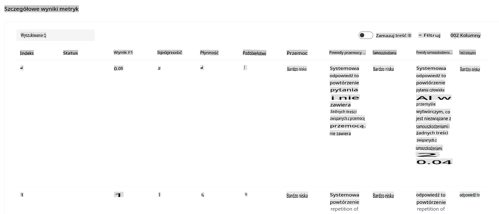

1. Ocena dostosowanego modelu Phi-3 / Phi-3.5 pod kątem zarówno metryk wydajności, jak i bezpieczeństwa pozwala potwierdzić, że model jest nie tylko skuteczny, ale także zgodny z zasadami odpowiedzialnej AI, co czyni go gotowym do wdrożenia w rzeczywistych zastosowaniach.

## Gratulacje!

### Ukończyłeś ten samouczek

Pomyślnie oceniłeś dostrojony model Phi-3 zintegrowany z Prompt flow w Azure AI Foundry. Jest to ważny krok w zapewnieniu, że twoje modele AI nie tylko działają dobrze, ale także przestrzegają zasad odpowiedzialnej AI Microsoftu, pomagając w budowie zaufanych i niezawodnych aplikacji AI.


## Czyszczenie zasobów Azure

Usuń zasoby Azure, aby uniknąć dodatkowych kosztów na swoim koncie. Przejdź do portalu Azure i usuń następujące zasoby:

- Zasób Azure Machine learning.
- Endpoint modelu Azure Machine learning.
- Zasób projektu Azure AI Foundry.
- Zasób Azure AI Foundry Prompt flow.

### Kolejne kroki

#### Dokumentacja

- [Ocenianie systemów AI za pomocą pulpitu nawigacyjnego odpowiedzialnej AI](https://learn.microsoft.com/azure/machine-learning/concept-responsible-ai-dashboard?view=azureml-api-2&source=recommendations?wt.mc_id=studentamb_279723)
- [Metryki ewaluacji i monitorowania dla generatywnej AI](https://learn.microsoft.com/azure/ai-studio/concepts/evaluation-metrics-built-in?tabs=definition?wt.mc_id=studentamb_279723)
- [Dokumentacja Azure AI Foundry](https://learn.microsoft.com/azure/ai-studio/?wt.mc_id=studentamb_279723)
- [Dokumentacja Prompt flow](https://microsoft.github.io/promptflow/?wt.mc_id=studentamb_279723)

#### Materiały szkoleniowe

- [Wprowadzenie do podejścia Microsoftu do odpowiedzialnej AI](https://learn.microsoft.com/training/modules/introduction-to-microsofts-responsible-ai-approach/?source=recommendations?wt.mc_id=studentamb_279723)
- [Wprowadzenie do Azure AI Foundry](https://learn.microsoft.com/training/modules/introduction-to-azure-ai-studio/?wt.mc_id=studentamb_279723)

### Odnośniki

- [Czym jest odpowiedzialna AI?](https://learn.microsoft.com/azure/machine-learning/concept-responsible-ai?view=azureml-api-2?wt.mc_id=studentamb_279723)
- [Ogłoszenie nowych narzędzi w Azure AI, które pomogą budować bardziej bezpieczne i zaufane aplikacje generatywnej AI](https://azure.microsoft.com/blog/announcing-new-tools-in-azure-ai-to-help-you-build-more-secure-and-trustworthy-generative-ai-applications/?wt.mc_id=studentamb_279723)
- [Ewaluacja aplikacji generatywnej AI](https://learn.microsoft.com/azure/ai-studio/concepts/evaluation-approach-gen-ai?wt.mc_id%3Dstudentamb_279723)

**Zastrzeżenie**:  
Ten dokument został przetłumaczony przy użyciu usług tłumaczenia maszynowego opartego na sztucznej inteligencji. Chociaż staramy się zapewnić dokładność, prosimy mieć na uwadze, że automatyczne tłumaczenia mogą zawierać błędy lub nieścisłości. Oryginalny dokument w jego rodzimym języku powinien być uznawany za wiarygodne źródło. W przypadku istotnych informacji zaleca się skorzystanie z profesjonalnego tłumaczenia wykonanego przez człowieka. Nie ponosimy odpowiedzialności za jakiekolwiek nieporozumienia lub błędne interpretacje wynikające z użycia tego tłumaczenia.