# Dostosowanie i integracja niestandardowych modeli Phi-3 z Prompt flow w Azure AI Foundry

Ten kompleksowy przykład (E2E) oparty jest na przewodniku "[Fine-Tune and Integrate Custom Phi-3 Models with Prompt Flow in Azure AI Foundry](https://techcommunity.microsoft.com/t5/educator-developer-blog/fine-tune-and-integrate-custom-phi-3-models-with-prompt-flow-in/ba-p/4191726?WT.mc_id=aiml-137032-kinfeylo)" opublikowanym w Microsoft Tech Community. Przedstawia procesy dostosowywania, wdrażania i integracji niestandardowych modeli Phi-3 z Prompt flow w Azure AI Foundry.  
W przeciwieństwie do przykładu E2E "[Fine-Tune and Integrate Custom Phi-3 Models with Prompt Flow](./E2E_Phi-3-FineTuning_PromptFlow_Integration.md)", który wymagał uruchamiania kodu lokalnie, ten samouczek koncentruje się całkowicie na dostosowywaniu i integracji modelu w Azure AI / ML Studio.

## Przegląd

W tym kompleksowym przykładzie dowiesz się, jak dostosować model Phi-3 i zintegrować go z Prompt flow w Azure AI Foundry. Wykorzystując Azure AI / ML Studio, stworzysz przepływ pracy do wdrażania i korzystania z niestandardowych modeli AI. Ten przykład E2E jest podzielony na trzy scenariusze:

**Scenariusz 1: Konfiguracja zasobów Azure i przygotowanie do dostosowywania**

**Scenariusz 2: Dostosowanie modelu Phi-3 i wdrożenie w Azure Machine Learning Studio**

**Scenariusz 3: Integracja z Prompt flow i interakcja z niestandardowym modelem w Azure AI Foundry**

Poniżej przedstawiono przegląd tego kompleksowego przykładu.

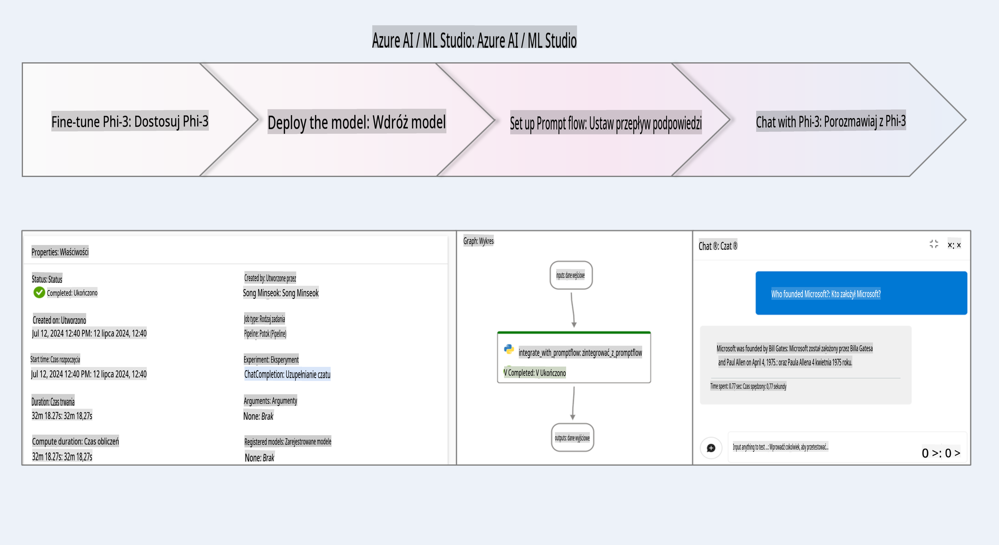

### Spis treści

1. **[Scenariusz 1: Konfiguracja zasobów Azure i przygotowanie do dostosowywania](../../../../../../md/02.Application/01.TextAndChat/Phi3)**  
    - [Utwórz Azure Machine Learning Workspace](../../../../../../md/02.Application/01.TextAndChat/Phi3)  
    - [Złóż wniosek o przydział GPU w subskrypcji Azure](../../../../../../md/02.Application/01.TextAndChat/Phi3)  
    - [Dodaj przypisanie roli](../../../../../../md/02.Application/01.TextAndChat/Phi3)  
    - [Skonfiguruj projekt](../../../../../../md/02.Application/01.TextAndChat/Phi3)  
    - [Przygotuj zestaw danych do dostosowywania](../../../../../../md/02.Application/01.TextAndChat/Phi3)  

2. **[Scenariusz 2: Dostosowanie modelu Phi-3 i wdrożenie w Azure Machine Learning Studio](../../../../../../md/02.Application/01.TextAndChat/Phi3)**  
    - [Dostosuj model Phi-3](../../../../../../md/02.Application/01.TextAndChat/Phi3)  
    - [Wdróż dostosowany model Phi-3](../../../../../../md/02.Application/01.TextAndChat/Phi3)  

3. **[Scenariusz 3: Integracja z Prompt flow i interakcja z niestandardowym modelem w Azure AI Foundry](../../../../../../md/02.Application/01.TextAndChat/Phi3)**  
    - [Zintegruj niestandardowy model Phi-3 z Prompt flow](../../../../../../md/02.Application/01.TextAndChat/Phi3)  
    - [Interakcja z niestandardowym modelem Phi-3](../../../../../../md/02.Application/01.TextAndChat/Phi3)  

## Scenariusz 1: Konfiguracja zasobów Azure i przygotowanie do dostosowywania

### Utwórz Azure Machine Learning Workspace

1. Wpisz *azure machine learning* w **pasku wyszukiwania** na górze strony portalu i wybierz **Azure Machine Learning** z wyświetlonych opcji.

    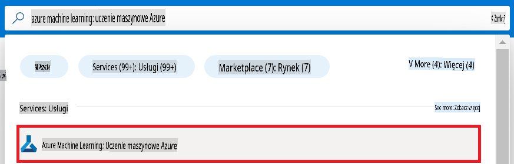

2. Wybierz **+ Create** z menu nawigacyjnego.

3. Wybierz **New workspace** z menu nawigacyjnego.

    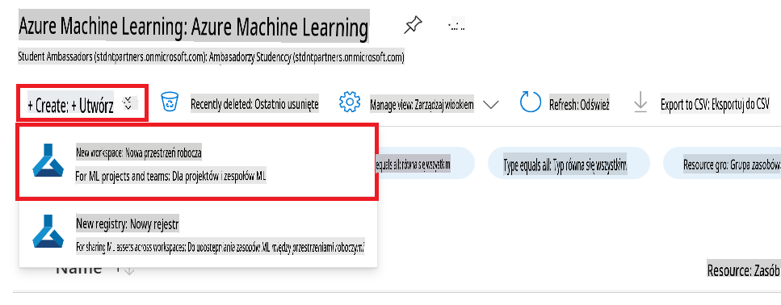

4. Wykonaj następujące kroki:

    - Wybierz swoją **Subskrypcję Azure**.  
    - Wybierz **Grupę zasobów**, której chcesz użyć (utwórz nową, jeśli potrzeba).  
    - Wprowadź **Nazwa przestrzeni roboczej**. Musi być unikalna.  
    - Wybierz **Region**, którego chcesz użyć.  
    - Wybierz **Konto magazynu**, którego chcesz użyć (utwórz nowe, jeśli potrzeba).  
    - Wybierz **Key vault**, którego chcesz użyć (utwórz nowy, jeśli potrzeba).  
    - Wybierz **Application insights**, którego chcesz użyć (utwórz nowy, jeśli potrzeba).  
    - Wybierz **Container registry**, którego chcesz użyć (utwórz nowy, jeśli potrzeba).  

    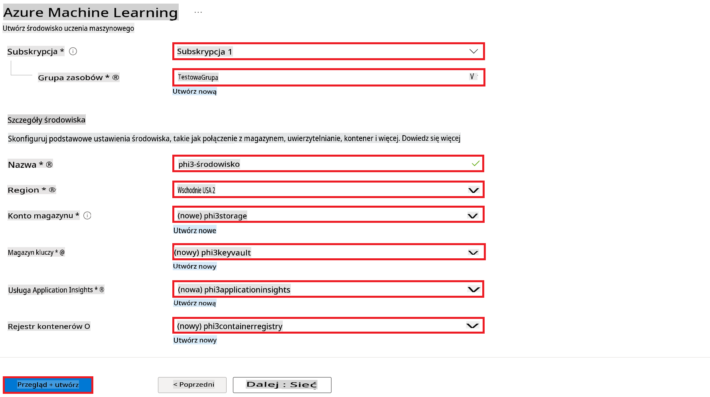

5. Wybierz **Review + Create**.

6. Wybierz **Create**.

### Złóż wniosek o przydział GPU w subskrypcji Azure

W tym samouczku nauczysz się, jak dostosować i wdrożyć model Phi-3, używając GPU. Do dostosowywania użyjesz GPU *Standard_NC24ads_A100_v4*, który wymaga złożenia wniosku o przydział. Do wdrożenia użyjesz GPU *Standard_NC6s_v3*, który również wymaga wniosku o przydział.

> [!NOTE]  
> Tylko subskrypcje typu Pay-As-You-Go (standardowy typ subskrypcji) są uprawnione do przydziału GPU; subskrypcje z benefitami nie są obecnie wspierane.

1. Odwiedź [Azure ML Studio](https://ml.azure.com/home?wt.mc_id=studentamb_279723).

1. Wykonaj następujące kroki, aby złożyć wniosek o przydział *Standard NCADSA100v4 Family*:

    - Wybierz **Quota** z lewego panelu.  
    - Wybierz **Virtual machine family**, której chcesz użyć. Na przykład, wybierz **Standard NCADSA100v4 Family Cluster Dedicated vCPUs**, który obejmuje GPU *Standard_NC24ads_A100_v4*.  
    - Wybierz **Request quota** z menu nawigacyjnego.  

        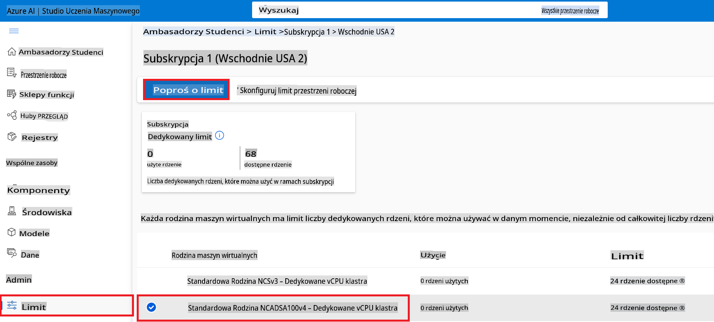

    - Na stronie Request quota wprowadź **Nowy limit rdzeni**, którego chcesz użyć. Na przykład, 24.  
    - Na stronie Request quota wybierz **Submit**, aby złożyć wniosek o przydział GPU.

1. Wykonaj następujące kroki, aby złożyć wniosek o przydział *Standard NCSv3 Family*:

    - Wybierz **Quota** z lewego panelu.  
    - Wybierz **Virtual machine family**, której chcesz użyć. Na przykład, wybierz **Standard NCSv3 Family Cluster Dedicated vCPUs**, który obejmuje GPU *Standard_NC6s_v3*.  
    - Wybierz **Request quota** z menu nawigacyjnego.  
    - Na stronie Request quota wprowadź **Nowy limit rdzeni**, którego chcesz użyć. Na przykład, 24.  
    - Na stronie Request quota wybierz **Submit**, aby złożyć wniosek o przydział GPU.

### Dodaj przypisanie roli

Aby dostosować i wdrożyć swoje modele, musisz najpierw utworzyć Zarządzaną Tożsamość Użytkownika (UAI) i przypisać jej odpowiednie uprawnienia. Ta tożsamość UAI będzie używana do uwierzytelniania podczas wdrażania.

#### Utwórz Zarządzaną Tożsamość Użytkownika (UAI)

1. Wpisz *managed identities* w **pasku wyszukiwania** na górze strony portalu i wybierz **Managed Identities** z wyświetlonych opcji.

    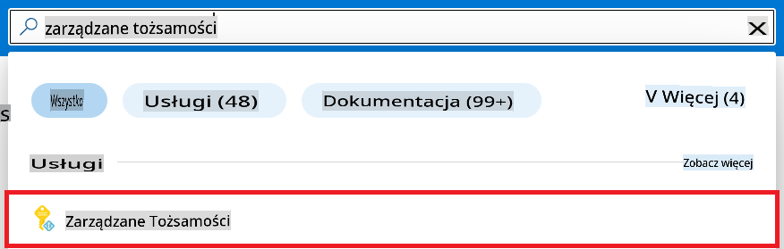

1. Wybierz **+ Create**.

    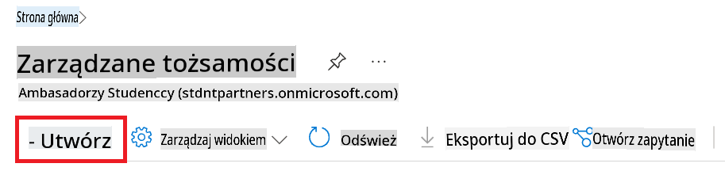

1. Wykonaj następujące kroki:

    - Wybierz swoją **Subskrypcję Azure**.  
    - Wybierz **Grupę zasobów**, której chcesz użyć (utwórz nową, jeśli potrzeba).  
    - Wybierz **Region**, którego chcesz użyć.  
    - Wprowadź **Nazwę**. Musi być unikalna.  

    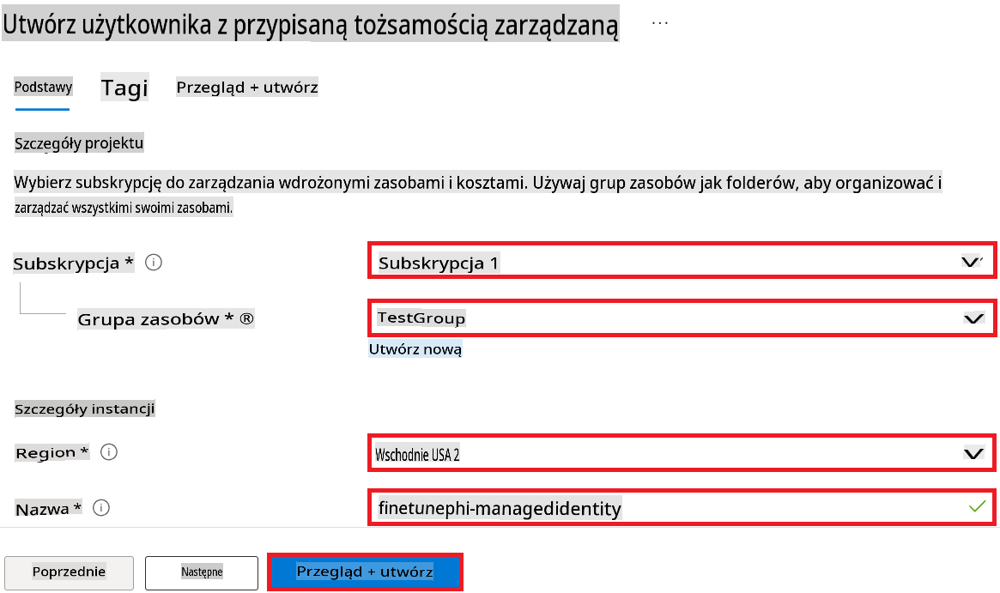

1. Wybierz **Review + create**.

1. Wybierz **+ Create**.

#### Dodaj przypisanie roli Contributor do Zarządzanej Tożsamości

1. Przejdź do zasobu Managed Identity, który utworzyłeś.

1. Wybierz **Azure role assignments** z lewego panelu.

1. Wybierz **+Add role assignment** z menu nawigacyjnego.

1. Na stronie Add role assignment wykonaj następujące kroki:
    - Wybierz **Scope** na **Resource group**.  
    - Wybierz swoją **Subskrypcję Azure**.  
    - Wybierz **Grupę zasobów**, której chcesz użyć.  
    - Wybierz **Rolę** na **Contributor**.  

    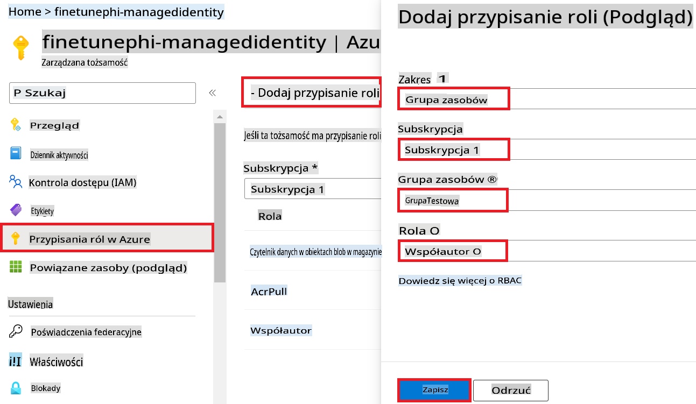

2. Wybierz **Save**.

#### Dodaj przypisanie roli Storage Blob Data Reader do Zarządzanej Tożsamości

1. Wpisz *storage accounts* w **pasku wyszukiwania** na górze strony portalu i wybierz **Storage accounts** z wyświetlonych opcji.

    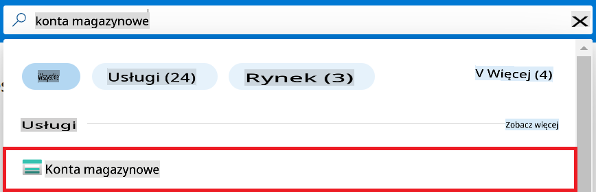

1. Wybierz konto magazynu powiązane z utworzoną przestrzenią roboczą Azure Machine Learning. Na przykład, *finetunephistorage*.  

1. Wykonaj następujące kroki, aby przejść do strony Add role assignment:

    - Przejdź do konta magazynu Azure, które utworzyłeś.  
    - Wybierz **Access Control (IAM)** z lewego panelu.  
    - Wybierz **+ Add** z menu nawigacyjnego.  
    - Wybierz **Add role assignment** z menu nawigacyjnego.  

    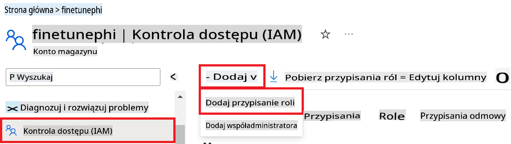

1. Na stronie Add role assignment wykonaj następujące kroki:

    - Na stronie Role wpisz *Storage Blob Data Reader* w **pasku wyszukiwania** i wybierz **Storage Blob Data Reader** z wyświetlonych opcji.  
    - Na stronie Role wybierz **Next**.  
    - Na stronie Members wybierz **Assign access to** **Managed identity**.  
    - Na stronie Members wybierz **+ Select members**.  
    - Na stronie Select managed identities wybierz swoją **Subskrypcję Azure**.  
    - Na stronie Select managed identities wybierz **Managed identity** na **Manage Identity**.  
    - Na stronie Select managed identities wybierz Zarządzaną Tożsamość, którą utworzyłeś. Na przykład, *finetunephi-managedidentity*.  
    - Na stronie Select managed identities wybierz **Select**.  

    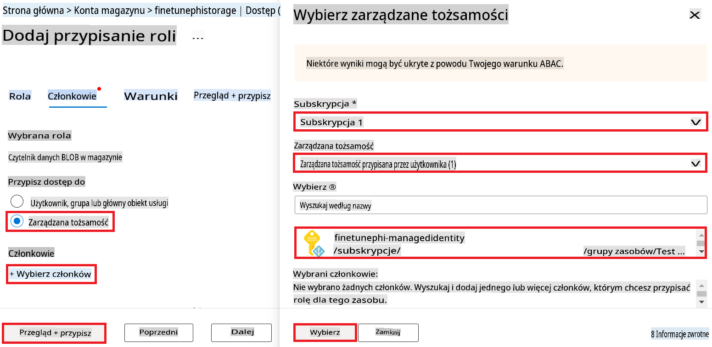

1. Wybierz **Review + assign**.

#### Dodaj przypisanie roli AcrPull do Zarządzanej Tożsamości

1. Wpisz *container registries* w **pasku wyszukiwania** na górze strony portalu i wybierz **Container registries** z wyświetlonych opcji.

    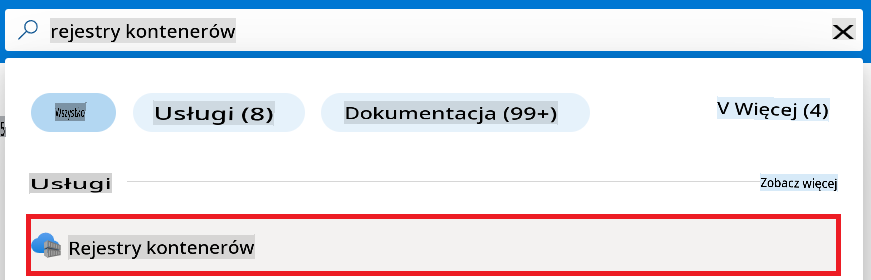

1. Wybierz rejestr kontenerów powiązany z przestrzenią roboczą Azure Machine Learning. Na przykład, *finetunephicontainerregistry*.

1. Wykonaj następujące kroki, aby przejść do strony Add role assignment:

    - Wybierz **Access Control (IAM)** z lewego panelu.  
    - Wybierz **+ Add** z menu nawigacyjnego.  
    - Wybierz **Add role assignment** z menu nawigacyjnego.  

1. Na stronie Add role assignment wykonaj następujące kroki:

    - Na stronie Role wpisz *AcrPull* w **pasku wyszukiwania** i wybierz **AcrPull** z wyświetlonych opcji.  
    - Na stronie Role wybierz **Next**.  
    - Na stronie Members wybierz **Assign access to** **Managed identity**.  
    - Na stronie Members wybierz **+ Select members**.  
    - Na stronie Select managed identities wybierz swoją **Subskrypcję Azure**.  
    - Na stronie Select managed identities wybierz **Managed identity** na **Manage Identity**.  
    - Na stronie Select managed identities wybierz Zarządzaną Tożsamość, którą utworzyłeś. Na przykład, *finetunephi-managedidentity*.  
    - Na stronie Select managed identities wybierz **Select**.  
    - Wybierz **Review + assign**.

### Skonfiguruj projekt

Aby pobrać zestawy danych potrzebne do dostosowywania, skonfigurujesz środowisko lokalne.

W tym ćwiczeniu:

- Utworzysz folder do pracy.  
- Utworzysz wirtualne środowisko.  
- Zainstalujesz wymagane pakiety.  
- Utworzysz plik *download_dataset.py* do pobrania zestawu danych.

#### Utwórz folder do pracy

1. Otwórz okno terminala i wpisz następujące polecenie, aby utworzyć folder o nazwie *finetune-phi* w domyślnej ścieżce.

    ```console
    mkdir finetune-phi
    ```

2. Wpisz następujące polecenie w terminalu, aby przejść do utworzonego folderu *finetune-phi*.

    ```console
    cd finetune-phi
    ```

#### Utwórz wirtualne środowisko

1. Wpisz następujące polecenie w terminalu, aby utworzyć wirtualne środowisko o nazwie *.venv*.

    ```console
    python -m venv .venv
    ```

2. Wpisz następujące polecenie w terminalu, aby aktywować wirtualne środowisko.

    ```console
    .venv\Scripts\activate.bat
    ```

> [!NOTE]  
> Jeśli wszystko działa poprawnie, powinieneś zobaczyć *(.venv)* przed znakiem zachęty w terminalu.

#### Zainstaluj wymagane pakiety

1. Wpisz następujące polecenia w terminalu, aby zainstalować wymagane pakiety.

    ```console
    pip install datasets==2.19.1
    ```

#### Utwórz `download_dataset.py`

> [!NOTE]  
> Struktura folderów:  
> 
> ```text
> └── YourUserName
> .    └── finetune-phi
> .        └── download_dataset.py
> ```

1. Otwórz **Visual Studio Code**.

1. Wybierz **File** z menu głównego.

1. Wybierz **Open Folder**.

1. Wybierz folder *finetune-phi*, który utworzyłeś, znajdujący się w *C:\Users\yourUserName\finetune-phi*.

    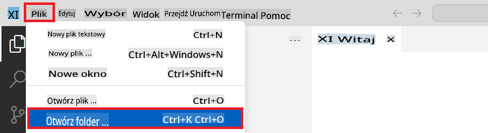

1. W lewym panelu Visual Studio Code kliknij prawym przyciskiem myszy i wybierz **New File**, aby utworzyć nowy plik o nazwie *download_dataset.py*.

    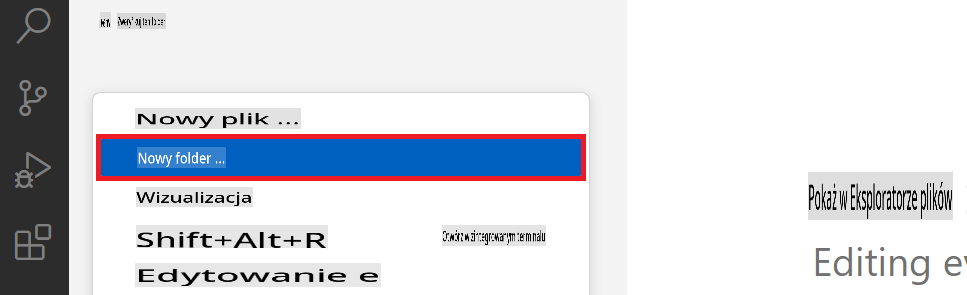

### Przygotuj zestaw danych do dostosowywania

W tym ćwiczeniu uruchomisz plik *download_dataset.py*, aby pobrać zestawy danych *ultrachat_200k* na swoje lokalne środowisko. Następnie użyjesz tych danych do dostosowania modelu Phi-3 w Azure Machine Learning.

W tym ćwiczeniu:

- Dodasz kod do pliku *download_dataset.py*, aby pobrać dane.  
-
1. Odwiedź [Azure ML Studio](https://ml.azure.com/home?wt.mc_id=studentamb_279723).

1. Wybierz **Compute** z menu po lewej stronie.

1. Wybierz **Compute clusters** z menu nawigacyjnego.

1. Kliknij **+ New**.

    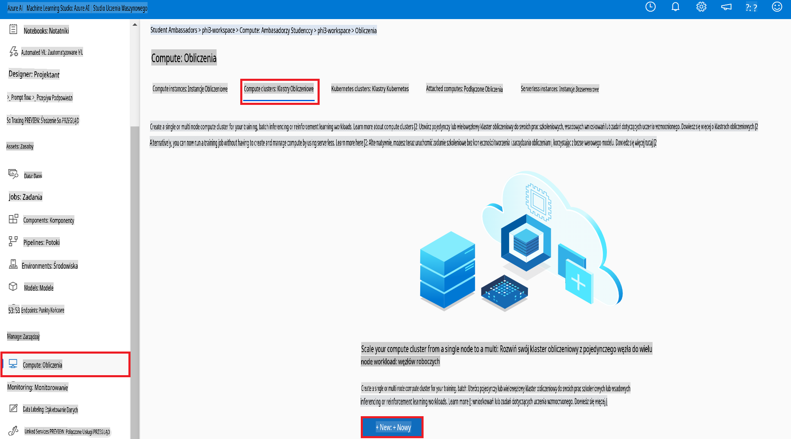

1. Wykonaj następujące kroki:

    - Wybierz **Region**, którego chcesz użyć.
    - Ustaw **Virtual machine tier** na **Dedicated**.
    - Ustaw **Virtual machine type** na **GPU**.
    - Ustaw filtr **Virtual machine size** na **Select from all options**.
    - Wybierz **Virtual machine size** jako **Standard_NC24ads_A100_v4**.

    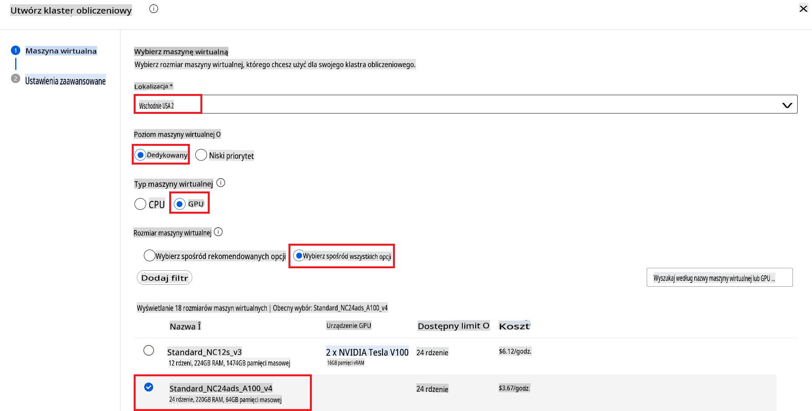

1. Kliknij **Next**.

1. Wykonaj następujące kroki:

    - Wprowadź **Compute name**. Musi być unikalny.
    - Ustaw **Minimum number of nodes** na **0**.
    - Ustaw **Maximum number of nodes** na **1**.
    - Ustaw **Idle seconds before scale down** na **120**.

    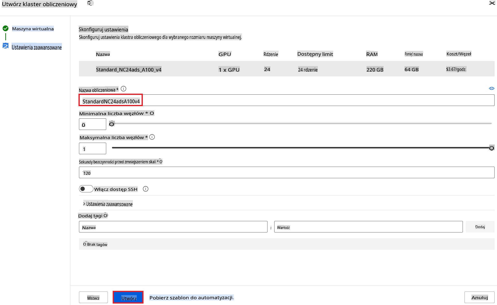

1. Kliknij **Create**.

#### Dostosowanie modelu Phi-3

1. Odwiedź [Azure ML Studio](https://ml.azure.com/home?wt.mc_id=studentamb_279723).

1. Wybierz przestrzeń roboczą Azure Machine Learning, którą utworzyłeś.

    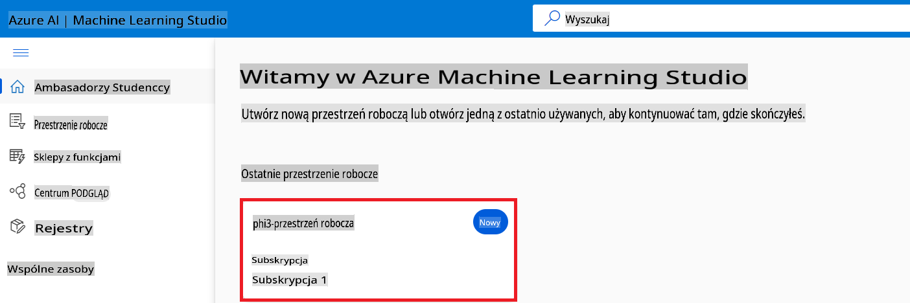

1. Wykonaj następujące kroki:

    - Wybierz **Model catalog** z menu po lewej stronie.
    - Wpisz *phi-3-mini-4k* w **search bar** i wybierz **Phi-3-mini-4k-instruct** z dostępnych opcji.

    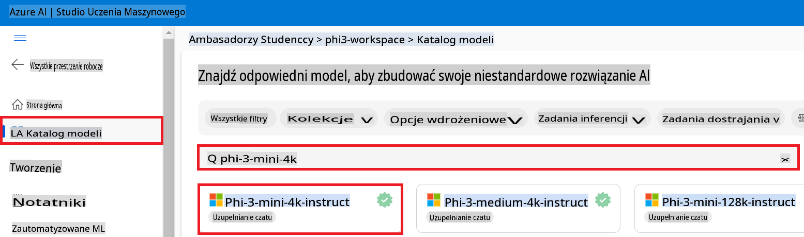

1. Wybierz **Fine-tune** z menu nawigacyjnego.

    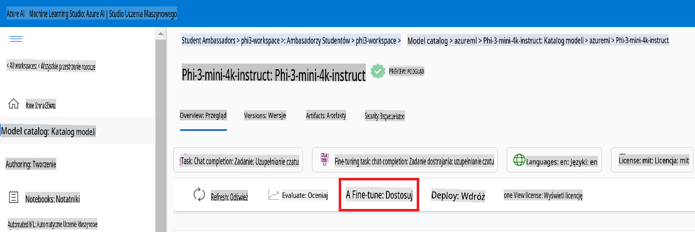

1. Wykonaj następujące kroki:

    - Ustaw **Select task type** na **Chat completion**.
    - Kliknij **+ Select data**, aby przesłać **Traning data**.
    - Ustaw typ przesyłania danych walidacyjnych na **Provide different validation data**.
    - Kliknij **+ Select data**, aby przesłać **Validation data**.

    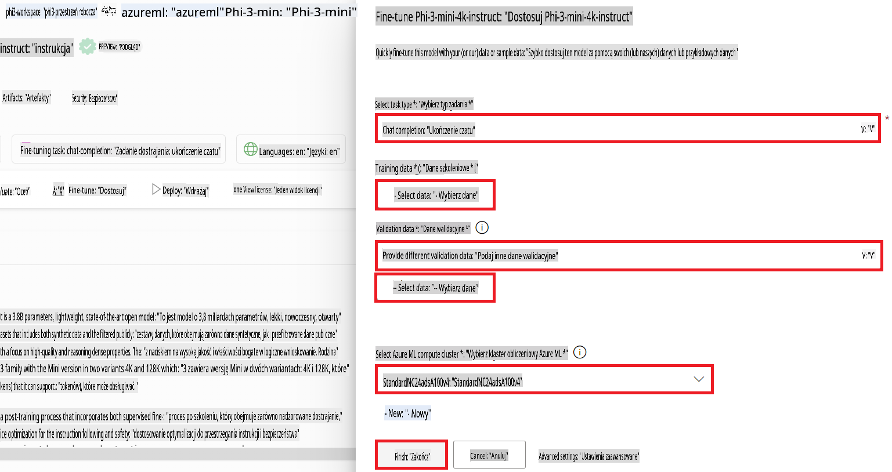

    > [!TIP]
    >
    > Możesz wybrać **Advanced settings**, aby dostosować konfiguracje, takie jak **learning_rate** i **lr_scheduler_type**, w celu zoptymalizowania procesu dostosowywania do swoich potrzeb.

1. Kliknij **Finish**.

1. W tym ćwiczeniu pomyślnie dostosowano model Phi-3 przy użyciu Azure Machine Learning. Należy pamiętać, że proces dostosowywania może zająć dużo czasu. Po uruchomieniu zadania dostosowywania musisz poczekać na jego zakończenie. Status zadania dostosowywania możesz monitorować, przechodząc do zakładki Jobs w menu po lewej stronie w przestrzeni roboczej Azure Machine Learning. W kolejnej części wdrożysz dostosowany model i zintegrowasz go z Prompt flow.

    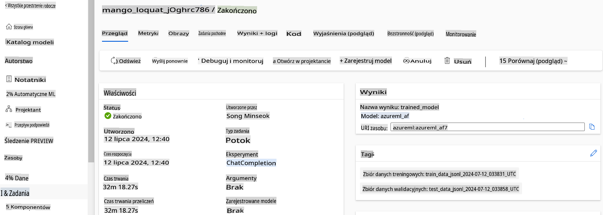

### Wdróż dostosowany model Phi-3

Aby zintegrować dostosowany model Phi-3 z Prompt flow, musisz go wdrożyć, aby był dostępny do inferencji w czasie rzeczywistym. Proces ten obejmuje rejestrację modelu, utworzenie punktu końcowego online i wdrożenie modelu.

W tym ćwiczeniu:

- Zarejestrujesz dostosowany model w przestrzeni roboczej Azure Machine Learning.
- Utworzysz punkt końcowy online.
- Wdrożysz zarejestrowany dostosowany model Phi-3.

#### Zarejestruj dostosowany model

1. Odwiedź [Azure ML Studio](https://ml.azure.com/home?wt.mc_id=studentamb_279723).

1. Wybierz przestrzeń roboczą Azure Machine Learning, którą utworzyłeś.

    

1. Wybierz **Models** z menu po lewej stronie.
1. Kliknij **+ Register**.
1. Wybierz **From a job output**.

    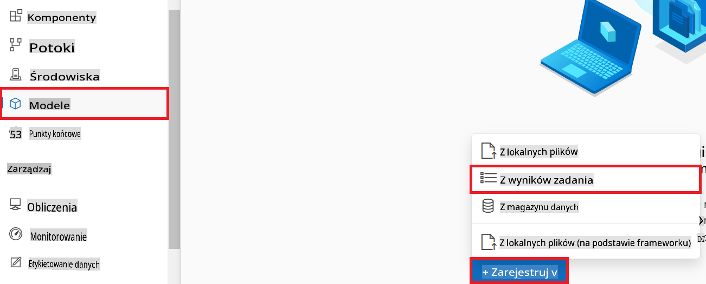

1. Wybierz zadanie, które utworzyłeś.

    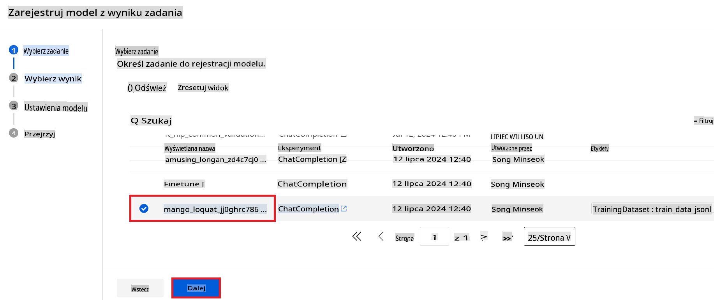

1. Kliknij **Next**.

1. Ustaw **Model type** na **MLflow**.

1. Upewnij się, że **Job output** jest wybrane; powinno być automatycznie zaznaczone.

    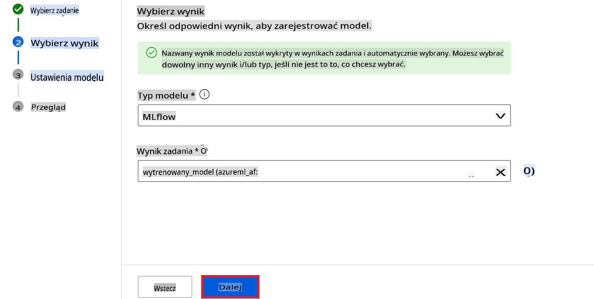

2. Kliknij **Next**.

3. Kliknij **Register**.

    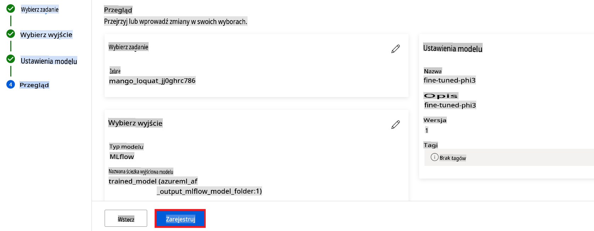

4. Możesz zobaczyć swój zarejestrowany model, przechodząc do menu **Models** w menu po lewej stronie.

    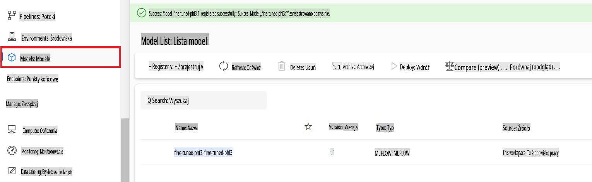

#### Wdróż dostosowany model

1. Przejdź do przestrzeni roboczej Azure Machine Learning, którą utworzyłeś.

1. Wybierz **Endpoints** z menu po lewej stronie.

1. Wybierz **Real-time endpoints** z menu nawigacyjnego.

    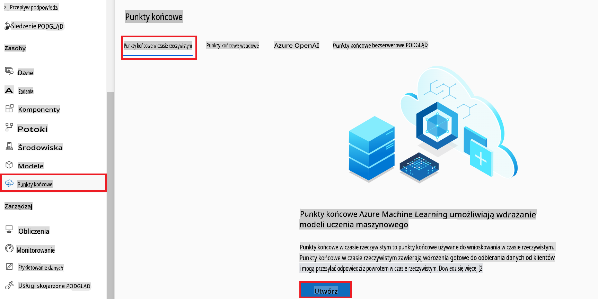

1. Kliknij **Create**.

1. Wybierz zarejestrowany model, który utworzyłeś.

    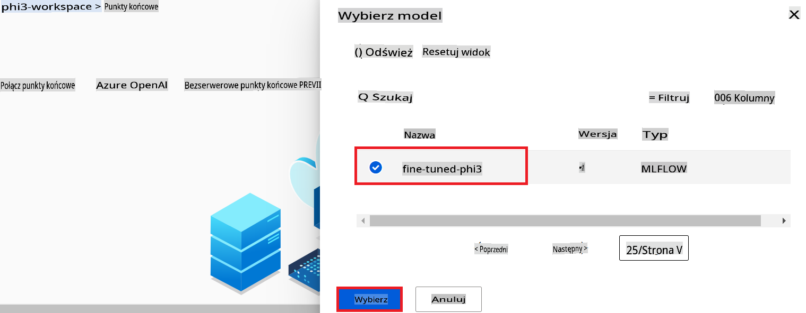

1. Kliknij **Select**.

1. Wykonaj następujące kroki:

    - Ustaw **Virtual machine** na *Standard_NC6s_v3*.
    - Wybierz liczbę instancji **Instance count**, np. *1*.
    - Ustaw **Endpoint** na **New**, aby utworzyć punkt końcowy.
    - Wprowadź **Endpoint name**. Musi być unikalny.
    - Wprowadź **Deployment name**. Musi być unikalny.

    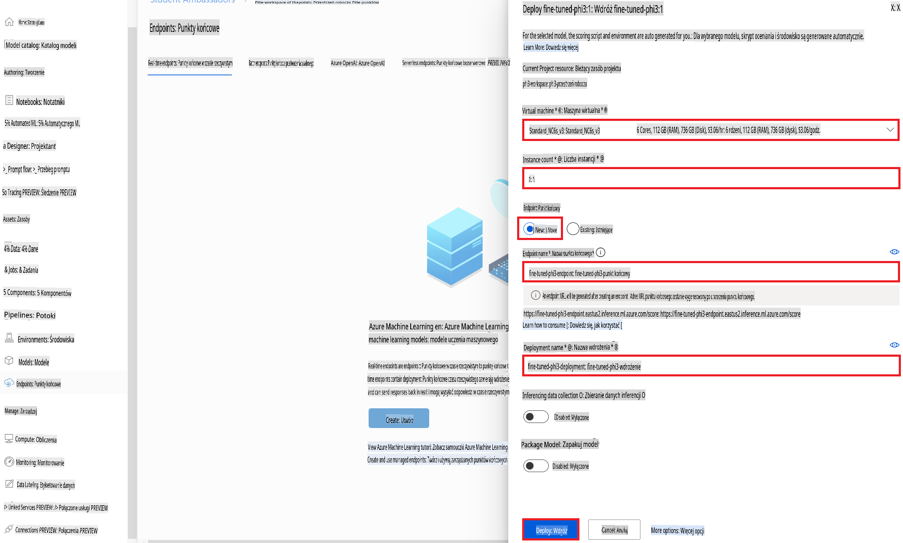

1. Kliknij **Deploy**.

> [!WARNING]
> Aby uniknąć dodatkowych opłat na swoim koncie, pamiętaj o usunięciu utworzonego punktu końcowego w przestrzeni roboczej Azure Machine Learning.
>

#### Sprawdź status wdrożenia w przestrzeni roboczej Azure Machine Learning

1. Przejdź do przestrzeni roboczej Azure Machine Learning, którą utworzyłeś.

1. Wybierz **Endpoints** z menu po lewej stronie.

1. Wybierz punkt końcowy, który utworzyłeś.

    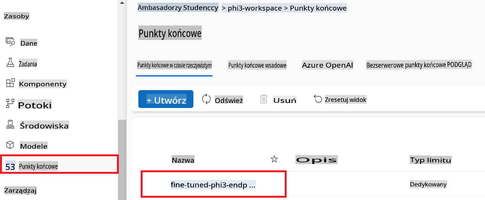

1. Na tej stronie możesz zarządzać punktami końcowymi podczas procesu wdrażania.

> [!NOTE]
> Po zakończeniu wdrożenia upewnij się, że **Live traffic** jest ustawione na **100%**. Jeśli nie jest, wybierz **Update traffic**, aby dostosować ustawienia ruchu. Pamiętaj, że nie możesz testować modelu, jeśli ruch jest ustawiony na 0%.
>
> 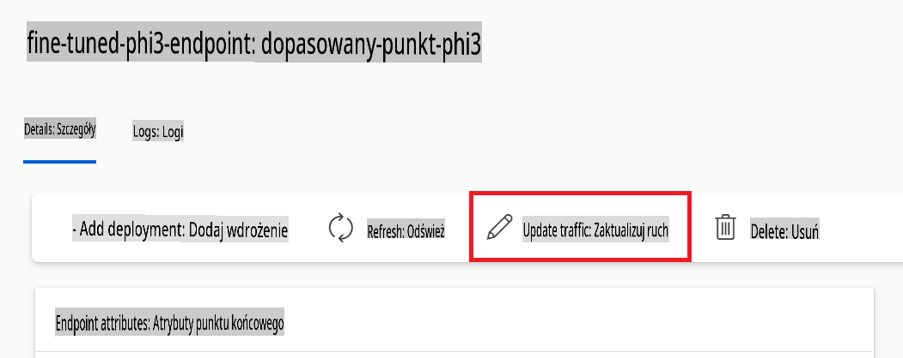
>
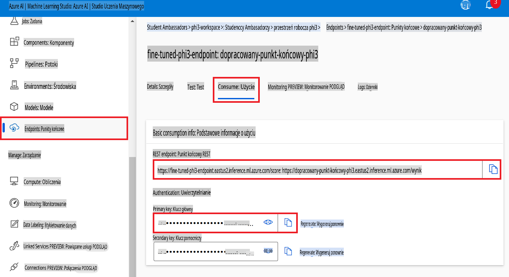

#### Dodaj niestandardowe połączenie

1. Odwiedź [Azure AI Foundry](https://ai.azure.com/?WT.mc_id=aiml-137032-kinfeylo).

1. Przejdź do projektu Azure AI Foundry, który utworzyłeś.

1. W projekcie, który utworzyłeś, wybierz **Settings** z menu po lewej stronie.

1. Wybierz **+ New connection**.

    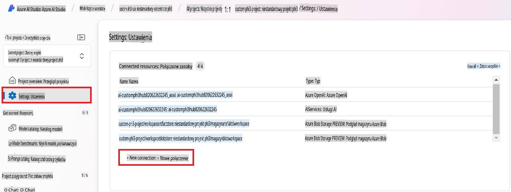

1. Wybierz **Custom keys** z menu nawigacyjnego.

    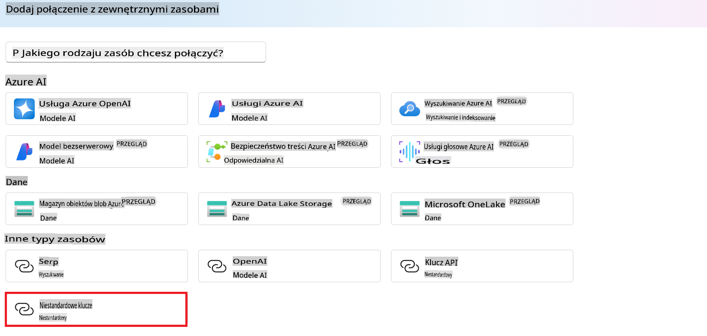

1. Wykonaj następujące kroki:

    - Wybierz **+ Add key value pairs**.
    - Dla nazwy klucza wprowadź **endpoint** i wklej punkt końcowy, który skopiowałeś z Azure ML Studio, w polu wartości.
    - Wybierz ponownie **+ Add key value pairs**.
    - Dla nazwy klucza wprowadź **key** i wklej klucz, który skopiowałeś z Azure ML Studio, w polu wartości.
    - Po dodaniu kluczy zaznacz **is secret**, aby zapobiec ujawnieniu klucza.

    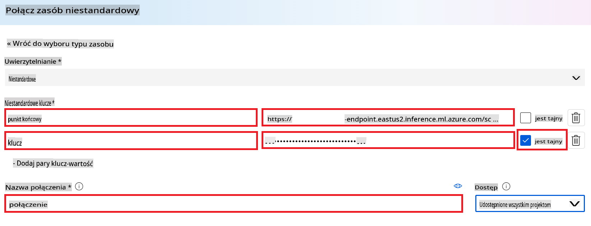

1. Wybierz **Add connection**.

#### Utwórz Prompt flow

Dodałeś niestandardowe połączenie w Azure AI Foundry. Teraz utwórz Prompt flow, korzystając z poniższych kroków. Następnie połącz ten Prompt flow z niestandardowym połączeniem, aby móc używać modelu dostosowanego w Prompt flow.

1. Przejdź do projektu Azure AI Foundry, który utworzyłeś.

1. Wybierz **Prompt flow** z menu po lewej stronie.

1. Wybierz **+ Create** z menu nawigacyjnego.

    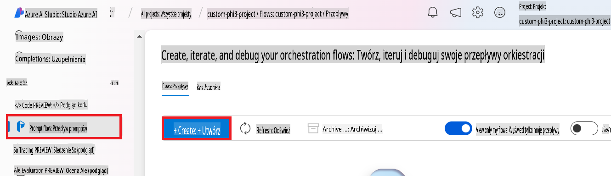

1. Wybierz **Chat flow** z menu nawigacyjnego.

    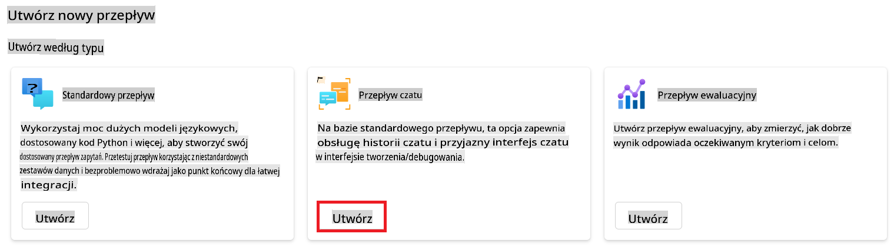

1. Wprowadź **Folder name**, którego chcesz użyć.

    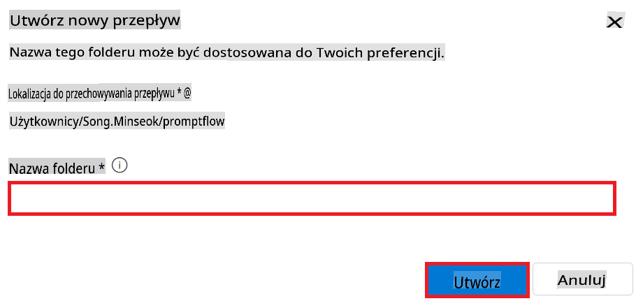

2. Wybierz **Create**.

#### Skonfiguruj Prompt flow do rozmowy z dostosowanym modelem Phi-3

Musisz zintegrować dostosowany model Phi-3 z Prompt flow. Jednak istniejący Prompt flow nie jest zaprojektowany do tego celu. Dlatego musisz przebudować Prompt flow, aby umożliwić integrację niestandardowego modelu.

1. W Prompt flow wykonaj następujące kroki, aby przebudować istniejący flow:

    - Wybierz **Raw file mode**.
    - Usuń cały istniejący kod z pliku *flow.dag.yml*.
    - Dodaj następujący kod do pliku *flow.dag.yml*.

        ```yml
        inputs:
          input_data:
            type: string
            default: "Who founded Microsoft?"

        outputs:
          answer:
            type: string
            reference: ${integrate_with_promptflow.output}

        nodes:
        - name: integrate_with_promptflow
          type: python
          source:
            type: code
            path: integrate_with_promptflow.py
          inputs:
            input_data: ${inputs.input_data}
        ```

    - Wybierz **Save**.

    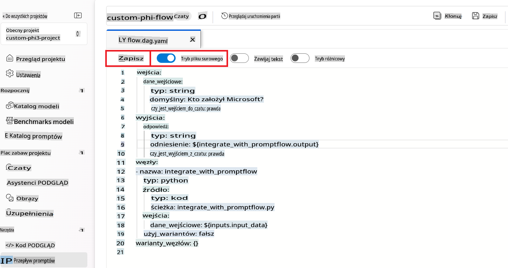

1. Dodaj następujący kod do pliku *integrate_with_promptflow.py*, aby użyć niestandardowego modelu Phi-3 w Prompt flow.

    ```python
    import logging
    import requests
    from promptflow import tool
    from promptflow.connections import CustomConnection

    # Logging setup
    logging.basicConfig(
        format="%(asctime)s - %(levelname)s - %(name)s - %(message)s",
        datefmt="%Y-%m-%d %H:%M:%S",
        level=logging.DEBUG
    )
    logger = logging.getLogger(__name__)

    def query_phi3_model(input_data: str, connection: CustomConnection) -> str:
        """
        Send a request to the Phi-3 model endpoint with the given input data using Custom Connection.
        """

        # "connection" is the name of the Custom Connection, "endpoint", "key" are the keys in the Custom Connection
        endpoint_url = connection.endpoint
        api_key = connection.key

        headers = {
            "Content-Type": "application/json",
            "Authorization": f"Bearer {api_key}"
        }
        data = {
            "input_data": {
                "input_string": [
                    {"role": "user", "content": input_data}
                ],
                "parameters": {
                    "temperature": 0.7,
                    "max_new_tokens": 128
                }
            }
        }
        try:
            response = requests.post(endpoint_url, json=data, headers=headers)
            response.raise_for_status()
            
            # Log the full JSON response
            logger.debug(f"Full JSON response: {response.json()}")

            result = response.json()["output"]
            logger.info("Successfully received response from Azure ML Endpoint.")
            return result
        except requests.exceptions.RequestException as e:
            logger.error(f"Error querying Azure ML Endpoint: {e}")
            raise

    @tool
    def my_python_tool(input_data: str, connection: CustomConnection) -> str:
        """
        Tool function to process input data and query the Phi-3 model.
        """
        return query_phi3_model(input_data, connection)

    ```

    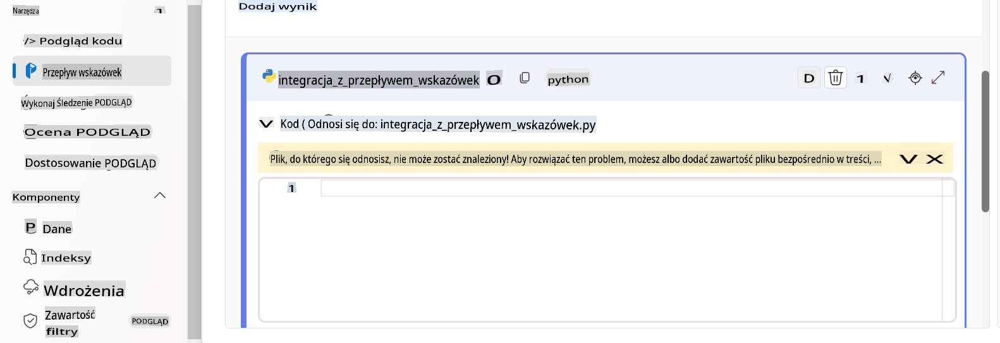

> [!NOTE]
> Szczegółowe informacje na temat używania Prompt flow w Azure AI Foundry znajdziesz w [Prompt flow w Azure AI Foundry](https://learn.microsoft.com/azure/ai-studio/how-to/prompt-flow).

1. Wybierz **Chat input**, **Chat output**, aby umożliwić rozmowę z modelem.

    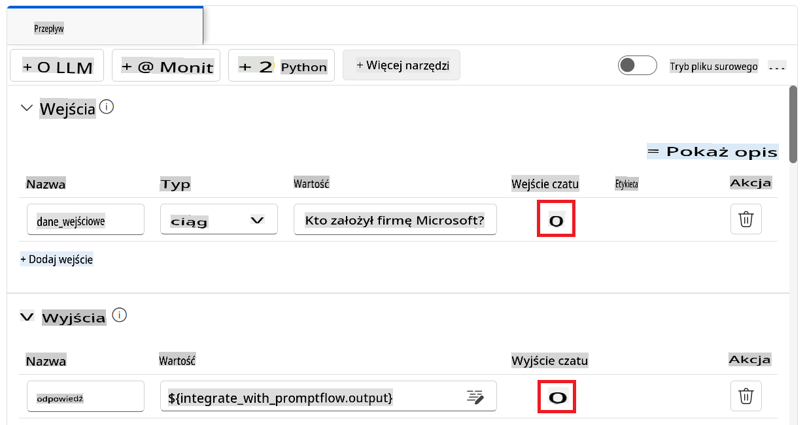

1. Teraz możesz rozmawiać z dostosowanym modelem Phi-3. W następnym ćwiczeniu dowiesz się, jak uruchomić Prompt flow i używać go do rozmowy z dostosowanym modelem Phi-3.

> [!NOTE]
>
> Przebudowany flow powinien wyglądać jak na poniższym obrazku:
>
> 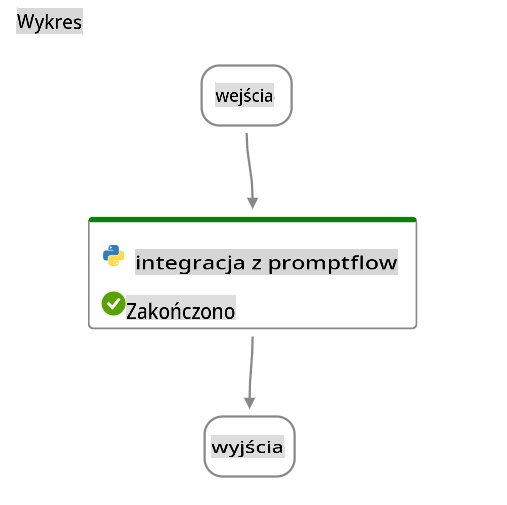
>

### Rozmowa z dostosowanym modelem Phi-3

Teraz, gdy dostosowałeś i zintegrowałeś swój model Phi-3 z Prompt flow, jesteś gotowy, aby rozpocząć interakcję z nim. To ćwiczenie przeprowadzi Cię przez proces konfiguracji i inicjowania rozmowy z modelem przy użyciu Prompt flow. Postępując zgodnie z tymi krokami, będziesz mógł w pełni wykorzystać możliwości swojego dostosowanego modelu Phi-3 do różnych zadań i rozmów.

- Rozmawiaj z dostosowanym modelem Phi-3 za pomocą Prompt flow.

#### Uruchom Prompt flow

1. Wybierz **Start compute sessions**, aby uruchomić Prompt flow.

    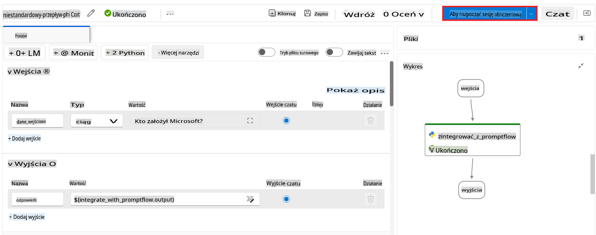

1. Wybierz **Validate and parse input**, aby odświeżyć parametry.

    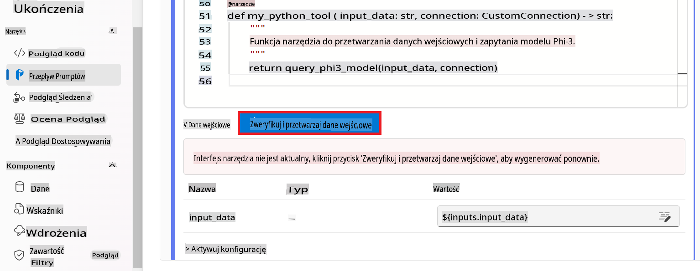

1. Wybierz **Value** dla **connection** do niestandardowego połączenia, które utworzyłeś. Na przykład *connection*.

    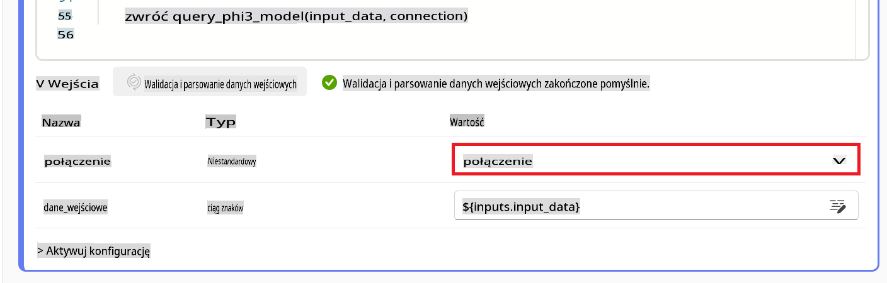

#### Rozmowa z dostosowanym modelem

1. Wybierz **Chat**.

    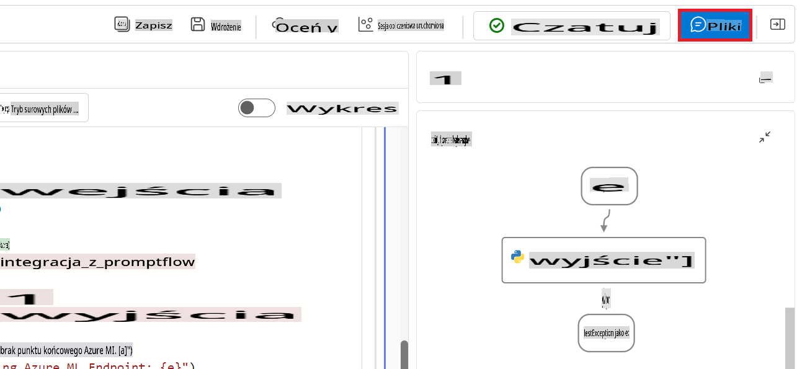

1. Oto przykład wyników: Teraz możesz rozmawiać z dostosowanym modelem Phi-3. Zaleca się zadawanie pytań opartych na danych użytych do dostosowania.

    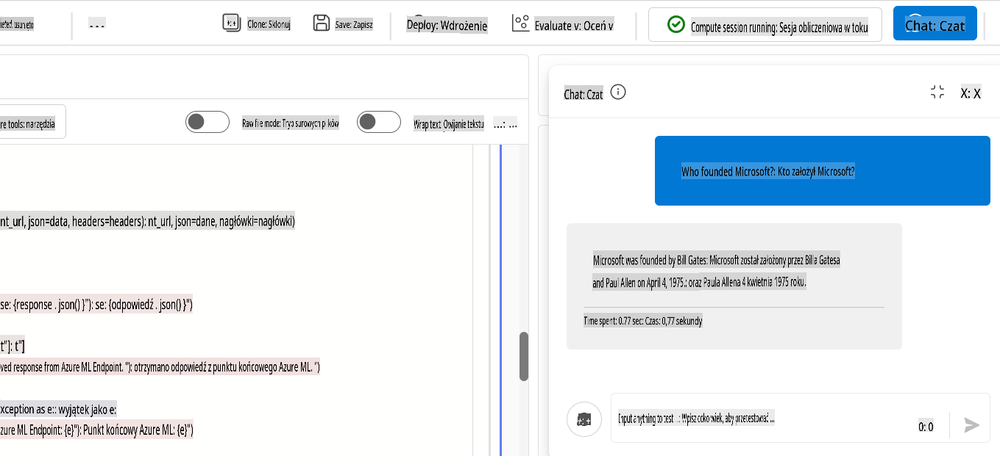

**Zastrzeżenie**:  
Ten dokument został przetłumaczony za pomocą usług tłumaczenia maszynowego opartego na sztucznej inteligencji. Chociaż staramy się zapewnić dokładność, prosimy pamiętać, że automatyczne tłumaczenia mogą zawierać błędy lub nieścisłości. Oryginalny dokument w jego rodzimym języku powinien być uważany za wiarygodne źródło. W przypadku informacji o kluczowym znaczeniu zalecane jest skorzystanie z profesjonalnego tłumaczenia przez człowieka. Nie ponosimy odpowiedzialności za jakiekolwiek nieporozumienia lub błędne interpretacje wynikające z użycia tego tłumaczenia.