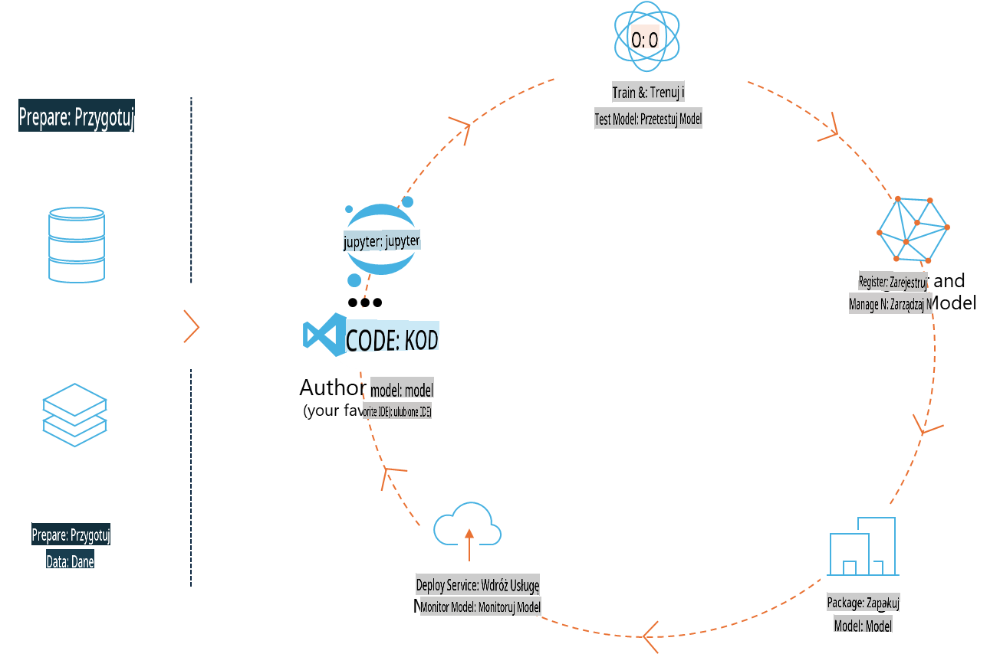
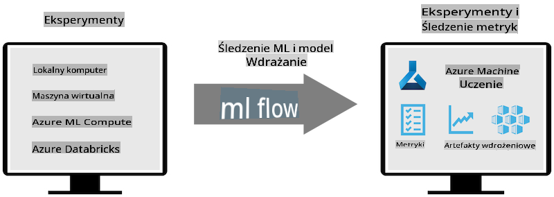
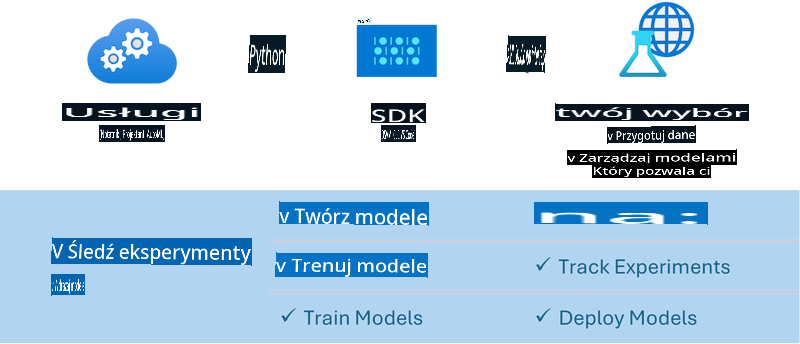

# MLflow

[MLflow](https://mlflow.org/) to otwartoźródłowa platforma zaprojektowana do zarządzania pełnym cyklem życia uczenia maszynowego.



MLFlow jest używane do zarządzania cyklem życia ML, w tym eksperymentami, replikowalnością, wdrażaniem oraz centralnym rejestrem modeli. Obecnie MLFlow oferuje cztery główne komponenty:

- **MLflow Tracking:** Rejestruj i przeszukuj eksperymenty, kod, konfiguracje danych oraz wyniki.
- **MLflow Projects:** Pakuj kod nauki o danych w formacie pozwalającym na odtwarzanie uruchomień na dowolnej platformie.
- **Mlflow Models:** Wdrażaj modele uczenia maszynowego w różnych środowiskach serwowania.
- **Model Registry:** Przechowuj, opisuj i zarządzaj modelami w centralnym repozytorium.

Platforma oferuje funkcje śledzenia eksperymentów, pakowania kodu w celu replikowalnych uruchomień oraz udostępniania i wdrażania modeli. MLFlow jest zintegrowane z Databricks i obsługuje różne biblioteki ML, dzięki czemu jest niezależne od konkretnej biblioteki. Może być używane z dowolną biblioteką uczenia maszynowego i w dowolnym języku programowania, ponieważ zapewnia REST API oraz CLI dla wygody użytkownika.



Kluczowe funkcje MLFlow to:

- **Śledzenie Eksperymentów:** Rejestruj i porównuj parametry oraz wyniki.
- **Zarządzanie Modelami:** Wdrażaj modele na różnych platformach serwowania i wnioskowania.
- **Rejestr Modeli:** Współpracuj przy zarządzaniu cyklem życia modeli MLflow, w tym wersjonowaniem i adnotacjami.
- **Projekty:** Pakuj kod ML do udostępniania lub użycia produkcyjnego.

MLFlow wspiera również pętlę MLOps, obejmującą przygotowanie danych, rejestrację i zarządzanie modelami, pakowanie modeli do wykonania, wdrażanie usług oraz monitorowanie modeli. Jego celem jest uproszczenie przejścia od prototypu do przepływu pracy w środowisku produkcyjnym, zwłaszcza w chmurze i na urządzeniach brzegowych.

## Scenariusz E2E - Budowa wrappera i użycie Phi-3 jako modelu MLFlow

W tym przykładzie E2E pokażemy dwa różne podejścia do budowy wrappera wokół małego modelu językowego Phi-3 (SLM), a następnie uruchomimy go jako model MLFlow lokalnie lub w chmurze, np. w przestrzeni roboczej Azure Machine Learning.



| Projekt | Opis | Lokalizacja |
| ------------ | ----------- | -------- |
| Transformer Pipeline | Transformer Pipeline to najprostsza opcja budowy wrappera, jeśli chcesz użyć modelu HuggingFace z eksperymentalnym wsparciem dla transformers w MLFlow. | [**TransformerPipeline.ipynb**](../../../../../../code/06.E2E/E2E_Phi-3-MLflow_TransformerPipeline.ipynb) |
| Niestandardowy Wrapper Python | W momencie pisania, pipeline transformer nie wspierał generowania wrappera MLFlow dla modeli HuggingFace w formacie ONNX, nawet z użyciem eksperymentalnej paczki optimum Python. W takich przypadkach możesz stworzyć niestandardowy wrapper Python dla trybu MLFlow. | [**CustomPythonWrapper.ipynb**](../../../../../../code/06.E2E/E2E_Phi-3-MLflow_CustomPythonWrapper.ipynb) |

## Projekt: Transformer Pipeline

1. Będziesz potrzebować odpowiednich paczek Python z MLFlow i HuggingFace:

    ``` Python
    import mlflow
    import transformers
    ```

2. Następnie należy zainicjować pipeline transformera, odwołując się do modelu Phi-3 w rejestrze HuggingFace. Jak można zauważyć na karcie modelu _Phi-3-mini-4k-instruct_, jego zadaniem jest „Generowanie Tekstu”:

    ``` Python
    pipeline = transformers.pipeline(
        task = "text-generation",
        model = "microsoft/Phi-3-mini-4k-instruct"
    )
    ```

3. Teraz możesz zapisać pipeline transformera modelu Phi-3 w formacie MLFlow i podać dodatkowe szczegóły, takie jak ścieżka do artefaktów, konkretne ustawienia konfiguracji modelu i typ API inferencji:

    ``` Python
    model_info = mlflow.transformers.log_model(
        transformers_model = pipeline,
        artifact_path = "phi3-mlflow-model",
        model_config = model_config,
        task = "llm/v1/chat"
    )
    ```

## Projekt: Niestandardowy Wrapper Python

1. Możemy tutaj wykorzystać [ONNX Runtime generate() API](https://github.com/microsoft/onnxruntime-genai) firmy Microsoft do wnioskowania modelu ONNX oraz kodowania/odkodowywania tokenów. Musisz wybrać paczkę _onnxruntime_genai_ dla docelowego środowiska obliczeniowego, w poniższym przykładzie skierowaną na CPU:

    ``` Python
    import mlflow
    from mlflow.models import infer_signature
    import onnxruntime_genai as og
    ```

1. Nasza niestandardowa klasa implementuje dwie metody: _load_context()_ do inicjalizacji **modelu ONNX** Phi-3 Mini 4K Instruct, **parametrów generatora** oraz **tokenizera**; oraz _predict()_ do generowania tokenów wyjściowych na podstawie podanego promptu:

    ``` Python
    class Phi3Model(mlflow.pyfunc.PythonModel):
        def load_context(self, context):
            # Retrieving model from the artifacts
            model_path = context.artifacts["phi3-mini-onnx"]
            model_options = {
                 "max_length": 300,
                 "temperature": 0.2,         
            }
        
            # Defining the model
            self.phi3_model = og.Model(model_path)
            self.params = og.GeneratorParams(self.phi3_model)
            self.params.set_search_options(**model_options)
            
            # Defining the tokenizer
            self.tokenizer = og.Tokenizer(self.phi3_model)
    
        def predict(self, context, model_input):
            # Retrieving prompt from the input
            prompt = model_input["prompt"][0]
            self.params.input_ids = self.tokenizer.encode(prompt)
    
            # Generating the model's response
            response = self.phi3_model.generate(self.params)
    
            return self.tokenizer.decode(response[0][len(self.params.input_ids):])
    ```

1. Możesz teraz użyć funkcji _mlflow.pyfunc.log_model()_ do wygenerowania niestandardowego wrappera Python (w formacie pickle) dla modelu Phi-3, wraz z oryginalnym modelem ONNX i wymaganymi zależnościami:

    ``` Python
    model_info = mlflow.pyfunc.log_model(
        artifact_path = artifact_path,
        python_model = Phi3Model(),
        artifacts = {
            "phi3-mini-onnx": "cpu_and_mobile/cpu-int4-rtn-block-32-acc-level-4",
        },
        input_example = input_example,
        signature = infer_signature(input_example, ["Run"]),
        extra_pip_requirements = ["torch", "onnxruntime_genai", "numpy"],
    )
    ```

## Sygnatury generowanych modeli MLFlow

1. W kroku 3 projektu Transformer Pipeline powyżej ustawiliśmy zadanie modelu MLFlow na „_llm/v1/chat_”. Takie ustawienie generuje wrapper API modelu, kompatybilny z API Chat OpenAI, jak pokazano poniżej:

    ``` Python
    {inputs: 
      ['messages': Array({content: string (required), name: string (optional), role: string (required)}) (required), 'temperature': double (optional), 'max_tokens': long (optional), 'stop': Array(string) (optional), 'n': long (optional), 'stream': boolean (optional)],
    outputs: 
      ['id': string (required), 'object': string (required), 'created': long (required), 'model': string (required), 'choices': Array({finish_reason: string (required), index: long (required), message: {content: string (required), name: string (optional), role: string (required)} (required)}) (required), 'usage': {completion_tokens: long (required), prompt_tokens: long (required), total_tokens: long (required)} (required)],
    params: 
      None}
    ```

1. W rezultacie możesz przesłać swój prompt w następującym formacie:

    ``` Python
    messages = [{"role": "user", "content": "What is the capital of Spain?"}]
    ```

1. Następnie użyj post-processingu kompatybilnego z API OpenAI, np. _response[0][‘choices’][0][‘message’][‘content’]_, aby sformatować wynik do czegoś takiego:

    ``` JSON
    Question: What is the capital of Spain?
    
    Answer: The capital of Spain is Madrid. It is the largest city in Spain and serves as the political, economic, and cultural center of the country. Madrid is located in the center of the Iberian Peninsula and is known for its rich history, art, and architecture, including the Royal Palace, the Prado Museum, and the Plaza Mayor.
    
    Usage: {'prompt_tokens': 11, 'completion_tokens': 73, 'total_tokens': 84}
    ```

1. W kroku 3 projektu Niestandardowy Wrapper Python pozwalamy paczce MLFlow wygenerować sygnaturę modelu na podstawie podanego przykładu wejściowego. Sygnatura wrappera MLFlow będzie wyglądała następująco:

    ``` Python
    {inputs: 
      ['prompt': string (required)],
    outputs: 
      [string (required)],
    params: 
      None}
    ```

1. Tak więc nasz prompt musi zawierać klucz słownika "prompt", podobny do tego:

    ``` Python
    {"prompt": "<|system|>You are a stand-up comedian.<|end|><|user|>Tell me a joke about atom<|end|><|assistant|>",}
    ```

1. Wyjście modelu zostanie dostarczone w formacie tekstowym:

    ``` JSON
    Alright, here's a little atom-related joke for you!
    
    Why don't electrons ever play hide and seek with protons?
    
    Because good luck finding them when they're always "sharing" their electrons!
    
    Remember, this is all in good fun, and we're just having a little atomic-level humor!
    ```

**Zastrzeżenie**:  
Ten dokument został przetłumaczony za pomocą automatycznych usług tłumaczeniowych opartych na sztucznej inteligencji. Chociaż dokładamy wszelkich starań, aby tłumaczenie było precyzyjne, prosimy mieć na uwadze, że automatyczne tłumaczenia mogą zawierać błędy lub nieścisłości. Oryginalny dokument w jego rodzimym języku powinien być uznawany za wiążące źródło. W przypadku kluczowych informacji zaleca się skorzystanie z profesjonalnego tłumaczenia przez człowieka. Nie ponosimy odpowiedzialności za jakiekolwiek nieporozumienia lub błędne interpretacje wynikające z użycia tego tłumaczenia.