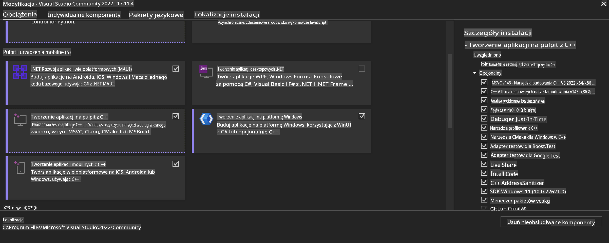
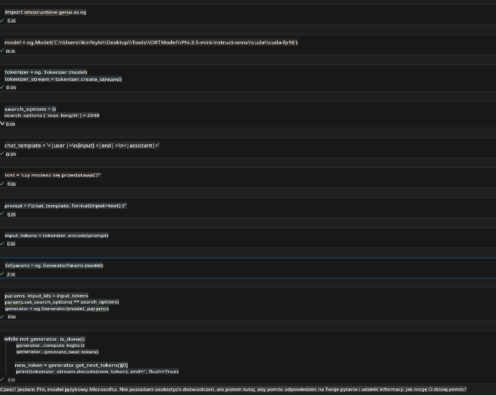
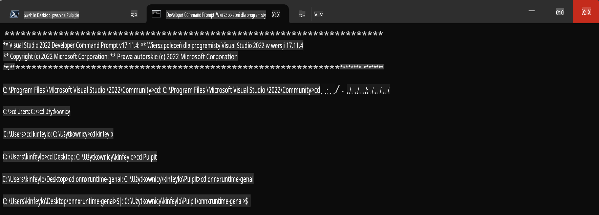

# **Wytyczne dla OnnxRuntime GenAI na Windows GPU**

Te wytyczne zawierają kroki dotyczące konfiguracji i używania ONNX Runtime (ORT) z GPU na Windows. Mają na celu pomóc w wykorzystaniu akceleracji GPU dla Twoich modeli, co poprawi wydajność i efektywność.

Dokument zawiera wskazówki dotyczące:

- Konfiguracji środowiska: Instrukcje dotyczące instalacji niezbędnych zależności, takich jak CUDA, cuDNN i ONNX Runtime.
- Konfiguracji: Jak skonfigurować środowisko i ONNX Runtime, aby efektywnie korzystać z zasobów GPU.
- Wskazówek optymalizacyjnych: Porady, jak dostroić ustawienia GPU dla optymalnej wydajności.

### **1. Python 3.10.x /3.11.8**

   ***Uwaga*** Zaleca się użycie [miniforge](https://github.com/conda-forge/miniforge/releases/latest/download/Miniforge3-Windows-x86_64.exe) jako środowiska Pythona

   ```bash

   conda create -n pydev python==3.11.8

   conda activate pydev

   ```

   ***Przypomnienie*** Jeśli masz zainstalowaną jakąkolwiek bibliotekę ONNX dla Pythona, odinstaluj ją

### **2. Instalacja CMake za pomocą winget**

   ```bash

   winget install -e --id Kitware.CMake

   ```

### **3. Instalacja Visual Studio 2022 - Desktop Development with C++**

   ***Uwaga*** Jeśli nie chcesz kompilować, możesz pominąć ten krok



### **4. Instalacja sterownika NVIDIA**

1. **Sterownik GPU NVIDIA**  [https://www.nvidia.com/en-us/drivers/](https://www.nvidia.com/en-us/drivers/)

2. **NVIDIA CUDA 12.4** [https://developer.nvidia.com/cuda-12-4-0-download-archive](https://developer.nvidia.com/cuda-12-4-0-download-archive)

3. **NVIDIA CUDNN 9.4**  [https://developer.nvidia.com/cudnn-downloads](https://developer.nvidia.com/cudnn-downloads)

***Przypomnienie*** Użyj domyślnych ustawień podczas instalacji

### **5. Ustawienie środowiska NVIDIA**

Skopiuj pliki NVIDIA CUDNN 9.4 (lib, bin, include) do odpowiednich folderów NVIDIA CUDA 12.4 (lib, bin, include)

- skopiuj pliki z *'C:\Program Files\NVIDIA\CUDNN\v9.4\bin\12.6'* do  *'C:\Program Files\NVIDIA GPU Computing Toolkit\CUDA\v12.4\bin*

- skopiuj pliki z *'C:\Program Files\NVIDIA\CUDNN\v9.4\include\12.6'* do  *'C:\Program Files\NVIDIA GPU Computing Toolkit\CUDA\v12.4\include*

- skopiuj pliki z *'C:\Program Files\NVIDIA\CUDNN\v9.4\lib\12.6'* do  *'C:\Program Files\NVIDIA GPU Computing Toolkit\CUDA\v12.4\lib\x64'*

### **6. Pobranie Phi-3.5-mini-instruct-onnx**

   ```bash

   winget install -e --id Git.Git

   winget install -e --id GitHub.GitLFS

   git lfs install

   git clone https://huggingface.co/microsoft/Phi-3.5-mini-instruct-onnx

   ```

### **7. Uruchomienie InferencePhi35Instruct.ipynb**

   Otwórz [Notebook](../../../../../../code/09.UpdateSamples/Aug/ortgpu-phi35-instruct.ipynb) i wykonaj kod



### **8. Kompilacja ORT GenAI GPU**

   ***Uwaga*** 
   
   1. Najpierw odinstaluj wszystkie biblioteki związane z onnx, onnxruntime i onnxruntime-genai

   
   ```bash

   pip list 
   
   ```

   Następnie odinstaluj wszystkie biblioteki onnxruntime, np.:

   ```bash

   pip uninstall onnxruntime

   pip uninstall onnxruntime-genai

   pip uninstall onnxruntume-genai-cuda
   
   ```

   2. Sprawdź obsługę rozszerzeń Visual Studio 

   Sprawdź folder *C:\Program Files\NVIDIA GPU Computing Toolkit\CUDA\v12.4\extras*, aby upewnić się, że znajduje się tam *C:\Program Files\NVIDIA GPU Computing Toolkit\CUDA\v12.4\extras\visual_studio_integration*. 

   Jeśli folder nie istnieje, sprawdź inne foldery sterownika CUDA Toolkit i skopiuj folder *visual_studio_integration* do *C:\Program Files\NVIDIA GPU Computing Toolkit\CUDA\v12.4\extras\visual_studio_integration*.

   - Jeśli nie chcesz kompilować, możesz pominąć ten krok

   ```bash

   git clone https://github.com/microsoft/onnxruntime-genai

   ```

   - Pobierz [https://github.com/microsoft/onnxruntime/releases/download/v1.19.2/onnxruntime-win-x64-gpu-1.19.2.zip](https://github.com/microsoft/onnxruntime/releases/download/v1.19.2/onnxruntime-win-x64-gpu-1.19.2.zip)

   - Rozpakuj plik *onnxruntime-win-x64-gpu-1.19.2.zip*, zmień nazwę folderu na **ort**, a następnie skopiuj folder *ort* do *onnxruntime-genai*

   - Używając Windows Terminal, przejdź do Developer Command Prompt for VS 2022 i wejdź do folderu *onnxruntime-genai*



   - Skompiluj projekt w swoim środowisku Pythona

   ```bash

   cd onnxruntime-genai

   python build.py --use_cuda  --cuda_home "C:\Program Files\NVIDIA GPU Computing Toolkit\CUDA\v12.4" --config Release
 

   cd build/Windows/Release/Wheel

   pip install .whl

   ```

**Zastrzeżenie**:  
Ten dokument został przetłumaczony przy użyciu usług tłumaczenia maszynowego opartego na sztucznej inteligencji. Chociaż staramy się zapewnić dokładność, prosimy pamiętać, że automatyczne tłumaczenia mogą zawierać błędy lub nieścisłości. Oryginalny dokument w jego rodzimym języku powinien być uznawany za wiążące źródło. W przypadku informacji krytycznych zaleca się skorzystanie z profesjonalnego tłumaczenia przez człowieka. Nie ponosimy odpowiedzialności za jakiekolwiek nieporozumienia lub błędne interpretacje wynikające z użycia tego tłumaczenia.