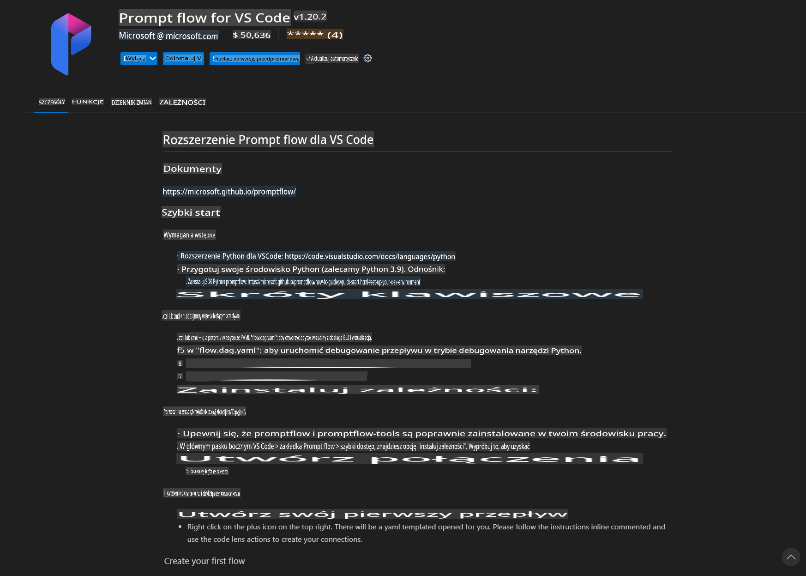
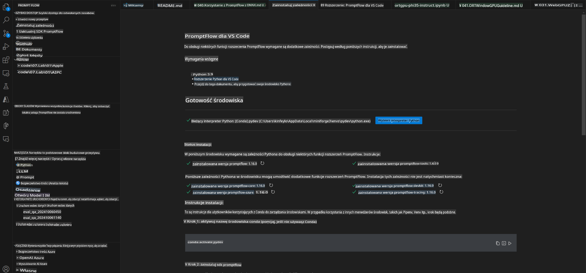
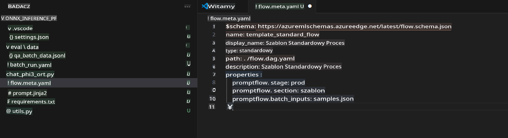
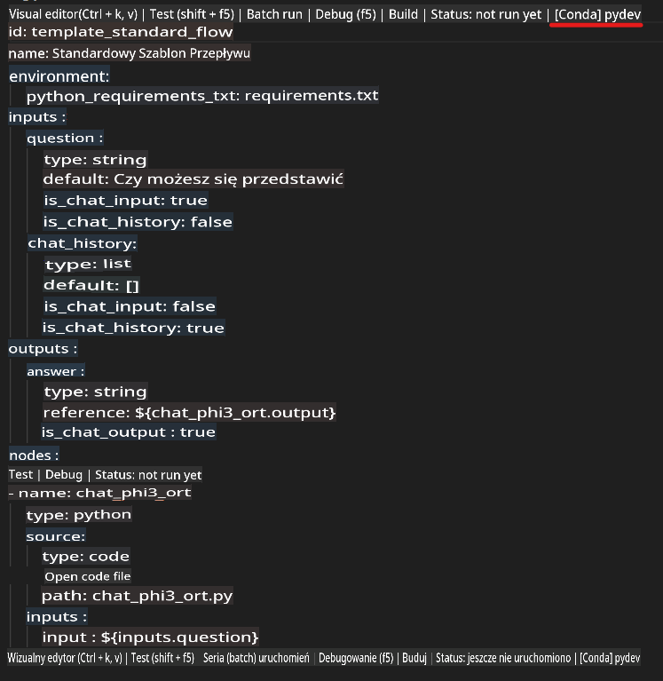
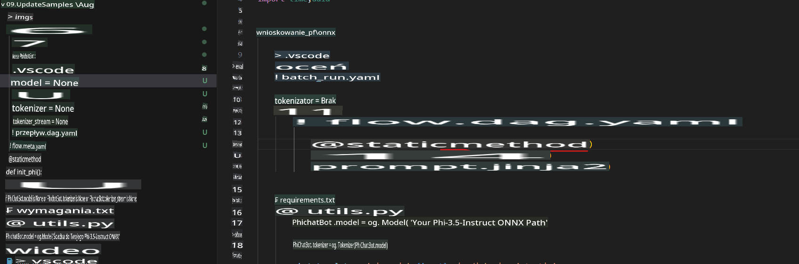
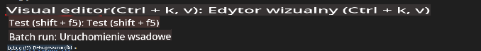
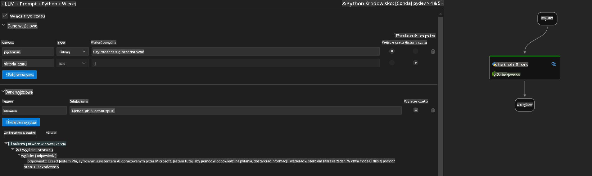
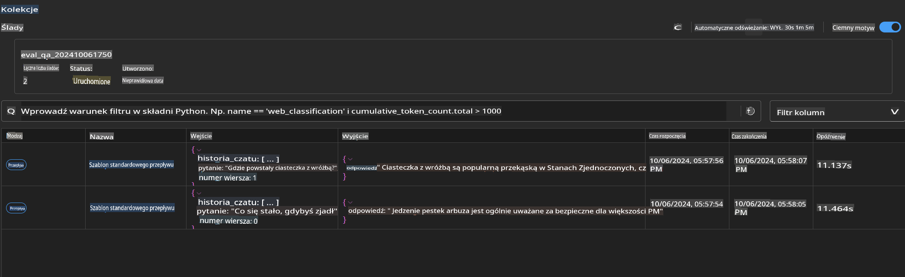

# Korzystanie z GPU w Windows do tworzenia rozwiązania Prompt Flow z Phi-3.5-Instruct ONNX

Poniższy dokument to przykład, jak używać PromptFlow z ONNX (Open Neural Network Exchange) do tworzenia aplikacji AI opartych na modelach Phi-3.

PromptFlow to zestaw narzędzi deweloperskich zaprojektowanych, aby usprawnić cały cykl rozwoju aplikacji AI opartych na LLM (Large Language Model), od pomysłu i prototypowania po testowanie i ocenę.

Integrując PromptFlow z ONNX, deweloperzy mogą:

- **Optymalizować wydajność modeli**: Wykorzystać ONNX do efektywnego wnioskowania i wdrażania modeli.
- **Uprościć rozwój**: Używać PromptFlow do zarządzania przepływem pracy i automatyzacji powtarzalnych zadań.
- **Zwiększyć współpracę**: Ułatwić współpracę w zespole dzięki zapewnieniu zintegrowanego środowiska deweloperskiego.

**Prompt flow** to zestaw narzędzi deweloperskich, który usprawnia cały cykl tworzenia aplikacji AI opartych na LLM — od pomysłu, prototypowania, testowania, oceny aż po wdrożenie produkcyjne i monitorowanie. Upraszcza inżynierię promptów i pozwala budować aplikacje LLM o jakości produkcyjnej.

Prompt flow może łączyć się z OpenAI, Azure OpenAI Service oraz modelami konfigurowalnymi (Huggingface, lokalne LLM/SLM). Planujemy wdrożyć skwantowany model ONNX Phi-3.5 do lokalnych aplikacji. Prompt flow pomoże nam lepiej zaplanować nasz biznes i zrealizować lokalne rozwiązania oparte na Phi-3.5. W tym przykładzie połączymy bibliotekę ONNX Runtime GenAI, aby ukończyć rozwiązanie Prompt flow na bazie GPU w Windows.

## **Instalacja**

### **ONNX Runtime GenAI dla GPU w Windows**

Zapoznaj się z tym przewodnikiem, aby skonfigurować ONNX Runtime GenAI dla GPU w Windows [kliknij tutaj](./ORTWindowGPUGuideline.md)

### **Konfiguracja Prompt flow w VSCode**

1. Zainstaluj rozszerzenie Prompt flow dla VS Code



2. Po zainstalowaniu rozszerzenia Prompt flow, kliknij je, a następnie wybierz **Installation dependencies** i postępuj zgodnie z tym przewodnikiem, aby zainstalować SDK Prompt flow w swoim środowisku



3. Pobierz [Przykładowy kod](../../../../../../code/09.UpdateSamples/Aug/pf/onnx_inference_pf) i otwórz go w VS Code



4. Otwórz plik **flow.dag.yaml**, aby wybrać swoje środowisko Python



   Otwórz plik **chat_phi3_ort.py**, aby zmienić lokalizację modelu Phi-3.5-instruct ONNX



5. Uruchom swój prompt flow, aby przetestować

Otwórz plik **flow.dag.yaml** i kliknij edytor wizualny



po kliknięciu, uruchom go, aby przetestować



1. Możesz uruchomić batch w terminalu, aby sprawdzić więcej wyników

```bash

pf run create --file batch_run.yaml --stream --name 'Your eval qa name'    

```

Możesz sprawdzić wyniki w swojej domyślnej przeglądarce



**Zastrzeżenie**:  
Ten dokument został przetłumaczony za pomocą usług tłumaczenia maszynowego opartego na sztucznej inteligencji. Chociaż dokładamy wszelkich starań, aby tłumaczenie było precyzyjne, prosimy mieć na uwadze, że automatyczne tłumaczenia mogą zawierać błędy lub nieścisłości. Oryginalny dokument w jego rodzimym języku powinien być uznawany za źródło wiążące. W przypadku informacji krytycznych zaleca się skorzystanie z profesjonalnego tłumaczenia wykonanego przez człowieka. Nie ponosimy odpowiedzialności za jakiekolwiek nieporozumienia lub błędne interpretacje wynikające z użycia tego tłumaczenia.