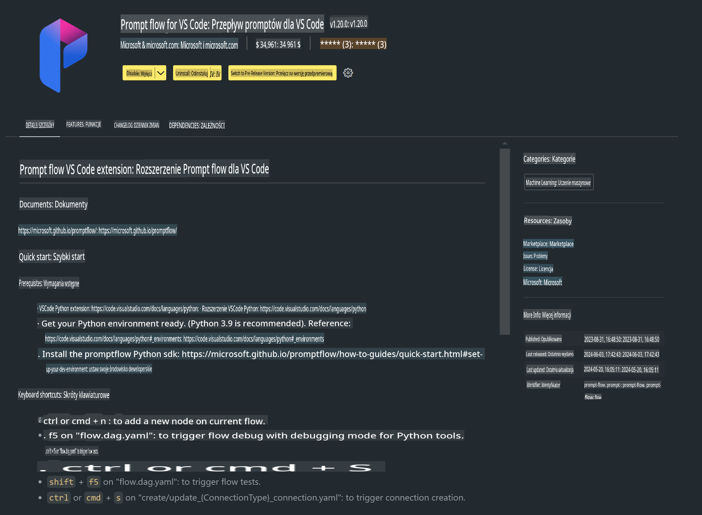

# **Lab 0 - Instalacja**

Kiedy wchodzimy do Labu, musimy skonfigurować odpowiednie środowisko:


### **1. Python 3.11+**

Zaleca się użycie miniforge do skonfigurowania środowiska Python.

Aby skonfigurować miniforge, zapoznaj się z [https://github.com/conda-forge/miniforge](https://github.com/conda-forge/miniforge)

Po skonfigurowaniu miniforge, uruchom następujące polecenie w PowerShell:

```bash

conda create -n pyenv python==3.11.8 -y

conda activate pyenv

```


### **2. Instalacja Prompt flow SDK**

W Labie 1 używamy Prompt flow, więc musisz skonfigurować Prompt flow SDK.

```bash

pip install promptflow --upgrade

```

Możesz sprawdzić Prompt flow SDK za pomocą tego polecenia:

```bash

pf --version

```


### **3. Instalacja rozszerzenia Prompt flow dla Visual Studio Code**




### **4. Biblioteka przyspieszająca Intel NPU**

Nowa generacja procesorów Intela obsługuje NPU. Jeśli chcesz używać NPU do lokalnego uruchamiania LLM/SLM, możesz skorzystać z ***Intel NPU Acceleration Library***. Aby dowiedzieć się więcej, zapoznaj się z [https://github.com/microsoft/PhiCookBook/blob/main/md/01.Introduction/03/AIPC_Inference.md](https://github.com/microsoft/PhiCookBook/blob/main/md/01.Introduction/03/AIPC_Inference.md).

Zainstaluj Intel NPU Acceleration Library w bash:

```bash

pip install intel-npu-acceleration-library

```

***Uwaga***: Proszę pamiętać, że ta biblioteka obsługuje transformers w wersji ***4.40.2***, upewnij się, że masz odpowiednią wersję.


### **5. Inne biblioteki Pythona**

Utwórz plik requirements.txt i dodaj do niego następującą zawartość:

```txt

notebook
numpy 
scipy 
scikit-learn 
matplotlib 
pandas 
pillow 
graphviz

```


### **6. Instalacja NVM**

Zainstaluj nvm w PowerShell:

```bash

winget install -e --id CoreyButler.NVMforWindows

```

Zainstaluj nodejs w wersji 18.20:

```bash

nvm install 18.20.0

nvm use 18.20.0

```


### **7. Instalacja wsparcia deweloperskiego dla Visual Studio Code**

```bash

npm install --global yo generator-code

```

Gratulacje! Pomyślnie skonfigurowałeś SDK. Teraz przejdź do praktycznych kroków.

**Zastrzeżenie**:  
Ten dokument został przetłumaczony za pomocą usług tłumaczenia maszynowego opartego na sztucznej inteligencji. Chociaż dokładamy wszelkich starań, aby zapewnić dokładność, prosimy mieć na uwadze, że automatyczne tłumaczenia mogą zawierać błędy lub nieścisłości. Oryginalny dokument w jego rodzimym języku powinien być uznawany za wiążące źródło. W przypadku informacji krytycznych zaleca się skorzystanie z profesjonalnego tłumaczenia wykonywanego przez człowieka. Nie ponosimy odpowiedzialności za jakiekolwiek nieporozumienia lub błędne interpretacje wynikające z użycia tego tłumaczenia.