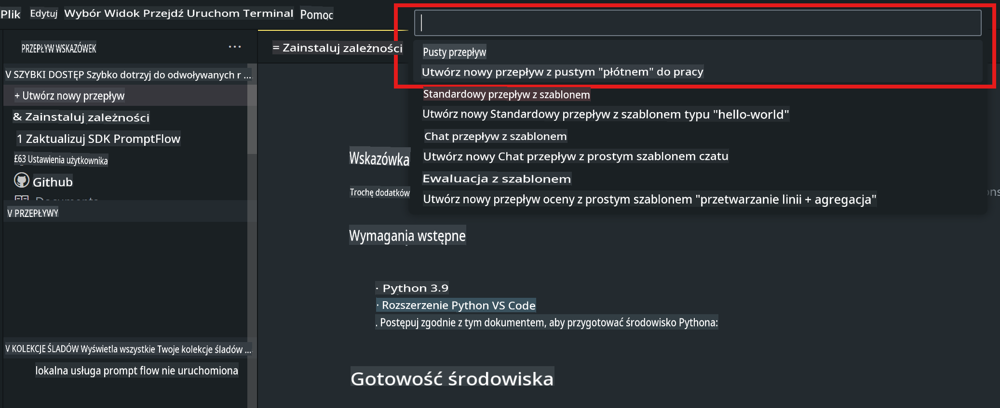
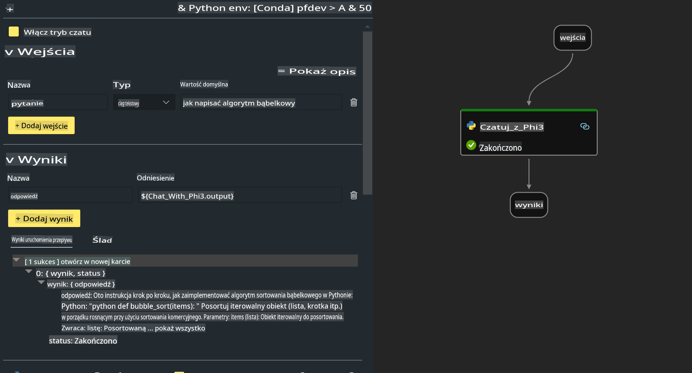

# **Lab 2 - Uruchamianie Prompt flow z Phi-3-mini na AIPC**

## **Czym jest Prompt flow**

Prompt flow to zestaw narzędzi deweloperskich zaprojektowanych, aby uprościć cały cykl tworzenia aplikacji AI opartych na dużych modelach językowych (LLM) – od pomysłu, przez prototypowanie, testowanie, ocenę, aż po wdrożenie produkcyjne i monitorowanie. Ułatwia inżynierię promptów i pozwala na budowanie aplikacji LLM o jakości produkcyjnej.

Dzięki Prompt flow możesz:

- Tworzyć przepływy łączące LLM, prompty, kod w Pythonie i inne narzędzia w wykonalny workflow.

- Debugować i iterować swoje przepływy, w szczególności interakcje z LLM, w prosty sposób.

- Ocenić swoje przepływy, obliczać wskaźniki jakości i wydajności na większych zestawach danych.

- Zintegrować testowanie i ocenę z systemem CI/CD, aby zapewnić jakość swojego przepływu.

- Wdrażać swoje przepływy na wybraną platformę serwerową lub łatwo integrować je z kodem swojej aplikacji.

- (Opcjonalnie, ale bardzo zalecane) Współpracować z zespołem, korzystając z wersji chmurowej Prompt flow w Azure AI.

## **Czym jest AIPC**

Komputer AI (AI PC) wyposażony jest w CPU, GPU i NPU, z których każdy ma specyficzne możliwości przyspieszania zadań związanych ze sztuczną inteligencją. NPU, czyli jednostka przetwarzania neuronowego, to specjalistyczny akcelerator, który obsługuje zadania związane z AI i uczeniem maszynowym (ML) bezpośrednio na komputerze, zamiast przesyłać dane do przetwarzania w chmurze. GPU i CPU również mogą obsługiwać te zadania, ale NPU szczególnie dobrze radzi sobie z obliczeniami AI przy niskim zużyciu energii. AI PC stanowi fundamentalną zmianę w sposobie działania naszych komputerów. Nie jest to rozwiązanie problemu, który wcześniej nie istniał, ale raczej znaczące usprawnienie codziennego użytkowania komputerów.

Jak to działa? W porównaniu do generatywnej AI i masywnych dużych modeli językowych (LLM) trenowanych na ogromnych ilościach publicznych danych, AI działające na Twoim komputerze jest bardziej przystępne na każdym poziomie. Koncept jest łatwiejszy do zrozumienia, a ponieważ jest trenowane na Twoich danych, bez konieczności korzystania z chmury, korzyści są bardziej natychmiastowe i atrakcyjne dla szerszego grona użytkowników.

W krótkim okresie świat AI PC obejmuje osobistych asystentów i mniejsze modele AI działające bezpośrednio na Twoim komputerze, wykorzystujące Twoje dane do oferowania bardziej osobistych, prywatnych i bezpiecznych ulepszeń AI dla codziennych zadań – takich jak sporządzanie notatek ze spotkań, organizowanie ligi fantasy football, automatyzacja ulepszeń edycji zdjęć i wideo, czy tworzenie idealnego planu rodzinnego zjazdu na podstawie czasów przyjazdów i odjazdów wszystkich uczestników.

## **Budowanie przepływów generowania kodu na AIPC**

***Note***: Jeśli nie ukończyłeś instalacji środowiska, odwiedź [Lab 0 - Installations](./01.Installations.md)

1. Otwórz rozszerzenie Prompt flow w Visual Studio Code i utwórz pusty projekt przepływu.



2. Dodaj parametry wejściowe i wyjściowe oraz dodaj kod w Pythonie jako nowy przepływ.



Możesz odnieść się do tej struktury (flow.dag.yaml), aby skonstruować swój przepływ.

```yaml

inputs:
  question:
    type: string
    default: how to write Bubble Algorithm
outputs:
  answer:
    type: string
    reference: ${Chat_With_Phi3.output}
nodes:
- name: Chat_With_Phi3
  type: python
  source:
    type: code
    path: Chat_With_Phi3.py
  inputs:
    question: ${inputs.question}


```

3. Dodaj kod w ***Chat_With_Phi3.py***.

```python


from promptflow.core import tool

# import torch
from transformers import AutoTokenizer, pipeline,TextStreamer
import intel_npu_acceleration_library as npu_lib

import warnings

import asyncio
import platform

class Phi3CodeAgent:
    
    model = None
    tokenizer = None
    text_streamer = None
    
    model_id = "microsoft/Phi-3-mini-4k-instruct"

    @staticmethod
    def init_phi3():
        
        if Phi3CodeAgent.model is None or Phi3CodeAgent.tokenizer is None or Phi3CodeAgent.text_streamer is None:
            Phi3CodeAgent.model = npu_lib.NPUModelForCausalLM.from_pretrained(
                                    Phi3CodeAgent.model_id,
                                    torch_dtype="auto",
                                    dtype=npu_lib.int4,
                                    trust_remote_code=True
                                )
            Phi3CodeAgent.tokenizer = AutoTokenizer.from_pretrained(Phi3CodeAgent.model_id)
            Phi3CodeAgent.text_streamer = TextStreamer(Phi3CodeAgent.tokenizer, skip_prompt=True)

    

    @staticmethod
    def chat_with_phi3(prompt):
        
        Phi3CodeAgent.init_phi3()

        messages = "<|system|>You are a AI Python coding assistant. Please help me to generate code in Python.The answer only genertated Python code, but any comments and instructions do not need to be generated<|end|><|user|>" + prompt +"<|end|><|assistant|>"


        generation_args = {
            "max_new_tokens": 1024,
            "return_full_text": False,
            "temperature": 0.3,
            "do_sample": False,
            "streamer": Phi3CodeAgent.text_streamer,
        }

        pipe = pipeline(
            "text-generation",
            model=Phi3CodeAgent.model,
            tokenizer=Phi3CodeAgent.tokenizer,
            # **generation_args
        )

        result = ''

        with warnings.catch_warnings():
            warnings.simplefilter("ignore")
            response = pipe(messages, **generation_args)
            result =response[0]['generated_text']
            return result


@tool
def my_python_tool(question: str) -> str:
    if platform.system() == 'Windows':
        asyncio.set_event_loop_policy(asyncio.WindowsSelectorEventLoopPolicy())
    return Phi3CodeAgent.chat_with_phi3(question)


```

4. Możesz przetestować przepływ za pomocą Debug lub Run, aby sprawdzić, czy generowanie kodu działa poprawnie.


5. Uruchom przepływ jako API developerskie w terminalu.

```

pf flow serve --source ./ --port 8080 --host localhost   

```

Możesz przetestować go w Postman / Thunder Client.

### **Uwagi**

1. Pierwsze uruchomienie zajmuje dużo czasu. Zaleca się pobranie modelu phi-3 z Hugging Face CLI.

2. Biorąc pod uwagę ograniczoną moc obliczeniową Intel NPU, zaleca się użycie Phi-3-mini-4k-instruct.

3. Używamy przyspieszenia Intel NPU do konwersji kwantyzacji INT4, ale jeśli ponownie uruchamiasz usługę, musisz usunąć foldery cache i nc_workshop.

## **Zasoby**

1. Poznaj Promptflow [https://microsoft.github.io/promptflow/](https://microsoft.github.io/promptflow/)

2. Poznaj Intel NPU Acceleration [https://github.com/intel/intel-npu-acceleration-library](https://github.com/intel/intel-npu-acceleration-library)

3. Kod przykładowy, pobierz [Local NPU Agent Sample Code](../../../../../../../../../code/07.Lab/01/AIPC)

**Zastrzeżenie**:  
Niniejszy dokument został przetłumaczony przy użyciu usług tłumaczenia maszynowego opartego na sztucznej inteligencji. Chociaż dokładamy wszelkich starań, aby zapewnić dokładność, prosimy pamiętać, że automatyczne tłumaczenia mogą zawierać błędy lub nieścisłości. Oryginalny dokument w jego rodzimym języku powinien być uznawany za wiarygodne źródło. W przypadku informacji krytycznych zaleca się skorzystanie z profesjonalnego tłumaczenia dokonywanego przez człowieka. Nie ponosimy odpowiedzialności za jakiekolwiek nieporozumienia lub błędne interpretacje wynikające z użycia tego tłumaczenia.