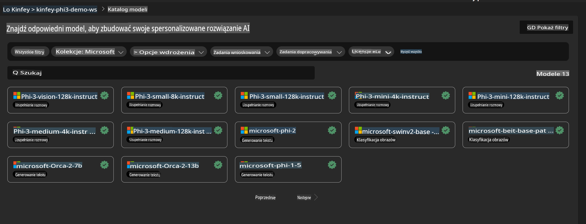
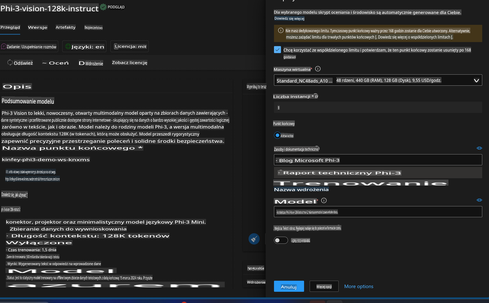
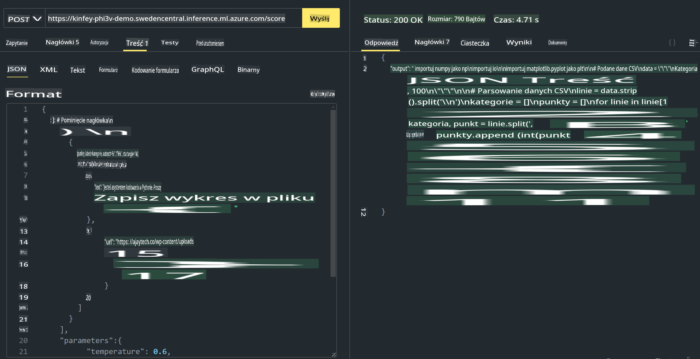

# **Lab 3 - Wdrażanie Phi-3-Vision w Azure Machine Learning Service**

Używamy NPU, aby zrealizować wdrożenie produkcyjne lokalnego kodu, a następnie chcemy wprowadzić możliwość wykorzystania PHI-3-VISION, aby generować kod na podstawie obrazów.

W tym wprowadzeniu szybko zbudujemy usługę Model As Service Phi-3 Vision w Azure Machine Learning Service.

***Uwaga***: Phi-3 Vision wymaga mocy obliczeniowej, aby szybciej generować treści. Potrzebujemy mocy obliczeniowej w chmurze, aby to osiągnąć.

### **1. Utwórz Azure Machine Learning Service**

Musimy utworzyć Azure Machine Learning Service w portalu Azure. Jeśli chcesz dowiedzieć się, jak to zrobić, odwiedź ten link [https://learn.microsoft.com/azure/machine-learning/quickstart-create-resources?view=azureml-api-2](https://learn.microsoft.com/azure/machine-learning/quickstart-create-resources?view=azureml-api-2)

### **2. Wybierz Phi-3 Vision w Azure Machine Learning Service**



### **3. Wdróż Phi-3-Vision w Azure**



### **4. Przetestuj Endpoint w Postman**



***Uwaga***

1. Przekazywane parametry muszą zawierać Authorization, azureml-model-deployment oraz Content-Type. Należy sprawdzić informacje o wdrożeniu, aby je uzyskać.

2. Aby przekazać parametry, Phi-3-Vision wymaga przesłania linku do obrazu. Proszę odnieść się do metody GPT-4-Vision, aby przesłać parametry, na przykład:

```json

{
  "input_data":{
    "input_string":[
      {
        "role":"user",
        "content":[ 
          {
            "type": "text",
            "text": "You are a Python coding assistant.Please create Python code for image "
          },
          {
              "type": "image_url",
              "image_url": {
                "url": "https://ajaytech.co/wp-content/uploads/2019/09/index.png"
              }
          }
        ]
      }
    ],
    "parameters":{
          "temperature": 0.6,
          "top_p": 0.9,
          "do_sample": false,
          "max_new_tokens": 2048
    }
  }
}

```

3. Wywołaj **/score** metodą Post.

**Gratulacje**! Ukończyłeś szybkie wdrożenie PHI-3-VISION i spróbowałeś, jak używać obrazów do generowania kodu. Następnie możemy budować aplikacje, łącząc NPU i chmurę.

**Zastrzeżenie**:  
Ten dokument został przetłumaczony za pomocą usług tłumaczenia maszynowego opartego na sztucznej inteligencji. Chociaż staramy się zapewnić dokładność, prosimy mieć na uwadze, że automatyczne tłumaczenia mogą zawierać błędy lub nieścisłości. Oryginalny dokument w jego rodzimym języku powinien być uznawany za wiążące źródło. W przypadku informacji krytycznych zaleca się skorzystanie z profesjonalnego tłumaczenia przez człowieka. Nie ponosimy odpowiedzialności za jakiekolwiek nieporozumienia lub błędne interpretacje wynikające z korzystania z tego tłumaczenia.