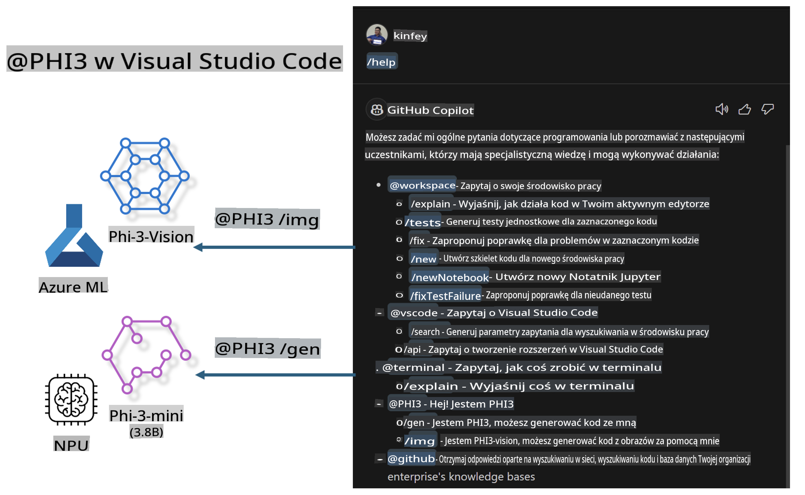

# **Zbuduj własny czat GitHub Copilot w Visual Studio Code z rodziną Microsoft Phi-3**

Czy korzystałeś z agenta przestrzeni roboczej w GitHub Copilot Chat? Chcesz stworzyć własnego agenta kodu dla swojego zespołu? W tym laboratorium praktycznym połączymy model open source, aby stworzyć agenta kodowego na poziomie przedsiębiorstwa.

## **Podstawy**

### **Dlaczego warto wybrać Microsoft Phi-3**

Phi-3 to seria modeli, obejmująca phi-3-mini, phi-3-small i phi-3-medium, które różnią się parametrami treningowymi i są przeznaczone do generowania tekstu, uzupełniania dialogów oraz generowania kodu. Dostępny jest także phi-3-vision oparty na Vision. Modele te nadają się dla przedsiębiorstw lub zespołów, które chcą tworzyć rozwiązania AI generatywnej offline.

Zalecane do przeczytania: [https://github.com/microsoft/PhiCookBook/blob/main/md/01.Introduction/01/01.PhiFamily.md](https://github.com/microsoft/PhiCookBook/blob/main/md/01.Introduction/01/01.PhiFamily.md)

### **Microsoft GitHub Copilot Chat**

Rozszerzenie GitHub Copilot Chat zapewnia interfejs czatu, który umożliwia interakcję z GitHub Copilot i otrzymywanie odpowiedzi na pytania związane z kodowaniem bezpośrednio w VS Code, bez potrzeby przeszukiwania dokumentacji lub forów internetowych.

Copilot Chat może używać podświetlania składni, wcięć i innych funkcji formatowania, aby zwiększyć czytelność generowanych odpowiedzi. W zależności od pytania użytkownika, wynik może zawierać linki do kontekstu, który Copilot wykorzystał do wygenerowania odpowiedzi, takie jak pliki źródłowe lub dokumentacja, a także przyciski umożliwiające dostęp do funkcji VS Code.

- Copilot Chat integruje się z przepływem pracy programisty i oferuje pomoc tam, gdzie jest potrzebna:

- Rozpocznij rozmowę na czacie bezpośrednio z edytora lub terminala, aby uzyskać pomoc podczas kodowania

- Użyj widoku czatu, aby mieć asystenta AI zawsze pod ręką

- Uruchom Quick Chat, aby zadać szybkie pytanie i wrócić do pracy

GitHub Copilot Chat można używać w różnych scenariuszach, takich jak:

- Odpowiadanie na pytania dotyczące najlepszych rozwiązań problemów programistycznych

- Wyjaśnianie kodu napisanego przez kogoś innego i sugerowanie ulepszeń

- Proponowanie poprawek do kodu

- Generowanie przypadków testowych jednostkowych

- Tworzenie dokumentacji kodu

Zalecane do przeczytania: [https://code.visualstudio.com/docs/copilot/copilot-chat](https://code.visualstudio.com/docs/copilot/copilot-chat?WT.mc_id=aiml-137032-kinfeylo)

### **Microsoft GitHub Copilot Chat @workspace**

Odwołanie do **@workspace** w Copilot Chat pozwala zadawać pytania dotyczące całej bazy kodu. W zależności od pytania Copilot inteligentnie pobiera odpowiednie pliki i symbole, które wykorzystuje w odpowiedzi w postaci linków i przykładów kodu.

Aby odpowiedzieć na pytanie, **@workspace** przeszukuje te same źródła, które programista przeglądałby podczas nawigacji w bazie kodu w VS Code:

- Wszystkie pliki w przestrzeni roboczej, z wyjątkiem tych ignorowanych przez plik .gitignore

- Struktura katalogów z zagnieżdżonymi folderami i nazwami plików

- Indeks wyszukiwania kodu GitHub, jeśli przestrzeń robocza to repozytorium GitHub i jest indeksowana przez wyszukiwanie kodu

- Symbole i definicje w przestrzeni roboczej

- Aktualnie zaznaczony tekst lub widoczny tekst w aktywnym edytorze

Uwaga: .gitignore jest pomijany, jeśli plik jest otwarty lub jeśli zaznaczono tekst w pliku ignorowanym.

Zalecane do przeczytania: [https://code.visualstudio.com/docs/copilot/copilot-chat](https://code.visualstudio.com/docs/copilot/workspace-context?WT.mc_id=aiml-137032-kinfeylo)

## **Więcej informacji o tym laboratorium**

GitHub Copilot znacznie poprawił efektywność programowania w przedsiębiorstwach, a każde przedsiębiorstwo pragnie dostosować funkcje GitHub Copilot do swoich potrzeb. Wiele firm stworzyło rozszerzenia podobne do GitHub Copilot w oparciu o własne scenariusze biznesowe i modele open source. Dla przedsiębiorstw dostosowane rozszerzenia są łatwiejsze do kontrolowania, ale może to wpłynąć na doświadczenie użytkownika. W końcu GitHub Copilot ma silniejsze funkcje w obsłudze ogólnych scenariuszy i profesjonalizmu. Jeśli można zachować spójność doświadczenia, lepszym rozwiązaniem byłoby dostosowanie własnego rozszerzenia. GitHub Copilot Chat oferuje odpowiednie API, które umożliwiają przedsiębiorstwom rozbudowę doświadczenia czatu. Utrzymanie spójnego doświadczenia i posiadanie dostosowanych funkcji to lepsze doświadczenie użytkownika.

W tym laboratorium głównie wykorzystujemy model Phi-3 w połączeniu z lokalnym NPU i hybrydą Azure, aby stworzyć niestandardowego Agenta w GitHub Copilot Chat ***@PHI3***, który wspiera programistów w generowaniu kodu ***(@PHI3 /gen)*** oraz tworzeniu kodu na podstawie obrazów ***(@PHI3 /img)***.

### ***Uwaga:*** 

To laboratorium jest obecnie zaimplementowane na AIPC procesorów Intel CPU i Apple Silicon. Będziemy kontynuować prace nad wersją Qualcomm dla NPU.

## **Laboratorium**

| Nazwa | Opis | AIPC | Apple |
| ------------ | ----------- | -------- |-------- |
| Lab0 - Instalacja (✅) | Konfiguracja i instalacja odpowiednich środowisk oraz narzędzi | [Go](./HOL/AIPC/01.Installations.md) |[Go](./HOL/Apple/01.Installations.md) |
| Lab1 - Uruchomienie Prompt flow z Phi-3-mini (✅) | Wykorzystanie AIPC / Apple Silicon i lokalnego NPU do generowania kodu za pomocą Phi-3-mini | [Go](./HOL/AIPC/02.PromptflowWithNPU.md) |  [Go](./HOL/Apple/02.PromptflowWithMLX.md) |
| Lab2 - Wdrożenie Phi-3-vision na Azure Machine Learning Service (✅) | Generowanie kodu poprzez wdrożenie Phi-3-vision z katalogu modeli Azure Machine Learning Service | [Go](./HOL/AIPC/03.DeployPhi3VisionOnAzure.md) |[Go](./HOL/Apple/03.DeployPhi3VisionOnAzure.md) |
| Lab3 - Stwórz agenta @phi-3 w GitHub Copilot Chat (✅)  | Stworzenie niestandardowego agenta Phi-3 w GitHub Copilot Chat do generowania kodu, kodu graficznego, RAG itd. | [Go](./HOL/AIPC/04.CreatePhi3AgentInVSCode.md) | [Go](./HOL/Apple/04.CreatePhi3AgentInVSCode.md) |
| Przykładowy kod (✅)  | Pobierz przykładowy kod | [Go](../../../../../../../code/07.Lab/01/AIPC) | [Go](../../../../../../../code/07.Lab/01/Apple) |

## **Zasoby**

1. Phi-3 Cookbook [https://github.com/microsoft/Phi-3CookBook](https://github.com/microsoft/Phi-3CookBook)

2. Dowiedz się więcej o GitHub Copilot [https://learn.microsoft.com/training/paths/copilot/](https://learn.microsoft.com/training/paths/copilot/?WT.mc_id=aiml-137032-kinfeylo)

3. Dowiedz się więcej o GitHub Copilot Chat [https://learn.microsoft.com/training/paths/accelerate-app-development-using-github-copilot/](https://learn.microsoft.com/training/paths/accelerate-app-development-using-github-copilot/?WT.mc_id=aiml-137032-kinfeylo)

4. Dowiedz się więcej o API GitHub Copilot Chat [https://code.visualstudio.com/api/extension-guides/chat](https://code.visualstudio.com/api/extension-guides/chat?WT.mc_id=aiml-137032-kinfeylo)

5. Dowiedz się więcej o Azure AI Foundry [https://learn.microsoft.com/training/paths/create-custom-copilots-ai-studio/](https://learn.microsoft.com/training/paths/create-custom-copilots-ai-studio/?WT.mc_id=aiml-137032-kinfeylo)

6. Dowiedz się więcej o katalogu modeli Azure AI Foundry [https://learn.microsoft.com/azure/ai-studio/how-to/model-catalog-overview](https://learn.microsoft.com/azure/ai-studio/how-to/model-catalog-overview)

**Zastrzeżenie**:  
Niniejszy dokument został przetłumaczony za pomocą usług tłumaczenia maszynowego opartego na sztucznej inteligencji. Chociaż staramy się zapewnić dokładność, prosimy mieć na uwadze, że automatyczne tłumaczenia mogą zawierać błędy lub nieścisłości. Oryginalny dokument w jego języku źródłowym powinien być uznawany za wiarygodne źródło. W przypadku informacji krytycznych zaleca się skorzystanie z profesjonalnego tłumaczenia przez człowieka. Nie ponosimy odpowiedzialności za jakiekolwiek nieporozumienia lub błędne interpretacje wynikające z korzystania z tego tłumaczenia.