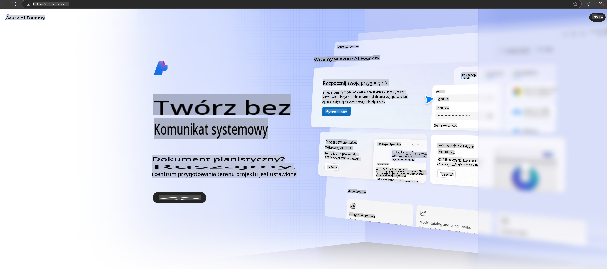

# **Korzystanie z Phi-3 w Azure AI Foundry**

Wraz z rozwojem generatywnej sztucznej inteligencji, chcemy korzystać z ujednoliconej platformy do zarządzania różnymi modelami LLM i SLM, integracji danych przedsiębiorstwa, operacji fine-tuning/RAG oraz oceny różnych obszarów działalności po integracji LLM i SLM, aby generatywna AI mogła być lepiej wdrażana w inteligentnych aplikacjach. [Azure AI Foundry](https://ai.azure.com) to platforma aplikacji generatywnej AI na poziomie przedsiębiorstwa.

Dzięki Azure AI Foundry możesz oceniać odpowiedzi modeli językowych (LLM) i koordynować komponenty aplikacji promptowych za pomocą prompt flow, aby osiągnąć lepszą wydajność. Platforma umożliwia skalowalność, przekształcając proof of concept w pełnoprawne wdrożenie produkcyjne z łatwością. Ciągłe monitorowanie i udoskonalanie wspiera długoterminowy sukces.

Możemy szybko wdrożyć model Phi-3 w Azure AI Foundry w kilku prostych krokach, a następnie wykorzystać Azure AI Foundry do realizacji zadań związanych z Phi-3, takich jak Playground/Chat, Fine-tuning, oceny i inne powiązane prace.

## **1. Przygotowanie**

Jeśli masz już zainstalowany [Azure Developer CLI](https://learn.microsoft.com/azure/developer/azure-developer-cli/overview?WT.mc_id=aiml-138114-kinfeylo) na swoim urządzeniu, skorzystanie z tego szablonu jest tak proste, jak uruchomienie tego polecenia w nowym katalogu.

## Ręczne tworzenie

Tworzenie projektu i huba w Microsoft Azure AI Foundry to świetny sposób na organizację i zarządzanie pracami związanymi z AI. Oto krok po kroku, jak to zrobić:

### Tworzenie projektu w Azure AI Foundry

1. **Przejdź do Azure AI Foundry**: Zaloguj się do portalu Azure AI Foundry.
2. **Utwórz projekt**:
   - Jeśli jesteś w projekcie, wybierz "Azure AI Foundry" w lewym górnym rogu strony, aby przejść do strony głównej.
   - Wybierz "+ Create project".
   - Wprowadź nazwę projektu.
   - Jeśli masz już hub, zostanie on wybrany domyślnie. Jeśli masz dostęp do więcej niż jednego huba, możesz wybrać inny z rozwijanej listy. Jeśli chcesz utworzyć nowy hub, wybierz "Create new hub" i podaj nazwę.
   - Wybierz "Create".

### Tworzenie huba w Azure AI Foundry

1. **Przejdź do Azure AI Foundry**: Zaloguj się przy użyciu konta Azure.
2. **Utwórz hub**:
   - Wybierz Centrum zarządzania z lewego menu.
   - Wybierz "All resources", a następnie strzałkę w dół obok "+ New project" i wybierz "+ New hub".
   - W oknie dialogowym "Create a new hub" wprowadź nazwę swojego huba (np. contoso-hub) i zmodyfikuj inne pola według potrzeb.
   - Wybierz "Next", sprawdź informacje, a następnie wybierz "Create".

Szczegółowe instrukcje znajdziesz w oficjalnej [dokumentacji Microsoft](https://learn.microsoft.com/azure/ai-studio/how-to/create-projects).

Po pomyślnym utworzeniu możesz uzyskać dostęp do stworzonego studia poprzez [ai.azure.com](https://ai.azure.com/)

Na jednej platformie AI Foundry może znajdować się wiele projektów. Utwórz projekt w AI Foundry, aby się przygotować.

Tworzenie w Azure AI Foundry [QuickStarts](https://learn.microsoft.com/azure/ai-studio/quickstarts/get-started-code)

## **2. Wdrożenie modelu Phi w Azure AI Foundry**

Kliknij opcję Explore w projekcie, aby przejść do Katalogu Modeli i wybierz Phi-3.

Wybierz Phi-3-mini-4k-instruct.

Kliknij 'Deploy', aby wdrożyć model Phi-3-mini-4k-instruct.

> [!NOTE]
>
> Podczas wdrażania możesz wybrać moc obliczeniową.

## **3. Playground Chat Phi w Azure AI Foundry**

Przejdź do strony wdrożenia, wybierz Playground i rozmawiaj z Phi-3 w Azure AI Foundry.

## **4. Wdrażanie modelu z Azure AI Foundry**

Aby wdrożyć model z katalogu modeli Azure, wykonaj następujące kroki:

- Zaloguj się do Azure AI Foundry.
- Wybierz model, który chcesz wdrożyć, z katalogu modeli Azure AI Foundry.
- Na stronie Szczegóły modelu wybierz Deploy, a następnie Serverless API z Azure AI Content Safety.
- Wybierz projekt, w którym chcesz wdrożyć swoje modele. Aby skorzystać z oferty Serverless API, twoje środowisko pracy musi znajdować się w regionie East US 2 lub Sweden Central. Możesz dostosować nazwę wdrożenia.
- W kreatorze wdrażania wybierz Pricing and terms, aby zapoznać się z cenami i warunkami użytkowania.
- Wybierz Deploy. Poczekaj, aż wdrożenie będzie gotowe, i zostaniesz przekierowany na stronę Wdrożeń.
- Wybierz Open in playground, aby rozpocząć interakcję z modelem.
- Możesz wrócić na stronę Wdrożeń, wybrać wdrożenie i zanotować Target URL oraz Secret Key, które możesz wykorzystać do wywoływania wdrożenia i generowania wyników.
- Szczegóły endpointu, URL i klucze dostępu zawsze znajdziesz, przechodząc do zakładki Build i wybierając Deployments w sekcji Components.

> [!NOTE]
> Pamiętaj, że twoje konto musi mieć uprawnienia roli Azure AI Developer w grupie zasobów, aby wykonać te kroki.

## **5. Korzystanie z API Phi w Azure AI Foundry**

Możesz uzyskać dostęp do https://{Twoja nazwa projektu}.region.inference.ml.azure.com/swagger.json za pomocą Postman GET i w połączeniu z Key dowiedzieć się o dostępnych interfejsach.

Możesz bardzo wygodnie uzyskać parametry żądania, jak i odpowiedzi.

**Zastrzeżenie**:  
Niniejszy dokument został przetłumaczony za pomocą usług tłumaczenia maszynowego opartego na sztucznej inteligencji. Chociaż dokładamy wszelkich starań, aby zapewnić dokładność, prosimy mieć na uwadze, że automatyczne tłumaczenia mogą zawierać błędy lub nieścisłości. Oryginalny dokument w jego języku źródłowym powinien być uważany za wiarygodne źródło. W przypadku informacji o kluczowym znaczeniu zaleca się skorzystanie z profesjonalnego tłumaczenia przez człowieka. Nie ponosimy odpowiedzialności za jakiekolwiek nieporozumienia lub błędne interpretacje wynikające z użycia tego tłumaczenia.