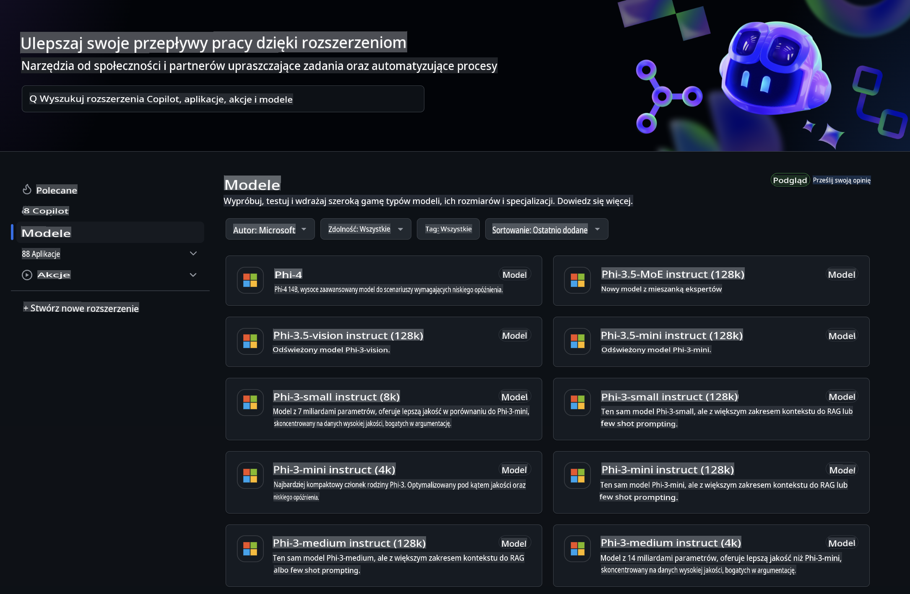
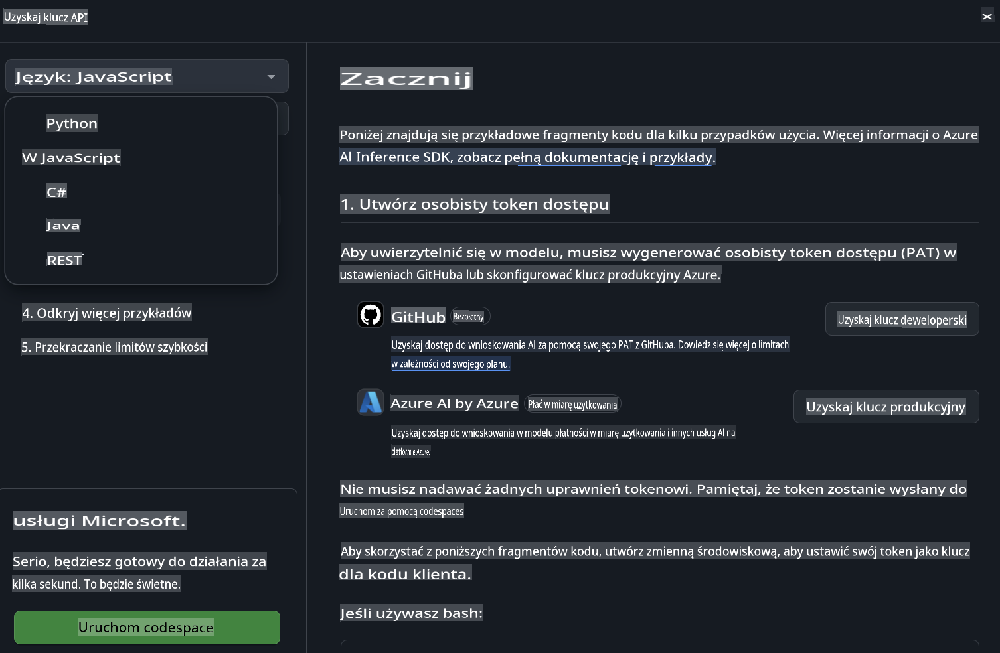
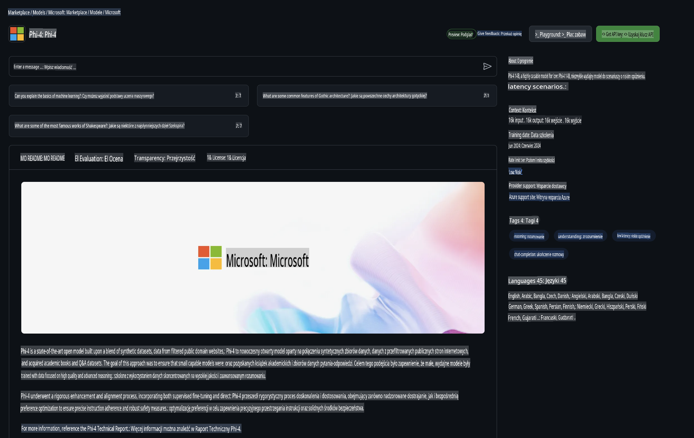

## Modele GitHub - Ograniczona Publiczna Beta

Witamy w [Modelach GitHub](https://github.com/marketplace/models)! Wszystko jest gotowe, abyś mógł eksplorować modele AI hostowane na Azure AI.



Aby uzyskać więcej informacji o modelach dostępnych w Modelach GitHub, odwiedź [GitHub Model Marketplace](https://github.com/marketplace/models).

## Dostępne Modele

Każdy model ma dedykowane środowisko testowe oraz przykładowy kod.


### Modele Phi-3 w Katalogu Modeli GitHub

[Phi-3-Medium-128k-Instruct](https://github.com/marketplace/models/azureml/Phi-3-medium-128k-instruct)

[Phi-3-medium-4k-instruct](https://github.com/marketplace/models/azureml/Phi-3-medium-4k-instruct)

[Phi-3-mini-128k-instruct](https://github.com/marketplace/models/azureml/Phi-3-mini-128k-instruct)

[Phi-3-mini-4k-instruct](https://github.com/marketplace/models/azureml/Phi-3-mini-4k-instruct)

[Phi-3-small-128k-instruct](https://github.com/marketplace/models/azureml/Phi-3-small-128k-instruct)

[Phi-3-small-8k-instruct](https://github.com/marketplace/models/azureml/Phi-3-small-8k-instruct)

## Pierwsze Kroki

Kilka podstawowych przykładów jest gotowych do uruchomienia. Możesz je znaleźć w katalogu z przykładami. Jeśli chcesz zacząć od swojego ulubionego języka, znajdziesz przykłady w następujących językach:

- Python  
- JavaScript  
- cURL  

Istnieje również dedykowane środowisko Codespaces do uruchamiania przykładów i modeli.



## Przykładowy Kod

Poniżej znajdują się fragmenty przykładowego kodu dla kilku przypadków użycia. Aby uzyskać więcej informacji o Azure AI Inference SDK, zapoznaj się z pełną dokumentacją i przykładami.

## Konfiguracja

1. Utwórz token dostępu osobistego  
Nie musisz nadawać żadnych uprawnień tokenowi. Pamiętaj, że token zostanie wysłany do usługi Microsoft.

Aby użyć poniższych fragmentów kodu, utwórz zmienną środowiskową, aby ustawić swój token jako klucz dla kodu klienta.

Jeśli używasz bash:  
```
export GITHUB_TOKEN="<your-github-token-goes-here>"
```  
Jeśli używasz powershell:  

```
$Env:GITHUB_TOKEN="<your-github-token-goes-here>"
```  

Jeśli używasz wiersza poleceń Windows:  

```
set GITHUB_TOKEN=<your-github-token-goes-here>
```  

## Przykład w Pythonie

### Instalacja zależności  
Zainstaluj Azure AI Inference SDK za pomocą pip (wymaga: Python >=3.8):  

```
pip install azure-ai-inference
```  

### Uruchomienie podstawowego przykładu kodu  

Ten przykład demonstruje podstawowe wywołanie API chat completion. Wykorzystuje punkt końcowy inferencji modelu AI GitHub oraz Twój token GitHub. Wywołanie jest synchroniczne.

```
import os
from azure.ai.inference import ChatCompletionsClient
from azure.ai.inference.models import SystemMessage, UserMessage
from azure.core.credentials import AzureKeyCredential

endpoint = "https://models.inference.ai.azure.com"
# Replace Model_Name 
model_name = "Phi-3-small-8k-instruct"
token = os.environ["GITHUB_TOKEN"]

client = ChatCompletionsClient(
    endpoint=endpoint,
    credential=AzureKeyCredential(token),
)

response = client.complete(
    messages=[
        SystemMessage(content="You are a helpful assistant."),
        UserMessage(content="What is the capital of France?"),
    ],
    model=model_name,
    temperature=1.,
    max_tokens=1000,
    top_p=1.
)

print(response.choices[0].message.content)
```  

### Uruchomienie rozmowy wieloetapowej  

Ten przykład demonstruje rozmowę wieloetapową z API chat completion. Korzystając z modelu w aplikacji czatu, musisz zarządzać historią rozmowy i przesyłać najnowsze wiadomości do modelu.

```
import os
from azure.ai.inference import ChatCompletionsClient
from azure.ai.inference.models import AssistantMessage, SystemMessage, UserMessage
from azure.core.credentials import AzureKeyCredential

token = os.environ["GITHUB_TOKEN"]
endpoint = "https://models.inference.ai.azure.com"
# Replace Model_Name
model_name = "Phi-3-small-8k-instruct"

client = ChatCompletionsClient(
    endpoint=endpoint,
    credential=AzureKeyCredential(token),
)

messages = [
    SystemMessage(content="You are a helpful assistant."),
    UserMessage(content="What is the capital of France?"),
    AssistantMessage(content="The capital of France is Paris."),
    UserMessage(content="What about Spain?"),
]

response = client.complete(messages=messages, model=model_name)

print(response.choices[0].message.content)
```  

### Strumieniowanie odpowiedzi  

Aby poprawić doświadczenie użytkownika, warto strumieniować odpowiedź modelu, aby pierwszy token pojawił się szybko i uniknąć oczekiwania na długie odpowiedzi.

```
import os
from azure.ai.inference import ChatCompletionsClient
from azure.ai.inference.models import SystemMessage, UserMessage
from azure.core.credentials import AzureKeyCredential

token = os.environ["GITHUB_TOKEN"]
endpoint = "https://models.inference.ai.azure.com"
# Replace Model_Name
model_name = "Phi-3-small-8k-instruct"

client = ChatCompletionsClient(
    endpoint=endpoint,
    credential=AzureKeyCredential(token),
)

response = client.complete(
    stream=True,
    messages=[
        SystemMessage(content="You are a helpful assistant."),
        UserMessage(content="Give me 5 good reasons why I should exercise every day."),
    ],
    model=model_name,
)

for update in response:
    if update.choices:
        print(update.choices[0].delta.content or "", end="")

client.close()
```  

## JavaScript  

### Instalacja zależności  

Zainstaluj Node.js.

Skopiuj poniższe linie tekstu i zapisz je jako plik package.json w swoim folderze.

```
{
  "type": "module",
  "dependencies": {
    "@azure-rest/ai-inference": "latest",
    "@azure/core-auth": "latest",
    "@azure/core-sse": "latest"
  }
}
```  

Uwaga: @azure/core-sse jest potrzebny tylko wtedy, gdy strumieniujesz odpowiedzi z chat completions.

Otwórz okno terminala w tym folderze i uruchom npm install.

Dla każdego z poniższych fragmentów kodu skopiuj zawartość do pliku sample.js i uruchom za pomocą node sample.js.

### Uruchomienie podstawowego przykładu kodu  

Ten przykład demonstruje podstawowe wywołanie API chat completion. Wykorzystuje punkt końcowy inferencji modelu AI GitHub oraz Twój token GitHub. Wywołanie jest synchroniczne.

```
import ModelClient from "@azure-rest/ai-inference";
import { AzureKeyCredential } from "@azure/core-auth";

const token = process.env["GITHUB_TOKEN"];
const endpoint = "https://models.inference.ai.azure.com";
// Update your modelname
const modelName = "Phi-3-small-8k-instruct";

export async function main() {

  const client = new ModelClient(endpoint, new AzureKeyCredential(token));

  const response = await client.path("/chat/completions").post({
    body: {
      messages: [
        { role:"system", content: "You are a helpful assistant." },
        { role:"user", content: "What is the capital of France?" }
      ],
      model: modelName,
      temperature: 1.,
      max_tokens: 1000,
      top_p: 1.
    }
  });

  if (response.status !== "200") {
    throw response.body.error;
  }
  console.log(response.body.choices[0].message.content);
}

main().catch((err) => {
  console.error("The sample encountered an error:", err);
});
```  

### Uruchomienie rozmowy wieloetapowej  

Ten przykład demonstruje rozmowę wieloetapową z API chat completion. Korzystając z modelu w aplikacji czatu, musisz zarządzać historią rozmowy i przesyłać najnowsze wiadomości do modelu.

```
import ModelClient from "@azure-rest/ai-inference";
import { AzureKeyCredential } from "@azure/core-auth";

const token = process.env["GITHUB_TOKEN"];
const endpoint = "https://models.inference.ai.azure.com";
// Update your modelname
const modelName = "Phi-3-small-8k-instruct";

export async function main() {

  const client = new ModelClient(endpoint, new AzureKeyCredential(token));

  const response = await client.path("/chat/completions").post({
    body: {
      messages: [
        { role: "system", content: "You are a helpful assistant." },
        { role: "user", content: "What is the capital of France?" },
        { role: "assistant", content: "The capital of France is Paris." },
        { role: "user", content: "What about Spain?" },
      ],
      model: modelName,
    }
  });

  if (response.status !== "200") {
    throw response.body.error;
  }

  for (const choice of response.body.choices) {
    console.log(choice.message.content);
  }
}

main().catch((err) => {
  console.error("The sample encountered an error:", err);
});
```  

### Strumieniowanie odpowiedzi  

Aby poprawić doświadczenie użytkownika, warto strumieniować odpowiedź modelu, aby pierwszy token pojawił się szybko i uniknąć oczekiwania na długie odpowiedzi.

```
import ModelClient from "@azure-rest/ai-inference";
import { AzureKeyCredential } from "@azure/core-auth";
import { createSseStream } from "@azure/core-sse";

const token = process.env["GITHUB_TOKEN"];
const endpoint = "https://models.inference.ai.azure.com";
// Update your modelname
const modelName = "Phi-3-small-8k-instruct";

export async function main() {

  const client = new ModelClient(endpoint, new AzureKeyCredential(token));

  const response = await client.path("/chat/completions").post({
    body: {
      messages: [
        { role: "system", content: "You are a helpful assistant." },
        { role: "user", content: "Give me 5 good reasons why I should exercise every day." },
      ],
      model: modelName,
      stream: true
    }
  }).asNodeStream();

  const stream = response.body;
  if (!stream) {
    throw new Error("The response stream is undefined");
  }

  if (response.status !== "200") {
    stream.destroy();
    throw new Error(`Failed to get chat completions, http operation failed with ${response.status} code`);
  }

  const sseStream = createSseStream(stream);

  for await (const event of sseStream) {
    if (event.data === "[DONE]") {
      return;
    }
    for (const choice of (JSON.parse(event.data)).choices) {
        process.stdout.write(choice.delta?.content ?? ``);
    }
  }
}

main().catch((err) => {
  console.error("The sample encountered an error:", err);
});
```  

## REST  

### Uruchomienie podstawowego przykładu kodu  

Wklej poniższe do powłoki:  

```
curl -X POST "https://models.inference.ai.azure.com/chat/completions" \
    -H "Content-Type: application/json" \
    -H "Authorization: Bearer $GITHUB_TOKEN" \
    -d '{
        "messages": [
            {
                "role": "system",
                "content": "You are a helpful assistant."
            },
            {
                "role": "user",
                "content": "What is the capital of France?"
            }
        ],
        "model": "Phi-3-small-8k-instruct"
    }'
```  

### Uruchomienie rozmowy wieloetapowej  

Wywołaj API chat completion i przekaż historię rozmowy:  

```
curl -X POST "https://models.inference.ai.azure.com/chat/completions" \
    -H "Content-Type: application/json" \
    -H "Authorization: Bearer $GITHUB_TOKEN" \
    -d '{
        "messages": [
            {
                "role": "system",
                "content": "You are a helpful assistant."
            },
            {
                "role": "user",
                "content": "What is the capital of France?"
            },
            {
                "role": "assistant",
                "content": "The capital of France is Paris."
            },
            {
                "role": "user",
                "content": "What about Spain?"
            }
        ],
        "model": "Phi-3-small-8k-instruct"
    }'
```  

### Strumieniowanie odpowiedzi  

Przykład wywołania punktu końcowego i strumieniowania odpowiedzi.  

```
curl -X POST "https://models.inference.ai.azure.com/chat/completions" \
    -H "Content-Type: application/json" \
    -H "Authorization: Bearer $GITHUB_TOKEN" \
    -d '{
        "messages": [
            {
                "role": "system",
                "content": "You are a helpful assistant."
            },
            {
                "role": "user",
                "content": "Give me 5 good reasons why I should exercise every day."
            }
        ],
        "stream": true,
        "model": "Phi-3-small-8k-instruct"
    }'
```  

## Bezpłatne Użycie i Limity dla Modeli GitHub  

  

[Limity dla środowiska testowego i bezpłatnego użycia API](https://docs.github.com/en/github-models/prototyping-with-ai-models#rate-limits) mają na celu umożliwienie eksperymentowania z modelami i prototypowania aplikacji AI. Aby korzystać z modeli poza tymi limitami i skalować swoją aplikację, musisz zapewnić zasoby z konta Azure i uwierzytelnić się stamtąd zamiast używać osobistego tokenu GitHub. Nie musisz zmieniać niczego innego w swoim kodzie. Skorzystaj z tego linku, aby dowiedzieć się, jak przekroczyć limity darmowego poziomu w Azure AI.

### Zastrzeżenia  

Pamiętaj, że podczas interakcji z modelem eksperymentujesz z AI, więc możliwe są błędy w treści.

Funkcja podlega różnym ograniczeniom (w tym liczbie żądań na minutę, żądań na dzień, tokenów na żądanie i równoczesnych żądań) i nie jest przeznaczona do zastosowań produkcyjnych.

Modele GitHub korzystają z Azure AI Content Safety. Te filtry nie mogą być wyłączone w ramach doświadczenia Modeli GitHub. Jeśli zdecydujesz się na użycie modeli w płatnej usłudze, skonfiguruj filtry treści zgodnie z Twoimi wymaganiami.

Ta usługa podlega Warunkom Wstępnego Wydania GitHub.

**Zastrzeżenie**:  
Ten dokument został przetłumaczony za pomocą usług tłumaczenia maszynowego opartego na sztucznej inteligencji. Chociaż dokładamy wszelkich starań, aby zapewnić dokładność, prosimy mieć na uwadze, że automatyczne tłumaczenia mogą zawierać błędy lub nieścisłości. Oryginalny dokument w jego rodzimym języku powinien być uznawany za wiarygodne źródło. W przypadku informacji krytycznych zaleca się skorzystanie z profesjonalnego tłumaczenia wykonanego przez człowieka. Nie ponosimy odpowiedzialności za jakiekolwiek nieporozumienia lub błędne interpretacje wynikające z użycia tego tłumaczenia.