# Dostosowywanie Phi-3 z Azure AI Foundry

Przyjrzyjmy się, jak dostosować model językowy Phi-3 Mini firmy Microsoft za pomocą Azure AI Foundry. Fine-tuning pozwala dopasować Phi-3 Mini do specyficznych zadań, co czyni go jeszcze bardziej wydajnym i świadomym kontekstu.

## Wskazówki

- **Możliwości:** Które modele można dostosować? Do jakich zadań można dostosować model bazowy?
- **Koszty:** Jaki jest model cenowy dostosowywania?
- **Dostosowywanie:** Jak bardzo można modyfikować model bazowy – i w jaki sposób?
- **Wygoda:** Jak przebiega proces dostosowywania – czy muszę pisać własny kod? Czy muszę mieć własne zasoby obliczeniowe?
- **Bezpieczeństwo:** Modele dostosowane do specyficznych zadań mogą wiązać się z ryzykiem bezpieczeństwa – czy istnieją zabezpieczenia chroniące przed niezamierzonymi skutkami?

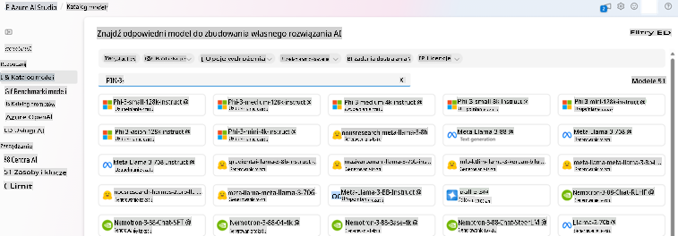

## Przygotowanie do dostosowywania

### Wymagania wstępne

> [!NOTE]
> W przypadku modeli z rodziny Phi-3, opcja dostosowywania w modelu pay-as-you-go jest dostępna wyłącznie w hubach utworzonych w regionach **East US 2**.

- Subskrypcja Azure. Jeśli jej nie posiadasz, utwórz [płatne konto Azure](https://azure.microsoft.com/pricing/purchase-options/pay-as-you-go), aby rozpocząć.

- Projekt [AI Foundry](https://ai.azure.com?WT.mc_id=aiml-138114-kinfeylo).
- Kontrole dostępu oparte na rolach Azure (Azure RBAC) są używane do przyznawania dostępu do operacji w Azure AI Foundry. Aby wykonać kroki opisane w tym artykule, Twoje konto użytkownika musi mieć przypisaną rolę __Azure AI Developer__ w grupie zasobów.

### Rejestracja dostawcy subskrypcji

Sprawdź, czy subskrypcja jest zarejestrowana dla dostawcy zasobów `Microsoft.Network`.

1. Zaloguj się do [portalu Azure](https://portal.azure.com).
1. Wybierz **Subskrypcje** z lewego menu.
1. Wybierz subskrypcję, której chcesz użyć.
1. Wybierz **Ustawienia projektu AI** > **Dostawcy zasobów** z lewego menu.
1. Upewnij się, że **Microsoft.Network** znajduje się na liście dostawców zasobów. W przeciwnym razie dodaj go.

### Przygotowanie danych

Przygotuj dane treningowe i walidacyjne do dostosowywania modelu. Twoje zestawy danych treningowych i walidacyjnych powinny zawierać przykłady wejściowe i wyjściowe, które pokazują, jak model powinien działać.

Upewnij się, że wszystkie przykłady treningowe spełniają oczekiwany format dla wnioskowania. Aby skutecznie dostosować modele, zapewnij zrównoważony i różnorodny zbiór danych.

Obejmuje to utrzymanie równowagi danych, uwzględnienie różnych scenariuszy oraz okresowe ulepszanie danych treningowych, aby lepiej odpowiadały rzeczywistym oczekiwaniom, co ostatecznie prowadzi do bardziej precyzyjnych i zrównoważonych odpowiedzi modelu.

Różne typy modeli wymagają różnych formatów danych treningowych.

### Chat Completion

Dane treningowe i walidacyjne muszą być sformatowane jako dokument JSON Lines (JSONL). Dla `Phi-3-mini-128k-instruct` zestaw danych do dostosowywania musi być sformatowany w formacie konwersacyjnym używanym przez API Chat completions.

### Przykładowy format pliku

```json
    {"messages": [{"role": "system", "content": "You are an Xbox customer support agent whose primary goal is to help users with issues they are experiencing with their Xbox devices. You are friendly and concise. You only provide factual answers to queries, and do not provide answers that are not related to Xbox."}, {"role": "user", "content": "Is Xbox better than PlayStation?"}, {"role": "assistant", "content": "I apologize, but I cannot provide personal opinions. My primary job is to assist you with any issues related to your Xbox device. Do you have any Xbox-related issues that need addressing?"}]}
    {"messages": [{"role": "system", "content": "You are an Xbox customer support agent whose primary goal is to help users with issues they are experiencing with their Xbox devices. You are friendly and concise. You only provide factual answers to queries, and do not provide answers that are not related to Xbox."}, {"role": "user", "content": "Can I play PC games on my Xbox?"}, {"role": "assistant", "content": "While Xbox consoles don't natively support PC games, they can play an array of Xbox games, many of which are also available on PC. Can I assist you with finding games compatible with your Xbox device?"}]}
    {"messages": [{"role": "system", "content": "You are an Xbox customer support agent whose primary goal is to help users with issues they are experiencing with their Xbox devices. You are friendly and concise. You only provide factual answers to queries, and do not provide answers that are not related to Xbox."}, {"role": "user", "content": "I'm having trouble connecting my Xbox to the Wi-Fi."}, {"role": "assistant", "content": "No worries, let's go through the network settings on your Xbox. Can you please tell me what happens when you try to connect it to the Wi-Fi?"}]}
```

Obsługiwanym typem pliku jest JSON Lines. Pliki są przesyłane do domyślnego magazynu danych i udostępniane w Twoim projekcie.

## Dostosowywanie Phi-3 z Azure AI Foundry

Azure AI Foundry pozwala dostosowywać duże modele językowe do Twoich własnych zbiorów danych za pomocą procesu znanego jako fine-tuning. Dostosowywanie oferuje znaczące korzyści, umożliwiając personalizację i optymalizację dla specyficznych zadań i zastosowań. Prowadzi to do poprawy wydajności, efektywności kosztowej, zmniejszenia opóźnień i dostosowanych wyników.

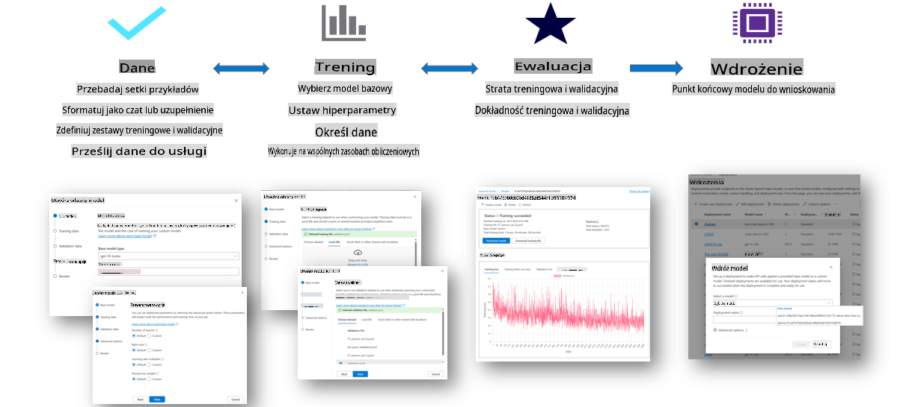

### Tworzenie nowego projektu

1. Zaloguj się do [Azure AI Foundry](https://ai.azure.com).

1. Wybierz **+New project**, aby utworzyć nowy projekt w Azure AI Foundry.

    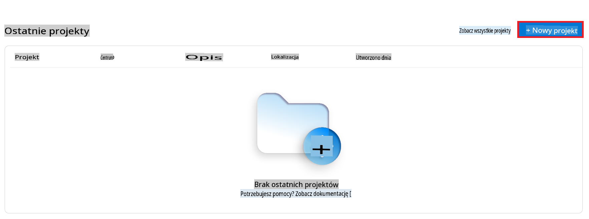

1. Wykonaj następujące czynności:

    - Nazwa projektu **Hub name**. Musi być unikalna.
    - Wybierz **Hub**, którego chcesz użyć (utwórz nowy, jeśli to konieczne).

    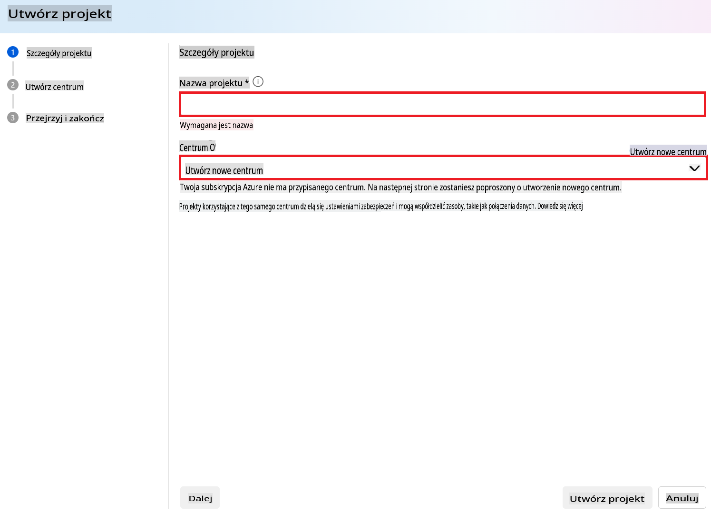

1. Wykonaj następujące czynności, aby utworzyć nowy hub:

    - Wprowadź **Hub name**. Musi być unikalna.
    - Wybierz swoją subskrypcję **Azure Subscription**.
    - Wybierz **Resource group**, której chcesz użyć (utwórz nową, jeśli to konieczne).
    - Wybierz **Location**, którego chcesz użyć.
    - Wybierz **Connect Azure AI Services**, którego chcesz użyć (utwórz nowy, jeśli to konieczne).
    - Wybierz **Connect Azure AI Search**, aby **Pominąć połączenie**.

    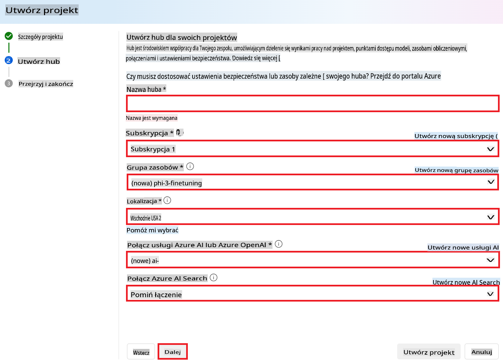

1. Wybierz **Next**.
1. Wybierz **Create a project**.

### Przygotowanie danych

Przed dostosowaniem zbierz lub utwórz zestaw danych odpowiedni dla Twojego zadania, na przykład instrukcje konwersacyjne, pary pytań i odpowiedzi lub inne istotne dane tekstowe. Oczyść i wstępnie przetwórz te dane, usuwając szumy, uzupełniając brakujące wartości i tokenizując tekst.

### Dostosowywanie modeli Phi-3 w Azure AI Foundry

> [!NOTE]
> Dostosowywanie modeli Phi-3 jest obecnie obsługiwane w projektach zlokalizowanych w East US 2.

1. Wybierz **Model catalog** z lewego panelu.

1. Wpisz *phi-3* w **pasku wyszukiwania** i wybierz model phi-3, którego chcesz użyć.

    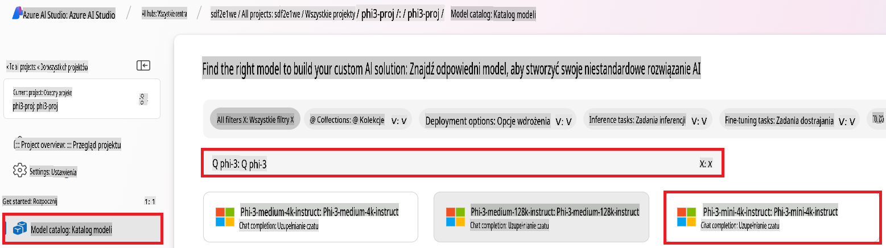

1. Wybierz **Fine-tune**.

    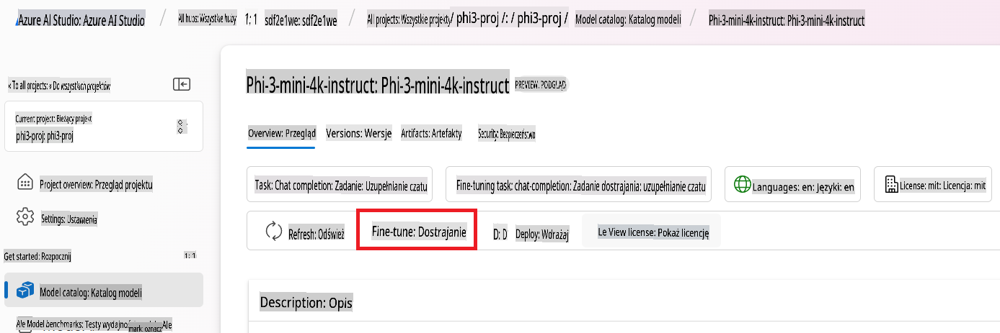

1. Wprowadź **Fine-tuned model name**.

    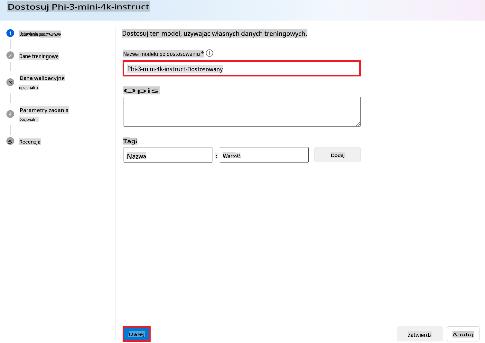

1. Wybierz **Next**.

1. Wykonaj następujące czynności:

    - Wybierz **task type** jako **Chat completion**.
    - Wybierz dane treningowe **Training data**, których chcesz użyć. Możesz je przesłać przez Azure AI Foundry lub z lokalnego środowiska.

    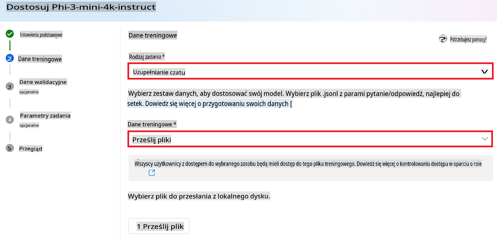

1. Wybierz **Next**.

1. Prześlij dane walidacyjne **Validation data**, których chcesz użyć, lub wybierz **Automatyczny podział danych treningowych**.

    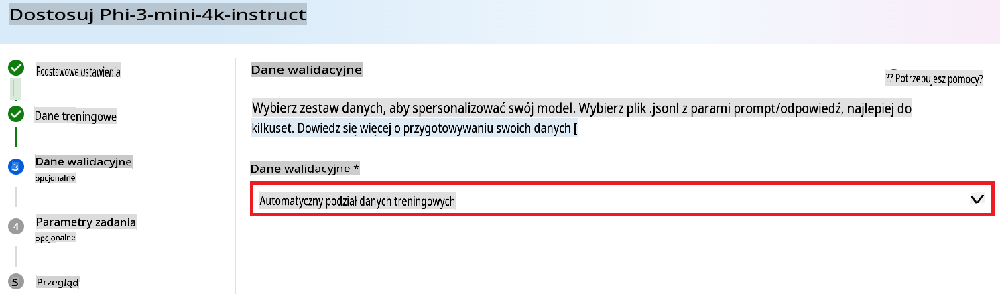

1. Wybierz **Next**.

1. Wykonaj następujące czynności:

    - Wybierz **Batch size multiplier**, którego chcesz użyć.
    - Wybierz **Learning rate**, którego chcesz użyć.
    - Wybierz liczbę **Epochs**, której chcesz użyć.

    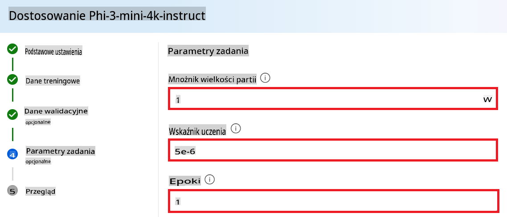

1. Wybierz **Submit**, aby rozpocząć proces dostosowywania.

    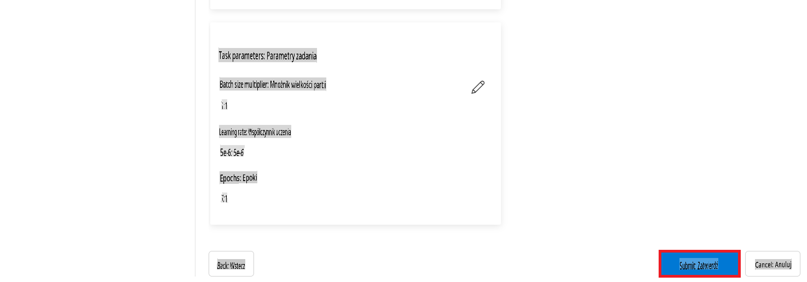

1. Po zakończeniu dostosowywania status modelu zostanie wyświetlony jako **Completed**, jak pokazano na poniższym obrazku. Teraz możesz wdrożyć model i używać go w swojej aplikacji, w playground lub w prompt flow. Więcej informacji znajdziesz w artykule [Jak wdrożyć modele językowe Phi-3 z Azure AI Foundry](https://learn.microsoft.com/azure/ai-studio/how-to/deploy-models-phi-3?tabs=phi-3-5&pivots=programming-language-python).

    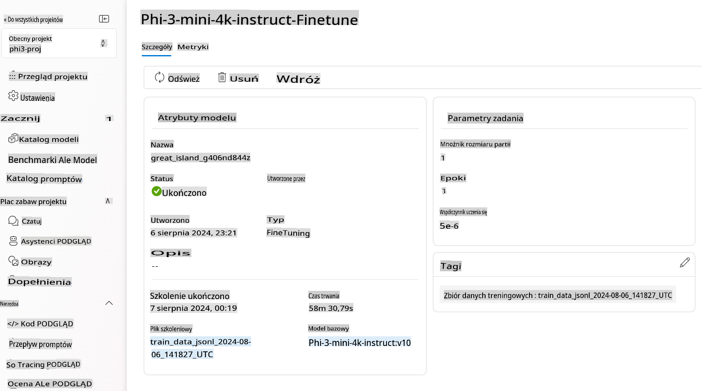

> [!NOTE]
> Szczegółowe informacje na temat dostosowywania Phi-3 znajdziesz w artykule [Dostosowywanie modeli Phi-3 w Azure AI Foundry](https://learn.microsoft.com/azure/ai-studio/how-to/fine-tune-phi-3?tabs=phi-3-mini).

## Czyszczenie dostosowanych modeli

Możesz usunąć dostosowany model z listy modeli w [Azure AI Foundry](https://ai.azure.com) lub ze strony szczegółów modelu. Wybierz model z listy Fine-tuning, a następnie kliknij przycisk Usuń, aby go usunąć.

> [!NOTE]
> Nie możesz usunąć modelu niestandardowego, jeśli ma aktywne wdrożenie. Musisz najpierw usunąć wdrożenie modelu, zanim będziesz mógł usunąć model niestandardowy.

## Koszty i limity

### Rozważania dotyczące kosztów i limitów dla modeli Phi-3 dostosowywanych jako usługa

Modele Phi dostosowywane jako usługa są oferowane przez Microsoft i zintegrowane z Azure AI Foundry. Cennik znajdziesz podczas [wdrażania](https://learn.microsoft.com/azure/ai-studio/how-to/deploy-models-phi-3?tabs=phi-3-5&pivots=programming-language-python) lub dostosowywania modeli w zakładce Pricing and terms w kreatorze wdrażania.

## Filtrowanie treści

Modele wdrażane jako usługa w modelu pay-as-you-go są chronione przez Azure AI Content Safety. Przy wdrożeniu na rzeczywistych punktach końcowych możesz zrezygnować z tej funkcji. Gdy Azure AI Content Safety jest włączone, zarówno prompt, jak i completion są analizowane przez zestaw modeli klasyfikacyjnych, które mają na celu wykrycie i zapobieganie generowaniu szkodliwych treści. System filtrowania treści wykrywa i podejmuje działania wobec określonych kategorii potencjalnie szkodliwych treści w promptach wejściowych i odpowiedziach wyjściowych. Dowiedz się więcej o [Azure AI Content Safety](https://learn.microsoft.com/azure/ai-studio/concepts/content-filtering).

**Konfiguracja dostosowywania**

Hiperparametry: Zdefiniuj hiperparametry, takie jak szybkość uczenia, rozmiar batcha i liczba epok treningowych.

**Funkcja straty**

Wybierz odpowiednią funkcję straty dla swojego zadania (np. entropię krzyżową).

**Optymalizator**

Wybierz optymalizator (np. Adam) do aktualizacji gradientów podczas treningu.

**Proces dostosowywania**

- Załaduj model wstępnie wytrenowany: Załaduj punkt kontrolny Phi-3 Mini.
- Dodaj warstwy niestandardowe: Dodaj warstwy specyficzne dla zadania (np. klasyfikator dla instrukcji konwersacyjnych).

**Trenuj model**
Dostosuj model przy użyciu przygotowanego zestawu danych. Monitoruj postęp treningu i dostosowuj hiperparametry w razie potrzeby.

**Ewaluacja i walidacja**

Zbiór walidacyjny: Podziel swoje dane na zestawy treningowe i walidacyjne.

**Oceń wydajność**

Użyj metryk, takich jak dokładność, F1-score lub perplexity, aby ocenić wydajność modelu.

## Zapisz dostosowany model

**Punkt kontrolny**
Zapisz punkt kontrolny dostosowanego modelu do przyszłego użytku.

## Wdrożenie

- Wdroż jako usługę sieciową: Wdroż dostosowany model jako usługę sieciową w Azure AI Foundry.
- Przetestuj punkt końcowy: Wyślij zapytania testowe do wdrożonego punktu końcowego, aby zweryfikować jego funkcjonalność.

## Iteruj i ulepszaj

Iteracja: Jeśli wydajność nie jest zadowalająca, iteruj, dostosowując hiperparametry, dodając więcej danych lub trenując przez dodatkowe epoki.

## Monitoruj i ulepszaj

Monitoruj zachowanie modelu i wprowadzaj poprawki w razie potrzeby.

## Dostosowywanie i rozwijanie

Zadania niestandardowe: Phi-3 Mini może być dostosowywany do różnych zadań poza instrukcjami konwersacyjnymi. Eksploruj inne przypadki użycia!
Eksperymentuj: Wypróbuj różne architektury, kombinacje warstw i techniki, aby poprawić wydajność.

> [!NOTE]
> Dostosowywanie to proces iteracyjny. Eksperymentuj, ucz się i dostosowuj model, aby osiągnąć najlepsze wyniki dla swojego specyficznego zadania!

**Zastrzeżenie**:  
Ten dokument został przetłumaczony przy użyciu usług tłumaczenia maszynowego opartego na sztucznej inteligencji. Chociaż staramy się zapewnić dokładność, prosimy mieć na uwadze, że automatyczne tłumaczenia mogą zawierać błędy lub nieścisłości. Oryginalny dokument w jego rodzimym języku powinien być uznawany za wiarygodne źródło. W przypadku istotnych informacji zaleca się skorzystanie z profesjonalnego tłumaczenia wykonanego przez człowieka. Nie ponosimy odpowiedzialności za jakiekolwiek nieporozumienia lub błędne interpretacje wynikające z korzystania z tego tłumaczenia.