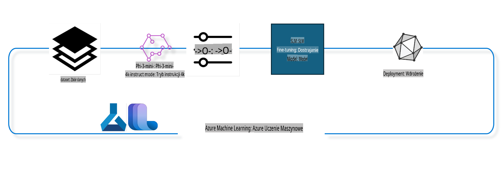

## Jak używać komponentów chat-completion z systemowego rejestru Azure ML do dostrajania modelu

W tym przykładzie przeprowadzimy dostrajanie modelu Phi-3-mini-4k-instruct, aby uzupełnić rozmowę między dwoma osobami, korzystając z zestawu danych ultrachat_200k.



Przykład pokaże, jak przeprowadzić dostrajanie za pomocą Azure ML SDK i Python, a następnie wdrożyć dostrojony model do punktu końcowego online w celu wnioskowania w czasie rzeczywistym.

### Dane treningowe

Wykorzystamy zestaw danych ultrachat_200k. Jest to mocno przefiltrowana wersja zestawu UltraChat, który został użyty do trenowania Zephyr-7B-β, nowoczesnego modelu czatu o 7 miliardach parametrów.

### Model

Użyjemy modelu Phi-3-mini-4k-instruct, aby pokazać, jak użytkownik może dostroić model do zadania chat-completion. Jeśli otworzyłeś ten notebook z karty konkretnego modelu, pamiętaj, aby zastąpić nazwę modelu odpowiednim modelem.

### Zadania

- Wybierz model do dostrajania.
- Wybierz i przeanalizuj dane treningowe.
- Skonfiguruj zadanie dostrajania.
- Uruchom zadanie dostrajania.
- Przejrzyj metryki treningowe i ewaluacyjne.
- Zarejestruj dostrojony model.
- Wdróż dostrojony model do wnioskowania w czasie rzeczywistym.
- Posprzątaj zasoby.

## 1. Przygotowanie wstępne

- Zainstaluj zależności.
- Połącz się z AzureML Workspace. Dowiedz się więcej o konfiguracji uwierzytelniania SDK. Zastąp <WORKSPACE_NAME>, <RESOURCE_GROUP> i <SUBSCRIPTION_ID> poniżej.
- Połącz się z systemowym rejestrem AzureML.
- Ustaw opcjonalną nazwę eksperymentu.
- Sprawdź lub utwórz zasób obliczeniowy.

> [!NOTE]
> Wymagania: jeden węzeł GPU może mieć wiele kart GPU. Na przykład w jednym węźle Standard_NC24rs_v3 znajdują się 4 karty NVIDIA V100, podczas gdy w Standard_NC12s_v3 są 2 karty NVIDIA V100. Odwołaj się do dokumentacji, aby uzyskać te informacje. Liczba kart GPU na węzeł jest ustawiana w parametrze `gpus_per_node` poniżej. Ustawienie tej wartości poprawnie zapewni wykorzystanie wszystkich GPU w węźle. Zalecane konfiguracje GPU można znaleźć tutaj i tutaj.

### Biblioteki Python

Zainstaluj zależności, uruchamiając poniższą komórkę. Ten krok nie jest opcjonalny, jeśli uruchamiasz środowisko po raz pierwszy.

```bash
pip install azure-ai-ml
pip install azure-identity
pip install datasets==2.9.0
pip install mlflow
pip install azureml-mlflow
```

### Interakcja z Azure ML

1. Ten skrypt Python służy do interakcji z usługą Azure Machine Learning (Azure ML). Oto, co robi:

    - Importuje niezbędne moduły z pakietów `azure.ai.ml`, `azure.identity` i `azure.ai.ml.entities`. Importuje również moduł `time`.

    - Próbuje uwierzytelnić się za pomocą `DefaultAzureCredential()`, co zapewnia uproszczone uwierzytelnianie w celu szybkiego rozpoczęcia pracy z aplikacjami w chmurze Azure. Jeśli to się nie powiedzie, przełącza się na `InteractiveBrowserCredential()`, który wyświetla interaktywny monit o zalogowanie.

    - Następnie próbuje utworzyć instancję `MLClient` za pomocą metody `from_config`, która odczytuje konfigurację z domyślnego pliku konfiguracyjnego (`config.json`). Jeśli to się nie powiedzie, tworzy instancję `MLClient`, ręcznie podając `subscription_id`, `resource_group_name` i `workspace_name`.

    - Tworzy kolejną instancję `MLClient`, tym razem dla rejestru Azure ML o nazwie "azureml". W tym rejestrze przechowywane są modele, pipeline'y dostrajania i środowiska.

    - Ustawia nazwę eksperymentu na "chat_completion_Phi-3-mini-4k-instruct".

    - Generuje unikalny znacznik czasu, konwertując aktualny czas (w sekundach od epoki, jako liczba zmiennoprzecinkowa) na liczbę całkowitą, a następnie na ciąg znaków. Ten znacznik czasu może być używany do tworzenia unikalnych nazw i wersji.

    ```python
    # Import necessary modules from Azure ML and Azure Identity
    from azure.ai.ml import MLClient
    from azure.identity import (
        DefaultAzureCredential,
        InteractiveBrowserCredential,
    )
    from azure.ai.ml.entities import AmlCompute
    import time  # Import time module
    
    # Try to authenticate using DefaultAzureCredential
    try:
        credential = DefaultAzureCredential()
        credential.get_token("https://management.azure.com/.default")
    except Exception as ex:  # If DefaultAzureCredential fails, use InteractiveBrowserCredential
        credential = InteractiveBrowserCredential()
    
    # Try to create an MLClient instance using the default config file
    try:
        workspace_ml_client = MLClient.from_config(credential=credential)
    except:  # If that fails, create an MLClient instance by manually providing the details
        workspace_ml_client = MLClient(
            credential,
            subscription_id="<SUBSCRIPTION_ID>",
            resource_group_name="<RESOURCE_GROUP>",
            workspace_name="<WORKSPACE_NAME>",
        )
    
    # Create another MLClient instance for the Azure ML registry named "azureml"
    # This registry is where models, fine-tuning pipelines, and environments are stored
    registry_ml_client = MLClient(credential, registry_name="azureml")
    
    # Set the experiment name
    experiment_name = "chat_completion_Phi-3-mini-4k-instruct"
    
    # Generate a unique timestamp that can be used for names and versions that need to be unique
    timestamp = str(int(time.time()))
    ```

## 2. Wybierz model bazowy do dostrajania

1. Phi-3-mini-4k-instruct to model z 3,8 miliarda parametrów, lekki, nowoczesny, zbudowany na podstawie zestawów danych używanych dla Phi-2. Model należy do rodziny Phi-3, a wersja Mini występuje w dwóch wariantach: 4K i 128K, które różnią się długością kontekstu (w tokenach), jaką mogą obsłużyć. Aby używać modelu, musimy go dostroić do naszego konkretnego celu. Możesz przeglądać te modele w katalogu modeli w AzureML Studio, filtrując według zadania chat-completion. W tym przykładzie używamy modelu Phi-3-mini-4k-instruct. Jeśli otworzyłeś ten notebook dla innego modelu, zastąp nazwę i wersję modelu odpowiednio.

    > [!NOTE]
    > Właściwość `model id` modelu. Będzie ona przekazywana jako dane wejściowe do zadania dostrajania. Jest również dostępna jako pole Asset ID na stronie szczegółów modelu w katalogu modeli AzureML Studio.

2. Ten skrypt Python służy do interakcji z usługą Azure Machine Learning (Azure ML). Oto, co robi:

    - Ustawia `model_name` na "Phi-3-mini-4k-instruct".

    - Używa metody `get` właściwości `models` obiektu `registry_ml_client`, aby pobrać najnowszą wersję modelu o określonej nazwie z rejestru Azure ML. Metoda `get` jest wywoływana z dwoma argumentami: nazwą modelu i etykietą określającą, że należy pobrać najnowszą wersję modelu.

    - Wyświetla komunikat w konsoli wskazujący nazwę, wersję i identyfikator modelu, który będzie używany do dostrajania. Metoda `format` ciągu znaków jest używana do wstawiania nazwy, wersji i identyfikatora modelu do komunikatu. Nazwa, wersja i identyfikator modelu są dostępne jako właściwości obiektu `foundation_model`.

    ```python
    # Set the model name
    model_name = "Phi-3-mini-4k-instruct"
    
    # Get the latest version of the model from the Azure ML registry
    foundation_model = registry_ml_client.models.get(model_name, label="latest")
    
    # Print the model name, version, and id
    # This information is useful for tracking and debugging
    print(
        "\n\nUsing model name: {0}, version: {1}, id: {2} for fine tuning".format(
            foundation_model.name, foundation_model.version, foundation_model.id
        )
    )
    ```

## 3. Utwórz zasób obliczeniowy do użycia z zadaniem

Zadanie dostrajania działa WYŁĄCZNIE z zasobami obliczeniowymi GPU. Rozmiar zasobu obliczeniowego zależy od wielkości modelu i w większości przypadków trudno jest zidentyfikować odpowiedni zasób do zadania. W tej komórce pomagamy użytkownikowi wybrać odpowiedni zasób obliczeniowy do zadania.

> [!NOTE]
> Poniższe konfiguracje zasobów działają z najbardziej zoptymalizowaną konfiguracją. Jakiekolwiek zmiany w konfiguracji mogą prowadzić do błędu "Cuda Out Of Memory". W takich przypadkach spróbuj uaktualnić zasób obliczeniowy do większego rozmiaru.

> [!NOTE]
> Wybierając `compute_cluster_size` poniżej, upewnij się, że zasób obliczeniowy jest dostępny w Twojej grupie zasobów. Jeśli dany zasób nie jest dostępny, możesz złożyć wniosek o dostęp do zasobów obliczeniowych.

### Sprawdzanie wsparcia modelu dla dostrajania

1. Ten skrypt Python sprawdza, czy model w Azure Machine Learning (Azure ML) obsługuje dostrajanie. Oto, co robi:

    - Importuje moduł `ast`, który dostarcza funkcji do przetwarzania drzew gramatyki abstrakcyjnej Pythona.

    - Sprawdza, czy obiekt `foundation_model` (reprezentujący model w Azure ML) posiada tag o nazwie `finetune_compute_allow_list`. Tag w Azure ML to para klucz-wartość, którą można tworzyć i używać do filtrowania i sortowania modeli.

    - Jeśli tag `finetune_compute_allow_list` jest obecny, używa funkcji `ast.literal_eval`, aby bezpiecznie przeanalizować wartość tagu (ciąg znaków) na listę Pythona. Lista ta jest następnie przypisywana do zmiennej `computes_allow_list`. Następnie wyświetla komunikat wskazujący, że zasób obliczeniowy powinien zostać utworzony z listy.

    - Jeśli tag `finetune_compute_allow_list` nie jest obecny, ustawia `computes_allow_list` na `None` i wyświetla komunikat wskazujący, że tag `finetune_compute_allow_list` nie jest częścią metadanych modelu.

    - Podsumowując, skrypt sprawdza określony tag w metadanych modelu, konwertuje wartość tagu na listę, jeśli istnieje, i odpowiednio informuje użytkownika.

    ```python
    # Import the ast module, which provides functions to process trees of the Python abstract syntax grammar
    import ast
    
    # Check if the 'finetune_compute_allow_list' tag is present in the model's tags
    if "finetune_compute_allow_list" in foundation_model.tags:
        # If the tag is present, use ast.literal_eval to safely parse the tag's value (a string) into a Python list
        computes_allow_list = ast.literal_eval(
            foundation_model.tags["finetune_compute_allow_list"]
        )  # convert string to python list
        # Print a message indicating that a compute should be created from the list
        print(f"Please create a compute from the above list - {computes_allow_list}")
    else:
        # If the tag is not present, set computes_allow_list to None
        computes_allow_list = None
        # Print a message indicating that the 'finetune_compute_allow_list' tag is not part of the model's tags
        print("`finetune_compute_allow_list` is not part of model tags")
    ```

### Sprawdzanie instancji obliczeniowej

1. Ten skrypt Python sprawdza kilka aspektów instancji obliczeniowej w usłudze Azure Machine Learning (Azure ML). Oto, co robi:

    - Próbuje pobrać instancję obliczeniową o nazwie zapisanej w `compute_cluster` z przestrzeni roboczej Azure ML. Jeśli stan prowizji instancji obliczeniowej to "failed", zgłasza błąd `ValueError`.

    - Sprawdza, czy `computes_allow_list` nie jest `None`. Jeśli nie jest, konwertuje wszystkie rozmiary zasobów obliczeniowych na liście na małe litery i sprawdza, czy rozmiar bieżącej instancji obliczeniowej znajduje się na liście. Jeśli nie, zgłasza błąd `ValueError`.

    - Jeśli `computes_allow_list` jest `None`, sprawdza, czy rozmiar instancji obliczeniowej znajduje się na liście nieobsługiwanych rozmiarów GPU VM. Jeśli tak, zgłasza błąd `ValueError`.

    - Pobiera listę wszystkich dostępnych rozmiarów zasobów obliczeniowych w przestrzeni roboczej. Następnie iteruje przez tę listę i dla każdego rozmiaru zasobu obliczeniowego sprawdza, czy jego nazwa pasuje do rozmiaru bieżącej instancji obliczeniowej. Jeśli tak, pobiera liczbę GPU dla tego rozmiaru zasobu obliczeniowego i ustawia `gpu_count_found` na `True`.

    - Jeśli `gpu_count_found` to `True`, wyświetla liczbę GPU w instancji obliczeniowej. Jeśli `gpu_count_found` to `False`, zgłasza błąd `ValueError`.

    - Podsumowując, skrypt wykonuje kilka kontroli instancji obliczeniowej w przestrzeni roboczej Azure ML, w tym sprawdza jej stan prowizji, rozmiar względem listy dozwolonych lub zabronionych zasobów oraz liczbę GPU, jakie posiada.

    ```python
    # Print the exception message
    print(e)
    # Raise a ValueError if the compute size is not available in the workspace
    raise ValueError(
        f"WARNING! Compute size {compute_cluster_size} not available in workspace"
    )
    
    # Retrieve the compute instance from the Azure ML workspace
    compute = workspace_ml_client.compute.get(compute_cluster)
    # Check if the provisioning state of the compute instance is "failed"
    if compute.provisioning_state.lower() == "failed":
        # Raise a ValueError if the provisioning state is "failed"
        raise ValueError(
            f"Provisioning failed, Compute '{compute_cluster}' is in failed state. "
            f"please try creating a different compute"
        )
    
    # Check if computes_allow_list is not None
    if computes_allow_list is not None:
        # Convert all compute sizes in computes_allow_list to lowercase
        computes_allow_list_lower_case = [x.lower() for x in computes_allow_list]
        # Check if the size of the compute instance is in computes_allow_list_lower_case
        if compute.size.lower() not in computes_allow_list_lower_case:
            # Raise a ValueError if the size of the compute instance is not in computes_allow_list_lower_case
            raise ValueError(
                f"VM size {compute.size} is not in the allow-listed computes for finetuning"
            )
    else:
        # Define a list of unsupported GPU VM sizes
        unsupported_gpu_vm_list = [
            "standard_nc6",
            "standard_nc12",
            "standard_nc24",
            "standard_nc24r",
        ]
        # Check if the size of the compute instance is in unsupported_gpu_vm_list
        if compute.size.lower() in unsupported_gpu_vm_list:
            # Raise a ValueError if the size of the compute instance is in unsupported_gpu_vm_list
            raise ValueError(
                f"VM size {compute.size} is currently not supported for finetuning"
            )
    
    # Initialize a flag to check if the number of GPUs in the compute instance has been found
    gpu_count_found = False
    # Retrieve a list of all available compute sizes in the workspace
    workspace_compute_sku_list = workspace_ml_client.compute.list_sizes()
    available_sku_sizes = []
    # Iterate over the list of available compute sizes
    for compute_sku in workspace_compute_sku_list:
        available_sku_sizes.append(compute_sku.name)
        # Check if the name of the compute size matches the size of the compute instance
        if compute_sku.name.lower() == compute.size.lower():
            # If it does, retrieve the number of GPUs for that compute size and set gpu_count_found to True
            gpus_per_node = compute_sku.gpus
            gpu_count_found = True
    # If gpu_count_found is True, print the number of GPUs in the compute instance
    if gpu_count_found:
        print(f"Number of GPU's in compute {compute.size}: {gpus_per_node}")
    else:
        # If gpu_count_found is False, raise a ValueError
        raise ValueError(
            f"Number of GPU's in compute {compute.size} not found. Available skus are: {available_sku_sizes}."
            f"This should not happen. Please check the selected compute cluster: {compute_cluster} and try again."
        )
    ```
pipeline szkoleniowy oparty na różnych parametrach, a następnie wyświetlenie tej nazwy. ```python
    # Define a function to generate a display name for the training pipeline
    def get_pipeline_display_name():
        # Calculate the total batch size by multiplying the per-device batch size, the number of gradient accumulation steps, the number of GPUs per node, and the number of nodes used for fine-tuning
        batch_size = (
            int(finetune_parameters.get("per_device_train_batch_size", 1))
            * int(finetune_parameters.get("gradient_accumulation_steps", 1))
            * int(gpus_per_node)
            * int(finetune_parameters.get("num_nodes_finetune", 1))
        )
        # Retrieve the learning rate scheduler type
        scheduler = finetune_parameters.get("lr_scheduler_type", "linear")
        # Retrieve whether DeepSpeed is applied
        deepspeed = finetune_parameters.get("apply_deepspeed", "false")
        # Retrieve the DeepSpeed stage
        ds_stage = finetune_parameters.get("deepspeed_stage", "2")
        # If DeepSpeed is applied, include "ds" followed by the DeepSpeed stage in the display name; if not, include "nods"
        if deepspeed == "true":
            ds_string = f"ds{ds_stage}"
        else:
            ds_string = "nods"
        # Retrieve whether Layer-wise Relevance Propagation (LoRa) is applied
        lora = finetune_parameters.get("apply_lora", "false")
        # If LoRa is applied, include "lora" in the display name; if not, include "nolora"
        if lora == "true":
            lora_string = "lora"
        else:
            lora_string = "nolora"
        # Retrieve the limit on the number of model checkpoints to keep
        save_limit = finetune_parameters.get("save_total_limit", -1)
        # Retrieve the maximum sequence length
        seq_len = finetune_parameters.get("max_seq_length", -1)
        # Construct the display name by concatenating all these parameters, separated by hyphens
        return (
            model_name
            + "-"
            + "ultrachat"
            + "-"
            + f"bs{batch_size}"
            + "-"
            + f"{scheduler}"
            + "-"
            + ds_string
            + "-"
            + lora_string
            + f"-save_limit{save_limit}"
            + f"-seqlen{seq_len}"
        )
    
    # Call the function to generate the display name
    pipeline_display_name = get_pipeline_display_name()
    # Print the display name
    print(f"Display name used for the run: {pipeline_display_name}")
    ``` 

### Konfigurowanie Pipeline

Ten skrypt w Pythonie definiuje i konfiguruje pipeline uczenia maszynowego przy użyciu Azure Machine Learning SDK. Oto szczegóły, co robi:

1. Importuje niezbędne moduły z Azure AI ML SDK.  
2. Pobiera komponent pipeline o nazwie "chat_completion_pipeline" z rejestru.  
3. Definiuje zadanie pipeline za pomocą `@pipeline` decorator and the function `create_pipeline`. The name of the pipeline is set to `pipeline_display_name`.

1. Inside the `create_pipeline` function, it initializes the fetched pipeline component with various parameters, including the model path, compute clusters for different stages, dataset splits for training and testing, the number of GPUs to use for fine-tuning, and other fine-tuning parameters.

1. It maps the output of the fine-tuning job to the output of the pipeline job. This is done so that the fine-tuned model can be easily registered, which is required to deploy the model to an online or batch endpoint.

1. It creates an instance of the pipeline by calling the `create_pipeline` function.

1. It sets the `force_rerun` setting of the pipeline to `True`, meaning that cached results from previous jobs will not be used.

1. It sets the `continue_on_step_failure` setting of the pipeline to `False`, co oznacza, że pipeline zostanie zatrzymany, jeśli jakikolwiek krok się nie powiedzie.  
4. Podsumowując, ten skrypt definiuje i konfiguruje pipeline uczenia maszynowego do zadania uzupełniania czatu przy użyciu Azure Machine Learning SDK.  

```python
    # Import necessary modules from the Azure AI ML SDK
    from azure.ai.ml.dsl import pipeline
    from azure.ai.ml import Input
    
    # Fetch the pipeline component named "chat_completion_pipeline" from the registry
    pipeline_component_func = registry_ml_client.components.get(
        name="chat_completion_pipeline", label="latest"
    )
    
    # Define the pipeline job using the @pipeline decorator and the function create_pipeline
    # The name of the pipeline is set to pipeline_display_name
    @pipeline(name=pipeline_display_name)
    def create_pipeline():
        # Initialize the fetched pipeline component with various parameters
        # These include the model path, compute clusters for different stages, dataset splits for training and testing, the number of GPUs to use for fine-tuning, and other fine-tuning parameters
        chat_completion_pipeline = pipeline_component_func(
            mlflow_model_path=foundation_model.id,
            compute_model_import=compute_cluster,
            compute_preprocess=compute_cluster,
            compute_finetune=compute_cluster,
            compute_model_evaluation=compute_cluster,
            # Map the dataset splits to parameters
            train_file_path=Input(
                type="uri_file", path="./ultrachat_200k_dataset/train_sft.jsonl"
            ),
            test_file_path=Input(
                type="uri_file", path="./ultrachat_200k_dataset/test_sft.jsonl"
            ),
            # Training settings
            number_of_gpu_to_use_finetuning=gpus_per_node,  # Set to the number of GPUs available in the compute
            **finetune_parameters
        )
        return {
            # Map the output of the fine tuning job to the output of pipeline job
            # This is done so that we can easily register the fine tuned model
            # Registering the model is required to deploy the model to an online or batch endpoint
            "trained_model": chat_completion_pipeline.outputs.mlflow_model_folder
        }
    
    # Create an instance of the pipeline by calling the create_pipeline function
    pipeline_object = create_pipeline()
    
    # Don't use cached results from previous jobs
    pipeline_object.settings.force_rerun = True
    
    # Set continue on step failure to False
    # This means that the pipeline will stop if any step fails
    pipeline_object.settings.continue_on_step_failure = False
    ```  

### Wysyłanie Zadania  

1. Ten skrypt w Pythonie wysyła zadanie pipeline uczenia maszynowego do przestrzeni roboczej Azure Machine Learning i czeka na jego zakończenie. Oto szczegóły, co robi:  

   - Wywołuje metodę create_or_update obiektu jobs w workspace_ml_client, aby wysłać zadanie pipeline. Pipeline, który ma zostać uruchomiony, jest określony przez pipeline_object, a eksperyment, w ramach którego zadanie jest uruchamiane, jest określony przez experiment_name.  
   - Następnie wywołuje metodę stream obiektu jobs w workspace_ml_client, aby poczekać na zakończenie zadania pipeline. Zadanie, na które należy czekać, jest określone przez atrybut name obiektu pipeline_job.  
   - Podsumowując, ten skrypt wysyła zadanie pipeline uczenia maszynowego do przestrzeni roboczej Azure Machine Learning i czeka na jego zakończenie.  

```python
    # Submit the pipeline job to the Azure Machine Learning workspace
    # The pipeline to be run is specified by pipeline_object
    # The experiment under which the job is run is specified by experiment_name
    pipeline_job = workspace_ml_client.jobs.create_or_update(
        pipeline_object, experiment_name=experiment_name
    )
    
    # Wait for the pipeline job to complete
    # The job to wait for is specified by the name attribute of the pipeline_job object
    workspace_ml_client.jobs.stream(pipeline_job.name)
    ```  

## 6. Rejestracja dostrojonego modelu w przestrzeni roboczej  

Zarejestrujemy model z wyników zadania dostrajania. Pozwoli to śledzić pochodzenie pomiędzy dostrojonym modelem a zadaniem dostrajania. Zadanie dostrajania z kolei śledzi pochodzenie względem modelu bazowego, danych i kodu szkoleniowego.  

### Rejestrowanie Modelu ML  

1. Ten skrypt w Pythonie rejestruje model uczenia maszynowego, który został wytrenowany w pipeline Azure Machine Learning. Oto szczegóły, co robi:  

   - Importuje niezbędne moduły z Azure AI ML SDK.  
   - Sprawdza, czy wynik trained_model jest dostępny z zadania pipeline, wywołując metodę get obiektu jobs w workspace_ml_client i uzyskując dostęp do jego atrybutu outputs.  
   - Tworzy ścieżkę do wytrenowanego modelu, formatując ciąg znaków z nazwą zadania pipeline i nazwą wyniku ("trained_model").  
   - Definiuje nazwę dla dostrojonego modelu, dodając "-ultrachat-200k" do oryginalnej nazwy modelu i zamieniając wszystkie ukośniki na myślniki.  
   - Przygotowuje rejestrację modelu, tworząc obiekt Model z różnymi parametrami, w tym ścieżką do modelu, typem modelu (model MLflow), nazwą i wersją modelu oraz opisem modelu.  
   - Rejestruje model, wywołując metodę create_or_update obiektu models w workspace_ml_client z obiektem Model jako argumentem.  
   - Wyświetla zarejestrowany model.  

   - Podsumowując, ten skrypt rejestruje model uczenia maszynowego, który został wytrenowany w pipeline Azure Machine Learning.  

```python
    # Import necessary modules from the Azure AI ML SDK
    from azure.ai.ml.entities import Model
    from azure.ai.ml.constants import AssetTypes
    
    # Check if the `trained_model` output is available from the pipeline job
    print("pipeline job outputs: ", workspace_ml_client.jobs.get(pipeline_job.name).outputs)
    
    # Construct a path to the trained model by formatting a string with the name of the pipeline job and the name of the output ("trained_model")
    model_path_from_job = "azureml://jobs/{0}/outputs/{1}".format(
        pipeline_job.name, "trained_model"
    )
    
    # Define a name for the fine-tuned model by appending "-ultrachat-200k" to the original model name and replacing any slashes with hyphens
    finetuned_model_name = model_name + "-ultrachat-200k"
    finetuned_model_name = finetuned_model_name.replace("/", "-")
    
    print("path to register model: ", model_path_from_job)
    
    # Prepare to register the model by creating a Model object with various parameters
    # These include the path to the model, the type of the model (MLflow model), the name and version of the model, and a description of the model
    prepare_to_register_model = Model(
        path=model_path_from_job,
        type=AssetTypes.MLFLOW_MODEL,
        name=finetuned_model_name,
        version=timestamp,  # Use timestamp as version to avoid version conflict
        description=model_name + " fine tuned model for ultrachat 200k chat-completion",
    )
    
    print("prepare to register model: \n", prepare_to_register_model)
    
    # Register the model by calling the create_or_update method of the models object in the workspace_ml_client with the Model object as the argument
    registered_model = workspace_ml_client.models.create_or_update(
        prepare_to_register_model
    )
    
    # Print the registered model
    print("registered model: \n", registered_model)
    ```  

## 7. Wdrażanie dostrojonego modelu do punktu końcowego online  

Punkty końcowe online oferują trwałe API REST, które można zintegrować z aplikacjami korzystającymi z modelu.  

### Zarządzanie Punktem Końcowym  

1. Ten skrypt w Pythonie tworzy zarządzany punkt końcowy online w Azure Machine Learning dla zarejestrowanego modelu. Oto szczegóły, co robi:  

   - Importuje niezbędne moduły z Azure AI ML SDK.  
   - Definiuje unikalną nazwę dla punktu końcowego online, dodając znacznik czasu do ciągu "ultrachat-completion-".  
   - Przygotowuje utworzenie punktu końcowego online, tworząc obiekt ManagedOnlineEndpoint z różnymi parametrami, w tym nazwą punktu końcowego, opisem punktu końcowego i trybem uwierzytelniania ("key").  
   - Tworzy punkt końcowy online, wywołując metodę begin_create_or_update obiektu workspace_ml_client z obiektem ManagedOnlineEndpoint jako argumentem. Następnie czeka na zakończenie operacji tworzenia, wywołując metodę wait.  

   - Podsumowując, ten skrypt tworzy zarządzany punkt końcowy online w Azure Machine Learning dla zarejestrowanego modelu.  

```python
    # Import necessary modules from the Azure AI ML SDK
    from azure.ai.ml.entities import (
        ManagedOnlineEndpoint,
        ManagedOnlineDeployment,
        ProbeSettings,
        OnlineRequestSettings,
    )
    
    # Define a unique name for the online endpoint by appending a timestamp to the string "ultrachat-completion-"
    online_endpoint_name = "ultrachat-completion-" + timestamp
    
    # Prepare to create the online endpoint by creating a ManagedOnlineEndpoint object with various parameters
    # These include the name of the endpoint, a description of the endpoint, and the authentication mode ("key")
    endpoint = ManagedOnlineEndpoint(
        name=online_endpoint_name,
        description="Online endpoint for "
        + registered_model.name
        + ", fine tuned model for ultrachat-200k-chat-completion",
        auth_mode="key",
    )
    
    # Create the online endpoint by calling the begin_create_or_update method of the workspace_ml_client with the ManagedOnlineEndpoint object as the argument
    # Then wait for the creation operation to complete by calling the wait method
    workspace_ml_client.begin_create_or_update(endpoint).wait()
    ```  

> [!NOTE]  
> Listę SKU obsługiwanych dla wdrożeń można znaleźć tutaj - [Managed online endpoints SKU list](https://learn.microsoft.com/azure/machine-learning/reference-managed-online-endpoints-vm-sku-list)  

### Wdrażanie Modelu ML  

1. Ten skrypt w Pythonie wdraża zarejestrowany model uczenia maszynowego do zarządzanego punktu końcowego online w Azure Machine Learning. Oto szczegóły, co robi:  

   - Importuje moduł ast, który zapewnia funkcje do przetwarzania drzew składni abstrakcyjnej Pythona.  
   - Ustawia typ instancji na "Standard_NC6s_v3".  
   - Sprawdza, czy tag inference_compute_allow_list jest obecny w modelu bazowym. Jeśli tak, konwertuje wartość tagu z ciągu na listę Pythona i przypisuje ją do inference_computes_allow_list. Jeśli nie, ustawia inference_computes_allow_list na None.  
   - Sprawdza, czy określony typ instancji znajduje się na liście dozwolonych. Jeśli nie, wyświetla komunikat proszący użytkownika o wybranie typu instancji z listy dozwolonych.  
   - Przygotowuje utworzenie wdrożenia, tworząc obiekt ManagedOnlineDeployment z różnymi parametrami, w tym nazwą wdrożenia, nazwą punktu końcowego, ID modelu, typem i liczbą instancji, ustawieniami liveness probe oraz ustawieniami żądań.  
   - Tworzy wdrożenie, wywołując metodę begin_create_or_update obiektu workspace_ml_client z obiektem ManagedOnlineDeployment jako argumentem. Następnie czeka na zakończenie operacji tworzenia, wywołując metodę wait.  
   - Ustawia ruch punktu końcowego, aby kierować 100% ruchu do wdrożenia "demo".  
   - Aktualizuje punkt końcowy, wywołując metodę begin_create_or_update obiektu workspace_ml_client z obiektem punktu końcowego jako argumentem. Następnie czeka na zakończenie operacji aktualizacji, wywołując metodę result.  

   - Podsumowując, ten skrypt wdraża zarejestrowany model uczenia maszynowego do zarządzanego punktu końcowego online w Azure Machine Learning.  

```python
    # Import the ast module, which provides functions to process trees of the Python abstract syntax grammar
    import ast
    
    # Set the instance type for the deployment
    instance_type = "Standard_NC6s_v3"
    
    # Check if the `inference_compute_allow_list` tag is present in the foundation model
    if "inference_compute_allow_list" in foundation_model.tags:
        # If it is, convert the tag value from a string to a Python list and assign it to `inference_computes_allow_list`
        inference_computes_allow_list = ast.literal_eval(
            foundation_model.tags["inference_compute_allow_list"]
        )
        print(f"Please create a compute from the above list - {computes_allow_list}")
    else:
        # If it's not, set `inference_computes_allow_list` to `None`
        inference_computes_allow_list = None
        print("`inference_compute_allow_list` is not part of model tags")
    
    # Check if the specified instance type is in the allow list
    if (
        inference_computes_allow_list is not None
        and instance_type not in inference_computes_allow_list
    ):
        print(
            f"`instance_type` is not in the allow listed compute. Please select a value from {inference_computes_allow_list}"
        )
    
    # Prepare to create the deployment by creating a `ManagedOnlineDeployment` object with various parameters
    demo_deployment = ManagedOnlineDeployment(
        name="demo",
        endpoint_name=online_endpoint_name,
        model=registered_model.id,
        instance_type=instance_type,
        instance_count=1,
        liveness_probe=ProbeSettings(initial_delay=600),
        request_settings=OnlineRequestSettings(request_timeout_ms=90000),
    )
    
    # Create the deployment by calling the `begin_create_or_update` method of the `workspace_ml_client` with the `ManagedOnlineDeployment` object as the argument
    # Then wait for the creation operation to complete by calling the `wait` method
    workspace_ml_client.online_deployments.begin_create_or_update(demo_deployment).wait()
    
    # Set the traffic of the endpoint to direct 100% of the traffic to the "demo" deployment
    endpoint.traffic = {"demo": 100}
    
    # Update the endpoint by calling the `begin_create_or_update` method of the `workspace_ml_client` with the `endpoint` object as the argument
    # Then wait for the update operation to complete by calling the `result` method
    workspace_ml_client.begin_create_or_update(endpoint).result()
    ```  

## 8. Testowanie punktu końcowego z danymi przykładowymi  

Pobierzemy przykładowe dane z zestawu testowego i prześlemy je do punktu końcowego online w celu uzyskania predykcji. Następnie wyświetlimy etykiety wynikowe obok etykiet rzeczywistych.  

### Odczytywanie wyników  

1. Ten skrypt w Pythonie odczytuje plik JSON Lines do DataFrame w pandas, wybiera losową próbkę i resetuje indeks. Oto szczegóły, co robi:  

   - Odczytuje plik ./ultrachat_200k_dataset/test_gen.jsonl do DataFrame w pandas. Funkcja read_json jest używana z argumentem lines=True, ponieważ plik jest w formacie JSON Lines, gdzie każda linia jest oddzielnym obiektem JSON.  
   - Wybiera losową próbkę 1 wiersza z DataFrame. Funkcja sample jest używana z argumentem n=1, aby określić liczbę losowych wierszy do wyboru.  
   - Resetuje indeks DataFrame. Funkcja reset_index jest używana z argumentem drop=True, aby usunąć oryginalny indeks i zastąpić go nowym indeksem z domyślnymi wartościami całkowitymi.  
   - Wyświetla pierwsze 2 wiersze DataFrame za pomocą funkcji head z argumentem 2. Jednakże, ponieważ DataFrame zawiera tylko jeden wiersz po próbkowaniu, zostanie wyświetlony tylko ten jeden wiersz.  

   - Podsumowując, ten skrypt odczytuje plik JSON Lines do DataFrame w pandas, wybiera losową próbkę 1 wiersza, resetuje indeks i wyświetla pierwszy wiersz.  

```python
    # Import pandas library
    import pandas as pd
    
    # Read the JSON Lines file './ultrachat_200k_dataset/test_gen.jsonl' into a pandas DataFrame
    # The 'lines=True' argument indicates that the file is in JSON Lines format, where each line is a separate JSON object
    test_df = pd.read_json("./ultrachat_200k_dataset/test_gen.jsonl", lines=True)
    
    # Take a random sample of 1 row from the DataFrame
    # The 'n=1' argument specifies the number of random rows to select
    test_df = test_df.sample(n=1)
    
    # Reset the index of the DataFrame
    # The 'drop=True' argument indicates that the original index should be dropped and replaced with a new index of default integer values
    # The 'inplace=True' argument indicates that the DataFrame should be modified in place (without creating a new object)
    test_df.reset_index(drop=True, inplace=True)
    
    # Display the first 2 rows of the DataFrame
    # However, since the DataFrame only contains one row after the sampling, this will only display that one row
    test_df.head(2)
    ```  

### Tworzenie Obiektu JSON  

1. Ten skrypt w Pythonie tworzy obiekt JSON z określonymi parametrami i zapisuje go do pliku. Oto szczegóły, co robi:  

   - Importuje moduł json, który zapewnia funkcje do pracy z danymi JSON.  
   - Tworzy słownik parameters z kluczami i wartościami reprezentującymi parametry dla modelu uczenia maszynowego. Kluczami są "temperature", "top_p", "do_sample" i "max_new_tokens", a ich odpowiednimi wartościami są 0.6, 0.9, True i 200.  
   - Tworzy inny słownik test_json z dwoma kluczami: "input_data" i "params". Wartość "input_data" to inny słownik z kluczami "input_string" i "parameters". Wartość "input_string" to lista zawierająca pierwszą wiadomość z DataFrame test_df. Wartość "parameters" to wcześniej utworzony słownik parameters. Wartość "params" to pusty słownik.  
   - Otwiera plik o nazwie sample_score.json.  

```python
    # Import the json module, which provides functions to work with JSON data
    import json
    
    # Create a dictionary `parameters` with keys and values that represent parameters for a machine learning model
    # The keys are "temperature", "top_p", "do_sample", and "max_new_tokens", and their corresponding values are 0.6, 0.9, True, and 200 respectively
    parameters = {
        "temperature": 0.6,
        "top_p": 0.9,
        "do_sample": True,
        "max_new_tokens": 200,
    }
    
    # Create another dictionary `test_json` with two keys: "input_data" and "params"
    # The value of "input_data" is another dictionary with keys "input_string" and "parameters"
    # The value of "input_string" is a list containing the first message from the `test_df` DataFrame
    # The value of "parameters" is the `parameters` dictionary created earlier
    # The value of "params" is an empty dictionary
    test_json = {
        "input_data": {
            "input_string": [test_df["messages"][0]],
            "parameters": parameters,
        },
        "params": {},
    }
    
    # Open a file named `sample_score.json` in the `./ultrachat_200k_dataset` directory in write mode
    with open("./ultrachat_200k_dataset/sample_score.json", "w") as f:
        # Write the `test_json` dictionary to the file in JSON format using the `json.dump` function
        json.dump(test_json, f)
    ```  

### Wywoływanie Punktu Końcowego  

1. Ten skrypt w Pythonie wywołuje punkt końcowy online w Azure Machine Learning, aby ocenić plik JSON. Oto szczegóły, co robi:  

   - Wywołuje metodę invoke właściwości online_endpoints obiektu workspace_ml_client. Ta metoda jest używana do wysyłania żądania do punktu końcowego online i uzyskiwania odpowiedzi.  
   - Określa nazwę punktu końcowego i wdrożenia za pomocą argumentów endpoint_name i deployment_name. W tym przypadku nazwa punktu końcowego jest przechowywana w zmiennej online_endpoint_name, a nazwa wdrożenia to "demo".  
   - Określa ścieżkę do pliku JSON, który ma zostać oceniony, za pomocą argumentu request_file. W tym przypadku plik to ./ultrachat_200k_dataset/sample_score.json.  
   - Przechowuje odpowiedź z punktu końcowego w zmiennej response.  
   - Wyświetla surową odpowiedź.  

   - Podsumowując, ten skrypt wywołuje punkt końcowy online w Azure Machine Learning, aby ocenić plik JSON i wyświetla odpowiedź.  

```python
    # Invoke the online endpoint in Azure Machine Learning to score the `sample_score.json` file
    # The `invoke` method of the `online_endpoints` property of the `workspace_ml_client` object is used to send a request to an online endpoint and get a response
    # The `endpoint_name` argument specifies the name of the endpoint, which is stored in the `online_endpoint_name` variable
    # The `deployment_name` argument specifies the name of the deployment, which is "demo"
    # The `request_file` argument specifies the path to the JSON file to be scored, which is `./ultrachat_200k_dataset/sample_score.json`
    response = workspace_ml_client.online_endpoints.invoke(
        endpoint_name=online_endpoint_name,
        deployment_name="demo",
        request_file="./ultrachat_200k_dataset/sample_score.json",
    )
    
    # Print the raw response from the endpoint
    print("raw response: \n", response, "\n")
    ```  

## 9. Usuwanie punktu końcowego online  

1. Nie zapomnij usunąć punktu końcowego online, w przeciwnym razie licznik rozliczeniowy dla używanej przez punkt końcowy mocy obliczeniowej pozostanie włączony. Ten fragment kodu w Pythonie usuwa punkt końcowy online w Azure Machine Learning. Oto szczegóły, co robi:  

   - Wywołuje metodę begin_delete właściwości online_endpoints obiektu workspace_ml_client. Ta metoda jest używana do rozpoczęcia usuwania punktu końcowego online.  
   - Określa nazwę punktu końcowego do usunięcia za pomocą argumentu name. W tym przypadku nazwa punktu końcowego jest przechowywana w zmiennej online_endpoint_name.  
   - Wywołuje metodę wait, aby poczekać na zakończenie operacji usuwania. Jest to operacja blokująca, co oznacza, że uniemożliwi kontynuowanie skryptu, dopóki usuwanie nie zostanie zakończone.  

   - Podsumowując, ten fragment kodu rozpoczyna usuwanie punktu końcowego online w Azure Machine Learning i czeka na zakończenie operacji.  

```python
    # Delete the online endpoint in Azure Machine Learning
    # The `begin_delete` method of the `online_endpoints` property of the `workspace_ml_client` object is used to start the deletion of an online endpoint
    # The `name` argument specifies the name of the endpoint to be deleted, which is stored in the `online_endpoint_name` variable
    # The `wait` method is called to wait for the deletion operation to complete. This is a blocking operation, meaning that it will prevent the script from continuing until the deletion is finished
    workspace_ml_client.online_endpoints.begin_delete(name=online_endpoint_name).wait()
    ```  

**Zastrzeżenie**:  
Niniejszy dokument został przetłumaczony za pomocą usług tłumaczenia opartego na sztucznej inteligencji. Chociaż dokładamy wszelkich starań, aby zapewnić precyzję, prosimy mieć na uwadze, że automatyczne tłumaczenia mogą zawierać błędy lub nieścisłości. Oryginalny dokument w jego rodzimym języku powinien być uznawany za źródło autorytatywne. W przypadku informacji krytycznych zaleca się skorzystanie z profesjonalnego tłumaczenia wykonywanego przez człowieka. Nie ponosimy odpowiedzialności za jakiekolwiek nieporozumienia lub błędne interpretacje wynikające z korzystania z tego tłumaczenia.