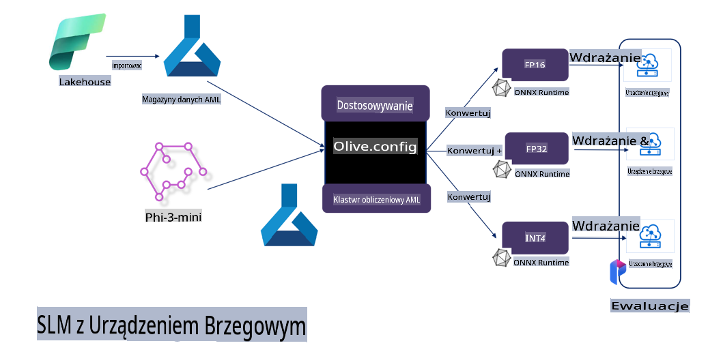

# **Dostosowywanie Phi-3 z Microsoft Olive**

[Olive](https://github.com/microsoft/OLive?WT.mc_id=aiml-138114-kinfeylo) to łatwe w użyciu narzędzie do optymalizacji modeli uwzględniające specyfikę sprzętu, które łączy w sobie wiodące w branży techniki kompresji, optymalizacji i kompilacji modeli.

Zostało zaprojektowane, aby uprościć proces optymalizacji modeli uczenia maszynowego, zapewniając ich najbardziej efektywne wykorzystanie w określonych architekturach sprzętowych.

Niezależnie od tego, czy pracujesz nad aplikacjami w chmurze, czy na urządzeniach brzegowych, Olive umożliwia optymalizację modeli w sposób prosty i skuteczny.

## Kluczowe funkcje:
- Olive agreguje i automatyzuje techniki optymalizacji dla określonych platform sprzętowych.
- Nie istnieje jedna uniwersalna technika optymalizacji, dlatego Olive umożliwia rozszerzanie funkcjonalności poprzez włączanie innowacji ekspertów branżowych.

## Redukcja wysiłku inżynieryjnego:
- Programiści często muszą uczyć się i korzystać z różnych narzędzi specyficznych dla dostawców sprzętu, aby przygotować i zoptymalizować modele do wdrożenia.
- Olive upraszcza ten proces, automatyzując techniki optymalizacji dla wybranego sprzętu.

## Gotowe kompleksowe rozwiązanie do optymalizacji:

Poprzez komponowanie i dostosowywanie zintegrowanych technik, Olive oferuje jednolite rozwiązanie do kompleksowej optymalizacji.
Podczas optymalizacji modeli uwzględnia takie ograniczenia jak dokładność i opóźnienie.

## Korzystanie z Microsoft Olive do dostosowywania

Microsoft Olive to bardzo proste w użyciu narzędzie open source do optymalizacji modeli, które może obsługiwać zarówno dostosowywanie, jak i odniesienie w dziedzinie generatywnej sztucznej inteligencji. Wymaga jedynie prostych konfiguracji, a w połączeniu z użyciem otwartoźródłowych małych modeli językowych oraz odpowiednich środowisk uruchomieniowych (AzureML / lokalny GPU, CPU, DirectML), umożliwia automatyczną optymalizację modelu w celu dostosowania lub odniesienia. Ułatwia to znalezienie najlepszego modelu do wdrożenia w chmurze lub na urządzeniach brzegowych. Pozwala przedsiębiorstwom na budowanie własnych modeli wertykalnych na miejscu i w chmurze.


## Dostosowywanie Phi-3 z Microsoft Olive 



## Przykładowy kod i przykład Olive dla Phi-3
W tym przykładzie użyjesz Olive, aby:

- Dostosować adapter LoRA do klasyfikacji fraz na kategorie: Smutek, Radość, Strach, Zaskoczenie.
- Połączyć wagi adaptera z modelem bazowym.
- Zoptymalizować i skwantyzować model do formatu int4.

[Przykładowy kod](../../code/03.Finetuning/olive-ort-example/README.md)

### Instalacja Microsoft Olive

Instalacja Microsoft Olive jest bardzo prosta i możliwa zarówno dla CPU, GPU, DirectML, jak i Azure ML.

```bash
pip install olive-ai
```

Jeśli chcesz uruchomić model ONNX na CPU, możesz użyć

```bash
pip install olive-ai[cpu]
```

Jeśli chcesz uruchomić model ONNX na GPU, możesz użyć

```python
pip install olive-ai[gpu]
```

Jeśli chcesz użyć Azure ML, użyj

```python
pip install git+https://github.com/microsoft/Olive#egg=olive-ai[azureml]
```

**Uwaga**
Wymagania systemowe: Ubuntu 20.04 / 22.04 

### **Plik Config.json Microsoft Olive**

Po instalacji możesz skonfigurować różne ustawienia specyficzne dla modelu za pomocą pliku Config, w tym dane, obliczenia, trening, wdrożenie i generowanie modelu.

**1. Dane**

Microsoft Olive obsługuje trening na danych lokalnych oraz w chmurze, co można skonfigurować w ustawieniach.

*Ustawienia danych lokalnych*

Możesz łatwo skonfigurować zestaw danych do dostosowywania, zwykle w formacie json, i dostosować go do szablonu danych. Należy to dostosować do wymagań modelu (na przykład do formatu wymaganego przez Microsoft Phi-3-mini. Jeśli masz inne modele, zapoznaj się z wymaganymi formatami dostosowywania dla innych modeli).

```json

    "data_configs": [
        {
            "name": "dataset_default_train",
            "type": "HuggingfaceContainer",
            "load_dataset_config": {
                "params": {
                    "data_name": "json", 
                    "data_files":"dataset/dataset-classification.json",
                    "split": "train"
                }
            },
            "pre_process_data_config": {
                "params": {
                    "dataset_type": "corpus",
                    "text_cols": [
                            "phrase",
                            "tone"
                    ],
                    "text_template": "### Text: {phrase}\n### The tone is:\n{tone}",
                    "corpus_strategy": "join",
                    "source_max_len": 2048,
                    "pad_to_max_len": false,
                    "use_attention_mask": false
                }
            }
        }
    ],
```

**Ustawienia danych w chmurze**

Poprzez połączenie z magazynem danych Azure AI Studio/Azure Machine Learning Service możesz wprowadzać różne źródła danych do Azure AI Studio/Azure Machine Learning Service za pomocą Microsoft Fabric i Azure Data, wspierając dostosowywanie danych.

```json

    "data_configs": [
        {
            "name": "dataset_default_train",
            "type": "HuggingfaceContainer",
            "load_dataset_config": {
                "params": {
                    "data_name": "json", 
                    "data_files": {
                        "type": "azureml_datastore",
                        "config": {
                            "azureml_client": {
                                "subscription_id": "Your Azure Subscrition ID",
                                "resource_group": "Your Azure Resource Group",
                                "workspace_name": "Your Azure ML Workspaces name"
                            },
                            "datastore_name": "workspaceblobstore",
                            "relative_path": "Your train_data.json Azure ML Location"
                        }
                    },
                    "split": "train"
                }
            },
            "pre_process_data_config": {
                "params": {
                    "dataset_type": "corpus",
                    "text_cols": [
                            "Question",
                            "Best Answer"
                    ],
                    "text_template": "<|user|>\n{Question}<|end|>\n<|assistant|>\n{Best Answer}\n<|end|>",
                    "corpus_strategy": "join",
                    "source_max_len": 2048,
                    "pad_to_max_len": false,
                    "use_attention_mask": false
                }
            }
        }
    ],
    
```

**2. Konfiguracja obliczeniowa**

Jeśli chcesz działać lokalnie, możesz używać lokalnych zasobów danych. Jeśli potrzebujesz zasobów Azure AI Studio / Azure Machine Learning Service, musisz skonfigurować odpowiednie parametry Azure, takie jak nazwa mocy obliczeniowej.

```json

    "systems": {
        "aml": {
            "type": "AzureML",
            "config": {
                "accelerators": ["gpu"],
                "hf_token": true,
                "aml_compute": "Your Azure AI Studio / Azure Machine Learning Service Compute Name",
                "aml_docker_config": {
                    "base_image": "Your Azure AI Studio / Azure Machine Learning Service docker",
                    "conda_file_path": "conda.yaml"
                }
            }
        },
        "azure_arc": {
            "type": "AzureML",
            "config": {
                "accelerators": ["gpu"],
                "aml_compute": "Your Azure AI Studio / Azure Machine Learning Service Compute Name",
                "aml_docker_config": {
                    "base_image": "Your Azure AI Studio / Azure Machine Learning Service docker",
                    "conda_file_path": "conda.yaml"
                }
            }
        }
    },
```

***Uwaga***

Ponieważ proces działa w kontenerze na Azure AI Studio/Azure Machine Learning Service, wymagane środowisko musi być skonfigurowane. Jest to ustawiane w środowisku conda.yaml.

```yaml

name: project_environment
channels:
  - defaults
dependencies:
  - python=3.8.13
  - pip=22.3.1
  - pip:
      - einops
      - accelerate
      - azure-keyvault-secrets
      - azure-identity
      - bitsandbytes
      - datasets
      - huggingface_hub
      - peft
      - scipy
      - sentencepiece
      - torch>=2.2.0
      - transformers
      - git+https://github.com/microsoft/Olive@jiapli/mlflow_loading_fix#egg=olive-ai[gpu]
      - --extra-index-url https://aiinfra.pkgs.visualstudio.com/PublicPackages/_packaging/ORT-Nightly/pypi/simple/ 
      - ort-nightly-gpu==1.18.0.dev20240307004
      - --extra-index-url https://aiinfra.pkgs.visualstudio.com/PublicPackages/_packaging/onnxruntime-genai/pypi/simple/
      - onnxruntime-genai-cuda

    

```

**3. Wybór SLM**

Możesz użyć modelu bezpośrednio z Hugging Face lub połączyć go z katalogiem modeli Azure AI Studio / Azure Machine Learning, aby wybrać model do użycia. W poniższym przykładzie kodu użyjemy Microsoft Phi-3-mini.

Jeśli masz model lokalnie, możesz użyć tej metody:

```json

    "input_model":{
        "type": "PyTorchModel",
        "config": {
            "hf_config": {
                "model_name": "model-cache/microsoft/phi-3-mini",
                "task": "text-generation",
                "model_loading_args": {
                    "trust_remote_code": true
                }
            }
        }
    },
```

Jeśli chcesz użyć modelu z Azure AI Studio / Azure Machine Learning Service, możesz użyć tej metody:

```json

    "input_model":{
        "type": "PyTorchModel",
        "config": {
            "model_path": {
                "type": "azureml_registry_model",
                "config": {
                    "name": "microsoft/Phi-3-mini-4k-instruct",
                    "registry_name": "azureml-msr",
                    "version": "11"
                }
            },
             "model_file_format": "PyTorch.MLflow",
             "hf_config": {
                "model_name": "microsoft/Phi-3-mini-4k-instruct",
                "task": "text-generation",
                "from_pretrained_args": {
                    "trust_remote_code": true
                }
            }
        }
    },
```

**Uwaga:**
Musimy zintegrować się z Azure AI Studio / Azure Machine Learning Service, więc przy ustawianiu modelu należy uwzględnić numer wersji i odpowiednie nazewnictwo.

Wszystkie modele w Azure muszą być ustawione na PyTorch.MLflow.

Musisz mieć konto Hugging Face i powiązać klucz z wartością Key w Azure AI Studio / Azure Machine Learning.

**4. Algorytm**

Microsoft Olive dobrze integruje algorytmy dostosowywania Lora i QLora. Wystarczy skonfigurować odpowiednie parametry. Poniżej przykład konfiguracji dla QLora.

```json
        "lora": {
            "type": "LoRA",
            "config": {
                "target_modules": [
                    "o_proj",
                    "qkv_proj"
                ],
                "double_quant": true,
                "lora_r": 64,
                "lora_alpha": 64,
                "lora_dropout": 0.1,
                "train_data_config": "dataset_default_train",
                "eval_dataset_size": 0.3,
                "training_args": {
                    "seed": 0,
                    "data_seed": 42,
                    "per_device_train_batch_size": 1,
                    "per_device_eval_batch_size": 1,
                    "gradient_accumulation_steps": 4,
                    "gradient_checkpointing": false,
                    "learning_rate": 0.0001,
                    "num_train_epochs": 3,
                    "max_steps": 10,
                    "logging_steps": 10,
                    "evaluation_strategy": "steps",
                    "eval_steps": 187,
                    "group_by_length": true,
                    "adam_beta2": 0.999,
                    "max_grad_norm": 0.3
                }
            }
        },
```

Jeśli chcesz przeprowadzić konwersję kwantyzacyjną, główny oddział Microsoft Olive już obsługuje metodę onnxruntime-genai. Możesz ustawić ją zgodnie z potrzebami:

1. Połącz wagi adaptera z modelem bazowym.
2. Przekształć model do formatu ONNX z wymaganą precyzją za pomocą ModelBuilder.

Na przykład konwersja do skwantyzowanego INT4:

```json

        "merge_adapter_weights": {
            "type": "MergeAdapterWeights"
        },
        "builder": {
            "type": "ModelBuilder",
            "config": {
                "precision": "int4"
            }
        }
```

**Uwaga** 
- Jeśli używasz QLoRA, konwersja kwantyzacyjna ONNXRuntime-genai nie jest jeszcze obsługiwana.

- Warto tutaj zaznaczyć, że możesz skonfigurować powyższe kroki według własnych potrzeb. Nie jest konieczne pełne skonfigurowanie wszystkich tych kroków. W zależności od potrzeb możesz bezpośrednio wykorzystać kroki algorytmu bez dostosowywania. Na końcu musisz skonfigurować odpowiednie silniki.

```json

    "engine": {
        "log_severity_level": 0,
        "host": "aml",
        "target": "aml",
        "search_strategy": false,
        "execution_providers": ["CUDAExecutionProvider"],
        "cache_dir": "../model-cache/models/phi3-finetuned/cache",
        "output_dir" : "../model-cache/models/phi3-finetuned"
    }
```

**5. Zakończenie dostosowywania**

W wierszu poleceń wykonaj polecenie w katalogu pliku olive-config.json:

```bash
olive run --config olive-config.json  
```

**Zastrzeżenie**:  
Niniejszy dokument został przetłumaczony za pomocą usług tłumaczenia maszynowego opartego na sztucznej inteligencji. Chociaż staramy się zapewnić dokładność, prosimy mieć na uwadze, że tłumaczenia automatyczne mogą zawierać błędy lub nieścisłości. Oryginalny dokument w jego rodzimym języku powinien być uznawany za źródło autorytatywne. W przypadku informacji krytycznych zaleca się skorzystanie z profesjonalnego tłumaczenia przez człowieka. Nie ponosimy odpowiedzialności za jakiekolwiek nieporozumienia lub błędne interpretacje wynikające z użycia tego tłumaczenia.