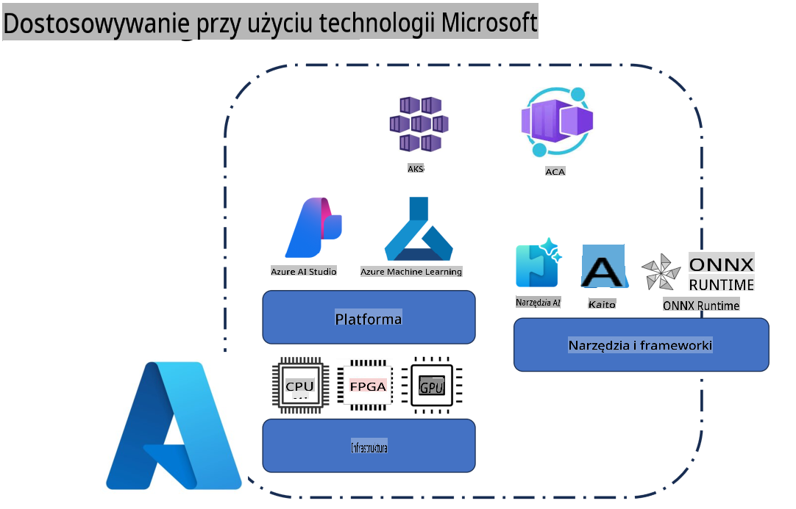
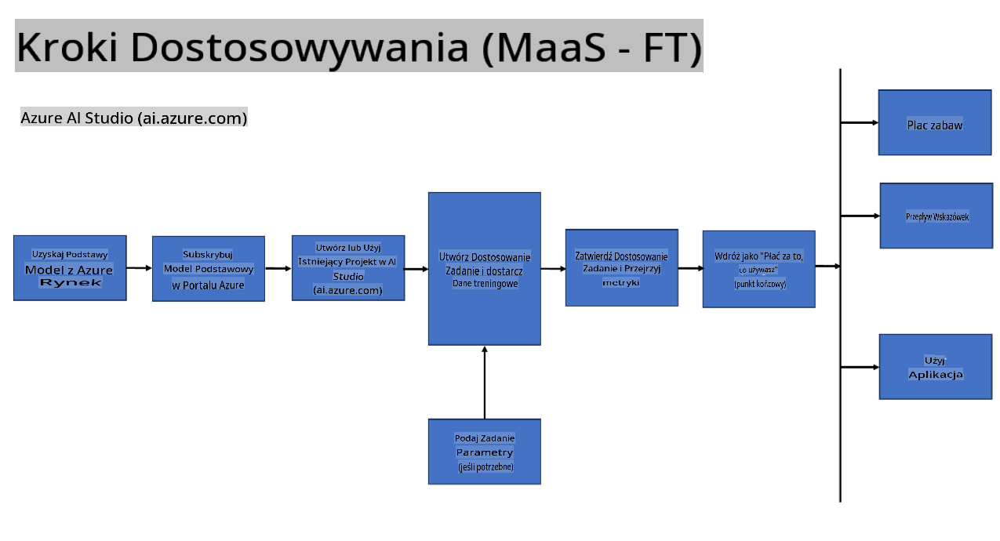
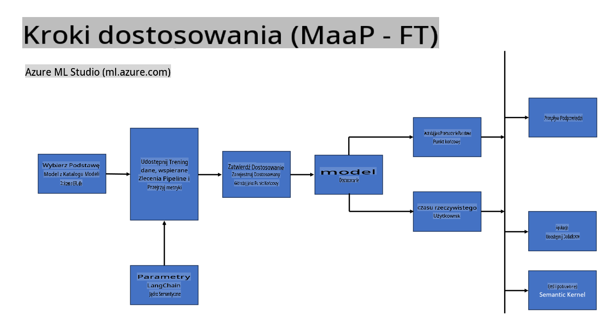
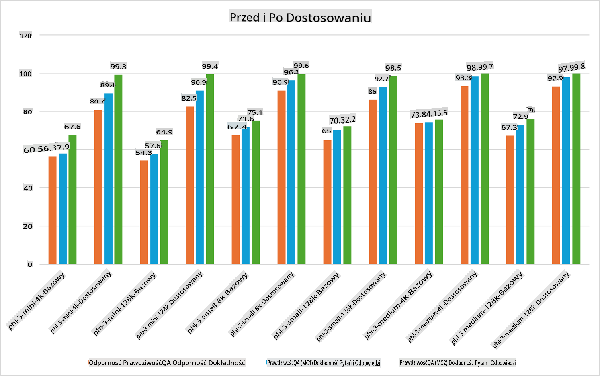

## Scenariusze dostrajania

**Platforma** Obejmuje różne technologie, takie jak Azure AI Foundry, Azure Machine Learning, AI Tools, Kaito i ONNX Runtime.

**Infrastruktura** Obejmuje CPU i FPGA, które są kluczowe dla procesu dostrajania. Pokażę teraz ikony dla każdej z tych technologii.

**Narzędzia i frameworki** Obejmuje ONNX Runtime i ONNX Runtime. Pokażę teraz ikony dla każdej z tych technologii.  
[Wstaw ikony dla ONNX Runtime i ONNX Runtime]

Proces dostrajania z użyciem technologii Microsoft obejmuje różne komponenty i narzędzia. Dzięki zrozumieniu i wykorzystaniu tych technologii możemy skutecznie dostrajać nasze aplikacje i tworzyć lepsze rozwiązania.

## Model jako Usługa

Dostrój model, korzystając z hostowanego dostrajania, bez konieczności tworzenia i zarządzania infrastrukturą obliczeniową.

Dostrajanie bezserwerowe jest dostępne dla modeli Phi-3-mini i Phi-3-medium, co umożliwia programistom szybkie i łatwe dostosowywanie modeli do scenariuszy w chmurze i na urządzeniach brzegowych, bez konieczności organizowania infrastruktury obliczeniowej. Ogłosiliśmy również, że model Phi-3-small jest teraz dostępny w ramach oferty Model-as-a-Service, co pozwala programistom szybko i łatwo rozpocząć pracę z AI, bez zarządzania podstawową infrastrukturą.

## Model jako Platforma

Użytkownicy zarządzają własną infrastrukturą obliczeniową, aby dostroić swoje modele.

[Przykład dostrajania](https://github.com/Azure/azureml-examples/blob/main/sdk/python/foundation-models/system/finetune/chat-completion/chat-completion.ipynb)

## Scenariusze dostrajania

| | | | | | | |
|-|-|-|-|-|-|-|
|Scenariusz|LoRA|QLoRA|PEFT|DeepSpeed|ZeRO|DORA|
|Adaptacja wstępnie wytrenowanych LLM do konkretnych zadań lub dziedzin|Tak|Tak|Tak|Tak|Tak|Tak|
|Dostrajanie dla zadań NLP, takich jak klasyfikacja tekstu, rozpoznawanie nazwanych encji i tłumaczenie maszynowe|Tak|Tak|Tak|Tak|Tak|Tak|
|Dostrajanie dla zadań QA|Tak|Tak|Tak|Tak|Tak|Tak|
|Dostrajanie do generowania odpowiedzi przypominających ludzkie w chatbotach|Tak|Tak|Tak|Tak|Tak|Tak|
|Dostrajanie do generowania muzyki, sztuki lub innych form kreatywności|Tak|Tak|Tak|Tak|Tak|Tak|
|Redukcja kosztów obliczeniowych i finansowych|Tak|Tak|Nie|Tak|Tak|Nie|
|Zmniejszenie użycia pamięci|Nie|Tak|Nie|Tak|Tak|Tak|
|Wykorzystanie mniejszej liczby parametrów dla efektywnego dostrajania|Nie|Tak|Tak|Nie|Nie|Tak|
|Pamięciooszczędna forma równoległości danych, umożliwiająca dostęp do łącznej pamięci GPU wszystkich dostępnych urządzeń GPU|Nie|Nie|Nie|Tak|Tak|Tak|

## Przykłady wydajności dostrajania

**Zastrzeżenie**:  
Ten dokument został przetłumaczony za pomocą usług tłumaczenia maszynowego opartego na sztucznej inteligencji. Chociaż staramy się zapewnić dokładność, prosimy pamiętać, że automatyczne tłumaczenia mogą zawierać błędy lub nieścisłości. Oryginalny dokument w jego rodzimym języku powinien być uznawany za wiążące źródło. W przypadku informacji krytycznych zaleca się skorzystanie z profesjonalnego tłumaczenia wykonanego przez człowieka. Nie ponosimy odpowiedzialności za jakiekolwiek nieporozumienia lub błędne interpretacje wynikające z użycia tego tłumaczenia.