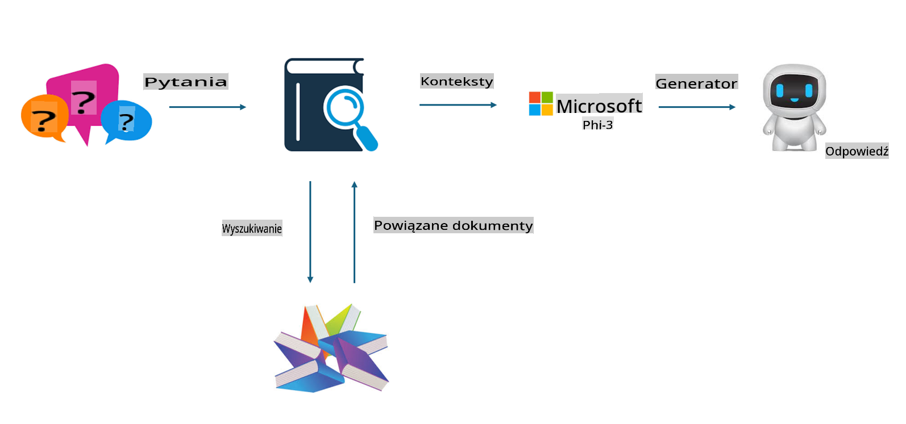

## Finetuning vs RAG

## Retrieval Augmented Generation

RAG to połączenie wyszukiwania danych i generowania tekstu. Strukturalne i niestrukturalne dane przedsiębiorstwa są przechowywane w bazie danych wektorowych. Podczas wyszukiwania odpowiednich treści znajdują się odpowiednie podsumowania i materiały, które tworzą kontekst, a następnie łączy się je z możliwościami uzupełniania tekstu przez LLM/SLM w celu wygenerowania treści.

## Proces RAG

## Fine-tuning
Fine-tuning opiera się na udoskonaleniu konkretnego modelu. Nie trzeba zaczynać od algorytmu modelu, ale konieczne jest ciągłe gromadzenie danych. Jeśli w aplikacjach przemysłowych zależy Ci na bardziej precyzyjnej terminologii i sposobie wyrażania się, fine-tuning będzie lepszym wyborem. Jednak gdy dane często się zmieniają, fine-tuning może stać się skomplikowany.

## Jak dokonać wyboru
Jeśli odpowiedź wymaga wykorzystania zewnętrznych danych, RAG będzie najlepszym wyborem.

Jeżeli potrzebujesz stabilnej i precyzyjnej wiedzy branżowej, fine-tuning będzie dobrym rozwiązaniem. RAG koncentruje się na wyszukiwaniu odpowiednich treści, ale może nie zawsze uchwycić specjalistyczne niuanse.

Fine-tuning wymaga wysokiej jakości zestawu danych, a w przypadku niewielkiego zakresu danych nie przyniesie dużej różnicy. RAG jest bardziej elastyczny.  
Fine-tuning to czarna skrzynka, swego rodzaju metafizyka, i trudno zrozumieć jego wewnętrzny mechanizm. Natomiast RAG ułatwia odnalezienie źródła danych, co pozwala skutecznie korygować halucynacje lub błędy w treści, zapewniając większą przejrzystość.

**Zastrzeżenie**:  
Ten dokument został przetłumaczony za pomocą usług tłumaczenia maszynowego opartego na sztucznej inteligencji. Chociaż staramy się zapewnić dokładność, prosimy mieć na uwadze, że automatyczne tłumaczenia mogą zawierać błędy lub nieścisłości. Oryginalny dokument w jego rodzimym języku powinien być uznawany za wiarygodne źródło. W przypadku istotnych informacji zaleca się skorzystanie z profesjonalnego tłumaczenia przez człowieka. Nie ponosimy odpowiedzialności za jakiekolwiek nieporozumienia lub błędne interpretacje wynikające z korzystania z tego tłumaczenia.