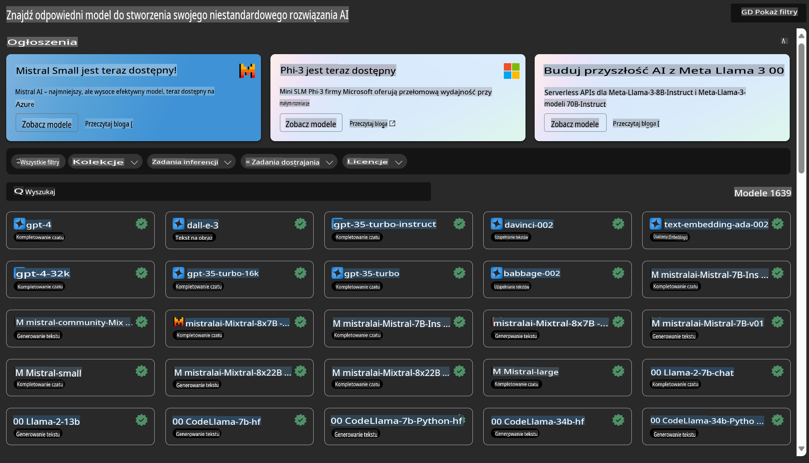

# **Wprowadzenie do usługi Azure Machine Learning**

[Azure Machine Learning](https://ml.azure.com?WT.mc_id=aiml-138114-kinfeylo) to usługa w chmurze, która przyspiesza i zarządza cyklem życia projektów uczenia maszynowego (ML).

Specjaliści ML, naukowcy danych i inżynierowie mogą korzystać z niej w codziennych zadaniach, aby:

- Trenować i wdrażać modele.
- Zarządzać operacjami uczenia maszynowego (MLOps).
- Możesz stworzyć model w Azure Machine Learning lub wykorzystać model opracowany na platformie open-source, takiej jak PyTorch, TensorFlow czy scikit-learn.
- Narzędzia MLOps pomagają monitorować, ponownie trenować i wdrażać modele.

## Dla kogo jest Azure Machine Learning?

**Naukowcy danych i inżynierowie ML**

Mogą korzystać z narzędzi, które przyspieszają i automatyzują ich codzienną pracę.  
Azure ML oferuje funkcje wspierające sprawiedliwość, wyjaśnialność, śledzenie oraz możliwość audytu.  

**Deweloperzy aplikacji**

Mogą płynnie integrować modele z aplikacjami lub usługami.

**Deweloperzy platform**

Mają dostęp do solidnego zestawu narzędzi wspieranego przez trwałe interfejsy API Azure Resource Manager.  
Te narzędzia umożliwiają budowanie zaawansowanych narzędzi ML.

**Przedsiębiorstwa**

Działając w chmurze Microsoft Azure, przedsiębiorstwa korzystają z dobrze znanych mechanizmów bezpieczeństwa i kontroli dostępu opartej na rolach.  
Można skonfigurować projekty w celu kontrolowania dostępu do chronionych danych i określonych operacji.

## Wydajność dla każdego w zespole

Projekty ML często wymagają zespołu o zróżnicowanych umiejętnościach, aby je stworzyć i utrzymać.

Azure ML dostarcza narzędzi, które umożliwiają:
- Współpracę z zespołem za pomocą wspólnych notebooków, zasobów obliczeniowych, serwerless compute, danych i środowisk.
- Opracowywanie modeli z funkcjami wspierającymi sprawiedliwość, wyjaśnialność, śledzenie i możliwość audytu, aby spełnić wymagania dotyczące zgodności z linią rodowodu i audytem.
- Szybkie i łatwe wdrażanie modeli ML na dużą skalę oraz efektywne zarządzanie nimi za pomocą MLOps.
- Uruchamianie obciążeń uczenia maszynowego wszędzie, z wbudowanym zarządzaniem, bezpieczeństwem i zgodnością.

## Narzędzia platformowe kompatybilne między sobą

Każdy członek zespołu ML może korzystać z preferowanych narzędzi, aby wykonać swoją pracę.  
Niezależnie od tego, czy przeprowadzasz szybkie eksperymenty, tuning hiperparametrów, budujesz potoki czy zarządzasz wnioskowaniami, możesz korzystać z dobrze znanych interfejsów, takich jak:
- Azure Machine Learning Studio
- Python SDK (v2)
- Azure CLI (v2)
- REST API Azure Resource Manager

Podczas udoskonalania modeli i współpracy w cyklu rozwoju możesz udostępniać i znajdować zasoby, zasoby obliczeniowe i metryki w interfejsie użytkownika Azure Machine Learning Studio.

## **LLM/SLM w Azure ML**

Azure ML wprowadziło wiele funkcji związanych z LLM/SLM, łącząc LLMOps i SLMOps, aby stworzyć platformę technologii generatywnej sztucznej inteligencji na poziomie przedsiębiorstwa.

### **Katalog modeli**

Użytkownicy korporacyjni mogą wdrażać różne modele w zależności od scenariuszy biznesowych za pośrednictwem Katalogu Modeli i oferować usługi w modelu "Model as Service", umożliwiając deweloperom lub użytkownikom korporacyjnym łatwy dostęp.

Katalog modeli w Azure Machine Learning Studio to centrum umożliwiające odkrywanie i korzystanie z szerokiej gamy modeli, które pozwalają na budowanie aplikacji opartych na generatywnej AI. Katalog modeli zawiera setki modeli od dostawców takich jak Azure OpenAI Service, Mistral, Meta, Cohere, Nvidia, Hugging Face, w tym modele trenowane przez Microsoft. Modele od dostawców innych niż Microsoft są produktami nie-Microsoftowymi zgodnie z definicją w Warunkach Produktu Microsoft i podlegają warunkom dostarczonym z modelem.

### **Potok zadań**

Kluczowym elementem potoku uczenia maszynowego jest podzielenie kompletnego zadania ML na wieloetapowy przepływ pracy. Każdy etap to zarządzalny komponent, który można opracować, zoptymalizować, skonfigurować i zautomatyzować indywidualnie. Etapy są połączone za pomocą dobrze zdefiniowanych interfejsów. Usługa potoków Azure Machine Learning automatycznie koordynuje wszystkie zależności między etapami potoku.

W przypadku fine-tuningu SLM/LLM możemy zarządzać naszymi danymi, procesami treningowymi i generacyjnymi za pomocą Pipeline.

### **Prompt flow**

Korzyści z używania Azure Machine Learning Prompt Flow  
Azure Machine Learning Prompt Flow oferuje szereg korzyści, które pomagają użytkownikom przejść od pomysłu do eksperymentowania, a ostatecznie do gotowych do produkcji aplikacji opartych na LLM:

**Zwinność inżynierii promptów**

Interaktywne doświadczenie tworzenia: Azure Machine Learning Prompt Flow zapewnia wizualną reprezentację struktury przepływu, umożliwiając użytkownikom łatwe zrozumienie i nawigację po projektach. Oferuje również doświadczenie kodowania podobne do notebooka, co ułatwia rozwój i debugowanie przepływów.  
Warianty do tuningu promptów: Użytkownicy mogą tworzyć i porównywać różne warianty promptów, co ułatwia iteracyjny proces udoskonalania.

Ocena: Wbudowane przepływy oceny umożliwiają użytkownikom ocenę jakości i skuteczności ich promptów i przepływów.

Kompleksowe zasoby: Azure Machine Learning Prompt Flow zawiera bibliotekę wbudowanych narzędzi, przykładów i szablonów, które stanowią punkt wyjścia do rozwoju, inspirują kreatywność i przyspieszają proces.

**Gotowość przedsiębiorstw na aplikacje oparte na LLM**

Współpraca: Azure Machine Learning Prompt Flow wspiera współpracę zespołową, umożliwiając wielu użytkownikom wspólną pracę nad projektami inżynierii promptów, dzielenie się wiedzą i utrzymanie kontroli wersji.

Wszechstronna platforma: Azure Machine Learning Prompt Flow usprawnia cały proces inżynierii promptów, od tworzenia i oceny po wdrożenie i monitorowanie. Użytkownicy mogą łatwo wdrażać swoje przepływy jako punkty końcowe Azure Machine Learning i monitorować ich wydajność w czasie rzeczywistym, zapewniając optymalne działanie i ciągłe doskonalenie.

Rozwiązania Azure Machine Learning dla przedsiębiorstw: Prompt Flow wykorzystuje solidne rozwiązania Azure Machine Learning dla przedsiębiorstw, zapewniając bezpieczną, skalowalną i niezawodną podstawę do tworzenia, eksperymentowania i wdrażania przepływów.

Dzięki Azure Machine Learning Prompt Flow użytkownicy mogą rozwijać swoją zwinność w inżynierii promptów, skutecznie współpracować i korzystać z rozwiązań klasy korporacyjnej, aby z powodzeniem tworzyć i wdrażać aplikacje oparte na LLM.

Łącząc moc obliczeniową, dane i różne komponenty Azure ML, deweloperzy korporacyjni mogą z łatwością budować własne aplikacje oparte na sztucznej inteligencji.

**Zastrzeżenie**:  
Niniejszy dokument został przetłumaczony za pomocą automatycznych usług tłumaczenia opartych na sztucznej inteligencji. Chociaż dokładamy wszelkich starań, aby tłumaczenie było precyzyjne, prosimy pamiętać, że automatyczne tłumaczenia mogą zawierać błędy lub nieścisłości. Oryginalny dokument w jego rodzimym języku powinien być uznawany za źródło autorytatywne. W przypadku informacji krytycznych zaleca się skorzystanie z profesjonalnego tłumaczenia przez człowieka. Nie ponosimy odpowiedzialności za jakiekolwiek nieporozumienia lub błędne interpretacje wynikające z użycia tego tłumaczenia.