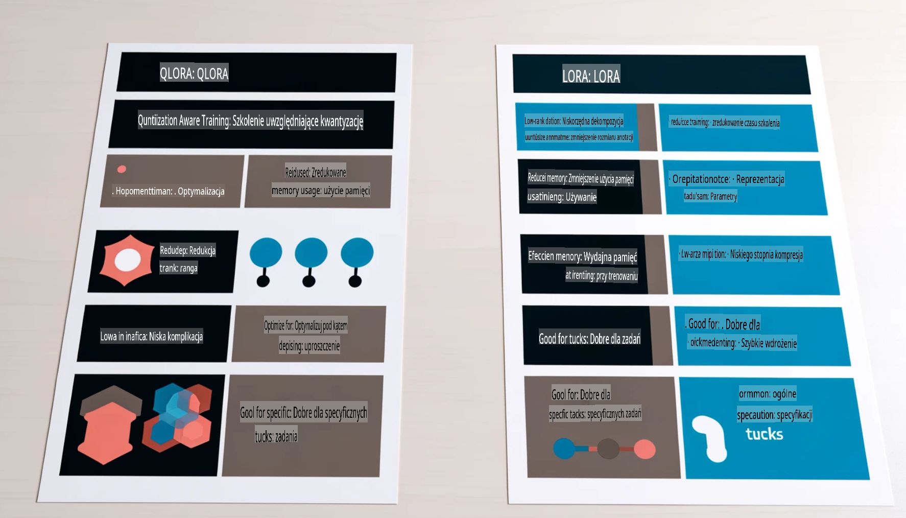

# **Niech Phi-3 stanie się ekspertem branżowym**

Aby wdrożyć model Phi-3 w konkretnej branży, należy dodać dane biznesowe tej branży do modelu Phi-3. Mamy dwie różne opcje: RAG (Retrieval Augmented Generation) oraz Fine Tuning.

## **RAG vs Fine-Tuning**

### **Retrieval Augmented Generation**

RAG łączy wyszukiwanie danych z generowaniem tekstu. Dane ustrukturyzowane i nieustrukturyzowane przedsiębiorstwa są przechowywane w bazie danych wektorowych. Podczas wyszukiwania odpowiednich treści, odnajdywane są odpowiednie podsumowania i treści, które tworzą kontekst, a następnie łączone są z umiejętnością generowania tekstu przez LLM/SLM w celu wygenerowania treści.

### **Fine-tuning**

Fine-tuning polega na ulepszaniu istniejącego modelu. Nie wymaga rozpoczynania od algorytmu modelu, ale wymaga ciągłego gromadzenia danych. Jeśli w aplikacjach branżowych zależy Ci na bardziej precyzyjnej terminologii i wyrażeniach językowych, fine-tuning będzie lepszym wyborem. Jednak w przypadku częstych zmian danych, fine-tuning może być skomplikowany.

### **Jak dokonać wyboru**

1. Jeśli odpowiedź wymaga wprowadzenia danych zewnętrznych, RAG będzie najlepszym wyborem.

2. Jeśli potrzebujesz stabilnej i precyzyjnej wiedzy branżowej, fine-tuning będzie dobrym wyborem. RAG skupia się na przyciąganiu odpowiednich treści, ale może nie zawsze uchwycić specjalistyczne niuanse.

3. Fine-tuning wymaga wysokiej jakości zbioru danych, a jeśli dane są ograniczone, różnica może być niewielka. RAG jest bardziej elastyczny.

4. Fine-tuning jest jak "czarna skrzynka", trudny do zrozumienia pod względem wewnętrznych mechanizmów. Natomiast RAG ułatwia odnalezienie źródła danych, co pozwala skutecznie korygować błędy lub halucynacje i zapewnia większą przejrzystość.

### **Scenariusze**

1. Branże wertykalne wymagające specyficznej terminologii i wyrażeń — ***Fine-tuning*** będzie najlepszym wyborem.

2. Systemy QA, które wymagają syntezy różnych punktów wiedzy — ***RAG*** będzie najlepszym wyborem.

3. Połączenie zautomatyzowanego przepływu biznesowego — ***RAG + Fine-tuning*** to najlepsze rozwiązanie.

## **Jak używać RAG**

Baza danych wektorowych to zbiór danych przechowywanych w formie matematycznej. Ułatwia modelom uczenia maszynowego zapamiętywanie wcześniejszych danych wejściowych, co pozwala na wykorzystanie uczenia maszynowego do takich przypadków użycia jak wyszukiwanie, rekomendacje i generowanie tekstu. Dane mogą być identyfikowane na podstawie metryk podobieństwa, a nie dokładnych dopasowań, co pozwala modelom komputerowym lepiej rozumieć kontekst danych.

Baza danych wektorowych jest kluczem do realizacji RAG. Możemy konwertować dane na przechowywanie wektorowe za pomocą modeli wektorowych, takich jak text-embedding-3, jina-ai-embedding itd.

Dowiedz się więcej o tworzeniu aplikacji RAG: [https://github.com/microsoft/Phi-3CookBook](https://github.com/microsoft/Phi-3CookBook?WT.mc_id=aiml-138114-kinfeylo)

## **Jak używać Fine-tuning**

Najczęściej stosowane algorytmy w Fine-tuning to Lora i QLora. Jak dokonać wyboru?
- [Dowiedz się więcej dzięki temu przykładowemu notebookowi](../../../../code/04.Finetuning/Phi_3_Inference_Finetuning.ipynb)
- [Przykład skryptu Python FineTuning](../../../../code/04.Finetuning/FineTrainingScript.py)

### **Lora i QLora**

LoRA (Low-Rank Adaptation) i QLoRA (Quantized Low-Rank Adaptation) to techniki stosowane do fine-tuningu dużych modeli językowych (LLM) za pomocą Parameter Efficient Fine Tuning (PEFT). Techniki PEFT zostały zaprojektowane, aby trenować modele bardziej efektywnie niż tradycyjne metody.  
LoRA to samodzielna technika fine-tuningu, która zmniejsza zapotrzebowanie na pamięć poprzez zastosowanie aproksymacji macierzy aktualizacji wag w postaci niskiego rzędu. Oferuje szybkie czasy trenowania i zachowuje wydajność zbliżoną do tradycyjnych metod fine-tuningu.  

QLoRA to rozszerzona wersja LoRA, która wykorzystuje techniki kwantyzacji w celu dalszego zmniejszenia zużycia pamięci. QLoRA kwantyzuje precyzję parametrów wag w wytrenowanym LLM do precyzji 4-bitowej, co jest bardziej efektywne pamięciowo niż LoRA. Jednak trenowanie QLoRA jest o około 30% wolniejsze niż LoRA ze względu na dodatkowe kroki kwantyzacji i dekwantyzacji.  

QLoRA wykorzystuje LoRA jako narzędzie do korygowania błędów wprowadzanych podczas kwantyzacji. QLoRA umożliwia fine-tuning ogromnych modeli z miliardami parametrów na stosunkowo małych, łatwo dostępnych GPU. Na przykład QLoRA może dostosować model o 70 miliardach parametrów, który wymaga 36 GPU, używając jedynie 2.

**Zastrzeżenie**:  
Ten dokument został przetłumaczony za pomocą usług tłumaczeniowych opartych na sztucznej inteligencji. Chociaż dokładamy wszelkich starań, aby tłumaczenie było precyzyjne, prosimy pamiętać, że automatyczne tłumaczenia mogą zawierać błędy lub nieścisłości. Oryginalny dokument w jego języku źródłowym powinien być uznawany za wiarygodne źródło. W przypadku kluczowych informacji zaleca się skorzystanie z profesjonalnego tłumaczenia wykonanego przez człowieka. Nie ponosimy odpowiedzialności za jakiekolwiek nieporozumienia lub błędne interpretacje wynikające z użycia tego tłumaczenia.