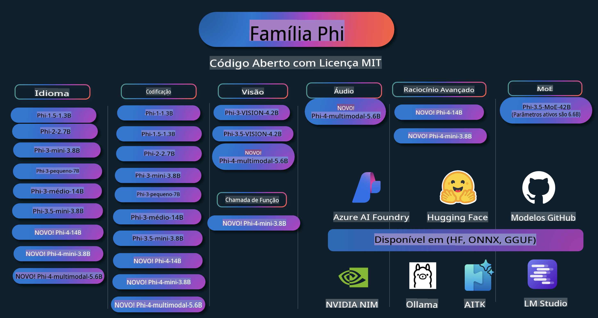

# Phi Cookbook: Exemplos Práticos com os Modelos Phi da Microsoft

  

  
  
  

  
  

Phi é uma série de modelos de IA de código aberto desenvolvidos pela Microsoft.

Atualmente, Phi é o modelo de linguagem pequeno (SLM) mais poderoso e econômico, com excelentes benchmarks em cenários como multilinguismo, raciocínio, geração de texto/chat, codificação, imagens, áudio e outros.

Você pode implementar Phi na nuvem ou em dispositivos de borda e criar facilmente aplicações de IA generativa com recursos computacionais limitados.

Siga estas etapas para começar a usar este recurso:
1. **Faça um Fork do Repositório**: Clique   
2. **Clone o Repositório**:   `git clone https://github.com/microsoft/PhiCookBook.git`  
3. [**Junte-se à Comunidade Microsoft AI no Discord e conecte-se com especialistas e outros desenvolvedores**](https://discord.com/invite/ByRwuEEgH4?WT.mc_id=aiml-137032-kinfeylo)

## Índice

- Introdução  
  - [Bem-vindo à Família Phi](./md/01.Introduction/01/01.PhiFamily.md)  
  - [Configurando seu ambiente](./md/01.Introduction/01/01.EnvironmentSetup.md)  
  - [Compreendendo Tecnologias-Chave](./md/01.Introduction/01/01.Understandingtech.md)  
  - [Segurança de IA para os Modelos Phi](./md/01.Introduction/01/01.AISafety.md)  
  - [Suporte de Hardware para Phi](./md/01.Introduction/01/01.Hardwaresupport.md)  
  - [Modelos Phi e Disponibilidade em Plataformas](./md/01.Introduction/01/01.Edgeandcloud.md)  
  - [Usando Guidance-ai e Phi](./md/01.Introduction/01/01.Guidance.md)  
  - [Modelos no GitHub Marketplace](https://github.com/marketplace/models)  
  - [Catálogo de Modelos do Azure AI](https://ai.azure.com)  

- Inferência de Phi em diferentes ambientes  
    - [Hugging Face](./md/01.Introduction/02/01.HF.md)  
    - [Modelos do GitHub](./md/01.Introduction/02/02.GitHubModel.md)  
    - [Catálogo de Modelos do Azure AI Foundry](./md/01.Introduction/02/03.AzureAIFoundry.md)  
    - [Ollama](./md/01.Introduction/02/04.Ollama.md)  
    - [AI Toolkit VSCode (AITK)](./md/01.Introduction/02/05.AITK.md)  
    - [NVIDIA NIM](./md/01.Introduction/02/06.NVIDIA.md)  

- Inferência da Família Phi  
    - [Inferência de Phi no iOS](./md/01.Introduction/03/iOS_Inference.md)  
    - [Inferência de Phi no Android](./md/01.Introduction/03/Android_Inference.md)  
- [Inferência Phi no Jetson](./md/01.Introduction/03/Jetson_Inference.md)  
    - [Inferência Phi no AI PC](./md/01.Introduction/03/AIPC_Inference.md)  
    - [Inferência Phi com o Framework Apple MLX](./md/01.Introduction/03/MLX_Inference.md)  
    - [Inferência Phi em Servidor Local](./md/01.Introduction/03/Local_Server_Inference.md)  
    - [Inferência Phi em Servidor Remoto usando AI Toolkit](./md/01.Introduction/03/Remote_Interence.md)  
    - [Inferência Phi com Rust](./md/01.Introduction/03/Rust_Inference.md)  
    - [Inferência Phi--Vision no Local](./md/01.Introduction/03/Vision_Inference.md)  
    - [Inferência Phi com Kaito AKS, Containers Azure (suporte oficial)](./md/01.Introduction/03/Kaito_Inference.md)  

- [Quantificação da Família Phi](./md/01.Introduction/04/QuantifyingPhi.md)  
    - [Quantificação de Phi-3.5 / 4 usando llama.cpp](./md/01.Introduction/04/UsingLlamacppQuantifyingPhi.md)  
    - [Quantificação de Phi-3.5 / 4 usando extensões de IA generativa para onnxruntime](./md/01.Introduction/04/UsingORTGenAIQuantifyingPhi.md)  
    - [Quantificação de Phi-3.5 / 4 usando Intel OpenVINO](./md/01.Introduction/04/UsingIntelOpenVINOQuantifyingPhi.md)  
    - [Quantificação de Phi-3.5 / 4 usando o Framework Apple MLX](./md/01.Introduction/04/UsingAppleMLXQuantifyingPhi.md)  

- Avaliação Phi  
    - [IA Responsável](./md/01.Introduction/05/ResponsibleAI.md)  
    - [Azure AI Foundry para Avaliação](./md/01.Introduction/05/AIFoundry.md)  
    - [Usando Promptflow para Avaliação](./md/01.Introduction/05/Promptflow.md)  

- RAG com Azure AI Search  
    - [Como usar Phi-4-mini e Phi-4-multimodal (RAG) com Azure AI Search](https://github.com/microsoft/PhiCookBook/blob/main/code/06.E2E/E2E_Phi-4-RAG-Azure-AI-Search.ipynb)  

- Exemplos de desenvolvimento de aplicações Phi  
  - Aplicações de Texto & Chat  
    - Exemplos Phi-4 🆕  
      - [📓] [Chat com o Modelo Phi-4-mini ONNX](./md/02.Application/01.TextAndChat/Phi4/ChatWithPhi4ONNX/README.md)  
      - [Chat com o Modelo Phi-4 local ONNX no .NET](../../md/04.HOL/dotnet/src/LabsPhi4-Chat-01OnnxRuntime)  
      - [Aplicativo Console .NET para Chat com Phi-4 ONNX usando Semantic Kernel](../../md/04.HOL/dotnet/src/LabsPhi4-Chat-02SK)  
    - Exemplos Phi-3 / 3.5  
      - [Chatbot Local no navegador usando Phi3, ONNX Runtime Web e WebGPU](https://github.com/microsoft/onnxruntime-inference-examples/tree/main/js/chat)  
      - [Chat OpenVINO](./md/02.Application/01.TextAndChat/Phi3/E2E_OpenVino_Chat.md)  
      - [Multi Modelo - Phi-3-mini Interativo e OpenAI Whisper](./md/02.Application/01.TextAndChat/Phi3/E2E_Phi-3-mini_with_whisper.md)  
      - [MLFlow - Criando um wrapper e usando Phi-3 com MLFlow](./md//02.Application/01.TextAndChat/Phi3/E2E_Phi-3-MLflow.md)  
      - [Otimização de Modelo - Como otimizar o modelo Phi-3-min para ONNX Runtime Web com Olive](https://github.com/microsoft/Olive/tree/main/examples/phi3)  
      - [Aplicativo WinUI3 com Phi-3 mini-4k-instruct-onnx](https://github.com/microsoft/Phi3-Chat-WinUI3-Sample/)  
      - [Exemplo de Aplicativo de Notas com IA Multimodelo no WinUI3](https://github.com/microsoft/ai-powered-notes-winui3-sample)  
      - [Aprimorar e Integrar modelos personalizados Phi-3 com Promptflow](./md/02.Application/01.TextAndChat/Phi3/E2E_Phi-3-FineTuning_PromptFlow_Integration.md)  
      - [Aprimorar e Integrar modelos personalizados Phi-3 com Promptflow no Azure AI Foundry](./md/02.Application/01.TextAndChat/Phi3/E2E_Phi-3-FineTuning_PromptFlow_Integration_AIFoundry.md)  
      - [Avaliar o Modelo Aprimorado Phi-3 / Phi-3.5 no Azure AI Foundry com Foco nos Princípios de IA Responsável da Microsoft](./md/02.Application/01.TextAndChat/Phi3/E2E_Phi-3-Evaluation_AIFoundry.md)  
- [📓] [Exemplo de previsão de linguagem Phi-3.5-mini-instruct (Chinês/Inglês)](../../md/02.Application/01.TextAndChat/Phi3/phi3-instruct-demo.ipynb)
      - [Chatbot RAG Phi-3.5-Instruct com WebGPU](./md/02.Application/01.TextAndChat/Phi3/WebGPUWithPhi35Readme.md)
      - [Usando GPU do Windows para criar solução Prompt Flow com Phi-3.5-Instruct ONNX](./md/02.Application/01.TextAndChat/Phi3/UsingPromptFlowWithONNX.md)
      - [Usando Microsoft Phi-3.5 tflite para criar aplicativo Android](./md/02.Application/01.TextAndChat/Phi3/UsingPhi35TFLiteCreateAndroidApp.md)
      - [Exemplo de perguntas e respostas em .NET usando o modelo local ONNX Phi-3 com Microsoft.ML.OnnxRuntime](../../md/04.HOL/dotnet/src/LabsPhi301)
      - [Aplicativo de chat no console .NET com Semantic Kernel e Phi-3](../../md/04.HOL/dotnet/src/LabsPhi302)

  - Exemplos baseados em código do Azure AI Inference SDK 
    - Exemplos Phi-4 🆕
      - [📓] [Gerar código de projeto usando Phi-4-multimodal](./md/02.Application/02.Code/Phi4/GenProjectCode/README.md)
    - Exemplos Phi-3 / 3.5
      - [Crie seu próprio GitHub Copilot Chat no Visual Studio Code com a família Microsoft Phi-3](./md/02.Application/02.Code/Phi3/VSCodeExt/README.md)
      - [Crie seu próprio agente de chat no Visual Studio Code com Phi-3.5 usando modelos do GitHub](/md/02.Application/02.Code/Phi3/CreateVSCodeChatAgentWithGitHubModels.md)

  - Exemplos de Raciocínio Avançado
    - Exemplos Phi-4 🆕
      - [📓] [Exemplos de Raciocínio Phi-4-mini](./md/02.Application/03.AdvancedReasoning/Phi4/AdvancedResoningPhi4mini/README.md)
  
  - Demos
      - [Demos Phi-4-mini hospedados no Hugging Face Spaces](https://huggingface.co/spaces/microsoft/phi-4-mini?WT.mc_id=aiml-137032-kinfeylo)
      - [Demos Phi-4-multimodal hospedados no Hugging Face Spaces](https://huggingface.co/spaces/microsoft/phi-4-multimodal?WT.mc_id=aiml-137032-kinfeylo)
  - Exemplos de Visão
    - Exemplos Phi-4 🆕
      - [📓] [Use Phi-4-multimodal para ler imagens e gerar código](./md/02.Application/04.Vision/Phi4/CreateFrontend/README.md) 
    - Exemplos Phi-3 / 3.5
      -  [📓][Phi-3-vision - Texto de imagem para texto](../../md/02.Application/04.Vision/Phi3/E2E_Phi-3-vision-image-text-to-text-online-endpoint.ipynb)
      - [Phi-3-vision-ONNX](https://onnxruntime.ai/docs/genai/tutorials/phi3-v.html)
      - [📓][Phi-3-vision CLIP Embedding](../../md/02.Application/04.Vision/Phi3/E2E_Phi-3-vision-image-text-to-text-online-endpoint.ipynb)
      - [DEMO: Phi-3 Reciclagem](https://github.com/jennifermarsman/PhiRecycling/)
      - [Phi-3-vision - Assistente visual de linguagem - com Phi3-Vision e OpenVINO](https://docs.openvino.ai/nightly/notebooks/phi-3-vision-with-output.html)
      - [Phi-3 Vision Nvidia NIM](./md/02.Application/04.Vision/Phi3/E2E_Nvidia_NIM_Vision.md)
      - [Phi-3 Vision OpenVino](./md/02.Application/04.Vision/Phi3/E2E_OpenVino_Phi3Vision.md)
      - [📓][Exemplo multi-frame ou multi-imagem do Phi-3.5 Vision](../../md/02.Application/04.Vision/Phi3/phi3-vision-demo.ipynb)
      - [Modelo Local ONNX do Phi-3 Vision usando Microsoft.ML.OnnxRuntime .NET](../../md/04.HOL/dotnet/src/LabsPhi303)
      - [Modelo Local ONNX do Phi-3 Vision baseado em menu usando Microsoft.ML.OnnxRuntime .NET](../../md/04.HOL/dotnet/src/LabsPhi304)

  - Exemplos de Áudio
    - Exemplos Phi-4 🆕
      - [📓] [Extraindo transcrições de áudio usando Phi-4-multimodal](./md/02.Application/05.Audio/Phi4/Transciption/README.md)
      - [📓] [Exemplo de Áudio Phi-4-multimodal](../../md/02.Application/05.Audio/Phi4/Siri/demo.ipynb)
      - [📓] [Exemplo de Tradução de Fala Phi-4-multimodal](../../md/02.Application/05.Audio/Phi4/Translate/demo.ipynb)
      - [Aplicativo de console .NET usando Phi-4-multimodal Áudio para analisar um arquivo de áudio e gerar transcrição](../../md/04.HOL/dotnet/src/LabsPhi4-MultiModal-02Audio)

  - Exemplos de MoE
    - Exemplos Phi-3 / 3.5
      - [📓] [Exemplo de Modelos de Mistura de Especialistas (MoEs) Phi-3.5 para Mídias Sociais](../../md/02.Application/06.MoE/Phi3/phi3_moe_demo.ipynb)
      - [📓] [Construindo um pipeline de Geração Aumentada por Recuperação (RAG) com NVIDIA NIM Phi-3 MOE, Azure AI Search e LlamaIndex](../../md/02.Application/06.MoE/Phi3/azure-ai-search-nvidia-rag.ipynb)
  - Exemplos de Chamadas de Função
    - Exemplos Phi-4 🆕
      -  [📓] [Usando Chamadas de Função com Phi-4-mini](./md/02.Application/07.FunctionCalling/Phi4/FunctionCallingBasic/README.md)
  - Exemplos de Mistura Multimodal
    - Exemplos Phi-4 🆕
- [📓] [Usando Phi-4-multimodal como jornalista de tecnologia](../../md/02.Application/08.Multimodel/Phi4/TechJournalist/phi_4_mm_audio_text_publish_news.ipynb)  
  - [Aplicativo de console .NET usando Phi-4-multimodal para analisar imagens](../../md/04.HOL/dotnet/src/LabsPhi4-MultiModal-01Images)

- Ajuste fino de amostras Phi  
  - [Cenários de ajuste fino](./md/03.FineTuning/FineTuning_Scenarios.md)  
  - [Ajuste fino vs RAG](./md/03.FineTuning/FineTuning_vs_RAG.md)  
  - [Ajuste fino: Deixe o Phi-3 se tornar um especialista da indústria](./md/03.FineTuning/LetPhi3gotoIndustriy.md)  
  - [Ajuste fino do Phi-3 com AI Toolkit para VS Code](./md/03.FineTuning/Finetuning_VSCodeaitoolkit.md)  
  - [Ajuste fino do Phi-3 com Azure Machine Learning Service](./md/03.FineTuning/Introduce_AzureML.md)  
  - [Ajuste fino do Phi-3 com Lora](./md/03.FineTuning/FineTuning_Lora.md)  
  - [Ajuste fino do Phi-3 com QLora](./md/03.FineTuning/FineTuning_Qlora.md)  
  - [Ajuste fino do Phi-3 com Azure AI Foundry](./md/03.FineTuning/FineTuning_AIFoundry.md)  
  - [Ajuste fino do Phi-3 com Azure ML CLI/SDK](./md/03.FineTuning/FineTuning_MLSDK.md)  
  - [Ajuste fino com Microsoft Olive](./md/03.FineTuning/FineTuning_MicrosoftOlive.md)  
  - [Laboratório prático de ajuste fino com Microsoft Olive](./md/03.FineTuning/olive-lab/readme.md)  
  - [Ajuste fino do Phi-3-vision com Weights and Bias](./md/03.FineTuning/FineTuning_Phi-3-visionWandB.md)  
  - [Ajuste fino do Phi-3 com Apple MLX Framework](./md/03.FineTuning/FineTuning_MLX.md)  
  - [Ajuste fino do Phi-3-vision (suporte oficial)](./md/03.FineTuning/FineTuning_Vision.md)  
  - [Ajuste fino do Phi-3 com Kaito AKS, Azure Containers (suporte oficial)](./md/03.FineTuning/FineTuning_Kaito.md)  
  - [Ajuste fino do Phi-3 e 3.5 Vision](https://github.com/2U1/Phi3-Vision-Finetune)  

- Laboratório prático  
  - [Explorando modelos de ponta: LLMs, SLMs, desenvolvimento local e mais](https://github.com/microsoft/aitour-exploring-cutting-edge-models)  
  - [Desbloqueando o potencial de NLP: Ajuste fino com Microsoft Olive](https://github.com/azure/Ignite_FineTuning_workshop)  

- Artigos de pesquisa acadêmica e publicações  
  - [Textbooks Are All You Need II: relatório técnico phi-1.5](https://arxiv.org/abs/2309.05463)  
  - [Relatório técnico do Phi-3: um modelo de linguagem altamente capaz localmente no seu telefone](https://arxiv.org/abs/2404.14219)  
  - [Relatório técnico do Phi-4](https://arxiv.org/abs/2412.08905)  
  - [Otimizando pequenos modelos de linguagem para chamadas de função em veículos](https://arxiv.org/abs/2501.02342)  
  - [(WhyPHI) Ajuste fino do PHI-3 para perguntas de múltipla escolha: metodologia, resultados e desafios](https://arxiv.org/abs/2501.01588)  

## Usando Modelos Phi  

### Phi no Azure AI Foundry  

Você pode aprender a usar o Microsoft Phi e a construir soluções de ponta a ponta em diferentes dispositivos de hardware. Para experimentar o Phi por conta própria, comece explorando os modelos e personalizando o Phi para seus cenários usando o [Catálogo de Modelos do Azure AI Foundry](https://aka.ms/phi3-azure-ai). Você pode saber mais no guia de introdução [Azure AI Foundry](/md/02.QuickStart/AzureAIFoundry_QuickStart.md).  

**Playground**  
Cada modelo possui um playground dedicado para testar o modelo [Azure AI Playground](https://aka.ms/try-phi3).  

### Phi no GitHub Models  

Você pode aprender a usar o Microsoft Phi e a construir soluções de ponta a ponta em diferentes dispositivos de hardware. Para experimentar o Phi por conta própria, comece explorando o modelo e personalizando o Phi para seus cenários usando o [Catálogo de Modelos do GitHub](https://github.com/marketplace/models?WT.mc_id=aiml-137032-kinfeylo). Você pode saber mais no guia de introdução [GitHub Model Catalog](/md/02.QuickStart/GitHubModel_QuickStart.md).  

**Playground**  
Cada modelo possui um [playground dedicado para testar o modelo](/md/02.QuickStart/GitHubModel_QuickStart.md).

### Phi no Hugging Face

Você também pode encontrar o modelo no [Hugging Face](https://huggingface.co/microsoft)

**Playground**  
[Playground do Hugging Chat](https://huggingface.co/chat/models/microsoft/Phi-3-mini-4k-instruct)

## IA Responsável

A Microsoft está comprometida em ajudar seus clientes a usar nossos produtos de IA de forma responsável, compartilhando nossos aprendizados e construindo parcerias baseadas em confiança por meio de ferramentas como Notas de Transparência e Avaliações de Impacto. Muitos desses recursos estão disponíveis em [https://aka.ms/RAI](https://aka.ms/RAI).  
A abordagem da Microsoft para IA responsável está fundamentada em nossos princípios de IA: equidade, confiabilidade e segurança, privacidade e proteção, inclusão, transparência e responsabilidade.

Modelos em larga escala de linguagem natural, imagem e fala - como os usados neste exemplo - podem, potencialmente, se comportar de maneiras injustas, pouco confiáveis ou ofensivas, causando danos. Consulte a [nota de transparência do serviço Azure OpenAI](https://learn.microsoft.com/legal/cognitive-services/openai/transparency-note?tabs=text) para se informar sobre riscos e limitações.

A abordagem recomendada para mitigar esses riscos é incluir um sistema de segurança em sua arquitetura que possa detectar e prevenir comportamentos prejudiciais. O [Azure AI Content Safety](https://learn.microsoft.com/azure/ai-services/content-safety/overview) fornece uma camada independente de proteção, capaz de detectar conteúdos prejudiciais gerados por usuários ou por IA em aplicativos e serviços. O Azure AI Content Safety inclui APIs de texto e imagem que permitem detectar materiais prejudiciais. Dentro do Azure AI Foundry, o serviço Content Safety permite visualizar, explorar e testar códigos de exemplo para detectar conteúdos prejudiciais em diferentes modalidades. A seguinte [documentação de início rápido](https://learn.microsoft.com/azure/ai-services/content-safety/quickstart-text?tabs=visual-studio%2Clinux&pivots=programming-language-rest) orienta você a fazer solicitações ao serviço.

Outro aspecto a ser considerado é o desempenho geral da aplicação. Em aplicativos multimodais e com múltiplos modelos, consideramos desempenho como a capacidade do sistema de atender às expectativas suas e dos usuários, incluindo a não geração de resultados prejudiciais. É importante avaliar o desempenho de sua aplicação como um todo utilizando [avaliadores de Desempenho e Qualidade e de Risco e Segurança](https://learn.microsoft.com/azure/ai-studio/concepts/evaluation-metrics-built-in). Você também tem a possibilidade de criar e avaliar com [avaliadores personalizados](https://learn.microsoft.com/azure/ai-studio/how-to/develop/evaluate-sdk#custom-evaluators).

Você pode avaliar sua aplicação de IA em seu ambiente de desenvolvimento usando o [SDK de Avaliação do Azure AI](https://microsoft.github.io/promptflow/index.html). Com base em um conjunto de dados de teste ou um alvo, as gerações de sua aplicação de IA generativa são medidas quantitativamente com avaliadores embutidos ou personalizados de sua escolha. Para começar a usar o SDK de avaliação do Azure AI e avaliar seu sistema, você pode seguir o [guia de início rápido](https://learn.microsoft.com/azure/ai-studio/how-to/develop/flow-evaluate-sdk). Depois de executar uma avaliação, você pode [visualizar os resultados no Azure AI Foundry](https://learn.microsoft.com/azure/ai-studio/how-to/evaluate-flow-results).

## Marcas Registradas

Este projeto pode conter marcas registradas ou logotipos de projetos, produtos ou serviços. O uso autorizado de marcas ou logotipos da Microsoft está sujeito e deve seguir as [Diretrizes de Marca e Logotipo da Microsoft](https://www.microsoft.com/legal/intellectualproperty/trademarks/usage/general).  
O uso de marcas ou logotipos da Microsoft em versões modificadas deste projeto não deve causar confusão ou implicar patrocínio da Microsoft. Qualquer uso de marcas ou logotipos de terceiros está sujeito às políticas desses terceiros.

**Aviso Legal**:  
Este documento foi traduzido usando serviços de tradução baseados em IA. Embora nos esforcemos para garantir a precisão, esteja ciente de que traduções automáticas podem conter erros ou imprecisões. O documento original em seu idioma nativo deve ser considerado a fonte oficial. Para informações críticas, recomenda-se a tradução profissional realizada por humanos. Não nos responsabilizamos por quaisquer mal-entendidos ou interpretações equivocadas decorrentes do uso desta tradução.