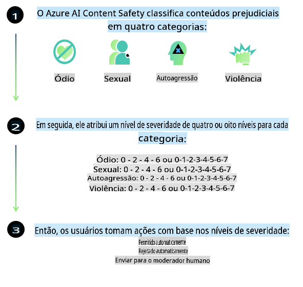
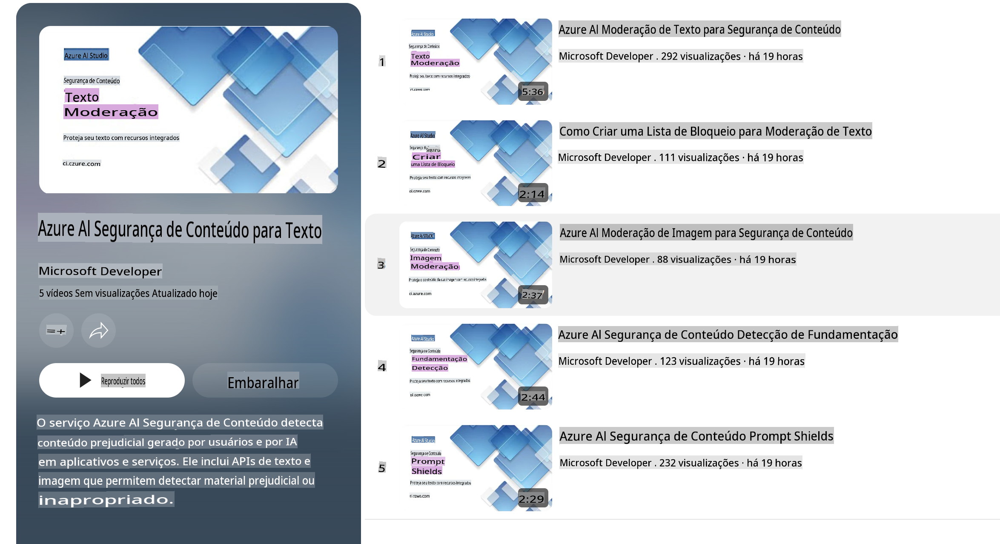

# Segurança de IA para modelos Phi

A família de modelos Phi foi desenvolvida em conformidade com o [Padrão de IA Responsável da Microsoft](https://query.prod.cms.rt.microsoft.com/cms/api/am/binary/RE5cmFl), que é um conjunto de requisitos aplicados em toda a empresa, baseado nos seguintes seis princípios: responsabilidade, transparência, justiça, confiabilidade e segurança, privacidade e proteção, e inclusão, que formam os [Princípios de IA Responsável da Microsoft](https://www.microsoft.com/ai/responsible-ai).

Assim como os modelos Phi anteriores, foi adotada uma abordagem multifacetada de avaliação de segurança e treinamento pós-lançamento, com medidas adicionais para considerar as capacidades multilíngues desta versão. Nossa abordagem para treinamento e avaliações de segurança, incluindo testes em várias línguas e categorias de risco, está descrita no [Artigo de Treinamento Pós-Segurança Phi](https://arxiv.org/abs/2407.13833). Embora os modelos Phi se beneficiem dessa abordagem, os desenvolvedores devem aplicar as melhores práticas de IA responsável, incluindo mapear, medir e mitigar riscos associados ao seu caso de uso específico e ao contexto cultural e linguístico.

## Melhores Práticas

Assim como outros modelos, a família de modelos Phi pode potencialmente apresentar comportamentos injustos, pouco confiáveis ou ofensivos.

Alguns dos comportamentos limitantes de SLM e LLM que você deve estar ciente incluem:

- **Qualidade do Serviço:** Os modelos Phi são treinados principalmente com textos em inglês. Idiomas diferentes do inglês terão um desempenho inferior. Variedades do inglês com menor representação nos dados de treinamento podem apresentar desempenho inferior ao inglês americano padrão.
- **Representação de Danos e Reforço de Estereótipos:** Esses modelos podem super ou sub-representar grupos de pessoas, apagar a representação de alguns grupos ou reforçar estereótipos depreciativos ou negativos. Apesar do treinamento pós-segurança, essas limitações ainda podem estar presentes devido a níveis diferentes de representação de grupos distintos ou à prevalência de exemplos de estereótipos negativos nos dados de treinamento que refletem padrões reais e vieses sociais.
- **Conteúdo Inapropriado ou Ofensivo:** Esses modelos podem produzir outros tipos de conteúdo inapropriado ou ofensivo, o que pode torná-los inadequados para implantação em contextos sensíveis sem mitigações adicionais específicas para o caso de uso.
- **Confiabilidade da Informação:** Modelos de linguagem podem gerar conteúdo sem sentido ou fabricar informações que podem parecer razoáveis, mas são imprecisas ou desatualizadas.
- **Escopo Limitado para Código:** A maior parte dos dados de treinamento do Phi-3 é baseada em Python e utiliza pacotes comuns, como "typing, math, random, collections, datetime, itertools". Se o modelo gerar scripts em Python que utilizem outros pacotes ou scripts em outras linguagens, recomendamos fortemente que os usuários verifiquem manualmente todos os usos de APIs.

Os desenvolvedores devem aplicar as melhores práticas de IA responsável e são responsáveis por garantir que um caso de uso específico esteja em conformidade com as leis e regulamentos aplicáveis (por exemplo, privacidade, comércio, etc.).

## Considerações de IA Responsável

Assim como outros modelos de linguagem, os modelos da série Phi podem potencialmente apresentar comportamentos injustos, pouco confiáveis ou ofensivos. Alguns dos comportamentos limitantes a serem considerados incluem:

**Qualidade do Serviço:** Os modelos Phi são treinados principalmente com textos em inglês. Idiomas diferentes do inglês terão um desempenho inferior. Variedades do inglês com menor representação nos dados de treinamento podem apresentar desempenho inferior ao inglês americano padrão.

**Representação de Danos e Reforço de Estereótipos:** Esses modelos podem super ou sub-representar grupos de pessoas, apagar a representação de alguns grupos ou reforçar estereótipos depreciativos ou negativos. Apesar do treinamento pós-segurança, essas limitações ainda podem estar presentes devido a níveis diferentes de representação de grupos distintos ou à prevalência de exemplos de estereótipos negativos nos dados de treinamento que refletem padrões reais e vieses sociais.

**Conteúdo Inapropriado ou Ofensivo:** Esses modelos podem produzir outros tipos de conteúdo inapropriado ou ofensivo, o que pode torná-los inadequados para implantação em contextos sensíveis sem mitigações adicionais específicas para o caso de uso.

**Confiabilidade da Informação:** Modelos de linguagem podem gerar conteúdo sem sentido ou fabricar informações que podem parecer razoáveis, mas são imprecisas ou desatualizadas.

**Escopo Limitado para Código:** A maior parte dos dados de treinamento do Phi-3 é baseada em Python e utiliza pacotes comuns, como "typing, math, random, collections, datetime, itertools". Se o modelo gerar scripts em Python que utilizem outros pacotes ou scripts em outras linguagens, recomendamos fortemente que os usuários verifiquem manualmente todos os usos de APIs.

Os desenvolvedores devem aplicar as melhores práticas de IA responsável e são responsáveis por garantir que um caso de uso específico esteja em conformidade com as leis e regulamentos aplicáveis (por exemplo, privacidade, comércio, etc.). Áreas importantes para consideração incluem:

**Alocação:** Os modelos podem não ser adequados para cenários que possam ter um impacto significativo no status legal ou na alocação de recursos ou oportunidades de vida (ex: habitação, emprego, crédito, etc.) sem avaliações adicionais e técnicas de desenviesamento.

**Cenários de Alto Risco:** Os desenvolvedores devem avaliar a adequação do uso de modelos em cenários de alto risco, onde saídas injustas, pouco confiáveis ou ofensivas podem ser extremamente custosas ou causar danos. Isso inclui fornecer conselhos em domínios sensíveis ou especializados, onde precisão e confiabilidade são críticas (ex: conselhos legais ou de saúde). Salvaguardas adicionais devem ser implementadas no nível da aplicação, de acordo com o contexto de implantação.

**Desinformação:** Os modelos podem produzir informações imprecisas. Os desenvolvedores devem seguir as melhores práticas de transparência e informar os usuários finais de que estão interagindo com um sistema de IA. No nível da aplicação, os desenvolvedores podem criar mecanismos de feedback e pipelines para fundamentar respostas em informações contextuais específicas do caso de uso, uma técnica conhecida como Geração Aumentada por Recuperação (RAG).

**Geração de Conteúdo Prejudicial:** Os desenvolvedores devem avaliar as saídas em relação ao contexto e usar classificadores de segurança disponíveis ou soluções personalizadas adequadas ao seu caso de uso.

**Uso Indevido:** Outras formas de uso indevido, como fraude, spam ou produção de malware, podem ser possíveis, e os desenvolvedores devem garantir que suas aplicações não violem leis e regulamentos aplicáveis.

### Ajuste Fino e Segurança de Conteúdo de IA

Após ajustar um modelo, recomendamos fortemente o uso das medidas de [Segurança de Conteúdo de IA do Azure](https://learn.microsoft.com/azure/ai-services/content-safety/overview) para monitorar o conteúdo gerado pelos modelos, identificar e bloquear potenciais riscos, ameaças e problemas de qualidade.

[Segurança de Conteúdo de IA do Azure](https://learn.microsoft.com/azure/ai-services/content-safety/overview) suporta tanto conteúdo de texto quanto de imagem. Pode ser implantado na nuvem, em contêineres desconectados e em dispositivos de borda/embutidos.

## Visão Geral da Segurança de Conteúdo de IA do Azure

A Segurança de Conteúdo de IA do Azure não é uma solução única para todos os casos; ela pode ser personalizada para alinhar-se às políticas específicas de cada negócio. Além disso, seus modelos multilíngues permitem que entenda vários idiomas simultaneamente.

- **Segurança de Conteúdo de IA do Azure**
- **Microsoft Developer**
- **5 vídeos**

O serviço de Segurança de Conteúdo de IA do Azure detecta conteúdo prejudicial gerado por usuários e por IA em aplicativos e serviços. Ele inclui APIs de texto e imagem que permitem detectar material prejudicial ou inapropriado.

[Playlist de Segurança de Conteúdo de IA](https://www.youtube.com/playlist?list=PLlrxD0HtieHjaQ9bJjyp1T7FeCbmVcPkQ)

**Aviso Legal**:  
Este documento foi traduzido utilizando serviços de tradução automática baseados em IA. Embora nos esforcemos para garantir a precisão, esteja ciente de que traduções automatizadas podem conter erros ou imprecisões. O documento original em seu idioma nativo deve ser considerado a fonte oficial. Para informações críticas, recomenda-se a tradução profissional humana. Não nos responsabilizamos por quaisquer mal-entendidos ou interpretações equivocadas decorrentes do uso desta tradução.