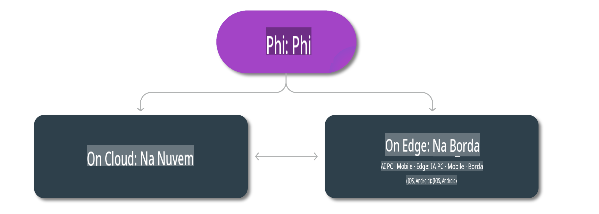

# Modelos Phi e Disponibilidade em Plataformas

## Cenários de Borda e Nuvem

## Disponibilidade de Modelos e Recursos

| | | | | | | | | |
|-|-|-|-|-|-|-|-|-|
|Modelo|Entrada|Comprimento do Conteúdo|Azure AI (MaaS)|Azure ML (MaaP)|ONNX|Hugging Face|Ollama|Nvidia NIM|
|Phi-3-vision-128k-instruct|Texto+Imagem|128k|[Playground e Implantação](https://ai.azure.com/explore/models/Phi-3-vision-128k-instruct/version/2/registry/azureml)|[Playground, Implantação e Ajuste Fino](https://ml.azure.com/registries/azureml/models/Phi-3-vision-128k-instruct/version/2)|[CUDA](https://huggingface.co/microsoft/Phi-3-vision-128k-instruct-onnx-cuda/tree/main),[CPU](https://huggingface.co/microsoft/Phi-3-vision-128k-instruct-onnx-cpu/tree/main), [DirectML](https://huggingface.co/microsoft/Phi-3-vision-128k-instruct-onnx-directml/tree/main)|[Download](https://huggingface.co/microsoft/Phi-3-vision-128k-instruct)|-NA-|[APIs NIM](https://build.nvidia.com/microsoft/phi-3-vision-128k-instruct)|
|Phi-3-mini-4k-instruct|Texto|4k|[Playground e Implantação](https://aka.ms/phi3-mini-4k-azure-ml)|[Playground, Implantação](https://aka.ms/phi3-mini-4k-azure-ml) e Ajuste Fino|[CUDA](https://huggingface.co/microsoft/Phi-3-mini-4k-instruct-onnx), [Web](https://huggingface.co/microsoft/Phi-3-mini-4k-instruct-onnx)|[Playground e Download](https://huggingface.co/chat/models/microsoft/Phi-3-mini-4k-instruct)|[GGUF](https://huggingface.co/microsoft/Phi-3-mini-4k-instruct-gguf)|[APIs NIM](https://build.nvidia.com/microsoft/phi-3-mini-4k)|
|Phi-3-mini-128k-instruct|Texto|128k|[Playground e Implantação](https://ai.azure.com/explore/models/Phi-3-mini-128k-instruct/version/9/registry/azureml)|[Playground, Implantação](https://ai.azure.com/explore/models/Phi-3-mini-128k-instruct/version/9/registry/azureml) e Ajuste Fino|[CUDA](https://huggingface.co/microsoft/Phi-3-mini-128k-instruct-onnx)|[Download](https://huggingface.co/microsoft/Phi-3-mini-128k-instruct-onnx)|-NA-|[APIs NIM](https://build.nvidia.com/microsoft/phi-3-mini)|
|Phi-3-small-8k-instruct|Texto|8k|[Playground e Implantação](https://ml.azure.com/registries/azureml/models/Phi-3-small-8k-instruct/version/2)|[Playground, Implantação](https://ai.azure.com/explore/models/Phi-3-small-8k-instruct/version/2/registry/azureml) e Ajuste Fino|[CUDA](https://huggingface.co/microsoft/Phi-3-small-8k-instruct-onnx-cuda)|[Download](https://huggingface.co/microsoft/Phi-3-small-8k-instruct-onnx-cuda)|-NA-|[APIs NIM](https://build.nvidia.com/microsoft/phi-3-small-8k-instruct?docker=false)|
|Phi-3-small-128k-instruct|Texto|128k|[Playground e Implantação](https://ai.azure.com/explore/models/Phi-3-small-128k-instruct/version/2/registry/azureml)|[Playground, Implantação](https://ml.azure.com/registries/azureml/models/Phi-3-small-128k-instruct/version/2) e Ajuste Fino|[CUDA](https://huggingface.co/microsoft/Phi-3-medium-128k-instruct-onnx-cuda)|[Download](https://huggingface.co/microsoft/Phi-3-small-128k-instruct)|-NA-|[APIs NIM](https://build.nvidia.com/microsoft/phi-3-small-128k-instruct?docker=false)|
|Phi-3-medium-4k-instruct|Texto|4k|[Playground e Implantação](https://huggingface.co/microsoft/Phi-3-medium-4k-instruct)|[Playground, Implantação](https://ml.azure.com/registries/azureml/models/Phi-3-medium-4k-instruct/version/2) e Ajuste Fino|[CUDA](https://huggingface.co/microsoft/Phi-3-medium-4k-instruct-onnx-cuda/tree/main), [CPU](https://huggingface.co/microsoft/Phi-3-medium-4k-instruct-onnx-cpu/tree/main), [DirectML](https://huggingface.co/microsoft/Phi-3-medium-4k-instruct-onnx-directml/tree/main)|[Baixar](https://huggingface.co/microsoft/Phi-3-medium-4k-instruct)|-NA-|[APIs NIM](https://build.nvidia.com/microsoft/phi-3-medium-4k-instruct?docker=false)|
|Phi-3-medium-128k-instruct|Texto|128k|[Playground e Implantação](https://ai.azure.com/explore/models/Phi-3-medium-128k-instruct/version/2)|[Playground, Implantação](https://ml.azure.com/registries/azureml/models/Phi-3-medium-128k-instruct/version/2) e Ajuste Fino|[CUDA](https://huggingface.co/microsoft/Phi-3-medium-128k-instruct-onnx-cuda/tree/main), [CPU](https://huggingface.co/microsoft/Phi-3-medium-128k-instruct-onnx-cpu/tree/main), [DirectML](https://huggingface.co/microsoft/Phi-3-medium-128k-instruct-onnx-directml/tree/main)|[Baixar](https://huggingface.co/microsoft/Phi-3-medium-128k-instruct)|-NA-|-NA-|

**Aviso Legal**:  
Este documento foi traduzido utilizando serviços de tradução automática baseados em IA. Embora nos esforcemos para garantir a precisão, esteja ciente de que traduções automatizadas podem conter erros ou imprecisões. O documento original em seu idioma nativo deve ser considerado a fonte oficial. Para informações críticas, recomenda-se a tradução profissional feita por humanos. Não nos responsabilizamos por quaisquer mal-entendidos ou interpretações incorretas decorrentes do uso desta tradução.