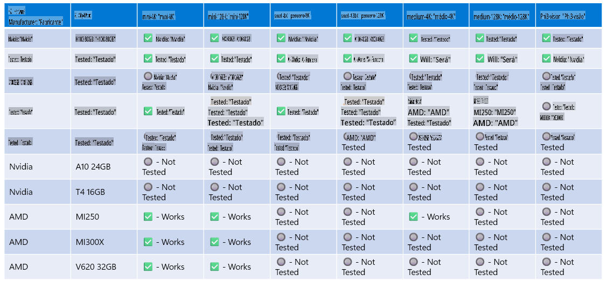

# Suporte de Hardware Phi

O Microsoft Phi foi otimizado para o ONNX Runtime e oferece suporte ao Windows DirectML. Ele funciona bem em diversos tipos de hardware, incluindo GPUs, CPUs e até dispositivos móveis.

## Hardware do Dispositivo
Especificamente, o hardware compatível inclui:

- GPU SKU: RTX 4090 (DirectML)
- GPU SKU: 1 A100 80GB (CUDA)
- CPU SKU: Standard F64s v2 (64 vCPUs, 128 GiB de memória)

## SKU para Dispositivos Móveis

- Android - Samsung Galaxy S21
- Apple iPhone 14 ou superior com Processador A16/A17

## Especificação de Hardware do Phi

- Configuração Mínima Necessária.
- Windows: GPU compatível com DirectX 12 e um mínimo de 4GB de RAM combinada

CUDA: GPU NVIDIA com Compute Capability >= 7.02



## Executando onnxruntime em múltiplas GPUs

Atualmente, os modelos ONNX Phi disponíveis são projetados para 1 GPU. É possível oferecer suporte a múltiplas GPUs para o modelo Phi, mas o ORT com 2 GPUs não garante maior throughput em comparação com 2 instâncias do ORT. Consulte [ONNX Runtime](https://onnxruntime.ai/) para as atualizações mais recentes.

No evento [Build 2024, a equipe GenAI ONNX](https://youtu.be/WLW4SE8M9i8?si=EtG04UwDvcjunyfC) anunciou que habilitou multi-instância em vez de multi-GPU para os modelos Phi.

No momento, isso permite que você execute uma instância do onnxruntime ou onnxruntime-genai com a variável de ambiente CUDA_VISIBLE_DEVICES assim:

```Python
CUDA_VISIBLE_DEVICES=0 python infer.py
CUDA_VISIBLE_DEVICES=1 python infer.py
```

Sinta-se à vontade para explorar mais sobre o Phi no [Azure AI Foundry](https://ai.azure.com)

**Aviso Legal**:  
Este documento foi traduzido utilizando serviços de tradução baseados em IA. Embora nos esforcemos para garantir a precisão, esteja ciente de que traduções automáticas podem conter erros ou imprecisões. O documento original em seu idioma nativo deve ser considerado a fonte oficial. Para informações críticas, recomenda-se a tradução profissional feita por humanos. Não nos responsabilizamos por quaisquer mal-entendidos ou interpretações equivocadas decorrentes do uso desta tradução.